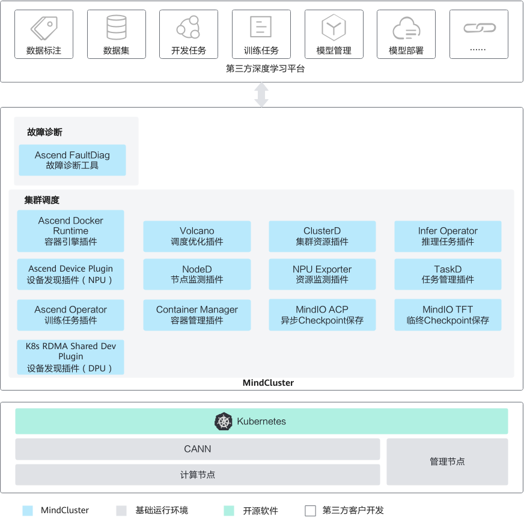

# MindCluster

 

 [![Zread](https://img.shields.io/badge/Zread-Ask_AI-_.svg?style=flat&color=0052D9&labelColor=000000&logo=data%3Aimage%2Fsvg%2Bxml%3Bbase64%2CPHN2ZyB3aWR0aD0iMTYiIGhlaWdodD0iMTYiIHZpZXdCb3g9IjAgMCAxNiAxNiIgZmlsbD0ibm9uZSIgeG1sbnM9Imh0dHA6Ly93d3cudzMub3JnLzIwMDAvc3ZnIj4KPHBhdGggZD0iTTQuOTYxNTYgMS42MDAxSDIuMjQxNTZDMS44ODgxIDEuNjAwMSAxLjYwMTU2IDEuODg2NjQgMS42MDE1NiAyLjI0MDFWNC45NjAxQzEuNjAxNTYgNS4zMTM1NiAxLjg4ODEgNS42MDAxIDIuMjQxNTYgNS42MDAxSDQuOTYxNTZDNS4zMTUwMiA1LjYwMDEgNS42MDE1NiA1LjMxMzU2IDUuNjAxNTYgNC45NjAxVjIuMjQwMUM1LjYwMTU2IDEuODg2NjQgNS4zMTUwMiAxLjYwMDEgNC45NjE1NiAxLjYwMDFaIiBmaWxsPSIjZmZmIi8%2BCjxwYXRoIGQ9Ik00Ljk2MTU2IDEwLjM5OTlIMi4yNDE1NkMxLjg4ODEgMTAuMzk5OSAxLjYwMTU2IDEwLjY4NjQgMS42MDE1NiAxMS4wMzk5VjEzLjc1OTlDMS42MDE1NiAxNC4xMTM0IDEuODg4MSAxNC4zOTk5IDIuMjQxNTYgMTQuMzk5OUg0Ljk2MTU2QzUuMzE1MDIgMTQuMzk5OSA1LjYwMTU2IDE0LjExMzQgNS42MDE1NiAxMy43NTk5VjExLjAzOTlDNS42MDE1NiAxMC42ODY0IDUuMzE1MDIgMTAuMzk5OSA0Ljk2MTU2IDEwLjM5OTlaIiBmaWxsPSIjZmZmIi8%2BCjxwYXRoIGQ9Ik0xMy43NTg0IDEuNjAwMUgxMS4wMzg0QzEwLjY4NSAxLjYwMDEgMTAuMzk4NCAxLjg4NjY0IDEwLjM5ODQgMi4yNDAxVjQuOTYwMUMxMC4zOTg0IDUuMzEzNTYgMTAuNjg1IDUuNjAwMSAxMS4wMzg0IDUuNjAwMUgxMy43NTg0QzE0LjExMTkgNS42MDAxIDE0LjM5ODQgNS4zMTM1NiAxNC4zOTg0IDQuOTYwMVYyLjI0MDFDMTQuMzk4NCAxLjg4NjY0IDE0LjExMTkgMS42MDAxIDEzLjc1ODQgMS42MDAxWiIgZmlsbD0iI2ZmZiIvPgo8cGF0aCBkPSJNNCAxMkwxMiA0TDQgMTJaIiBmaWxsPSIjZmZmIi8%2BCjxwYXRoIGQ9Ik00IDEyTDEyIDQiIHN0cm9rZT0iI2ZmZiIgc3Ryb2tlLXdpZHRoPSIxLjUiIHN0cm9rZS1saW5lY2FwPSJyb3VuZCIvPgo8L3N2Zz4K&logoColor=ffffff)](https://zread.ai/Ascend/mind-cluster)&nbsp;&nbsp;&nbsp;&nbsp;
 [![DeepWiki](https://img.shields.io/badge/DeepWiki-Ask_AI-_.svg?style=flat&color=0052D9&labelColor=000000&logo=data:image/png;base64,iVBORw0KGgoAAAANSUhEUgAAACwAAAAyCAYAAAAnWDnqAAAAAXNSR0IArs4c6QAAA05JREFUaEPtmUtyEzEQhtWTQyQLHNak2AB7ZnyXZMEjXMGeK/AIi+QuHrMnbChYY7MIh8g01fJoopFb0uhhEqqcbWTp06/uv1saEDv4O3n3dV60RfP947Mm9/SQc0ICFQgzfc4CYZoTPAswgSJCCUJUnAAoRHOAUOcATwbmVLWdGoH//PB8mnKqScAhsD0kYP3j/Yt5LPQe2KvcXmGvRHcDnpxfL2zOYJ1mFwrryWTz0advv1Ut4CJgf5uhDuDj5eUcAUoahrdY/56ebRWeraTjMt/00Sh3UDtjgHtQNHwcRGOC98BJEAEymycmYcWwOprTgcB6VZ5JK5TAJ+fXGLBm3FDAmn6oPPjR4rKCAoJCal2eAiQp2x0vxTPB3ALO2CRkwmDy5WohzBDwSEFKRwPbknEggCPB/imwrycgxX2NzoMCHhPkDwqYMr9tRcP5qNrMZHkVnOjRMWwLCcr8ohBVb1OMjxLwGCvjTikrsBOiA6fNyCrm8V1rP93iVPpwaE+gO0SsWmPiXB+jikdf6SizrT5qKasx5j8ABbHpFTx+vFXp9EnYQmLx02h1QTTrl6eDqxLnGjporxl3NL3agEvXdT0WmEost648sQOYAeJS9Q7bfUVoMGnjo4AZdUMQku50McDcMWcBPvr0SzbTAFDfvJqwLzgxwATnCgnp4wDl6Aa+Ax283gghmj+vj7feE2KBBRMW3FzOpLOADl0Isb5587h/U4gGvkt5v60Z1VLG8BhYjbzRwyQZemwAd6cCR5/XFWLYZRIMpX39AR0tjaGGiGzLVyhse5C9RKC6ai42ppWPKiBagOvaYk8lO7DajerabOZP46Lby5wKjw1HCRx7p9sVMOWGzb/vA1hwiWc6jm3MvQDTogQkiqIhJV0nBQBTU+3okKCFDy9WwferkHjtxib7t3xIUQtHxnIwtx4mpg26/HfwVNVDb4oI9RHmx5WGelRVlrtiw43zboCLaxv46AZeB3IlTkwouebTr1y2NjSpHz68WNFjHvupy3q8TFn3Hos2IAk4Ju5dCo8B3wP7VPr/FGaKiG+T+v+TQqIrOqMTL1VdWV1DdmcbO8KXBz6esmYWYKPwDL5b5FA1a0hwapHiom0r/cKaoqr+27/XcrS5UwSMbQAAAABJRU5ErkJggg==)](https://deepwiki.com/Ascend/mind-cluster)

- [最新消息](#最新消息)
- [简介](#简介)
- [版本说明](#版本说明)
- [兼容性信息](#兼容性信息)
- [用户指南](#用户指南)
- [特性介绍](#特性介绍)
- [编译指南](#编译指南)
- [FAQ](#faq)
- [安全声明](#安全声明)
- [分支维护策略](#分支维护策略)
- [版本维护策略](#版本维护策略)
- [免责声明](#免责声明)
- [License](#license)
- [贡献声明](#贡献声明)
- [建议与交流](#建议与交流)

# 最新消息

- [2026.04.15]: 🚀 支持故障后处理策略配置
- [2026.04.15]: 🚀 支持A2\A3设备的软切分
- [2026.04.15]: 🚀 推理支持交换机亲和性
- [2026.04.15]: 🚀 RoCE网络故障隔离和恢复机制增强
- [2026.04.15]: 🚀 人工隔离芯片准确性增强
- [2026.04.15]: 🚀 支持天工组网亲和性调度
- [2026.04.15]: 🚀 支持隔离芯片自动解除隔离
- [2026.04.15]: 🚀 支持任务调度异常原因统计
- [2026.04.15]: 🚀 支持A2\A3设备的硬切分
- [2026.04.15]: 🚀 npu-exporter支持根据文件上报自定义指标

# 简介

MindCluster（AI集群系统软件）是支持NPU（昇腾AI处理器）训练和推理硬件的深度学习组件，使能构建集群全流程运行，提供NPU集群作业调度、运维监测、故障恢复等功能。深度学习平台开发厂商可以减少底层资源调度相关软件开发工作量，快速使能合作伙伴基于MindCluster开发深度学习平台。

# 版本说明

MindCluster版本配套详情请参考：[版本配套详情](/docs/zh/release_notes.md)

# 兼容性信息

MindCluster基础调度特性与断点续训特性支持的框架：Pytorch、MindSpore。

# 用户指南

## MindCluster集群调度

MindCluster将以单台Atlas 800T A2 训练服务器（同时作为管理节点和计算节点）为例，指导开发者快速完成NodeD、Ascend Device Plugin、Ascend Docker Runtime、Volcano、ClusterD、Ascend Operator组件的安装及使用整卡调度特性快速下发训练任务。具体操作请参考：[集群调度用户指南](./docs/zh/scheduling/menu_scheduling_user_guide.md)。

## MindCluster Ascend FaultDiag 故障诊断工具

- 日志故障诊断工具

Ascend FaultDiag（日志故障诊断工具，简称 ascend-fd）是一款面向昇腾（Ascend）AI 集群的日志诊断工具，提供日志清洗、故障诊断两大核心功能。

当训练或推理任务发生异常退出或性能劣化时，ascend-fd 可自动提取集群日志中的关键信息，分析故障根因节点和故障事件，帮助用户快速定位问题。具体操作请参考：[日志故障诊断工具用户指南](./docs/zh/faultdiag/ascend-faultdiag/menu_ascend_faultdiag_user_guide.md)。

- 链路故障诊断工具

Ascend FaultDiag Toolkit（链路故障诊断工具）是面向昇腾 AI 集群的链路故障诊断工具。

工具提供交互式与非交互式两种操作模式，具备在线数据自动采集与离线日志清洗两种数据处理能力，可完成集群设备信息采集与自动化巡检诊断，通过服务器、L1/L2 灵衢交换机、RoCE 交换机及 BMC 信息定位集群的链路故障。具体操作请参考：[链路故障诊断工具用户指南](./docs/zh/faultdiag/ascend-faultdiag-toolkit/menu_ascend-faultdiag-toolkit.md)。

# 编译指南

组件编译请参考：[编译指南](build/README.md)

# 特性介绍

MindCluster具体特性介绍如下：

## MindCluster集群调度

| 特性名称       | 介绍                                                                                                            | Released |
|------------|---------------------------------------------------------------------------------------------------------------|----------|
| 容器化支持特性    | [容器化支持特性](./docs/zh/scheduling/04_usage/00_containerization/00_before_you_start.md) | ✅ |
| 资源监测特性     | [资源监测特性](./docs/zh/scheduling/04_usage/01_resource_monitoring/00_before_you_start.md)                                                                                                 | ✅ |
| 虚拟化实例特性    | [虚拟化实例特性](./docs/zh/scheduling/04_usage/02_virtual_instance/00_virtual_instance_with_hdk/01_description.md)                                                                                                  | ✅ |
| 基础调度特性     | [基础调度特性](./docs/zh/scheduling/04_usage/03_basic_scheduling/00_feature_description.md)                                                                                                    | ✅ |
| 断点续训特性     |[断点续训特性](./docs/zh/scheduling/04_usage/04_resumable_training/00_feature_description.md)                                                                                                  | ✅ |
| 一体机特性     |[一体机特性](./docs/zh/scheduling/04_usage/05_appliance/01_npu_hardware_fault_detection_and_rectification.md)                                                                                                  | ✅ |
| MindIE Motor推理任务最佳实践 |[MindIE Motor推理任务最佳实践](./docs/zh/scheduling/04_usage/06_mindie_motor_best_practice/00_before_you_start.md)   | ✅ |
| SGLang推理任务最佳实践 |[SGLang推理任务最佳实践](./docs/zh/scheduling/04_usage/07_sglang_best_practice/00_before_you_start.md)   | ✅ |
| vLLM推理任务最佳实践 |[vLLM推理任务最佳实践](./docs/zh/scheduling/04_usage/08_vllm_best_practice/00_before_you_start.md)   | ✅ |
| Infer Operator推理任务最佳实践 |[Infer Operator推理任务最佳实践](./docs/zh/scheduling/04_usage/09_infer_operator_best_practice/00_before_you_start.md)   | ✅ |
| 潮汐调度最佳实践 |[潮汐调度最佳实践](./docs/zh/scheduling/04_usage/10_tidal_scheduling/00_before_you_start.md)   | ✅ |

## MindCluster Ascend FaultDiag 故障诊断工具

- 日志故障诊断工具

| 特性名称                  | 介绍                                                                                                           | Released |
|---------------------------|----------------------------------------------------------------------------------------------------------------|----------|
| 日志清洗                  | [日志清洗](./docs/zh/faultdiag/ascend-faultdiag/05_usage/03_log_parsing.md)                                    | ✅        |
| 故障诊断                  | [故障诊断](./docs/zh/faultdiag/ascend-faultdiag/05_usage/04_fault_diagnosis.md)                                | ✅        |
| 单机故障诊断              | [单机故障诊断](./docs/zh/faultdiag/ascend-faultdiag/05_usage/05_single_server_diagnosis.md)                    | ✅        |
| 超节点故障诊断            | [超节点故障诊断](./docs/zh/faultdiag/ascend-faultdiag/05_usage/06_superpod_diagnosis.md)                       | ✅        |
| 自定义故障实体            | [自定义故障实体](./docs/zh/faultdiag/ascend-faultdiag/05_usage/07_custom_fault_entities.md)                    | ✅        |
| 屏蔽故障日志              | [屏蔽故障日志](./docs/zh/faultdiag/ascend-faultdiag/05_usage/08_fault_log_masking.md)                          | ✅        |
| 自定义配置文件            | [自定义配置文件](./docs/zh/faultdiag/ascend-faultdiag/05_usage/09_custom_configuration.md)                     | ✅        |
| 业务日志清洗（SDK）       | [业务日志清洗（SDK）](./docs/zh/faultdiag/ascend-faultdiag/05_usage/10_service_flow_parsing.md)                | ✅        |
| 根因节点清洗及诊断（SDK） | [根因节点清洗及诊断（SDK）](./docs/zh/faultdiag/ascend-faultdiag/05_usage/11_root_cause_parsing_diagnosis.md)  | ✅        |
| 故障事件清洗及诊断（SDK） | [故障事件清洗及诊断（SDK）](./docs/zh/faultdiag/ascend-faultdiag/05_usage/12_fault_event_parsing_diagnosis.md) | ✅        |

- 链路故障诊断工具

| 特性名称            | 介绍                                                                                                     | Released |
|---------------------|----------------------------------------------------------------------------------------------------------|----------|
| 日志采集            | [日志采集](./docs/zh/faultdiag/ascend-faultdiag-toolkit/05_usage/02_log_collection.md)                   | ✅        |
| 日志清洗            | [日志清洗](./docs/zh/faultdiag/ascend-faultdiag-toolkit/05_usage/03_log_parse.md)                        | ✅        |
| 故障诊断            | [故障诊断](./docs/zh/faultdiag/ascend-faultdiag-toolkit/05_usage/04_fault_diagnosis.md)                  | ✅        |
| 故障巡检            | [故障巡检](./docs/zh/faultdiag/ascend-faultdiag-toolkit/05_usage/05_fault_inspection.md)                 | ✅        |
| 诊断 / 巡检报告说明 | [诊断 / 巡检报告说明](./docs/zh/faultdiag/ascend-faultdiag-toolkit/05_usage/06_fault_analysis_report.md) | ✅        |
| 在线诊断            | [在线诊断](./docs/zh/faultdiag/ascend-faultdiag-toolkit/05_usage/07_online_diagnosis.md)                 | ✅        |
| 离线诊断            | [离线诊断](./docs/zh/faultdiag/ascend-faultdiag-toolkit/05_usage/08_offline_diagnosis.md)                | ✅        |
| 分批诊断            | [分批诊断](./docs/zh/faultdiag/ascend-faultdiag-toolkit/05_usage/09_batch_diagnosis.md)                  | ✅        |
| 客户定制化巡检      | [客户定制化巡检](./docs/zh/faultdiag/ascend-faultdiag-toolkit/05_usage/10_customized_inspection.md)      | ✅        |

# FAQ

MindCluster集群调度相关FAQ请参见：[FAQ](./docs/zh/scheduling/07_references/03_faq.md)。

MindCluster Ascend FaultDiag 日志故障诊断工具相关FAQ请参见：[FAQ](./docs/zh/faultdiag/ascend-faultdiag/07_references/02_faq.md)。

MindCluster Ascend FaultDiag Toolkit 链路故障诊断工具相关FAQ请参见：[FAQ](./docs/zh/faultdiag/ascend-faultdiag-toolkit/07_references/01_faq.md)。

# 安全声明

## MindCluster集群调度

- 当前容器方式部署本组件，本组件的认证鉴权方式为ServiceAccount，该认证鉴权方式为ServiceAccount的token明文显示，建议用户自行进行安全加强。
- 当前特权容器方式部署，该容器权限具有一定风险，建议用户自行进行安全加强。
- 其他安全声明详见：[安全声明](./docs/zh/scheduling/07_references/04_security_hardening.md)
- 通信矩阵详见：[通信矩阵](https://gitcode.com/Ascend/mind-cluster/wiki/Home.md)
- 公网地址详见：[公网地址](./docs/zh/resource/MindCluster%2026.0.0%20公网地址.xlsx)

## MindCluster Ascend FaultDiag 故障诊断工具

- 安全声明详见：[安全声明](./docs/zh/faultdiag/ascend-faultdiag/07_references/03_security.md)
- 公网地址详见：[公网地址](./docs/zh/resource/MindCluster%2026.0.0%20Ascend%20FaultDiag公网地址.xlsx)

# 分支维护策略

版本分支的维护阶段如下：

| 状态          | 时间     | 说明                                                      |
|-------------|--------|---------------------------------------------------------|
| 计划          | 1-3个月  | 计划特性                                                    |
| 开发          | 3个月    | 开发新特性并修复问题，定期发布新版本                                      |
| 维护          | 3-12个月 | 常规分支维护3个月，长期支持分支维护12个月。对重大BUG进行修复，不合入新特性，并视BUG的影响发布补丁版本 |
| 生命周期终止（EOL） | N/A    | 分支不再接受任何修改                                              |

# 版本维护策略

| 版本       | 维护策略 | 当前状态 | 发布日期       | 后续状态               | EOL日期      |
|----------|------|------|------------|--------------------|------------|
| master   | 长期支持 | 开发   | 在研分支，不发布   |         | -          |
| v26.0.0   | 常规分支 | 维护   | 2026-04-15   |         | 2026-07-15          |
| v7.3.0   | 长期支持 | 维护   | 2026-01-13   |         | 2026-12-30        |
| v7.2.RC1 | 常规分支 | 维护   | 2025-10-25 | 预计2026/1/25起进入无维护状态 | 2025-10-27 |
| v7.1.RC1 | 常规分支 | EOL   | 2025-07-24 |           | 2025-10-24 |
| v7.0.RC1 | 常规分支 | EOL   | 2025-04-27 |           | 2025-07-27 |
| v6.0.0   | 长期支持 | 维护   | 2024-12-31 | 预计2025-12-31起进入无维护状态         |            |
| v6.0.RC3 | 常规分支 | EOL   | 2024-11-20 |           | 2025-02-20 |
| v6.0.RC2 | 常规分支 | EOL   | 2024-11-20 |           | 2025-02-20 |
| v6.0.RC1 | 常规分支 | EOL   | 2024-11-20 |          | 2025-02-20 |
| v5.0.0   | 长期支持 | EOL  | 2023-11-20 |           | 2024-11-20 |

# 免责声明

- 本仓库代码中包含多个开发分支，这些分支可能包含未完成、实验性或未测试的功能。在正式发布前，这些分支不应被应用于任何生产环境或者依赖关键业务的项目中。请务必使用我们的正式发行版本，以确保代码的稳定性和安全性。
  使用开发分支所导致的任何问题、损失或数据损坏，本项目及其贡献者概不负责。
- 正式版本请参考release版本 <https://gitcode.com/ascend/mind-cluster/releases>

# License

MindCluster以Apache 2.0许可证许可，对应许可证文本可查阅[LICENSE文件](https://gitcode.com/Ascend/mind-cluster/blob/master/LICENSE)。

介绍MindCluster docs目录下的文档适用CC-BY 4.0许可证，具体请参见[LICENSE文件](./docs/LICENSE)。

# 贡献声明

- 贡献前，请先签署[开放项目贡献者许可协议（CLA）](https://clasign.osinfra.cn/sign/gitee_ascend-1611222220829317930)。
- 如果您遇到bug，请提交[issue](https://gitcode.com/Ascend/mind-cluster/issues)。
- 如果您计划贡献bug-fixes，请提交Pull Requests，参见[具体要求](https://gitcode.com/Ascend/mind-cluster/blob/master/contributing.md#PullRequest)。
- 如果您计划贡献新特性、功能，请先创建issue与我们讨论。写明需求背景/目的，如何设计，对现有API等的影响。未经讨论提交PR可能会导致请求被拒绝，因为项目演进方向可能与您的想法存在偏差。
- 更详细的贡献流程，请参考[贡献指南](https://gitcode.com/Ascend/mind-cluster/blob/master/contributing.md)。

# 建议与交流

欢迎大家为社区做贡献。如果有任何疑问或建议，请提交[issue](https://gitcode.com/Ascend/mind-cluster/issues)，我们会尽快回复。感谢您的支持。
