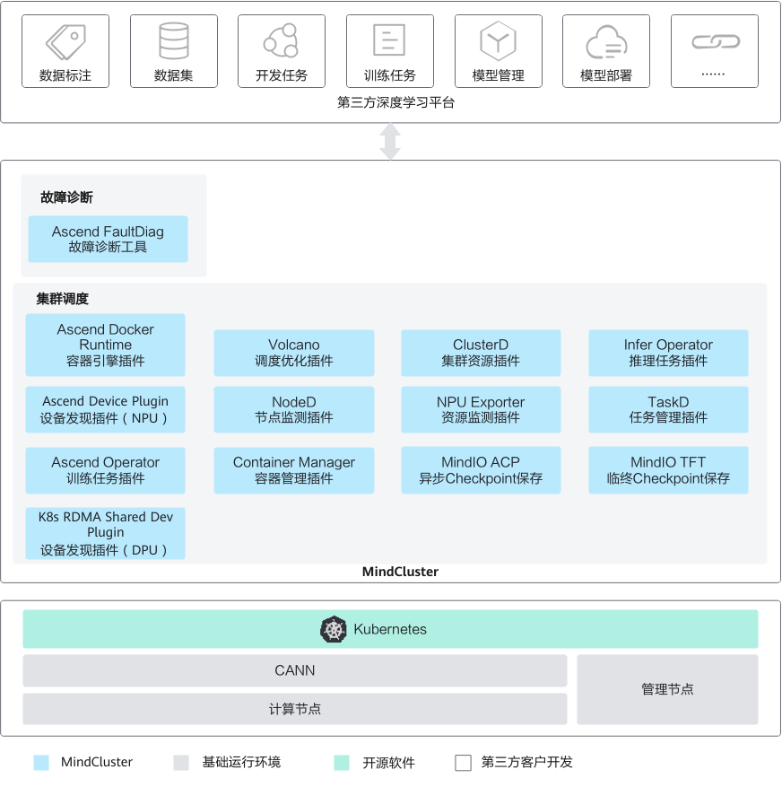

<h1 align="center">MindCluster</h1>

 

 
 
 [![Zread](https://img.shields.io/badge/Zread-Ask_AI-_.svg?style=flat&color=0052D9&labelColor=000000&logo=data%3Aimage%2Fsvg%2Bxml%3Bbase64%2CPHN2ZyB3aWR0aD0iMTYiIGhlaWdodD0iMTYiIHZpZXdCb3g9IjAgMCAxNiAxNiIgZmlsbD0ibm9uZSIgeG1sbnM9Imh0dHA6Ly93d3cudzMub3JnLzIwMDAvc3ZnIj4KPHBhdGggZD0iTTQuOTYxNTYgMS42MDAxSDIuMjQxNTZDMS44ODgxIDEuNjAwMSAxLjYwMTU2IDEuODg2NjQgMS42MDE1NiAyLjI0MDFWNC45NjAxQzEuNjAxNTYgNS4zMTM1NiAxLjg4ODEgNS42MDAxIDIuMjQxNTYgNS42MDAxSDQuOTYxNTZDNS4zMTUwMiA1LjYwMDEgNS42MDE1NiA1LjMxMzU2IDUuNjAxNTYgNC45NjAxVjIuMjQwMUM1LjYwMTU2IDEuODg2NjQgNS4zMTUwMiAxLjYwMDEgNC45NjE1NiAxLjYwMDFaIiBmaWxsPSIjZmZmIi8%2BCjxwYXRoIGQ9Ik00Ljk2MTU2IDEwLjM5OTlIMi4yNDE1NkMxLjg4ODEgMTAuMzk5OSAxLjYwMTU2IDEwLjY4NjQgMS42MDE1NiAxMS4wMzk5VjEzLjc1OTlDMS42MDE1NiAxNC4xMTM0IDEuODg4MSAxNC4zOTk5IDIuMjQxNTYgMTQuMzk5OUg0Ljk2MTU2QzUuMzE1MDIgMTQuMzk5OSA1LjYwMTU2IDE0LjExMzQgNS42MDE1NiAxMy43NTk5VjExLjAzOTlDNS42MDE1NiAxMC42ODY0IDUuMzE1MDIgMTAuMzk5OSA0Ljk2MTU2IDEwLjM5OTlaIiBmaWxsPSIjZmZmIi8%2BCjxwYXRoIGQ9Ik0xMy43NTg0IDEuNjAwMUgxMS4wMzg0QzEwLjY4NSAxLjYwMDEgMTAuMzk4NCAxLjg4NjY0IDEwLjM5ODQgMi4yNDAxVjQuOTYwMUMxMC4zOTg0IDUuMzEzNTYgMTAuNjg1IDUuNjAwMSAxMS4wMzg0IDUuNjAwMUgxMy43NTg0QzE0LjExMTkgNS42MDAxIDE0LjM5ODQgNS4zMTM1NiAxNC4zOTg0IDQuOTYwMVYyLjI0MDFDMTQuMzk4NCAxLjg4NjY0IDE0LjExMTkgMS42MDAxIDEzLjc1ODQgMS42MDAxWiIgZmlsbD0iI2ZmZiIvPgo8cGF0aCBkPSJNNCAxMkwxMiA0TDQgMTJaIiBmaWxsPSIjZmZmIi8%2BCjxwYXRoIGQ9Ik00IDEyTDEyIDQiIHN0cm9rZT0iI2ZmZiIgc3Ryb2tlLXdpZHRoPSIxLjUiIHN0cm9rZS1saW5lY2FwPSJyb3VuZCIvPgo8L3N2Zz4K&logoColor=ffffff)](https://zread.ai/Ascend/mind-cluster)&nbsp;&nbsp;&nbsp;&nbsp;
 [![DeepWiki](https://img.shields.io/badge/DeepWiki-Ask_AI-_.svg?style=flat&color=0052D9&labelColor=000000&logo=)](https://deepwiki.com/Ascend/mind-cluster)

## ✨ 最新消息

- [2026.08.01]: 🚀 MindCluster易用性提升
- [2026.08.01]: 🚀 社区volcano兼容性提升
- [2026.08.01]: 🚀 监控易用性可靠性提升
- [2026.08.01]: 🚀 支持DPU设备发现与故障上报
- [2026.08.01]: 🚀 支持A5软切分、支持A2/A3动态硬切分
- [2026.08.01]: 🚀 支持DP故障处理插件化
- [2026.08.01]: 🚀 A5硬件适配
- [2026.08.01]: 🚀 支持推理场景自定义资源弹性扩缩容能力
- [2026.08.01]: 🚀 支持容器快照能力，加速业务故障恢复

## ℹ️ 简介

MindCluster（AI集群系统软件）是支持NPU（昇腾AI处理器）训练和推理硬件的深度学习组件，使能构建集群全流程运行，提供NPU集群作业调度、运维监测、故障恢复等功能。深度学习平台开发厂商可以减少底层资源调度相关软件开发工作量，快速使能合作伙伴基于MindCluster开发深度学习平台。此外还提供了故障诊断工具（又叫Ascend FaultDiag），包含日志诊断工具（简称 ascend-fd）和链路诊断工具（简称 ascend-fd-tk），能够对集群作业失败、链路故障等问题提供诊断结果。

## ⚙️ 功能介绍

**集群调度**

| 特性名称                       | 介绍                                                         | Released |
| ------------------------------ | ------------------------------------------------------------ | -------- |
| 容器化支持特性                 | [容器化支持特性](./docs/zh/scheduling/04_usage/00_containerization/00_before_you_start.md) | ✅        |
| 资源监测特性                   | [资源监测特性](./docs/zh/scheduling/04_usage/01_resource_monitoring/00_before_you_start.md) | ✅        |
| 虚拟化实例特性                 | [虚拟化实例特性](./docs/zh/scheduling/04_usage/02_virtual_instance/00_virtual_instance_with_hdk/01_description.md) | ✅        |
| 基础调度特性                   | [基础调度特性](./docs/zh/scheduling/04_usage/03_basic_scheduling/00_feature_description.md) | ✅        |
| 断点续训特性                   | [断点续训特性](./docs/zh/scheduling/04_usage/04_resumable_training/00_feature_description.md) | ✅        |
| 一体机特性                     | [一体机特性](./docs/zh/scheduling/04_usage/05_appliance/01_npu_hardware_fault_detection_and_rectification.md) | ✅        |
| MindIE Motor推理任务最佳实践   | [MindIE Motor推理任务最佳实践](./docs/zh/scheduling/04_usage/06_mindie_motor_best_practice/00_before_you_start.md) | ✅        |
| SGLang推理任务最佳实践         | [SGLang推理任务最佳实践](./docs/zh/scheduling/04_usage/07_sglang_best_practice/00_before_you_start.md) | ✅        |
| vLLM推理任务最佳实践           | [vLLM推理任务最佳实践](./docs/zh/scheduling/04_usage/08_vllm_best_practice/00_before_you_start.md) | ✅        |
| Infer Operator推理任务最佳实践 | [Infer Operator推理任务最佳实践](./docs/zh/scheduling/04_usage/09_infer_operator_best_practice/00_before_you_start.md) | ✅        |
| 潮汐调度最佳实践               | [潮汐调度最佳实践](./docs/zh/scheduling/04_usage/10_tidal_scheduling/00_before_you_start.md) | ✅        |

**故障诊断**

- 日志诊断工具

| 特性名称                  | 介绍                                                         | Released |
| ------------------------- | ------------------------------------------------------------ | -------- |
| 日志清洗                  | [日志清洗](./docs/zh/faultdiag/ascend-faultdiag/05_usage/03_log_parsing.md) | ✅        |
| 故障诊断                  | [故障诊断](./docs/zh/faultdiag/ascend-faultdiag/05_usage/04_fault_diagnosis.md) | ✅        |
| 单机故障诊断              | [单机故障诊断](./docs/zh/faultdiag/ascend-faultdiag/05_usage/05_single_server_diagnosis.md) | ✅        |
| 超节点故障诊断            | [超节点故障诊断](./docs/zh/faultdiag/ascend-faultdiag/05_usage/06_superpod_diagnosis.md) | ✅        |
| 自定义故障实体            | [自定义故障实体](./docs/zh/faultdiag/ascend-faultdiag/05_usage/07_custom_fault_entities.md) | ✅        |
| 屏蔽故障日志              | [屏蔽故障日志](./docs/zh/faultdiag/ascend-faultdiag/05_usage/08_fault_log_masking.md) | ✅        |
| 自定义配置文件            | [自定义配置文件](./docs/zh/faultdiag/ascend-faultdiag/05_usage/09_custom_configuration.md) | ✅        |
| 业务日志清洗（SDK）       | [业务日志清洗（SDK）](./docs/zh/faultdiag/ascend-faultdiag/05_usage/10_service_flow_parsing.md) | ✅        |
| 根因节点清洗及诊断（SDK） | [根因节点清洗及诊断（SDK）](./docs/zh/faultdiag/ascend-faultdiag/05_usage/11_root_cause_parsing_diagnosis.md) | ✅        |
| 故障事件清洗及诊断（SDK） | [故障事件清洗及诊断（SDK）](./docs/zh/faultdiag/ascend-faultdiag/05_usage/12_fault_event_parsing_diagnosis.md) | ✅        |

- 链路诊断工具

| 特性名称            | 介绍                                                         | Released |
| ------------------- | ------------------------------------------------------------ | -------- |
| 日志采集            | [日志采集](./docs/zh/faultdiag/ascend-faultdiag-toolkit/05_usage/02_log_collection.md) | ✅        |
| 日志清洗            | [日志清洗](./docs/zh/faultdiag/ascend-faultdiag-toolkit/05_usage/03_log_parse.md) | ✅        |
| 故障诊断            | [故障诊断](./docs/zh/faultdiag/ascend-faultdiag-toolkit/05_usage/04_fault_diagnosis.md) | ✅        |
| 故障巡检            | [故障巡检](./docs/zh/faultdiag/ascend-faultdiag-toolkit/05_usage/05_fault_inspection.md) | ✅        |
| 诊断 / 巡检报告说明 | [诊断 / 巡检报告说明](./docs/zh/faultdiag/ascend-faultdiag-toolkit/05_usage/06_fault_analysis_report.md) | ✅        |
| 在线诊断            | [在线诊断](./docs/zh/faultdiag/ascend-faultdiag-toolkit/05_usage/07_online_diagnosis.md) | ✅        |
| 离线诊断            | [离线诊断](./docs/zh/faultdiag/ascend-faultdiag-toolkit/05_usage/08_offline_diagnosis.md) | ✅        |
| 分批诊断            | [分批诊断](./docs/zh/faultdiag/ascend-faultdiag-toolkit/05_usage/09_batch_diagnosis.md) | ✅        |
| 客户定制化巡检      | [客户定制化巡检](./docs/zh/faultdiag/ascend-faultdiag-toolkit/05_usage/10_customized_inspection.md) | ✅        |

## 🚀 快速入门

**集群调度**

MindCluster提供两种快速入门路径：

- **10分钟快速入门**：仅部署Ascend Device Plugin和Ascend Docker Runtime，使用Kubernetes原生调度器调度普通Pod，快速验证NPU资源调度能力。
- **训练业务快速入门**：部署完整的集群调度组件（NodeD、Ascend Device Plugin、Ascend Docker Runtime、Volcano、ClusterD、Ascend Operator），以PyTorch训练任务为例，体验端到端的训练流程。

详细操作请参考：[快速入门](./docs/zh/scheduling/02_quick_start/quick_start.md)

**故障诊断**

- 日志诊断工具提供了一个简单的样例，快速体验工具能力，详情可参考[快速入门](./docs/zh/faultdiag/ascend-faultdiag/03_quick_start/quick_start.md)。
- 链路诊断工具提供了一个简单的样例，快速体验工具能力，详情可参考[快速入门](./docs/zh/faultdiag/ascend-faultdiag-toolkit/03_quick_start/quick_start.md)。

## 📦 安装指南

**集群调度**

支持多种安装方式：

- **使用Helm安装（推荐）**：通过Helm Chart一键部署集群调度组件。
- **手动安装**：分步安装各组件，适合自定义配置场景。
- **使用工具安装**：通过自动化工具快速完成安装部署。

安装前请阅读[安装前必读](./docs/zh/scheduling/03_installation_guide/00_before_you_start.md)和[环境依赖](./docs/zh/scheduling/03_installation_guide/01_environment_dependencies.md)，详细操作请参考：[安装指南](./docs/zh/scheduling/03_installation_guide/menu_installation_guide.md)。

**故障诊断**

- 日志诊断工具提供了源码安装和Whl包安装的方式，详情可参考对应的[安装部署](./docs/zh/faultdiag/ascend-faultdiag/04_installation_guide/01_installation.md)。
- 链路诊断工具提供了源码安装和Whl包安装的方式，详情可参考对应的[安装部署](./docs/zh/faultdiag/ascend-faultdiag-toolkit/04_installation_guide/01_installation.md)。

## 📘 使用指南

**集群调度**

MindCluster提供了环境安装部署（支持Helm、手动、工具等多种安装方式）、容器化支持、资源监测、虚拟化实例（vNPU）、调度特性（整卡调度、亲和性调度、多级调度等）、断点续训、潮汐调度等特性指南，以及MindIE Motor、SGLang、vLLM、Infer Operator等多种推理框架的最佳实践。具体操作请参考：[集群调度用户指南](./docs/zh/scheduling/menu_scheduling_user_guide.md)。

**故障诊断**

- 日志诊断工具提供日志清洗、故障诊断两大核心功能。当训练或推理任务发生异常退出或性能劣化时，ascend-fd 可自动提取集群日志中的关键信息，分析故障根因节点和故障事件，帮助用户快速定位问题。具体操作请参考：[日志诊断工具特性指南](./docs/zh/faultdiag/ascend-faultdiag/menu_ascend_faultdiag_user_guide.md)。
- 链路诊断工具提供交互式与非交互式两种操作模式，具备在线数据自动采集与离线日志清洗两种数据处理能力，可完成集群设备信息采集与自动化巡检诊断，通过服务器、L1/L2 灵衢交换机、RoCE 交换机及 BMC 信息定位集群的链路故障。具体操作请参考：[链路诊断工具特性指南](./docs/zh/faultdiag/ascend-faultdiag-toolkit/menu_ascend-faultdiag-toolkit.md)。

## 🗺️ Roadmap

[Roadmap (2026Q2)](https://gitcode.com/Ascend/mind-cluster/issues/471)

## 🔀 版本维护策略

版本分支的维护阶段如下：

| 状态                | 时间    | 说明                                                         |
| ------------------- | ------- | ------------------------------------------------------------ |
| 计划                | 1-3个月 | 计划特性                                                     |
| 开发                | 3个月   | 开发新特性并修复问题，定期发布新版本                         |
| 维护                | 6个月   | 常规分支维护6个月。对重大BUG进行修复，不合入新特性，并视BUG的影响发布补丁版本 |
| 生命周期终止（EOL） | N/A     | 分支不再接受任何修改                                         |

当前版本维护策略如下：

| 版本     | 维护策略 | 当前状态 | 发布日期         | 后续状态                       | EOL日期    |
| -------- | -------- | -------- | ---------------- | ------------------------------ | ---------- |
| master   | 长期支持 | 开发     | 在研分支，不发布 |                                | -          |
| v26.1.0  | 常规分支 | 维护     | 2026-08-03       |                                | 2027-02-03 |
| v26.0.0  | 常规分支 | 维护     | 2026-04-15       |                                | 2026-10-15 |
| v7.3.0   | 长期支持 | 维护     | 2026-01-13       |                                | 2026-12-30 |
| v7.2.RC1 | 常规分支 | 维护     | 2025-10-25       | 预计2026/1/25起进入无维护状态  | 2025-10-27 |
| v7.1.RC1 | 常规分支 | EOL      | 2025-07-24       |                                | 2025-10-24 |
| v7.0.RC1 | 常规分支 | EOL      | 2025-04-27       |                                | 2025-07-27 |
| v6.0.0   | 长期支持 | 维护     | 2024-12-31       | 预计2025-12-31起进入无维护状态 |            |
| v6.0.RC3 | 常规分支 | EOL      | 2024-11-20       |                                | 2025-02-20 |
| v6.0.RC2 | 常规分支 | EOL      | 2024-11-20       |                                | 2025-02-20 |
| v6.0.RC1 | 常规分支 | EOL      | 2024-11-20       |                                | 2025-02-20 |
| v5.0.0   | 长期支持 | EOL      | 2023-11-20       |                                | 2024-11-20 |

## 🛠️ 贡献指南

- 详细的贡献流程，请参考[贡献指南](CONTRIBUTING.md)。

## ⚖️ 相关说明

🔹 《[版本说明](./docs/zh/release_notes.md)》 
🔹 《[许可证声明](LICENSE)》 
🔹 《[文档许可证声明](./docs/LICENSE)》 
🔹 《[第三方开源软件声明](Third_Party_Open_Source_Software_Notice.md)》

## 🤝 建议与交流

欢迎大家为社区做贡献。如果有任何疑问或建议，请提交[issue](https://gitcode.com/Ascend/mind-cluster/issues)，我们会尽快回复。感谢您的支持。
