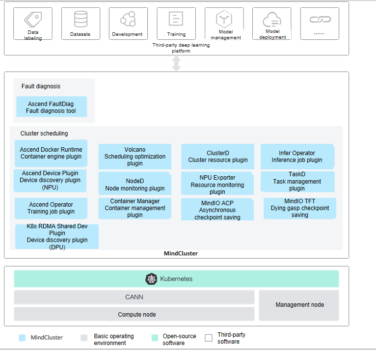

# MindCluster

<!-- md-trans-meta sourceCommit=6629613e859606a634c3f8ed1c9faa3dde7a5962 translatedAt=2026-08-25T01:34:34.012Z pushedAt=2026-08-25T01:52:12.276Z -->

 

 [![Zread](https://img.shields.io/badge/Zread-Ask_AI-_.svg?style=flat&color=0052D9&labelColor=000000&logo=data%3Aimage%2Fsvg%2Bxml%3Bbase64%2CPHN2ZyB3aWR0aD0iMTYiIGhlaWdodD0iMTYiIHZpZXdCb3g9IjAgMCAxNiAxNiIgZmlsbD0ibm9uZSIgeG1sbnM9Imh0dHA6Ly93d3cudzMub3JnLzIwMDAvc3ZnIj4KPHBhdGggZD0iTTQuOTYxNTYgMS42MDAxSDIuMjQxNTZDMS44ODgxIDEuNjAwMSAxLjYwMTU2IDEuODg2NjQgMS42MDE1NiAyLjI0MDFWNC45NjAxQzEuNjAxNTYgNS4zMTM1NiAxLjg4ODEgNS42MDAxIDIuMjQxNTYgNS42MDAxSDQuOTYxNTZDNS4zMTUwMiA1LjYwMDEgNS42MDE1NiA1LjMxMzU2IDUuNjAxNTYgNC45NjAxVjIuMjQwMUM1LjYwMTU2IDEuODg2NjQgNS4zMTUwMiAxLjYwMDEgNC45NjE1NiAxLjYwMDFaIiBmaWxsPSIjZmZmIi8%2BCjxwYXRoIGQ9Ik00Ljk2MTU2IDEwLjM5OTlIMi4yNDE1NkMxLjg4ODEgMTAuMzk5OSAxLjYwMTU2IDEwLjY4NjQgMS42MDE1NiAxMS4wMzk5VjEzLjc1OTlDMS42MDE1NiAxNC4xMTM0IDEuODg4MSAxNC4zOTk5IDIuMjQxNTYgMTQuMzk5OUg0Ljk2MTU2QzUuMzE1MDIgMTQuMzk5OSA1LjYwMTU2IDE0LjExMzQgNS42MDE1NiAxMy43NTk5VjExLjAzOTlDNS42MDE1NiAxMC42ODY0IDUuMzE1MDIgMTAuMzk5OSA0Ljk2MTU2IDEwLjM5OTlaIiBmaWxsPSIjZmZmIi8%2BCjxwYXRoIGQ9Ik0xMy43NTg0IDEuNjAwMUgxMS4wMzg0QzEwLjY4NSAxLjYwMDEgMTAuMzk4NCAxLjg4NjY0IDEwLjM5ODQgMi4yNDAxVjQuOTYwMUMxMC4zOTg0IDUuMzEzNTYgMTAuNjg1IDUuNjAwMSAxMS4wMzg0IDUuNjAwMUgxMy43NTg0QzE0LjExMTkgNS42MDAxIDE0LjM5ODQgNS4zMTM1NiAxNC4zOTg0IDQuOTYwMVYyLjI0MDFDMTQuMzk4NCAxLjg4NjY0IDE0LjExMTkgMS42MDAxIDEzLjc1ODQgMS42MDAxWiIgZmlsbD0iI2ZmZiIvPgo8cGF0aCBkPSJNNCAxMkwxMiA0TDQgMTJaIiBmaWxsPSIjZmZmIi8%2BCjxwYXRoIGQ9Ik00IDEyTDEyIDQiIHN0cm9rZT0iI2ZmZiIgc3Ryb2tlLXdpZHRoPSIxLjUiIHN0cm9rZS1saW5lY2FwPSJyb3VuZCIvPgo8L3N2Zz4K&logoColor=ffffff)](https://zread.ai/Ascend/mind-cluster)&nbsp;&nbsp;&nbsp;&nbsp;
 [![DeepWiki](https://img.shields.io/badge/DeepWiki-Ask_AI-_.svg?style=flat&color=0052D9&labelColor=000000&logo=data:image/png;base64,iVBORw0KGgoAAAANSUhEUgAAACwAAAAyCAYAAAAnWDnqAAAAAXNSR0IArs4c6QAAA05JREFUaEPtmUtyEzEQhtWTQyQLHNak2AB7ZnyXZMEjXMGeK/AIi+QuHrMnbChYY7MIh8g01fJoopFb0uhhEqqcbWTp06/uv1saEDv4O3n3dV60RfP947Mm9/SQc0ICFQgzfc4CYZoTPAswgSJCCUJUnAAoRHOAUOcATwbmVLWdGoH//PB8mnKqScAhsD0kYP3j/Yt5LPQe2KvcXmGvRHcDnpxfL2zOYJ1mFwrryWTz0advv1Ut4CJgf5uhDuDj5eUcAUoahrdY/56ebRWeraTjMt/00Sh3UDtjgHtQNHwcRGOC98BJEAEymycmYcWwOprTgcB6VZ5JK5TAJ+fXGLBm3FDAmn6oPPjR4rKCAoJCal2eAiQp2x0vxTPB3ALO2CRkwmDy5WohzBDwSEFKRwPbknEggCPB/imwrycgxX2NzoMCHhPkDwqYMr9tRcP5qNrMZHkVnOjRMWwLCcr8ohBVb1OMjxLwGCvjTikrsBOiA6fNyCrm8V1rP93iVPpwaE+gO0SsWmPiXB+jikdf6SizrT5qKasx5j8ABbHpFTx+vFXp9EnYQmLx02h1QTTrl6eDqxLnGjporxl3NL3agEvXdT0WmEost648sQOYAeJS9Q7bfUVoMGnjo4AZdUMQku50McDcMWcBPvr0SzbTAFDfvJqwLzgxwATnCgnp4wDl6Aa+Ax283gghmj+vj7feE2KBBRMW3FzOpLOADl0Isb5587h/U4gGvkt5v60Z1VLG8BhYjbzRwyQZemwAd6cCR5/XFWLYZRIMpX39AR0tjaGGiGzLVyhse5C9RKC6ai42ppWPKiBagOvaYk8lO7DajerabOZP46Lby5wKjw1HCRx7p9sVMOWGzb/vA1hwiWc6jm3MvQDTogQkiqIhJV0nBQBTU+3okKCFDy9WwferkHjtxib7t3xIUQtHxnIwtx4mpg26/HfwVNVDb4oI9RHmx5WGelRVlrtiw43zboCLaxv46AZeB3IlTkwouebTr1y2NjSpHz68WNFjHvupy3q8TFn3Hos2IAk4Ju5dCo8B3wP7VPr/FGaKiG+T+v+TQqIrOqMTL1VdWV1DdmcbO8KXBz6esmYWYKPwDL5b5FA1a0hwapHiom0r/cKaoqr+27/XcrS5UwSMbQAAAABJRU5ErkJggg==)](https://deepwiki.com/Ascend/mind-cluster)

- [MindCluster](#mindcluster)
- [Latest News](#latest-news)
- [Introduction](#introduction)
- [Release Notes](#release-notes)
- [Compatibility Information](#compatibility-information)
- [User Guide](#user-guide)
  - [MindCluster Cluster Scheduling](#mindcluster-cluster-scheduling)
  - [MindCluster Fault Diagnosis](#mindcluster-fault-diagnosis)
- [Compilation Guide](#compilation-guide)
- [Feature Introduction](#feature-introduction)
  - [MindCluster Cluster Scheduling](#mindcluster-cluster-scheduling-1)
  - [MindCluster Fault Diagnosis](#mindcluster-fault-diagnosis-1)
- [FAQs](#faqs)
- [Security Statement](#security-statement)
  - [MindCluster Cluster Scheduling](#mindcluster-cluster-scheduling-2)
  - [MindCluster Fault Diagnosis](#mindcluster-fault-diagnosis-2)
- [Branch Maintenance Policy](#branch-maintenance-policy)
- [Version Maintenance Policy](#version-maintenance-policy)
- [Disclaimer](#disclaimer)
- [License](#license)
- [Contribution Statement](#contribution-statement)
- [Suggestions and Feedback](#suggestions-and-feedback)

# Latest News

- [2026.04.15]: 🚀 Support for fault post-processing policy configuration
- [2026.04.15]: 🚀 Support for soft partitioning of A2/A3 devices
- [2026.04.15]: 🚀 Inference supports switch affinity
- [2026.04.15]: 🚀 Enhanced RoCE network fault isolation and recovery mechanism
- [2026.04.15]: 🚀 Enhanced accuracy of manual chip isolation
- [2026.04.15]: 🚀 Support for affinity scheduling of Tiangong networking
- [2026.04.15]: 🚀 Support for automatic de-isolation of isolated chips
- [2026.04.15]: 🚀 Support for statistics on task scheduling exception causes
- [2026.04.15]: 🚀 Support for hard partitioning of A2/A3 devices
- [2026.04.15]: 🚀 NPU Exporter supports reporting custom metrics based on files

# Introduction

MindCluster (AI cluster system software) is a set of deep learning components that supports NPU (Ascend AI Processor) training and inference hardware, enabling the construction of full-process cluster operations and providing functions such as job scheduling within an NPU cluster, O&M monitoring, and fault recovery. This helps deep learning platform vendors reduce the software development workload related to underlying resource scheduling and quickly enable partners to develop deep learning platforms based on MindCluster.

# Release Notes

For details about MindCluster version compatibility, refer to [Version Compatibility Details](/docs/en/release_notes.md).

# Compatibility Information

Frameworks supported by MindCluster basic scheduling and resumable training features include Pytorch and MindSpore.

# User Guide

## MindCluster Cluster Scheduling

MindCluster uses a single Atlas 800T A2 training server (serving as both the management node and the compute node) as an example to guide developers in quickly installing the NodeD, Ascend Device Plugin, Ascend Docker Runtime, Volcano, ClusterD, and Ascend Operator components, and in using the full-NPU scheduling feature to quickly submit training tasks. For specific operations, refer to [Cluster Scheduling User Guide](./docs/en/scheduling/menu_scheduling_user_guide.md).

## MindCluster Fault Diagnosis

- Log Fault Diagnostic Tool

Ascend FaultDiag (abbreviated as ascend-fd) is a log diagnostic tool for Ascend AI clusters, providing two core functions: log cleaning and fault diagnosis.

When a training or inference task exits abnormally or suffers performance degradation, ascend-fd can automatically extract key information from cluster logs, analyze the root cause node and fault events, and help users quickly locate issues. For specific operations, refer to [Ascend FaultDiag User Guide](./docs/en/faultdiag/ascend-faultdiag/menu_ascend_faultdiag_user_guide.md).

- Link Fault Diagnostic Tool

Ascend FaultDiag Toolkit is a link fault diagnostic tool for Ascend AI clusters.

The tool provides both interactive and non-interactive operation modes, with two data processing capabilities: automatic online data collection and offline log cleaning. It can complete cluster device information collection and automated inspection and diagnosis, and locate link faults in a cluster through information from servers, L1/L2 UnifiedBus switches, RoCE switches, and BMC. Refer to [Ascend FaultDiag Toolkit User Guide](./docs/en/faultdiag/ascend-faultdiag-toolkit/menu_ascend-faultdiag-toolkit.md) for specific operations.

# Compilation Guide

Refer to [Compilation Guide](build/README.md) for component compilation.

# Feature Introduction

The specific features of MindCluster are introduced as follows.

## MindCluster Cluster Scheduling

| Feature Name       | Introduction                                                                                                            | Released |
|------------|---------------------------------------------------------------------------------------------------------------|----------|
| Containerization    | [Containerization](./docs/en/scheduling/04_usage/00_containerization/00_before_you_start.md) | ✅ |
| Resource Monitoring     | [Resource Monitoring](./docs/en/scheduling/04_usage/01_resource_monitoring/00_before_you_start.md)                                                                                                 | ✅ |
| Virtual Instance    | [Virtual Instance](./docs/en/scheduling/04_usage/02_virtual_instance/00_virtual_instance_with_hdk/01_description.md)                                                                                                  | ✅ |
| Basic Scheduling     | [Basic Scheduling](./docs/en/scheduling/04_usage/03_basic_scheduling/00_feature_description.md)                                                                                                    | ✅ |
| Resumable Training     |[Resumable Training](./docs/en/scheduling/04_usage/04_resumable_training/00_feature_description.md)                                                                                                  | ✅ |
| Appliance     |[Appliance](./docs/en/scheduling/04_usage/05_appliance/01_npu_hardware_fault_detection_and_rectification.md)                                                                                                  | ✅ |
| MindIE Motor Inference Task Best Practices |[MindIE Motor Inference Task Best Practices](./docs/en/scheduling/04_usage/06_mindie_motor_best_practice/00_before_you_start.md)   | ✅ |
| SGLang Inference Task Best Practices |[SGLang Inference Task Best Practices](./docs/en/scheduling/04_usage/07_sglang_best_practice/00_before_you_start.md)   | ✅ |
| vLLM Inference Task Best Practices |[vLLM Inference Task Best Practices](./docs/en/scheduling/04_usage/08_vllm_best_practice/00_before_you_start.md)   | ✅ |
| Infer Operator Inference Task Best Practices |[Infer Operator Inference Task Best Practices](./docs/en/scheduling/04_usage/09_infer_operator_best_practice/00_before_you_start.md)   | ✅ |
| Tidal Scheduling Best Practices |[Tidal Scheduling Best Practices](./docs/en/scheduling/04_usage/10_tidal_scheduling/00_before_you_start.md)   | ✅ |

## MindCluster Fault Diagnosis

- Ascend FaultDiag

| Feature Name                  | Introduction                                                                                                   | Released |
|---------------------------|----------------------------------------------------------------------------------------------------------------|----------|
| Log Cleaning                  | [Log Cleaning](./docs/en/faultdiag/ascend-faultdiag/05_usage/03_log_parsing.md)                                    | ✅        |
| Fault Diagnosis                  | [Fault Diagnosis](./docs/en/faultdiag/ascend-faultdiag/05_usage/04_fault_diagnosis.md)                                | ✅        |
| Single-Server Fault Diagnosis              | [Single-Server Fault Diagnosis](./docs/en/faultdiag/ascend-faultdiag/05_usage/05_single_server_diagnosis.md)                    | ✅        |
| SuperPoD Fault Diagnosis            | [SuperPoD Fault Diagnosis](./docs/en/faultdiag/ascend-faultdiag/05_usage/06_superpod_diagnosis.md)                       | ✅        |
| Custom Fault Entities            | [Custom Fault Entities](./docs/en/faultdiag/ascend-faultdiag/05_usage/07_custom_fault_entities.md)                    | ✅        |
| Fault Log Masking              | [Fault Log Masking](./docs/en/faultdiag/ascend-faultdiag/05_usage/08_fault_log_masking.md)                          | ✅        |
| Custom Configuration Files            | [Custom Configuration Files](./docs/en/faultdiag/ascend-faultdiag/05_usage/09_custom_configuration.md)                     | ✅        |
| Service Log Cleaning (SDK)       | [Service Log Cleaning (SDK)](./docs/en/faultdiag/ascend-faultdiag/05_usage/10_service_flow_parsing.md)                | ✅        |
| Root Cause Node Cleaning and Diagnosis (SDK) | [Root Cause Node Cleaning and Diagnosis (SDK)](./docs/en/faultdiag/ascend-faultdiag/05_usage/11_root_cause_parsing_diagnosis.md)  | ✅        |
| Fault Event Cleaning and Diagnosis (SDK) | [Fault Event Cleaning and Diagnosis (SDK)](./docs/en/faultdiag/ascend-faultdiag/05_usage/12_fault_event_parsing_diagnosis.md) | ✅        |

- Link Fault Diagnosis Tool

| Feature Name            | Introduction                                                                                                     | Released |
|---------------------|----------------------------------------------------------------------------------------------------------|----------|
| Log Collection            | [Log Collection](./docs/en/faultdiag/ascend-faultdiag-toolkit/05_usage/02_log_collection.md)                   | ✅        |
| Log Cleaning            | [Log Cleaning](./docs/en/faultdiag/ascend-faultdiag-toolkit/05_usage/03_log_parse.md)                        | ✅        |
| Fault Diagnosis            | [Fault Diagnosis](./docs/en/faultdiag/ascend-faultdiag-toolkit/05_usage/04_fault_diagnosis.md)                  | ✅        |
| Fault Inspection            | [Fault Inspection](./docs/en/faultdiag/ascend-faultdiag-toolkit/05_usage/05_fault_inspection.md)                 | ✅        |
| Diagnosis/Inspection Report Description | [Diagnosis/Inspection Report Description](./docs/en/faultdiag/ascend-faultdiag-toolkit/05_usage/06_fault_analysis_report.md) | ✅        |
| Online Diagnosis            | [Online Diagnosis](./docs/en/faultdiag/ascend-faultdiag-toolkit/05_usage/07_online_diagnosis.md)                 | ✅        |
| Offline Diagnosis            | [Offline Diagnosis](./docs/en/faultdiag/ascend-faultdiag-toolkit/05_usage/08_offline_diagnosis.md)                | ✅        |
| Batch Diagnosis            | [Batch Diagnosis](./docs/en/faultdiag/ascend-faultdiag-toolkit/05_usage/09_batch_diagnosis.md)                  | ✅        |
| Customized Inspection      | [Customized Inspection](./docs/en/faultdiag/ascend-faultdiag-toolkit/05_usage/10_customized_inspection.md)      | ✅        |

# FAQs

For FAQs related to MindCluster cluster scheduling, see [FAQs](./docs/en/scheduling/07_references/03_faq.md).

For FAQs related to MindCluster Ascend FaultDiag, see [FAQs](./docs/en/faultdiag/ascend-faultdiag/07_references/02_faq.md).

For FAQs related to MindCluster Ascend FaultDiag Toolkit, see [FAQs](./docs/en/faultdiag/ascend-faultdiag-toolkit/07_references/01_faq.md).

# Security Statement

## MindCluster Cluster Scheduling

- Components are currently deployed in containerized mode. Its authentication and authorization method is `ServiceAccount`, under which the `ServiceAccount` token is displayed in plaintext. Users are advised to strengthen security on their own.
- Components are currently deployed as privileged containers. The container permissions carry certain risks. Users are advised to strengthen security on their own.
- For other security statements, see [Security Statement](./docs/en/scheduling/07_references/04_security_hardening.md).
- For the communication matrix, see [Communication Matrix](https://gitcode.com/Ascend/mind-cluster/wiki/Home.md).
- For details about the public IP address see [Public IP Address](./docs/en/resource/MindCluster%20Cluster%20Scheduling%20Public%20Network%20Addresses.xlsx).

## MindCluster Fault Diagnosis

- For details, see [Security Statement](./docs/en/faultdiag/ascend-faultdiag/07_references/03_security.md).
- For details, see [Public IP Address](./docs/en/resource/MindCluster%20Ascend%20FaultDiag%20Public%20Network%20Addresses.xlsx).

# Branch Maintenance Policy

The maintenance phases of version branches are as follows:

| Status          | Duration    | Description                                                      |
|-------------|--------|---------------------------------------------------------|
| Planned          | 1-3 months  | Planned features                                                    |
| Development          | 3 months    | Develop new features and fix issues, releasing new versions periodically                                      |
| Maintenance          | 3-12 months | Regular branches are maintained for 3 months, and long-term support branches for 12 months. Major bugs are fixed, no new features are merged, and patch versions are released depending on the impact of the bugs |
| End of Life (EOL) | N/A    | The branch no longer accepts any modifications                                              |

# Version Maintenance Policy

| Version   | Maintenance Policy | Current Status | Release Date   | Subsequent Status               | EOL Date   |
|----------|------|------|------------|--------------------|------------|
| master   | Long-Term Support | Development   | In-development branch, not released   |  -       | -          |
| v26.0.0   | Regular Branch | Maintenance   | 2026-04-15   |    -     | 2026-07-15          |
| v7.3.0   | Long-Term Support | Maintenance   | 2026-01-13   |    -     | 2026-12-30        |
| v7.2.RC1 | Regular Branch | Maintenance   | 2025-10-25 | Expected to enter unmaintained status from 2026-01-25 | 2025-10-27 |
| v7.1.RC1 | Regular Branch | EOL   | 2025-07-24 |     -      | 2025-10-24 |
| v7.0.RC1 | Regular Branch | EOL   | 2025-04-27 |      -     | 2025-07-27 |
| v6.0.0   | Long-Term Support | Maintenance   | 2024-12-31 | Expected to enter unmaintained status from 2025-12-31         |    -        |
| v6.0.RC3 | Regular Branch | EOL   | 2024-11-20 |      -     | 2025-02-20 |
| v6.0.RC2 | Regular Branch | EOL   | 2024-11-20 |     -      | 2025-02-20 |
| v6.0.RC1 | Regular Branch | EOL   | 2024-11-20 |     -     | 2025-02-20 |
| v5.0.0   | Long-Term Support | EOL  | 2023-11-20 |   -        | 2024-11-20 |

# Disclaimer

- This repository contains multiple development branches, which may include incomplete, experimental, or untested features. Before an official release, these branches should not be applied to any production environment or projects that depend on business-critical operations. Be sure to use our official release versions to ensure code stability and security.
  This project and its contributors shall not be held responsible for any issues, losses, or data corruption caused by the use of development branches.
- For official versions, refer to the release versions at <https://gitcode.com/ascend/mind-cluster/releases>.

# License

MindCluster is licensed under the Apache 2.0 License. The corresponding license text can be found in the [LICENSE file](https://gitcode.com/Ascend/mind-cluster/blob/master/LICENSE).

The documents under the MindCluster `docs` directory are licensed under the CC-BY 4.0 License. For details, see the [LICENSE file](./docs/LICENSE).

# Contribution Statement

- Before contributing, sign the [Open Project Contributor License Agreement (CLA)](https://clasign.osinfra.cn/sign/690ca9ddf91c03dee6082ab1) first.
- If you encounter a bug, submit an [issue](https://gitcode.com/Ascend/mind-cluster/issues).
- If you plan to contribute bug fixes, submit a PR. See [specific requirements](https://gitcode.com/Ascend/mind-cluster/blob/branch_v26.1.0/contributing.md).
- If you plan to contribute new features or functions, create an issue to discuss with us first. Describe the requirement background/purpose, the design approach, and the impact on existing APIs. Submitting a PR without discussion may result in rejection, because the project's evolution direction may differ from your idea.
- For a more detailed contribution process, refer to the [Contribution Guide](https://gitcode.com/Ascend/mind-cluster/blob/branch_v26.1.0/contributing.md).

# Suggestions and Feedback

Everyone is welcome to contribute to the community. If you have any questions or suggestions, please submit an [issue](https://gitcode.com/Ascend/mind-cluster/issues), and we will respond as soon as possible. Thank you for your support.
