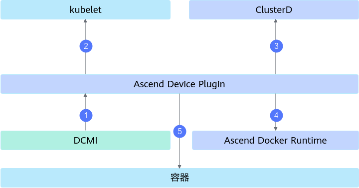
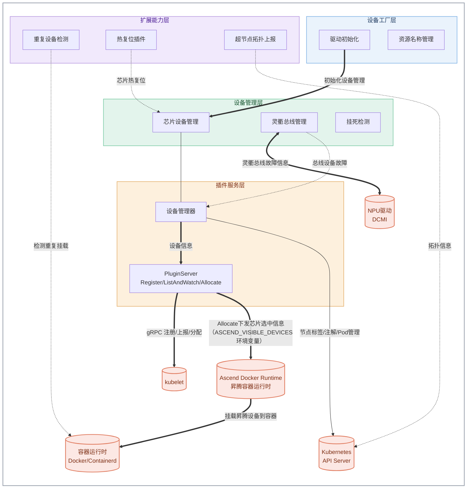

# Ascend Device Plugin

## 目录

- [简介](#简介)
- [软件架构](#软件架构)
  - [上下游依赖](#上下游依赖)
  - [组件架构](#组件架构)
- [编译指南](#编译指南)
- [安装部署](#安装部署)
- [使用指南](#使用指南)

## 简介

- Ascend Device Plugin 一种基于 Kubernetes 设备插件（Device Plugin）机制的集群调度组件，用于在计算节点上发现、上报和管理昇腾芯片资源。
- 主要功能：
  - 通过实现设备插件的 Register 接口，上报昇腾芯片的资源名称。
  - 通过实现设备插件的 ListAndWatch 接口，上报昇腾芯片的数量、编号及健康状态，支持虚拟设备（vNPU）的发现与上报。
  - 通过实现设备插件的 Allocate 接口，完成昇腾芯片挂载到容器中的操作。
  - 支持主动运维：感知到芯片故障后，将芯片从业务态变更为运维态，执行芯片复位修复芯片。

## 软件架构

### 上下游依赖

  

  - 从DCMI中获取芯片的类型、数量、健康状态信息，或者下发芯片复位命令。
  - 上报芯片的类型、数量和状态给kubelet。
  - 以configmap的方式上报芯片的类型、数量和具体故障信息到k8s。
  - 将调度器选中的芯片信息，以环境变量的方式告知给Ascend Docker Runtime。

### 组件架构

Ascend Device Plugin 组件在 Kubernetes 集群中以容器方式部署在计算节点上，模块层级如下：



各层职责说明如下：

- **设备工厂层**：完成驱动初始化与资源名称管理，构建设备管理器，是组件启动的入口。
- **设备管理层**：管理芯片设备与灵衢总线设备，负责设备信息查询、故障检测（含挂死检测）与设备复位命令下发。
- **插件服务层**：通过 PluginServer 实现 Kubernetes 设备插件接口，与 kubelet 进行 gRPC 交互，完成设备注册、状态上报与设备分配。
- **扩展能力层**：提供重复设备检测、超节点拓扑上报、热复位插件等扩展运维能力。
- **外部依赖**：
  - **kubelet**：接收设备插件注册，感知芯片资源。
  - **NPU驱动（DCMI）**：提供芯片与灵衢总线设备的类型、健康状态信息，接收芯片复位命令。
  - **容器运行时（Docker/Containerd）**：接收 Ascend Docker Runtime 的设备挂载指令，供重复设备检测查询容器挂载信息。
  - **Ascend Docker Runtime**：接收 Allocate 接口下发的芯片选中信息（ASCEND_VISIBLE_DEVICES环境变量），完成昇腾设备到容器的挂载。
  - **Kubernetes API Server**：接收节点标签/注解更新、超节点拓扑信息及 Pod 管理请求。

## 编译指南

1. 通过 git 拉取源码，获得 ascend-device-plugin。

    示例：源码放在 /home/mind-cluster/component/ascend-device-plugin 目录下。

2. 执行以下命令，进入构建目录，根据设备插件应用场景，选择其中一个构建脚本执行。

     2.1 中心侧场景编译device-plugin（构建镜像，容器启动设备插件场景），在“output”目录下生成二进制device-plugin、yaml文件和Dockerfile等文件。

    ```shell
    cd /home/mind-cluster/component/ascend-device-plugin/build/
    chmod +x build.sh
    ./build.sh
    ```

     2.2 边侧场景编译device-plugin（二进制启动设备插件场景），仅生成device-plugin二进制文件，适用于以下边缘系列产品：

    | 产品系列 | 产品型号 |
    | --- | --- |
    | Atlas 推理系列产品 | 边缘服务器（Atlas 500 Pro 智能边缘服务器） |
    | Atlas 200I/500 A2 推理产品 | Atlas 500 A2 智能小站、Atlas 200I DK A2 开发者套件、Atlas 200I A2 加速模块 |
    | Atlas 200/300/500 推理产品 | Atlas 200 AI 加速模块、Atlas 500 智能小站 |

    ```shell
    cd /home/mind-cluster/component/ascend-device-plugin/build/
    chmod +x build_edge.sh
    ./build_edge.sh
    ```

3. 中心侧场景编译完成后，执行以下命令，查看 **output** 目录生成的软件列表。

    ```shell
    ll /home/mind-cluster/component/ascend-device-plugin/output
    ```

    ```text
    device-plugin
    device-plugin-310P-1usoc-<version>.yaml
    device-plugin-310P-1usoc-volcano-<version>.yaml
    device-plugin-<version>.yaml
    device-plugin-volcano-<version>.yaml
    Dockerfile
    Dockerfile-310P-1usoc
    Dockerfile-310P-1usoc.openeuler
    Dockerfile.openeuler
    run_for_310P_1usoc.sh
    agreement.txt
    deviceNameCustomization.json
    faultCode.json
    faultCustomization.json
    hangDetectionConfig.json
    hotResetPluginConfiguration.json
    npu-nic-mapping.json
    SwitchFaultCode.json
    ```

## 安装部署

当前Ascend Device Plugin 组件的安装部署支持两种方式：

1. Helm安装，请参考[MindCluster 安装部署 - 使用Helm安装](../../docs/zh/scheduling/03_installation_guide/02_installation/00_helm_installation.md)。
2. 手动安装与部署（包含使用约束、镜像准备、yaml部署及安装验证等），请参见[MindCluster 集群调度组件开发指南 - 手动安装 - Ascend Device Plugin](../../docs/zh/scheduling/05_developer_guide/00_installation_deployment/00_manual_installation/04_ascend_device_plugin.md)。

## 使用指南

Ascend Device Plugin 组件的典型使用场景，请参见以下文档：

- 整卡调度（以整颗NPU为单位申请资源，是最基础的调度方式），请参见[MindCluster 集群调度组件用户指南 - 整卡调度](../../docs/zh/scheduling/04_usage/03_basic_scheduling/03_full_npu_scheduling.md)。
- 虚拟化实例（静态vNPU调度、动态vNPU调度、软共享调度），请参见[MindCluster 集群调度组件用户指南 - 虚拟化实例](../../docs/zh/scheduling/04_usage/02_virtual_instance/menu_virtual_instance.md)。
- 芯片故障恢复（离线热复位，需将启动参数-hotReset取值设置为0或2），请参见[MindCluster 集群调度组件用户指南 - 芯片故障恢复](../../docs/zh/scheduling/04_usage/05_fault_recovery/00_chip_fault_recovery.md)。
- 故障检测与诊断（芯片故障分类与处理策略、任务挂死检测），请参见[MindCluster 集群调度组件用户指南 - 故障检测与诊断](../../docs/zh/scheduling/04_usage/04_fault_detection_and_diagnosis/00_feature_description.md)。
- 组件上报的芯片资源与故障信息说明（包含mindx-dl-deviceinfo ConfigMap字段、灵衢总线设备故障信息等），请参见[MindCluster 集群调度组件用户指南 - API - Ascend Device Plugin](../../docs/zh/scheduling/06_api/02_ascend_device_plugin.md)。
