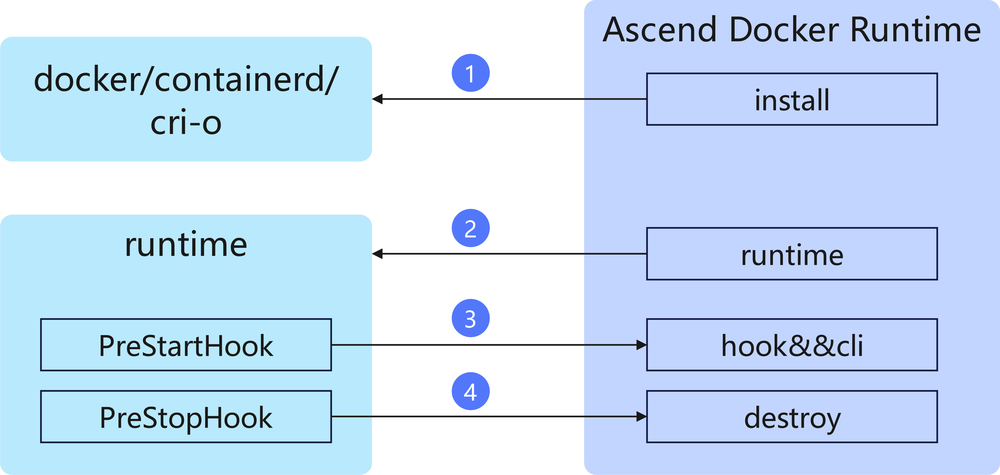
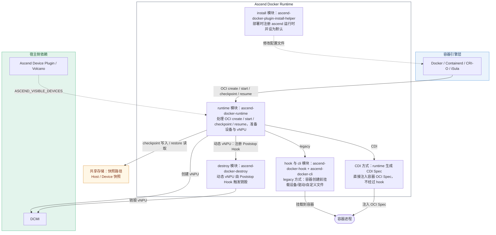

# Ascend Docker Runtime

## 目录

- [简介](#简介)
- [软件架构](#软件架构)
  - [上下游依赖](#上下游依赖)
  - [组件架构](#组件架构)
  - [设备注入方式](#设备注入方式)
  - [容器快照](#容器快照)
- [编译指南](#编译指南)
- [安装部署](#安装部署)
- [使用指南](#使用指南)
- [说明](#说明)

## 简介

Ascend Docker Runtime（昇腾容器运行时）为 AI 训练/推理作业提供 Ascend NPU（昇腾处理器）容器化支持，使 AI 作业能够以 Docker、Containerd、CRI-O、iSula 等容器方式平滑运行在昇腾设备之上。Ascend Docker Runtime 本质上是基于 OCI 标准实现的容器运行时，不修改容器引擎，以插件方式提供 Ascend NPU 适配能力。主要功能如下：

- 极简容器化支持：只需通过环境变量 `ASCEND_VISIBLE_DEVICES` 指定需要挂载的芯片编号，即可自动完成 NPU 设备、驱动文件及相关目录的挂载，避免容器创建时冗长的 `--device`、`-v` 挂载参数。
- 设备隔离：在宿主机上配置容器的 device cgroup，确保容器只能使用被指定的 NPU，实现设备隔离。
- 虚拟化支持：支持挂载静态 vNPU；在部分硬件形态下，支持根据 `ASCEND_VNPU_SPECS` 自动完成动态 vNPU 的切分与销毁。
- 自定义挂载：支持通过 `ASCEND_RUNTIME_MOUNTS` 读取自定义挂载配置文件，按需裁剪挂载到容器内的内容。
- 容器快照：支持推理服务的容器快照（checkpoint/restore），Pod 异常删除或扩容时可基于快照快速恢复服务。

## 软件架构

### 上下游依赖



- 作为容器运行时被 Docker、Containerd、CRI-O、iSula 等容器引擎调用，参与容器创建流程。
- 由 Volcano 或 Ascend Device Plugin 将调度选中的芯片信息，通过环境变量 `ASCEND_VISIBLE_DEVICES` 传递给本组件。
- 通过 DCMI 接口完成动态 vNPU 的切分与销毁。
- 将宿主机上的 NPU 设备节点、HDK 驱动文件及目录挂载到容器命名空间。

### 组件架构

Ascend Docker Runtime 以 run 包形式部署在集群的每个计算节点上，包含 install、runtime、hook 与 cli、destroy 四个模块，并支持 legacy 与 CDI 两种设备注入路径，整体工作流程与模块职责如下：



- install 模块（ascend-docker-plugin-install-helper，部署时调用）：修改 Docker、Containerd、CRI-O、iSula 的配置文件，将 ascend 注册为容器运行时，并按场景设为默认运行时。
- runtime 模块（ascend-docker-runtime，容器创建/启动时调用）：作为容器运行时的入口，读取容器的 OCI Spec（config.json），解析 `ASCEND_VISIBLE_DEVICES` 等环境变量，完成设备文件解析与 vNPU 准备，并按注入方式完成设备注入；此外还接管容器的 checkpoint（保存快照）与 resume（恢复快照）命令，详见[容器快照](#容器快照)。
- hook 与 cli 模块（ascend-docker-hook + ascend-docker-cli，容器创建前调用）：仅在 legacy 方式下由 Prestart Hook 触发，负责整理并挂载 NPU 设备节点、HDK 驱动文件与用户自定义文件，并配置 device cgroup。
- destroy 模块（ascend-docker-destroy，容器销毁前调用）：在动态 vNPU 场景下由 Poststop Hook 触发，负责销毁容器创建阶段切分出的 vNPU。

> [!NOTE]
> legacy 方式下设备挂载由 hook 与 cli 模块完成；CDI 方式下设备注入由 runtime 模块直接写入 OCI Spec 完成，不经过 hook。两种注入方式的详细说明请参见[设备注入方式](#设备注入方式)。

### 设备注入方式

Ascend Docker Runtime 支持 legacy（Prestart Hook）与 CDI（Container Device Interface）两种设备注入方式。注入方式在安装时通过 `--injection-mode=<mode>` 指定（默认值为 legacy），记录在安装路径下的 `ascend_docker_runtime_install.info` 文件中；容器创建时，runtime 模块读取该文件决定实际使用的注入方式。`--injection-mode` 不能单独使用，必须与 `--install` 或 `--upgrade` 配合使用。

#### legacy（默认方式）

runtime 模块在容器 OCI Spec 中注入 `ascend-docker-hook` 作为 Prestart Hook，由 hook 与 cli 模块在容器创建前完成设备挂载：

- Prestart Hook 是 OCI 定义的容器生命周期钩子，处于 created 到 running 的过渡状态。此时容器的 namespace 已创建，但容器内的作业尚未启动，因此可以在该阶段将宿主机上的 NPU 设备、驱动文件挂载到容器 namespace，并完成 device cgroup 配置，随后启动的作业即可直接使用这些配置。
- hook 与 cli 模块根据运行参数整理需要挂载的 NPU 设备节点、HDK 驱动文件及自定义挂载文件，并将其挂载到容器 namespace。

#### CDI（Container Device Interface）

runtime 模块不再注入用于设备挂载的 Prestart Hook，而是在内存中生成 CDI Spec（版本 0.8.0，kind 为 `ascend.com/npu`），并通过 CDI 库将 container edits 直接注入容器 OCI Spec：

- 设备节点：为每个芯片生成对应的设备节点，物理芯片使用 `/dev/davinci*`，虚拟芯片使用 `vdavinci*` 宿主机路径。
- 公共设备与文件：包含公共管理设备、HDK 驱动与自定义挂载文件，并设置 `LD_LIBRARY_PATH` 环境变量。
- 运行参数：支持与 legacy 相同的一组运行参数。

两种注入方式的能力对比如下：

| 对比项 | legacy（Prestart Hook） | CDI（Container Device Interface） |
| --- | --- | --- |
| 开启方式 | 默认方式，无需额外参数 | 安装或升级时指定 `--injection-mode=cdi` |
| 设备注入实现 | 容器创建前由 hook 与 cli 模块挂载 | runtime 生成 CDI Spec 并直接注入 OCI Spec |
| 是否依赖 Prestart Hook | 依赖 | 不依赖 |
| 动态 vNPU 销毁 | 由 Poststop Hook 调用 destroy 模块 | 由 Poststop Hook 调用 destroy 模块 |
| 支持的运行参数 | 全部支持 | 全部支持 |

> [!NOTE]
>
> 1. 两种方式均支持 `ASCEND_VISIBLE_DEVICES`、`ASCEND_RUNTIME_OPTIONS`、`ASCEND_RUNTIME_MOUNTS`、`ASCEND_VNPU_SPECS`、`ASCEND_ALLOW_LINK`、`ASCEND_UB_DRV_MOUNT` 等运行参数，参数含义与取值请参见对应容器运行时客户端的使用文档：[在Docker客户端使用](../../docs/zh/scheduling/04_usage/00_containerization/02_usage_on_the_docker_client.md)、[在Containerd客户端使用](../../docs/zh/scheduling/04_usage/00_containerization/03_usage_on_the_containerd_client.md)、[通过crictl命令行工具使用CRI-O](../../docs/zh/scheduling/04_usage/00_containerization/04_usage_on_the_crio_client.md)。
> 2. 动态 vNPU 场景下，无论采用哪种注入方式，vNPU 的创建均在容器创建阶段完成，销毁仍由 Poststop Hook 调用 destroy 模块完成。
> 3. 注入方式仅在安装或升级时指定，如需更换注入方式，请在重新安装或升级时通过 `--injection-mode` 指定。

### 容器快照

容器快照（checkpoint/restore）用于推理服务的快速启动与故障快速恢复：推理任务 warm up 完成后生成 Host 与 Device 侧快照，Pod 异常删除或扩容时基于快照快速拉起服务，将推理服务启动时间从 30 分钟以上缩短至分钟级。runtime 模块除处理容器的 create/start 外，还接管容器快照相关的 checkpoint 与 resume 命令：

- 保存快照（checkpoint）：暂停容器进程后，通过 CRIU 保存容器运行时状态，并导出 containerd snapshotter 的 rootfs 差异文件（如 `rootfs-diff.tar`、`rootfs-external-diff.tar`、`rootfs-diff.digest`），写入共享存储的快照路径。
- 恢复快照（restore）：Pod 异常删除或扩容后容器重新创建/启动时，runtime 模块基于共享存储中的快照执行 `runc restore`，直接恢复容器进程状态，跳过重复的模型加载与 warm up；若 checkpoint 超时或失败导致容器处于暂停状态，则由 resume 命令将容器恢复运行。

容器快照需 Ascend Docker Runtime 与 Volcano、Ascend Device Plugin、ClusterD、NodeD、Infer Operator 等组件协同完成，主要组件职责如下：

- Ascend Docker Runtime：runtime 模块执行 checkpoint/resume，完成容器进程与 rootfs 差异的保存和恢复。
- NodeD：提供容器快照所需的宿主机能力，并在启动配置中挂载共享存储快照路径。
- Infer Operator：在任务 warm up 后触发生成快照，并在故障或扩容时基于快照拉起实例。

容器快照仅支持 StatefulSet 类型的推理任务，且 CRI-O 场景暂不支持。

详细部署与使用请参见[容器快照部署及使用](../../docs/zh/scheduling/04_usage/10_infer_operator_best_practice/06_container_snapshot_usage.md)。

## 编译指南

1. 通过 git 拉取源码，并切换 master 分支，获得 ascend-docker-runtime。

   示例：源码放在 /home/mind-cluster/component/ascend-docker-runtime 目录下。

2. 下载 tag 为 v1.1.10 的安全函数库，存放在 `platform` 目录下。

   ```shell
   cd /home/mind-cluster/component/ascend-docker-runtime/platform
   git clone -b v1.1.10 https://gitee.com/openeuler/libboundscheck.git
   ```

3. 下载 makeself，存放在 `opensource` 目录下。

   ```shell
   cd ../opensource
   git clone -b openEuler-22.03-LTS https://gitee.com/src-openeuler/makeself.git
   tar -zxvf makeself/makeself-2.4.2.tar.gz
   ```

4. 进入 build 目录，执行编译脚本。

   ```shell
   cd ../build
   bash build.sh
   ```

   编译完成后，会在 output 目录生成相应的 run 安装包。

   ```text
   -rwxr-xr-x  ... Ascend-docker-runtime_x.x.x_linux-x86_64.run*
   ```

> [!NOTE]
>
> 编译依赖 Go、CMake、GCC、make 等工具，请在编译前确保上述工具已安装。

## 安装部署

当前 Ascend Docker Runtime 仅支持 root 用户在所有计算节点以 run 包方式手动安装。安装命令通用格式如下：

```shell
./Ascend-docker-runtime_{version}_linux-{arch}.run --install [--install-scene=<scene>] [--install-type=<type>] [--install-path=<path>]
```

> [!NOTE]
> `--install-type` 用于设置 Ascend Docker Runtime 的默认挂载内容，需配合 `--install` 一起使用；仅在下表列出的产品上安装或升级时使用该参数。

设备型号与 `--install-type` 取值对照如下：

| 设备型号 | --install-type 取值 |
| --- | --- |
| Atlas 200 AI 加速模块（RC 场景） | A200 |
| Atlas 200I SoC A1 核心板 | A200ISoC |
| Atlas 200I A2 加速模块（RC 场景）、Atlas 200I DK A2 开发者套件 | A200IA2 |
| Atlas 500 智能小站（型号 3000） | A500 |
| Atlas 500 A2 智能小站 | A500A2 |

具体安装步骤（包含安装前提条件、Docker/Containerd/CRI-O/iSula 等场景安装、生效与验证，以及安装包命令行参数说明）请参见[手动安装 Ascend Docker Runtime](../../docs/zh/scheduling/05_developer_guide/00_installation_deployment/00_manual_installation/02_ascend_docker_runtime.md)。

## 使用指南

Ascend Docker Runtime 基于自身关键特性的使用指导，请参见 MindCluster 集群调度组件用户指南对应章节：

- 容器化支持的使用前必读，请参见[使用前必读](../../docs/zh/scheduling/04_usage/00_containerization/00_before_you_start.md)。
- 按需裁剪容器内挂载内容，请参见[（可选）配置自定义挂载内容](../../docs/zh/scheduling/04_usage/00_containerization/01_configuring_custom_mounted_content.md)。
- 在 Docker 客户端挂载芯片，请参见[在Docker客户端使用](../../docs/zh/scheduling/04_usage/00_containerization/02_usage_on_the_docker_client.md)。
- 在 Containerd 客户端挂载芯片，请参见[在Containerd客户端使用](../../docs/zh/scheduling/04_usage/00_containerization/03_usage_on_the_containerd_client.md)。
- 通过 crictl 命令行工具在 CRI-O 场景挂载芯片，请参见[通过crictl命令行工具使用CRI-O](../../docs/zh/scheduling/04_usage/00_containerization/04_usage_on_the_crio_client.md)。
- 挂载静态 vNPU 前如需创建 vNPU，请参见[创建vNPU](../../docs/zh/scheduling/04_usage/02_virtual_instance/00_virtual_instance_with_hdk/04_static_vnpu_scheduling/01_creating_vnpu.md)。
- 推理服务的容器快照部署与使用，请参见[容器快照部署及使用](../../docs/zh/scheduling/04_usage/10_infer_operator_best_practice/06_container_snapshot_usage.md)。

## 说明

- 请先安装 Ascend Docker Runtime，再启动 Ascend Device Plugin。Ascend Device Plugin 启动时会自动检测 Ascend Docker Runtime 是否存在；若启动顺序相反，需要重新启动 Ascend Device Plugin。
- 本组件会将宿主机的 NPU 设备节点及驱动文件挂载到容器内，请确保所用镜像与容器权限可信，避免安全风险。
