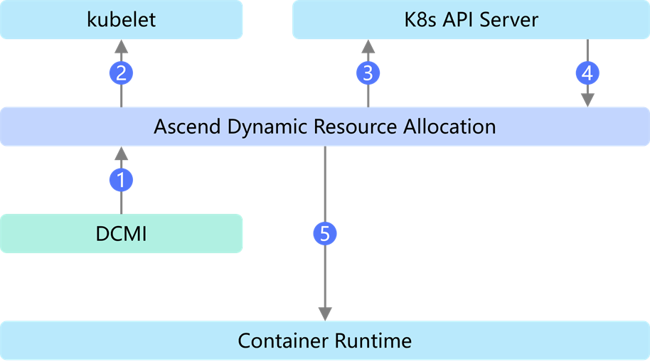
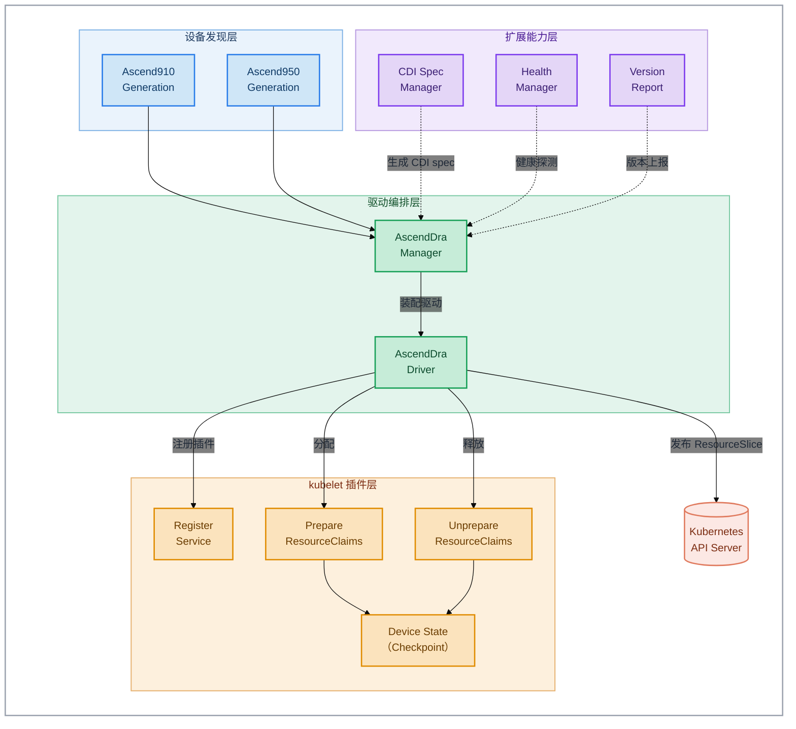

# Ascend Dynamic Resource Allocation

## 目录

- [目录](#目录)
- [简介](#简介)
- [软件架构](#软件架构)
  - [上下游依赖](#上下游依赖)
  - [组件架构](#组件架构)
- [编译指南](#编译指南)
- [安装部署](#安装部署)
- [使用指南](#使用指南)
- [说明](#说明)

## 简介

- Ascend Dynamic Resource Allocation（以下简称 Ascend DRA）是昇腾 NPU 的 Kubernetes 动态资源分配（Dynamic Resource Allocation，DRA）驱动插件，以 kubelet 插件方式部署在计算节点上。
- Ascend DRA 自动发现节点上的昇腾 NPU 设备，并以 ResourceSlice 的形式上报至集群；业务通过 ResourceClaim 申报资源后，调度器根据设备上报信息完成匹配与分配，再通过 CDI（Container Device Interface）机制将设备注入业务容器，实现从资源申报到设备使用的全流程自动化。
- 主要功能：
  - **设备发现与上报**：启动时枚举本节点全部 NPU 设备，按 ResourceSlice 格式上报至 K8s API Server，供调度器感知和选择。
  - **设备分配（Prepare）**：实现 DRA 机制的 PrepareResourceClaims 接口，接收调度器的芯片分配结果，生成 CDI spec 文件并完成设备分配。
  - **设备释放（Unprepare）**：实现 DRA 机制的 UnprepareResourceClaims 接口，在任务结束后释放芯片并清理 CDI spec 文件。
  - **设备注入**：通过 CDI 机制将分配到的昇腾芯片设备注入业务容器。
  - **健康检查与版本上报**：内置 HTTP 健康探针配合 livenessProbe 探测组件存活状态，并将组件版本写入节点注解供 ClusterD 聚合。

## 软件架构

### 上下游依赖

  

  1. 从 DCMI 中获取昇腾芯片的类型、物理 ID、逻辑 ID 等信息，完成设备发现。
  2. 通过 kubelet 插件机制完成注册。
  3. 将昇腾芯片的设备信息以 ResourceSlice 的形式上报给 K8s，供调度器感知和选择。
  4. 从 ResourceClaim 中读取调度器的芯片分配结果，完成设备的分配与释放。
  5. 通过 CDI 机制将设备注入信息传递给容器运行时，完成设备注入。

### 组件架构

Ascend DRA 以 DaemonSet 方式部署在集群的计算节点上，以特权容器运行，模块层级如下：



## 编译指南

1. 通过 git 拉取源码，获得 ascend-dynamic-resource-allocation。

    示例：源码放在 /home/mind-cluster/component/ascend-dynamic-resource-allocation 目录下。

2. 执行以下命令，进入构建目录，执行构建脚本，在"output"目录下生成二进制 ascend-dra、yaml 文件和 Dockerfile。

    ```shell
    cd /home/mind-cluster/component/ascend-dynamic-resource-allocation/build/
    chmod +x build.sh
    ./build.sh
   ```

3. 执行以下命令，查看 **output** 目录生成的软件列表。

    ```shell
    ll /home/mind-cluster/component/ascend-dynamic-resource-allocation/output
    ```

    ```text
    drwxr-xr-x 2 root root     4096 Sep 28 19:12 ./
    drwxr-xr-x 9 root root     4096 Sep 28 19:09 ../
    -r-x------ 1 root root 43524664 Sep 28 19:09 ascend-dra
    -r-------- 1 root root   372080 Sep 28 19:09 ascend-dra-driver-v6.0.0.yaml
    -r-------- 1 root root      482 Sep 28 19:12 Dockerfile
    -r-------- 1 root root      482 Sep 28 19:12 Dockerfile.openeuler
    -r-------- 1 root root      482 Sep 28 19:12 agreement.txt
    ```

## 安装部署

当前 Ascend DRA 组件的安装部署支持两种方式：

1. Helm 安装，请参考[MindCluster 安装部署 - 使用Helm安装](../../docs/zh/scheduling/03_installation_guide/02_installation/00_helm_installation.md)
2. 手动安装与部署（包含安装前置检查、镜像准备、yaml 部署及安装验证等），请参见[MindCluster 集群调度组件开发指南 - 手动安装](../../docs/zh/scheduling/05_developer_guide/00_installation_deployment/00_manual_installation)。

## 使用指南

Ascend DRA 组件的最佳实践（包含组件部署方法，以及一次完整的 Prepare（设备分配）与 Unprepare（设备释放）流程演示，帮助用户理解 DRA 机制下 NPU 资源的生命周期管理），请参见[MindCluster 集群调度组件用户指南 - 使用示例 - Ascend Dynamic Resource Allocation 最佳实践](../../docs/zh/scheduling/04_usage/13_ascend_dynamic_resource_allocation_best_practice/00_before_you_start.md)。

## 说明

- 当前容器方式部署本组件，本组件的认证鉴权方式为 ServiceAccount，该认证鉴权方式为 ServiceAccount 的 token 明文显示，建议用户自行进行安全加强。
- 组件以特权容器方式运行，运行用户为 root，并且挂载了宿主机的 NPU 驱动目录、kubelet 插件目录与设备目录，请勿修改 YAML 文件中 DaemonSet 的名称及其挂载配置，否则组件无法正常工作。
- 组件默认启用健康检查服务并占用 11258 端口，请确保计算节点上该端口未被占用；若端口冲突，可修改 YAML 文件中 `--healthz-address` 参数以及 livenessProbe 中的端口号。
