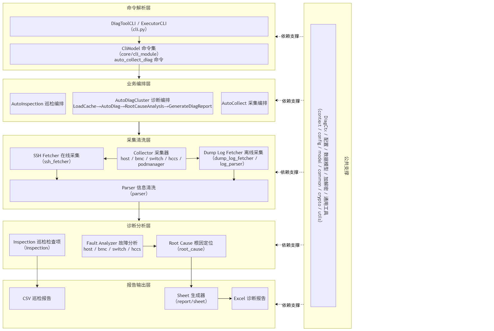

# MindCluster Ascend FaultDiag Toolkit

## 目录

- [简介](#简介)
- [软件架构](#软件架构)
  - [组件架构](#组件架构)
- [编译指南](#编译指南)
- [安装部署](#安装部署)
- [使用指南](#使用指南)
- [说明](#说明)

## 简介

- MindCluster Ascend FaultDiag Toolkit（简称 ascend-fd-tk）是面向昇腾 AI 集群的链路故障诊断工具，可安装在 PC 或单台服务器上远程访问集群设备，覆盖从数据采集到故障定位的全流程。
- 提供交互式与非交互式两种操作模式，具备在线数据自动采集与离线日志清洗两种数据处理能力，通过服务器、L1/L2 灵衢交换机、RoCE 交换机及 BMC 等信息定位集群的链路故障。
- 主要功能：
  - 在线采集与清洗：根据配置的集群设备（服务器、BMC、交换机）连接信息（账号、密码 / 密钥 / 免密），自动通过 SSH 采集数据并完成信息清洗。
  - 离线日志清洗：导入已采集的服务器带内日志、BMC dump 日志和交换机 diagnostic information 日志，进行信息清洗。
  - 一键诊断：自动完成信息采集与故障诊断，生成 Excel 诊断报告，支持链路精准定位。
  - 分批采集与统一诊断：支持多网络平面场景下分批采集设备信息，汇总后统一诊断。
  - 客户定制化巡检：按客户类型定制诊断规则进行巡检，生成 CSV 巡检报告（巡检特性是 beta 特性，不建议在正式环境中使用）。

支持的产品形态（Atlas A2/A3、Ascend 950PR&950DT 系列等）与交换机要求详见[支持的产品形态](../../../docs/zh/faultdiag/ascend-faultdiag-toolkit/01_introduction/02_supported_products.md)。

## 软件架构

ascend-fd-tk 以 Python Whl 包方式安装，运行在 PC 或单台服务器上，无需部署到集群节点：

- 在线模式下通过 SSH 访问集群设备执行采集命令，并通过 SCP 拉取 BMC 日志。
- 离线模式下直接解析用户导入的设备日志。
- 诊断 / 巡检结果以 Excel / CSV 报告形式输出至工具家目录。

### 组件架构

ascend-fd-tk 内部按“命令解析 → 业务编排 → 采集清洗 → 诊断分析 → 报告输出”分层组织，模块层级如下：



图中各节点与源码模块的对应关系：

| 图中节点 | 源码模块 |
|------|------|
| DiagToolCLI / ExecutorCLI | `ascend_fd_tk/cli.py`（交互式 / 非交互式入口） |
| CliModel 命令集 | `ascend_fd_tk/core/cli_module/`（`base.py` 命令基类、`cli_model.py` 命令实现） |
| AutoCollect / AutoDiagCluster / AutoInspection | `ascend_fd_tk/examples/auto_diag/`、`ascend_fd_tk/examples/inspection/`，编排 `ascend_fd_tk/core/service/` 下的 `DiagService` 服务 |
| Collector 采集器 | `ascend_fd_tk/core/collect/collector/`（host、bmc、switch、hccs、podmanager 等，含 A5 子类） |
| SSH Fetcher 在线采集 | `ascend_fd_tk/core/collect/fetcher/ssh_fetcher/`（含 cmd_provider、generation_probe） |
| Dump Log Fetcher 离线采集 | `ascend_fd_tk/core/collect/fetcher/dump_log_fetcher/`、`ascend_fd_tk/core/log_parser/` |
| Parser 信息清洗 | `ascend_fd_tk/core/collect/parser/`（host、bmc、switch、hccs） |
| Fault Analyzer 故障分析 | `ascend_fd_tk/core/fault_analyzer/`（host、bmc、switch、hccs、common） |
| Root Cause 根因定位 | `ascend_fd_tk/core/root_cause/`（信号链路建模、根因定位与过滤） |
| Inspection 巡检检查项 | `ascend_fd_tk/core/inspection/`（check_items、config） |
| Sheet 生成器 | `ascend_fd_tk/core/report/sheet/`（diag_report_sheet、optical_module_sheet 等） |
| Excel / CSV 报告 | `ascend_fd_tk/utils/excel_tool.py`、`ascend_fd_tk/utils/csv_tool.py` |
| 公共支撑 | `ascend_fd_tk/core/context/`（DiagCtx、注册机制）、`core/config/`（连接/阈值/日志目录配置）、`core/model/`（数据模型）、`core/common/`、`core/crypto/`（连接配置加解密）、`utils/`（通用工具） |

## 编译指南

ascend-fd-tk 为纯 Python 包（`py3-none-any`，不区分系统架构），通过 `setup.py` 指定版本号编译打包，生成 Whl 包至 `dist/` 目录：

```shell
cd mind-cluster/component/ascend-faultdiag/toolkit_src
python3 setup.py --version {version} bdist_wheel
```

详细的源码编译说明（依赖库安装、版本号规则等）请参见[安装指南 - 源码编译生成](../../../docs/zh/faultdiag/ascend-faultdiag-toolkit/04_installation_guide/01_installation.md)。

## 安装部署

ascend-fd-tk 通过 Whl 包安装（`pip3 install`），Whl 包支持从 [MindCluster release 版本](https://gitcode.com/Ascend/mind-cluster/releases)下载或源码编译两种方式获取。

安装、升级、卸载的详细步骤（含软件包 SUM 值校验）请参见[安装指南](../../../docs/zh/faultdiag/ascend-faultdiag-toolkit/04_installation_guide/menu_installation_guide.md)。

安装部署注意事项：

- 要求 Python 版本不低于 3.8。
- 建议磁盘剩余空间 5GB 以上，安装过程需联网下载三方依赖库。
- Windows 系统上使用工具是 beta 特性，不建议在正式环境中使用。

## 使用指南

ascend-fd-tk 提供交互式（`>>>` 提示符逐条输入）与非交互式（一行命令完成全流程）两种操作模式，各特性的详细使用说明请参见对应资料：

| 资料 | 说明 |
|------|------|
| [快速入门](../../../docs/zh/faultdiag/ascend-faultdiag-toolkit/03_quick_start/quick_start.md) | 基于离线交换机日志的首次诊断操作指引 |
| [特性概览](../../../docs/zh/faultdiag/ascend-faultdiag-toolkit/05_usage/01_usage_overview.md) | 日志采集、日志清洗、故障诊断、故障巡检等特性说明与性能数据 |
| [在线诊断](../../../docs/zh/faultdiag/ascend-faultdiag-toolkit/05_usage/07_online_diagnosis.md) | 设备可访问（IP / 凭据齐备）场景的采集与诊断流程 |
| [离线诊断](../../../docs/zh/faultdiag/ascend-faultdiag-toolkit/05_usage/08_offline_diagnosis.md) | 仅日志可获取场景的日志清洗与诊断流程 |
| [分批诊断](../../../docs/zh/faultdiag/ascend-faultdiag-toolkit/05_usage/09_batch_diagnosis.md) | 多网络平面、设备数量大场景的分批采集与统一诊断 |
| [客户定制化巡检](../../../docs/zh/faultdiag/ascend-faultdiag-toolkit/05_usage/10_customized_inspection.md) | 按客户类型预定义规则的批量健康检查（beta 特性） |
| [诊断 / 巡检报告说明](../../../docs/zh/faultdiag/ascend-faultdiag-toolkit/05_usage/06_fault_analysis_report.md) | 报告字段含义与解读方法 |
| [API 概述](../../../docs/zh/faultdiag/ascend-faultdiag-toolkit/06_api/01_api_overview.md) | 全部 16 个命令的索引与详细说明 |

完整资料请参见[MindCluster Ascend FaultDiag Toolkit 用户指南](../../../docs/zh/faultdiag/ascend-faultdiag-toolkit/menu_ascend-faultdiag-toolkit.md)。

## 说明

1. 每次使用工具前，建议先执行 `clear_cache` 清理缓存，避免上一次诊断任务的残留数据影响本次诊断结果。
2. 巡检特性是 beta 特性，不建议在正式环境中使用。
3. Windows 系统上使用工具是 beta 特性，不建议在正式环境中使用；Windows 平台家目录基于当前工作目录（`{当前工作目录}/.ascend-faultdiag-toolkit/`）。
4. 在线连接配置文件 `conn.ini` 包含账号、密码等明文信息，`set_conn_config` 设置成功后建议尽快删除该文件；工具会将连接配置加密存储于家目录 `encrypted_conn_config`。
5. 本特性会读取并处理输入目录下用户采集的相关原日志及监测指标文件，请用户确保相关文件内无敏感信息和个人数据。
6. 交换机需运行 VRP（Versatile Routing Platform）操作系统，支持 `display diagnostic-information`、`display interface` 等命令。
