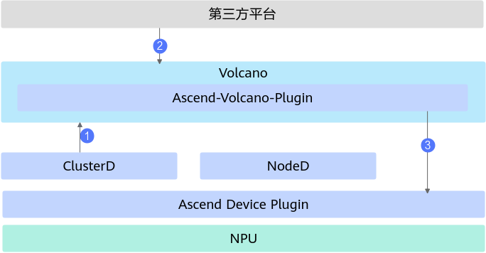
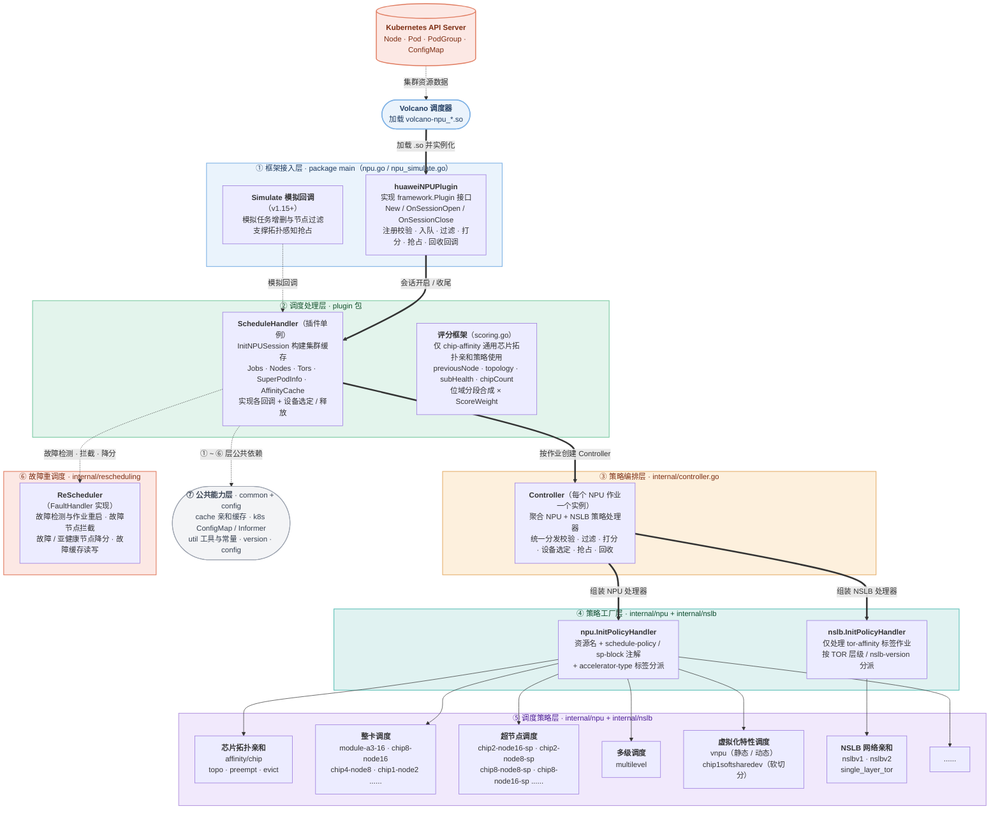

# Ascend for Volcano

## 目录

- [简介](#简介)
- [软件架构](#软件架构)
  - [上下游依赖](#上下游依赖)
  - [组件架构](#组件架构)
- [亲和性调度方案介绍](#亲和性调度方案介绍)
- [编译指南](#编译指南)
  - [编译前准备](#编译前准备)
  - [编译Volcano](#编译volcano)
- [安装部署](#安装部署)
- [使用指南](#使用指南)
- [说明](#说明)

## 简介

- Ascend for Volcano（Ascend-volcano-plugin）是基于开源Volcano调度框架的插件机制开发的昇腾NPU调度插件，为集群增加昇腾AI处理器的亲和性调度、虚拟设备调度、故障重调度等特性，最大化发挥昇腾AI处理器的计算性能。
- 主要功能：
  - 基于昇腾AI处理器的互联拓扑，实现芯片亲和性调度（HCCS亲和性、整卡调度、超节点调度、多级调度等）。
  - 支持静态硬切分调度、动态硬切分调度与软切分调度。
  - 感知硬件故障与软件故障信息，实现任务重调度。

## 软件架构

### 上下游依赖



1. 从K8s的Node对象上获取芯片总数，从Pod对象上获取已使用芯片信息，从ClusterD中获取故障芯片信息，三者结合得到集群可用芯片信息。
2. 接收任务配置，根据集群资源信息，选择最优资源调度。
3. 向Ascend Device Plugin或者Ascend Docker Runtime传递具体的资源选中信息，完成设备挂载。

### 组件架构

Ascend for Volcano以插件方式集成在Volcano调度器中，模块层级如下：



各层功能简介：

- **① 框架接入层**（package main）：实现 Volcano 插件接口，注册校验、入队、过滤、打分、抢占、回收等调度回调，管理会话生命周期。
- **② 调度处理层**（plugin 包）：维护集群 / 作业 / 拓扑缓存，实现各回调处理逻辑与设备选定、释放，提供位域评分框架（当前仅 chip-affinity 通用芯片拓扑亲和策略使用）。
- **③ 策略编排层**（internal/controller.go）：每个 NPU 作业一个 Controller 实例，聚合各策略处理器并统一分发调度动作。
- **④ 策略工厂层**（internal/npu、internal/nslb）：按资源名、schedule-policy / sp-block 注解、accelerator-type / tor-affinity 标签为作业选择策略。
- **⑤ 调度策略层**：实现芯片拓扑亲和、整卡、超节点、多级、虚拟化特性、NSLB 网络亲和等具体调度算法。
- **⑥ 故障重调度**（internal/rescheduling）：故障检测与作业重启，过滤阶段拦截故障节点，打分阶段对故障 / 亚健康节点降分，故障信息经 ConfigMap 读写。
- **⑦ 公共能力层**（common、config）：提供亲和缓存、ConfigMap 读写、通用工具及版本与配置管理，供以上各层使用。

## 亲和性调度方案介绍

昇腾AI处理器的亲和性调度（含基于昇腾AI处理器的亲和性与基于节点的亲和性）方案介绍详见 [亲和性调度方案介绍](../../docs/zh/scheduling/04_usage/03_basic_scheduling/01_affinity_scheduling/00_solution_description.md)。

## 编译指南

### 编译前准备

- 确保PC机连接至互联网，并已完成Git和Docker的安装。参见 [Git安装](https://git-scm.com/book/en/v2/Getting-Started-Installing-Git)、[Docker-ce安装](https://docs.docker.com/engine/install/ubuntu/)。
- 已完成Go语言环境的安装（版本 ≥ 1.21，建议使用最新的bugfix版本）。参见 [https://golang.org/](https://golang.org/)。
- 完成musl的安装（版本 ≥ 1.2.0）。参见 [http://musl.libc.org/](http://musl.libc.org/)。
- 根据所在网络环境配置Go代理地址，国内可使用Goproxy China，例如：

    ```bash
    go env -w GOPROXY=https://goproxy.cn,direct
    ```

### 编译Volcano

1. 执行以下命令，在 `$GOPATH/src/volcano.sh/` 目录下拉取Volcano官方开源代码。

    **cd** **$GOPATH/src/volcano.sh/**

    **git clone -b release-1.15 https://github.com/volcano-sh/volcano.git**

2. 将代码目录 `ascend-for-volcano` 重命名为 `ascend-volcano-plugin`，并拷贝至Volcano官方开源代码的插件路径下（`$GOPATH/src/volcano.sh/volcano/pkg/scheduler/plugins/`）。

3. 执行以下命令，编译Volcano二进制文件和动态链接库（so文件）。根据开源代码版本，为build.sh脚本选择对应的参数（如v1.15.0）。

    ```bash
    cd $GOPATH/src/volcano.sh/volcano/pkg/scheduler/plugins/ascend-volcano-plugin/build
    chmod +x build.sh
    ./build.sh v1.15.0
    ```

    编译产物在 `ascend-volcano-plugin/output` 目录下，文件列表如下表所示。

| 文件名 | 说明 |
| --- | --- |
| volcano-npu_v26.1.0.so | Volcano昇腾NPU调度插件动态链接库 |
| Dockerfile-scheduler | Volcano scheduler镜像构建文件 |
| Dockerfile-controller | Volcano controller镜像构建文件 |
| volcano-{version}.yaml | Volcano的启动配置文件 |
| vc-scheduler | Volcano scheduler组件二进制文件 |
| vc-controller-manager | Volcano controller组件二进制文件 |

> **说明：**
>
> - `{version}`：表示Volcano框架版本号，取值为v1.9.0、v1.12.0、v1.15.0。
> - 执行build.sh脚本时会修改部分Volcano开源代码，具体修改详见 [build.sh](build/build.sh)。

## 安装部署

1. Helm安装，请参考 [MindCluster安装部署 - 使用Helm安装](../../docs/zh/scheduling/03_installation_guide/02_installation/00_helm_installation.md)。
2. 手动安装与部署（包含安装前置检查、镜像准备、yaml部署及安装验证等），请参见 [MindCluster集群调度组件开发指南 - 手动安装 - Volcano](../../docs/zh/scheduling/05_developer_guide/00_installation_deployment/00_manual_installation/05_volcano.md)。

## 使用指南

Ascend for Volcano提供的调度特性的使用指导，请参见 [调度特性指南 - 特性说明](../../docs/zh/scheduling/04_usage/03_basic_scheduling/00_feature_description.md)。

## 说明

- 编译脚本会根据不同Volcano版本修改部分源代码，具体修改详见 [build.sh](build/build.sh)。
- 当前容器方式部署本组件，本组件的认证鉴权方式为ServiceAccount，该认证鉴权方式为ServiceAccount的token明文显示，建议用户自行进行安全加强。
