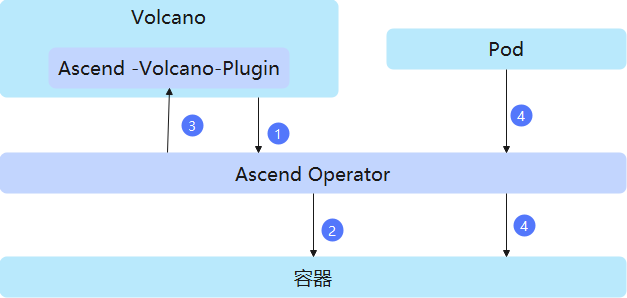
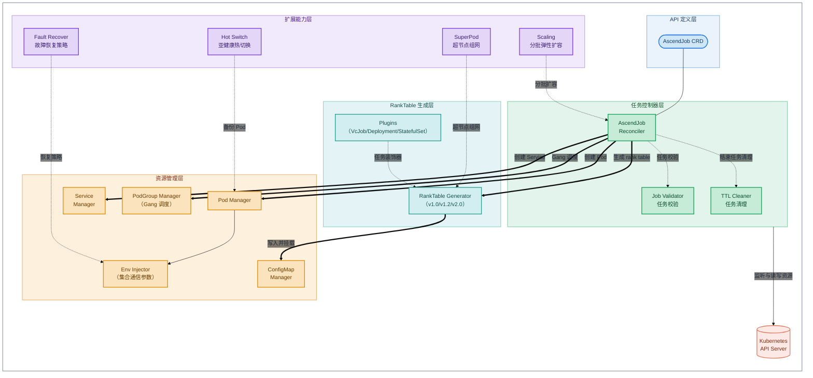

# Ascend Operator

## 目录

- [Ascend Operator](#ascend-operator)
  - [目录](#目录)
  - [简介](#简介)
  - [软件架构](#软件架构)
    - [上下游依赖](#上下游依赖)
    - [组件架构](#组件架构)
  - [编译指南](#编译指南)
  - [安装部署](#安装部署)
  - [使用指南](#使用指南)
  - [说明](#说明)

## 简介

- Ascend Operator 一种基于 Kubernetes 自定义资源（CRD）和控制器机制的集群调度组件，用于部署和管理昇腾分布式训练任务。
- Ascend Operator 定义了 AscendJob（acjob）CRD 并实现其控制器，支持 MindSpore、PyTorch、TensorFlow AI 框架在 Kubernetes 上进行分布式训练。
- 主要功能：
  - 根据训练任务的实例配置拉起训练 Pod 与 Service，并按 AI 框架类型自动注入集合通信参数（如 PyTorch 的 MASTER_ADDR、WORLD_SIZE，MindSpore 的 MS_SCHED_HOST、MS_WORKER_NUM 等）。
  - 汇总各 Pod 分配的芯片编号、IP、RankId 信息，生成集合通信 rank table 文件（支持 v1.0、v1.2、v2.0 三种版本格式），挂载到容器内供业务组网使用。
  - 支持与 Volcano 配合实现 gang 调度、超节点组网、多任务组分批弹性扩容、故障重调度与断点续训等能力。

## 软件架构

### 上下游依赖



1. 通过Volcano感知当前任务所需资源是否满足。
2. 资源满足后，针对任务创建对应的Pod并注入集合通信参数的环境变量。
3. Pod创建完成后，Volcano进行资源的最终选定。
4. 通过文件的方式挂载集合通信参数（可选）。从每个Pod上获取该Pod使用的芯片编号、IP、RankId信息，汇总后生成集合通信文件并挂载到容器内。

### 组件架构

Ascend Operator 组件在 Kubernetes 集群中以容器方式部署在管理节点上，模块层级如下：



- API 定义层：定义 AscendJob CRD。任务按角色声明副本规格，MindSpore 框架包含 Scheduler、Worker 角色，PyTorch 框架包含 Master、Worker 角色；框架类型通过任务 YAML 中的 label `framework` 指定。
- 任务控制器层：AscendJob Reconciler 调谐任务全生命周期（创建 Pod/Service、更新任务状态、故障重试）；Job Validator 对非法任务配置直接置任务失败；TTL Cleaner 周期扫描并按 TTLSecondsAfterFinished 清理已结束任务。
- 资源管理层：Pod Manager 支持批量创建与 rank 复用；Service Manager 为管理角色（Scheduler/Master）创建通信 Service；PodGroup Manager 同步 Volcano PodGroup 实现 gang 调度（PodGroup inqueue 后才创建 Pod）；Env Injector 按框架类型注入集合通信参数，并支持注入故障恢复策略相关环境变量。
- RankTable 生成层：解析 Ascend Device Plugin 写入 Pod annotation 的芯片分配信息，按 rankIndex 汇总生成 rank table 文件，写入 ConfigMap（rings-config-任务名）挂载到容器内；v1.0 面向常规分布式场景，v1.2 面向超节点（SuperPod）场景，v2.0 面向带网络层级信息的新代芯片场景。同时支持将 Volcano Job、Deployment、StatefulSet 等原生资源转换为内部任务结构生成 rank table（任务装饰器模式）。
- 扩展能力层：Scaling 基于规则配置实现多任务组分批弹性扩容；SuperPod 支持超节点逻辑 ID 计算与软/硬亲和策略；Hot Switch 支持亚健康热切换场景的备份 Pod 创建；Fault Recover 通过环境变量向容器内下发故障恢复策略（recover/retry/dump/recover-in-place/exit/elastic-training）。

## 编译指南

1. 通过 git 拉取源码，获得 ascend-operator。

   示例：源码放在 /home/mind-cluster/component/ascend-operator 目录下。
2. 执行以下命令，进入构建目录，执行构建脚本，在"output"目录下生成二进制 ascend-operator、yaml 文件和 Dockerfile。

   **cd** _/home/mind-cluster/component/_**ascend-operator/build/**

   **chmod +x build.sh**

   **./build.sh**
3. 执行以下命令，查看 **output** 目录生成的软件列表。

   **ll** _/home/mind-cluster/component/_**ascend-operator/output**

   ```text
   drwxr-xr-x 2 root root     4096 Jan 29 19:12 ./
   drwxr-xr-x 9 root root     4096 Jan 29 19:09 ../
   -r-x------ 1 root root 43524664 Jan 29 19:09 ascend-operator
   -r-------- 1 root root     372080 Jan 29 19:09 ascend-operator-v6.0.0.yaml
   -r-------- 1 root root      482 Jan 29 19:12 Dockerfile
   -r-------- 1 root root      482 Jan 29 19:12 Dockerfile.openeuler
   -r-------- 1 root root      410 Jan 29 19:12 agreement.txt
   ```

## 安装部署

当前Ascend Operator 组件的安装部署支持两种方式：

1. Helm安装，请参考[MindCluster 安装部署 - 使用Helm安装](../../docs/zh/scheduling/03_installation_guide/02_installation/00_helm_installation.md)
2. 手动安装与部署（包含安装前置检查、镜像准备、yaml 部署及安装验证等），请参见[MindCluster 集群调度组件开发指南 - 手动安装](../../docs/zh/scheduling/05_developer_guide/00_installation_deployment/00_manual_installation)。

## 使用指南

Ascend Operator 承载昇腾分布式训练任务的部署与生命周期管理，基于自身关键特性的使用指导，请参见 MindCluster 集群调度组件用户指南对应章节：

- 训练任务的部署与整卡调度，请参见[整卡调度](../../docs/zh/scheduling/04_usage/03_basic_scheduling/03_full_npu_scheduling.md)。
- 超节点等复杂网络拓扑场景的训练任务部署，请参见[多级调度](../../docs/zh/scheduling/04_usage/03_basic_scheduling/04_multi_level_scheduling.md)。
- 基于 vCANN-RT 虚拟化实例的训练与推理任务部署，请参见[基于vCANN-RT的虚拟化实例](../../docs/zh/scheduling/04_usage/02_virtual_instance/01_virtual_instance_with_vcann_rt/00_description.md)。
- 故障场景下的断点续训（故障检测、重调度、训练恢复），请参见[断点续训](../../docs/zh/scheduling/04_usage/04_fault_recovery/01_resumable_training/00_feature_description.md)。
- VERL 强化学习任务的部署与弹性 rollout，请参见[VERL 强化学习最佳实践](../../docs/zh/scheduling/04_usage/12_verl_best_practice/00_before_you_start.md)。

## 说明

- 当前容器方式部署本组件，本组件的认证鉴权方式为ServiceAccount，该认证鉴权方式为ServiceAccount的token明文显示，建议用户自行进行安全加强。
- 本组件需与 Volcano、Ascend Device Plugin、Ascend Docker Runtime 等组件配合使用：Volcano 负责任务资源的调度与最终选定，Ascend Device Plugin 负责昇腾芯片的上报与挂载，单独部署本组件无法完成昇腾芯片训练任务的调度。
- 训练任务的 AI 框架类型通过任务 YAML 中的 label `framework` 指定，当前支持 mindspore、pytorch、tensorflow。
- 任务结束后的清理策略（cleanPodPolicy）与保留时长（ttlSecondsAfterFinished）可在任务 YAML 中配置，默认不清理已结束任务的 Pod。
