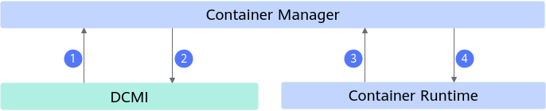
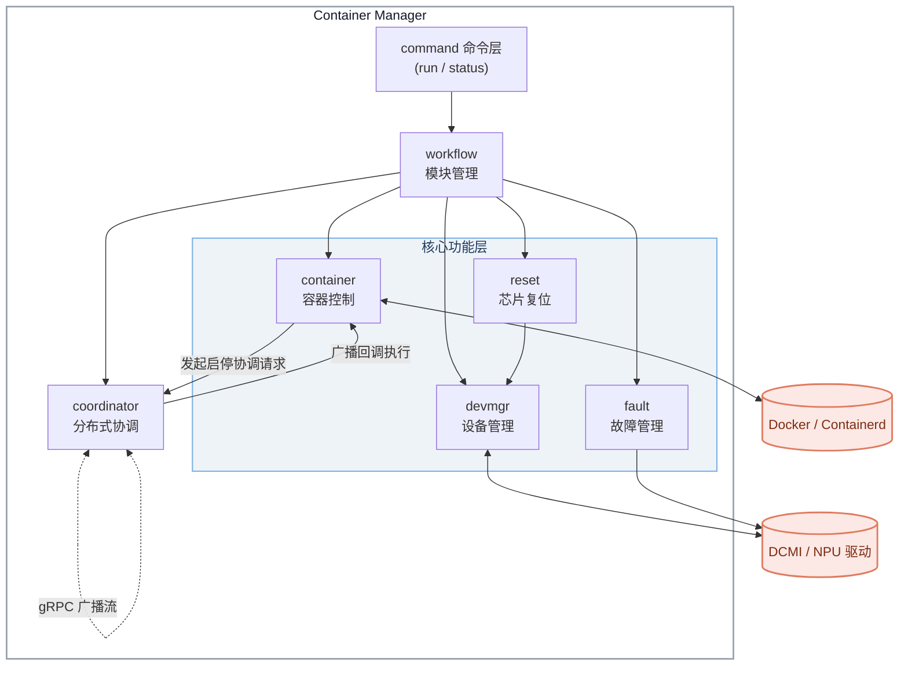

# Container Manager

## 目录

- [简介](#简介)
- [软件架构](#软件架构)
  - [上下游依赖](#上下游依赖)
  - [组件架构](#组件架构)
- [编译指南](#编译指南)
- [安装部署](#安装部署)
- [使用指南](#使用指南)
- [说明](#说明)

## 简介

- Container Manager 是面向无 Kubernetes 场景的容器管理与 NPU 芯片故障自愈组件，用于在推理或训练进程异常时，自动完成故障芯片复位及故障容器的停止与恢复。
- 主要功能：
  - 故障检测：注册 DCMI 故障订阅接口，实时检测 350+ 硬件类故障。
  - 故障处理：针对可自愈故障（RestartRequest、RestartBusiness、FreeRestartNPU、RestartNPU）自动复位故障芯片。
  - 容器恢复：按用户配置的启停策略，对挂载故障芯片的容器执行停止，并在芯片复位成功后重新拉起。
  - 分布式任务恢复：在无 K8s 的多机任务场景中，通过 Leader/普通节点协同，实现跨节点分布式任务容器的一致性启停。

## 软件架构

### 上下游依赖

  

  - Container Manager 通过 DCMI 获取芯片的类型、数量、健康状态信息，并下发芯片复位命令。
  - Container Manager 从 NPU 驱动订阅芯片故障事件，获取芯片故障码及故障级别。
  - Container Manager 通过容器运行时（Docker 或 Containerd）获取当前运行中的容器及芯片挂载信息，并下发容器停止、启动命令。

### 组件架构

Container Manager 以 systemd 服务方式部署在每个节点上，模块层级如下：



- command：命令行入口，提供 `run`、`status` 两个子命令，负责参数解析与各模块的启动编排。
- fault：故障管理，订阅芯片故障/恢复事件，按故障码分级处理，维护故障缓存。
- devmgr：设备管理，通过 DCMI 获取芯片信息并下发热复位命令。
- reset：芯片复位，周期性检查待复位芯片，满足条件后执行复位。
- container：容器控制，适配 Docker 与 Containerd，负责容器的停止与启动。
- coordinator：分布式协调，通过 gRPC 在 Leader/普通节点间进行数据同步与启停广播。
- workflow：模块管理，统一负责各模块的注册、初始化与运行。

## 编译指南

1. 通过 git 拉取源码，获得 container-manager。

    示例：源码放在 /home/mind-cluster/component/container-manager 目录下。

2. 执行以下命令，进入构建目录，执行构建脚本，在 "output" 目录下生成二进制 container-manager、部署脚本 deploy.sh。

    ```shell
    cd /home/mind-cluster/component/container-manager/build/
    chmod +x build.sh
    ./build.sh
    ```

3. 执行以下命令，查看 **output** 目录生成的软件列表。

    ```shell
    ls /home/mind-cluster/component/container-manager/output
    ```

    ```text
    container-manager deploy.sh
    ```

## 安装部署

本组件面向无 K8s 场景，以 systemd 服务方式部署在每个节点上，通过部署脚本 deploy.sh 安装。详细的安装步骤，请参见 [手动安装 - Container Manager](../../docs/zh/scheduling/05_developer_guide/00_installation_deployment/00_manual_installation/10_container-manager.md)。

## 使用指南

Container Manager 的最佳实践（包含故障检测、故障处理、容器恢复，以及分布式任务容器跨节点一致性恢复的完整配置流程），请参见 [NPU硬件故障检测与恢复](../../docs/zh/scheduling/04_usage/06_appliance/01_npu_hardware_fault_detection_and_rectification.md)。

分布式协调服务提供的 gRPC 接口说明，请参见 [Container Manager API](../../docs/zh/scheduling/06_api/18_container-manager.md)。

### 常用命令

1. 可通过以下命令获取帮助信息。

    ```bash
    ./container-manager -h
    ./container-manager -help
    ```

    回显示例如下：

    ```text
    Container Manager, supports fault management and automatic recovery.

    Usage: [OPTIONS...] COMMAND

    Options:
     -h,-help Print help information
     -v,-version Print version information

    Commands:
        run         Run container manager
        status      Display container status information and container abnormal information
    ```

2. 可通过以下命令查看版本信息。

    ```bash
    ./container-manager -v
    ./container-manager -version
    ```

   回显示例如下：

    ```text
    container-manager version: v7.3.0_linux-x86-64
    ```

3. 查看容器恢复进度及提示信息：

    ```shell
    ./container-manager status
    ```

   回显示例如下：

    ```text
    +==================================================================================================+
    | Container ID               : e3b0c44298fc1c149afbf4c8996fb92427ae41e4649b934ca495991b7852b855    |
    | Container Status           : resuming                                                            |
    | Container Status Start Time: 2025-11-27 11:57:21                                                 |
    | Container Description      : The device has been recovered, but the container failed to be       |
    |                              resumed. Please manually pull up the container                      |
    +==================================================================================================+
    ```

更多命令参数请参考 [deploy.sh脚本命令](../../docs/zh/scheduling/05_developer_guide/00_installation_deployment/00_manual_installation/10_container-manager.md#table_deploy_script_options) 和 [Container Manager启动参数](../../docs/zh/scheduling/05_developer_guide/00_installation_deployment/00_manual_installation/10_container-manager.md#table8724104319141cm)。

## 说明

- 本组件适用于无K8S的场景，不依赖K8S调度器。
