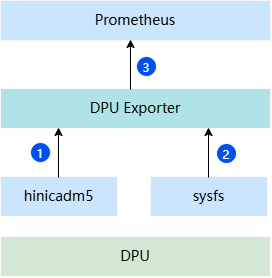
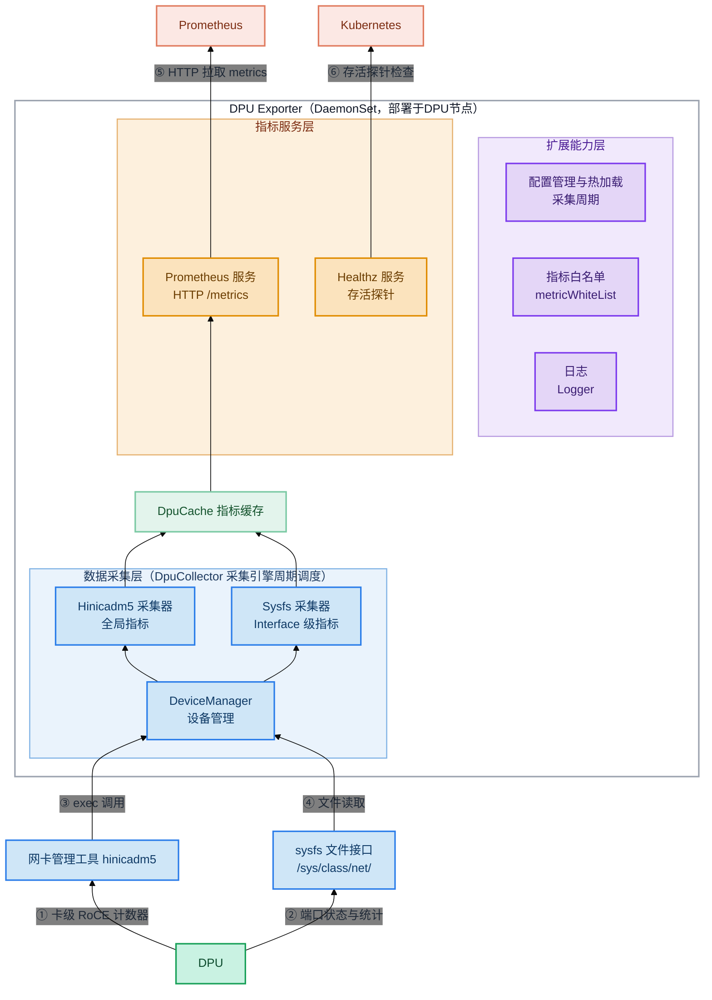

# DPU Exporter

# 目录

- [简介](#简介)
- [软件架构](#软件架构)
  - [上下游依赖](#上下游依赖)
  - [组件架构](#组件架构)
- [编译指南](#编译指南)
- [安装部署](#安装部署)
- [使用指南](#使用指南)
- [说明](#说明)

## 简介

- 在任务运行过程中，DPU的健康状态直接影响任务的稳定性。MindCluster提供DPU Exporter组件用于监测DPU的运行状态与各项统计指标。当前提供的指标可分为两类：
  - **全局指标**：涵盖RoCE错包、丢包、接收ECN、发送/接收CNP及PSN异常重传等统计指标。
  - **Interface级指标**：涵盖每个网卡端口的链路运行状态、收发流量与异常错误状态等指标。
- 主要功能：
  - 从网卡管理工具与文件系统接口分别获取DPU的全局指标与Interface级指标。
  - 提供Prometheus指标接口，用于监控DPU的运行状态与各项统计指标。

## 软件架构

### 上下游依赖



1. 从网卡管理工具hinicadm5获取DPU全局指标，放入缓存。
2. 从sysfs文件系统获取Interface级指标，放入缓存。
3. 实现Prometheus的指标接口，供其周期性获取缓存中的数据信息。

### 组件架构

DPU Exporter 组件在 Kubernetes 集群中以容器方式（DaemonSet）部署在配置了 DPU 的节点上，模块层级如下：



## 编译指南

1. 通过 git 拉取源码，获得 dpu-exporter。

    示例：源码放在 /home/mind-cluster/component/dpu-exporter 目录下。

2. 执行以下命令，进入构建目录，执行构建脚本，在"output"目录下生成二进制 dpu-exporter、yaml 文件和 Dockerfile。

    ```shell
    cd /home/mind-cluster/component/dpu-exporter/build/
    chmod +x build.sh
    ./build.sh
    ```

3. 执行以下命令，查看 **output** 目录生成的软件列表。

    ```shell
    ll /home/mind-cluster/component/dpu-exporter/output
    ```

    ```text
    -rw-r--r--. 1 root root      128 Aug 22 17:31 config.json
    -rw-r--r--. 1 root root      761 Aug 22 17:31 Dockerfile
    -rw-r--r--. 1 root root      833 Aug 22 17:31 Dockerfile.openeuler
    -rw-r--r--. 1 root root 11010350 Aug 22 17:31 dpu-exporter
    -rw-r--r--. 1 root root     4640 Aug 22 17:31 dpu-exporter-v26.2.0.yaml
    ```

## 安装部署

当前 DPU Exporter 组件的安装部署支持两种方式：镜像部署和二进制部署（包含安装前置检查、使用约束、部署及安装验证等），请参见[手动安装DPU Exporter](../../docs/zh/scheduling/05_developer_guide/00_installation_deployment/00_manual_installation/12_dpu_exporter.md)。

## 使用指南

DPU Exporter 组件的使用指南，请参见[DPU资源监测](../../docs/zh/scheduling/04_usage/01_resource_monitoring/01_dpu_resource_monitoring/00_before_you_start.md)。

## 说明

- 当前 DPU Exporter 仅支持 HTTP 启动，如果需要使用 HTTPS 启动，请自行完成代码修改并适配 Prometheus。
- 组件以 hostNetwork 方式部署，指标端口（默认 8083）会在部署节点的所有网络接口上侦听，请根据实际组网安全策略做好访问控制。
