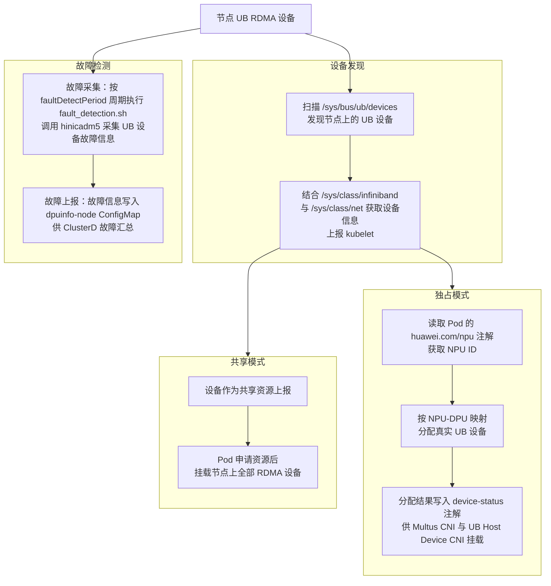
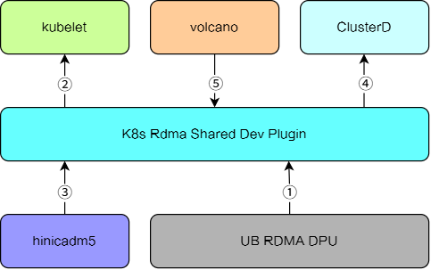
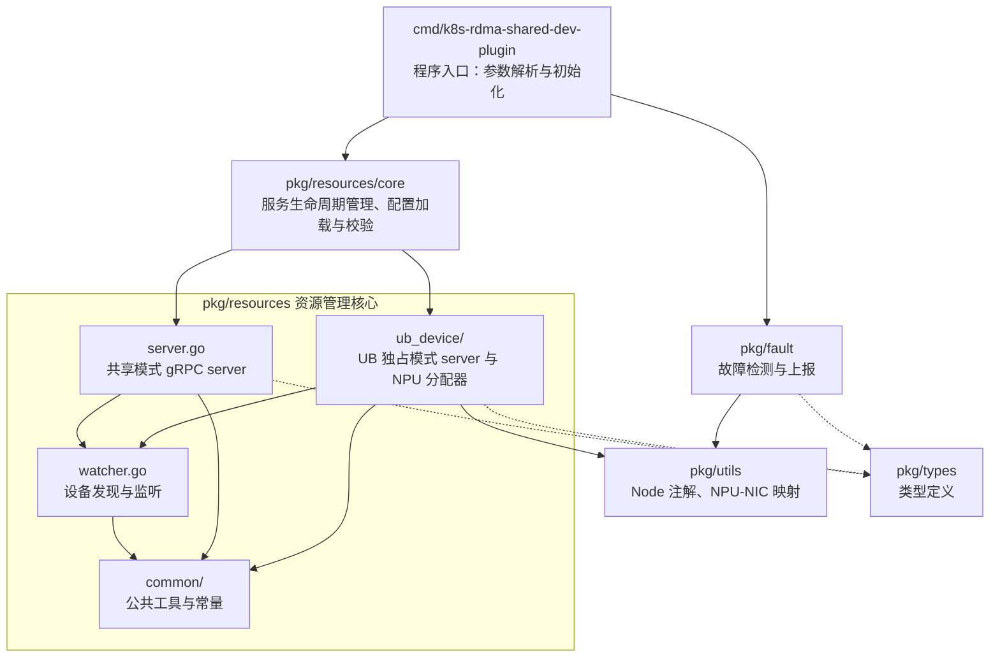

# K8s RDMA Shared Dev Plugin

## 目录

- [简介](#简介)
- [软件架构](#软件架构)
    - [上下游依赖](#上下游依赖)
    - [组件架构](#组件架构)
- [编译指南](#编译指南)
- [安装部署](#安装部署)
- [使用指南](#使用指南)
- [说明](#说明)

## 简介

k8s-rdma-shared-dev-plugin 是 Kubernetes 设备管理插件，支持以下设备使用资源监测：

- UB RDMA DPU

组件拥有以下功能：

- 设备发现：支持发现计算节点上的 UB RDMA 设备，将发现的设备上报到 Kubernetes 系统中。支持共享与独占两种工作模式，共享模式下将节点上的 RDMA 设备作为共享资源上报；独占模式下按 NPU 与 DPU 的映射关系为 Pod 分配节点上发现的真实 UB 设备。
- 健康检查：支持检测 UB 设备的健康状态，当设备处于不健康状态时，将故障信息写入 Kubernetes ConfigMap。
- 设备分配：支持在 Kubernetes 系统中分配 RDMA 设备；独占模式下按 NPU 与 DPU 的映射关系为 Pod 分配设备，并将分配结果写入 `k8s.v1.cni.cncf.io/device-status` 注解，供 Multus CNI 与 UB Host Device CNI 使用完成设备挂载。

组件 UB 功能示意：



## 软件架构

### 上下游依赖



- 从设备目录读取设备信息。
- 上报RDMA设备的类型、数量和状态给kubelet。
- 通过hinicadm5工具进行RDMA设备的故障检测。
- RDMA设备故障上报，支持ClusterD进行故障汇总。
- 独占模式从业务Pod获取Volcano写入的NPU卡信息。

### 组件架构



## 编译指南

1. 通过 git 拉取源码，并切换 master 分支，获得 k8s-rdma-shared-dev-plugin。

   示例：源码放在 `/home/mind-cluster/component/k8s-rdma-shared-dev-plugin` 目录下

2. 执行以下命令，进入构建目录，执行构建脚本，在 `output` 目录下生成二进制组件包、yaml 文件、Dockerfile 等文件。

    ```shell
    cd /home/mind-cluster/component/k8s-rdma-shared-dev-plugin/build
    ```

    ```bash
    chmod +x build.sh
    ./build.sh
    ```

3. 执行以下命令，查看 **output** 生成的软件列表。

    ```shell
    ll /home/mind-cluster/component/k8s-rdma-shared-dev-plugin/output
    ```

    ```text
    k8s-rdma-shared-dp
    k8s-rdma-shared-dp-v26.1.0.yaml
    config.json
    Dockerfile
    Dockerfile.openeuler
    agreement.txt
    fault_code.json
    fault_detection.sh
    npu-nic-mapping.json
    ```

## 安装部署

组件以 DaemonSet 方式部署在集群的每个计算节点上

1. Helm安装，请参考[MindCluster 安装部署 - 使用Helm安装](../../docs/zh/scheduling/03_installation_guide/02_installation/00_helm_installation.md)
2. 手动安装与部署（包含安装前置检查、镜像准备、yaml 部署及安装验证等），请参见[MindCluster 集群调度组件开发指南 - 手动安装](../../docs/zh/scheduling/05_developer_guide/00_installation_deployment/00_manual_installation/12_k8s_rdma_shared_dev_plugin.md)

## 使用指南

组件的具体使用配置请参见[K8s RDMA Shared Dev Plugin 安装指导](../../docs/zh/scheduling/05_developer_guide/00_installation_deployment/00_manual_installation/12_k8s_rdma_shared_dev_plugin.md)。

## 说明

当前容器方式部署本组件，本组件的认证鉴权方式为 ServiceAccount，该认证鉴权方式为 ServiceAccount 的 token 明文显示，建议用户自行进行安全加强。
