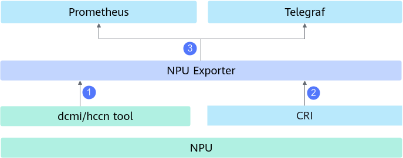
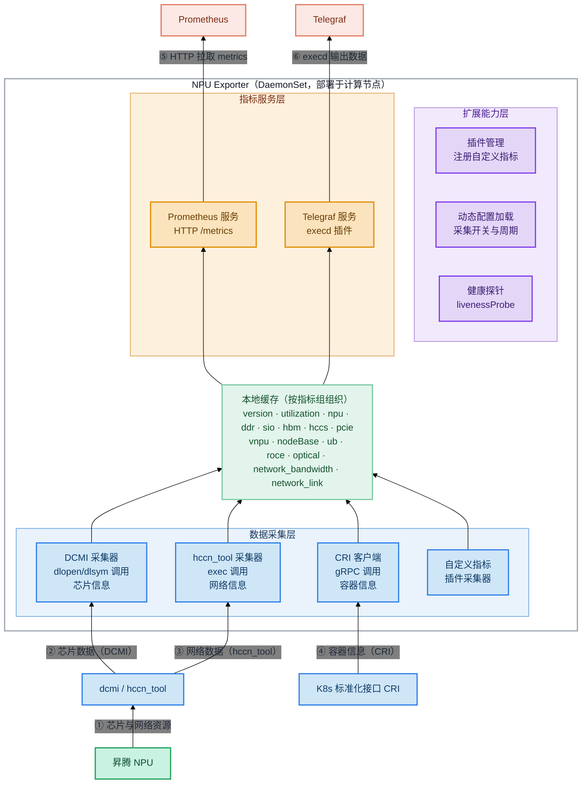

# NPU Exporter

## 目录

- [简介](#简介)
- [软件架构](#软件架构)
  - [上下游依赖](#上下游依赖)
  - [组件架构](#组件架构)
- [编译指南](#编译指南)
- [安装部署](#安装部署)
- [使用指南](#使用指南)
- [说明](#说明)

## 简介

- NPU Exporter 是华为自研的专门收集昇腾NPU各种监测信息和指标，并将监测对象的指标转换为 Prometheus、Telegraf 能够识别的数据格式，供上层监测系统集成的服务组件。
- 在任务运行过程中，需要密切关注芯片的网络和算力使用情况，为任务的调优提供数据支持。NPU Exporter 用于上报芯片的各项指标状态。
- 主要功能：
  - 从驱动中获取芯片、网络的各项数据信息，并支持 Prometheus、Telegraf 两种方式上报。
  - 插件化管理，支持通过插件开发新的指标，支持针对不同类型的指标配置不同的采集周期。

## 软件架构

### 上下游依赖

  

  - NPU Exporter 从驱动中获取芯片信息与网络信息，并放入本地缓存。
  - 从 K8s 标准化接口 CRI 中获取容器信息，并放入本地缓存。
  - 实现 Prometheus 或 Telegraf 的接口，供二者周期性获取缓存中的数据信息。

  具体数据获取方式如下：

  1. 通过 gRPC 服务调用 K8s 中的标准化接口 CRI，获取容器相关信息。
  2. 通过 exec 调用 hccn_tool 工具，获取芯片的网络信息。
  3. 通过 dlopen/dlsym 调用 DCMI 接口，获取芯片信息，并上报给 Prometheus。

### 组件架构

NPU Exporter 组件在 Kubernetes 集群中以容器方式（DaemonSet）部署在计算节点上，模块层级如下：



## 编译指南

1. 通过 git 拉取源码，获得 npu-exporter。

    示例：源码放在 /home/mind-cluster/component/npu-exporter 目录下。

2. 执行以下命令，进入构建目录，执行构建脚本，在 "output" 目录下生成二进制 npu-exporter、yaml 文件、配置文件和 Dockerfile 等文件。

    ```shell
    cd /home/mind-cluster/component/npu-exporter/build/
    chmod +x build.sh
    ./build.sh
    ```

    构建版本号默认取自 `service_config.ini` 文件，若该文件不存在则默认使用 v6.0.0。

3. 执行以下命令，查看 "output" 目录生成的软件列表。

    ```shell
    ll /home/mind-cluster/component/npu-exporter/output
    ```

    ```text
    drwxr-xr-x 2 root root     4096 Jan 29 19:12 ./
    drwxr-xr-x 9 root root     4096 Jan 29 19:09 ../
    -r-x------ 1 root root 25481072 Jan 29 19:09 npu-exporter
    -r-------- 1 root root     3438 Jan 29 19:09 npu-exporter-v6.0.0.yaml
    -r-------- 1 root root     3438 Jan 29 19:09 npu-exporter-310P-1usoc-v6.0.0.yaml
    -r-------- 1 root root      623 Jan 29 19:09 metricConfiguration.json
    -r-------- 1 root root      623 Jan 29 19:09 pluginConfiguration.json
    -r-------- 1 root root      623 Jan 29 19:09 agreement.txt
    -r-------- 1 root root      623 Jan 29 19:09 Dockerfile
    -r-------- 1 root root      623 Jan 29 19:09 Dockerfile.openeuler
    -r-------- 1 root root      623 Jan 29 19:09 Dockerfile-310P-1usoc
    -r-------- 1 root root      623 Jan 29 19:09 Dockerfile-310P-1usoc.openeuler
    -r-x------ 1 root root     2579 Jan 29 19:09 run_for_310P_1usoc.sh
    ```

## 安装部署

当前 NPU Exporter 组件的安装部署支持两种方式：

1. Helm 安装，请参考 [使用 Helm 安装](../../docs/zh/scheduling/03_installation_guide/02_installation/00_helm_installation.md)。

2. 手动安装与部署（包含使用约束、镜像/二进制方式部署、启动参数及动态配置加载等），请参见 [手动安装NPU Exporter](../../docs/zh/scheduling/05_developer_guide/00_installation_deployment/00_manual_installation/03_npu_exporter.md)。

## 使用指南

NPU Exporter 组件的最佳实践（包含使用前必读、实现原理，以及通过 Prometheus 或 Telegraf 使用资源监测的完整流程），请参见 [资源监测](../../docs/zh/scheduling/04_usage/01_resource_monitoring/menu_resource_monitoring.md)。

## 说明

- 当前 NPU Exporter 默认以 HTTP 方式提供服务，如需使用 HTTPS，可通过启动参数 `--tls-cert-file` 与 `--tls-private-key-file` 配置证书，具体请参见 [健康探针安全加固](../../docs/zh/scheduling/07_references/04_security_hardening.md#ZH-CN_TOPIC_0000002511346467)。
- 使用 Telegraf 集成时，在 `plugins/inputs/all/npu.go` 中添加 `import _ "github.com/influxdata/telegraf/plugins/inputs/npu"`。
- Kubernetes 场景下组件以 ServiceAccount 方式认证鉴权，该方式的 token 以明文显示，建议用户自行进行安全加强。
