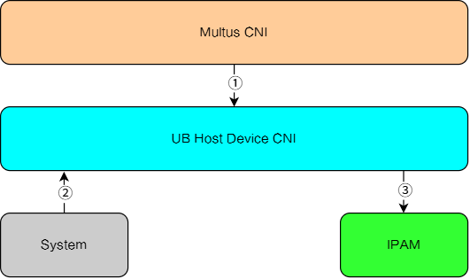
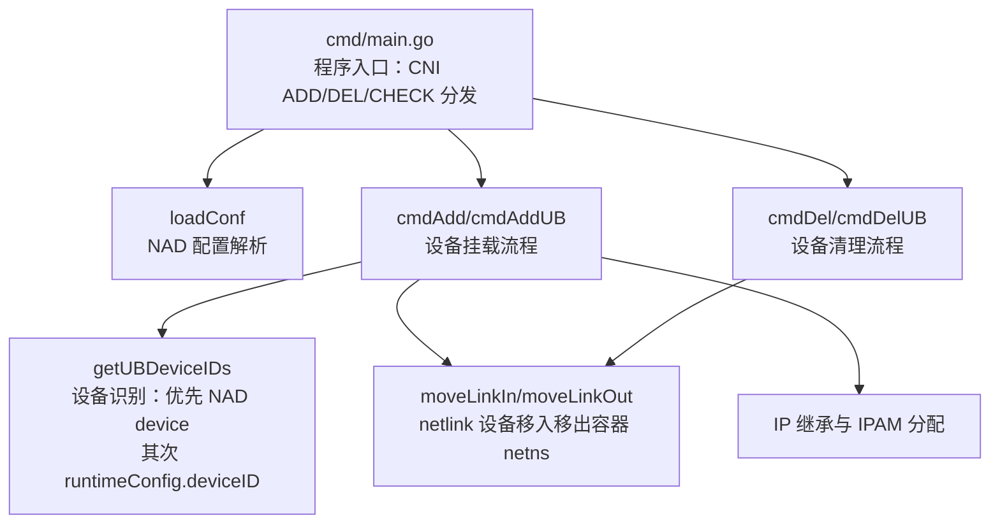

# UB Host Device CNI

## 目录

- [简介](#简介)
- [软件架构](#软件架构)
  - [上下游依赖](#上下游依赖)
  - [组件架构](#组件架构)
- [编译指南](#编译指南)
- [安装部署](#安装部署)
- [使用指南](#使用指南)
- [说明](#说明)

## 简介

ub-host-device-cni 是一个基于 CNI（Container Network Interface）规范的主机设备挂载插件，支持以下产品使用本插件：

- UB RDMA DPU

组件在 host-device 插件基础上扩展了对UB RDMA设备的支持，拥有以下功能：

- 设备挂载：将主机网络设备挂载进容器网络命名空间，容器内直接使用宿主设备，性能无损。
- 设备识别：UB 模式下支持两种设备来源，优先级为 **NAD `device`（主机网卡名） > `runtimeConfig.deviceID`（kubelet/Multus 注入的 UB 设备地址）**。
- IP 继承：开启 `inheritHostIP` 后，挂载的 UB 接口保留宿主机原有 IP 地址，不额外申请新 IP。
- IPAM 分配：未开启 IP 继承时，支持配置 IPAM 插件为挂载的接口分配 IP 地址、路由。
- 资源调度联动：配合 device-plugin 在 NAD 中声明 `huawei.com/ub_rdma` 资源，由 Multus 通过 `capabilities: { "deviceID": true }` 将分配的设备地址注入 `runtimeConfig.deviceID`。

## 软件架构

组件以 CNI 插件二进制方式部署在集群的每个计算节点上，由容器运行时通过 CNI 规范加载调用：

- 通过 CNI ADD/DEL 接口响应容器的网络创建与销毁事件。
- 通过 netlink 与网络命名空间（netns）将主机网络设备移入/移出容器。
- 通过 IPAM 插件或 IP 继承完成容器接口的 IP 地址配置。

### 上下游依赖



- 挂载设备来源之一： Multus CNI下发的`runtimeConfig.deviceID`。。
- 根据获取的设备信息查询具体的网卡设备。
- 通过IPAM插件为挂载的网卡分配IP地址。

### 组件架构



## 编译指南

1. 通过 git 拉取源码，并切换 master 分支，获得 ub-host-device-cni。

    示例：源码放在 `/home/mind-cluster/component/ub-host-device-cni` 目录下

2. 执行以下命令，进入构建目录，执行构建脚本，在 `output` 目录下生成二进制 ub-host-device。

    ```shell
    cd /home/mind-cluster/component/ub-host-device-cni/build
    ```

    ```shell
    chmod +x build.sh

    ./build.sh
    ```

3. 执行以下命令，查看 **output** 生成的软件列表。

    ```shell
    ll /home/mind-cluster/component/ub-host-device-cni/output
    ```

    ```output
    drwxr-xr-x 2 root root     4096  4月 29 09:28 ./
    drwxr-xr-x 6 root root     4096  4月 29 09:28 ../
    -r-x------ 1 root root 59349656  4月 29 09:28 ub-host-device*
    ```

## 安装部署

组件以 CNI 插件二进制方式部署在集群的每个计算节点上

1. 将编译生成的 `ub-host-device` 二进制部署到节点 CNI 插件目录 `/opt/cni/bin`。
2. 配置 NetworkAttachmentDefinition（NAD）供 Multus CNI 调用，配置方法请参见[UB Host Device CNI](../../docs/zh/scheduling/06_api/19_ub_host_device_cni.md)。
3. 容器运行时在 Pod 创建时通过 CNI 规范自动加载本插件，无需额外部署 Pod。

## 使用指南

本插件通过 Kubernetes 的 NetworkAttachmentDefinition（NAD）进行配置，典型示例参见[UB Host Device CNI - NAD配置示例](../../docs/zh/scheduling/06_api/19_ub_host_device_cni.md)。

## 说明

1. 本插件为 CNI 网络插件，需通过 CNI 配置（如 NAD/Multus）加载，非独立部署组件。
2. 插件仅支持 Linux 操作系统，依赖 netlink 与网络命名空间（netns）能力。
3. UB 模式下，`runtimeConfig.deviceID` 由 kubelet/Multus 依据 device-plugin 的资源分配结果注入。
