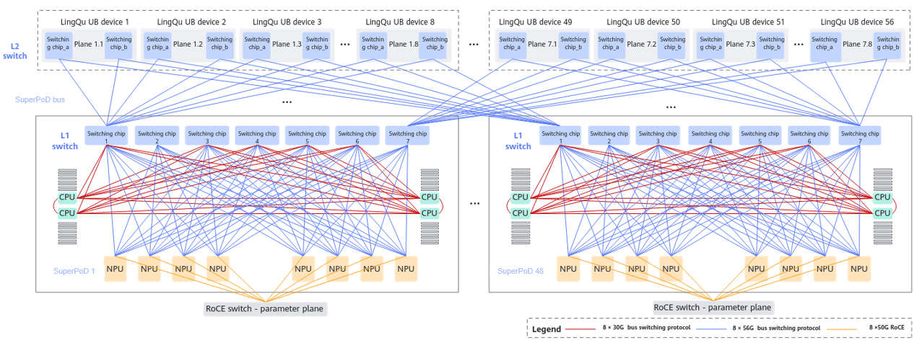

# Prerequisites

<!-- md-trans-meta sourceCommit=a277c409db3c3340f95d7c4831c0d54fa24e71a7 translatedAt=2026-08-24T02:15:06.391Z pushedAt=2026-08-24T02:22:41.516Z -->

Before using ascend-fd-tk, you are advised to understand the following concepts.

## Basic Concepts

| Concept | Description                                                                           |
|------|------------------------------------------------------------------------------|
| Baseboard Management Controller (BMC) | Used for remote management of server hardware. BMC logs can be collected for hardware diagnosis.        |
| iBMC | Huawei server intelligent baseboard management controller. This tool accesses Huawei iBMC through the `ipmcget` commands.                                 |
| Switch | Network switching device used for network communication between cluster nodes. Switch logs can be collected for network diagnosis.                                           |
| Host | Host server, a compute node that runs training or inference tasks.                                                         |
| HCCS | Huawei Cache Coherent System, Huawei cache-coherent system interconnect bus used for high-speed interconnection between CPUs and NPUs. The tool supports HCCS link diagnosis. |
| RoCE | RDMA over Converged Ethernet, a remote direct memory access technology based on converged Ethernet. RoCE switches are used for data transmission on the RoCE parameter plane.     |
| UnifiedBus | Huawei cluster high-speed switching plane, divided into two layers: L1 (intra-chassis interconnection) and L2 (cross-chassis interconnection).                                     |
| Network plane | Different network subnets in a cluster. In multi-network-plane scenarios, collection must be performed in batches.                                                     |

## Hardware Networking Topology

This section describes the hardware networking architecture of the AI SuperPoD intelligent computing cluster that ascend-fd-tk detects, helping users understand the diagnostic targets and applicable scenarios of the tool.

### Networking Overview

The AI SuperPoD intelligent computing cluster consists of two parts that together form a complete hardware networking architecture: **intelligent computing servers** and **dedicated high-speed bus switching devices**. The servers and switching devices achieve high-speed interconnection through a dedicated bus protocol, supporting high-compute workloads such as large model training. The intra-cluster links and hardware device status are all inspection targets of this fault diagnosis tool.

### Typical Example

The 384-NPU-module Atlas 800T A3 SuperPoD is used as a typical example to illustrate the networking composition. The schematic diagram of the 384-NPU-module SuperPoD networking solution is as follows:

The entire computing cluster consists of a physically isolated RoCE parameter plane and a UnifiedBus switching plane.

| Network Plane | Architecture | Carried Traffic | Switching Device |
|----------|------|----------|----------|
| UnifiedBus switching plane | Two layers: L1 + L2 | Inter-NPU memory access traffic | UnifiedBus L1/L2 switches |
| RoCE parameter plane | Leaf-spine Ethernet | Service traffic such as parameter synchronization, data read/write, and cross-cluster training | RoCE switches |

- **UnifiedBus L1**: Implements high-speed interconnection among multiple NPUs within a single machine.
- **UnifiedBus L2**: Completes interconnection of compute nodes across cabinets.
- The hardware links of the two planes are completely independent, and they are detected separately during diagnosis.

For complete parameters such as detailed device structure, appearance, and networking topology, refer to the [official documentation](https://support.huawei.com/enterprise/en/doc/EDOC1100508910/426cffd9/about-this-document?idPath=23710424|251366513|22892968|252309113|261716443).
