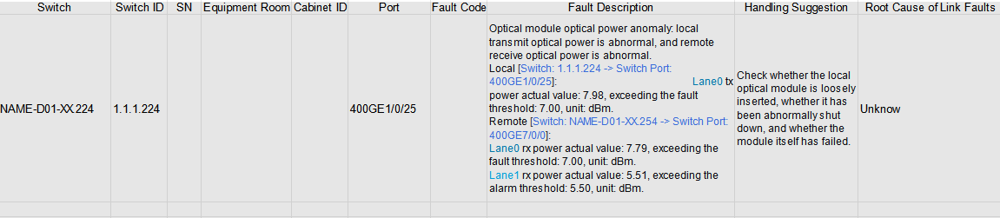
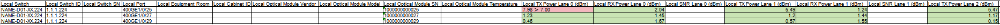

# Quick Start

<!-- md-trans-meta sourceCommit=cc2549abde258f50a946dbab123b7ff2035ed91e translatedAt=2026-08-24T02:15:30.506Z pushedAt=2026-08-24T02:22:41.525Z -->

This document guides you through the diagnosis operation with ascend-fd-tk, demonstrating the link failure diagnosis feature based on offline switch logs.

## Prerequisites

- Ensure that Python 3.8 or later, the corresponding pip3 version, and the unzip extraction tool are installed on the Linux operating system.
- Ensure that the network connection is normal, as the installation process requires internet access to download third-party dependency libraries.

## Step 1: Install the Tool

1. Download the software package.

    ```bash
    # Download the fault diagnosis ZIP package of version v26.1.0 (because the ascend-fd-tk Whl installation package is architecture-independent, the following example directly downloads the aarch64 architecture).
    wget https://gitcode.com/Ascend/mind-cluster/releases/download/v26.1.0/Ascend-mindxdl-faultdiag_26.1.0_linux-aarch64.zip
    unzip Ascend-mindxdl-faultdiag_26.1.0_linux-aarch64.zip
    ```

2. Install the software package.

    ```bash
    pip3 install ascend_faultdiag_toolkit-26.1.0-py3-none-any.whl
    ```

    Output if installation succeeds:

    ```txt
    Successfully installed ascend-faultdiag-toolkit-26.1.0
    ```

3. Verify whether the installation is successful.

    ```bash
    ascend-fd-tk about
    ```

    Output if installation succeeds:

    ```text
    MindCluster ascend-faultdiag-toolkit version: 26.1.0
    ```

## Step 2: Clear the Cache

Before first use or before re-diagnosis, it is recommended to clear the cache to prevent previous diagnosis results from affecting the current diagnosis.

```bash
ascend-fd-tk clear_cache
```

Output if clearing succeeds:

```text
Clearing successful
```

## Step 3: Configure the Data Source (Offline Mode) and Perform One-Click Diagnosis

Take switch offline logs as an example. Place the [sample logs](../../../resource/switch_logs) in a server directory (for example, the `temp` directory). The tool supports automatic decompression of compressed packages, so no prior decompression is required.

1. Obtain the sample switch offline logs.

    ```bash
    mkdir -p /temp/switch_logs && cd /temp/switch_logs
    wget \
    https://raw.gitcode.com/Ascend/mind-cluster/blobs/19ab0e6d1acc5b64e5153d479f632302e9d82827/switch_logs/diagnostic_information_NAME-D01-XX.224_20260327113617.zip \
    https://raw.gitcode.com/Ascend/mind-cluster/blobs/afd88c0586ad298f1eb46f3f515e82f9b5dd47ab/switch_logs/diagnostic_information_NAME-D01-XX.254_20260327113617.zip
    ```

2. Run the one-click diagnosis command. The tool automatically completes log parsing and fault diagnosis.

    ```bash
    cd /temp/
    ascend-fd-tk set_switch_dump_log /temp/switch_logs auto_collect_diag
    ```

    Output if the operation succeeds:

    ```text
    Configuration successful
    ...
    Diagnosis completed
    ```

## Step 4: View the Report

After the diagnosis is complete, the report is automatically generated in the directory: `~/.ascend-faultdiag-toolkit/report/diag_report_{YYYYMMDD_HHMMSS}.xlsx`. For details about the meanings and interpretation of the report fields, see [Diagnosis/Inspection Report Description](../05_usage/06_fault_analysis_report.md).

Examples of diagnostic reports:

Figure 1 Example of a switch failure analysis report



Figure 2 Example of inter-switch optical module information report



## Next Steps

- For detailed installation instructions, see [Installation Guide](../04_installation_guide/01_installation.md).
- See [Feature Overview](../05_usage/01_usage_overview.md) to learn more about the features.
- See [API Overview](../06_api/01_api_overview.md) to learn more about the commands.
