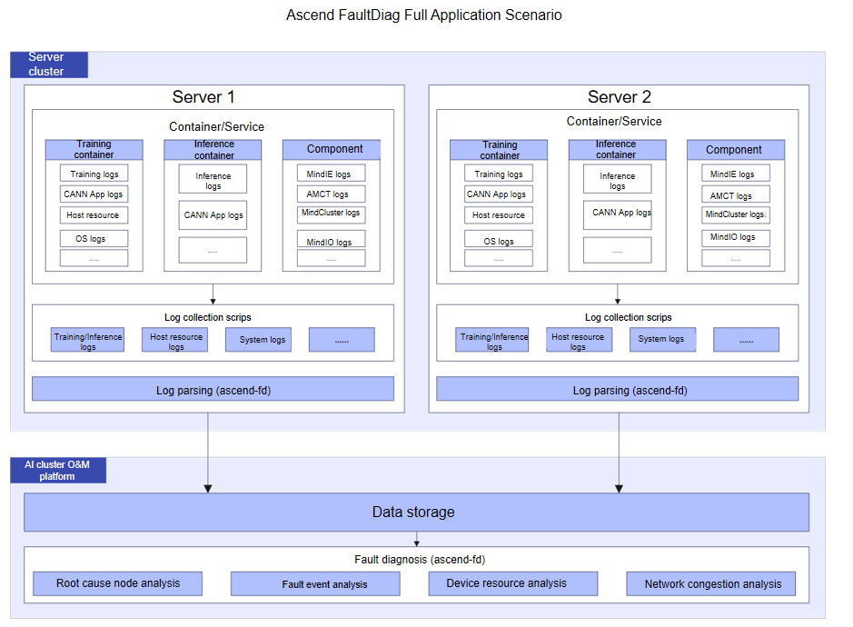
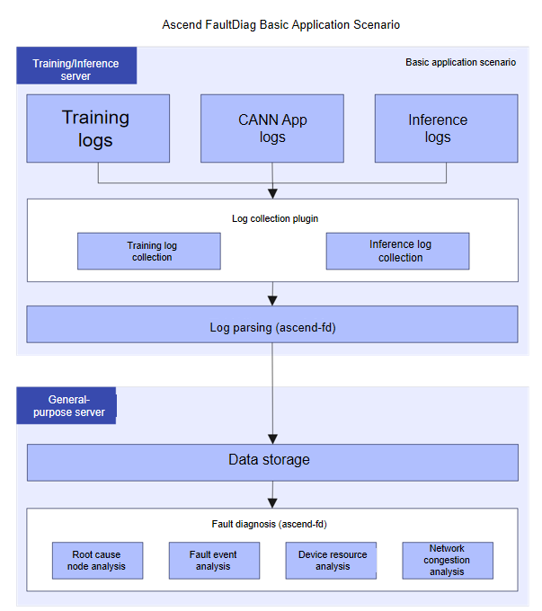

# Overview

<!-- md-trans-meta sourceCommit=8365be9d0952baf3115b994bb9ecbcf4fa1c577c translatedAt=2026-08-24T02:26:35.825Z pushedAt=2026-08-24T02:51:43.230Z -->

## Product Introduction

**MindCluster Ascend FaultDiag** (hereinafter referred to as ascend-fd) is a log diagnosis tool for Ascend AI clusters, providing two core functions: log parsing and fault diagnosis. When a training or inference task exits abnormally or suffers performance degradation, ascend-fd can automatically extract key information from cluster logs, analyze root cause nodes and fault events, and help users quickly locate problems.

## Core Capabilities

<!-- markdownlint-disable MD033 -->
<table>
  <thead>
    <tr>
      <th>Capability</th>
      <th>Description</th>
    </tr>
  </thead>
  <tbody>
    <tr>
      <td>Log parsing</td>
      <td>Cleans raw logs and monitoring metric information, filters and extracts valid information, and provides data support for diagnosis tasks.</td>
    </tr>
    <tr>
      <td>Fault diagnosis</td>
      <td>
        Based on the cleaned data, analyzes the root cause nodes and fault events, and outputs a diagnosis report. The following diagnosis types are supported:
        <ul>
          <li><strong>Root cause node analysis</strong>: Locates the root cause server node that triggers the error based on the HCCL error information of cluster communication.</li>
          <li><strong>Fault event analysis</strong>: Analyzes the problems of the device where the node resides based on the fault patterns contained in the fault knowledge graph.</li>
          <li><strong>Device resource analysis</strong>: Analyzes the resource status of the device and locates computing frequency reduction and CPU resource contention problems.</li>
          <li><strong>Network congestion analysis</strong>: Analyzes the network status between nodes and locates network congestion problems in cluster scenarios.</li>
        </ul>
      </td>
    </tr>
  </tbody>
</table>
<!-- markdownlint-enable MD033 -->

## Integration Solution

| Scenario Name                 | User                                               | Task Type          | Features                                                                                                            |
|-------------------------------|----------------------------------------------------|--------------------|---------------------------------------------------------------------------------------------------------------------|
| [Full Application](#full-application) | Enterprises, government agencies, public institutions, etc. (with AI cluster O&M platform capabilities) | Training task, inference task | Depends on training or inference, CANN, host-side resources, and hardware-related data. The collection content is complex and is suitable for AI cluster O&M platform users to perform complex task diagnosis. |
| [Basic Application](#basic-application) | Individuals                                        | Training task, inference task | Can rely only on training or inference logs and CANN App logs. The collection content and method are simple and are suitable for individual users to perform basic task diagnosis. |

### Full Application

This scenario is divided into training and inference:

- Training scenario: It depends on multiple types of logs and metric data, including training logs, host resource logs, NPU logs, and hardware logs.

- Inference scenario: It depends on inference task logs, CANN App logs, device-side logs, and MindIE component logs.

After a training or inference task ends, all the preceding logs and metric data must be collected.

Users need to install the ascend-fd component on each device, use the cleaning function to filter and extract valid information, and dump the results to the AI O&M platform for root cause diagnosis.

The solution is as follows:

**Figure 1** Full application solution

### Basic Application

This scenario can rely solely on training or inference logs and CANN App logs.

Users install the ascend-fd component on all training or inference devices. After tasks complete, training or inference logs and CANN App logs are collected, cleansed to extract valid information, dumped to general-purpose devices, and then analyzed to diagnose the root cause of faults.

The solution is as follows:

**Figure 2** Basic application solution

<!-- markdownlint-disable-next-line MD033 -->

## Usage Process

The typical process for using ascend-fd is as follows:

1. **Log collection**: Collect log files from each training/inference device.
2. **Log parsing**: Parse logs and extract valid information.
3. **Cleaning result dump**: Aggregate the cleaning results from each node onto the same device.
4. **Fault diagnosis**: Analyze the root cause of a fault.

## Disclaimer

- This document may contain third-party information, products, services, software, components, data, or content (collectively referred to as "third-party content"). Huawei does not control and assumes no responsibility for third-party content, including but not limited to its accuracy, compatibility, reliability, availability, legality, appropriateness, performance, non-infringement, and update status, unless otherwise expressly stated in this document. Any reference to or mention of third-party content in this document does not constitute Huawei's endorsement or warranty of such third-party content.
- If users require third-party licenses, they must obtain such licenses through lawful means, unless otherwise expressly stated in this document.
