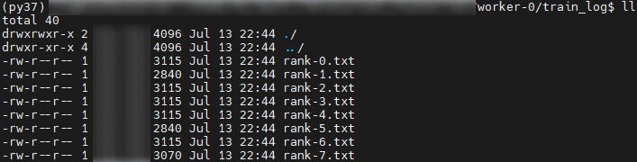

# Log Collection

<!-- md-trans-meta sourceCommit=a277c409db3c3340f95d7c4831c0d54fa24e71a7 translatedAt=2026-08-24T02:27:48.402Z pushedAt=2026-08-24T02:51:43.261Z -->

Log collection is the first prerequisites to use ascend-fd. You need to collect log files from each training/inference device and store them according to the specified structure.

## Log Collection Archive Directory Structure

Currently, logs are classified into three types: host-side logs, BMC-side logs, and LCNE logs.

Host-side logs refer to all logs other than BMC-side logs and LCNE logs, such as `process_log`, `dl_log`, and `device_log`.

BMC-side logs are logs collected on the BMC software.

LCNE logs are logs generated during LCNE runtime.

Collect all logs into the same collection directory. The directory structure is as follows:

```text
collection_directory
|-- messages             # Host-side operating system log
|-- dmesg                # Host-side kernel message log
|-- crash
    └── host + fault timestamp directory
        └── vmcore_dmesg.txt     # Kernel logs at the time of system crash
|-- sysmonitor.log       # Host-side system monitoring logs
|-- rank-0.txt           # Training console logs (card 0)
...
|-- rank-7.txt           # Training console logs (card 7)
|-- dmidecode.txt        # Host-side hardware information logs
|-- process_log          # CANN App logs (directory name must be process_log)
|-- device_log           # Device-side logs (directory name must be device_log)
|-- dl_log               # MindCluster component logs (directory name must be dl_log)
    |-- devicePlugin       # Ascend Device Plugin logs
    |-- noded              # NodeD logs
    |-- ascend-docker-runtime  # Docker Runtime logs
    |-- volcano-scheduler      # Volcano scheduler logs
    |-- volcano-controller     # Volcano controller logs
    |-- npu-exporter           # NPU Exporter logs
    └── ttp_log                # MindIO component logs
|-- mindie               # MindIE component logs
    └── log
        |-- debug        # Runtime logs
        |-- security     # Audit logs
        └── mindie_cluster_log  # MindIE Pod logs
|-- amct_log             # AMCT logs
|-- lcne_log             # LCNE logs
    |-- log.log
    |-- log_1_*.log
    |-- diag_display_info.txt
    └── diagnostic_information
        └── slot_1
            └── tempdir
                └── devm_bddrvadp.log
|-- environment_check    # Environment check logs: NPU network interfaces, status, resource info
    |-- npu_smi_0_details.csv   # NPU status monitoring
    |-- npu_0_details.csv       # NPU network interface statistics
    |-- npu_info_before.txt     # NPU environment check before training
    |-- npu_info_after.txt      # NPU environment check after training
    └── host_metrics_{core_num}.json  # Host resource monitoring
|-- pymotor_vllm_log     # PyMotor/vLLM logs
└── bmc_log              # BMC-side logs
    └── dump_info
        |-- AppDump
        |-- DeviceDump
        └── LogDump
```

## Precautions

- The total size of log files in the input directory should be limited to less than 5 GB, and the total number of files should not exceed 1,000,000.
- A single CANN App log file should be limited to less than 20 MB.
- NPU status monitoring metric files and NPU network port statistics files should be limited to less than 512 MB.
- By default, only the last 1 MB of user training/inference logs is read.
- If training or inference is performed in a container, save logs to the host in a timely manner, such as training and inference logs and CANN App logs.

## Component Log Collection

### CANN App Logs

After training or inference completes, run the following command to copy the logs to `{collection_directory}/process_log`:

```shell
cp -r $HOME/ascend/log/* {collection_directory}/process_log
```

Directory structure:

```text
|--process_log
    |--debug
        |--plog               # Host-side App log directory
            └──plog-{pid}_{unix_time}.log
        |--device-0           # Device-side App log directory
            └──device-{pid}_{unix_time}.log
        |--device-1
        |--device-2
        |--…
    |--run
    |--operation
    └──security
```

> [!NOTE]
>
> - CANN App logs are stored in the `$HOME/ascend/log` directory by default, and the log storage path can be customized through the environment variable `ASCEND_PROCESS_LOG_PATH`.
> - App logs printed by CANN include two types: host-side App logs `plog-{pid}_{unix time}.log` and device-side App logs `device-{pid}_{unix time}.log`. For more log-related information, see [Viewing Logs (Ascend EP)](https://www.hiascend.com/document/detail/en/CANNCommunityEdition/910/maintenref/logreference/logreference_0002.html) in [*CANN Log Reference*](https://www.hiascend.com/document/detail/en/CANNCommunityEdition/910/maintenref/logreference/logreference_0001.html).

### User Training/Inference Logs

After training or inference is complete, copy the training or inference logs to the `collection_directory`, and name the training and inference logs of each card in the following format:

- `rank-(rank_id).log` or `rank-(rank_id).txt`
- `worker-(worker_id).log` or `worker-(worker_id).txt`

**Figure 1**  Example of training and inference logs



> [!NOTE]
>
> When an AI framework is used, the training and inference logs are the logs printed to the screen by Python. You usually store them locally through redirection. Under the PyTorch framework, there is only one copy of the console log.

### Environment Check Logs

The environment check logs include the environment check logs before, during, and after training or inference.

#### Environment Check Logs Before Training or Inference

Use the `npu_info_collect.sh` script in the [environment check log collection script](https://gitcode.com/Ascend/mindxdl-deploy/tree/master/npu_collector/) to collect NPU environment information before training or inference.

Run the following command to collect the information:

```shell
bash npu_info_collect.sh {collection_directory}/environment_check/npu_info_before.txt
```

#### Environment Check Logs During Training or Inference

Use the `net_data_collect.py` in the [environment check log collection script](https://gitcode.com/Ascend/mindxdl-deploy/tree/master/npu_collector/) to collect NPU network port statistics monitoring metrics.

Starting this script for collection will affect the performance of training or inference tasks.

Run the following command to collect:

```shell
python net_data_collect.py -n 8 -it 15 -o {collection_directory}/environment_check/
```

Script parameters:

| Parameter            | Type   | Mandatory | Description                                    |
|-----------------|--------|-----------|------------------------------------------------|
| `-n`, `--num`       | int    | Mandatory | Number of NPUs                                |
| `-it`, `--interval` | int    | Mandatory | Collection interval (unit: second). Collecting once every 15 seconds is sufficient. |
| `-o`, `--output`    | string | Mandatory | Output collection directory                   |

> [!NOTE]
>
> - The number of NPUs here must be consistent with the number of NPUs used during training and inference.
> - The collection interval is 15 seconds. Adjust it based on the actual situation.
> - After collection is complete, files such as `npu_0_details.csv` and `npu_1_details.csv` are generated under `{collection_directory}/environment_check/`.

#### Environment Check Logs After Training or Inference

Use the `npu_info_collect.sh` script in the [environment check log collection script](https://gitcode.com/Ascend/mindxdl-deploy/tree/master/npu_collector/) to collect NPU environment information after training or inference.

Run the following command to collect the information:

```shell
bash npu_info_collect.sh {collection_directory}/environment_check/npu_info_after.txt
```

### Host-Side Logs

After training or inference is complete, the following logs need to be collected on the host side.

| Log Description                     | Naming Format    | Storage Path                   |
|-------------------------------------|------------------|--------------------------------|
| Host-side operating system logs      | messages-*       | {collection_directory}/          |
| Host-side kernel message logs       | dmesg            | {collection_directory}/          |
| Host-side system monitoring logs     | sysmonitor.log   | {collection_directory}/          |
| Host-side kernel message logs upon a system crash | vmcore_dmesg.txt | {collection_directory}/crash/{system time}/ |
| Host-side hardware information logs  | dmidecode.txt    | {collection_directory}/          |

#### Host-Side Operating System Logs

The host-side operating system logs `messages` are stored in the `/var/log` directory.

You need to manually copy the log information corresponding to the start and end times of training and inference to the `collection_directory`.

#### Host-Side Kernel Message Logs

Use the following command to collect the latest dmesg logs to the collection directory, with a maximum of 100,000 lines collected:

```shell
dmesg -T | tail -n 100000 > {collection_directory}/dmesg
```

#### Host-Side System Monitoring Logs

Use the following command to copy `sysmonitor.log` to the collection directory:

```shell
cp -r /var/log/sysmonitor.log {collection_directory}/
```

#### Host-Side Kernel Message Logs upon a System Crash

The host-side kernel message logs are stored in the host-side kernel message file saved when the system crashes.

Run the following command to copy the log file to the collection directory:

```shell
cp -r /var/crash/ {collection_directory}/
```

#### Host-Side Hardware Information Logs

The `dmidecode` logs on the host side contain DMI hardware information.

Run the following command to collect the `dmidecode` logs to the collection directory:

```shell
dmidecode > {collection_directory}/dmidecode.txt
```

### Device-Side Logs

After training or inference is complete, run the following command to collect device-side logs:

```shell
msnpureport
```

After the command is executed, timestamp-named log data is generated in the current directory. Run the following command to copy the logs to the collection directory:

```shell
cp -r {Timestamp_directory}/slog {collection_directory}/device_log
cp -r {Timestamp_directory}/hisi_logs {collection_directory}/device_log
```

Directory structure:

- Ascend HDK 23.0.RC3

    ```text
    |--device_log
        |-- slog
            |-- dev-os-3
                |-- debug
                    |--device-os
                        └── device-os_{time}.log # System logs on device-side Control CPU
                |-- run
                    |--device-os
                        └── device-os_{time}.log # System logs on device-side Control CPU
                |--device-0
                    └──device-0_{time}.log   # System logs on device-side non-Control CPU
                |--device-2
                |--…
                |--slogd
                └──device_sys_init_ext.log
            |-- dev-os-7
            |-- …
        └──hisi_logs
            |-- device-0
                |-- …
                └── history.log     # Black Box log
            |-- device-2
            |-- …
            └── device_info.txt
    ```

- Ascend HDK 23.0.3 and later versions

    ```text
    |--device_log
        |-- slog
            |-- dev-os-3
                |-- debug
                    |--device-os
                        |-- device-os_{time}.log # System logs on device-side Control CPU
                    |--device-0
                        |--device-0_{time}.log   # System logs on device-side non-Control CPU
                    |--device-2
                    |--…
                |-- run
                    |--device-os
                        └── device-os_{time}.log # System logs on device-side Control CPU
                    └──event
                        └── event_{time}.log # EVENT-level system logs on device-side Control CPU
                |--…
                |--slogd
                └──device_sys_init_ext.log
            |-- dev-os-7
            └── …
        └──hisi_logs
            └── device-0
                |-- …
                |-- history.log                  # Black Box log
                |-- {time}/log/kernel.log        # NPU kernel logs
                |-- {time}/bbox/os/os_info.txt   # Basic device-side OS information
                └── {time}/mntn/hbm.txt          # Device-side on-chip memory logs
            |-- device-2
            |-- …
            └── device_info.txt
    ```

### MindCluster Component Logs

After training or inference is complete, copy the MindCluster component logs (stored under `/var/log/mindx-dl/` by default) to `{collection_directory}/dl_log`.

Run the following command to collect the MindCluster component logs:

```shell
cp -r /var/log/mindx-dl/devicePlugin {collection_directory}/dl_log
cp -r /var/log/mindx-dl/noded {collection_directory}/dl_log
cp -r /var/log/ascend-docker-runtime {collection_directory}/dl_log
cp -r /var/log/mindx-dl/volcano-scheduler {collection_directory}/dl_log
cp -r /var/log/mindx-dl/volcano-controller {collection_directory}/dl_log
cp -r /var/log/mindx-dl/npu-exporter {collection_directory}/dl_log
```

> [!NOTE]
>
> - The default log storage path is `/var/log/mindx-dl/`. If you have customized the MindCluster component log storage path, use the customized path.
> - The naming formats for MindCluster component log files are `devicePlugin*.log`, `noded*.log`, `runtime-run*.log`, `hook-run*.log`, `volcano-scheduler*.log`, `volcano-controller*.log`, and `npu-exporter*.log`.

### MindIE Component Logs

After training or inference is complete, copy the MindIE component log file ( `mindie-{module}_{pid}_{datetime}.log`) to `{collection_directory}/mindie/log/debug`.

Before collection, first check whether the environment has a configured MindIE component log storage path:

```shell
env | grep "MINDIE_LOG_PATH"
```

- If no result is displayed or the displayed result does not contain an absolute path, the output is as follows:

    ```shell
    MINDIE_LOG_PATH="llm: llm"
    ```

    This indicates that the log is stored in the default path. Use the following command to enter the default log storage directory and copy the relevant component logs.

    ```shell
    cp -r ~/mindie {collection_directory}/
    ```

- If a result is displayed and the result contains an absolute path, the output is as follows:

    ```shell
    MINDIE_LOG_PATH="llm: /home/working/"
    ```

    Enter the corresponding log storage directory in the output and copy the relevant component logs.

    ```shell
    cp -r /home/working {collection_directory}/mindie
    ```

### MindIE Pod Logs

After training or inference is complete, copy the MindIE Pod component logs to `{collection_directory}/mindie/log/mindie_cluster_log/`.

Write the collection script by referring to `pod_log_collect.sh` in the [Pod log collection script](https://gitcode.com/Ascend/mindxdl-deploy/blob/master/mindie/pod_log_collect.sh).

You can run the command in any directory to collect logs. The procedure is as follows:

1. Modify the log output path.

    Modify the log collection address in the script as follows:

    ```shell
    log_dir="{collection_directory}/mindie/log/mindie_cluster_log/"
    ```

2. Execute the collection script.

    ```shell
    bash pod_log_collect.sh
    ```

    After the script is executed, a `${pod_name}.json` file is generated under `{collection_directory}/mindie/log/mindie_cluster_log/`.

Log content example:

<!-- markdownlint-disable-next-line MD033 -->
<pre>
……
INFO:root:status of ranktable is not completed, waiting for file update.
INFO:root:status of ranktable is not completed, waiting for file update.
INFO:root:status of ranktable is not completed, waiting for file update.
{"IsMindIEEPJob":true,"status":"completed","server_list":[{"device":[{"device_id":"0","device_ip":"10.0.2.41","super_device_id":"113246208","rank_id":"0"},{"device_id":"1","device_ip":"10.0.3.41","super_device_id":"113311745","rank_id":"1"},{"device_id":"2","device_ip":"10.0.2.42","super_device_id":"113508354","rank_id":"2"},{"device_id":"3","device_ip":"10.0.3.42","super_device_id":"113573891","rank_id":"3"},{"device_id":"4","device_ip":"10.0.2.43","super_device_id":"113770500","rank_id":"4"},{"device_id":"5","device_ip":"10.0.3.43","super_device_id":"113836037","rank_id":"5"},{"device_id":"6","device_ip":"10.0.2.44","super_device_id":"114032646","rank_id":"6"},{"device_id":"7","device_ip":"10.0.3.44","super_device_id":"114098183","rank_id":"7"},{"device_id":"8","device_ip":"10.0.2.45","super_device_id":"114294792","rank_id":"8"},{"device_id":"9","device_ip":"10.0.3.45","super_device_id":"114360329","rank_id":"9"},{"device_id":"10","device_ip":"10.0.2.46","super_device_id":"114556938","rank_id":"10"},{"device_id":"11","device_ip":"10.0.3.46","super_device_id":"114622475","rank_id":"11"},{"device_id":"12","device_ip":"10.0.2.47","super_device_id":"114819084","rank_id":"12"},{"device_id":"13","device_ip":"10.0.3.47","super_device_id":"114884621","rank_id":"13"},{"device_id":"14","device_ip":"10.0.2.48","super_device_id":"115081230","rank_id":"14"},{"device_id":"15","device_ip":"10.0.3.48","super_device_id":"115146767","rank_id":"15"}],"server_id":"10.0.0.1","container_ip":"192.168.247.11"}],"server_count":"1","version":"1.2","super_pod_list":[{"super_pod_id":"1","server_list":[{"server_id":"10.0.0.1"}]}]}
……
</pre>

### AMCT Logs

During model compression, a corresponding number of logs are generated based on the number of quantization processes. Usually only one quantization process is started, which generates one corresponding log `amct_{framework}.log`.

After training or inference is complete, copy AMCT logs to `{collection_directory}/amct_log/`.

Run the following command to collect:

```shell
cp -r ~/amct_log {collection_directory}/amct_log
```

### MindIO Component Logs

During MindIO component runtime, each process generates a `ttp_log.log.*` log file.

After training or inference ends, copy MindIO component logs to `{collection_directory}/dl_log/ttp_log/`.

Run the following command to collect:

```shell
cp -r ~/ttp_log {collection_directory}/dl_log/ttp_log
```

### LCNE Logs (Formerly Bus Log)

After training or inference is complete, you need to collect LCNE logs.

**<term>Ascend 950 Products</term>**

When LCNE of the Ascend 950 products is running, it generates a related log file `log.log`.

Copy `log.log` to `{collection_directory}/lcne_log/`. You can collect it in the following way:

1. Log in to the 1213 backend of <term>Ascend 950 products</term>, and obtain `log.log` from the `/opt/vrpv8/home/logfile` directory.
2. Log in to the 1213 frontend of <term>Ascend 950 products</term>, run the **collect diagnostic information** command to collect logs, and then obtain `diagnostic_information_*.zip` from the `/opt/vrpv8/home/logfile` directory on the 1213 backend of <term>Ascend 950 products</term>. You need to manually decompress all compressed logs.

**<term>Atlas A3 Training Products</term>/<term>Atlas A3 Inference Products</term>**

Directly place LCNE logs exported by SmartKit or CCAE into `{collection_directory}/lcne_log/` after recursive decompression.

> [!NOTE]
>
> If you cannot determine which node LCNE belongs to, place it in a separate directory, such as `LCNE collection log/`. For usage, see [Scenario 1: Automatic Topology Association (Recommended)](./06_superpod_diagnosis.md#scenario-1-automatic-topology-association-recommended).

### BMC Logs

After training or inference is complete, BMC logs can be collected in two ways.

- Download BMC logs through the `One-click Download` button on the BMC web page.
- Log in to BMC through the shell and use the `ipmcget -d diaginfo` command to collect BMC logs.

> [!NOTE]
>
> - The BMC files collected by both methods are compressed packages. You need to manually decompress them and place them under `{collection_directory}/bmc_log/`.
> - If you cannot determine which node BMC belongs to, place it in a separate directory, such as `BMC collection log/`. For usage, see [Scenario 1: Automatic Topology Association (Recommended)](./06_superpod_diagnosis.md#scenario-1-automatic-topology-association-recommended).

### PyMotor/vLLM Logs

Refer to logs generated by MindIE-PyMotor, vLLM, and vLLM-Ascend during runtime.

After MindIE-PyMotor deployment is complete, log collection for MindIE-PyMotor, vLLM, and vLLM-Ascend starts automatically.

You are required to manually copy the logs to `{collection_directory}/pymotor_vllm_log/`.

> [!NOTE]
>
> - For details on MindIE-PyMotor deployment, see [MindIE-PyMotor Deployment](https://gitcode.com/Ascend/MindIE-PyMotor/blob/master/docs/en/user_guide/deployment/k8s/pd_aggregation_deployment.).
> - The log naming formats are `mindie-motor-controller-*.log`, `mindie-motor-coordinator-*.log`, `vllm-d0-*.log`, and `vllm-p0-*.log`.
