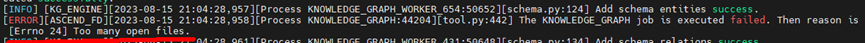
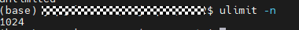
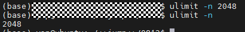

# FAQ

## Diagnosis Failure: `[Errno 24] Too many open files`

**Symptom**

In large clusters, the diagnosis feature may fail due to an excessive number of log files in the input directory, resulting in a "Too many open files" error in the log.

**Solution**

1. Run the `ulimit -n` command to view the maximum number of file descriptors allowed to be open simultaneously.

    

2. Run the `ulimit -n num` command to adjust the file descriptor limit, for example, `ulimit -n 2048`.

    
