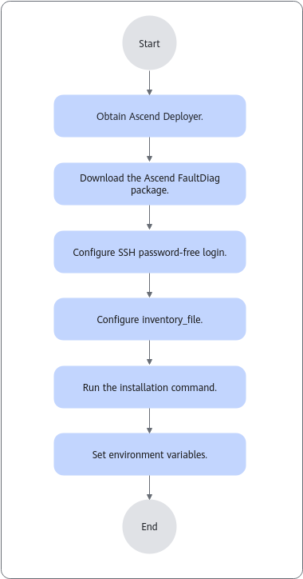

# Installation and Upgrade<a name="ZH-CN_TOPIC_0000001541469718"></a>

## Installing MindCluster Ascend FaultDiag<a name="ZH-CN_TOPIC_0000001968731908"></a>

### Before You Start<a name="ZH-CN_TOPIC_0000002054156561"></a>

- Ensure that MindCluster Ascend FaultDiag is independently deployed on each server. If it is deployed in a shared directory for multiple servers to access and use, it may lead to unpredictable situations such as function execution failures or performance that does not meet expectations.
- It is recommended to use the same user for installing and using MindCluster Ascend FaultDiag.
- The Python version supported by MindCluster Ascend FaultDiag must be ≥ 3.7. Before installing MindCluster Ascend FaultDiag, check whether the dependent Python version meets the requirement.

    >[!NOTE]
    >- All software and services mentioned in this document are the minimum supported versions, not recommended versions. You should select the Python, OS, services, software, and related third-party dependency libraries and their versions that comply with the security requirements of your organization.
    >- You are advised to promptly apply security patches or upgrade to the latest version.
    >- The installation process declares the relevant third-party library dependencies and verifies the minimum compatible versions. If subsequent use causes incompatibility due to third-party library upgrades, you can separately downgrade and install the specified version of the third-party package.

### Obtaining the Software Package<a name="ZH-CN_TOPIC_0000001592508717"></a>

**Downloading the Software Package<a name="zh-cn_topic_0000001511594161_section4499122813189"></a>**

**Table 1** Required software package

<a name="table24961081552"></a>
<table><thead align="left"><tr id="row449616819513"><th class="cellrowborder" valign="top" width="22.32%" id="mcps1.2.5.1.1"><p id="p1049658459"><a name="p1049658459"></a><a name="p1049658459"></a>Package</p>
</th>
<th class="cellrowborder" valign="top" width="47.8%" id="mcps1.2.5.1.2"><p id="p4496118351"><a name="p4496118351"></a><a name="p4496118351"></a>Sub-file List</p>
</th>
<th class="cellrowborder" valign="top" width="21.77%" id="mcps1.2.5.1.3"><p id="p1349608354"><a name="p1349608354"></a><a name="p1349608354"></a>Description</p>
</th>
<th class="cellrowborder" valign="top" width="8.110000000000001%" id="mcps1.2.5.1.4"><p id="p12496085515"><a name="p12496085515"></a><a name="p12496085515"></a>Address</p>
</th>
</tr>
</thead>
<tbody><tr id="row19497118450"><td class="cellrowborder" rowspan="2" valign="top" width="22.32%" headers="mcps1.2.5.1.1 "><p id="p19497688516"><a name="p19497688516"></a><a name="p19497688516"></a>Ascend-mindxdl-faultdiag_<em id="i194971681054"><a name="i194971681054"></a><a name="i194971681054"></a>{version}</em>_linux-<em id="i132516204280"><a name="i132516204280"></a><a name="i132516204280"></a>{arch}</em>.zip</p>
</td>
<td class="cellrowborder" valign="top" width="47.8%" headers="mcps1.2.5.1.2 "><p id="p2417175492214"><a name="p2417175492214"></a><a name="p2417175492214"></a>ascend_faultdiag-<em id="i24971581355"><a name="i24971581355"></a><a name="i24971581355"></a>{version}</em>-py3-none-linux_<em id="i11344642192415"><a name="i11344642192415"></a><a name="i11344642192415"></a>{</em><em id="i9272113613244"><a name="i9272113613244"></a><a name="i9272113613244"></a>arch</em><em id="i12344184215241"><a name="i12344184215241"></a><a name="i12344184215241"></a>}</em>.whl</p>
</td>
<td class="cellrowborder" valign="top" width="21.77%" headers="mcps1.2.5.1.3 "><p id="p9497981514"><a name="p9497981514"></a><a name="p9497981514"></a>Installation package of the intelligent fault diagnosis component.</p>
<p id="p203401758145516"><a name="p203401758145516"></a><a name="p203401758145516"></a>Applicable to <span id="ph42741425610"><a name="ph42741425610"></a><a name="ph42741425610"></a>python</span> 3.7 and later versions.</p>
</td>
<td class="cellrowborder" rowspan="2" valign="top" width="8.110000000000001%" headers="mcps1.2.5.1.4 "><p id="p11497481255"><a name="p11497481255"></a><a name="p11497481255"></a><a href="https://gitcode.com/Ascend/mind-cluster/releases" target="_blank" rel="noopener noreferrer">Download address</a></p>
</td>
</tr>
<tr id="row84971381059"><td class="cellrowborder" valign="top" headers="mcps1.2.5.1.1 "><p id="p204971087511"><a name="p204971087511"></a><a name="p204971087511"></a>ascend_faultdiag_toolkit-<em id="i114971580510"><a name="i114971580510"></a><a name="i114971580510"></a>{version}</em>-py3-none-any.whl</p>
</td>
<td class="cellrowborder" valign="top" headers="mcps1.2.5.1.2 "><p id="p13425727595"><a name="p13425727595"></a><a name="p13425727595"></a>Installation package of the Ascend-faultdiag-toolkit.</p><p>Applicable to python 3.8 and later versions.</p>
</td>
</tr>
</tbody>
</table>

> **NOTE**
>
> <i>{version}</i> is the version number of the software package. Download the target software package based on actual requirements.

### Installation via Command Line<a name="ZH-CN_TOPIC_0000001541629190"></a>

This section only guides on installing MindCluster Ascend FaultDiag via command line. MindCluster Ascend FaultDiag of version 5.0.0.2 and later versions can be installed using MindCluster Ascend Deployer. For detailed installation instructions, please refer to [Installation Using MindCluster Ascend Deployer](#installation-using-mindcluster-ascend-deployer).

**Prerequisites<a name="section1944341425710"></a>**

- Ensure that the network is available before installation.
- Installation logs are not dumped. Pay attention to the remaining drive space before installation.

**Procedure<a name="section552311587439"></a>**

1. Change `umask` to `027`. For detailed steps, see [Setting umask](./security_hardening.md#setting-umask).
2. Upload the software package obtained from [Obtaining the Software Package](#obtaining-the-software-package) to any directory, such as `~/software`, in the environment.
3. Run the following command in the directory where the software package is located to decompress it.

    ```shell
    unzip Ascend-mindxdl-faultdiag_{version}_linux-{arch}.zip
    ```

4. Run the following command to perform the installation.

    ```shell
    pip3 install ascend_faultdiag-{version}-py3-none-linux_{arch}.whl --log ~/.ascend_faultdiag/install.log
    ```

5. Change the directory permissions.

    ```shell
    chmod 700 ~/.ascend_faultdiag
    chmod 600 ~/.ascend_faultdiag/*.log
    ```

6. Run the following command to verify that the software is installed successfully.

    ```shell
    ascend-fd version
    ```

    The following is an example of the output:

    ```ColdFusion
    ascend-fd ${Version_number}
    ```

>[!NOTE]
>
>- The default path for the MindCluster Ascend FaultDiag runtime log files is the `$(HOME)/.ascend_faultdiag/RUN_LOG/` directory. Each time the `ascend-fd parse` or `diag` command is executed, a folder named with a timestamp and random number is generated, and runtime logs are written to drive within the folder according to PID. If the number of folders in the `RUN_LOG` directory exceeds 100, 20 folders will be deleted in chronological order. If the number of folders does not exceed 100 but the total memory size of the files exceeds 100 MB, old logs will also be deleted in chronological order, retaining a maximum of 80 MB of files.
>- The default path for the MindCluster Ascend FaultDiag operation log file is `${HOME}/.ascend_faultdiag/ascend_faultdiag_operation.log`.
>- The log file size does not exceed 10 MB. When the size limit is exceeded, the log file is automatically dumped to another log file. The number of log files with the same PID does not exceed 10. When the limit is exceeded, the earliest created log file is automatically overwritten.
>- If you need to customize the log file path, refer to the [Customizing the MindCluster Ascend FaultDiag Home Directory](./common_operations.md#customizing-the-mindcluster-ascend-faultdiag-home-directory) section.
>- The device resource analysis and network congestion analysis modules of MindCluster Ascend FaultDiag depend on third-party libraries, including scikit-learn, pandas, numpy, and joblib. If you need to use these functions, ensure that the corresponding libraries are installed according to the following version requirements: scikit-learn >= 1.3.0, pandas >= 1.3.5, numpy >= 1.21.6, 1.5.0 > joblib >=1.2.0.

### Installation Using MindCluster Ascend Deployer<a name="ZH-CN_TOPIC_0000001987237125"></a>

MindCluster Ascend Deployer supports the installation of MindCluster Ascend FaultDiag of 5.0.0.2 and later versions. For MindCluster Ascend FaultDiag earlier than 5.0.0.2, refer to [Installation via Command Line](#installation-via-command-line).

**Single-node Installation of MindCluster Ascend FaultDiag<a name="section16724191613286"></a>**

To install MindCluster Ascend FaultDiag on a single node, see [Installing Ascend Software](https://gitcode.com/Ascend/ascend-deployer/blob/dev/docs/en/installation_guide.md) in the *MindCluster Ascend Deployer User Guide*.

The installation command is as follows:

```bash
bash install.sh --install=fault-diag                                            //Install MindCluster Ascend FaultDiag
```

**Batch Installation of MindCluster Ascend FaultDiag<a name="section207590522915"></a>**

For batch installation of MindCluster Ascend FaultDiag, see the [Installing Ascend Software](https://gitcode.com/Ascend/ascend-deployer/blob/dev/docs/en/installation_guide.md) in the *MindCluster Ascend Deployer User Guide*.

The detailed installation process is shown in [Figure 1](#fig56301358747):

**Figure 1**  Batch installation of MindCluster Ascend FaultDiag via MindCluster Ascend Deployer<a name="fig56301358747"></a>


## Upgrading the Component<a name="ZH-CN_TOPIC_0000001592268721"></a>

**Upgrade Steps<a name="section232278155416"></a>**

1. Prepare the new software package according to [Obtaining the Software Package](#obtaining-the-software-package).
2. Before upgrading, uninstall the current version of MindCluster Ascend FaultDiag. For uninstallation steps, refer to [Uninstalling the Component](#uninstalling-the-component).
3. Refer to [Installation via Command Line](#installation-via-command-line) to complete the software package installation.
4. Run the following command to verify whether the software has been upgraded and installed successfully.

    ```shell
    ascend-fd version
    ```

    The following is an example of the output:

    ```ColdFusion
    ascend-fd ${Version_number}
    ```

## Uninstalling the Component<a name="ZH-CN_TOPIC_0000001592628957"></a>

To uninstall the tool after installation via command line, run the following command as the user who installs the component.

```shell
pip3 uninstall ascend-faultdiag -y --log ~/.ascend_faultdiag/uninstall.log
```

To uninstall the tool after installation with MindCluster Ascend Deployer, run the command to delete the binary files as the user who installs the component.

```shell
rm /usr/local/bin/ascend-fd
```

>[!NOTE]
>The `~/.ascend_faultdiag` directory stores logs and other information, and will not be automatically deleted during uninstallation. Please delete it manually.
