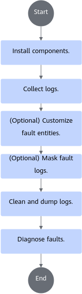

# Usage Process

This section uses the full-process application scenario as an example to describe the overall fault diagnosis process. For details, see [Figure 1](#fig119736111011) and [Table 1](#table785432425410).

**Figure 1** Overall process

**Table 1** Operations

|Key Operation|Chapter/Section|Description|
|--|--|--|
|Collect logs, including logs of training and inference jobs, CANN, host, and NPU resources based on the log collection directory.|[Log Collection Directory Structure](./03_collecting_logs.md#log-collection-directory-structure)|Collect cluster platform logs based on the actual situation. The directory structure and collection sample provided in related chapters are for reference only.|
|Collect logs, and prepare the NPU environment check file before training and inference.|[Log Collection Before Training and Inference](./03_collecting_logs.md#collecting-logs-before-training-and-inference)|Collect cluster platform logs based on the actual situation. The directory structure and collection sample provided in related chapters are for reference only.|
|Collect logs, including information about NPU network ports, NPU status monitoring metrics, host resources, and MindIE Pod logs during training and inference.|[Log Collection During Training and Inference](./03_collecting_logs.md#collecting-logs-during-training-and-inference)|Collect cluster platform logs based on the actual situation. The directory structure and collection sample provided in related chapters are for reference only.|
|Collect logs, including the NPU environment check file after training and inference, user training and inference logs, CANN App logs, host OS logs, and device logs.|[Log Collection After Training and Inference](./03_collecting_logs.md#collecting-logs-after-training-and-inference)|Collect cluster platform logs based on the actual situation. The directory structure and collection sample provided in related chapters are for reference only.|
|(Optional) Customize fault entities.|[(Optional) Customizing Fault Entities](./04_customizing_fault_entities.md)|For details about the API, see [Fault Entity Customization](../api/fault_entity_customization.md).|
|(Optional) Mask error logs of CANN App logs.|[(Optional) Masking Fault Logs](./05_masking_fault_logs.md)|For details about the API, see [Fault Log Masking](../api/fault_log_masking.md). For details about the types of CANN App logs, see [CANN Log Reference](https://www.hiascend.com/document/detail/en/canncommercial/850/maintenref/logreference/logreference_0001.html).|
|Clean the collection directory and dump the cleaned logs of each node.|[Cleaning and Dumping Logs](./06_cleaning_and_dumping_logs.md)|<ul><li>Log cleaning on a single node is used as an example in the provided chapter. In actual clusters, log cleaning is performed based on the number of nodes. </li><li>For details about the API, see [Log Cleaning](../api/log_cleaning.md).</li></ul>|
|Diagnose the log directory after cleaning and dumping.|[Diagnosing Faults](./07_diagnosing_faults.md)|For details about the API, see [Fault Diagnosis](../api/fault_diagnosis.md).|
