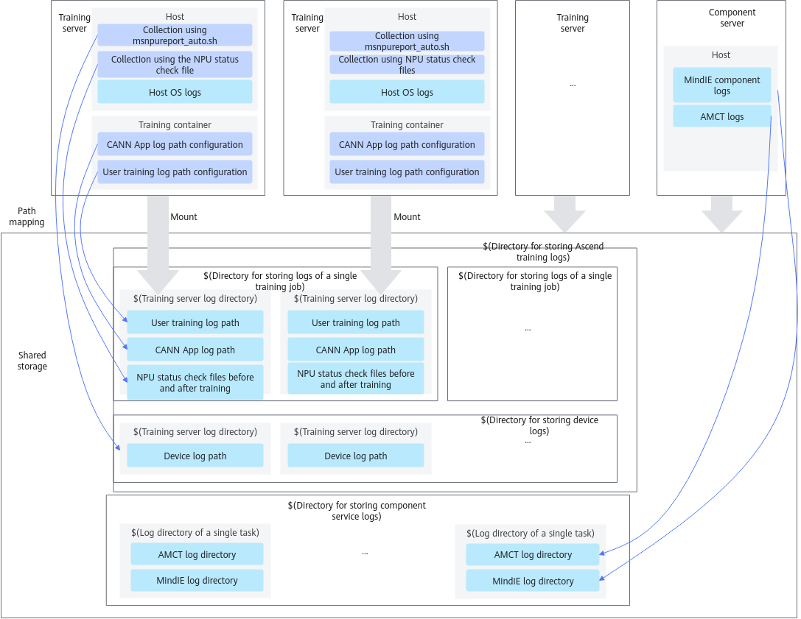

# Example<a name="ZH-CN_TOPIC_0000001905930376"></a>

This section is for reference only. Use the component based on the actual training platform, training scenario, and cluster storage.

## Scenario Description<a name="section20829165411715"></a>

- In this example, the **shared storage** is mounted to a training cluster. Ensure that the shared storage is mounted to all nodes in the cluster in advance.
- In this example, **a training job exits abnormally**. The following logs are involved:
    - User training logs
    - CANN App logs
    - NPU status check file before training
    - NPU status check file after training
    - device-side logs
    - Host OS logs
    - MindCluster component logs
    - MindIE component logs
    - MindIE Pod console logs
    - AMCT logs
    - MindIO logs
    - BMC logs
    - LCNE logs
    - Bus logs

## Log Path Mapping<a name="section1246617719225"></a>

The figure below shows the mapping between log paths in the host and container and log paths of shared storage.



## Usage Process<a name="section125992312510"></a>

1. [Log Collection](#section135847272336): Create a log path in the shared storage and set related configurations.
2. [Log Cleaning](#section6586172714334): Clean log information after logs are collected.
3. [Fault Diagnosis](#section15416716355): Run the fault diagnosis command to obtain information about the root cause node and fault event.

## Log Collection<a name="section135847272336"></a>

The following log directory is for reference only. You can customize the storage directory as required. In the example, the server is named `worker-0`. You need to create directories for all training servers.

>[!NOTE]
>When creating a log directory, ensure that the directory has the default read and write permissions. When the training container is started, you are not advised to mount the root user directory as the log storage directory.

1. Create a directory for storing Ascend training logs, for example, `/ascend_cluster_log`, in any path of the shared storage.

    ```shell
    mkdir -p /ascend_cluster_log
    ```

2. Create a directory for storing device-side logs, for example, `/ascend_cluster_log/device_log/worker-0`, in the directory where Ascend training logs are stored.

    ```shell
    mkdir -p /ascend_cluster_log/device_log/worker-0
    ```

3. Create a directory for storing logs of a single training job in the Ascend training log storage directory after the training job is started. You are advised to use the training job ID as the directory name, for example, `/ascend_cluster_log/job202405181309/worker-0`.

    ```shell
    mkdir -p /ascend_cluster_log/job202405181309/worker-0
    ```

4. Run the following commands in sequence to create a training log collection directory.

    ```shell
    mkdir -p /ascend_cluster_log/job202405181309/worker-0/process_log    # CANN App logs
    mkdir -p /ascend_cluster_log/job202405181309/worker-0/train_log      # User training logs
    mkdir -p /ascend_cluster_log/job202405181309/worker-0/environment_check    # NPU environment check file before or after training
    ```

5. Configure the log collection directory.
    1. Run the following command to use the `msnpureport_auto_export.sh` script to periodically export device-side logs. If you want to export device-side logs at a time, see [Device-Side Logs](./03_collecting_logs.md#device-side-logs).

        ```shell
        *Driver_installation_directory*/driver/tools/msnpureport_auto_export.sh *Collection_interval* *Maximum_storage_directory_capacity*/*Device_log_storage_directory_name*
        ```

        For example:

        ```shell
        /usr/local/Ascend/driver/tools/msnpureport_auto_export.sh 300 10 /ascend_cluster_log/device_log/worker-0
        ```

        The following table describes parameters involved in the preceding command example.

        **Table 1** Parameter description

        |Parameter|Description|
        |--|--|
        |*Collection_interval*|Interval for exporting device-side logs and files in seconds. The value is an integer greater than 0, for example, 2s.|
        |*Maximum_storage_directory_capacity*|Size of the directory for storing exported device-side logs and files, in GB. The value is an integer greater than or equal to 2, for example, 10 GB.|
        |*Device_log_storage_directory_name*|Path (any absolute path) for storing the exported device-side logs and files, for example, `/home/log/`.|

        >[!NOTE]
        >- If the collection interval is set to a small value, frequent log export may cause high system resource overhead. The recommended value is 300s (5 minutes). You can adjust the value based on actual situation.
        >- After the training server is powered on, you only need to execute the `msnpureport_auto_export.sh` script once. After the training server is restarted, you also need to re-execute the script.

    2. When starting a training job, configure the CANN App log collection directory.
        - When starting the training container, mount the CANN App log directory of the shared storage to any path (for example, `/ascend_cluster_log/job202405181309/worker-0/process_log`) in the container and configure environment variables.

            ```shell
            docker run \
                -v /*Path of CANN App logs in the shared storage*:/*Path of CANN App logs in the container* \
                --env ASCEND_PROCESS_LOG_PATH=/CANN App log path in the container \
                \... Other items...\
                ${Training image name} /bin/bash
            ```

            For example:

            ```shell
            docker run \
                -v /ascend_cluster_log/job202405181309/worker-0/process_log:/ascend_cluster_log/job202405181309/worker-0/process_log \
                --env ASCEND_PROCESS_LOG_PATH=/ascend_cluster_log/job202405181309/worker-0/process_log \
                \... Other items...\
                ${Training image name} /bin/bash
            ```

        - To perform training on the host, run the following command:

            ```shell
            export ASCEND_PROCESS_LOG_PATH=/CANN App log path
            ```

            For example:

            ```shell
            export ASCEND_PROCESS_LOG_PATH=/ascend_cluster_log/job202405181309/worker-0/process_log
            ```

    3. When starting a training job, configure the user training log collection directory.
        1. When starting the training container, mount the user training log collection directory of the shared storage to any path (for example, `/ascend_cluster_log/job202405181309/worker-0/train_log`) in the container. Skip this step if training is performed on the host.

            ```shell
            docker run \
                -v /*User training log collection directory of the shared storage*:/*User training log collection directory in the container* \
                \... Other items...\
                ${Training image name} /bin/bash
            ```

            For example:

            ```shell
            docker run \
                -v /ascend_cluster_log/job202405181309/worker-0/train_log:/ascend_cluster_log/job202405181309/worker-0/train_log \
                \... Other items...\
                ${Training image name} /bin/bash
            ```

        2. Flush the script execution output to the drive in redirection mode.

            ```shell
            python train.py > /ascend_cluster_log/job202405181309/worker-0/train_log/rank-0.txt 2>&1
            ```

            >[!NOTE]
            >- Save the training log file of each NPU as a `.txt` or `.log` file. For versions earlier than 6.0.RC3, name the user training dump log file in the format of `rank-(*rank_id*).txt`
            >- If the PyTorch framework is used, the training logs of all NPUs can be redirected to the same file, for example, **rank-all.txt**.

    4. Before starting a training job, query NPU information by referring to [NPU Environment Check File Before Training and Inference](./03_collecting_logs.md#npu-environment-check-file-before-training-and-inference). After the training is complete, query NPU information by referring to [NPU Environment Check File After Training and Inference](./03_collecting_logs.md#npu-environment-check-file-after-training-and-inference).

        >[!NOTE]
        >For more details, see [Collecting Logs](./03_collecting_logs.md).

## Log Cleaning<a name="section6586172714334"></a>

In the following example, the server is named `worker-0`. You need to create a directory for all training services and then run the cleaning command.

1. Create output directories for storing the cleaning result and diagnosis result before cleaning logs.

    ```shell
    mkdir -p /ascend_cluster_log/job202405181309/faultdiag_work_tmp/parse_out/worker-0 # Cleaning result output directory
    mkdir -p /ascend_cluster_log/job202405181309/faultdiag_work_tmp/diag_out   # Diagnosis result output directory
    ```

2. Run the `ascend-fd parse` command to clean logs of a single training server.

    ```shell
    ascend-fd parse --process_log *CANN App log directory* --train_log *User training log directory* --env_check *Environment check file directory* --host_log *Host OS log directory* --device_log *NPU log directory* --dl_log *MindCluster component log directory* --custom_log *Custom parser file directory* -o *Cleaning result output directory*
    ```

    For example:

    ```shell
    ascend-fd parse --process_log /ascend_cluster_log/job202405181309/worker-0/process_log --train_log /ascend_cluster_log/job202405181309/worker-0/train_log --env_check /ascend_cluster_log/job202405181309/worker-0/environment_check --host_log /var/log --device_log /ascend_cluster_log/device_log/worker-0/msnpureport_log_new --dl_log /ascend_cluster_log/job202405181309/worker-0/dl_log --custom_log worker-0/
    -o /ascend_cluster_log/job202405181309/faultdiag_work_tmp/parse_out/worker-0
    ```

3. (Optional) If there are BMC logs, run the following command:

    ```shell
    ascend-fd parse --bmc_log *BMC log directory* -o *Cleaning result output directory*
    ```

    For example:

    ```shell
    ascend-fd parse --bmc_log  "bmc/worker-00" -o "auto_diag_combine/bmc/worker-00"
    ```

4. (Optional) If there are LCNE logs, run the following command:

    ```shell
    ascend-fd parse --lcne_log *LCNE log directory* -o *Cleaning result output directory*
    ```

    For example:

    ```shell
    ascend-fd parse --lcne_log  "lcne/worker-111" -o "auto_diag_combine/lcne/worker-111"
    ```

    For more details, see [Cleaning and Dumping Logs](./06_cleaning_and_dumping_logs.md).

## Fault Diagnosis<a name="section15416716355"></a>

Run the `ascend-fd diag` command to diagnose faults on all training servers in the cluster.

```shell
ascend-fd diag -i /*Cleaning_result_output_directory* -o /*Diagnosis_result_output_directory*
```

For example:

```shell
ascend-fd diag -i /ascend_cluster_log/job202405181309/faultdiag_work_tmp/parse_out -o /ascend_cluster_log/job202405181309/faultdiag_work_tmp/diag_out
```

For more details, see [Diagnosing Faults](./07_diagnosing_faults.md).
