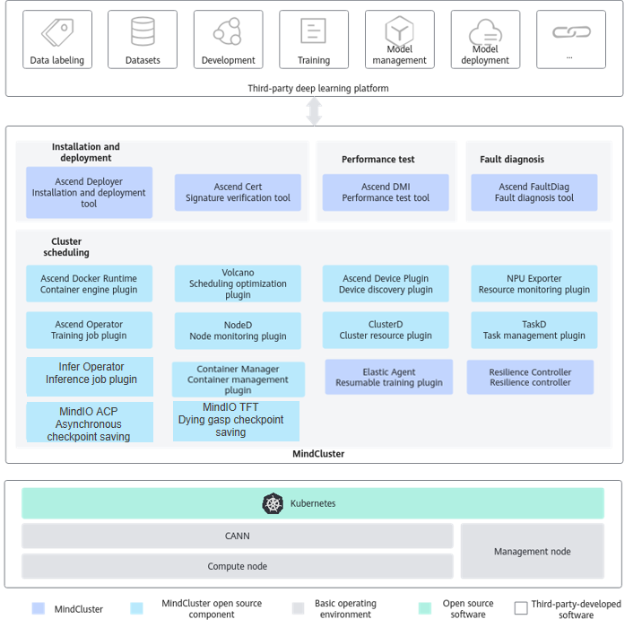

# What is MindCluster

<!-- md-trans-meta sourceCommit=unknown translatedAt=2026-06-04T12:22:22.102Z pushedAt=2026-06-04T12:26:58.406Z -->

MindCluster is a deep learning for an AI cluster built to support NPUs (Ascend AI Processors), providing cluster-level solutions specifically for training and inference tasks. By leveraging MindCluster, deep learning platform developers can minimize development efforts related to underlying resource scheduling and rapidly build their platforms.

**Figure 1** MindCluster Stack Diagram

>[!NOTE]
>
> The Resilience Controller and Elastic Agent components have been discontinued and removed. Content related to Resilience Controller will be removed in the version released on September 30, 2026; content related to Elastic Agent will be removed in the version released on December 30, 2026.

**MindCluster Feature Overview**

|Key Feature|Introduction|Reference|
|--|--|--|
|Installation and deployment|Provides online download, installation, and signature verification for Ascend software and its dependencies.|[Installation and Deployment](https://gitcode.com/Ascend/ascend-deployer/blob/dev/docs/en/introduction.md)|
|Performance testing|Provides functions such as Atlas hardware compatibility check, performance testing, and fault diagnosis.|[Performance Testing](https://www.hiascend.com/document/detail/en/mindcluster/2600/toolbox/toolboxug/toolboxug_0002.html)|
|Fault Diagnosis|Provides log cleaning and fault diagnosis functions for training and inference tasks, and locates the root cause of failures.|[Fault Diagnosis](./faultdiag/introduction.md)|
|Cluster Scheduling|Provides functions such as NPU resource scheduling and management, configuration generation for distributed training collective communication, and resumable training.|[Cluster Scheduling](./scheduling/introduction/00_overview.md)|

**MindCluster Component Description**

**Table 1**  Installation and deployment

|Component|Feature Overview|
|--|--|
|MindCluster Ascend Deployer|Supports automatic download and one-click installation of Ascend software and its dependencies, and provides functions such as parameter plane network configuration.|

**Table 2**  ToolBox

|Component|Feature Overview|
|--|--|
|Ascend DMI|Provides functions such as compatibility check, bandwidth test, computing power test, power consumption test, and diagnostic stress test for Atlas hardware products.|
|Ascend Cert|Provides functions such as software package digital signature verification and CRL update to ensure the security of software packages and the validity of CRL files.|

**Table 3**  Fault diagnosis

|Component|Feature Overview|
|--|--|
|MindCluster Ascend FaultDiag|Provides log cleaning and fault diagnosis functions, extracts key information from logs related to training and inference processes, and analyzes the root cause node and fault event based on the cleaned key information from all cluster nodes.|

**Table 4**  Cluster scheduling

|Component|Feature Overview|
|--|--|
|Ascend Docker Runtime|Provides containerization support for training and inference tasks, automatically mounting required files and device dependencies.|
|Ascend Device Plugin|Based on the Kubernetes device plugin mechanism, provides device discovery, allocation, and health status reporting capabilities for Ascend AI Processors, enabling Kubernetes to manage Ascend AI Processor resources.|
|NPU Exporter|Monitors resource metrics of Ascend AI Processors in real time, obtaining information such as utilization, temperature, and voltage of Ascend AI Processors.|
|Volcano|Based on the open-source Volcano scheduling plugin mechanism, adds features such as affinity scheduling and fault rescheduling for Ascend AI Processors to maximize their computing performance.|
|ClusterD|Provides cluster-level available resource information and collects cluster task information, resource information, fault information, and impact scope, performing statistical analysis from task, chip, and fault dimensions.|
|Ascend Operator|Provides lifecycle management for training tasks, supplying corresponding environment variables for distributed training tasks of different AI frameworks and generating necessary collective communication configuration.|
|NodeD|Reports node status and fault information such as node health status, CPU, and memory.|
|Resilience Controller|Provides elastic scaling-down training service. When the hardware used by a training task fails, it removes the hardware and continues training.|
|Elastic Agent|Provides the capability to save a dying gasp checkpoint at the moment of a training task failure.|
|TaskD|Provides status monitoring and status control capabilities for training and inference tasks on Ascend devices.|
|MindIO ACP|Uses the training server memory as a cache to accelerate the saving and loading of checkpoints during large model training.|
|MindIO TFT|Provides functions such as TTP, UCE, and ARF.|
|Container Manager|Provides service container recovery capability in non-Kubernetes scenarios, mainly used an appliance.|
|Infer Operator|Manages the lifecycle of inference services based on their configuration, supporting instance-level scaling and task role expansion.|
