# Component Introduction

<!-- md-trans-meta sourceCommit=a277c409db3c3340f95d7c4831c0d54fa24e71a7 translatedAt=2026-08-27T02:20:02.639Z pushedAt=2026-08-27T02:26:43.516Z -->

## Ascend Docker Runtime

**Application Scenario**

To use Ascend AI Processors in containers, scripts and commands related to the Ascend driver must be mounted. These scripts and commands are distributed across different files and may change as chips iterate. To avoid lengthy file mounting during container creation, MindCluster provide Ascend Docker Runtime. By entering the number of the Ascend AI Processor to be mounted, you can complete the file mounting of the Ascend AI Processor and related drivers.

**Table 1** Example of files required in an Ascend container

| File Path                           | Function                      |
| ------------------------------ | ----------------------- |
| /dev/davinci*                  | NPU device                   |
| /dev/vdavinci*                 | vNPU device                  |
| /dev/davinci_manager           | Device resource scheduling                  |
| /dev/devmm_svm, /dev/hisi_hdc   | Memory and communication control                 |
| /usr/local/Ascend/driver/lib64 | Driver interaction interface                  |
| /usr/local/Ascend/driver/tools | Network and upgrade tools                 |
| /usr/local/sbin/npu-smi        | Driver interaction commands                  |
| ...                            | As chips iterate, there are other device-specific or file-specific items |

**Component Function**

- Provides minimal Docker or Containerd containerization support for Ascend.
- Some hardware forms support inputting vNPU information to complete automatic creation and destruction of vNPUs.

**Component Upstream and Downstream Dependencies**

**Figure 1** Component upstream and downstream dependencies

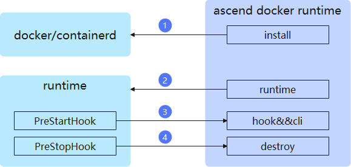

1. install module: During deployment, modifies the Docker/Containerd configuration file to change the container runtime to the Ascend container runtime.
2. runtime module: Modifies the container configuration file to enable the hook and destroy hook functions, and completes pre-mount preparations such as vNPU partitioning and chip device file parsing.
3. hook&&cli: Invoked before container creation, responsible for organizing chip device files, driver files, and user-defined files, and mounting them into the container.
4. destroy: Invoked before container destruction, responsible for destroying the created vNPU.

## NPU Exporter

**Application Scenario**

During task execution, it is necessary to closely monitor the network and computing power usage of the chips to provide data support for task tuning. MindCluster provides NPU Exporter to report the status of various chip metrics.

**Component Function**

- Obtains various data information about chips and networks from the driver, and supports reporting through both Prometheus and Telegraf.
- Plugin-based management, supporting the development of new metrics through plugins and the configuration of different collection periods for different types of metrics.

**Component Upstream and Downstream Dependencies**

**Figure 2** Component upstream and downstream dependencies

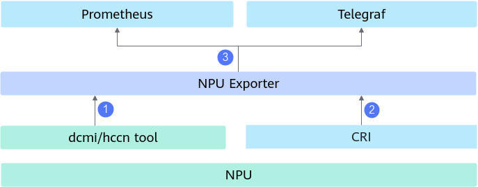

1. Obtain chip and network information from the driver and store it in the local cache.
2. Obtain container information from the Kubernetes (K8s) standardized interface CRI and store it in the local cache.
3. Implement the Prometheus or Telegraf interface for them to periodically retrieve the cached data information.

## Ascend Device Plugin

**Application Scenario**

Considering the complexity, K8s only has built-in device discovery capabilities for CPU and memory, while other resource types are maintained through the device plugin mechanism. MindCluster provides Ascend Device Plugin, which reports Ascend chip resources based on the K8s device plugin mechanism.

**Component Function**

- Reports the resource name of Ascend chips by implementing the `Register` interface of the device plugin.
- Implements the `ListAndWatch` API of the device plugin to report the quantity, IDs, and health status of Ascend chips.
- Implements the `Allocate` API of the device plugin and works with Ascend Docker Runtime to mount Ascend chips into containers.
- Supports proactive O&M. After detecting a chip fault, it changes the chip from the service state to the O&M state and resets the chip to repair it.

**Component Upstream and Downstream Dependencies**

**Figure 3** Component upstream and downstream dependencies

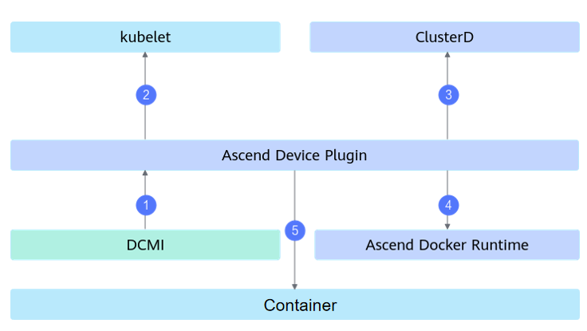

1. Obtain the chip type, quantity, and health status information from DCMI, or deliver chip reset commands.
2. Report the chip type, quantity, and status to kubelet.
3. Report the chip type, quantity, and specific fault information to ClusterD.
4. Notify Ascend Docker Runtime of the chip information selected by the scheduler in the form of environment variables.
5. Map the task configuration into the container to facilitate in-container service usage.

## Volcano

**Application Scenario**

During task execution, most of the time is spent on computation and communication. With the same number of chips, the computing power provided is identical, but due to inconsistencies in the communication network, the final task efficiency differs completely. MindCluster provides Volcano to deliver optimal scheduling solutions for different network topologies.

**Component Function**

- Perceives the available chip information in the cluster and selects the optimal resource scheduling based on both network and resource fragmentation considerations.
- After scheduling, if a chip fault occurs during task running, reselect a healthy chip to recover the task.

**Component Upstream and Downstream Dependencies**

**Figure 4** Component upstream and downstream dependencies

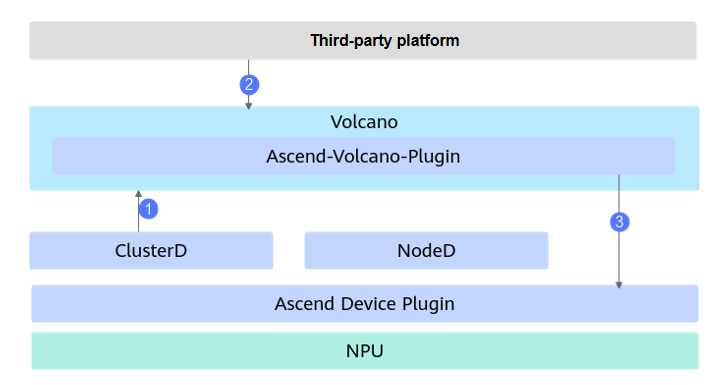

1. Obtain the total number of chips from the Node object in K8s, obtain the used chip information from the Pod object, and obtain the faulty chip information from ClusterD. The three are combined to obtain the available chip information of the cluster.
2. Receives the task configuration and selects the optimal resource scheduling based on cluster resource information.
3. Passes the specific resource selection information to Ascend Device Plugin or Ascend Docker Runtime to complete device mounting.

## ClusterD

**Application Scenario**

Multiple faults in a cluster are often correlated, and fault monitoring from a cluster perspective is required to more accurately identify the root cause of faults. MindCluster provides the ClusterD service to aggregate cluster resource information, delivering more accurate fault awareness and faster fault recovery capabilities.

**Component Function**

- Aggregates Ascend task and Ascend resource information across the cluster, and provides query interfaces for O&M systems.
- Based on the tasks and fault information in the cluster, determines whether to perform high-level recovery operations for training and inference tasks, and coordinates the recovery process as the cluster brain.

**Component Upstream and Downstream Dependencies**

**Figure 5** Component upstream and downstream dependencies

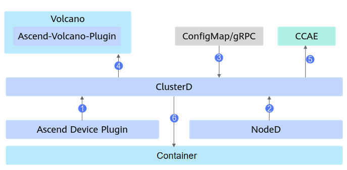

1. Obtains chip information from Ascend Device Plugin on each compute node.
2. Obtain the health status of the CPU, memory, and hard drive of each compute node from NodeD on that node, as well as information about shared storage faults and UnifiedBus slow network faults on the node.
3. Obtain public fault information from ConfigMap or gRPC.
4. Aggregate the resource information of the entire cluster and report it to Volcano.
5. Report information such as the task status and resource usage of the cluster to O&M systems such as CCAE.
6. Interact with in-container training and inference services to coordinate the advanced recovery process.

## Ascend Operator

**Application Scenario**

Distributed tasks require chips on multiple nodes to communicate with each other to complete, so certain parameters are needed to let chips know how to communicate with other chips. These parameters have inconsistent names in PyTorch and MindSpore, and cannot be maintained manually in large-scale task scenarios. MindCluster provides Ascend Operator to automatically fill in the required collective communication parameters based on the AI framework type.

| Parameter Description          | PyTorch          | MindSpore       |
| ------------- | ---------------- | --------------- |
| Master container IP address  | `MASTER_ADDR`      | `MS_SCHED_HOST`   |
| Master container port number   | `MASTER_PORT`      | `MS_SCHED_PORT`   |
| Total number of NPUs in the task       | `WORLD_SIZE`       | `MS_WORKER_NUM`   |
| Number of NPUs in this container      | `LOCAL_WORLD_SIZE` | `MS_LOCAL_WORKER` |
| Node rank of this container | `RANK`             | `MS_NODE_RANK`    |

**Component Function**

- Based on the K8s CRD mechanism, maintains the Ascend task resource type acjob and creates Pods according to the acjob configuration.
- Based on the task configuration, injects parameters into the container through environment variables or files.

**Component Upstream and Downstream Dependencies**

**Figure 6** Component upstream and downstream dependencies

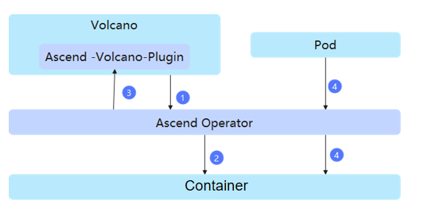

1. Use Volcano to sense whether the resources required by the current task are satisfied.
2. After the resources are satisfied, create the corresponding Pod for the task and inject the environment variables of the collective communication parameters.
3. After the Pod is created, Volcano performs the final selection of resources.
4. Mount the collective communication parameters by means of files (optional). Obtain the chip ID, IP, and RankId information used by each Pod from the Pod, aggregate them to generate a collective communication file, and mount it in-container.

## NodeD

**Application Scenario**

For a task to run stably on a node, in addition to ensuring the health of the NPU, the health of the node's CPU, memory, and hard disk must also be guaranteed. MindCluster provides NodeD for node anomaly detection and reporting.

**Component Function**

- Obtains node anomalies from IPMI and reports them to the upper-layer service.
- Obtains shared storage exceptions from DPC and DTFS, and reports them to the upper-layer service.

**Component Upstream and Downstream Dependencies**

**Figure 7**  Component upstream and downstream dependencies

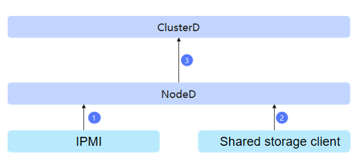

1. Obtains the CPU, memory, and drive fault information of the compute node from IPMI.
2. Obtain shared storage abnormal information from the shared storage client.
3. Report the abnormal information to ClusterD.

## Resilience Controller

>[!NOTE]
>This component has been deprecated, and its related content will be removed in the version released on September 30, 2026. For the latest elastic training capabilities, see [Elastic Training](../04_usage/04_resumable_training/01_solutions_principles.md#elastic-training).

**Application Scenario**

When a training task encounters a fault and there are insufficient healthy resources to replace the faulty resources, dynamic scale-in can be used to keep the training task running. After resources become sufficient, dynamic scale-out is used to restore the training task. Cluster scheduling provides the Resilience Controller component for dynamic scale-in and scale-out during training tasks.

**Component Function**

Provides elastic scale-in training services. When the hardware used by a training task fails, it removes the hardware and continues training.

**Component Upstream and Downstream Dependencies**

Resilience Controller is a Kubernetes plugin and must be installed in the K8s cluster. It supports only VolcanoJob (vcjob)-type tasks and requires Volcano to be installed in the cluster. During operation, it interacts only with K8s, and the related interactions are shown in the following figure.

**Figure 8** Component upstream and downstream dependencies

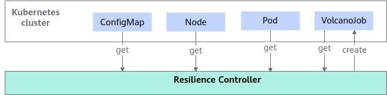

- The MindCluster cluster scheduling components write information such as NPU devices, node status, and scheduling configuration into ConfigMaps through K8s.
- Resilience Controller reads the `NodeInfo` field in the ConfigMap whose name prefix is "mindx-dl-nodeinfo-" under the `mindx-dl` namespace to obtain the node heartbeat status.
- Resilience Controller reads the ConfigMap whose name prefix is "mindx-dl-deviceinfo-" under the `kube-system` namespace, reads the `DeviceInfoCfg` field in it, and obtains the NPU device health status.
- Resilience Controller reads the ConfigMap named `volcano-scheduler-configmap` under the `volcano-system` namespace, reads the `grace-over-time` field in it, and obtains the graceful deletion timeout configuration for rescheduled pods.
- Resilience Controller obtains the pods corresponding to all VolcanoJobs in the cluster, and reads `huawei.com/AscendReal` to obtain the list of NPUs actually used by the pods.
- Resilience Controller reads VolcanoJob and obtains fields such as `fault-scheduling`, `elastic-scheduling`, `minReplicas`, and `phase` to determine whether VolcanoJob can perform elastic training.
- When a device or node fault occurs, Resilience Controller creates a VolcanoJob with the NPU requirement halved based on the replica count of the original VolcanoJob and the cluster resource status.

## Elastic Agent

>[!NOTE]
>This component has been deprecated, and its related content will be removed in the version released on December 30, 2026. The process-level recovery capabilities will be carried by TaskD.

**Application Scenario**

Because various software and hardware faults are prone to occur during large model training tasks, which affect the training tasks, MindCluster provides a binary package of Elastic Agent deployed on compute nodes to provide management functions for training tasks on Ascend devices.

**Component Function**

- Provides process management for the PyTorch framework adapted to Ascend devices, stopping or restarting training processes when software or hardware faults occur.
- Connects to the cluster control center in the K8s cluster and performs training management based on the cluster control center.

**Component Upstream and Downstream Dependencies**

**Figure 9** Component upstream and downstream dependencies

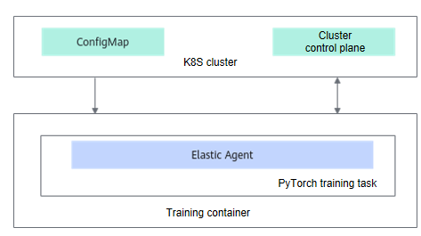

- The MindCluster cluster scheduling components write information such as device and training task status into a ConfigMap through K8s and maps it in the container. The ConfigMap name is [reset-config_job_name](../06_api/01_volcano.md#job-information).
- Elastic Agent obtains information such as the device status used by the current training container and the training task status through the ConfigMap.
- Elastic Agent connects to the K8s cluster control center and completes training management based on the cluster control center.

## TaskD

**Application Scenario**

Large model training and inference tasks may encounter faults, performance degradation, and other issues during service execution, which affect the tasks. TaskD provides status monitoring and status control capabilities for training and inference tasks on Ascend devices.

**Component Function**

- **Functions of each component in service flow 1**
  - The PyTorch and MindSpore frameworks provide process management adapted to Ascend devices, stopping and restarting training processes when software or hardware faults occur.

  - Responsible for interfacing with the K8s cluster control center, performing training management based on the cluster control center and managing the status of training tasks.

- **Functions of each component in service flow 2**
  - Provides lightweight profiling of training data, and completes profiling data collection under the control of the cluster control center.
  - Provides link failover and switchback, and online stress testing capabilities.

**Component Upstream and Downstream Dependencies**

- **Dependencies in service flow 1**

  - The MindCluster cluster scheduling components write information such as devices and training status into a ConfigMap through K8s and map it into the container. The ConfigMap is named [reset-config-<job_name\>](../06_api/01_volcano.md#job-information).
  - The MindCluster cluster scheduling components write the training status detection command into a ConfigMap through K8s and map it into the container.
  - TaskD Manager obtains information such as the device status used by the current training container and the training task status through the ConfigMap.
  - TaskD Manager connects to the K8s cluster control center and completes training management based on the cluster control center.

  **Figure 10** Component upstream and downstream dependencies in service flow 1

  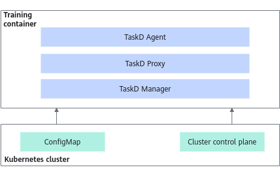

- **Dependencies in service flow 2**

  - TaskD Worker obtains the training detection function enable instruction of the current task through ConfigMap.
  - TaskD Manager obtains the training detection function enabling instruction for the current task through gRPC.

  **Figure 11** Component upstream and downstream dependencies in service flow 2

  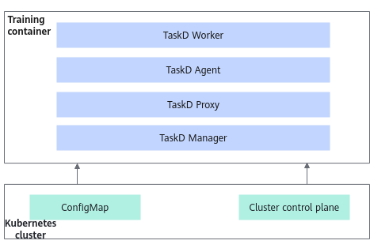

## MindIO ACP

**Application Scenario**

A checkpoint is a key point for resuming training after a model interruption. The density of checkpoints and the performance of saving and restoring them are critical, as they can improve the effective throughput of the training system. MindIO ACP provides a checkpoint acceleration solution that supports Ascend products in expanding market space in the LLM model domain.

**Component Function**

In large model training, the memory of a training server is used as a cache to accelerate the saving and loading of checkpoints.

**Component Upstream and Downstream Dependencies**

**Figure 12** MindIO ACP dependencies

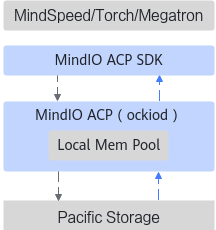

## MindIO TFT

**Application Scenario**

In LLM training, saving checkpoint data each time, loading data to re-iterate training, and saving and loading periodic Checkpoints all require a relatively long time. After a fault occurs, the MindIO TFT feature immediately generates a checkpoint, and recovery can also immediately restore to the state just before the fault, reducing iteration loss. MindIO UCE and MindIO ARF complete online repair or online repair at the level of restarting only the faulty node for different fault types, saving the time of stopping and restarting the cluster.

**Component Function**

MindIO TFT includes functions such as dying gasp checkpoint saving, process-level online recovery, and graceful fault tolerance, which correspond to:

- MindIO TTP mainly verifies the integrity and consistency of intermediate state data after a fault occurs during large model training, generates a dying gasp checkpoint, and restores training from this checkpoint to reduce the training iteration loss caused by the fault.
- MindIO UCE mainly detects UCE faults in on-chip memory during large model training and performs online repair to achieve step-level recomputation.
- MindIO ARF mainly restarts or replaces nodes as a unit instead of restarting the entire cluster after a training exception occurs, completing the repair and continuing training.

**Component Upstream and Downstream Dependencies**

**Figure 13** MindIO TFT dependencies

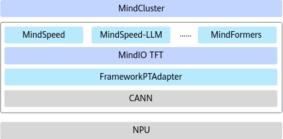

## Container Manager

**Application Scenario**

In scenarios without K8s, when an inference or training process becomes abnormal, Volcano and Ascend Device Plugin cannot be used to stop and reschedule service containers, isolate faulty nodes, or reset NPU chips. MindCluster provides Container Manager for container management and chip reset in scenarios without K8s.

**Component Function**

- Subscribes to chip fault information from the driver, and stores the chip status and specific fault information in the cache for subsequent container management and chip reset.
- If the faulty chip is currently in use by a container, the container occupying the faulty chip is stopped according to the user's startup configuration, and the container is restarted after the faulty chip is successfully reset.
- If the faulty chip is idle and can be recovered after a restart, a hot reset is performed on the chip.

**Component Upstream and Downstream Dependencies**

**Figure 14** Component upstream and downstream dependencies

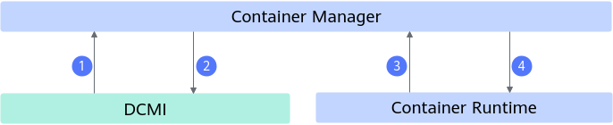

1. Obtain the chip type, quantity, and health status information from DCMI.
2. Deliver chip reset commands to DCMI.
3. Obtain the currently running containers and chip mount information from the container runtime Docker or Containerd.
4. Deliver container stop and start commands to the container runtime.

## Infer Operator

**Application Scenario**

MindCluster provides Infer Operator to batch start inference instances based on the instance configuration of the inference service.

**Component Function**

- A single request creates a task group that contains multiple inference services, each of which contains multiple instance workloads with different roles.
- Supports scaling of inference instances.
- Supports load-based elastic scaling.

**Component Upstream and Downstream Dependencies**

**Figure 15**  Component upstream and downstream dependencies

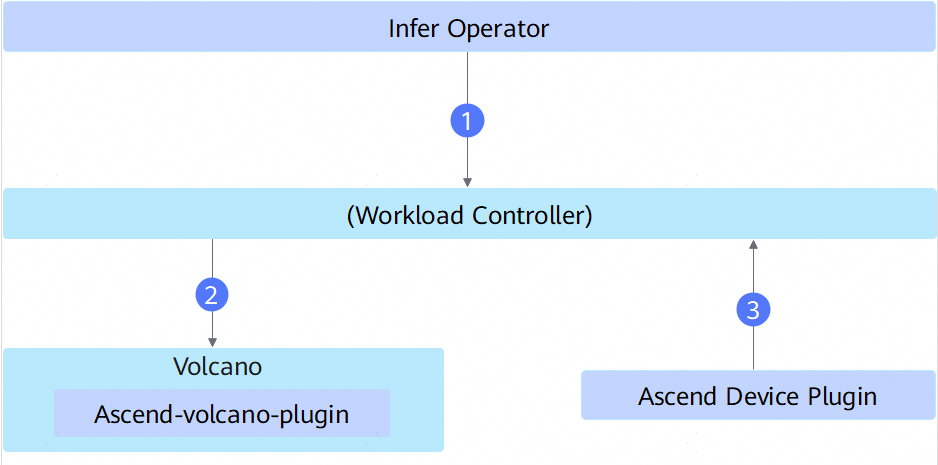

1. Create an inference instance Workload based on the task YAML configured by the user.
2. After Workload Controller creates the Pod, Volcano performs the final resource selection.
3. If the Workload requests NPUs, Ascend Device Plugin obtains the NPU information and completes device mounting.

## K8s RDMA Shared Dev Plugin

**Application Scenario**

Kubernetes needs to be aware of RDMA network device resource information to implement resource scheduling. To enable containers to use the RDMA network for high-speed data transmission, the RDMA device resources must be registered with Kubernetes through the device plugin mechanism. MindCluster provides K8s RDMA Shared Dev Plugin deployed on compute nodes to manage and share RDMA device resources.

> [!NOTE]
>
> When a service container uses a 1825 DPU device, in addition to component mounting, the following is also required:
>
> - Configure `hostNetwork: true`
> - Configure the user-mode driver. Choose either of the following two methods:
>   1. Install the OFED driver for the 1825 DPU in the image.
>   2. Mount the OFED driver for the 1825 DPU from the host after the container starts.

**Component Function**

- Discovers RDMA devices from the system, including both PCI and UB types of RDMA devices.
- Supports selecting specific RDMA devices through configuration files, with configurable selectors such as `vendors`, `deviceIDs`, `drivers`, and `buses`, where the `buses` selector is used to specify the device bus type (such as the UB).
- Reports RDMA device resource information to kubelet for Kubernetes scheduling.
- Supports hot-plugging and dynamic updates of RDMA devices.
- Supports Container Device Interface (CDI) mode, but **UB-type RDMA devices do not support CDI mode**; CDI is automatically disabled when a UB device is detected.
- Log parameters such as the log level, number of log backups, and log retention days can be configured.
- The fault detection period can be configured. In each period, fault detection is performed on the filtered UB devices, and the results are written to the `dpuinfo-<nodename>` configMap.

**Component Upstream and Downstream Dependencies**

**Figure 16** Component upstream and downstream dependencies

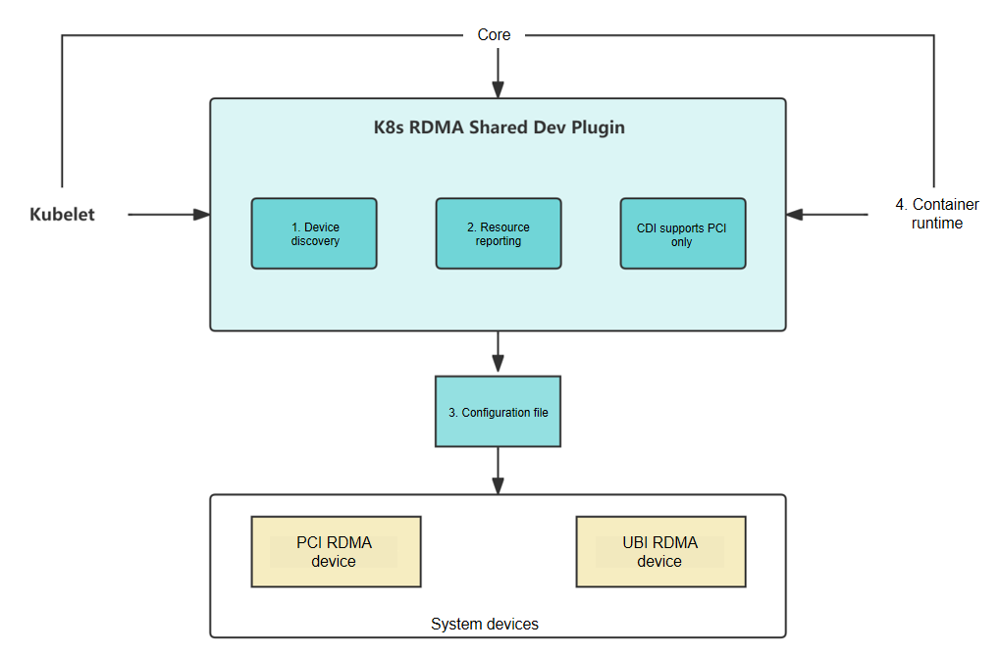

1. Obtain the type, quantity, and health status information of RDMA devices from the system, distinguishing between the PCI and UB device types.
2. Report the type, quantity, and status of RDMA devices to kubelet.
3. Based on the selector information in the configuration file, filter the RDMA devices to be registered, supporting the specification of UB devices through the buses selector.
4. When a container is created, mount the selected RDMA devices into the container.
