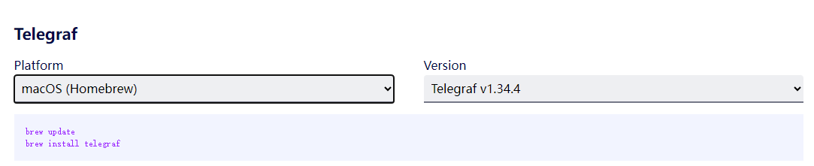

# Working with Telegraf<a name="ZH-CN_TOPIC_0000002479227042"></a>

This section guides users through installing and deploying Telegraf, and viewing resource monitoring-related Data Information via Telegraf. For details on the data information, see [Telegraf Data Information Description](../../06_api/00_npu_exporter/02_telegraf_data_description.md).

## Binary Integration with Telegraf<a name="section31082142614"></a>

>[!NOTE]
>In addition to binary integration, integrating Telegraf source code is supported by modifying the NPU Exporter open-source code.

1. Obtain the NPU Exporter package from the [Ascend Community](https://www.hiascend.com/en/developer/software/mindcluster/download?versionId=460&ids=53%2C154%2C%2C58%2C60%2C63%2C), extract the NPU Exporter binary file `npu-exporter` from it, and upload it to any path in the environment (such as `/home/npu_plugin`).
2. Run the following command to create the `npu_plugin.conf` file.

    ```shell
    vi npu_plugin.conf
    ```

    Add the NPU Exporter binary file path to the file. An example is shown below.

    ```toml
    [[inputs.execd]]
      command = ["/home/npu_plugin/npu-exporter", "-platform=Telegraf", "-poll_interval=10s", "-hccsBWProfilingTime=200"]
      signal = "none"
    [[outputs.file]]
      files=["stdout"]
    ```

    For details about the input parameters of the `command` field, see [Table 1](#table5347115241118).

    **Table 1**  Parameters

    <a name="table5347115241118"></a>

   |Parameter|Type|Default Value| Description                                                                                                                                                                                                                                                                               |Required|
   |--|--|--|------------------------------------------------------------------------------------------------------------------------------------------------------------------------------------------------------------------------------------------------------------------------------------|--|
   | `-platform` | string | Prometheus | Specifies the platform to connect to. Valid values: <ul><li>`Prometheus`: Connects to Prometheus</li><li>`Telegraf`: Connects to Telegraf</li></ul> | Yes |
   | `-poll_interval` | duration(int) | 1s | Interval for Telegraf data reporting. This parameter only takes effect when connecting to the Telegraf platform (i.e., when `-platform=Telegraf` is specified). Otherwise, this parameter does not take effect. | No |
   | `-hccsBWProfilingTime` | int | 200 | HCCS link bandwidth sampling duration, in milliseconds. Range: `[1, 1000]`. | No |
   | `-updateTime` | int | None | **Will be sunset soon; not recommended for use.** Global configuration for metric update cycle. Range: 1–60 seconds. It is recommended to configure metric update cycles by group. For details, see the [Configuration File](../../05_developer_guide/00_installation_deployment/00_manual_installation/03_npu_exporter.md#section103551921135917). <div class="note"><span class="notetitle">[!NOTE]</span><div class="notebody">If the `updateTime` parameter is configured, it remains valid and takes precedence over the `intervalSeconds` settings in the `metricConfiguration.json`/`pluginConfiguration.json` configuration files.</div></div> | No |
   | `-logLevel` | int | 0 | Log level: <ul><li>`-1`: Debug</li><li>`0`: Info</li><li>`1`: Warning</li><li>`2`: Error</li><li>`3`: Critical</li></ul> | No |
   | `-maxAge` | int | 7 | Log backup retention period, in days. Range: `[7, 700]`. | No |
   | `-logFile` | string | `/var/log/mindx-dl/npu-exporter/npu-exporter.log` | Log file path. When a single log file exceeds 20 MB, automatic log rotation is triggered. The maximum file size limit is not configurable. | No |
   | `-maxBackups` | int | 30 | Maximum number of retained rotated log files. Range: `[1, 180]`. | No |
   | `-profilingTime` | int | 200 | PCIe bandwidth collection duration, in milliseconds. Range: `[1, 2000]`. | No |
   | `-deviceResetTimeout` | int | 600 | Maximum wait time for the driver to report all chips when the component starts and the chip count is insufficient, in seconds. Range: `[10, 600]`. <ul><li><term>Atlas A2 training products</term>, Atlas 800I A2 inference server, A200I A2 Box heterogeneous subrack: Recommended value: 150 seconds.</li><li><term>Atlas A3 training products</term>, A200T A3 Box8 SuperPoD server, Atlas 800I A3 SuperPoD server: Recommended value: 360 seconds.</li><li>Atlas 350 accelerator card, Atlas 850E SuperPoD, Atlas 650E server, Atlas 950 SuperPoD: Recommended value: 600 seconds.</li></ul> | No |
   | `-textMetricsFilePath` | string | None | Specifies the path to a custom metrics file. For constraints, see [Constraints](../../06_api/00_npu_exporter/03_custom_metrics_file.md#constraints). | No |

3. (Optional) If Telegraf is not installed, perform the following steps to install Telegraf.
    - **Offline Installation (Recommended)**
        1. Go to the [Telegraf download page](https://github.com/influxdata/telegraf/releases).
        2. Select the version you need and complete the download, for example, `telegraf-1.34.3_linux_arm64.tar.gz`.
        3. Upload the installation package to any path on the server.
        4. Run the following command in the directory where the package is located to decompress it. An example is shown below.

            ```shell
            tar -zxvf telegraf-1.34.3_linux_arm64.tar.gz
            ```

        5. Go to the decompressed directory, find the Telegraf binary file in the `./usr/bin` path, and copy the file to any path such as `/home/npu_plugin`.

    - **Online Installation**
        1. Go to the [Telegraf download page](https://www.influxdata.com/downloads/).
        2. Select the operating system and Telegraf version from the drop-down menus.

            **Figure 1**  Downloading Telegraf<a name="fig131640329479"></a>

            

        3. Copy the installation command from the pop-up dialog to the device where you want to install Telegraf, and run the command to complete the installation.

4. Run the following command to start Telegraf.
    - Offline installation:

        ```shell
        ./telegraf --config npu_plugin.conf
        ```

    - Online installation:

        ```shell
        telegraf --config npu_plugin.conf
        ```

        After Telegraf starts successfully, the output is similar to the following example. The information starting from `npu_chip_link_speed` is the monitored data information of the Ascend AI processor.

        ```ColdFusion
        2023-09-15T10:11:31Z I! Loading config file: ../npu_plugin.conf
        2023-09-15T10:11:31Z I! Starting Telegraf 1.34.4
        2023-09-15T10:11:31Z I! Available plugins: 236 inputs, 9 aggregators, 27 processors, 22 parsers, 57 outputs, 2 secret-stores2023-09-15T10:11:31Z I! Loaded inputs: execd
        2023-09-15T10:11:31Z I! Loaded aggregators:
        2023-09-15T10:11:31Z I! Loaded processors:
        2023-09-15T10:11:31Z I! Loaded secretstores:
        2023-09-15T10:11:31Z I! Loaded outputs: file
        2023-09-15T10:11:31Z I! Tags enabled: host=xxx
        2023-09-15T10:11:31Z I! [agent] Config: Interval:10s, Quiet:false, Hostname:"xxx", Flush Interval:10s
        2023-09-15T10:11:31Z I! [inputs.execd] Starting process: /xxx/npu-exporter [-platform=Telegraf -poll_interval=10s]
        Ascend910-0,host=xxx npu_chip_link_speed=104857600000i,npu_chip_roce_rx_cnp_pkt_num=0i,npu_chip_roce_unexpected_ack_num=0i,npu_chip_optical_vcc=3245.1,npu_chip_optical_rx_power_1=0.8585,npu_chip_info_hbm_used_memory=0i,npu_chip_mac_rx_pause_num=0i,npu_chip_roce_tx_all_pkt_num=0i,npu_chip_roce_tx_cnp_pkt_num=0i,npu_chip_info_temperature=46,npu_chip_mac_rx_bad_pkt_num=0i,npu_chip_roce_tx_err_pkt_num=0i,npu_chip_optical_rx_power_3=0.8466,npu_chip_optical_rx_power_0=0.7933,npu_chip_info_network_status=0i,npu_chip_mac_rx_pfc_pkt_num=0i,npu_chip_mac_tx_bad_pkt_num=0i,npu_chip_roce_rx_all_pkt_num=0i,npu_chip_mac_rx_bad_oct_num=0i,npu_chip_optical_tx_power_1=0.9162,npu_chip_info_utilization=0,npu_chip_info_power=73.9000015258789,npu_chip_info_link_status=1i,npu_chip_info_bandwidth_rx=0,npu_chip_mac_tx_pfc_pkt_num=0i,npu_chip_roce_rx_err_pkt_num=0i,npu_chip_roce_verification_err_num=0i,npu_chip_optical_state=1i,npu_chip_info_bandwidth_tx=0,npu_chip_mac_tx_bad_oct_num=0i,npu_chip_roce_out_of_order_num=0i,npu_chip_roce_qp_status_err_num=0i,npu_chip_optical_rx_power_2=0.855,npu_chip_optical_tx_power_0=0.9095,npu_chip_info_hbm_utilization=0,npu_chip_link_up_num=2i,npu_chip_info_health_status=1i,npu_chip_mac_tx_pause_num=0i,npu_chip_roce_new_pkt_rty_num=0i,npu_chip_optical_temp=53,npu_chip_optical_tx_power_2=1.0342,npu_chip_optical_tx_power_3=0.9715 1694772754612200641
        ```
