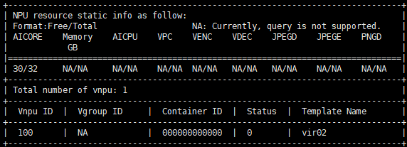

# Creating vNPUs<a name="ZH-CN_TOPIC_0000002479226382"></a>

- The commands for creating vNPUs using the npu-smi tool are basically the same for physical machines and virtual machines, so the commands listed in this section can be applied to both. However, vNPU creation on virtual machines is supported only by <term>Atlas inference products</term>.
- To use static virtualization, run the `npu-smi` command to create vNPUs and mount them to containers and then refer to [Mounting vNPUs (Static Virtualization)](./02_mounting_vnpu_static.md) section to mount them to the container.
- To use dynamic virtualization, skip this section, as there is no need to create vNPUs in advance. Set parameters as follows during container startup.
    - Ascend Docker Runtime: Refer to [Dynamic vNPU Scheduling (Inference)](../05_dynamic_vnpu_scheduling/01_dynamic_vnpu_scheduling_inference.md) to virtualize multiple vNPUs from the physical NPU and mount them to the container through the `ASCEND_VISIBLE_DEVICES` and `ASCEND_VNPU_SPECS` parameters.
    - Ascend Device Plugin and Volcano: Refer to [Dynamic vNPU Scheduling (Inference)](../05_dynamic_vnpu_scheduling/01_dynamic_vnpu_scheduling_inference.md). vNPUs are automatically created by APIs based on configuration requirements during job running.

## Methods<a name="section206799361399"></a>

- On the physical machine, run the following command to set the virtualization mode (this command is not required if you are partitioning vNPUs inside a virtual machine). The command format is as follows.

    **npu-smi set -t vnpu-mode -d** _mode_

    **Table 1** Parameter description

    <a name="table11489191211336"></a>

    |Type|Description|
    |--|--|
    |mode|<p>Virtual instance mode. Valid values: `0` or `1`:</p><ul><li>`0`: Container: the created vNPU is mounted to a container for use.</li><li>`1`: Virtual machine (reserved, currently unavailable): the created vNPU is allocated to a virtual machine for use.</li></ul>|

- Query the virtual instance mode on the physical machine:

    **npu-smi info -t vnpu-mode**

    Output example:

    ```ColdFusion
    vnpu-mode              : docker
    ```

    **Table 2** Output description

    |Field|Description|
    |--|--|
    |`vnpu-mode`|Ascend virtual instance (AVI) mode.<br>Valid options: `docker` and `VM`.|

- Create a vNPU.

    **npu-smi set -t create-vnpu -i** _id_ **-c** _chip\_id_ **-f** _vnpu\_config_  \[**-v** _vnpu\_id_\] \[**-g** _vgroup\_id_\]

    **Table 3** Parameters

    <a name="table1654283920393"></a>

    |Parameter| Description |
    |--|--|
    |`id`| Device ID. The NPU ID obtained from the **`npu-smi info -m`** command is the device ID.                                                                                                                                                                                                                                                                                                                                                                                                                                                                                                                             |
    |`chip_id`| Chip ID. The Chip ID obtained from the **`npu-smi info -m`** command is the chip ID..                                                                                                                                                                                                                                                                                                                                                                                                                                                                                                                            |
    |`vnpu_config`| Virtual instance template name. For details, see the "Virtual Instance Template" column in Table 1 of [Virtualization Templates](../03_virtualization_templates.md).                                                                                                                                                                                                                                                                                                                                                                                                                                                                                                    |
    |`vnpu_id`| <p>Specifies the ID of the vNPU to be created.</p><ul><li>If not specified on the first creation, the system automatically assigns one. If the service needs to use the same `vnpu_id` after restart, you can use the `-v` parameter to specify the previous `vnpu_id` for recovery.</li><li>Value range:<ul><li><term>Atlas inference products</term><p>`[phy_id * 16 + 100, phy_id * 16 + 107]`.</p></li><li><term>Atlas training products</term><p>`[phy_id * 16 + 100, phy_id * 16 + 115]`.</p></li></ul><div class="note"><span class="notetitle">[!NOTE]</span><div class="notebody">`phy_id` indicates the physical chip ID, which can be obtained by running the **`ls /dev/davinci*`** command. For example, `/dev/davinci0` indicates that the physical chip ID is 0.</div></div></li><li>Setting `vnpu_id` to `4294967295` means no virtual device ID is specified.</li><li>Duplicate `vnpu_id` values cannot be created on the same server.</li></ul> |
    |`vgroup_id`| ID of the virtual resource group (vGroup), ranging from 0 to 3. <p>A vGroup is a virtual resource group created by the NPU based on the specified virtualization template. Each vGroup contains a certain number of AICores, AICPUs, on-chip memory, and DVPP resources.</p><p>This parameter is only supported on <term>Atlas inference products</term>.</p> |

    Usage examples:

    - Create a vNPU on chip 0 of device 0 using template vir02:

        ```shell
        npu-smi set -t create-vnpu -i 0 -c 0 -f vir02
                Status : OK         Message : Create vnpu success
        ```

    - Create a vNPU on chip 0 of device 0 with vnpu_id set to 100 and template vir02:

        ```shell
        npu-smi set -t create-vnpu -i 0 -c 0 -f vir02 -v 100
                Status : OK         Message : Create vnpu success
        ```

    - Create a vNPU on chip 0 of device 0 with vnpu_id set to 100 and vgroup_id set to 1 using template vir02:

        ```shell
        npu-smi set -t create-vnpu -i 0 -c 0 -f vir02 -v 100 -g 1
                Status : OK         Message : Create vnpu success
        ```

- (Optional) Configure vNPU recovery state. This parameter ensures that vNPU configuration persists after device restart. When enabled, the vNPU configuration remains valid after reboot.

    **npu-smi set -t vnpu-cfg-recover -d** _mode_

    `mode` indicates the vNPU configuration recovery state: `1` for enabled, `0` for disabled. The default is enabled.

    To set the vNPU configuration recovery state to enabled:

    **npu-smi set -t vnpu-cfg-recover -d** _1_

    ```ColdFusion
           Status : OK
           Message : The VNPU config recover mode Enable is set successfully.
    ```

- (Optional) Query the vNPU configuration recovery state:

    Command:

    **npu-smi info -t vnpu-cfg-recover**

    ```ColdFusion
    VNPU config recover mode : Enable
    ```

- (Optional) Query vNPU information:

    **npu-smi info -t info-vnpu -i** _id_ **-c** _chip\_id_

    **Table 4** Parameters

    <a name="table1585213289319"></a>

    |Parameter| Description                                              |
    |--|--------------------------------------------------|
    |`id`| Device ID. The NPU ID obtained from the **npu-smi info -m** command is the device ID.  |
    |`chip_id`| Chip ID. The Chip ID obtained from the **npu-smi info -m** command is the chip ID. |

    To query vNPU information on chip 0 of device 0:

    **npu-smi info -t info-vnpu -i** _0_ **-c** _0_

    

    >[!NOTE]
    >The AICPU and Vgroup ID information can be returned for Atlas inference products, while cannot be returned for Atlas training products.
