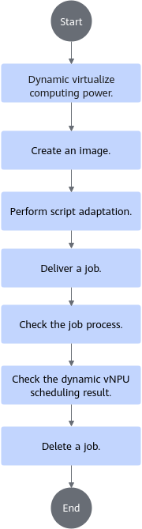
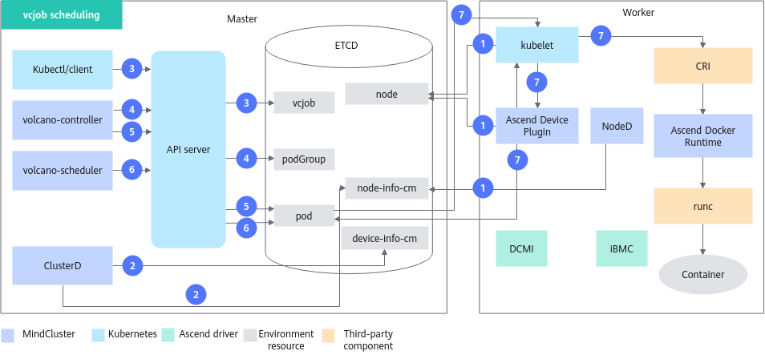
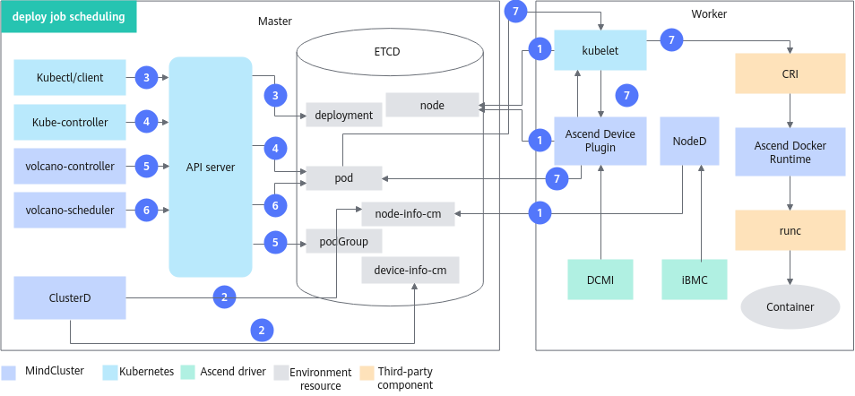

# Dynamic vNPU Scheduling<a name="ZH-CN_TOPIC_0000002511427045"></a>

<!-- md-trans-meta sourceCommit=a277c409db3c3340f95d7c4831c0d54fa24e71a7 translatedAt=2026-08-28T09:23:22.765Z pushedAt=2026-08-28T09:25:39.052Z -->

## Method 1: Mounting vNPU Using Ascend Docker Runtime

Use Ascend Docker Runtime (a container engine plugin) alone to mount vNPUs to a container.

**Prerequisites**

Install Ascend Docker Runtime by referring to [Installing Ascend Docker Runtime](../../../../05_developer_guide/00_installation_deployment/00_manual_installation/02_ascend_docker_runtime.md).

**Method for Using vNPUs with Ascend Docker Runtime**

When starting a container, the following command to virtualize resources. The following command indicates that 4 AICores are split from the physical chip with ID 0 as a vNPU and mounted to the container. For a container started in this way, the virtual device is automatically destroyed when the container process ends.

```shell
docker run -it --rm -e ASCEND_VISIBLE_DEVICES=0 -e ASCEND_VNPU_SPECS=vir04 {image-name:tag} /bin/bash
```

>[!NOTE]
>
>- When using dynamic virtualization, disable vNPU recovery.
>- The available chip IDs can be queried and confirmed as follows:
>   - Physical chip ID:
>
>      ```shell
>      ls /dev/davinci*
>      ```
>
>- `image-name:tag`: image name and tag. Modify them according to the actual situation.
>- During use, do not repeatedly define or fix the `ASCEND_VISIBLE_DEVICES`, `ASCEND_RUNTIME_OPTIONS`, and `ASCEND_VNPU_SPECS` environment variables in the container image.
>- When dynamic virtualization is used, if the server restarts, the vNPU may not be automatically destroyed in this scenario, and you need to destroy it manually.

**Table 1**  Parameter description

|Parameter|Description|Example|
|--|--|--|
|`ASCEND_VISIBLE_DEVICES`|Used to specify the NPU device to be mounted to the container. Otherwise, mounting the NPU device fails. During dynamic virtualization, `ASCEND_VISIBLE_DEVICES=0` indicates that a certain number of AICores are split from NPU device 0.|<ul><li>A dynamic virtualization command can specify only the ID of one physical NPU for dynamic virtualization.</li><li>It must be used together with `ASCEND_VNPU_SPECS`, which indicates the number of AICores split from the specified NPU.</li><li>It can be used together with `ASCEND_RUNTIME_OPTIONS`, but the value can only be `NODRV`, which indicates that driver-related directories are not mounted.</li></ul>|
|`ASCEND_RUNTIME_OPTIONS`|<p>Restricts the chip ID specified in `ASCEND_VISIBLE_DEVICES`:</p><ul><li>`NODRV`: indicates that driver-related directories are not mounted.</li></ul>|`ASCEND_RUNTIME_OPTIONS=NODRV`<div class="note"><span class="notetitle">[!NOTE]</span><div class="notebody"><ul><li>In the dynamic virtualization scenario, if `ASCEND_RUNTIME_OPTIONS` is used, its value cannot contain `VIRTUAL`.</li></ul></div></div>|
|`ASCEND_VNPU_SPECS`|Splits a certain number of AICores from the physical NPU device and specifies them as virtual devices. For supported values, see the "Virtual Instance Template" column in Table 1 of [Virtualization Templates](../03_virtualization_templates.md).<ul><li>This parameter can be used only for product forms that support dynamic virtualization.</li><li>It must be used together with `ASCEND_VISIBLE_DEVICES`, which specifies the physical NPU device used for virtualization.</li></ul>|`ASCEND_VNPU_SPECS=vir04` indicates that 4 AICores are split as a vNPU and mounted to the container.|

## Method 2: Mounting vNPU Using Kubernetes

### Before You Start<a name="ZH-CN_TOPIC_0000002511347087"></a>

#### Prerequisites<a name="section121807404519"></a>

To use the dynamic vNPU scheduling feature in command-line scenarios, ensure that the following components are installed. If they are not installed, refer to [Installation and Deployment](../../../../03_installation_guide/02_installation/00_helm_installation.md) for operations. The dynamic vNPU scheduling feature supports only Volcano as the scheduler and does not support other schedulers.

- Ascend Docker Runtime
- Ascend Device Plugin
- Volcano
- (Optional) Ascend Operator
- (Optional) ClusterD

The key operations are as follows:

1. Obtain `Ascend-docker-runtime_{version}_linux-{arch}.run`" first, and install Ascend Docker Runtime.
2. Refer to the [Installation and Deployment](../../../../03_installation_guide/02_installation/00_helm_installation.md) section to complete the installation of each component.

   The cluster scheduling components whose parameters need to be modified for the virtual instance feature are Volcano and Ascend Device Plugin. Modify them as required below and use the corresponding YAML for installation and deployment:

   1. Ascend Device Plugin parameter modification and startup instructions.

      The startup parameters of the virtual instance feature are described as follows:

      **Table 2** Ascend Device Plugin startup parameters

      <a name="table1064314568229"></a>

      |Name|Type|Default Value|Description|
      |--|--|--|--|
      |`-volcanoType`|bool|false|Whether to use Volcano for scheduling. If dynamic virtualization is used, set this parameter to `true`.|
      |`-presetVirtualDevice`|bool|true|Static virtualization feature switch.<p>If dynamic virtualization is used, set this parameter to `false` and enable Volcano simultaneously, that is, set `-volcanoType` to `true`.</p>|

      The YAML startup instructions are as follows:

      In `device-plugin-volcano-v{version}.yaml`, modify the `presetVirtualDevice` field to `false` (used together with Volcano to support NPU virtualization; dynamic virtualization is disabled by default in the YAML).

       ```yaml
       ...
       args: [ "device-plugin -volcanoType=true -presetVirtualDevice=false
                  -logFile=/var/log/mindx-dl/devicePlugin/devicePlugin.log -logLevel=0" ]
       ...
       ```

   2. Volcano parameter modification and startup instructions.

      In the Volcano deployment file `volcano-v{version}.yaml`, configure the value of `presetVirtualDevice` to `false`.

       ```yaml
       ...
       data:
         volcano-scheduler.conf: |
           actions: "enqueue, allocate, backfill"
           tiers:
           - plugins:
             - name: priority
             - name: gang
             - name: conformance
             - name: volcano-npu-v{version}_linux-aarch64
           - plugins:
             - name: drf
             - name: predicates
             - name: proportion
             - name: nodeorder
             - name: binpack
           configurations:
            ...
             - name: init-params
               arguments: {"grace-over-time":"900","presetVirtualDevice":"false"}  # Enable dynamic virtualization. The value of presetVirtualDevice must be set to false.
       ...
       ```

#### Usage Method<a name="zh-cn_topic_0000001559979444_section91871616135119"></a>

- Use via the command line: Install the cluster scheduling components and use the dynamic vNPU scheduling feature through the command line.
- Use after integration: Integrate the cluster scheduling components into an existing third-party AI platform or an AI platform developed based on them.

#### Usage Instructions<a name="section10769161412815"></a>

**Table 3**  Scenario description

<a name="table625511844619"></a>
<table><thead align="left"><tr id="row9255148204610"><th class="cellrowborder" valign="top" width="19.98%" id="mcps1.2.3.1.1"><p id="p4381442125317"><a name="p4381442125317"></a><a name="p4381442125317"></a>Scenario</p>
</th>
<th class="cellrowborder" valign="top" width="80.02%" id="mcps1.2.3.1.2"><p id="p2255984464"><a name="p2255984464"></a><a name="p2255984464"></a>Description</p>
</th>
</tr>
</thead>
<tbody><tr id="row132012115910"><td class="cellrowborder" rowspan="8" valign="top" width="19.98%" headers="mcps1.2.3.1.1 "><p id="p1950512911598"><a name="p1950512911598"></a><a name="p1950512911598"></a>General description</p>
</td>
<td class="cellrowborder" valign="top" width="80.02%" headers="mcps1.2.3.1.2 "><p id="p450516910592"><a name="p450516910592"></a><a name="p450516910592"></a>The allocated chip information is reflected in the Pod annotation. For details about the Pod annotation, see the huawei.com/npu-core and huawei.com/AscendReal parameters in <a href="../../../../06_api/12_k8s.md">Pod annotation</a>.</p>
</td>
</tr>
<tr id="row48061646595"><td class="cellrowborder" valign="top" headers="mcps1.2.3.1.1 "><p id="p1749665239"><a name="p1749665239"></a><a name="p1749665239"></a>At any given time, only tasks with the same <a href="../03_virtualization_templates.md">virtualization template</a> can be submitted.</p>
</td>
</tr>
<tr id="row18542176195917"><td class="cellrowborder" valign="top" headers="mcps1.2.3.1.1 "><p id="p450559185914"><a name="p450559185914"></a><a name="p450559185914"></a>When vNPUs are dynamically allocated, <span id="ph19255162231216"><a name="ph19255162231216"></a><a name="ph19255162231216"></a>MindCluster</span> scheduling prioritizes fully occupying the physical NPU with the least remaining computing power.</p>
</td>
</tr>
<tr id="row11648825917"><td class="cellrowborder" valign="top" headers="mcps1.2.3.1.1 "><p id="p19505796596"><a name="p19505796596"></a><a name="p19505796596"></a>Currently, each Pod of a task that requests vNPUs ultimately mounts only one vNPU. A single Pod cannot request scheduling of multiple vNPUs.</p>
</td>
</tr>
<tr id="row192561854613"><td class="cellrowborder" valign="top" headers="mcps1.2.3.1.1 "><p id="p02561481463"><a name="p02561481463"></a><a name="p02561481463"></a>The number of AICores requested by the task. For a vNPU, enter the actual value. For an entire physical NPU, the value must be the number of AICores on a single NPU or a multiple thereof, and scheduling may not satisfy affinity when using an entire NPU.</p>
</td>
</tr>
<tr id="row11782173617479"><td class="cellrowborder" valign="top" headers="mcps1.2.3.1.1 "><p id="p18782936144718"><a name="p18782936144718"></a><a name="p18782936144718"></a>By default, the container must be started as the root user. To run inference jobs as a non-root user, refer to the section <a href="https://gitcode.com/Ascend/mind-cluster/issues/359">Failure to Run Inference Service Containers as a Non-Root User When Using Dynamic Virtualization</a>.</p>
</td>
</tr>
<tr id="row117233216566"><td class="cellrowborder" valign="top" headers="mcps1.2.3.1.1 "><p id="p18081933105617"><a name="p18081933105617"></a><a name="p18081933105617"></a>Dynamic creation and destruction of vNPUs are supported on <span id="ph20808153335610"><a name="ph20808153335610"></a><a name="ph20808153335610"></a><term>Atlas inference products</term>, <term>Atlas A2 inference products</term>, <term>Atlas A2 training products</term>, <term>Atlas A3 inference products</term>, and <term>Atlas A3 training products</term></span>, and must be used together with <span id="ph13808233145619"><a name="ph13808233145619"></a><a name="ph13808233145619"></a>Volcano</span>.</p>
</td>
</tr>
<tr id="row_dyn_switch"><td class="cellrowborder" valign="top" headers="mcps1.2.3.1.1 "><p id="p_dyn_switch">When a node switches between dynamic virtualization and non-dynamic virtualization, existing tasks must be deleted.</p>
</td>
</tr>
<tr id="row32567817461"><td class="cellrowborder" rowspan="2" valign="top" width="19.98%" headers="mcps1.2.3.1.1 "><p id="p1325613818460"><a name="p1325613818460"></a><a name="p1325613818460"></a>Supported scenarios</p>
</td>
<td class="cellrowborder" valign="top" width="80.02%" headers="mcps1.2.3.1.2 "><p id="p32561983469"><a name="p32561983469"></a><a name="p32561983469"></a>Multiple replicas are supported, but every Pod in the multiple replicas must use vNPU.</p>
</td>
</tr>
<tr id="row825611817468"><td class="cellrowborder" valign="top" headers="mcps1.2.3.1.1 "><p id="p2795151384913"><a name="p2795151384913"></a><a name="p2795151384913"></a>Rescheduling upon chip faults and node faults is supported. For details, see <span id="ph1389215534914"><a name="ph1389215534914"></a><a name="ph1389215534914"></a><a href="../../../03_basic_scheduling/06_recovery_of_inference_card_faults.md">Recovery of Inference Card Faults</a></span> and <a href="../../../03_basic_scheduling/05_rescheduling_upon_inference_card_faults.md">Rescheduling upon Inference Card Faults</a>.</p>
</td>
</tr>
<tr id="row237762345420"><td class="cellrowborder" rowspan="4" valign="top" width="19.98%" headers="mcps1.2.3.1.1 "><p id="p840574125511"><a name="p840574125511"></a><a name="p840574125511"></a>Unsupported scenarios</p>
<p id="p17835104672517"><a name="p17835104672517"></a><a name="p17835104672517"></a></p>
<p id="p36763525314"><a name="p36763525314"></a><a name="p36763525314"></a></p>
<p id="p767616565314"><a name="p767616565314"></a><a name="p767616565314"></a></p>
<p id="p667616595317"><a name="p667616595317"></a><a name="p667616595317"></a></p>
</td>
<td class="cellrowborder" valign="top" width="80.02%" headers="mcps1.2.3.1.2 "><p id="p14377152385414"><a name="p14377152385414"></a><a name="p14377152385414"></a>Mixing different chips within a single task is not supported.</p>
</td>
</tr>
<tr id="row1625614818462"><td class="cellrowborder" valign="top" headers="mcps1.2.3.1.1 "><p id="p32566874611"><a name="p32566874611"></a><a name="p32566874611"></a>Uninstalling <span id="ph42462611516"><a name="ph42462611516"></a><a name="ph42462611516"></a>Volcano</span> during task execution is not supported.</p>
</td>
</tr>
<tr id="row1854910515540"><td class="cellrowborder" valign="top" headers="mcps1.2.3.1.1 "><p id="p12256108124616"><a name="p12256108124616"></a><a name="p12256108124616"></a>In the K8s scenario, vNPUs are automatically created and destroyed, and operations cannot be mixed with those in the Docker scenario.</p>
</td>
</tr>
<tr id="row151011624135113"><td class="cellrowborder" valign="top" headers="mcps1.2.3.1.1 "><p id="p18102182414515"><a name="p18102182414515"></a><a name="p18102182414515"></a>Nodes that perform dynamic virtualization cannot configure the chip CPU.</p>
</td>
</tr>
</tbody>
</table>

**Table 4**  Relationship between virtual instance templates and vNPU types

<a name="table47415104403"></a>
<table><thead align="left"><tr id="row67416101402"><th class="cellrowborder" valign="top" width="20%" id="mcps1.2.5.1.1"><p id="p117491014400"><a name="p117491014400"></a><a name="p117491014400"></a>NPU Type</p>
</th>
<th class="cellrowborder" valign="top" width="19.98%" id="mcps1.2.5.1.2"><p id="p177431064013"><a name="p177431064013"></a><a name="p177431064013"></a>Virtual Instance Template</p>
</th>
<th class="cellrowborder" valign="top" width="20.02%" id="mcps1.2.5.1.3"><p id="p1374210134015"><a name="p1374210134015"></a><a name="p1374210134015"></a>vNPU Type</p>
</th>
<th class="cellrowborder" valign="top" width="40%" id="mcps1.2.5.1.4"><p id="p1041963771317"><a name="p1041963771317"></a><a name="p1041963771317"></a>Specific Virtual Device Name (Example: vNPU ID 100 and Physical Chip ID 0)</p>
</th>
</tr>
</thead>
<tbody><tr id="row84911853114212"><td class="cellrowborder" rowspan="7" valign="top" width="20%" headers="mcps1.2.5.1.1 "><p id="p1868751772016"><a name="p1868751772016"></a><a name="p1868751772016"></a><span id="ph1534112451967"><a name="ph1534112451967"></a><a name="ph1534112451967"></a><term>Atlas inference products</term></span> (8 AICores)</p>
</td>
<td class="cellrowborder" valign="top" width="19.98%" headers="mcps1.2.5.1.2 "><p id="p11312190431"><a name="p11312190431"></a><a name="p11312190431"></a>vir01</p>
</td>
<td class="cellrowborder" valign="top" width="20.02%" headers="mcps1.2.5.1.3 "><p id="p9491185334212"><a name="p9491185334212"></a><a name="p9491185334212"></a>Ascend310P-1c</p>
</td>
<td class="cellrowborder" valign="top" width="40%" headers="mcps1.2.5.1.4 "><p id="p785817208133"><a name="p785817208133"></a><a name="p785817208133"></a>Ascend310P-1c-100-0</p>
</td>
</tr>
<tr id="row025285715427"><td class="cellrowborder" valign="top" headers="mcps1.2.5.1.1 "><p id="p42104229438"><a name="p42104229438"></a><a name="p42104229438"></a>vir02</p>
</td>
<td class="cellrowborder" valign="top" headers="mcps1.2.5.1.2 "><p id="p15252157204214"><a name="p15252157204214"></a><a name="p15252157204214"></a>Ascend310P-2c</p>
</td>
<td class="cellrowborder" valign="top" headers="mcps1.2.5.1.3 "><p id="p5858122031313"><a name="p5858122031313"></a><a name="p5858122031313"></a>Ascend310P-2c-100-0</p>
</td>
</tr>
<tr id="row97276094310"><td class="cellrowborder" valign="top" headers="mcps1.2.5.1.1 "><p id="p21621623154317"><a name="p21621623154317"></a><a name="p21621623154317"></a>vir04</p>
</td>
<td class="cellrowborder" valign="top" headers="mcps1.2.5.1.2 "><p id="p7727808436"><a name="p7727808436"></a><a name="p7727808436"></a>Ascend310P-4c</p>
</td>
<td class="cellrowborder" valign="top" headers="mcps1.2.5.1.3 "><p id="p88588203133"><a name="p88588203133"></a><a name="p88588203133"></a>Ascend310P-4c-100-0</p>
</td>
</tr>
<tr id="row1924012424312"><td class="cellrowborder" valign="top" headers="mcps1.2.5.1.1 "><p id="p864822594315"><a name="p864822594315"></a><a name="p864822594315"></a>vir02_1c</p>
</td>
<td class="cellrowborder" valign="top" headers="mcps1.2.5.1.2 "><p id="p9240174124315"><a name="p9240174124315"></a><a name="p9240174124315"></a>Ascend310P-2c.1cpu</p>
</td>
<td class="cellrowborder" valign="top" headers="mcps1.2.5.1.3 "><p id="p7858122011317"><a name="p7858122011317"></a><a name="p7858122011317"></a>Ascend310P-2c.1cpu-100-0</p>
</td>
</tr>
<tr id="row15871137104318"><td class="cellrowborder" valign="top" headers="mcps1.2.5.1.1 "><p id="p17120529164318"><a name="p17120529164318"></a><a name="p17120529164318"></a>vir04_3c</p>
</td>
<td class="cellrowborder" valign="top" headers="mcps1.2.5.1.2 "><p id="p1287219754318"><a name="p1287219754318"></a><a name="p1287219754318"></a>Ascend310P-4c.3cpu</p>
</td>
<td class="cellrowborder" valign="top" headers="mcps1.2.5.1.3 "><p id="p2858132091317"><a name="p2858132091317"></a><a name="p2858132091317"></a>Ascend310P-4c.3cpu-100-0</p>
</td>
</tr>
<tr id="row33716311573"><td class="cellrowborder" valign="top" headers="mcps1.2.5.1.1 "><p id="p03711631778"><a name="p03711631778"></a><a name="p03711631778"></a>vir04_3c_ndvpp</p>
</td>
<td class="cellrowborder" valign="top" headers="mcps1.2.5.1.2 "><p id="p237116311471"><a name="p237116311471"></a><a name="p237116311471"></a>Ascend310P-4c.3cpu.ndvpp</p>
</td>
<td class="cellrowborder" valign="top" headers="mcps1.2.5.1.3 "><p id="p23716311171"><a name="p23716311171"></a><a name="p23716311171"></a>Ascend310P-4c.3cpu.ndvpp-100-0</p>
</td>
</tr>
<tr id="row595773615716"><td class="cellrowborder" valign="top" headers="mcps1.2.5.1.1 "><p id="p119572361679"><a name="p119572361679"></a><a name="p119572361679"></a>vir04_4c_dvpp</p>
</td>
<td class="cellrowborder" valign="top" headers="mcps1.2.5.1.2 "><p id="p995718366710"><a name="p995718366710"></a><a name="p995718366710"></a>Ascend310P-4c.4cpu.dvpp</p>
</td>
<td class="cellrowborder" valign="top" headers="mcps1.2.5.1.3 "><p id="p9957636276"><a name="p9957636276"></a><a name="p9957636276"></a>Ascend310P-4c.4cpu.dvpp-100-0</p>
</td>
</tr>
<tr><td class="cellrowborder" rowspan="4" valign="top" headers="mcps1.2.5.1.1 "><p><term>Atlas A2 inference products</term>, <term>Atlas A2 training products</term></p><p>(20/24 AICores)</p></td>
<td class="cellrowborder" valign="top" headers="mcps1.2.5.1.1 "><p>vir05_1c_16g</p></td>
<td class="cellrowborder" valign="top" headers="mcps1.2.5.1.2 "><p>Ascend910-5c.1cpu.16g</p></td>
<td class="cellrowborder" valign="top" headers="mcps1.2.5.1.3 "><p>Ascend910-5c.1cpu.16g-100-0</p></td>
</tr>
<tr><td class="cellrowborder" valign="top" headers="mcps1.2.5.1.1 "><p>vir10_3c_32g</p></td>
<td class="cellrowborder" valign="top" headers="mcps1.2.5.1.2 "><p>Ascend910-10c.3cpu.32g</p></td>
<td class="cellrowborder" valign="top" headers="mcps1.2.5.1.3 "><p>Ascend910-10c.3cpu.32g-100-0</p></td>
</tr>
<tr><td class="cellrowborder" valign="top" headers="mcps1.2.5.1.1 "><p>vir06_1c_16g</p></td>
<td class="cellrowborder" valign="top" headers="mcps1.2.5.1.2 "><p>Ascend910-6c.1cpu.16g</p></td>
<td class="cellrowborder" valign="top" headers="mcps1.2.5.1.3 "><p>Ascend910-6c.1cpu.16g-100-0</p></td>
</tr>
<tr><td class="cellrowborder" valign="top" headers="mcps1.2.5.1.1 "><p>vir12_3c_32g</p></td>
<td class="cellrowborder" valign="top" headers="mcps1.2.5.1.2 "><p>Ascend910-12c.3cpu.32g</p></td>
<td class="cellrowborder" valign="top" headers="mcps1.2.5.1.3 "><p>Ascend910-12c.3cpu.32g-100-0</p></td>
</tr>
<tr><td class="cellrowborder" rowspan="4" valign="top" headers="mcps1.2.5.1.1 "><p><term>Atlas A3 inference products</term>, <term>Atlas A3 training products</term></p><p>(40/48 AICores)</p></td>
<td class="cellrowborder" valign="top" headers="mcps1.2.5.1.1 "><p>vir05_1c_16g</p></td>
<td class="cellrowborder" valign="top" headers="mcps1.2.5.1.2 "><p>Ascend910-5c.1cpu.16g</p></td>
<td class="cellrowborder" valign="top" headers="mcps1.2.5.1.3 "><p>Ascend910-5c.1cpu.16g-100-0</p></td>
</tr>
<tr><td class="cellrowborder" valign="top" headers="mcps1.2.5.1.1 "><p>vir10_3c_32g</p></td>
<td class="cellrowborder" valign="top" headers="mcps1.2.5.1.2 "><p>Ascend910-10c.3cpu.32g</p></td>
<td class="cellrowborder" valign="top" headers="mcps1.2.5.1.3 "><p>Ascend910-10c.3cpu.32g-100-0</p></td>
</tr>
<tr><td class="cellrowborder" valign="top" headers="mcps1.2.5.1.1 "><p>vir06_1c_16g</p></td>
<td class="cellrowborder" valign="top" headers="mcps1.2.5.1.2 "><p>Ascend910-6c.1cpu.16g</p></td>
<td class="cellrowborder" valign="top" headers="mcps1.2.5.1.3 "><p>Ascend910-6c.1cpu.16g-100-0</p></td>
</tr>
<tr><td class="cellrowborder" valign="top" headers="mcps1.2.5.1.1 "><p>vir12_3c_32g</p></td>
<td class="cellrowborder" valign="top" headers="mcps1.2.5.1.2 "><p>Ascend910-12c.3cpu.32g</p></td>
<td class="cellrowborder" valign="top" headers="mcps1.2.5.1.3 "><p>Ascend910-12c.3cpu.32g-100-0</p></td>
</tr>
</tbody>
</table>

- Resource monitoring can be used together with all features in inference scenarios.
- Multiple inference jobs can run simultaneously in a cluster, and each task can use different features. However, tasks using static vNPUs and tasks using dynamic vNPUs cannot coexist.
- Dynamic vNPU scheduling supports only single-node tasks with a single replica or multiple replicas. Each replica works independently, and distributed tasks are not supported.

#### Supported Product Forms<a name="section169961844182917"></a>

- <term>Atlas inference products</term>
- <term>Atlas A2 inference products</term>
- <term>Atlas A2 training products</term>
- <term>Atlas A3 inference products</term>
- <term>Atlas A3 training products</term>

#### Usage Flow<a name="zh-cn_topic_0000001559979444_section246711128536"></a>

For the flow of using the dynamic vNPU scheduling feature through the command line, see [Figure 1](#zh-cn_topic_0000001559979444_fig242524985412).

**Figure 1** Usage flow<a name="zh-cn_topic_0000001559979444_fig242524985412"></a>



### Implementation Principle<a name="ZH-CN_TOPIC_0000002511427057"></a>

The schematic diagram of the feature varies slightly depending on the type of inference job.

**vcjob<a name="section11346231114"></a>**

The schematic diagram of vcjob is shown in [Figure 2](#fig1918122131712).

**Figure 2** vcjob scheduling schematic diagram<a name="fig1918122131712"></a>



The steps are described as follows:

1. The cluster scheduling components periodically report node and chip information.
    - kubelet reports the number of node chips to the node object.
    - Ascend Device Plugin periodically reports the number of AICores to the Node.
    - When a fault exists on a node, NodeD periodically reports the node health status and node hardware fault information to `node-info-cm`, and reports shared storage faults to the public faults of ClusterD.

2. After reading the information in `device-info-cm` and `node-info-cm`, as well as the public fault information, ClusterD consolidates the information into `cluster-info-cm`.
3. The user submits a vcjob through kubectl or another deep learning platform.
4. volcano-controller creates the corresponding PodGroup for the job. For details about PodGroup, see the [open-source Volcano official documentation](https://volcano.sh/docs/v1.9.0/Concepts/podgroup).
5. When the cluster resources meet the job requirements, volcano-controller creates the job Pod.
6. volcano-scheduler selects an appropriate node for the job based on node and chip topology information, and writes the dynamic virtualization template information to the Pod annotation.
7. When kubelet creates the container, it invokes Ascend Device Plugin to mount the chip, and Ascend Device Plugin dynamically virtualizes the NPU based on the template information. Ascend Docker Runtime assists in mounting the corresponding resources.

**deploy Job<a name="section41019364253"></a>**

The deploy job schematic diagram is shown in [Figure 3](#fig349112913199).

**Figure 3** deploy job scheduling schematic diagram<a name="fig349112913199"></a>



The steps are described as follows:

1. The cluster scheduling components periodically report node and chip information.
    - Ascend Device Plugin periodically reports the number of AICores to the Node.
    - When a fault exists on a node, NodeD periodically reports the node health status and node hardware fault information to `node-info-cm`, and reports shared storage faults to the public fault information of ClusterD.
2. ClusterD reads the information in `device-info-cm` and `node-info-cm`, as well as the public fault information, and then integrates the information into `cluster-info-cm`.
3. The user submits a deploy job through kubectl or another deep learning platform.
4. kube-controller creates the corresponding Pod for the job.
5. volcano-controller creates the PodGroup for the job. For details about PodGroup, see the [open-source Volcano official documentation](https://volcano.sh/docs/v1.9.0/Concepts/podgroup).
6. volcano-scheduler selects an appropriate node for the job based on the node and chip topology information, and writes the dynamic virtualization template information to the Pod annotation.
7. When kubelet creates the container, it calls Ascend Device Plugin to mount the chip. Ascend Device Plugin dynamically virtualizes the NPU based on the template information in the Pod annotation. Ascend Docker Runtime assists in mounting the corresponding resources.

### Using the Command Line (Volcano)<a name="ZH-CN_TOPIC_0000002479227144"></a>

#### Creating an Image<a name="ZH-CN_TOPIC_0000002511427049"></a>

**Obtaining the Inference Image<a name="zh-cn_topic_0000001609173557_zh-cn_topic_0000001558675566_section971616541059"></a>**

You can obtain the inference image by using either of the following methods.

- It is recommended that you download the **inference base image** (such as [mindie](https://www.hiascend.com/developer/ascendhub/detail/af85b724a7e5469ebd7ea13c3439d48f)) from the [Ascend Image Repository](https://www.hiascend.com/developer/ascendhub) based on the system architecture (ARM or x86\_64).

    >[!NOTE]
    >The base image does not contain files such as inference models and scripts. Therefore, you need to make customized modifications based on your requirements (for example, adding inference script code and models) before using it.

- (Optional) You can customize your own inference image based on the inference base image. For details about how to create the image, see [Building an Inference Image Using Dockerfile](../../../../07_references/02_common_operations.md#building-a-container-image-using-a-dockerfile-mindspore).

    After the customization is complete, you can rename the inference image for easier management and use.

**Hardening the Image<a name="zh-cn_topic_0000001609173557_zh-cn_topic_0000001558675566_section1294572963118"></a>**

The downloaded or created inference base image can be security-hardened to improve image security. For details, see [Container Security Hardening](../../../../07_references/04_security_hardening.md#container-security-hardening).

#### Script Adaptation<a name="ZH-CN_TOPIC_0000002511347067"></a>

This section uses the inference image in the Ascend image repository as an example to introduce the operation flow. The image already contains inference example scripts. In actual inference scenarios, users need to prepare their own inference scripts. Before pulling the image, ensure that the network proxy of the current environment has been configured and that the environment can access the Ascend image repository normally.

**Obtaining Example Scripts from the Ascend Image Repository<a name="section8181015175911"></a>**

1. After ensuring that the server can access the Internet, visit the [Ascend Image Repository](https://www.hiascend.com/en/developer/ascendhub).
2. In the left navigation pane, select the inference image, and then select the [mindie](https://www.hiascend.com/developer/ascendhub/detail/af85b724a7e5469ebd7ea13c3439d48f) image to obtain the inference example scripts.

    >[!NOTE]
    >If you do not have download permission, apply for permission as prompted on the page. After submitting the application, wait for the administrator to review it. Once approved, you can download the image.

#### Preparing Job YAML<a name="ZH-CN_TOPIC_0000002479387122"></a>

>[!NOTE]
>
>- If you do not use Ascend Docker Runtime, Ascend Device Plugin only mounts the devices under the `/dev` directory. For other directories (such as `/usr`), the user needs to modify the YAML file to mount the corresponding driver directories and files. The mount path inside the container must be consistent with the host path.
>- Because the Atlas 200I SoC A1 core board does not support Ascend Docker Runtime, you do not need to modify the YAML file.

**Operation Steps<a name="zh-cn_topic_0000001558853680_zh-cn_topic_0000001609074213_section14665181617334"></a>**

1. Obtain the corresponding YAML file.

    **Table 5**  YAML description

    <a name="table0265132716351"></a>
    <table><thead align="left"><tr id="row132651727163516"><th class="cellrowborder" valign="top" width="15.36%" id="mcps1.2.5.1.1"><p id="p1447515933616"><a name="p1447515933616"></a><a name="p1447515933616"></a>Job Type</p>
    </th>
    <th class="cellrowborder" valign="top" width="18.2%" id="mcps1.2.5.1.2"><p id="zh-cn_topic_0000001609074213_p20181111517147"><a name="zh-cn_topic_0000001609074213_p20181111517147"></a><a name="zh-cn_topic_0000001609074213_p20181111517147"></a>Hardware Model</p>
    </th>
    <th class="cellrowborder" valign="top" width="37.769999999999996%" id="mcps1.2.5.1.3"><p id="p626512711358"><a name="p626512711358"></a><a name="p626512711358"></a>YAML Name</p>
    </th>
    <th class="cellrowborder" valign="top" width="28.67%" id="mcps1.2.5.1.4"><p id="p3265172773514"><a name="p3265172773514"></a><a name="p3265172773514"></a>Obtain Link</p>
    </th>
    </tr>
    </thead>
    <tbody><tr id="row826513275355"><td class="cellrowborder" valign="top" width="15.36%" headers="mcps1.2.5.1.1 "><p id="p278965223717"><a name="p278965223717"></a><a name="p278965223717"></a>Deployment (deploy)</p>
    </td>
    <td class="cellrowborder" rowspan="2" valign="top" width="18.2%" headers="mcps1.2.5.1.2 "><p id="zh-cn_topic_0000001609074213_p8853185832112"><a name="zh-cn_topic_0000001609074213_p8853185832112"></a><a name="zh-cn_topic_0000001609074213_p8853185832112"></a><span id="ph165178910439"><a name="ph165178910439"></a><a name="ph165178910439"></a><term>Atlas inference products</term></span></p>
    </td>
    <td class="cellrowborder" valign="top" width="37.769999999999996%" headers="mcps1.2.5.1.3 "><p id="p142651427103519"><a name="p142651427103519"></a><a name="p142651427103519"></a>infer-deploy-dynamic.yaml</p>
    </td>
    <td class="cellrowborder" valign="top" width="28.67%" headers="mcps1.2.5.1.4 "><p id="p1826522718352"><a name="p1826522718352"></a><a name="p1826522718352"></a><a href="https://gitcode.com/Ascend/mindxdl-deploy/blob/branch_v26.1.0/samples/inference/volcano/infer-deploy-dynamic.yaml" target="_blank" rel="noopener noreferrer">Obtain YAML</a></p>
    </td>
    </tr>
    <tr id="row9265727173515"><td class="cellrowborder" valign="top" headers="mcps1.2.5.1.1 "><p id="p191941452171418"><a name="p191941452171418"></a><a name="p191941452171418"></a>Volcano Job</p>
    </td>
    <td class="cellrowborder" valign="top" headers="mcps1.2.5.1.2 "><p id="p15629131423715"><a name="p15629131423715"></a><a name="p15629131423715"></a>infer-vcjob-dynamic.yaml</p>
    </td>
    <td class="cellrowborder" valign="top" headers="mcps1.2.5.1.3 "><p id="p1626592713355"><a name="p1626592713355"></a><a name="p1626592713355"></a><a href="https://gitcode.com/Ascend/mindxdl-deploy/blob/branch_v26.1.0/samples/inference/volcano/infer-vcjob-dynamic.yaml" target="_blank" rel="noopener noreferrer">Obtain YAML</a></p>
    </td>
    </tr>
    </tbody>
    </table>

2. Upload the YAML file to any directory on the management node and modify the file content based on the actual situation.

On <term>Atlas inference products</term>, using `infer-deploy-dynamic.yaml` as an example, the parameter configuration for applying for one AICore is as follows.

    ```yaml
    apiVersion: apps/v1
    kind: Deployment
    metadata:
      name: resnetinfer1-1-deploy
      labels:
        app: infers
    spec:
      replicas: 1
      selector:
        matchLabels:
          app: infers
      template:
        metadata:
          labels:
            app: infers
            fault-scheduling: "grace"           # Label used for rescheduling
             # For the following parameters, see Table 6.
            ring-controller.atlas: ascend-310P
            vnpu-dvpp: "null"
            vnpu-level: "low"
        spec:
          schedulerName: volcano              # Use MindCluster Volcano.
          nodeSelector:
            example-key: example-value    # Example value. Configure nodeSelector based on your scheduling intent.
          containers:
            - image: ubuntu-infer:v1   # Example image.
    ...

              resources:
                requests:
                  huawei.com/npu-core: 1        # Use the vir01 template for dynamic virtualization.
                limits:
                  huawei.com/npu-core: 1        # Keep the value consistent with requests.
    ```

> [!NOTE]
> For Atlas A2/A3 products, `ring-controller.atlas` must be set to `ascend-910b`. `vnpu-dvpp` and `vnpu-level` do not need to be configured (Atlas A2/A3 products do not support downgrade `dvpp` and `level` configuration).

**Table 6** `infer-deploy-dynamic.yaml` parameter description

<a name="table116201128162111"></a>
<table><thead align="left"><tr id="row362062812113"><th class="cellrowborder" valign="top" width="33.33333333333333%" id="mcps1.2.4.1.1"><p id="p11620628192119"><a name="p11620628192119"></a><a name="p11620628192119"></a>Parameter</p>
</th>
<th class="cellrowborder" valign="top" width="33.33333333333333%" id="mcps1.2.4.1.2"><p id="p13620192817213"><a name="p13620192817213"></a><a name="p13620192817213"></a>Value</p>
</th>
<th class="cellrowborder" valign="top" width="33.33333333333333%" id="mcps1.2.4.1.3"><p id="p862022892120"><a name="p862022892120"></a><a name="p862022892120"></a>Description</p>
</th>
</tr>
</thead>
<tbody><tr id="row136201528182116"><td class="cellrowborder" rowspan="2" valign="top" width="33.33333333333333%" headers="mcps1.2.4.1.1 "><p id="p56210289215"><a name="p56210289215"></a><a name="p56210289215"></a>vnpu-level</p>
<p id="p262172815213"><a name="p262172815213"></a><a name="p262172815213"></a></p>
</td>
<td class="cellrowborder" valign="top" width="33.33333333333333%" headers="mcps1.2.4.1.2 "><p id="p562182842111"><a name="p562182842111"></a><a name="p562182842111"></a>low</p>
</td>
<td class="cellrowborder" valign="top" width="33.33333333333333%" headers="mcps1.2.4.1.3 "><p id="p662112892120"><a name="p662112892120"></a><a name="p662112892120"></a>Low configuration. Default value. Selects the lowest-spec virtual instance template.</p>
</td>
</tr>
<tr id="row196219286214"><td class="cellrowborder" valign="top" headers="mcps1.2.4.1.1 "><p id="p146219285218"><a name="p146219285218"></a><a name="p146219285218"></a>high</p>
</td>
<td class="cellrowborder" valign="top" headers="mcps1.2.4.1.2 "><p id="p19621528112118"><a name="p19621528112118"></a><a name="p19621528112118"></a>Performance-first.</p>
<p id="p6621152812214"><a name="p6621152812214"></a><a name="p6621152812214"></a>When cluster resources are sufficient, the highest-spec virtual instance template is selected. When cluster resources are heavily used — i.e., most physical NPUs are already occupied and each physical NPU has only a small number of AICores left, insufficient to meet the high-spec template requirements — other templates with the same number of AICores but lower configurations will be used. For specific selection details, refer to the <a href="../../00_virtual_instance_with_hdk/03_virtualization_templates.md">Virtualization Templates</a> section.</p>
</td>
</tr>
<tr id="row1762192862114"><td class="cellrowborder" rowspan="3" valign="top" width="33.33333333333333%" headers="mcps1.2.4.1.1 "><p id="p462112842110"><a name="p462112842110"></a><a name="p462112842110"></a>vnpu-dvpp</p>
<p id="p362120286216"><a name="p362120286216"></a><a name="p362120286216"></a></p>
</td>
<td class="cellrowborder" valign="top" width="33.33333333333333%" headers="mcps1.2.4.1.2 "><p id="p8621122816219"><a name="p8621122816219"></a><a name="p8621122816219"></a>yes</p>
</td>
<td class="cellrowborder" valign="top" width="33.33333333333333%" headers="mcps1.2.4.1.3 "><p id="p662162819213"><a name="p662162819213"></a><a name="p662162819213"></a>This <span id="ph1762113285210"><a name="ph1762113285210"></a><a name="ph1762113285210"></a>Pod</span> uses DVPP.</p>
</td>
</tr>
<tr id="row1762172862117"><td class="cellrowborder" valign="top" headers="mcps1.2.4.1.1 "><p id="p46214285213"><a name="p46214285213"></a><a name="p46214285213"></a>no</p>
</td>
<td class="cellrowborder" valign="top" headers="mcps1.2.4.1.2 "><p id="p5621162812213"><a name="p5621162812213"></a><a name="p5621162812213"></a>This <span id="ph1362102815215"><a name="ph1362102815215"></a><a name="ph1362102815215"></a>Pod</span> does not use DVPP.</p>
</td>
</tr>
<tr id="row1262122852117"><td class="cellrowborder" valign="top" headers="mcps1.2.4.1.1 "><p id="p462192852111"><a name="p462192852111"></a><a name="p462192852111"></a>null</p>
</td>
<td class="cellrowborder" valign="top" headers="mcps1.2.4.1.2 "><p id="p11621102818211"><a name="p11621102818211"></a><a name="p11621102818211"></a>Default value. Does not specify whether DVPP is used.</p>
</td>
</tr>
<tr id="row1762110285219"><td class="cellrowborder" rowspan="2" valign="top" width="33.33333333333333%" headers="mcps1.2.4.1.1 "><p id="p2062182822111"><a name="p2062182822111"></a><a name="p2062182822111"></a>ring-controller.atlas</p>
<p id="p2062182822111_2"><a name="p2062182822111_2"></a><a name="p2062182822111_2"></a></p>
</td>
<td class="cellrowborder" valign="top" width="33.33333333333333%" headers="mcps1.2.4.1.2 "><p id="p8621102882111"><a name="p8621102882111"></a><a name="p8621102882111"></a>ascend-310P</p>
</td>
<td class="cellrowborder" valign="top" width="33.33333333333333%" headers="mcps1.2.4.1.3 "><p id="p1762182892113"><a name="p1762182892113"></a><a name="p1762182892113"></a>Identifier for jobs running on <span id="ph1623844892113"><a name="ph1623844892113"></a><a name="ph1623844892113"></a><term>Atlas inference products</term></span>.</p>
</td>
</tr>
<tr id="row1762110285220"><td class="cellrowborder" valign="top" headers="mcps1.2.4.1.1 "><p id="p8621102882112"><a name="p8621102882112"></a><a name="p8621102882112"></a>ascend-910b</p>
</td>
<td class="cellrowborder" valign="top" headers="mcps1.2.4.1.2 "><p id="p1762182892114"><a name="p1762182892114"></a><a name="p1762182892114"></a>Identifier for jobs running on <term>Atlas A2 inference products</term>, <term>Atlas A2 training products</term>, <term>Atlas A3 inference products</term>, and <term>Atlas A3 training products</term>.</p>
</td>
</tr>
</tbody>
</table>

>[!NOTE]
>For the selection results of `vnpu-level` and `vnpu-dvpp`, see [Table 7](#table83781115185619).
>
>- In the table, "degradation" means that when AICore is sufficient but other resources (such as AICPU) are insufficient, the template selects another template under the same AICore that meets the resource requirements. For example, when only one chip remains with 2 AICores and 1 AICPU, the vir02 template is degraded to vir02\_1c.
>- The templates in the "Select Template" column in the table come from the values in the "Virtual Instance Template" column of Table 1 for Atlas inference products in [Virtualization Template](./../03_virtualization_templates.md).
>- "Other values" in the "vnpu-level" column of the table indicates any value other than "low" and "high".
>- In the full-NPU scenario, `vnpu-dvpp` and `vnpu-level` can take any value.

**Table 7** `dvpp` and `level` results of <term>Atlas inference products</term>

<a name="table83781115185619"></a>
    <table><thead align="left"><tr id="row1837817157565"><th class="cellrowborder" valign="top" width="17.2982701729827%" id="mcps1.2.7.1.1"><p id="p11560216112"><a name="p11560216112"></a><a name="p11560216112"></a>Product Model</p>
    </th>
    <th class="cellrowborder" valign="top" width="16.42835716428357%" id="mcps1.2.7.1.2"><p id="p1024717408463"><a name="p1024717408463"></a><a name="p1024717408463"></a>Requested AICore Count</p>
    </th>
    <th class="cellrowborder" valign="top" width="15.768423157684234%" id="mcps1.2.7.1.3"><p id="p192479402463"><a name="p192479402463"></a><a name="p192479402463"></a>vnpu-dvpp</p>
    </th>
    <th class="cellrowborder" valign="top" width="20.987901209879013%" id="mcps1.2.7.1.4"><p id="p1024716402460"><a name="p1024716402460"></a><a name="p1024716402460"></a>vnpu-level</p>
    </th>
    <th class="cellrowborder" valign="top" width="8.52914708529147%" id="mcps1.2.7.1.5"><p id="p8247440174613"><a name="p8247440174613"></a><a name="p8247440174613"></a>Degradation</p>
    </th>
    <th class="cellrowborder" valign="top" width="20.987901209879013%" id="mcps1.2.7.1.6"><p id="p0247164034611"><a name="p0247164034611"></a><a name="p0247164034611"></a>Select Template</p>
    </th>
    </tr>
    </thead>
    <tbody><tr id="row1517703912018"><td class="cellrowborder" rowspan="12" valign="top" width="17.2982701729827%" headers="mcps1.2.7.1.1 "><p id="p8916171416125"><a name="p8916171416125"></a><a name="p8916171416125"></a><span id="ph1856391311016"><a name="ph1856391311016"></a><a name="ph1856391311016"></a><term>Atlas inference products</term></span>(8 AICores)</p>
    <p id="p317720394019"><a name="p317720394019"></a><a name="p317720394019"></a></p>
    <p id="p717811391508"><a name="p717811391508"></a><a name="p717811391508"></a></p>
    <p id="p16324345105912"><a name="p16324345105912"></a><a name="p16324345105912"></a></p>
    <p id="p5934321617"><a name="p5934321617"></a><a name="p5934321617"></a></p>
    <p id="p209341921210"><a name="p209341921210"></a><a name="p209341921210"></a></p>
    <p id="p59341821618"><a name="p59341821618"></a><a name="p59341821618"></a></p>
    <p id="p9797183210114"><a name="p9797183210114"></a><a name="p9797183210114"></a></p>
    <p id="p19813153915118"><a name="p19813153915118"></a><a name="p19813153915118"></a></p>
    <p id="p1481383919117"><a name="p1481383919117"></a><a name="p1481383919117"></a></p>
    </td>
    <td class="cellrowborder" valign="top" width="16.42835716428357%" headers="mcps1.2.7.1.2 "><p id="p191771939903"><a name="p191771939903"></a><a name="p191771939903"></a>1</p>
    </td>
    <td class="cellrowborder" valign="top" width="15.768423157684234%" headers="mcps1.2.7.1.3 "><p id="p14248174010469"><a name="p14248174010469"></a><a name="p14248174010469"></a>null</p>
    </td>
    <td class="cellrowborder" valign="top" width="20.987901209879013%" headers="mcps1.2.7.1.4 "><p id="p1385717396538"><a name="p1385717396538"></a><a name="p1385717396538"></a>Any value</p>
    </td>
    <td class="cellrowborder" valign="top" width="8.52914708529147%" headers="mcps1.2.7.1.5 "><p id="p38575391531"><a name="p38575391531"></a><a name="p38575391531"></a>-</p>
    </td>
    <td class="cellrowborder" valign="top" width="20.987901209879013%" headers="mcps1.2.7.1.6 "><p id="p385603935319"><a name="p385603935319"></a><a name="p385603935319"></a>vir01</p>
    </td>
    </tr>
    <tr id="row11177839600"><td class="cellrowborder" rowspan="3" valign="top" headers="mcps1.2.7.1.1 "><p id="p1317733915013"><a name="p1317733915013"></a><a name="p1317733915013"></a>2</p>
    <p id="p8178439503"><a name="p8178439503"></a><a name="p8178439503"></a></p>
    <p id="p1732216453596"><a name="p1732216453596"></a><a name="p1732216453596"></a></p>
    </td>
    <td class="cellrowborder" rowspan="3" valign="top" headers="mcps1.2.7.1.2 "><p id="p1248174014614"><a name="p1248174014614"></a><a name="p1248174014614"></a>null</p>
    <p id="p13302164084616"><a name="p13302164084616"></a><a name="p13302164084616"></a></p>
    <p id="p1448013112212"><a name="p1448013112212"></a><a name="p1448013112212"></a></p>
    </td>
    <td class="cellrowborder" valign="top" headers="mcps1.2.7.1.3 "><p id="p14619832145315"><a name="p14619832145315"></a><a name="p14619832145315"></a>low/any value</p>
    </td>
    <td class="cellrowborder" valign="top" headers="mcps1.2.7.1.4 "><p id="p126198326538"><a name="p126198326538"></a><a name="p126198326538"></a>-</p>
    </td>
    <td class="cellrowborder" valign="top" headers="mcps1.2.7.1.5 "><p id="p3248164094613"><a name="p3248164094613"></a><a name="p3248164094613"></a>vir02_1c</p>
    </td>
    </tr>
    <tr id="row117818394016"><td class="cellrowborder" rowspan="2" valign="top" headers="mcps1.2.7.1.1 "><p id="p162489402463"><a name="p162489402463"></a><a name="p162489402463"></a>high</p>
    <p id="p143218450593"><a name="p143218450593"></a><a name="p143218450593"></a></p>
    </td>
    <td class="cellrowborder" valign="top" headers="mcps1.2.7.1.2 "><p id="p22482040124615"><a name="p22482040124615"></a><a name="p22482040124615"></a>No</p>
    </td>
    <td class="cellrowborder" valign="top" headers="mcps1.2.7.1.3 "><p id="p182481740174611"><a name="p182481740174611"></a><a name="p182481740174611"></a>vir02</p>
    </td>
    </tr>
    <tr id="row16943192222113"><td class="cellrowborder" valign="top" headers="mcps1.2.7.1.1 "><p id="p1324834017468"><a name="p1324834017468"></a><a name="p1324834017468"></a>Yes</p>
    </td>
    <td class="cellrowborder" valign="top" headers="mcps1.2.7.1.2 "><p id="p16248840154619"><a name="p16248840154619"></a><a name="p16248840154619"></a>vir02_1c</p>
    </td>
    </tr>
    <tr id="row15502725152112"><td class="cellrowborder" rowspan="7" valign="top" headers="mcps1.2.7.1.1 "><p id="p1531894575910"><a name="p1531894575910"></a><a name="p1531894575910"></a>4</p>
    <p id="p231434585920"><a name="p231434585920"></a><a name="p231434585920"></a></p>
    <p id="p793462111111"><a name="p793462111111"></a><a name="p793462111111"></a></p>
    <p id="p1793418218114"><a name="p1793418218114"></a><a name="p1793418218114"></a></p>
    <p id="p16934112119119"><a name="p16934112119119"></a><a name="p16934112119119"></a></p>
    <p id="p1879713323111"><a name="p1879713323111"></a><a name="p1879713323111"></a></p>
    <p id="p68138391419"><a name="p68138391419"></a><a name="p68138391419"></a></p>
    </td>
    <td class="cellrowborder" valign="top" headers="mcps1.2.7.1.2 "><p id="p10248164012460"><a name="p10248164012460"></a><a name="p10248164012460"></a>yes</p>
    </td>
    <td class="cellrowborder" rowspan="3" valign="top" headers="mcps1.2.7.1.3 "><p id="p3248184024610"><a name="p3248184024610"></a><a name="p3248184024610"></a>low/any value</p>
    </td>
    <td class="cellrowborder" rowspan="3" valign="top" headers="mcps1.2.7.1.4 "><p id="p4249114074618"><a name="p4249114074618"></a><a name="p4249114074618"></a>-</p>
    <p id="p1631211451596"><a name="p1631211451596"></a><a name="p1631211451596"></a></p>
    <p id="p189347217116"><a name="p189347217116"></a><a name="p189347217116"></a></p>
    </td>
    <td class="cellrowborder" valign="top" headers="mcps1.2.7.1.5 "><p id="p8249540164619"><a name="p8249540164619"></a><a name="p8249540164619"></a>vir04_4c_dvpp</p>
    </td>
    </tr>
    <tr id="row1631142722119"><td class="cellrowborder" valign="top" headers="mcps1.2.7.1.1 "><p id="p192491540164619"><a name="p192491540164619"></a><a name="p192491540164619"></a>no</p>
    </td>
    <td class="cellrowborder" valign="top" headers="mcps1.2.7.1.2 "><p id="p5249124011467"><a name="p5249124011467"></a><a name="p5249124011467"></a>vir04_3c_ndvpp</p>
    </td>
    </tr>
    <tr id="row493411217111"><td class="cellrowborder" valign="top" headers="mcps1.2.7.1.1 "><p id="p424914004612"><a name="p424914004612"></a><a name="p424914004612"></a>null</p>
    </td>
    <td class="cellrowborder" valign="top" headers="mcps1.2.7.1.2 "><p id="p192493409466"><a name="p192493409466"></a><a name="p192493409466"></a>vir04_3c</p>
    </td>
    </tr>
    <tr id="row139342211813"><td class="cellrowborder" valign="top" headers="mcps1.2.7.1.1 "><p id="p924924018462"><a name="p924924018462"></a><a name="p924924018462"></a>yes</p>
    </td>
    <td class="cellrowborder" rowspan="4" valign="top" headers="mcps1.2.7.1.2 "><p id="p2249440184619"><a name="p2249440184619"></a><a name="p2249440184619"></a>high</p>
    </td>
    <td class="cellrowborder" rowspan="2" valign="top" headers="mcps1.2.7.1.3 "><p id="p14272035114811"><a name="p14272035114811"></a><a name="p14272035114811"></a>-</p>
    <p id="p021482217814"><a name="p021482217814"></a><a name="p021482217814"></a></p>
    </td>
    <td class="cellrowborder" valign="top" headers="mcps1.2.7.1.4 "><p id="p1324984017461"><a name="p1324984017461"></a><a name="p1324984017461"></a>vir04_4c_dvpp</p>
    </td>
    </tr>
    <tr id="row1993412116119"><td class="cellrowborder" valign="top" headers="mcps1.2.7.1.1 "><p id="p824916403462"><a name="p824916403462"></a><a name="p824916403462"></a>no</p>
    </td>
    <td class="cellrowborder" valign="top" headers="mcps1.2.7.1.2 "><p id="p15249440164616"><a name="p15249440164616"></a><a name="p15249440164616"></a>vir04_3c_ndvpp</p>
    </td>
    </tr>
    <tr id="row2797113219118"><td class="cellrowborder" rowspan="2" valign="top" headers="mcps1.2.7.1.1 "><p id="p1824974014620"><a name="p1824974014620"></a><a name="p1824974014620"></a>null</p>
    <p id="p1681315391419"><a name="p1681315391419"></a><a name="p1681315391419"></a></p>
    </td>
    <td class="cellrowborder" valign="top" headers="mcps1.2.7.1.2 "><p id="p10249124011467"><a name="p10249124011467"></a><a name="p10249124011467"></a>No</p>
    </td>
    <td class="cellrowborder" valign="top" headers="mcps1.2.7.1.3 "><p id="p324964074618"><a name="p324964074618"></a><a name="p324964074618"></a>vir04</p>
    </td>
    </tr>
    <tr id="row16813143918117"><td class="cellrowborder" valign="top" headers="mcps1.2.7.1.1 "><p id="p2249340144615"><a name="p2249340144615"></a><a name="p2249340144615"></a>Yes</p>
    </td>
    <td class="cellrowborder" valign="top" headers="mcps1.2.7.1.2 "><p id="p924924064613"><a name="p924924064613"></a><a name="p924924064613"></a>vir04_3c</p>
    </td>
    </tr>
    <tr id="row1781312397116"><td class="cellrowborder" valign="top" headers="mcps1.2.7.1.1 "><p id="p102497405465"><a name="p102497405465"></a><a name="p102497405465"></a>8 or a multiple  of 8</p>
    </td>
    <td class="cellrowborder" valign="top" headers="mcps1.2.7.1.2 "><p id="p42491440174615"><a name="p42491440174615"></a><a name="p42491440174615"></a>Any value</p>
    </td>
    <td class="cellrowborder" valign="top" headers="mcps1.2.7.1.3 "><p id="p5249114074614"><a name="p5249114074614"></a><a name="p5249114074614"></a>Any value</p>
    </td>
    <td class="cellrowborder" valign="top" headers="mcps1.2.7.1.4 "><p id="p1224920403467"><a name="p1224920403467"></a><a name="p1224920403467"></a>-</p>
    </td>
    <td class="cellrowborder" valign="top" headers="mcps1.2.7.1.5 "><p id="p55031522345"><a name="p55031522345"></a><a name="p55031522345"></a>-</p>
    </td>
    </tr>
    <tr id="row74471126913"><td class="cellrowborder" colspan="6" valign="top" headers="mcps1.2.7.1.1 mcps1.2.7.1.2 mcps1.2.7.1.3 mcps1.2.7.1.4 mcps1.2.7.1.5 mcps1.2.7.1.6 "><p id="p627014191100"><a name="p627014191100"></a><a name="p627014191100"></a>Note:</p>
    <p id="p9942971914"><a name="p9942971914"></a><a name="p9942971914"></a>For <span id="ph884102218100"><a name="ph884102218100"></a><a name="ph884102218100"></a><term>Atlas inference products</term></span> (8 AICores), the requested count of AICores must be 8 or a multiple of 8.</p>
    </td>
    </tr>
    </tbody>
    </table>

    >[!NOTICE]
    >In the preceding table, for chip virtualization (non-full-NPU), the value of `vnpu-dvpp` can only be the corresponding value in the table. Any other value will cause the jop to fail to be submitted.

3. Mount the weight files.

    ```yaml
    ...
                  resources:
                    limits:
                      huawei.com/npu-core: 1   # Number of AICores requested
                    requests:
                      huawei.com/npu-core: 1   # Consistent with the limits value
                  volumeMounts:
    ...
                      # Mount path of the weight files
                    - name: weights
                      mountPath: /path-to-weights
    ...
              volumes:
    ...
                # Weight file mount path
                - name: weights
                  hostPath:
                    path: /path-to-weights  # Shared storage or local storage path. Modify it based on the actual situation.
    ...
    ```

    >[!NOTE]
    >- `path-to-weights` is the model weight, which needs to be prepared by the user. For the MindIE image, refer to the instructions in the `$ATB_SPEED_HOME_PATH/examples/models/llama3/README.md` file in the image to download it.
    >- The default path of `ATB_SPEED_HOME_PATH` is `/usr/local/Ascend/atb-models`. It has been configured when the `set_env.sh` script is executed in the source model repository, and the user does not need to configure it.

4. Modify the container startup command in the selected YAML, that is, the content of the `command` field. If it does not exist, add it.

    ```yaml
    ...
          containers:
          - image: ubuntu-infer:v1
    ...
            command: ["/bin/bash", "-c", "cd $ATB_SPEED_HOME_PATH; python examples/run_pa.py --model_path /path-to-weights"]
            resources:
              requests:
    ...
    ```

#### Submitting a Job<a name="ZH-CN_TOPIC_0000002479227134"></a>

In the directory on the management node where the example YAML is located, run the following command to submit an inference job using the YAML.

```shell
kubectl apply -f XXX.yaml
```

For example:

```shell
kubectl apply -f infer-deploy-dynamic.yaml
```

Output example:

```ColdFusion
deployment.apps/resnetinfer1-1-deploy created
```

>[!NOTE]
>If the job YAML is modified after the job is successfully submitted, run the `kubectl delete -f _XXX_.yaml` command to delete the original job first, and then submit the job again.

#### Viewing Job Processes<a name="ZH-CN_TOPIC_0000002511347071"></a>

**Procedure**

1. <a name="zh-cn_topic_0000001609093161_zh-cn_topic_0000001609474293_section96791230183711011"></a>Run the following command to view the Pod running status.

    ```shell
    kubectl get pod --all-namespaces
    ```

    Output example:

    ```ColdFusion
    NAMESPACE        NAME                                       READY   STATUS    RESTARTS   AGE
    ...
    default          resnetinfer1-2-scpr5                      1/1     Running   0          8s
    ...
    ```

2. View the details of the node running the inference job.
    1. Run the following command to query the node name.

        ```shell
        kubectl get node -A
        ```

    2. Based on the node name obtained in the previous step, run the following command to view the node details.

        ```shell
        kubectl describe node <nodename>
        ```

        Output example:

        ```ColdFusion
        ...
        Allocated resources:
          (Total limits may be over 100 percent, i.e., overcommitted.)
          Resource              Requests     Limits
          --------              --------     ------
          cpu                   4 (2%)       3500m (1%)
          memory                2140Mi (0%)  4040Mi (0%)
          ephemeral-storage     0 (0%)       0 (0%)
          huawei.com/npu-core  4            4
        Events:
          Type    Reason    Age   From                Message
          ----    ------    ----  ----                -------
          Normal  Starting  36m   kube-proxy, ubuntu  Starting kube-proxy.
        ...
        ```

        In the displayed information, locate **huawei.com/npu-core** under "Allocated resources". The value of this parameter increases after the inference job is executed, and the increment equals the number of NPU chips used by the inference job.

#### Viewing Dynamic vNPU Scheduling Results<a name="ZH-CN_TOPIC_0000002479387120"></a>

**Procedure<a name="zh-cn_topic_0000001559013282_zh-cn_topic_0000001558675486_section96791230183711"></a>**

Run the following command on the management node to view the inference result:

```shell
kubectl logs -f resnetinfer1-2-scpr5
```

Output example:

```ColdFusion
[2025-02-24 19:13:09,331] [2269] [281472887965984] [llm] [INFO] [logging.py-331] : Answer[0]:  Deep learning is a subset of machine learning that uses neural networks with multiple layers to model complex relationships between
[2025-02-24 19:13:09,331] [2269] [281472887965984] [llm] [INFO] [logging.py-331] : Generate[0] token num: (0, 20)
```

>[!NOTE]
>_resnetinfer1-2-scpr5_: the job name queried in [Step 1](#zh-cn_topic_0000001609093161_zh-cn_topic_0000001609474293_section96791230183711011).

#### Deleting a Job<a name="ZH-CN_TOPIC_0000002511347065"></a>

In the directory where the example YAML file is located, run the following command to delete the corresponding inference job.

```shell
kubectl delete -f XXX.yaml
```

For example:

```shell
kubectl delete -f infer-deploy-dynamic.yaml
```

Output example:

```ColdFusion
root@ubuntu:/home/test/yaml# kubectl delete -f infer-deploy-dynamic.yaml
deployment.apps "resnetinfer1-1-deploy" deleted
```

### Usage After Integration<a name="ZH-CN_TOPIC_0000002511347073"></a>

This section requires users to be familiar with programming and development, as well as to have a certain understanding of K8s. If users already have an AI platform or intend to develop an AI platform based on cluster scheduling components, the following content must be completed:

1. Locate the corresponding [official API library](https://github.com/kubernetes-client) of K8s according to the programming language.
2. Based on the official API library of K8s, perform operations such as creating, querying, and deleting jobs.
3. When creating, querying, or deleting jobs, users need to convert the content of the [example YAML](#preparing-job-yaml) into objects defined in the official K8s API and send them to the K8s API Server through the official API, or convert the YAML content into JSON format and send it directly to the K8s API Server.
