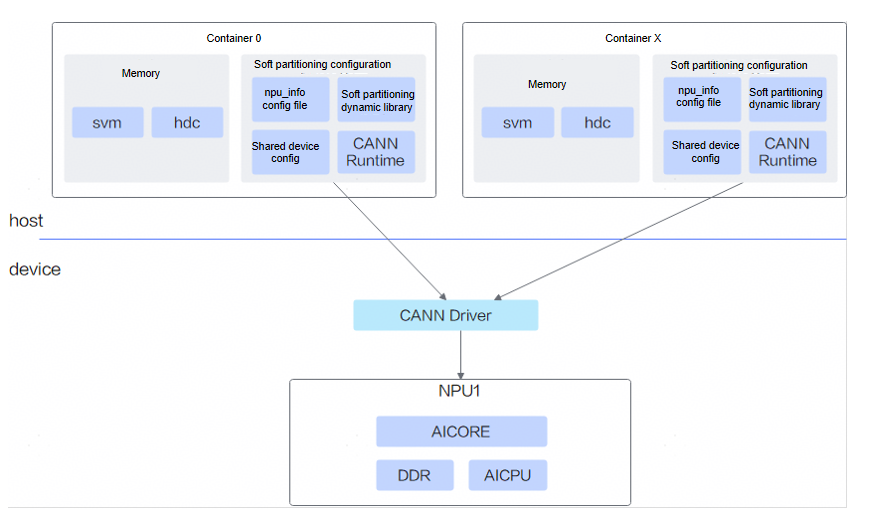

# Feature Description

<!-- md-trans-meta sourceCommit=a277c409db3c3340f95d7c4831c0d54fa24e71a7 translatedAt=2026-08-28T09:27:01.865Z pushedAt=2026-08-28T10:52:27.704Z -->

The vCANN-RT-based virtual instance feature mounts the NPU (Ascend AI Processor) configured on the physical machine into containers by providing a soft partitioning configuration file to vCANN-RT.

This feature offers the following advantages:

- **Lower usage threshold and cost**: Multiple users can request NPU resources on demand and share the computing power of a single NPU card.
- **Finer-grained computing power allocation**: The computing power soft partitioning solution is based on time-division multiplexing, enabling finer-grained computing power allocation.

## Principle Introduction

Ascend NPU hardware resources mainly include AICore (used for AI model computation), AICPU, and memory. The core principle of the vCANN-RT-based virtual instance feature is to allocate resources on demand through vCANN-RT by means of a soft partitioning configuration file according to the resource requirements specified by the user. For example, when a user needs only 50% of the AICore computing power and 2 GB of high-bandwidth memory, the system creates an `npu_info` configuration file and obtains the above resources from the NPU through vCANN-RT for use by the container. The vCANN-RT-based virtual instance solution is shown in [Figure 1](#fig987114711574vcann).

**Figure 1** vCANN-RT-based virtual instance solution

## Supported Products

**Table 1** Supported products

<table>
<thead align="left">
<tr>
<th class="cellrowborder" align="center" valign="center" width="30%">
Product Series
</th>
<th class="cellrowborder" align="center" valign="center" width="40%">
Supported Scenario
</th>
<th class="cellrowborder" align="center" valign="center" width="15%">
Virtualization Mode
</th>
<th class="cellrowborder" align="center" valign="center" width="15%">
Supported
</th>
</tr>
</thead>
<tbody align="left">
<tr>
<td class="cellrowborder" valign="top" width="30%"><term>Atlas A2 training products</term></td>
<td class="cellrowborder" rowspan="5" valign="center" width="40%">
Generate a soft partitioning configuration file on the physical machine, and mount the NPU and configuration file to the container
</td>
<td class="cellrowborder" rowspan="5" align="center" valign="center" width="15%">
Soft partitioning virtualization
</td>
<td class="cellrowborder" rowspan="5" align="center" valign="center" width="10%">
Yes
</td>
</tr>
<tr>
<td class="cellrowborder" valign="top" width="30%"><term>Atlas A2 inference products</term></td>
</tr>
<tr>
<td class="cellrowborder" valign="top" width="30%"><term>Atlas A3 training products</term></td>
</tr>
<tr>
<td class="cellrowborder" valign="top" width="30%"><term>Atlas A3 inference products</term></td>
</tr>
<tr>
<td class="cellrowborder" valign="top" width="30%">Atlas 350 accelerator card</td>
</tr>
</tbody>
</table>

## Usage Instructions

- Soft partitioning virtualization is implemented based on [vCANN-RT](https://gitcode.com/openeuler/ubs-virt/blob/master/ubs-virt-enpu/vcann-rt/README.md)
by repeatedly mounting the NPU to multiple containers. The CANN inside each container uses NPU resources according to the configured ratio.
- To use the soft partitioning virtualization feature, see [Soft Partitioning Scheduling (Inference)](./01_soft_allocation_scheduling_inference.md).

>[!NOTICE]
>If [vCANN-RT](https://gitcode.com/openeuler/ubs-virt/blob/master/ubs-virt-enpu/vcann-rt/README.md) is not compiled and deployed as required, the soft partitioning virtualization feature will not work properly.

## Usage Constraints

- The soft partitioning virtualization feature supports inference jobs only.
- In the soft partitioning virtualization scenario, a container can mount only one NPU.
- The data corresponding to requests in the job YAML indicates the requested AICore percentage of the NPU, not the actual number of NPUs.
- When **Atlas A3 training or inference products** use the soft partitioning virtualization feature, single-die passthrough mode must be enabled. That is, add `-useSingleDieMode=true` to the YAML of Ascend Device Plugin.
- After a physical NPU is virtualized through soft partitioning, the physical NPU can only be mounted to containers and cannot be passed through to virtual machines.
- In the soft partitioning virtualization scenario, if all containers mount the same physical NPU, the physical NPU must use the same soft partitioning policy.
- Due to hardware device limitations (see [Usage Constraints](https://www.hiascend.com/document/detail/en/CANNCommunityEdition/910/others/acldevg/aclcppdevg_000222.html)), it is recommended that the maximum number of vCANN-RT partitions not exceed the maximum number of user processes supported by a single device.
