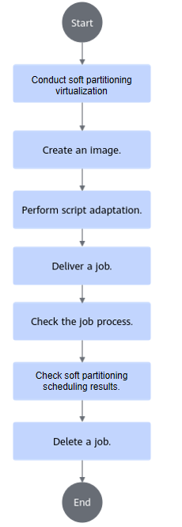
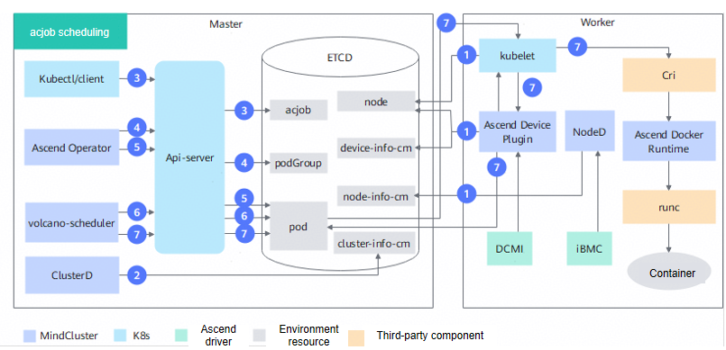

# Soft Partitioning Scheduling (Inference)<a name="ZH-CN_TOPIC_0000002511428569"></a>

<!-- md-trans-meta sourceCommit=a277c409db3c3340f95d7c4831c0d54fa24e71a7 translatedAt=2026-08-28T09:27:52.258Z pushedAt=2026-08-28T10:52:27.706Z -->

## Before You Start<a name="ZH-CN_TOPIC_0000002511347125"></a>

### Usage Notes<a name="ZH-CN_TOPIC_00000025113463450356vcann"></a>

In Kubernetes scenarios, when you need to use NPU resources, use Ascend Device Plugin and Volcano together so that Kubernetes can manage and schedule Ascend processor resources. The cluster scheduling components required by the Ascend soft partitioning virtualization include Ascend Device Plugin, Volcano, Ascend Docker Runtime, Ascend Operator, and ClusterD. For supported product models, see "Table 1 Supported products" in [Feature Description](./00_description.md).

The soft partitioning scheduling feature supports only Volcano as the scheduler and does not support other schedulers.

### Scenario Description<a name="section1576110260450vcann"></a>

Before using soft partitioning virtualization, see scenario description in [Table 1](#table62551184461989657).

**Table 1**  Scenario description

<a name="table62551184461989657"></a>
<table><thead align="left"><tr><th class="cellrowborder" valign="top" width="19.98%" id="mcps1.2.3.1.1"><p>Scenario</p>
</th>
<th class="cellrowborder" valign="top" width="80.02%" id="mcps1.2.3.1.2"><p>Description</p>
</th>
</tr>
</thead>
<tbody><tr><td class="cellrowborder" rowspan="4" valign="top" width="19.98%" headers="mcps1.2.3.1.1 "><p>General description</p>
</td>
<td class="cellrowborder" valign="top" width="80.02%" headers="mcps1.2.3.1.2 ">
<p>The allocated chip information is reflected in the following labels of the PodGroup. For details about PodGroup labels, see the following parameters in <a href="../../../06_api/01_volcano.md#podgroup">PodGroup</a>:
<ul>
<li>"huawei.com/scheduler.softShareDev.aicoreQuota": The value ranges from 1 to 100, indicating the AICore percentage requested by the soft partitioning task.</li>
<li>"huawei.com/scheduler.softShareDev.hbmQuota": The value ranges from 1 to "maxHBM", where "maxHBM" is the "HBM" value in "HBM-Usage(MB)" queried via the "npu-smi info" command, indicating the amount of high bandwidth memory requested by the soft partitioning task.</li>
<li>"huawei.com/scheduler.softShareDev.policy": The value can be "fixed-share" (fixed quota mode), "elastic" (elastic mode), or "best-effort" (contention mode), indicating the policy of the soft partitioning task.</li>
</ul></p>
</td>
</tr>
<tr><td class="cellrowborder" valign="top" headers="mcps1.2.3.1.1 "><p>The soft partitioning feature must be used together with vCANN-RT.</p>
</td>
</tr>
<tr><td class="cellrowborder" valign="top" headers="mcps1.2.3.1.1 "><p>When allocating soft-partitioned NPUs, MindCluster scheduling prioritizes filling the physical NPU with the least remaining computing power.</p>
</td>
</tr>
<tr><td class="cellrowborder" valign="top" headers="mcps1.2.3.1.1 "><p>Currently, each Pod of a job requests 1 NPU. The number of NPUs physically used is 1, but the number of NPUs requested in the job YAML must be consistent with the "huawei.com/scheduler.softShareDev.aicoreQuota" configuration.</p>
</td>
</tr>
<tr><td class="cellrowborder" rowspan="4" valign="top" width="19.98%" headers="mcps1.2.3.1.1 "><p>Supported scenarios</p>
</td>
<td class="cellrowborder" valign="top" width="80.02%" headers="mcps1.2.3.1.2 "><p>Multiple replicas are supported, but the NPU soft partitioning policy used by each Pod in the multiple replicas must be consistent.</p>
</td>
</tr>
<tr><td class="cellrowborder" valign="top" headers="mcps1.2.3.1.1 "><p>Kubernetes mechanisms such as affinity are supported.</p>
</td>
</tr>
<tr><td class="cellrowborder" valign="top" headers="mcps1.2.3.1.1 "><p>Rescheduling upon chip faults and node faults is supported. For details, see <a href="../../03_basic_scheduling/06_recovery_of_inference_card_faults.md">Recovery of Inference Card Faults</a> and <a href="../../03_basic_scheduling/05_rescheduling_upon_inference_card_faults.md">Rescheduling upon Inference Card Faults</a>.</p>
</td>
</tr>
<tr><td class="cellrowborder" valign="top" headers="mcps1.2.3.1.1 "><p>Support mixed deployment of soft partitioning virtualization and non-soft partitioning virtualization in a cluster.</p>
</td>
</tr>
<tr><td class="cellrowborder" rowspan="3" valign="top" width="19.98%" headers="mcps1.2.3.1.1 "><p>Unsupported scenarios</p>
</td>
<td class="cellrowborder" valign="top" width="80.02%" headers="mcps1.2.3.1.2 "><p>Mixing different chips within a single job is not supported.</p>
</td>
</tr>
<tr><td class="cellrowborder" valign="top" headers="mcps1.2.3.1.1 "><p>Uninstalling Volcano while a job is running is not supported.</p>
</td>
</tr>
<tr><td class="cellrowborder" valign="top" headers="mcps1.2.3.1.1 "><p>Nodes with the soft partitioning feature enabled can only be used through Ascend for Volcano scheduling. They cannot be used through the native scheduler, docker, or other methods.</p>
</td>
</tr>
</tbody>
</table>

### Prerequisites

To use the soft partitioning scheduling feature, ensure that the following components are installed. If they are not installed, refer to [Installation and Deployment](../../../03_installation_guide/02_installation/00_helm_installation.md) for the procedure.

- Volcano
- Ascend Device Plugin
- Ascend Docker Runtime
- Ascend Operator
- ClusterD

The key operations are as follows:

1. Add the label `huawei.com/scheduler.chip1softsharedev.enable=true` to the node to indicate that the node supports soft partitioning.

    ```shell
    kubectl label nodes node_name huawei.com/scheduler.chip1softsharedev.enable=true
    ```

    In a scenario where soft partitioning virtualization and non-soft partitioning virtualization are deployed in a mixed manner, if a node does not support the soft partitioning virtualization feature, add the label `huawei.com/scheduler.chip1softsharedev.enable=false` to the node.

2. Obtain `Ascend-docker-runtime_{version}_linux-{arch}.run` and install Ascend Docker Runtime.
3. See [Installation and Deployment](../../../03_installation_guide/02_installation/00_helm_installation.md) to complete the installation of each component.

    Ascend Device Plugin parameters need to be modified for virtualization. Modify and use the corresponding YAML for installation and deployment as follows:

    1. Add `-shareDevCount=100 -softShareDevConfigDir=/share_device/` to `device-plugin-volcano-v{version}.yaml`, where `/share_device/` is manually created by the user. When <b>Atlas A3 training or inference products</b> use the soft partitioning virtualization feature, additionally add `-useSingleDieMode=true`.
    2. In `device-plugin-volcano-v{version}.yaml`, add mount items named `enpu-config-dir` and `share-device-config-dir` to `volumeMounts` and `volumes`. The path of `enpu-config-dir` is fixed to `/etc/enpu/`, which is used to store the generated configuration file `npu_info.config` for soft partitioning virtualization tasks. The path of `share-device-config-dir` must be consistent with the value of the `-softShareDevConfigDir` parameter, and is used to store the shared memory configuration file for soft partitioning virtualization tasks.

       ```yaml
       ...
               # Only when Atlas A3 training or inference products use the soft partitioning virtualization feature is it necessary to add -useSingleDieMode=true
               args: [ "device-plugin -volcanoType=true -presetVirtualDevice=true
                 -logFile=/var/log/mindx-dl/devicePlugin/devicePlugin.log -logLevel=0 -shareDevCount=100 -softShareDevConfigDir=/share_device/ -useSingleDieMode=true" ]
             ...
               volumeMounts:
             ...
                 - name:  enpu-config-dir
                   mountPath: /etc/enpu/
                 - name: share-device-config-dir
                   mountPath: /share_device/
           ...
       volumes:
             ...
         - name: enpu-config-dir
           hostPath:
             path: /etc/enpu/
         - name: share-device-config-dir
           hostPath:
             path: /share_device/
             type: DirectoryOrCreate
       ```

        The startup parameters of the soft partitioning virtualization are described as follows:

       **Table 2** Ascend Device Plugin startup parameters

       <a name="table1064314568229"></a>

       |Name|Type|Default Value| Description                                                                                                                          |
       |--|--|--|-----------------------------------------------------------------------------------------------------------------------------|
       |`-shareDevCount`|uint|1| When using the soft partitioning virtualization feature, the value can only be `100`.                                                                                                        |
       |`-softShareDevConfigDir`|string|""| Configuration directory for the soft partitioning virtualization scenario.                                                                                                               |
       |`-useSingleDieMode`|bool|false| Whether to enable single-die passthrough mode for <b>Atlas A3 training or inference products</b>.<ul><li>`true`: enable single-die passthrough mode.</li><li>`false`: disable single-die passthrough mode.</li></ul>When using the soft partitioning virtualization feature, this parameter must be set to `true`. |

    3. (Optional) For the hybrid deployment scenario of the soft partitioning virtualization feature and the non-soft partitioning virtualization feature, modify the YAML of Ascend Device Plugin as follows.

       - Install Ascend Device Plugin that supports the soft partitioning feature on nodes that support the soft partitioning virtualization feature, and copy `device-plugin-volcano-v\{version\}.yaml` as `softsharedev-device-plugin-volcano-v\{version\}.yaml`. Modify `softsharedev-device-plugin-volcano-v\{version\}.yaml` as follows:

         ```yaml
         apiVersion: apps/v1
         kind: DaemonSet
         metadata:
           name: ascend-device-plugin-daemonset-softsharedev #Identify that Ascend Device Plugin supports the soft partitioning virtualization feature in the hybrid deployment scenario of soft partitioning virtualization and non-soft partitioning virtualization features.
           namespace: kube-system
         spec:
           ...
           template:
           ...
             spec:
             ...
               nodeSelector:
                 huawei.com/scheduler.chip1softsharedev.enable: "true"  #Select nodes that support soft partitioning virtualization to deploy Ascend Device Plugin.
               serviceAccountName: ascend-device-plugin-sa
               containers:
               ...
                 command: [ "/bin/bash", "-c", "--"]
                 args: [ "device-plugin -volcanoType=true -presetVirtualDevice=true
                 -logFile=/var/log/mindx-dl/devicePlugin/devicePlugin.log -logLevel=0 -shareDevCount=100 -softShareDevConfigDir=/share_device/" ]
               ...
                 volumeMounts:
               ...
                   - name: enpu-config-dir
                     mountPath: /etc/enpu/
                   - name: share-device-config-dir
                     mountPath: /share_device/
             ...
         volumes:
               ...
           - name: enpu-config-dir
             hostPath:
               path: /etc/enpu/
           - name: share-device-config-dir
             hostPath:
               path: /share_device/
               type: DirectoryOrCreate
         ```

       - Install the original Ascend Device Plugin on nodes that do not support the soft partitioning virtualization feature, and modify `device-plugin-volcano-v\{version\}.yaml` as follows:

         ```yaml
         apiVersion: apps/v1
         kind: DaemonSet
         metadata:
           name: ascend-device-plugin-daemonset # Indicates that Ascend Device Plugin does not support soft partitioning virtualization in a hybrid deployment scenario where soft partitioning virtualization and non-soft partitioning virtualization coexist.
           namespace: kube-system
         spec:
           ...
           template:
           ...
             spec:
             ...
               nodeSelector:
                 huawei.com/scheduler.chip1softsharedev.enable: "false"  # Select nodes that do not support the soft partitioning virtualization feature to deploy Ascend Device Plugin.
               serviceAccountName: ascend-device-plugin-sa
           ...
         ```

### Usage

The soft partitioning scheduling feature can be used in the following ways:

- Use via the command line: install the cluster scheduling components and use the feature through the command line.
- Use after integration: integrate the cluster scheduling components into an existing third-party AI platform or an AI platform developed based on them.

### Procedure

For the procedure of using the soft partitioning scheduling feature through the command line, see [Figure 1](#fig24252498666vcann).

**Figure 1** Procedure<a name="fig24252498666vcann"></a>



## Implementation Principles

Taking an Ascend Job (acjob) as an example, its schematic diagram is shown in [Figure 2](#fig23698010123).

**Figure 2** Schematic diagram of acjob scheduling<a name="fig23698010123"></a>



The steps are described as follows:

1. The cluster scheduling components periodically report node and chip information.
    - kubelet reports the number of chips on the node to the node object (node).
    - Ascend Device Plugin periodically reports chip topology information.

        Reports soft partitioning NPU information. It reports the physical ID of the chip to `device-info-cm`; the total allocatable chip percentage, the allocated chip percentage, and the basic chip information (device ip and super\_device\_ip) are reported to Node for soft partitioning scheduling.

    - When a fault exists on the node, NodeD periodically reports the node health status and node hardware fault information to `node-info-cm`, and reports shared storage faults to the public faults of ClusterD.

2. ClusterD reads the information in `device-info-cm` and `node-info-cm`, as well as the public fault information, and then consolidates the information into `cluster-info-cm`.
3. The user submits an acjob through kubectl or another deep learning platform.
4. Ascend Operator creates the corresponding PodGroup for the job. For details about PodGroup, see the [open-source Volcano official documentation](https://volcano.sh/docs/v1.9.0/Concepts/podgroup).
5. Ascend Operator creates the corresponding Pod for the job and injects the environment variables required for collective communication into the container.
6. volcano-scheduler selects a suitable node for the job based on the total chip AICore percentage and total on-chip memory of the node, as well as the used information in the annotations of the Pods already deployed on that node, and writes the selected chip information into the Pod annotations.
7. When kubelet creates a container, it invokes Ascend Device Plugin to mount the chip and the files required for chip sharing. Ascend Device Plugin or volcano-scheduler writes the chip information to the Pod's annotation. Ascend Docker Runtime assists in mounting the corresponding resources.

## Using via Command Line (Volcano)<a name="ZH-CN_TOPIC_00000024792271456"></a>

### Environment Preparation

On the host side, use the `npu-smi` tool to enable container sharing mode, which allows multiple containers to mount the same device. If container sharing mode is not enabled on a device, the device can be mounted to only a single container. When used with MindCluster, container sharing mode must be enabled on the entire node.

```shell
# Atlas A2/A3 training or inference products: set container sharing mode
npu-smi set -t device-share -i ${id} -c ${chip_id} -d ${value}
# Ascend 950PR: set container sharing mode
npu-smi set -t device-share -i ${id} -d ${value}

# Query the container sharing mode of a device
npu-smi info -t device-share -i ${id}
```

**Table 3 Parameter description**

|Name|Description|
|---|---|
|`id`|Device ID. The NPU ID obtained by running the `npu-smi info -m` command is the device ID.|
|`chip_id`|Chip ID. The Chip ID obtained by running the `npu-smi info -m` command is the chip ID.|
|`value`|Startup status of the container sharing mode.<ul><li>`0`: disabled</li><li>`1`: enabled</li></ul>It is disabled by default.|

The following uses the Ascend 950PR product as an example:
Enable the container sharing mode for all chips on device 0, and query the container sharing mode of device 0.

  ```shell
  npu-smi set -t device-share -i 0 -d 1
  npu-smi info -t device-share -i 0
  ```

You can set the persistent startup status of container sharing on the host side. If the persistence function is enabled, the startup status of the container sharing mode of the device remains the same as before the system restart.

```shell
npu-smi set -t device-share-cfg-recover -d ${value}
```

**Table 4 Parameter description**

|Name|Description|
|---|---|
|`value`|Container sharing persistent startup status.<ul><li>`0`: disabled</li><li>`1`: enabled</li></ul>It is disabled by default.|

### Preparing vCANN-RT

Refer to the official [vCANN-RT](https://gitcode.com/openeuler/ubs-virt/blob/master/ubs-virt-enpu/vcann-rt/README.md#source-code-acquisition) documentation to complete the compilation and configuration of vCANN-RT.

### Building an Image<a name="ZH-CN_TOPIC_0000002511427026"></a>

**Obtaining the Inference Image**

You can obtain the inference image in either of the following ways.

- It is recommended that you download the **inference base image (such as [mindie](https://www.hiascend.com/developer/ascendhub/detail/af85b724a7e5469ebd7ea13c3439d48f))** from the [Ascend image repository](https://www.hiascend.com/en/developer/ascendhub) based on the system architecture (ARM or x86\_64).

    >[!NOTE]
    >The base image does not contain files such as inference models and scripts. Therefore, users need to make customized modifications (such as adding inference script code and models) according to their own requirements before using it.

- (Optional) You can customize your own inference image based on the inference base image. For the creation process, see [Building an Inference Image Using Dockerfile](../../../07_references/02_common_operations.md#building-a-container-image-using-a-dockerfile-mindspore).

    After completing the customization, you can rename the inference image for easier management and use.

**Hardening the Image**

The downloaded or created inference base image can be security-hardened to improve image security. For details, see the [Container Security Hardening](../../../07_references/04_security_hardening.md#container-security-hardening) section.

### Script Adaptation<a name="ZH-CN_TOPIC_000000251134706701"></a>

This section uses the inference image in the Ascend image repository as an example to introduce the operation procedure to users. This image already contains inference sample scripts. In actual inference scenarios, users need to prepare inference scripts by themselves. Before pulling the image, ensure that the network proxy of the current environment has been configured so that the environment can access the Ascend image repository normally.

**Obtaining Sample Scripts from the Ascend Image Repository<a name="section8181015175911"></a>**

1. After ensuring that the server can access the Internet, visit the [Ascend image repository](https://www.hiascend.com/developer/ascendhub).
2. In the left navigation pane, select inference images, and then select the [mindie](https://www.hiascend.com/developer/ascendhub/detail/af85b724a7e5469ebd7ea13c3439d48f) image to obtain the inference sample scripts.

    >[!NOTE]
    >If you do not have download permission, apply for permission as prompted on the page. After submitting the application, wait for the administrator to review it. Once approved, you can download the image.

### Preparing the Job YAML<a name="ZH-CN_TOPIC_00000024793871220102"></a>

>[!NOTE]
>
>- If you do not use Ascend Docker Runtime, Ascend Device Plugin only mounts the NPU devices. You need to modify the YAML file by yourself to mount the corresponding driver directories and files. The mount path inside the container must be the same as the path on the host.
>- Because the Atlas 200I SoC A1 core board does not support Ascend Docker Runtime, you do not need to modify the YAML file.

**Procedure<a name="zh-cn_topic_0000001558853680_zh-cn_topic_0000001609074213_section14665181617334"></a>**

1. Obtain the corresponding YAML file.

    **Table 5**  YAML description
    <table>
    <thead align="left">
    <tr>
    <th class="cellrowborder" align="center" valign="center" width="22%"><p>Job Type</p></th>
    <th class="cellrowborder" align="center" valign="center" width="47%"><p>Hardware Model</p></th>
    <th class="cellrowborder" align="center" valign="center" width="21%"><p>YAML Name</p></th>
    <th class="cellrowborder" align="center" valign="center" width="10%"><p>Link</p></th>
    </tr>
    </thead>
    <tbody>
    <tr>
    <td class="cellrowborder" rowspan="2" align="center" valign="center" width="22%"><p>Ascend Job</p></td>
    <td class="cellrowborder" valign="top" width="47%"><p><term>Atlas A2 training products</term></p><p><term>Atlas A2 inference products</term></p><p><term>Atlas A3 training products</term></p><p><term>Atlas A3 inference products</term></p></td>
    <td class="cellrowborder" align="center" valign="center"  width="21%"><p>pytorch_acjob_infer_910b_softsharedev.yaml</p></td>
    <td class="cellrowborder" align="center" valign="center"  width="10%"><p><a href="https://gitcode.com/Ascend/mindcluster-deploy/blob/branch_v26.1.0/samples/inference/volcano/pytorch_acjob_infer_910b_softsharedev.yaml" target="_blank" rel="noopener noreferrer">YAML</a></p></td>
    </tr>
    <tr>
    <td class="cellrowborder" valign="top" width="47%"><p>Atlas 350 accelerator card</p></td>
    <td class="cellrowborder" align="center" valign="center"  width="21%"><p>pytorch_acjob_infer_950_softsharedev.yaml</p></td>
    <td class="cellrowborder" align="center" valign="center"  width="10%"><p><a href="https://gitcode.com/Ascend/mindcluster-deploy/blob/branch_v26.1.0/samples/inference/volcano/pytorch_acjob_infer_950_softsharedev.yaml" target="_blank" rel="noopener noreferrer">YAML</a></p></td>
    </tr>
    <tr>
    <td class="cellrowborder" rowspan="2" align="center" valign="center" width="22%"><p>Volcano Job</p></td>
    <td class="cellrowborder" valign="top" width="47%"><p><term>Atlas A2 training products</term></p><p><term>Atlas A2 inference products</term></p><p><term>Atlas A3 training products</term></p><p><term>Atlas A3 inference products</term></p></td>
    <td class="cellrowborder" align="center" valign="center"  width="21%"><p>infer-vcjob-910-softsharedev.yaml</p></td>
    <td class="cellrowborder" align="center" valign="center"  width="10%"><p><a href="https://gitcode.com/Ascend/mindcluster-deploy/blob/branch_v26.1.0/samples/inference/volcano/infer-vcjob-910-softsharedev.yaml" target="_blank" rel="noopener noreferrer">YAML</a></p></td>
    </tr>
    <tr>
    <td class="cellrowborder" valign="top" width="47%"><p>Atlas 350 accelerator card</p></td>
    <td class="cellrowborder" align="center" valign="center"  width="21%"><p>infer-vcjob-950-softsharedev.yaml</p></td>
    <td class="cellrowborder" align="center" valign="center"  width="10%"><p><a href="https://gitcode.com/Ascend/mindcluster-deploy/blob/branch_v26.1.0/samples/inference/volcano/infer-vcjob-950-softsharedev.yaml" target="_blank" rel="noopener noreferrer">YAML</a></p></td>
    </tr>
    <tr>
    <td class="cellrowborder" rowspan="2" align="center" valign="center" width="22%"><p>Deployment</p></td>
    <td class="cellrowborder" valign="top" width="47%"><p><term>Atlas A2 training products</term></p><p><term>Atlas A2 inference products</term></p><p><term>Atlas A3 training products</term></p><p><term>Atlas A3 inference products</term></p></td>
    <td class="cellrowborder" align="center" valign="center"  width="21%"><p>infer-deploy-softsharedev.yaml</p></td>
    <td class="cellrowborder" align="center" valign="center"  width="10%"><p><a href="https://gitcode.com/Ascend/mindcluster-deploy/blob/branch_v26.1.0/samples/inference/volcano/infer-deploy-softsharedev.yaml" target="_blank" rel="noopener noreferrer">YAML</a></p></td>
    </tr>
    <tr>
    <td class="cellrowborder" valign="top" width="47%"><p>Atlas 350 accelerator card</p></td>
    <td class="cellrowborder" align="center" valign="center"  width="21%"><p>infer-deploy-950-softsharedev.yaml</p></td>
    <td class="cellrowborder" align="center" valign="center"  width="10%"><p><a href="https://gitcode.com/Ascend/mindcluster-deploy/blob/branch_v26.1.0/samples/inference/volcano/infer-deploy-950-softsharedev.yaml" target="_blank" rel="noopener noreferrer">YAML</a></p></td>
    </tr>
    </tbody>
    </table>
2. Upload the YAML file to any directory on the management node and modify the file content based on the actual situation.

    On the Atlas 800I A2 inference server, using `pytorch_acjob_infer_910b_softsharedev.yaml` as an example, the following shows a parameter configuration example that requests a chip AICore percentage of 50%, a chip high bandwidth memory of 2048 MB, and a soft partitioning policy of fixed-share. For YAML configuration, see [YAML Configuration](../../../06_api/15_yaml_configuration.md#).

    <pre codetype="yaml">
    apiVersion: mindxdl.gitee.com/v1
    kind: AscendJob
    metadata:
      name: default-infer-test-pytorch-910b
      labels:
        framework: pytorch
        ring-controller.atlas: ascend-910b
        fault-scheduling: "force"
        <strong>huawei.com/scheduler.softShareDev.aicoreQuota: "50" # Chip AICore percentage requested by the soft partitioning task, in %</strong>
        <strong>huawei.com/scheduler.softShareDev.hbmQuota: "2048" # High bandwidth memory requested by the soft partitioning task, in MB</strong>
        <strong>huawei.com/scheduler.softShareDev.policy: "fixed-share" # Soft partitioning policy. The value can be fixed-share (fixed quota mode), elastic (elastic mode), or best-effort (contention mode)</strong>
      annotations:
        <strong>huawei.com/schedule_policy: "chip1-softShareDev" # Volcano scheduling policy for the soft partitioning scenario</strong>
    spec:
      schedulerName: volcano   # Work when enableGangScheduling is true
      runPolicy:
        schedulingPolicy:      # Work when enableGangScheduling is true
          minAvailable: 1
          queue: default
      successPolicy: AllWorkers
      replicaSpecs:
        Master:
          replicas: 1
          restartPolicy: Never
          template:
            metadata:
              labels:
                ring-controller.atlas: ascend-910b
            spec:
              automountServiceAccountToken: false
              nodeSelector:
                example-key: example-value    # Example value. Users can configure nodeSelector based on their scheduling intent
              containers:
                - name: ascend # do not modify
                  image: pytorch-test:latest         # Training framework image, which can be modified
                  imagePullPolicy: IfNotPresent
                  env:
                    - name: XDL_IP                                       # IP address of the physical node, which is used to identify the node where the pod is running
                      valueFrom:
                        fieldRef:
                          fieldPath: status.hostIP
                  command:                           # Training command, which can be modified
                    - /bin/bash
                    - -c
                  args: [ "./infer.sh" ]
                  ports:                          # Default value       containerPort: 2222 name: ascendjob-port if not set
                    - containerPort: 2222         # Determined by user
                      name: ascendjob-port        # Do not modify
                  resources:
                    requests:
                      <strong>huawei.com/Ascend910: 50 # This value must be consistent with huawei.com/scheduler.softShareDev.aicoreQuota, indicating the AICore percentage requested by the soft partitioning task</strong>
                    limits:
                      <strong>huawei.com/Ascend910: 50 # The value must be consistent with requests</strong>
                  volumeMounts:
                    - name: ascend-driver
                      mountPath: /usr/local/Ascend/driver
                    - name: ascend-add-ons
                      mountPath: /usr/local/Ascend/add-ons
                    - name: localtime
                      mountPath: /etc/localtime
                    <strong>- name: libpreload # Soft partitioning dynamic library path</strong>
                      <strong>mountPath: /opt/enpu/vcann-rt/lib/libvruntime.so</strong>
                    <strong>- name: preload # preload configuration file path</strong>
                      <strong>mountPath: /etc/ld.so.preload</strong>
              volumes:
                - name: ascend-driver
                  hostPath:
                    path: /usr/local/Ascend/driver
                - name: ascend-add-ons
                  hostPath:
                    path: /usr/local/Ascend/add-ons
                - name: localtime
                  hostPath:
                    path: /etc/localtime
                <strong>- name: libpreload # Address of the soft partitioning dynamic library</strong>
                  <strong>hostPath:</strong>
                    <strong>path: /opt/enpu/vcann-rt/lib/libvruntime.so</strong>
                <strong>- name: preload # Address of the preload configuration file</strong>
                  <strong>hostPath:</strong>
                    <strong>path: ${preload_path}/ld.so.preload # The path of the ld.so.preload file on the host can be customized by users. In the subsequent content of this document, ${preload_path} is used to represent it. Inside the container, it is a fixed path /etc/ld.so.preload. It is not recommended to place the ld.so.preload file in the /etc directory of the host. Otherwise, the soft partitioning dynamic library will be preloaded on the host side, which may affect host-side services.</strong>
    </pre>

>[!NOTE]
>When a soft partitioning virtualization task is submitted on **Atlas A3 training or inference products**, only one die (that is, one Da Vinci device) is actually mounted under `/dev` in the task container. However, running the <b>npu-smi info</b> command shows that two dies are mounted. This is normal. The sample output is as follows:
>
> ```ColdFusion
> +-----------------------------------------------------------------------------------------------+
> | npu-smi xxx.xxx.xxx                Version: xxx.xxx.xxx                                       |
> +---------------------------+---------------+---------------------------------------------------+
> | NPU   Name         | Health        | Power(W)    Temp(C)           Hugepages-Usage(page)      |
> | Chip  Phy-ID       | Bus-Id        | AICore(%)   Memory-Usage(MB)  HBM-Usage(MB)              |
> +===========================+===============+===================================================+
> | 0     xxx          | OK            | 157.3       32                0    / 0                   |
> | 0     0            | 0000:9D:00.0  | 0           0        / 0      3130 / 65536               |
> +---------------------------+---------------+---------------------------------------------------+
> | 0     xxx          | OK            | -           32                0    / 0                   |
> | 1     0            | 0000:9D:00.0  | 0           0        / 0      3130 / 65536               |
> +===========================+===============+===================================================+
> +---------------------------+---------------+---------------------------------------------------+
> | NPU     Chip       | Process id    | Process name| Process memory(MB) |Process id in container|
> +===========================+===============+===================================================+
> | No running processes found in NPU 0                                                           |
> +===========================+===============+===================================================+
> ```

### Submitting a Job<a name="ZH-CN_TOPIC_000000247922713402"></a>

In the directory where the sample YAML file is located on the management node, run the following command to submit an inference job using the YAML file.

```shell
kubectl apply -f XXX.yaml
```

Example:

```shell
kubectl apply -f pytorch_acjob_infer_910b_softsharedev.yaml
```

Output example:

```ColdFusion
ascendjob.mindxdl.gitee.com/default-infer-test-pytorch-910b created
```

>[!NOTE]
>If you modify the task YAML file after the job is successfully submitted, run the `kubectl delete -f XXX.yaml` command to delete the original job first, and then submit the job again.

### Viewing the Job Process<a name="ZH-CN_TOPIC_00000025113470710203"></a>

The following uses Atlas A2 products as an example to describe the procedure for viewing the job process.

**Procedure**

1. <a name="ZH-CN_TOPIC_00000025113470710203step01"></a>Run the following command to check the Pod running status.

    ```shell
    kubectl get pod --all-namespaces
    ```

   Output example:

    ```ColdFusion
    NAMESPACE        NAME                                       READY   STATUS    RESTARTS   AGE
    ...
    default         default-infer-test-pytorch-910b-master-0    1/1     Running   0          8s
    ...
    ```

2. View the details of the node running the inference job.
    1. Run the following command to view the node name.

        ```shell
        kubectl get node -A
        ```

    2. Based on the node name obtained in the previous step, run the following command to view the node details.

        ```shell
        kubectl describe node <nodename>
        ```

        Output example:

        ```ColdFusion
        ...
        Allocated resources:
          (Total limits may be over 100 percent, i.e., overcommitted.)
          Resource              Requests     Limits
          --------              --------     ------
          cpu                   4 (2%)       3500m (1%)
          memory                2140Mi (0%)  4040Mi (0%)
          ephemeral-storage     0 (0%)       0 (0%)
          huawei.com/Ascend910  50           50
        Events:
          Type    Reason    Age   From                Message
          ----    ------    ----  ----                -------
          Normal  Starting  36m   kube-proxy, ubuntu  Starting kube-proxy.
        ...
        ```

        In the displayed information, locate **huawei.com/Ascend910** under "Allocated resources". The value of this parameter increases after the inference task is executed, and the increment equals the total AICore percentage of the NPU chips used by the inference task.

### Viewing Soft Partitioning Scheduling Results<a name="ZH-CN_TOPIC_000000247938712002"></a>

**Procedure**

Run the following command on the management node to view the inference result.

```shell
kubectl logs -f default-infer-test-pytorch-910b-master-0
```

The output example is as follows. The actual output prevails.

```ColdFusion
[20260304150146] [INFO] [eNPU] [vCANN_RT] [1799:281472853921824:config.c:145] Success to load config: physical-npu-id, value: 2
[20260304150146] [INFO] [eNPU] [vCANN_RT] [1799:281472853921824:config.c:145] Success to load config: virtual-npu-id, value: 0
[20260304150146] [INFO] [eNPU] [vCANN_RT] [1799:281472853921824:config.c:145] Success to load config: aicore-quota, value: 100
[20260304150146] [INFO] [eNPU] [vCANN_RT] [1799:281472853921824:config.c:145] Success to load config: memory-quota, value: 60000
[20260304150146] [INFO] [eNPU] [vCANN_RT] [1799:281472853921824:config.c:145] Success to load config: shm-id, value: C281A66C-80A047F2-0A645632-CC500485-100301E3
[20260304150146] [INFO] [eNPU] [vCANN_RT] [1799:281472853921824:config.c:145] Success to load config: scheduling-policy, value: 2
[20260304150146] [INFO] [eNPU] [vCANN_RT] [1799:281472853921824:npu-manager.c:127] Successfully to initialize vnpu device.
[20260304150146] [INFO] [eNPU] [vCANN_RT] [1799:281472853921824:mem-limiter.c:69] create /run/enpu/vcann-rt/ success
[20260304150146] [INFO] [eNPU] [vCANN_RT] [1799:281460942893344:core-limiter.c:290] The scheduling process has been detected to exit, and the scheduling is being taken over.
[20260304150146] [INFO] [eNPU] [vCANN_RT] [1799:281472853921824:npu-manager.c:168] Successfully to initialize all module.
[20260304150146] [INFO] [eNPU] [vCANN_RT] [1799:281472853921824:memory.c:91] Hook mem rtMemGetInfoEx.
[20260304150146] [INFO] [eNPU] [vCANN_RT] [1799:281472853921824:memory.c:91] Hook mem rtMemGetInfoEx.
```

>[!NOTE]
><i>default-infer-test-pytorch-910b-master-0</i>: name of the job running in [Step 1](#ZH-CN_TOPIC_00000025113470710203step01) in the "Viewing the Job Process" section.

### Deleting a Job<a name="ZH-CN_TOPIC_00000025113470650102"></a>

In the directory where the sample YAML file is located, run the following command to delete the corresponding inference job.

```shell
kubectl delete -f XXX.yaml
```

Example:

```shell
kubectl delete -f pytorch_acjob_infer_910b_softsharedev.yaml
```

Output example:

```ColdFusion
root@ubuntu:/home/test/yaml# kubectl delete -f pytorch_acjob_infer_910b_softsharedev.yaml
ascendjob.mindxdl.gitee.com "default-infer-test-pytorch-910b" deleted
```

## Usage After Integration<a name="ZH-CN_TOPIC_00000025113470730102"></a>

This section requires users to be familiar with programming and development and to have a basic understanding of K8s. If you already have an AI platform or want to develop an AI platform based on the cluster scheduling component, you need to complete the following:

1. Find the corresponding [official API library](https://github.com/kubernetes-client) for K8s based on your programming language.
2. Use the official K8s API library to create, query, and delete jobs.
3. When creating, querying, or deleting jobs, you need to convert the content of the [sample YAML](#preparing-the-job-yaml) into objects defined in the official K8s API and send them to the K8s API Server through the official API, or convert the YAML content into JSON format and send it directly to the K8s API Server.
