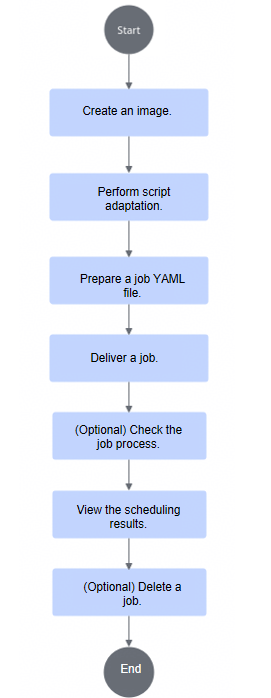
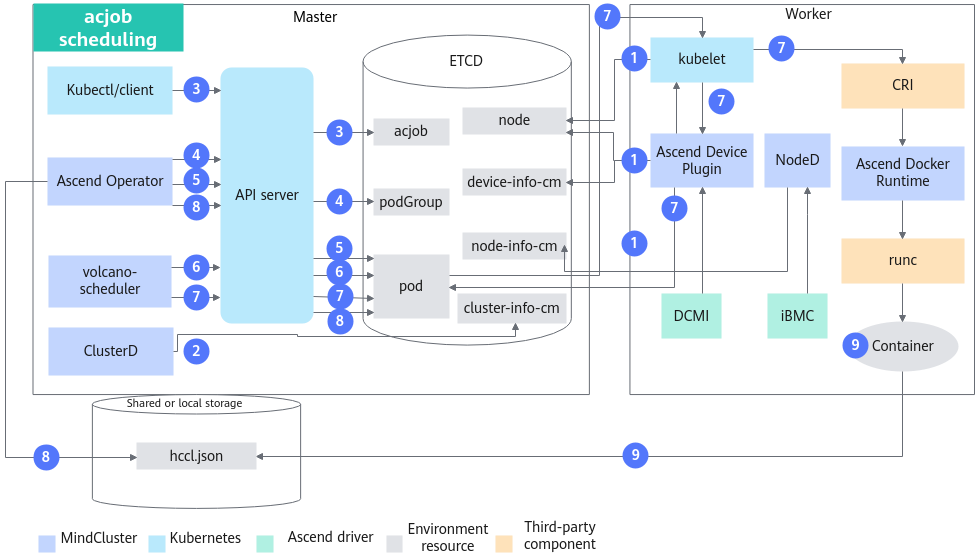
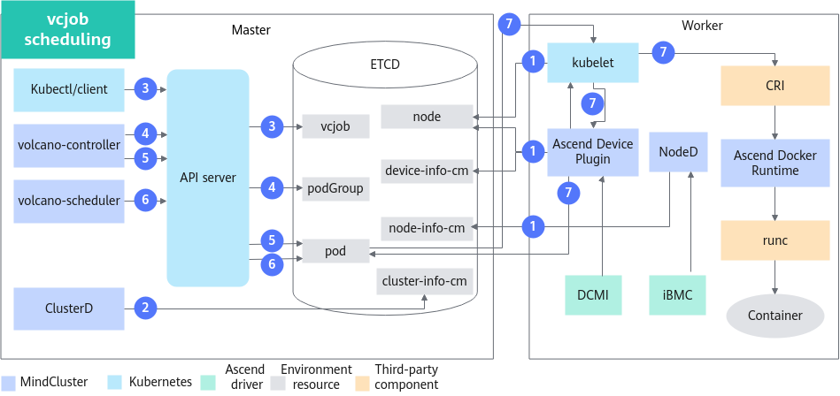

# Full-NPU Scheduling<a name="ZH-CN_TOPIC_0000002479387138"></a>

<!-- md-trans-meta sourceCommit=a277c409db3c3340f95d7c4831c0d54fa24e71a7 translatedAt=2026-08-29T08:04:43.744Z pushedAt=2026-08-29T08:07:08.002Z -->

## Before You Start<a name="ZH-CN_TOPIC_0000002511347093"></a>

**Prerequisites<a name="section52051339787"></a>**

- Before using the full-NPU scheduling feature, ensure that the related components are installed. If they are not installed, refer to [Installation and Deployment](../../03_installation_guide/02_installation/00_helm_installation.md) for instructions.
    - Volcano or other schedulers
    - Ascend Device Plugin
    - Ascend Docker Runtime
    - Ascend Operator
    - ClusterD
    - NodeD
- For the fault recovery scenario, ensure that each node has the model script information required for job execution. It is recommended to use a shared storage solution, such as NFS (Network File System). For details, see [Installing NFS](../../07_references/02_common_operations.md#installing-nfs).
- Training scenario: for ultra-large-scale cluster scheduling scenarios, batch Pod creation and batch scheduling are supported.
   - To use the batch Pod creation feature, the customized openFuyao Kubernetes must be used when installing Ascend Operator.
   - To use the batch scheduling feature, the customized openFuyao Kubernetes and volcano-ext must be used when installing Volcano, and the batch scheduling feature must be enabled.
   - The batch scheduling feature is applicable to ultra-large-scale cluster scenarios. In such scenarios, expand the CPU and memory resources allocated to MindCluster components as needed to prevent these components from experiencing insufficient performance or exceeding the allocated memory usage, which would cause the components to be evicted by Kubernetes.

**Usage<a name="section179431435174811"></a>**

- Command-line usage: The full-NPU scheduling feature requires a scheduler. Users can choose either Volcano or other schedulers. Regardless of which scheduler is selected, Ascend Operator must be used to configure resource information.
- Use after integration: Integrate the cluster scheduling components into an existing third-party AI platform or an AI platform developed based on the cluster scheduling components.

**Usage Notes<a name="section577625973520"></a>**

- Resource monitoring can be used together with all features in training and inference scenarios.
- Multiple jobs can run simultaneously in a cluster, and each job can use different features.
- The faulty-card hot recovery feature can be used together with the full-NPU scheduling feature. Set the Ascend Device Plugin startup parameter `-hotReset` to `0` to enable the fault recovery feature.

**Supported Product Forms<a name="section169961844182917"></a>**

The following products support **full-NPU scheduling**:

- <term>Atlas inference products</term>
- <term>Atlas training products</term>
- <term>Atlas A2 inference products</term>
- <term>Atlas A2 training products</term>
- <term>Atlas A3 inference products</term>
- <term>Atlas A3 training products</term>
- <term>Ascend 950 products</term>

**Usage Workflow<a name="section5640184231810"></a>**

Full-NPU scheduling supports three usage scenarios: command-line usage (Volcano), command-line usage (other schedulers), and usage after integration.

The usage workflow for Volcano and other schedulers via the command line is identical. When using other schedulers, refer to the [Command-line Usage (Other Schedulers)](#command-line-usage-other-schedulers) section to create the job YAML for preparation. The remaining operations for other schedulers are the same as those for Volcano, and can be performed by referring to [Command-line Usage (Volcano)](#command-line-usage-volcano).

**Figure 1**  Full-NPU scheduling usage workflow<a name="fig107864120214"></a>



1. During script adaptation, configure resource information through environment variables or files based on actual conditions.
2. When preparing the job YAML, the dispatched job YAML must be modified and adapted by selecting different YAML files according to the specific NPU model. When selecting a YAML file, refer to [Preparing the Job YAML](#preparing-the-job-yaml) and choose an appropriate YAML file based on actual conditions.

## Implementation Principles<a name="ZH-CN_TOPIC_0000002479387150"></a>

The principle diagrams vary slightly depending on the job type.

**acjob<a name="section9971431567"></a>**

The scheduling principle diagram of an acjob is shown in [Figure 2](#fig5188536014).

**Figure 2**  acjob scheduling principle<a name="fig5188536014"></a>



The steps are described as follows:

1. The cluster scheduling components periodically report node and chip information.
    - kubelet reports the chip count to the Node object.
    - Ascend Device Plugin periodically reports chip topology information.
        - Reports full-NPU information. The physical chip IDs are reported to `device-info-cm`; the total number of allocatable chips, the number of allocated chips, and the basic chip information (device ip and super_device_ip) are reported to the Node for full-NPU scheduling.

    - When a fault exists on a node, NodeD periodically reports the node health status and node hardware fault information to `node-info-cm`, and reports shared storage fault information to the public faults of ClusterD.

2. After reading the information in `device-info-cm` and `node-info-cm`, as well as the information in the public faults, ClusterD writes the information into `cluster-info-cm`.
3. The user dispatches an acjob through kubectl or another deep learning platform.
4. Ascend Operator creates the corresponding PodGroup for the job. For details about PodGroup, see the [open-source Volcano official documentation](https://volcano.sh/docs/v1.9.0/Concepts/podgroup).
5. Ascend Operator creates the corresponding Pod for the job and injects the environment variables required for collective communication into the container.
6. volcano-scheduler selects appropriate nodes for the job based on node and chip topology information, and writes the selected full-NPU information into the Pod annotations.

7. When kubelet creates the container, it invokes Ascend Device Plugin to mount the chips. Ascend Device Plugin or volcano-scheduler writes the chip information into the Pod annotations. Ascend Docker Runtime assists in mounting the corresponding resources.
8. Ascend Operator reads the annotation information of the Pod and writes the relevant information into `hccl.json`.
9. The container reads the environment variables or the `hccl.json` information, establish communication channels, and begin executing the job.

**vcjob<a name="section13884164615313"></a>**

The scheduling principle diagram of a vcjob job is shown in [Figure 3](#fig8717151315416).

**Figure 3**  vcjob scheduling principle<a name="fig8717151315416"></a>



The steps are described as follows:

1. The cluster scheduling components periodically report node and chip information.
    - kubelet reports the chip count to the Node object.
    - Ascend Device Plugin periodically reports chip topology information.
        - Reports full-NPU information. The physical chip IDs are reported to `device-info-cm`; the total allocatable chip count and the allocated chip count are reported to Node for full-NPU scheduling.

    - When a fault is present on a node, NodeD periodically reports the node health status and node hardware fault information to `node-info-cm`, and reports the shared storage fault information to the public faults of ClusterD.

2. ClusterD reads the information in `device-info-cm` and `node-info-cm`, as well as the information about the public faults, and then writes the information into `cluster-info-cm`.
3. The user dispatches a vcjob through kubectl or another deep learning platform.
4. volcano-controller creates the corresponding PodGroup for the job. For details about PodGroup, see the [open-source Volcano official documentation](https://volcano.sh/docs/v1.9.0/Concepts/podgroup).
5. When the cluster resources meet the job requirements, volcano-controller creates the job Pod.
6. volcano-scheduler selects appropriate nodes for the job based on the node and chip topology information, and writes the selected full-NPU information into the Pod annotation.

7. When kubelet creates a container, it calls Ascend Device Plugin to mount the chip. Ascend Device Plugin writes the chip information into the Pod's annotation. Ascend Docker Runtime assists in mounting the corresponding resources and mounts `hccl.json` into the container.
8. Ascend Operator obtains the annotation information of each Pod and writes it into `hccl.json`.
9. The container reads the `hccl.json` information, establishes a communication channel, and starts executing the job.

**deploy<a name="section32752223579"></a>**

The scheduling principle of a deploy job is shown in [Figure 4](#fig06571541566).

**Figure 4**  deploy job scheduling principle<a name="fig06571541566"></a>


The steps are described as follows:

1. The cluster scheduling components periodically report node and chip information.
    - kubelet reports the node chip count to the Node object.
    - Ascend Device Plugin periodically reports chip topology information.
        - Report full-NPU information. The physical chip IDs are reported to `device-info-cm`; the total number of allocatable chips and the number of allocated chips are reported to Node for full-NPU scheduling.

    - When a fault exists on a node, NodeD periodically reports the node health status and node hardware fault information to `node-info-cm`, and reports shared storage fault information to the public faults of ClusterD.

2. After ClusterD reads the information in `device-info-cm` and `node-info-cm`, as well as the information about the public faults, it writes the information to `cluster-info-cm`.
3. The user dispatches a deploy job through kubectl or another deep learning platform.
4. kube-controller creates the corresponding Pod for the job.
5. volcano-controller creates the PodGroup for the job. For details about PodGroup, see the [open-source Volcano official documentation](https://volcano.sh/docs/v1.9.0/Concepts/podgroup).
6. volcano-scheduler selects appropriate nodes for the job based on node and chip topology information, and writes the selected full-NPU information to the Pod annotations.

7. When kubelet creates the container, it invokes Ascend Device Plugin to mount the chips. Ascend Device Plugin writes the chip information to the Pod annotations. Ascend Docker Runtime assists in mounting the corresponding resources and mounts `hccl.json` into the container.
8. Ascend Operator obtains the annotation information of each Pod and writes it into `hccl.json`.
9. The container reads the `hccl.json` information, establishes a communication channel, and starts executing the job.

## Command-line Usage (Volcano)<a name="ZH-CN_TOPIC_0000002479227158"></a>

### Image Creation<a name="ZH-CN_TOPIC_0000002479227164"></a>

**Obtaining an Image<a name="zh-cn_topic_0000001609314597_section971616541059"></a>**

- You can obtain an image in either of the following ways:
  - (Recommended) Download from the [Ascend image repository](https://www.hiascend.com/en/developer/ascendhub): download the base image with the matching driver version according to the system architecture (Arm/x86_64). The base image does not contain training scripts, inference models, code, or other files. You need to customize it according to your requirements (for example, by adding script code and models) before use.
  - Perform personalized configuration based on the downloaded base image, and then [modify it using a Dockerfile](../../07_references/02_common_operations.md#building-a-container-image-using-a-dockerfile-mindspore).
  - Customize your own image from scratch: for the creation process, refer to [Creating an Image](../../07_references/02_common_operations.md#creating-an-image).

  >[!NOTE]
  >After completing the customization, you can rename the image for easier management and use.

**Image Hardening<a name="zh-cn_topic_0000001609314597_section8425732111611"></a>**

The downloaded or created base image can be security-hardened to improve image security. For details, see [container security hardening](../../07_references/04_security_hardening.md#container-security-hardening).

### Script Adaptation<a name="ZH-CN_TOPIC_0000002511347097"></a>

Select different adaptation methods based on the [job type](./00_feature_description.md#section14151030191813), including configuring resource information through environment variables or files.

#### Configuring Resource Information Through Environment Variables<a name="ZH-CN_TOPIC_0000002479387142"></a>

Configuring resource information through environment variables supports creating objects of the acjob type. Select the corresponding guidance example based on your model framework.

- [PyTorch](#zh-cn_topic_0000001558834814_section17760205783316)
- [MindSpore](#zh-cn_topic_0000001558834814_section868111733711)

    >[!NOTE]
    >- The dataset used in this section is [ImageNet2012](https://image-net.org/challenges/LSVRC/2012/2012-downloads.php) (**Note: If you use this dataset, you must comply with the usage specifications of the dataset provider**).
    >- The model sample code below may differ from the actual version; refer to the actual version code.
    >- The following MindSpore examples require a CANN version earlier than 8.5.0.

**PyTorch<a name="zh-cn_topic_0000001558834814_section17760205783316"></a>**

1. <a name="zh-cn_topic_0000001558834814_li1298552813512"></a>Download `ResNet50_ID4149_for_PyTorch` from the master branch of the [PyTorch code repository](https://gitcode.com/Ascend/ModelZoo-PyTorch/tree/master/PyTorch/built-in/cv/classification/ResNet50_ID4149_for_PyTorch) as the training code.
2. Prepare the dataset corresponding to ResNet50 by yourself, and comply with the corresponding specifications when using it.
3. The administrator user uploads the dataset to the storage node.
    1. Enter the `/data/atlas_dls/public` directory and upload the dataset to any location, such as `/data/atlas_dls/public/dataset/resnet50/imagenet`.

        ```shell
        root@ubuntu:/data/atlas_dls/public/dataset/resnet50/imagenet# pwd
        ```

        Output example:

        ```ColdFusion
        /data/atlas_dls/public/dataset/resnet50/imagenet
        ```

    2. Run the `du -sh` command to view the dataset size.

        ```shell
        root@ubuntu:/data/atlas_dls/public/dataset/resnet50/imagenet# du -sh
        ```

        Output example:

        ```ColdFusion
        11G
        ```

4. Decompress the training code downloaded in [Step 1](#zh-cn_topic_0000001558834814_li1298552813512) to the local environment, and upload the `ModelZoo-PyTorch/PyTorch/built-in/cv/classification/ResNet50_ID4149_for_PyTorch` directory in the decompressed training code to the environment, for example, to the `/data/atlas_dls/public/code/` path.
5. In the `/data/atlas_dls/public/code/ResNet50_ID4149_for_PyTorch` path, comment out or delete the bold fields in the `main.py` file.

    <pre codetype="Python">
    def main():
        args = parser.parse_args()
        os.environ['MASTER_ADDR'] = args.addr
        <strong>#os.environ['MASTER_PORT'] = '29501'  # Comment out or delete this line of code.</strong>
        if os.getenv('ALLOW_FP32', False) and os.getenv('ALLOW_HF32', False):
            raise RuntimeError('ALLOW_FP32 and ALLOW_HF32 cannot be set at the same time!')
        elif os.getenv('ALLOW_HF32', False):
            torch.npu.conv.allow_hf32 = True
        elif os.getenv('ALLOW_FP32', False):
            torch.npu.conv.allow_hf32 = False
            torch.npu.matmul.allow_hf32 = False</pre>

6. Go to the [mindcluster-deploy](https://gitcode.com/Ascend/mindxdl-deploy) repository, and enter the branch corresponding to the version according to [Open-Source mindcluster-deploy Version Description](../../07_references/05_appendix.md#mindcluster-deploy-open-source-repository-version-description). Obtain `train_start.sh` from the `samples/train/basic-training/without-ranktable/pytorch` directory, and construct the following directory structure under the `/data/atlas_dls/public/code/ResNet50_ID4149_for_PyTorch/scripts` path.

    ```text
    root@ubuntu:/data/atlas_dls/public/code/ResNet50_ID4149_for_PyTorch/scripts#
    scripts/
         ├── train_start.sh
    ```

**MindSpore<a name="zh-cn_topic_0000001558834814_section868111733711"></a>**

1. <a name="zh-cn_topic_0000001558834814_li1141932513379"></a>Download the "ResNet" code from the master branch of the [MindSpore code repository](https://gitee.com/mindspore/models/tree/master/official/cv/ResNet) as the training code.
2. Prepare the dataset corresponding to ResNet50 by yourself, and comply with the corresponding specifications when using it.
3. The administrator user uploads the dataset to the storage node.
    1. Enter the `/data/atlas_dls/public` directory and upload the dataset to any location, such as `/data/atlas_dls/public/dataset/imagenet`.

        ```shell
        root@ubuntu:/data/atlas_dls/public/dataset/imagenet# pwd
        ```

        Output example:

        ```ColdFusion
        /data/atlas_dls/public/dataset/imagenet
        ```

    2. Run the `du -sh` command to view the dataset size.

        ```shell
        root@ubuntu:/data/atlas_dls/public/dataset/imagenet# du -sh
        ```

        Output example:

        ```ColdFusion
        11G
        ```

4. Locally decompress the training code downloaded in [Step 1](#zh-cn_topic_0000001558834814_li1141932513379), and rename the "ResNet" directory under `models/official/cv/` to `ResNet50_for_MindSpore_2.0_code`. The subsequent steps use `ResNet50_for_MindSpore_2.0_code` as an example.
5. Upload the `ResNet50_for_MindSpore_2.0_code` file to the `/data/atlas_dls/public/code/` path in the environment.
6. Access the "[mindcluster-deploy](https://gitcode.com/Ascend/mindxdl-deploy)" repository, and enter the branch corresponding to the version according to the [Open-Source mindcluster-deploy version description](../../07_references/05_appendix.md#mindcluster-deploy-open-source-repository-version-description). Obtain the `train_start.sh` file in the `samples/train/basic-training/without-ranktable/mindspore` directory, and construct the following directory structure on the host in combination with the `scripts` directory in the training code.

    ```text
    root@ubuntu:/data/atlas_dls/public/code/ResNet50_for_MindSpore_2.0_code/scripts/#
    scripts/
    ├── docker_start.sh
    ├── run_standalone_train_gpu.sh
    ├── run_standalone_train.sh
     ...
    └── train_start.sh
    ```

7. Enter the `/data/atlas_dls/public/code/ResNet50_for_MindSpore_2.0_code/train.py` directory, and modify the corresponding part of `train.py` as shown below.

    ```Python
     ...
         if config.run_distribute:
             if target == "Ascend":
               #device_id = int(os.getenv('DEVICE_ID', '0'))   # Comment out this line of code.
               #ms.set_context(device_id=device_id)     # Comment out this line of code.
                 ms.set_auto_parallel_context(device_num=config.device_num, parallel_mode=ms.ParallelMode.DATA_PARALLEL,
                                              gradients_mean=True)
                 set_algo_parameters(elementwise_op_strategy_follow=True)
                 if config.net_name == "resnet50" or config.net_name == "se-resnet50":
                     if config.boost_mode not in ["O1", "O2"]:
                         ms.set_auto_parallel_context(all_reduce_fusion_config=config.all_reduce_fusion_config)
                 elif config.net_name in ["resnet101", "resnet152"]:
                     ms.set_auto_parallel_context(all_reduce_fusion_config=config.all_reduce_fusion_config)
                 init()
             # GPU target
     ...
    ```

#### Configuring Resource Information Through Files<a name="ZH-CN_TOPIC_0000002479387136"></a>

Configuring resource information through files supports creating the following three types of objects: acjob, vcjob, and deploy. The following uses vcjob and deploy as examples to introduce the operation examples of script adaptation.

- [PyTorch](#zh-cn_topic_0000001558834798_section17760205783316)
- [MindSpore](#zh-cn_topic_0000001558834798_section868111733711)

>[!NOTE]
>
>- The dataset used in this section is [ImageNet2012](https://image-net.org/challenges/LSVRC/2012/2012-downloads.php) (**Note: If this dataset is used, the usage specifications of the dataset provider must be followed**).
>- The model sample code below may differ from the actual version. Use the code of the actual version as the standard.
>- The following MindSpore examples require a version earlier than CANN 8.5.0.

**PyTorch<a name="zh-cn_topic_0000001558834798_section17760205783316"></a>**

1. <a name="zh-cn_topic_0000001558834798_li1298552813512"></a>Download `ResNet50_ID4149_for_PyTorch` from the master branch of the [PyTorch code repository](https://gitcode.com/Ascend/ModelZoo-PyTorch/tree/master/PyTorch/built-in/cv/classification/ResNet50_ID4149_for_PyTorch) as the training code.
2. Prepare the dataset corresponding to ResNet50 by yourself, and comply with the corresponding specifications when using it.
3. The administrator user uploads the dataset to the storage node.
    1. Enter the `/data/atlas_dls/public` directory and upload the dataset to any location, such as `/data/atlas_dls/public/dataset/resnet50/imagenet`.

        ```shell
        root@ubuntu:/data/atlas_dls/public/dataset/resnet50/imagenet# pwd
        ```

        Output example:

        ```ColdFusion
        /data/atlas_dls/public/dataset/resnet50/imagenet
        ```

    2. Run the `du -sh` command to view the dataset size.

        ```shell
        root@ubuntu:/data/atlas_dls/public/dataset/resnet50/imagenet# du -sh
        ```

        Output example:

        ```ColdFusion
        11G
        ```

4. Decompress the training code downloaded in [Step 1](#zh-cn_topic_0000001558834798_li1298552813512) to the local environment, and upload the `ModelZoo-PyTorch/PyTorch/built-in/cv/classification/ResNet50_ID4149_for_PyTorch` directory in the decompressed training code to the environment, for example, to the `/data/atlas_dls/public/code/` path.
5. Access the "[mindcluster-deploy](https://gitcode.com/Ascend/mindxdl-deploy)" repository, and switch to the branch corresponding to the version according to the [Open-Source mindcluster-deploy Version Description](../../07_references/05_appendix.md#mindcluster-deploy-open-source-repository-version-description). Obtain the `train_start.sh`, `rank_table.sh`, and `utils.sh` files from the `samples/train/basic-training/ranktable` directory, and construct the following directory structure under the `/data/atlas_dls/public/code/ResNet50_ID4149_for_PyTorch/scripts` path.

    ```text
    root@ubuntu:/data/atlas_dls/public/code/ResNet50_ID4149_for_PyTorch/scripts#
    scripts/
         ├── train_start.sh
         ├── utils.sh
         └── rank_table.sh
    ```

**MindSpore<a name="zh-cn_topic_0000001558834798_section868111733711"></a>**

1. <a name="zh-cn_topic_0000001558834798_li1141932513379"></a>Download the "ResNet" code from the master branch of the [MindSpore code repository](https://gitee.com/mindspore/models/tree/master/official/cv/ResNet) as the training code.
2. Prepare the dataset corresponding to ResNet50 by yourself, and comply with the corresponding specifications when using it.
3. The administrator user uploads the dataset to the storage node.
    1. Enter the `/data/atlas_dls/public` directory and upload the dataset to any location, such as `/data/atlas_dls/public/dataset/imagenet`.

        ```shell
        root@ubuntu:/data/atlas_dls/public/dataset/imagenet# pwd
        ```

        Output example:

        ```ColdFusion
        /data/atlas_dls/public/dataset/imagenet
        ```

    2. Run the `du -sh` command to view the dataset size.

        ```shell
        root@ubuntu:/data/atlas_dls/public/dataset/imagenet# du -sh
        ```

        Output example:

        ```ColdFusion
        11G
        ```

4. Decompress the training code downloaded in [Step 1](#zh-cn_topic_0000001558834798_li1141932513379) locally, and rename the "ResNet" directory under `models/official/cv/` to `ResNet50_for_MindSpore_2.0_code`. The subsequent steps use `ResNet50_for_MindSpore_2.0_code`as an example.
5. Upload the `ResNet50_for_MindSpore_2.0_code` file to the `/data/atlas_dls/public/code/` path in the environment.
6. Enter the "[mindcluster-deploy](https://gitcode.com/Ascend/mindxdl-deploy)" repository, and switch to the branch corresponding to the version according to the [Open-Source mindcluster-deploy Version Description](../../07_references/05_appendix.md#mindcluster-deploy-open-source-repository-version-description). Obtain the `train_start.sh`, `utils.sh`, and `rank_table.sh` files from the `samples/train/basic-training/ranktable` directory, and combine them with the `scripts` directory in the training code to construct the following directory structure on the host.

    ```text
    root@ubuntu:/data/atlas_dls/public/code/ResNet50_for_MindSpore_2.0_code/scripts/#
    scripts/
    ├── cache_util.sh
    ├── docker_start.sh
    ├── run_standalone_train_gpu.sh
    ├── run_standalone_train.sh
     ...
    ├── rank_table.sh
    ├── utils.sh
    └── train_start.sh
    ```

### Preparing the Job YAML<a name="ZH-CN_TOPIC_0000002479227170"></a>

#### Selecting a YAML Example<a name="ZH-CN_TOPIC_0000002479227150"></a>

The following YAML examples are provided for users. Select the appropriate YAML example based on the components used, chip type, and job type, and modify it according to your requirements before use.

**Scenario of Configuring Resource Information Through Environment Variables<a name="section1969664932615"></a>**

- For <term>Atlas A2 training products</term>, see [Table 1](#table529015783811) to obtain the corresponding YAML example.

    After obtaining the example YAML from [Table 1](#table529015783811), the Atlas 800T A2 training server, Atlas 200T A2 Box16 heterogeneous subrack, and A200T A3 Box8 SuperPoD server can be modified and adapted based on the parameter description provided in [acjob YAML Parameter Description](../../06_api/15_yaml_configuration.md).

- For <term>Atlas training products</term>, see [Table 2](#table18698184918261) to obtain the corresponding YAML example.

    After obtaining the example YAML from [Table 2](#table18698184918261), the server (with Atlas 300T training cards installed) can be adapted based on the YAML of the Atlas 800 training server and the parameter description provided in [acjob YAML Parameter Description](../../06_api/15_yaml_configuration.md).

- For <term>Atlas A3 training products</term>, see [Table 3](#table57051049102614) to obtain the corresponding YAML example.

- For <term>Ascend 950 products</term>, see [Table 4](#table5290157950yaml) to obtain the corresponding YAML example.

**Table 1** YAML supported by <term>Atlas A2 training products</term>

<a name="table529015783811"></a>
<table><thead align="left"><tr id="row52903576386"><th class="cellrowborder" valign="top" width="8.8%" id="mcps1.2.7.1.1"><p id="p129019578385"><a name="p129019578385"></a><a name="p129019578385"></a>Job Type</p>
</th>
<th class="cellrowborder" valign="top" width="15.000000000000002%" id="mcps1.2.7.1.2"><p id="p14290115712387"><a name="p14290115712387"></a><a name="p14290115712387"></a>Hardware Model</p>
</th>
<th class="cellrowborder" valign="top" width="11.650000000000002%" id="mcps1.2.7.1.3"><p id="p1329015723817"><a name="p1329015723817"></a><a name="p1329015723817"></a>Training Framework</p>
</th>
<th class="cellrowborder" valign="top" width="30.740000000000006%" id="mcps1.2.7.1.4"><p id="p14291125717389"><a name="p14291125717389"></a><a name="p14291125717389"></a>YAML File Name</p>
</th>
<th class="cellrowborder" valign="top" width="18.810000000000002%" id="mcps1.2.7.1.5"><p id="p1129114571381"><a name="p1129114571381"></a><a name="p1129114571381"></a>Description</p>
</th>
<th class="cellrowborder" valign="top" width="15.000000000000002%" id="mcps1.2.7.1.6"><p id="p1229110574387"><a name="p1229110574387"></a><a name="p1229110574387"></a>Download Link</p>
</th>
</tr>
</thead>
<tbody><tr id="row13291757163813"><td class="cellrowborder" rowspan="6" valign="top" width="8.8%" headers="mcps1.2.7.1.1 "><p id="p11291115783810"><a name="p11291115783810"></a><a name="p11291115783810"></a>Ascend Job</p>
<p id="p1629145703816"><a name="p1629145703816"></a><a name="p1629145703816"></a></p>
</td>
<td class="cellrowborder" rowspan="6" valign="top" width="15.000000000000002%" headers="mcps1.2.7.1.2 "><p id="p14227163913366"><a name="p14227163913366"></a><a name="p14227163913366"></a><span id="ph13291155773812"><a name="ph13291155773812"></a><a name="ph13291155773812"></a>Atlas 900 A2 PoD cluster basic unit</span></p>
</td>
</tr>
<tr id="row829235719380"><td class="cellrowborder" valign="top" headers="mcps1.2.7.1.1 "><p id="p52921579382"><a name="p52921579382"></a><a name="p52921579382"></a><span id="ph1829255713389"><a name="ph1829255713389"></a><a name="ph1829255713389"></a>PyTorch</span></p>
</td>
<td class="cellrowborder" valign="top" headers="mcps1.2.7.1.2 "><p id="p1929295713389"><a name="p1929295713389"></a><a name="p1929295713389"></a>pytorch_multinodes_acjob_<span id="ph7292757133817"><a name="ph7292757133817"></a><a name="ph7292757133817"></a><em id="zh-cn_topic_0000001519959665_i1489729141619_1"><a name="zh-cn_topic_0000001519959665_i1489729141619_1"></a><a name="zh-cn_topic_0000001519959665_i1489729141619_1"></a>{xxx}</em></span>b.yaml</p>
</td>
<td class="cellrowborder" valign="top" headers="mcps1.2.7.1.3 "><p id="p1129285753810"><a name="p1129285753810"></a><a name="p1129285753810"></a>The example defaults to a two-node two-processor job.</p>
</td>
<td class="cellrowborder" rowspan="6" valign="top" width="15.000000000000002%" headers="mcps1.2.7.1.6 "><p id="p17292357133814"><a name="p17292357133814"></a><a name="p17292357133814"></a>After selecting the corresponding training framework, <a href="https://gitcode.com/Ascend/mindxdl-deploy/tree/branch_v26.1.0/samples/train/basic-training/without-ranktable" target="_blank" rel="noopener noreferrer">obtain the YAML.</a></p>
<div class="note" id="note14933145219586"><a name="note14933145219586"></a><a name="note14933145219586"></a><span class="notetitle">Note</span><div class="notebody"><p id="p1027616512420"><a name="p1027616512420"></a><a name="p1027616512420"></a><span id="ph9014016509"><a name="ph9014016509"></a><a name="ph9014016509"></a>The {<em id="zh-cn_topic_0000001519959665_i1914312018209"><a name="zh-cn_topic_0000001519959665_i1914312018209"></a><a name="zh-cn_topic_0000001519959665_i1914312018209"></a>xxx</em>} in the following text takes "910" as the chip model.</span></p>
</div></div>
</td>
</tr>
<tr id="row0292357163814"><td class="cellrowborder" rowspan="2" valign="top" headers="mcps1.2.7.1.1 "><p id="p1529295723813"><a name="p1529295723813"></a><a name="p1529295723813"></a><span id="ph15292125733819"><a name="ph15292125733819"></a><a name="ph15292125733819"></a>MindSpore</span></p>
</td>
<td class="cellrowborder" valign="top" headers="mcps1.2.7.1.2 "><p id="p182921757103818"><a name="p182921757103818"></a><a name="p182921757103818"></a>mindspore_multinodes_acjob_<span id="ph15292205723815"><a name="ph15292205723815"></a><a name="ph15292205723815"></a><em id="zh-cn_topic_0000001519959665_i1489729141619_2"><a name="zh-cn_topic_0000001519959665_i1489729141619_2"></a><a name="zh-cn_topic_0000001519959665_i1489729141619_2"></a>{xxx}</em></span>b.yaml</p>
</td>
<td class="cellrowborder" valign="top" headers="mcps1.2.7.1.3 "><p id="p52921657103816"><a name="p52921657103816"></a><a name="p52921657103816"></a>The example defaults to a two-node 16-processor job.</p>
</td>
</tr>
<tr id="row751217295286"><td class="cellrowborder" valign="top" headers="mcps1.2.7.1.2 "><p id="p61257345281"><a name="p61257345281"></a><a name="p61257345281"></a>mindspore_standalone_acjob_<span id="ph51251834122810"><a name="ph51251834122810"></a><a name="ph51251834122810"></a><em id="zh-cn_topic_0000001519959665_i1489729141619_4"><a name="zh-cn_topic_0000001519959665_i1489729141619_4"></a><a name="zh-cn_topic_0000001519959665_i1489729141619_4"></a>{xxx}</em></span>b.yaml</p>
</td>
<td class="cellrowborder" rowspan="2" valign="top" headers="mcps1.2.7.1.3 "><p id="p2293205715380"><a name="p2293205715380"></a><a name="p2293205715380"></a>The example defaults to a single-node single-processor job.</p>
</td>
</tr>
<tr id="row429313576389"><td class="cellrowborder" rowspan="2" valign="top" headers="mcps1.2.7.1.1 "><p id="p7293457173815"><a name="p7293457173815"></a><a name="p7293457173815"></a><span id="ph2293125773811"><a name="ph2293125773811"></a><a name="ph2293125773811"></a>PyTorch</span></p>
<p id="p1469421012715"><a name="p1469421012715"></a><a name="p1469421012715"></a></p>
</td>
<td class="cellrowborder" valign="top" headers="mcps1.2.7.1.2 "><p id="p8293457173812"><a name="p8293457173812"></a><a name="p8293457173812"></a>pytorch_standalone_acjob_<span id="ph10293195714383"><a name="ph10293195714383"></a><a name="ph10293195714383"></a><em id="zh-cn_topic_0000001519959665_i1489729141619_5"><a name="zh-cn_topic_0000001519959665_i1489729141619_5"></a><a name="zh-cn_topic_0000001519959665_i1489729141619_5"></a>{xxx}</em></span>b.yaml</p>
</td>
</tr>
<tr id="row7693111092718"><td class="cellrowborder" valign="top" headers="mcps1.2.7.1.1 "><p id="p10694181017275"><a name="p10694181017275"></a><a name="p10694181017275"></a>pytorch_multinodes_acjob_<span id="ph11166172612911"><a name="ph11166172612911"></a><a name="ph11166172612911"></a><em id="zh-cn_topic_0000001519959665_i1489729141619_6"><a name="zh-cn_topic_0000001519959665_i1489729141619_6"></a><a name="zh-cn_topic_0000001519959665_i1489729141619_6"></a>{xxx}</em></span>b_with_ranktable.yaml</p>
</td>
<td class="cellrowborder" valign="top" headers="mcps1.2.7.1.2 "><p id="p1524254417282"><a name="p1524254417282"></a><a name="p1524254417282"></a>The example defaults to a single-node 2-processor job. <span id="ph747115394291"><a name="ph747115394291"></a><a name="ph747115394291"></a>Ascend Operator</span> is used to generate the RankTable file.</p>
</td>
</tr>
</tbody>
</table>

**Table 2** YAML supported by <term>Atlas training products</term>

<a name="table18698184918261"></a>
<table><thead align="left"><tr id="row6698849162611"><th class="cellrowborder" valign="top" width="10.000000000000002%" id="mcps1.2.7.1.1"><p id="p15698549192614"><a name="p15698549192614"></a><a name="p15698549192614"></a>Job Type</p>
</th>
<th class="cellrowborder" valign="top" width="15.000000000000002%" id="mcps1.2.7.1.2"><p id="p11698849132612"><a name="p11698849132612"></a><a name="p11698849132612"></a>Hardware Model</p>
</th>
<th class="cellrowborder" valign="top" width="12.000000000000002%" id="mcps1.2.7.1.3"><p id="p2698124919262"><a name="p2698124919262"></a><a name="p2698124919262"></a>Training Framework</p>
</th>
<th class="cellrowborder" valign="top" width="30.000000000000004%" id="mcps1.2.7.1.4"><p id="p069914491269"><a name="p069914491269"></a><a name="p069914491269"></a>YAML File Name</p>
</th>
<th class="cellrowborder" valign="top" width="20.000000000000004%" id="mcps1.2.7.1.5"><p id="p66993497268"><a name="p66993497268"></a><a name="p66993497268"></a>Description</p>
</th>
<th class="cellrowborder" valign="top" width="13.000000000000004%" id="mcps1.2.7.1.6"><p id="p3699649192614"><a name="p3699649192614"></a><a name="p3699649192614"></a>Download Link</p>
</th>
</tr>
</thead>
<tbody><tr id="row206991499261"><td class="cellrowborder" rowspan="4" valign="top" width="10.000000000000002%" headers="mcps1.2.7.1.1 "><p id="p10699249132614"><a name="p10699249132614"></a><a name="p10699249132614"></a>Ascend Job</p>
</td>
<td class="cellrowborder" rowspan="4" valign="top" width="15.000000000000002%" headers="mcps1.2.7.1.2 "><p id="p196992049112613"><a name="p196992049112613"></a><a name="p196992049112613"></a><span id="ph76991749122617"><a name="ph76991749122617"></a><a name="ph76991749122617"></a>Atlas 800 training server</span></p>
</td>
<td class="cellrowborder" valign="top" headers="mcps1.2.7.1.1 "><p id="p146994498265"><a name="p146994498265"></a><a name="p146994498265"></a><span id="ph3699154922611"><a name="ph3699154922611"></a><a name="ph3699154922611"></a>PyTorch</span></p>
</td>
<td class="cellrowborder" valign="top" headers="mcps1.2.7.1.2 "><p id="p469944911268"><a name="p469944911268"></a><a name="p469944911268"></a>pytorch_multinodes_acjob.yaml</p>
</td>
<td class="cellrowborder" valign="top" headers="mcps1.2.7.1.3 "><p id="p269913494266"><a name="p269913494266"></a><a name="p269913494266"></a>The example defaults to a two-node 16-processor job.</p>
</td>
<td class="cellrowborder" rowspan="4" valign="top" width="13.000000000000004%" headers="mcps1.2.7.1.6 "><p id="p369974917262"><a name="p369974917262"></a><a name="p369974917262"></a>After selecting the corresponding training framework, <a href="https://gitcode.com/Ascend/mindxdl-deploy/tree/branch_v26.1.0/samples/train/basic-training/without-ranktable" target="_blank" rel="noopener noreferrer">obtain the YAML.</a></p>
</td>
</tr>
<tr id="row670044914266"><td class="cellrowborder" valign="top" headers="mcps1.2.7.1.1 "><p id="p2070054918265"><a name="p2070054918265"></a><a name="p2070054918265"></a><span id="ph177001649182618"><a name="ph177001649182618"></a><a name="ph177001649182618"></a>MindSpore</span></p>
</td>
<td class="cellrowborder" valign="top" headers="mcps1.2.7.1.2 "><p id="p370024915266"><a name="p370024915266"></a><a name="p370024915266"></a>mindspore_multinodes_acjob.yaml</p>
</td>
<td class="cellrowborder" valign="top" headers="mcps1.2.7.1.3 "><p id="p6700104952618"><a name="p6700104952618"></a><a name="p6700104952618"></a>The example defaults to a two-node eight-processor job.</p>
<div class="note" id="note170014493266"><a name="note170014493266"></a><a name="note170014493266"></a><span class="notetitle">Note</span><div class="notebody"><p id="p1370015494264"><a name="p1370015494264"></a><a name="p1370015494264"></a>To dispatch a single-node eight-processor <span id="ph6700049182610"><a name="ph6700049182610"></a><a name="ph6700049182610"></a>MindSpore</span> job, change minAvailable to 2 and the Worker replicas to 1 in mindspore_multinodes_acjob.yaml.</p>
</div></div>
</td>
</tr>
<tr id="row11700124942615"><td class="cellrowborder" valign="top" headers="mcps1.2.7.1.1 "><p id="p8700114917265"><a name="p8700114917265"></a><a name="p8700114917265"></a><span id="ph1970044942611"><a name="ph1970044942611"></a><a name="ph1970044942611"></a>PyTorch</span></p>
</td>
<td class="cellrowborder" valign="top" headers="mcps1.2.7.1.2 "><p id="p117007498269"><a name="p117007498269"></a><a name="p117007498269"></a>pytorch_standalone_acjob.yaml</p>
</td>
<td class="cellrowborder" rowspan="2" valign="top" headers="mcps1.2.7.1.3 "><p id="p107007497265"><a name="p107007497265"></a><a name="p107007497265"></a>The example defaults to a single-node single-processor job.</p>
</td>
</tr>
<tr id="row1170074952614"><td class="cellrowborder" valign="top" headers="mcps1.2.7.1.1 "><p id="p1970114911261"><a name="p1970114911261"></a><a name="p1970114911261"></a><span id="ph770124962613"><a name="ph770124962613"></a><a name="ph770124962613"></a>MindSpore</span></p>
</td>
<td class="cellrowborder" valign="top" headers="mcps1.2.7.1.2 "><p id="p770164982610"><a name="p770164982610"></a><a name="p770164982610"></a>mindspore_standalone_acjob.yaml</p>
</td>
</tr>
</tbody>
</table>

**Table 3** YAML supported by <term>Atlas A3 training products</term>

<a name="table57051049102614"></a>
<table><thead align="left"><tr id="row107051249172610"><th class="cellrowborder" valign="top" width="8.799999999999999%" id="mcps1.2.7.1.1"><p id="p8705114972617"><a name="p8705114972617"></a><a name="p8705114972617"></a>Job Type</p>
</th>
<th class="cellrowborder" valign="top" width="15%" id="mcps1.2.7.1.2"><p id="p1870594972615"><a name="p1870594972615"></a><a name="p1870594972615"></a>Hardware Model</p>
</th>
<th class="cellrowborder" valign="top" width="11.65%" id="mcps1.2.7.1.3"><p id="p97063498264"><a name="p97063498264"></a><a name="p97063498264"></a>Training Framework</p>
</th>
<th class="cellrowborder" valign="top" width="39.269999999999996%" id="mcps1.2.7.1.4"><p id="p1706204911262"><a name="p1706204911262"></a><a name="p1706204911262"></a>YAML File Name</p>
</th>
<th class="cellrowborder" valign="top" width="10.280000000000001%" id="mcps1.2.7.1.5"><p id="p970615497266"><a name="p970615497266"></a><a name="p970615497266"></a>Description</p>
</th>
<th class="cellrowborder" valign="top" width="15%" id="mcps1.2.7.1.6"><p id="p170694910264"><a name="p170694910264"></a><a name="p170694910264"></a>Download Link</p>
</th>
</tr>
</thead>
<tbody><tr id="row570610499268"><td class="cellrowborder" rowspan="2" valign="top" width="8.799999999999999%" headers="mcps1.2.7.1.1 "><p id="p1770624902616"><a name="p1770624902616"></a><a name="p1770624902616"></a>Ascend Job</p>
<p id="p167068495269"><a name="p167068495269"></a><a name="p167068495269"></a></p>
</td>
<td class="cellrowborder" rowspan="2" valign="top" width="15%" headers="mcps1.2.7.1.2 "><p id="p19706849182618"><a name="p19706849182618"></a><a name="p19706849182618"></a><span id="ph167064499269"><a name="ph167064499269"></a><a name="ph167064499269"></a>Atlas 900 A3 SuperPoD </span></p>
</td>
<td class="cellrowborder" valign="top" headers="mcps1.2.7.1.1 "><p id="p0707749172618"><a name="p0707749172618"></a><a name="p0707749172618"></a><span id="ph12707184972613"><a name="ph12707184972613"></a><a name="ph12707184972613"></a>PyTorch</span></p>
</td>
<td class="cellrowborder" valign="top" headers="mcps1.2.7.1.2 "><p id="p1370794914264"><a name="p1370794914264"></a><a name="p1370794914264"></a>pytorch_standalone_acjob_super_pod.yaml</p>
</td>
<td class="cellrowborder" valign="top" headers="mcps1.2.7.1.3 "><p id="p167072049132613"><a name="p167072049132613"></a><a name="p167072049132613"></a>The example defaults to a single-node 16-processor job.</p>
</td>
<td class="cellrowborder" rowspan="2" valign="top" width="15%" headers="mcps1.2.7.1.6 "><p id="p1670794911264"><a name="p1670794911264"></a><a name="p1670794911264"></a>After selecting the corresponding training framework, <a href="https://gitcode.com/Ascend/mindxdl-deploy/tree/branch_v26.1.0/samples/train/basic-training/without-ranktable" target="_blank" rel="noopener noreferrer">obtain the YAML.</a></p>
<p id="p1770716492268"><a name="p1770716492268"></a><a name="p1770716492268"></a></p>
</td>
</tr>
<tr id="row7707164912262"><td class="cellrowborder" valign="top" headers="mcps1.2.7.1.1 "><p id="p270754962617"><a name="p270754962617"></a><a name="p270754962617"></a><span id="ph1570754952617"><a name="ph1570754952617"></a><a name="ph1570754952617"></a>MindSpore</span></p>
</td>
<td class="cellrowborder" valign="top" headers="mcps1.2.7.1.2 "><p id="p127081949202617"><a name="p127081949202617"></a><a name="p127081949202617"></a>mindspore_standalone_acjob_super_pod.yaml</p>
</td>
<td class="cellrowborder" valign="top" headers="mcps1.2.7.1.3 "><p id="p1070817499261"><a name="p1070817499261"></a><a name="p1070817499261"></a>The example defaults to a two-node 16-processor job.</p>
</td>
</tr>
</tbody>
</table>

**Table 4** YAML supported by <term>Ascend 950 products</term>
<a name="table5290157950yaml"></a>
<table>
    <thead align="left">
        <tr>
            <th class="cellrowborder" valign="top" width="8.799999999999999%" id="mcps1.2.7.1.1"><p id="p8705114972617"><a name="p8705114972617"></a><a name="p8705114972617"></a>Job Type</p></th>
            <th class="cellrowborder" valign="top" width="15%" id="mcps1.2.7.1.2"><p id="p1870594972615"><a name="p1870594972615"></a><a name="p1870594972615"></a>Hardware Model</p></th>
            <th class="cellrowborder" valign="top" width="11.65%" id="mcps1.2.7.1.3"><p id="p97063498264"><a name="p97063498264"></a><a name="p97063498264"></a>Training Framework</p></th>
            <th class="cellrowborder" valign="top" width="39.269999999999996%" id="mcps1.2.7.1.4"><p id="p1706204911262"><a name="p1706204911262"></a><a name="p1706204911262"></a>YAML File Name</p></th>
            <th class="cellrowborder" valign="top" width="10.280000000000001%" id="mcps1.2.7.1.5"><p id="p970615497266"><a name="p970615497266"></a><a name="p970615497266"></a>Description</p></th>
            <th class="cellrowborder" valign="top" width="15%" id="mcps1.2.7.1.6"><p id="p170694910264"><a name="p170694910264"></a><a name="p170694910264"></a>Download Link</p></th>
        </tr>
    </thead>
    <tbody>
        <tr>
            <td class="cellrowborder" rowspan="2" valign="top" width="8.799999999999999%" headers="mcps1.2.7.1.1 "><p>Ascend Job</p></td>
            <td class="cellrowborder" rowspan="2" valign="top" width="15%" headers="mcps1.2.7.1.2 "><p><span>Atlas 950 SuperPoD</span></p></td>
            <td class="cellrowborder" valign="top" headers="mcps1.2.7.1.1 "><p>PyTorch</p></td>
            <td class="cellrowborder" valign="top" headers="mcps1.2.7.1.2 "><p>pytorch_standalone_acjob_950.yaml</p></td>
            <td class="cellrowborder" valign="top" headers="mcps1.2.7.1.3 "><p>The example defaults to a single-node 8-processor job.</p></td>
            <td class="cellrowborder" rowspan="2" valign="top" width="15%" headers="mcps1.2.7.1.6 ">                <p>After selecting the corresponding training framework, <a href="https://gitcode.com/Ascend/mindxdl-deploy/tree/branch_v26.1.0/samples/train/basic-training/without-ranktable" target="_blank" rel="noopener noreferrer">obtain the YAML.</a></p>
            </td>
        </tr>
        <tr>
        <td class="cellrowborder" valign="top" headers="mcps1.2.7.1.1 "><p>MindSpore</p></td>
            <td class="cellrowborder" valign="top" headers="mcps1.2.7.1.2 "><p>mindspore_standalone_acjob_950.yaml</p></td>
            <td class="cellrowborder" valign="top" headers="mcps1.2.7.1.3 "><p>The example defaults to a single-node single-processor job.</p></td>
        </tr>
    </tbody>
</table>

**Table 5**  YAML files for different inference job types and hardware models

<a name="zh-cn_topic_0000001609074213_table15169151021912"></a>
<table><thead align="left"><tr id="zh-cn_topic_0000001609074213_row16169201019192"><th class="cellrowborder" valign="top" width="18.48%" id="mcps1.2.5.1.1"><p id="zh-cn_topic_0000001609074213_p4169191017192"><a name="zh-cn_topic_0000001609074213_p4169191017192"></a><a name="zh-cn_topic_0000001609074213_p4169191017192"></a>Job Type</p>
</th>
<th class="cellrowborder" valign="top" width="26.479999999999997%" id="mcps1.2.5.1.2"><p id="zh-cn_topic_0000001609074213_p20181111517147"><a name="zh-cn_topic_0000001609074213_p20181111517147"></a><a name="zh-cn_topic_0000001609074213_p20181111517147"></a>Hardware Model</p>
</th>
<th class="cellrowborder" valign="top" width="42.59%" id="mcps1.2.5.1.3"><p id="zh-cn_topic_0000001609074213_p181811156149"><a name="zh-cn_topic_0000001609074213_p181811156149"></a><a name="zh-cn_topic_0000001609074213_p181811156149"></a>YAML Name</p>
</th>
<th class="cellrowborder" valign="top" width="12.45%" id="mcps1.2.5.1.4"><p id="p1693015221828"><a name="p1693015221828"></a><a name="p1693015221828"></a>Download Link</p>
</th>
</tr>
</thead>
<tbody><tr id="zh-cn_topic_0000001609074213_row2169191091919"><td class="cellrowborder" rowspan="3" valign="top" width="18.48%" headers="mcps1.2.5.1.1 "><p id="zh-cn_topic_0000001609074213_p6169510191913"><a name="zh-cn_topic_0000001609074213_p6169510191913"></a><a name="zh-cn_topic_0000001609074213_p6169510191913"></a><span id="zh-cn_topic_0000001609074213_ph183921109162"><a name="zh-cn_topic_0000001609074213_ph183921109162"></a><a name="zh-cn_topic_0000001609074213_ph183921109162"></a>Volcano</span>-scheduled deployment job</p>
</td>
<td class="cellrowborder" valign="top" width="26.479999999999997%" headers="mcps1.2.5.1.2 "><p id="zh-cn_topic_0000001609074213_p8853185832112"><a name="zh-cn_topic_0000001609074213_p8853185832112"></a><a name="zh-cn_topic_0000001609074213_p8853185832112"></a><span id="zh-cn_topic_0000001609074213_ph238151934915"><a name="zh-cn_topic_0000001609074213_ph238151934915"></a><a name="zh-cn_topic_0000001609074213_ph238151934915"></a>Atlas 200I SoC A1 core board</span></p>
</td>
<td class="cellrowborder" valign="top" width="42.59%" headers="mcps1.2.5.1.3 "><p id="zh-cn_topic_0000001609074213_p1116971091915"><a name="zh-cn_topic_0000001609074213_p1116971091915"></a><a name="zh-cn_topic_0000001609074213_p1116971091915"></a>infer-deploy-310p-1usoc.yaml</p>
</td>
<td class="cellrowborder" valign="top" width="12.45%" headers="mcps1.2.5.1.4 "><p id="p784716567219"><a name="p784716567219"></a><a name="p784716567219"></a><a href="https://gitcode.com/Ascend/mindxdl-deploy/blob/branch_v26.1.0/samples/inference/volcano/infer-deploy-310p-1usoc.yaml" target="_blank" rel="noopener noreferrer">Get YAML</a></p>
</td>
</tr>
<tr>
<td class="cellrowborder" valign="top" headers="mcps1.2.5.1.1 "><p>Atlas 950 SuperPoD</p><p>Atlas 850E SuperPoD</p><p>Atlas 350 accelerator card</p></td>
<td class="cellrowborder" valign="top" headers="mcps1.2.5.1.2 "><p>infer-deploy-950.yaml</p></td>
<td class="cellrowborder" valign="top" headers="mcps1.2.5.1.3 "><p><a href="https://gitcode.com/Ascend/mindxdl-deploy/blob/branch_v26.1.0/samples/inference/volcano/infer-deploy-950.yaml" target="_blank" rel="noopener noreferrer">Get YAML</a></p>
</td>
</tr>
<tr id="zh-cn_topic_0000001609074213_row17169201091917"><td class="cellrowborder" valign="top" headers="mcps1.2.5.1.1 "><p id="zh-cn_topic_0000001609074213_p14853125832110"><a name="zh-cn_topic_0000001609074213_p14853125832110"></a><a name="zh-cn_topic_0000001609074213_p14853125832110"></a>Other types of inference nodes</p>
<p id="p1144215219166"><a name="p1144215219166"></a><a name="p1144215219166"></a></p>
</td>
<td class="cellrowborder" valign="top" headers="mcps1.2.5.1.2 "><p id="zh-cn_topic_0000001609074213_p51692100191"><a name="zh-cn_topic_0000001609074213_p51692100191"></a><a name="zh-cn_topic_0000001609074213_p51692100191"></a>infer-deploy.yaml</p>
</td>
<td class="cellrowborder" valign="top" headers="mcps1.2.5.1.3 "><p id="p74352718168"><a name="p74352718168"></a><a name="p74352718168"></a><a href="https://gitcode.com/Ascend/mindxdl-deploy/blob/branch_v26.1.0/samples/inference/volcano/infer-deploy.yaml" target="_blank" rel="noopener noreferrer">Get YAML</a></p>
</td>
</tr>
<tr id="row114428221610"><td class="cellrowborder" rowspan="2" valign="top" width="18.48%" headers="mcps1.2.5.1.1 "><p id="p9442102131620"><a name="p9442102131620"></a><a name="p9442102131620"></a>Volcano Job</p>
</td>
<td class="cellrowborder" valign="top" width="26.479999999999997%" headers="mcps1.2.5.1.2 "><p id="p367438101714"><a name="p367438101714"></a><a name="p367438101714"></a><span id="ph313817549316"><a name="ph313817549316"></a><a name="ph313817549316"></a>Atlas 800I A2 inference server</span></p>
<p id="p20458181019389"><a name="p20458181019389"></a><a name="p20458181019389"></a><span id="ph56342369338"><a name="ph56342369338"></a><a name="ph56342369338"></a>A200I A2 Box heterogeneous subrack</span></p>
<p id="p1792637151014"><a name="p1792637151014"></a><a name="p1792637151014"></a><span id="ph12174764117"><a name="ph12174764117"></a><a name="ph12174764117"></a>Atlas 800I A3 SuperPoD server</span></p>
</td>
<td class="cellrowborder" valign="top" width="42.59%" headers="mcps1.2.5.1.3 "><p id="p8442112171619"><a name="p8442112171619"></a><a name="p8442112171619"></a>infer-vcjob-910.yaml</p>
</td>
<td class="cellrowborder" valign="top" width="12.45%" headers="mcps1.2.5.1.4 "><p id="p15442424164"><a name="p15442424164"></a><a name="p15442424164"></a><a href="https://gitcode.com/Ascend/mindxdl-deploy/blob/branch_v26.1.0/samples/inference/volcano/infer-vcjob-910.yaml" target="_blank" rel="noopener noreferrer">Get YAML</a></p>
</td>
</tr>
<tr>
<td class="cellrowborder" valign="top" headers="mcps1.2.5.1.1 "><p>Atlas 950 SuperPoD</p><p>Atlas 850E SuperPoD</p><p>Atlas 350 accelerator card</p></td>
<td class="cellrowborder" valign="top" headers="mcps1.2.5.1.2 "><p>infer-vcjob-950.yaml</p></td>
<td class="cellrowborder" valign="top" headers="mcps1.2.5.1.3 "><p><a href="https://gitcode.com/Ascend/mindxdl-deploy/blob/branch_v26.1.0/samples/inference/volcano/infer-vcjob-950.yaml" target="_blank" rel="noopener noreferrer">Get YAML</a></p>
</td>
</tr>
</tbody>
</table>

**Scenario of Configuring Resource Information Through Files<a name="section158807920347"></a>**

- For <term>Atlas A2 training products</term>, see [Table 6](#table62591594016) to obtain the corresponding YAML example.

    After obtaining the example YAML from [Table 6](#table62591594016), the Atlas 800T A2 training server, Atlas 200T A2 Box16 heterogeneous subrack, and A200T A3 Box8 SuperPoD server can be modified and adapted based on the parameter description provided in [YAML Configuration Description](../../06_api/15_yaml_configuration.md#).

- For <term>Atlas training products</term>, see [Table 7](#table21811158146) to obtain the corresponding YAML example.
- For <term>Ascend 950 products</term>, see [Table 8](#table950yaml) to obtain the corresponding YAML example.

**Table 6** YAML supported by <term>Atlas A2 training products</term>

<a name="table62591594016"></a>
<table><thead align="left"><tr id="row72551515403"><th class="cellrowborder" valign="top" width="9.35%" id="mcps1.2.7.1.1"><p id="p72510154400"><a name="p72510154400"></a><a name="p72510154400"></a>Job type</p>
</th>
<th class="cellrowborder" valign="top" width="14.99%" id="mcps1.2.7.1.2"><p id="p122531515408"><a name="p122531515408"></a><a name="p122531515408"></a>Hardware model</p>
</th>
<th class="cellrowborder" valign="top" width="11.87%" id="mcps1.2.7.1.3"><p id="p1325131584014"><a name="p1325131584014"></a><a name="p1325131584014"></a>Training framework</p>
</th>
<th class="cellrowborder" valign="top" width="36.51%" id="mcps1.2.7.1.4"><p id="p225815114016"><a name="p225815114016"></a><a name="p225815114016"></a>YAML File Name</p>
</th>
<th class="cellrowborder" valign="top" width="12.26%" id="mcps1.2.7.1.5"><p id="p2261615184014"><a name="p2261615184014"></a><a name="p2261615184014"></a>Description</p>
</th>
<th class="cellrowborder" valign="top" width="15.02%" id="mcps1.2.7.1.6"><p id="p32613153408"><a name="p32613153408"></a><a name="p32613153408"></a>Download Link</p>
</th>
</tr>
</thead>
<tbody><tr id="row1726201544016"><td class="cellrowborder" rowspan="2" valign="top" width="9.35%" headers="mcps1.2.7.1.1 "><p id="p326111516407"><a name="p326111516407"></a><a name="p326111516407"></a>Volcano Job</p>
<p id="p12475353114815"><a name="p12475353114815"></a><a name="p12475353114815"></a></p>
<p id="p18475175312481"><a name="p18475175312481"></a><a name="p18475175312481"></a></p>
</td>
<td class="cellrowborder" rowspan="2" valign="top" width="14.99%" headers="mcps1.2.7.1.2 "><p id="p455716252506"><a name="p455716252506"></a><a name="p455716252506"></a><span id="ph1262151402"><a name="ph1262151402"></a><a name="ph1262151402"></a>Atlas 900 A2 PoD cluster basic unit</span></p>
</td>
<td class="cellrowborder" valign="top" headers="mcps1.2.7.1.1 "><p id="p102791534015"><a name="p102791534015"></a><a name="p102791534015"></a><span id="ph15271015144017"><a name="ph15271015144017"></a><a name="ph15271015144017"></a>PyTorch</span></p>
</td>
<td class="cellrowborder" valign="top" headers="mcps1.2.7.1.2 "><p id="p14271815154017"><a name="p14271815154017"></a><a name="p14271815154017"></a>a800_pytorch_vcjob.yaml</p>
</td>
<td class="cellrowborder" rowspan="2" valign="top" width="12.26%" headers="mcps1.2.7.1.5 "><p id="p15261215104017"><a name="p15261215104017"></a><a name="p15261215104017"></a>The example defaults to a single-node 16-processor job.</p>
<p id="p8271715184013"><a name="p8271715184013"></a><a name="p8271715184013"></a></p>
<p id="p7271115194015"><a name="p7271115194015"></a><a name="p7271115194015"></a></p>
</td>
<td class="cellrowborder" rowspan="2" valign="top" width="15.02%" headers="mcps1.2.7.1.6 "><p id="p142781511408"><a name="p142781511408"></a><a name="p142781511408"></a><a href="https://gitcode.com/Ascend/mindxdl-deploy/tree/branch_v26.1.0/samples/train/basic-training/ranktable/yaml/910b" target="_blank" rel="noopener noreferrer">Get YAML</a></p>
<p id="p71901195499"><a name="p71901195499"></a><a name="p71901195499"></a></p>
<p id="p151911091496"><a name="p151911091496"></a><a name="p151911091496"></a></p>
</td>
</tr>
<tr id="row14272155406"><td class="cellrowborder" valign="top" headers="mcps1.2.7.1.1 "><p id="p20273150409"><a name="p20273150409"></a><a name="p20273150409"></a><span id="ph62717152401"><a name="ph62717152401"></a><a name="ph62717152401"></a>MindSpore</span></p>
</td>
<td class="cellrowborder" valign="top" headers="mcps1.2.7.1.2 "><p id="p32771519408"><a name="p32771519408"></a><a name="p32771519408"></a>a800_mindspore_vcjob.yaml</p>
</td>
</tr>
<tr id="row728141517408"><td class="cellrowborder" rowspan="2" valign="top" width="9.35%" headers="mcps1.2.7.1.1 "><p id="p1289158408"><a name="p1289158408"></a><a name="p1289158408"></a>Deployment</p>
<p id="p93517386498"><a name="p93517386498"></a><a name="p93517386498"></a></p>
<p id="p12352113874920"><a name="p12352113874920"></a><a name="p12352113874920"></a></p>
</td>
<td class="cellrowborder" rowspan="2" valign="top" width="14.99%" headers="mcps1.2.7.1.2 "><p id="p1538185310530"><a name="p1538185310530"></a><a name="p1538185310530"></a><span id="ph2029215114013"><a name="ph2029215114013"></a><a name="ph2029215114013"></a>Atlas 900 A2 PoD cluster basic unit</span></p>
</td>
<td class="cellrowborder" valign="top" headers="mcps1.2.7.1.1 "><p id="p172910152406"><a name="p172910152406"></a><a name="p172910152406"></a><span id="ph1029181516406"><a name="ph1029181516406"></a><a name="ph1029181516406"></a>PyTorch</span></p>
</td>
<td class="cellrowborder" valign="top" headers="mcps1.2.7.1.2 "><p id="p2029191584010"><a name="p2029191584010"></a><a name="p2029191584010"></a>a800_pytorch_deployment.yaml</p>
</td>
<td class="cellrowborder" rowspan="2" valign="top" width="12.26%" headers="mcps1.2.7.1.5 "><p id="p142910157401"><a name="p142910157401"></a><a name="p142910157401"></a>The example defaults to a single-node 16-processor job.</p>
</td>
<td class="cellrowborder" rowspan="2" valign="top" width="15.02%" headers="mcps1.2.7.1.6 "><p id="p7243709503"><a name="p7243709503"></a><a name="p7243709503"></a><a href="https://gitcode.com/Ascend/mindxdl-deploy/tree/branch_v26.1.0/samples/train/basic-training/ranktable/yaml/910b" target="_blank" rel="noopener noreferrer">Get YAML</a></p>
</td>
</tr>
<tr id="row32915158403"><td class="cellrowborder" valign="top" headers="mcps1.2.7.1.1 "><p id="p7291515164014"><a name="p7291515164014"></a><a name="p7291515164014"></a><span id="ph102941514401"><a name="ph102941514401"></a><a name="ph102941514401"></a>MindSpore</span></p>
</td>
<td class="cellrowborder" valign="top" headers="mcps1.2.7.1.2 "><p id="p202915155405"><a name="p202915155405"></a><a name="p202915155405"></a>a800_mindspore_deployment.yaml</p>
</td>
</tr>
</tbody>
</table>

**Table 7** YAML supported by <term>Atlas training products</term>

<a name="table21811158146"></a>
<table><thead align="left"><tr id="row10181111518146"><th class="cellrowborder" valign="top" width="9.35%" id="mcps1.2.7.1.1"><p id="p51941552181410"><a name="p51941552181410"></a><a name="p51941552181410"></a>Job Type</p>
</th>
<th class="cellrowborder" valign="top" width="15%" id="mcps1.2.7.1.2"><p id="p20181111517147"><a name="p20181111517147"></a><a name="p20181111517147"></a>Hardware Model</p>
</th>
<th class="cellrowborder" valign="top" width="11.86%" id="mcps1.2.7.1.3"><p id="p5821153911586"><a name="p5821153911586"></a><a name="p5821153911586"></a>Training Framework</p>
</th>
<th class="cellrowborder" valign="top" width="36.51%" id="mcps1.2.7.1.4"><p id="p181811156149"><a name="p181811156149"></a><a name="p181811156149"></a>YAML File Name</p>
</th>
<th class="cellrowborder" valign="top" width="12.280000000000001%" id="mcps1.2.7.1.5"><p id="p86271732132719"><a name="p86271732132719"></a><a name="p86271732132719"></a>Description</p>
</th>
<th class="cellrowborder" valign="top" width="15%" id="mcps1.2.7.1.6"><p id="p11672113624010"><a name="p11672113624010"></a><a name="p11672113624010"></a>Download Link</p>
</th>
</tr>
</thead>
<tbody><tr id="row71811415111417"><td class="cellrowborder" rowspan="4" valign="top" width="9.35%" headers="mcps1.2.7.1.1 "><p id="p191941452171418"><a name="p191941452171418"></a><a name="p191941452171418"></a>Volcano Job</p>
</td>
<td class="cellrowborder" rowspan="2" valign="top" width="15%" headers="mcps1.2.7.1.2 "><p id="p218101516149"><a name="p218101516149"></a><a name="p218101516149"></a><span id="ph158146714142"><a name="ph158146714142"></a><a name="ph158146714142"></a>Atlas 800 training server</span></p>
</td>
<td class="cellrowborder" valign="top" headers="mcps1.2.7.1.1 "><p id="zh-cn_topic_0000001609074269_p208651518105919"><a name="zh-cn_topic_0000001609074269_p208651518105919"></a><a name="zh-cn_topic_0000001609074269_p208651518105919"></a><span id="ph19355165113512"><a name="ph19355165113512"></a><a name="ph19355165113512"></a>PyTorch</span></p>
</td>
<td class="cellrowborder" valign="top" headers="mcps1.2.7.1.2 "><p id="p779714251577"><a name="p779714251577"></a><a name="p779714251577"></a>a800_pytorch_vcjob.yaml</p>
</td>
<td class="cellrowborder" rowspan="2" valign="top" width="12.280000000000001%" headers="mcps1.2.7.1.5 "><p id="p16627332172713"><a name="p16627332172713"></a><a name="p16627332172713"></a>The example defaults to a single-node 8-processor job.</p>
</td>
<td class="cellrowborder" rowspan="8" valign="top" width="15%" headers="mcps1.2.7.1.6 "><p id="p6510121394114"><a name="p6510121394114"></a><a name="p6510121394114"></a><a href="https://gitcode.com/Ascend/mindxdl-deploy/tree/branch_v26.1.0/samples/train/basic-training/ranktable/yaml/910" target="_blank" rel="noopener noreferrer">Get YAML</a></p>
</td>
</tr>
<tr id="row66819525592"><td class="cellrowborder" valign="top" headers="mcps1.2.7.1.1 "><p id="zh-cn_topic_0000001609074269_p85061291815"><a name="zh-cn_topic_0000001609074269_p85061291815"></a><a name="zh-cn_topic_0000001609074269_p85061291815"></a><span id="ph13573184092614"><a name="ph13573184092614"></a><a name="ph13573184092614"></a>MindSpore</span></p>
</td>
<td class="cellrowborder" valign="top" headers="mcps1.2.7.1.2 "><p id="p2682524593"><a name="p2682524593"></a><a name="p2682524593"></a>a800_mindspore_vcjob.yaml</p>
</td>
</tr>
<tr id="row181824157147"><td class="cellrowborder" rowspan="2" valign="top" headers="mcps1.2.7.1.1 "><p id="p11182141513140"><a name="p11182141513140"></a><a name="p11182141513140"></a>Server (with <span id="ph97657495514"><a name="ph97657495514"></a><a name="ph97657495514"></a>Atlas 300T training card</span> equipped)</p>
</td>
<td class="cellrowborder" valign="top" headers="mcps1.2.7.1.1 "><p id="zh-cn_topic_0000001609074269_p1864871820119"><a name="zh-cn_topic_0000001609074269_p1864871820119"></a><a name="zh-cn_topic_0000001609074269_p1864871820119"></a><span id="ph134441022151619"><a name="ph134441022151619"></a><a name="ph134441022151619"></a>PyTorch</span></p>
</td>
<td class="cellrowborder" valign="top" headers="mcps1.2.7.1.2 "><p id="p1798025195718"><a name="p1798025195718"></a><a name="p1798025195718"></a>a300t_pytorch_vcjob.yaml</p>
</td>
<td class="cellrowborder" rowspan="2" valign="top" headers="mcps1.2.7.1.4 "><p id="p5627143215276"><a name="p5627143215276"></a><a name="p5627143215276"></a>The example defaults to a single-node single-processor job.</p>
</td>
</tr>
<tr id="row161351656205911"><td class="cellrowborder" valign="top" headers="mcps1.2.7.1.1 "><p id="zh-cn_topic_0000001609074269_p2648618616"><a name="zh-cn_topic_0000001609074269_p2648618616"></a><a name="zh-cn_topic_0000001609074269_p2648618616"></a><span id="ph114081559152716"><a name="ph114081559152716"></a><a name="ph114081559152716"></a>MindSpore</span></p>
</td>
<td class="cellrowborder" valign="top" headers="mcps1.2.7.1.2 "><p id="p9135145619598"><a name="p9135145619598"></a><a name="p9135145619598"></a>a300t_mindspore_vcjob.yaml</p>
</td>
</tr>
<tr id="row1182815141410"><td class="cellrowborder" rowspan="4" valign="top" headers="mcps1.2.7.1.1 "><p id="p1519415221416"><a name="p1519415221416"></a><a name="p1519415221416"></a>Deployment</p>
</td>
<td class="cellrowborder" rowspan="2" valign="top" headers="mcps1.2.7.1.2 "><p id="p151831029101812"><a name="p151831029101812"></a><a name="p151831029101812"></a><span id="ph17662124432"><a name="ph17662124432"></a><a name="ph17662124432"></a>Atlas 800 training server</span></p>
</td>
<td class="cellrowborder" valign="top" headers="mcps1.2.7.1.1 "><p id="zh-cn_topic_0000001609074269_p122181468314"><a name="zh-cn_topic_0000001609074269_p122181468314"></a><a name="zh-cn_topic_0000001609074269_p122181468314"></a><span id="ph724411337162"><a name="ph724411337162"></a><a name="ph724411337162"></a>PyTorch</span></p>
</td>
<td class="cellrowborder" valign="top" headers="mcps1.2.7.1.2 "><p id="p96517361736"><a name="p96517361736"></a><a name="p96517361736"></a>a800_pytorch_deployment.yaml</p>
</td>
<td class="cellrowborder" rowspan="2" valign="top" headers="mcps1.2.7.1.5 "><p id="p15627143202718"><a name="p15627143202718"></a><a name="p15627143202718"></a>The example defaults to a single-node 8-processor job.</p>
</td>
</tr>
<tr id="row23490341239"><td class="cellrowborder" valign="top" headers="mcps1.2.7.1.1 "><p id="zh-cn_topic_0000001609074269_p142187461335"><a name="zh-cn_topic_0000001609074269_p142187461335"></a><a name="zh-cn_topic_0000001609074269_p142187461335"></a><span id="ph541921262813"><a name="ph541921262813"></a><a name="ph541921262813"></a>MindSpore</span></p>
</td>
<td class="cellrowborder" valign="top" headers="mcps1.2.7.1.2 "><p id="p1734918342033"><a name="p1734918342033"></a><a name="p1734918342033"></a>a800_mindspore_deployment.yaml</p>
</td>
</tr>
<tr id="row11821815111419"><td class="cellrowborder" rowspan="2" valign="top" headers="mcps1.2.7.1.1 "><p id="p166661021172117"><a name="p166661021172117"></a><a name="p166661021172117"></a>Server (with <span id="ph39359582495"><a name="ph39359582495"></a><a name="ph39359582495"></a>Atlas 300T training card</span>)</p>
</td>
<td class="cellrowborder" valign="top" headers="mcps1.2.7.1.1 "><p id="zh-cn_topic_0000001609074269_p160284718315"><a name="zh-cn_topic_0000001609074269_p160284718315"></a><a name="zh-cn_topic_0000001609074269_p160284718315"></a><span id="ph162683501617"><a name="ph162683501617"></a><a name="ph162683501617"></a>PyTorch</span></p>
</td>
<td class="cellrowborder" valign="top" headers="mcps1.2.7.1.2 "><p id="p768164120310"><a name="p768164120310"></a><a name="p768164120310"></a>a300t_pytorch_deployment.yaml</p>
</td>
<td class="cellrowborder" valign="top" headers="mcps1.2.7.1.3 "><p id="p656851019573"><a name="p656851019573"></a><a name="p656851019573"></a>The example defaults to a single-node 8-processor job.</p>
</td>
</tr>
<tr id="row3166392032"><td class="cellrowborder" valign="top" headers="mcps1.2.7.1.1 "><p id="zh-cn_topic_0000001609074269_p18602047631"><a name="zh-cn_topic_0000001609074269_p18602047631"></a><a name="zh-cn_topic_0000001609074269_p18602047631"></a><span id="ph5731131512820"><a name="ph5731131512820"></a><a name="ph5731131512820"></a>MindSpore</span></p>
</td>
<td class="cellrowborder" valign="top" headers="mcps1.2.7.1.2 "><p id="p958514331647"><a name="p958514331647"></a><a name="p958514331647"></a>a300t_mindspore_deployment.yaml</p>
</td>
<td class="cellrowborder" valign="top" headers="mcps1.2.7.1.3 "><p id="p185698104572"><a name="p185698104572"></a><a name="p185698104572"></a>The example defaults to a single-node single-processor job.</p>
</td>
</tr>
</tbody>
</table>

**Table 8** YAML supported by <term>Ascend 950 products</term>
<a name="table950yaml"></a>
<table>
    <thead align="left">
        <tr>
            <th class="cellrowborder" valign="top" width="9.35%" id="mcps1.2.7.1.1"><p>Job Type</p></th>
            <th class="cellrowborder" valign="top" width="14.99%" id="mcps1.2.7.1.2"><p>Hardware Model</p></th>
            <th class="cellrowborder" valign="top" width="11.87%" id="mcps1.2.7.1.3"><p>Training Framework</p></th>
            <th class="cellrowborder" valign="top" width="36.51%" id="mcps1.2.7.1.4"><p>YAML File Name</p></th>
            <th class="cellrowborder" valign="top" width="12.26%" id="mcps1.2.7.1.5"><p>Description</p></th>
            <th class="cellrowborder" valign="top" width="15.02%" id="mcps1.2.7.1.6"><p>Download Link</p></th>
        </tr>
    </thead>
    <tbody>
        <tr>
            <td class="cellrowborder" rowspan="2" valign="top" width="9.35%" headers="mcps1.2.7.1.1 "><p>Volcano Job</p></td>
            <td class="cellrowborder" rowspan="2" valign="top" width="14.99%" headers="mcps1.2.7.1.2 "><p>Atlas 950 SuperPoD</p><p>Atlas 850E SuperPoD</p><p>Atlas 350 accelerator card</p></td>
            <td class="cellrowborder" valign="top" headers="mcps1.2.7.1.1 "><p>PyTorch</p></td>
            <td class="cellrowborder" valign="top" headers="mcps1.2.7.1.2 "><p>atlas_950_pytorch_vcjob.yaml</p></td>
            <td class="cellrowborder" rowspan="4" valign="top" width="12.26%" headers="mcps1.2.7.1.5 "><p>The example defaults to a single-node 8-processor job.</p></td>
            <td class="cellrowborder" rowspan="4" valign="top" width="15.02%" headers="mcps1.2.7.1.6 ">
                <p><a href="https://gitcode.com/Ascend/mindxdl-deploy/tree/branch_v26.1.0/samples/train/basic-training/ranktable/yaml/950" target="_blank" rel="noopener noreferrer">Get YAML</a></p>
            </td>
        </tr>
        <tr>
            <td class="cellrowborder" valign="top" headers="mcps1.2.7.1.1 "><p>MindSpore</p></td>
            <td class="cellrowborder" valign="top" headers="mcps1.2.7.1.2 "><p>atlas_950_mindspore_vcjob.yaml</p></td>
        </tr>
        <tr>
            <td class="cellrowborder" rowspan="2" valign="top" width="9.35%" headers="mcps1.2.7.1.1 "><p>Deployment</p></td>
            <td class="cellrowborder" rowspan="2" valign="top" width="14.99%" headers="mcps1.2.7.1.2 "><p>Atlas 950 SuperPoD</p><p>Atlas 850E SuperPoD</p><p>Atlas 350 accelerator card</p></td>
            <td class="cellrowborder" valign="top" headers="mcps1.2.7.1.1 "><p>PyTorch</p></td>
            <td class="cellrowborder" valign="top" headers="mcps1.2.7.1.2 "><p>atlas_950_pytorch_deployment.yaml</p></td>
        </tr>
        <tr>
            <td class="cellrowborder" valign="top" headers="mcps1.2.7.1.1 "><p>MindSpore</p></td>
            <td class="cellrowborder" valign="top" headers="mcps1.2.7.1.2 "><p>atlas_950_mindspore_deployment.yaml</p></td>
        </tr>
    </tbody>
</table>

**Table 9**  YAML files for different inference job types and hardware models

<a name="zh-cn_topic_0000001609074213_table15169151021912"></a>
<table><thead align="left"><tr id="zh-cn_topic_0000001609074213_row16169201019192"><th class="cellrowborder" valign="top" width="18.48%" id="mcps1.2.5.1.1"><p id="zh-cn_topic_0000001609074213_p4169191017192"><a name="zh-cn_topic_0000001609074213_p4169191017192"></a><a name="zh-cn_topic_0000001609074213_p4169191017192"></a>Job Type</p>
</th>
<th class="cellrowborder" valign="top" width="26.479999999999997%" id="mcps1.2.5.1.2"><p id="zh-cn_topic_0000001609074213_p20181111517147"><a name="zh-cn_topic_0000001609074213_p20181111517147"></a><a name="zh-cn_topic_0000001609074213_p20181111517147"></a>Hardware Model</p>
</th>
<th class="cellrowborder" valign="top" width="42.59%" id="mcps1.2.5.1.3"><p id="zh-cn_topic_0000001609074213_p181811156149"><a name="zh-cn_topic_0000001609074213_p181811156149"></a><a name="zh-cn_topic_0000001609074213_p181811156149"></a>YAML Name</p>
</th>
<th class="cellrowborder" valign="top" width="12.45%" id="mcps1.2.5.1.4"><p id="p1693015221828"><a name="p1693015221828"></a><a name="p1693015221828"></a>Download Link</p>
</th>
</tr>
</thead>
<tbody>
<tr id="row16861151313547"><td class="cellrowborder" rowspan="3" valign="top" width="18.48%" headers="mcps1.2.5.1.1 "><p id="p6861171325411"><a name="p6861171325411"></a><a name="p6861171325411"></a>Ascend Job</p>
<p id="p12446175211817"><a name="p12446175211817"></a><a name="p12446175211817"></a></p>
</td>
<td class="cellrowborder" valign="top" width="26.479999999999997%" headers="mcps1.2.5.1.2 "><p id="p1328416110919"><a name="p1328416110919"></a><a name="p1328416110919"></a>Inference server (with <span id="ph93658382564"><a name="ph93658382564"></a><a name="ph93658382564"></a>Atlas 300I Duo inference card</span>)</p>
</td>
<td class="cellrowborder" valign="top" width="42.59%" headers="mcps1.2.5.1.3 "><p id="p10861813135419"><a name="p10861813135419"></a><a name="p10861813135419"></a>pytorch_acjob_infer_310p_with_ranktable.yaml</p>
</td>
<td class="cellrowborder" valign="top" width="12.45%" headers="mcps1.2.5.1.4 "><p id="p1986116136544"><a name="p1986116136544"></a><a name="p1986116136544"></a><a href="https://gitcode.com/Ascend/mindxdl-deploy/blob/branch_v26.1.0/samples/inference/volcano/pytorch_acjob_infer_310p_with_ranktable.yaml" target="_blank" rel="noopener noreferrer">Get YAML</a></p>
</td>
</tr>
<tr id="row18446115212811"><td class="cellrowborder" valign="top" headers="mcps1.2.5.1.1 "><p id="p1611216221297"><a name="p1611216221297"></a><a name="p1611216221297"></a><span id="ph10342125017508"><a name="ph10342125017508"></a><a name="ph10342125017508"></a>Atlas 800I A2 inference server</span></p>
<p id="p1877419343388"><a name="p1877419343388"></a><a name="p1877419343388"></a><span id="ph1311636133812"><a name="ph1311636133812"></a><a name="ph1311636133812"></a>A200I A2 Box heterogeneous subrack</span></p>
<p id="p1368016125100"><a name="p1368016125100"></a><a name="p1368016125100"></a><span id="ph17176513111020"><a name="ph17176513111020"></a><a name="ph17176513111020"></a>Atlas 800I A3 SuperPoD server</span></p>
</td>
<td class="cellrowborder" valign="top" headers="mcps1.2.5.1.2 "><p id="p4446185212815"><a name="p4446185212815"></a><a name="p4446185212815"></a>pytorch_multinodes_acjob_infer_<em id="i232224205019"><a name="i232224205019"></a><a name="i232224205019"></a>{</em><em id="i133214249507"><a name="i133214249507"></a><a name="i133214249507"></a>xxx}</em>b_with_ranktable.yaml</p>
</td>
<td class="cellrowborder" valign="top" headers="mcps1.2.5.1.3 "><p id="p962512301913"><a name="p962512301913"></a><a name="p962512301913"></a><a href="https://gitcode.com/Ascend/mindxdl-deploy/blob/branch_v26.1.0/samples/inference/volcano/pytorch_multinodes_acjob_infer_910b_with_ranktable.yaml" target="_blank" rel="noopener noreferrer">Get YAML</a></p></td>
</tr>
<tr>
<td class="cellrowborder" valign="top" headers="mcps1.2.5.1.1 "><p>Atlas 950 SuperPoD</p><p>Atlas 850E SuperPoD</p><p>Atlas 350 accelerator card</p>
</td>
<td class="cellrowborder" valign="top" headers="mcps1.2.5.1.2 "><p>pytorch_multinodes_acjob_infer_950_with_ranktable.yaml</p></td>
<td class="cellrowborder" valign="top" headers="mcps1.2.5.1.3 "><p><a href="https://gitcode.com/Ascend/mindxdl-deploy/blob/branch_v26.1.0/samples/inference/volcano/pytorch_multinodes_acjob_infer_950_with_ranktable.yaml" target="_blank" rel="noopener noreferrer">Get YAML</a></p>
</td>
</tr>
</tbody>
</table>

#### YAML Parameter Description<a name="ZH-CN_TOPIC_0000002511347099"></a>

This section provides operation examples for configuring YAML with full-NPU scheduling. Before performing the operations, users need to understand the parameter description of the YAML examples.

- Users who use Ascend Job refer to [acjob YAML Parameter Description](../../06_api/15_yaml_configuration.md).
- Users who use Volcano Job refer to [vcjob YAML Parameter Description](../../06_api/15_yaml_configuration.md).

#### Configuring YAML<a name="ZH-CN_TOPIC_0000002511347101"></a>

This section guides users in configuring the job YAML for the full-NPU scheduling feature.

1. Upload the YAML file to any directory on the management node, and modify the file content based on the actual situation.

    - <a name="li1086213163289"></a>To use the full-NPU scheduling feature, refer to this configuration. Taking `pytorch_standalone_acjob_super_pod.yaml` as an example, create a single-node training job on an Atlas 900 A3 SuperPoD. The modification example is as follows.

        ```yaml
        apiVersion: mindxdl.gitee.com/v1
        kind: AscendJob
        metadata:
          name: default-test-pytorch
          labels:
            framework: pytorch    # Framework type
            ring-controller.atlas: ascend-{xxx}b  # Product type.
            podgroup-sched-enable: "true"  # Configure this parameter only when the cluster uses the  customized openFuyao Kubernetes and volcano-ext components. When the value is "true", the batch scheduling feature is enabled; when the value is any other string, the batch scheduling feature does not take effect and normal scheduling is used. If this parameter is not configured, the batch scheduling feature does not take effect and normal scheduling is used.
          annotations:
            sp-block: "16"  # Must be consistent with the requested chip count.
            huawei.com/schedule_policy: "chip2-node16-sp"    # Set the scheduling policy based on the hardware form.
        spec:
          schedulerName: volcano  # Takes effect when the enableGangScheduling startup parameter of Ascend Operator is set to true.
          runPolicy:
            schedulingPolicy:    # Takes effect when the enableGangScheduling startup parameter of Ascend Operator is set to true
              minAvailable: 1     # Total number of job replicas
              queue: default  # Queue to which the job belongs
          successPolicy: AllWorkers     # Prerequisite for job success
          replicaSpecs:
            Master:
              replicas: 1   # Number of job replicas
              restartPolicy: Never
              template:
                metadata:
                  labels:
                    ring-controller.atlas: ascend-{xxx}b
                spec:
                  containers:
                  - name: ascend  # Must be ascend and cannot be modified
                    image: pytorch-test:latest      # Training base image
                    imagePullPolicy: IfNotPresent
                    env:
        ...
                      - name: ASCEND_VISIBLE_DEVICES     # Ascend Docker Runtime uses this field
                        valueFrom:
                          fieldRef:
                            fieldPath: metadata.annotations['huawei.com/Ascend910']
        ...
                    ports:                     # Distributed training collective communication port
                      - containerPort: 2222         # Determined by user
                        name: ascendjob-port        # Do not modify
                    resources:
                      limits:
                        huawei.com/Ascend910: 16   # Chip count requested by the job
                      requests:
                        huawei.com/Ascend910: 16   # Consistent with the limits value
        ...
        ```

        After the modification is complete, perform [Step 2](#li118885168281) to configure other fields in the YAML.

    - <a name="li1134113548015"></a>Use the **full-NPU scheduling** feature and refer to this configuration. Taking `infer-vcjob-910.yaml` as an example, create a single-processor inference job on an Atlas 800I A2 inference server. The modification example is as follows.

        ```yaml
        apiVersion: batch.volcano.sh/v1alpha1
        kind: Job
        metadata:
          name: mindx-infer-test
          namespace: vcjob                      # Select an appropriate namespace based on the actual situation
          labels:
            ring-controller.atlas: ascend-{xxx}b
            fault-scheduling: "force"
          annotations:
            huawei.com/schedule_policy: chip8-node8
        spec:
        ...
            template:
              metadata:
                labels:
                  app: infer
                  ring-controller.atlas: ascend-{xxx}b
              spec:
                containers:
                  - image: infer_image:latest             # Inference image name, subject to the actual situation
        ...
              env:
              - name: ASCEND_VISIBLE_DEVICES                       # Ascend Docker Runtime uses this field.
                valueFrom:
                  fieldRef:
                    fieldPath: metadata.annotations['huawei.com/Ascend910']               # Keep it consistent with resources.requests below.
              resources:
                requests:
                  huawei.com/Ascend910: 1          # Required chip count.
                limits:
                  huawei.com/Ascend910: 1          # Must be consistent with the value of requests.
              volumeMounts:
                - name: localtime                  # The container time must be consistent with the host time.
                  mountPath: /etc/localtime
              nodeSelector:
                example-key: example-value    # Example value. Users can configure nodeSelector based on their scheduling intent.
              volumes:
              - name: localtime
                hostPath:
                  path: /etc/localtime
              restartPolicy: OnFailure
        ```

        After the modification is complete, perform [Step 2](#li118885168281) to configure other fields in the YAML.

2. <a name="li118885168281"></a>If you need to configure CPU and Memory resources, refer to the following example to manually add the `cpu` and `memory` parameters and their corresponding values. Configure the specific values based on the actual situation.

    ```yaml
    ...
              resources:
                requests:
                  huawei.com/Ascend910: 8
                  cpu: 100m
                  memory: 100Gi
                limits:
                  huawei.com/Ascend910: 8
                  cpu: 100m
                  memory: 100Gi
    ...
    ```

3. <a name="li0303"></a>Modify the mount paths of the training script and code.

    The base image pulled from the Ascend image repository does not contain files such as training scripts and code. During training, files such as training scripts and code are usually mapped into the container by mounting.

    ```yaml
              volumeMounts:
              - name: ascend-server-config
                mountPath: /user/serverid/devindex/config
              - name: code
                mountPath: /job/code                      # (Training scenario) Training script path in the container
              - name: data
                mountPath: /job/data                      # (Training scenario) Training dataset path in the container
              - name: output
                mountPath: /job/output                    # (Training scenario) Training output path in the container
    ...

              - name: weights
                mountPath: /path-to-weights               # (Inference scenario) Weight file mount path
    ...
              volumes:
                - name: weights                           # (Inference scenario) Weight file mount path
                  hostPath:
                    path: /path-to-weights                # (Inference scenario) Shared storage or local storage path. Modify it based on the actual situation.
    ```

    >[!NOTE]
    >In the inference scenario:
    >- `/path-to-weights` is the path to model weight file, which you need to prepare by yourself. For the mindie image, refer to the instructions in the `$ATB_SPEED_HOME_PATH/examples/models/llama3/README.md` file in the image to download it.
    >- The default path of `ATB_SPEED_HOME_PATH` is `/usr/local/Ascend/atb-models`. It is already configured when the `set_env.sh` script is executed in the source model repository, so you do not need to configure it by yourself.

4. Modify the container startup command in the sample YAML, that is, the content of the `command` field. If it does not exist, add it. Modify the startup command based on the actual service scenario.

    ```yaml
    ...
          containers:
          - image: your_image:v1
    ...
            command: ["/bin/bash", "-c", "your_start_command"]
            resources:
              requests:
    ...
    ```

    >[!NOTE]
    >Startup command examples:
    >- Training scenario: `cd /job/code/scripts; chmod +x train_start.sh; bash train_start.sh /job/code /job/output main.py --data=/job/data/resnet50/imagenet --amp --arch=resnet50`. Here, `/job/code`/ is the training script path in the container, `/job/output/` is the training output path in the container, and `main.py` is the path for starting the training script.
    >- Inference scenario: `cd $ATB_SPEED_HOME_PATH; python examples/run_pa.py --model_path /path-to-weights`. Here, `/path-to-weights` is the model weight path.

5. If the YAML is used in an NFS scenario, you need to specify the NFS server address, script path, and output path. Modify them based on the actual situation. If NFS is not used, modify them by yourself according to the relevant Kubernetes instructions.

    <pre codetype="yaml">
    ...
              volumeMounts:
              - name: ascend-server-config
                mountPath: /user/serverid/devindex/config
              - name: code
                mountPath: /job/code                     # Script path in the container
              - name: data
                mountPath: /job/data                      # (Training scenario) Dataset path in the container
              - name: output
                mountPath: /job/output                    # Output path in the container
    ...
               # Optional. In the training scenari, to use components to generate the RankTable file for a training job, add the following bold fields to set the save path of the hccl.json file in the container. This path cannot be modified.
              <strong>- name: ranktable</strong>
                <strong>mountPath: /user/serverid/devindex/config</strong>
    ...
            volumes:
    ...
            - name: code
              nfs:
                server: 127.0.0.1        # NFS server IP address
                path: "xxxxxx"           # Configure the script path
            - name: data
              nfs:
                server: 127.0.0.1
                path: "xxxxxx"           # (Training scenario) Configure the dataset path.
            - name: output
              nfs:
                server: 127.0.0.1
                path: "xxxxxx"           # Configure the output path.
    ...
               # Optional. In the training scenari, to use components to generate RankTable files for the PyTorch and MindSpore frameworks, add the following bold fields to set the hccl.json file save path.
            <strong>- name: ranktable           # Do not modify the default value of this parameter. Ascend Operator uses it to check whether file mounting of hccl.json is enabled.</strong>
              <strong>hostPath:                 # Use hostPath mounting or NFS mounting.</strong>
                <strong>path: /user/mindx-dl/ranktable/default.default-test-pytorch   # Shared storage or local storage path. /user/mindx-dl/ranktable/ is the prefix path and must be consistent with the Ranktable root directory mounted by Ascend Operator. default.default-test-pytorch is the suffix path. It is recommended to change it to: namespace.job-name</strong></pre>

### Delivering a Job<a name="ZH-CN_TOPIC_0000002511427065"></a>

1. If the job is created in a non-default namespace, create the namespace according to the actual situation. For example, if the job is deployed in the `vcjob` namespace, run the following command on the management node to create the namespace for the job.

    ```shell
    kubectl create namespace vcjob
    ```

2. In the directory where the sample YAML is located on the management node, run the following command to deliver the job using the YAML.

    ```shell
    kubectl apply -f XXX.yaml
    ```

    Output example:

    ```ColdFusion
    xx/xxx created
    ```

    The output format is `resource type/resource name created`, and the specific content depends on the resource type and name defined in the YAML. If the YAML contains multiple resource definitions, each resource is displayed on a separate line.

>[!NOTE]
>
>- If the job YAML is modified after a job is delivered successfully, run the `kubectl delete -f XXX.yaml` command to delete the original job first, and then deliver the job again.
>- If the job remains in the `Pending` state after being delivered, see [Job remains in the Pending state due to nodes are unavailable](https://gitcode.com/Ascend/mind-cluster/issues/352) or [Job remains in the Pending state due to insufficient resources](https://gitcode.com/Ascend/mind-cluster/issues/355) for handling.
>- In the scenario where resource information is configured through files, if the `hccl.json` file inside the job container remains in the initializing state after the job is started successfully, see [hccl.json file is not generated](https://gitcode.com/Ascend/mind-cluster/issues/323) for handling.

### Viewing Job Progress<a name="ZH-CN_TOPIC_0000002479387130"></a>

**Procedure<a name="zh-cn_topic_0000001558675462_section15243115731317"></a>**

1. <a name="ZH-CN_TOPIC_0000002511347103_li96791230183711"></a>On the management node, check the status of the job Pod and ensure that the Pod status is `Running`.

    - Run the following command to view the Pod status.

       ```shell
       kubectl get pod --all-namespaces -o wide
       ```

    - Command output:

        ```ColdFusion
        NAMESPACE        NAME                                       READY   STATUS              RESTARTS   AGE     IP                NODE           NOMINATED NODE   READINESS GATES
        ...
        <namespace>      <pod-name>                                1/1     Running            0          4m      x.x.x.x          <node-name>    <none>           <none>
        ...
        ```

2. View the NPU allocation on the compute node.
    - Run the following command on the management node to view the NPU allocation.

      ```shell
      kubectl describe nodes <node-name>
      ```

    - Command output:

        ```ColdFusion
        Name:               ubuntu
        Roles:              master,worker
        Labels:             accelerator=huawei-Ascend910
                            beta.kubernetes.io/arch=arm64
        ...
        Allocated resources:
          (Total limits may be over 100 percent, i.e., overcommitted.)
          Resource              Requests        Limits
          --------              --------        ------
          cpu                   37250m (19%)    37500m (19%)
          memory                117536Mi (15%)  119236Mi (15%)
          ephemeral-storage     0 (0%)          0 (0%)
          huawei.com/Ascend910  8               8
        Events:                 <none>
        ```

        >[!NOTE]
        > - In **Allocated resources**, focus on the `huawei.com/XXX` field:
        >   - `huawei.com/Ascend910` indicates that the server type is <term>Atlas training products</term>, <term>Atlas A2 inference products</term>, <term>Atlas A2 training products</term>, <term>Atlas A3 inference products</term>, or <term>Atlas A3 training products</term>. For <term>Ascend 950 products</term>, this field is `huawei.com/npu`.
        >   - The value corresponding to `huawei.com/Ascend910` is `8`, which indicates the number of chips currently mounted by containers on the node. After a job is delivered successfully, this value increases by the number of NPU chips used by the job.
        > - For the inference scenario:
        >   - If <term>Atlas inference products</term> are used in non-mixed-insertion mode, the preceding field is displayed as **Ascend310P**.
        >   - If <term>Atlas inference products</term> are used in mixed-insertion mode, the preceding field is displayed as **one of Ascend310P-V, Ascend310P-VPro, and Ascend310P-IPro**.

3. View the NPU usage of the Pod.
    - Run the following command to view NPU usage.

      ```shell
      kubectl describe pod <pod-name> -n <namespace>
      ```

    - Command output:

       ```ColdFusion
       Name:         <pod-name>
       Namespace:    <namespace>
       Priority:     0
       Node:         <node-name>/<node-ip>
       Start Time:   <start-time>
       Labels:       app=<app-label>
                     ring-controller.atlas=ascend-910
                     volcano.sh/job-name=<job-name>
                     volcano.sh/job-namespace=<namespace>
       Annotations:  ascend.kubectl.kubernetes.io/ascend-910-configuration:
                       {"pod_name":"0","server_id":"xx-xx-xx-xx","devices":[{"device_id":"0","device_ip":"192.168.x.x"}...
                     cni.projectcalico.org/podIP: x.x.x.x/32
                     cni.projectcalico.org/podIPs: x.x.x.x/32
                     huawei.com/Ascend910: Ascend910-0[,Ascend910-1,...]
                     huawei.com/AscendReal: Ascend910-0[,Ascend910-1,...]
                     huawei.com/kltDev: Ascend910-0[,Ascend910-1,...]
                     predicate-time: 18446744073709551615
                     scheduling.k8s.io/group-name: <job-name>
                     volcano.sh/job-name: <job-name>
                     volcano.sh/job-version: 0
                     volcano.sh/task-spec: <task-spec>
       Status:       Running
       ```

    >[!NOTE]
    >- The chip count in the `huawei.com/Ascend910`, `huawei.com/AscendReal`, and `huawei.com/kltDev` fields depends on the number of NPUs requested by the job. A single-chip job displays only one chip ID (for example, `Ascend910-3`), while a multi-chip job displays multiple chip IDs (for example, `Ascend910-0,Ascend910-1,...,Ascend910-7`).
    >- If you are using <term>Atlas inference products</term> in non-mixed mode, the preceding fields are displayed as **Ascend310P**.
    >- If you are using <term>Atlas inference products</term> in mixed mode, the preceding fields are displayed as **one of Ascend310P-V, Ascend310P-VPro, and Ascend310P-IPro**.

### Viewing Full-NPU Scheduling Results<a name="ZH-CN_TOPIC_0000002479387140"></a>

1. Run the following command to view the results.

    ```shell
    kubectl logs -n  <namespace> <pod-name>
    ```

    >[!NOTE]
    >`<pod-name>` is the Pod name corresponding to the job created in [Step 1](#ZH-CN_TOPIC_0000002511347103_li96791230183711).

2. View the logs. The following uses the PyTorch training scenario as an example. If the following content appears, the operation is successful. The actual output shall prevail.

      ```ColdFusion
      [gpu id: 0 ] Test: [77/85]      Time  0.117 ( 0.281)    Loss 1.073741e+01 (1.078090e+01)        Acc@1   0.00 (  0.02)   Acc@5   0.00 (  0.12)
      [gpu id: 0 ] Test: [78/85]      Time  0.114 ( 0.279)    Loss 1.072909e+01 (1.078015e+01)        Acc@1   0.00 (  0.02)   Acc@5   0.00 (  0.12)
      [gpu id: 0 ] Test: [79/85]      Time  0.115 ( 0.277)    Loss 1.073733e+01 (1.077953e+01)        Acc@1   0.00 (  0.02)   Acc@5   0.20 (  0.12)
      [gpu id: 0 ] Test: [80/85]      Time  2.385 ( 0.306)    Loss 1.087646e+01 (1.078090e+01)        Acc@1   0.00 (  0.02)   Acc@5   0.00 (  0.12)
      [gpu id: 0 ] Test: [81/85]      Time  1.139 ( 0.318)    Loss 1.075754e+01 (1.078058e+01)        Acc@1   0.00 (  0.02)   Acc@5   0.39 (  0.12)
      [gpu id: 0 ] Test: [82/85]      Time  0.115 ( 0.315)    Loss 1.068419e+01 (1.077925e+01)        Acc@1   0.00 (  0.02)   Acc@5   0.20 (  0.13)
      [gpu id: 0 ] Test: [83/85]      Time  0.129 ( 0.313)    Loss 1.075079e+01 (1.077887e+01)        Acc@1   0.00 (  0.02)   Acc@5   0.20 (  0.13)
      [gpu id: 0 ] Test: [84/85]      Time  0.134 ( 0.310)    Loss 1.093459e+01 (1.078095e+01)        Acc@1   0.00 (  0.02)   Acc@5   0.39 (  0.13)
      [gpu id: 0 ] [AVG-ACC] * Acc@1 0.016 Acc@5 0.130
      validate acc1 tensor(0.0156, device='npu:0')
      Complete 90 epoch training, take time:1.05h
      ...
      ```

      Enter the model output directory and view the generated model files.

      ```ColdFusion
      drwxrwx--- 2 root root      4096 Mar  4 19:28 ./
      drwxrwx--- 4 root root      4096 Mar  4 19:28 ../
      -rw-rw---- 1 root root 102489869 Mar  4 19:28 checkpoint_npu0model_best.pth.tar
      -rw-rw---- 1 root root 102489869 Mar  4 19:28 checkpoint_npu0.pth.tar
      ...
      ```

      You can refer to the "Model Inference" section of the [ResNet-50](https://gitcode.com/Ascend/ModelZoo-PyTorch/tree/master/PyTorch/built-in/cv/classification/ResNet50_for_PyTorch#%E6%A8%A1%E5%9E%8B%E6%8E%A8%E7%90%86) model in the PyTorch framework on ModelZoo to perform model conversion on the generated model file.

### Deleting a Job<a name="ZH-CN_TOPIC_0000002479227168"></a>

**Procedure<a name="zh-cn_topic_0000001609474265_section1595872772813"></a>**

In the directory where the sample YAML file is located, run the following command to delete the corresponding job.

```shell
kubectl delete -f XXX.yaml
```

Command output:

```ColdFusion
xx "xxx" deleted
```

>[!NOTE]
>The output format is `resource type/resource name deleted`, and the specific content depends on the resource type and name defined in the YAML file.
>If the pod remains in the `Terminating` state after the job is deleted, see [Pod Remains in Terminating State After a vcjob Is Manually Deleted](https://gitcode.com/Ascend/mind-cluster/issues/354) for handling.

## Command-line Usage (Other Schedulers)<a name="ZH-CN_TOPIC_0000002511427069"></a>

The usage workflow for command-line usage (other schedulers) is the same as that for command-line usage (Volcano), except that the job YAML differs. Users can prepare the corresponding YAML and then refer to [Command-line Usage (Volcano)](#command-line-usage-volcano) for usage. Device Plugin has already reported Ascend hardware to `Node.Resource` following the k8s device plugin mechanism. You only need to specify the required Ascend hardware resources when creating a job.

**Procedure**

1. Upload the YAML file to any directory on the management node, and modify the file content according to the actual situation.
   No dedicated YAML examples are provided for other schedulers. You can obtain the YAML example for Volcano and make the following modifications before use.

   <pre codetype="yaml">
   spec:
   schedulerName: volcano        # Delete this field when using another scheduler.
   runPolicy:                    # Delete this field when using another scheduler.
     schedulingPolicy:
       minAvailable: 1
       queue: default
   replicaSpecs:
     Chief:
       ...
       template:
         ...
         spec:
           ...
           containers:
          # When using other schedulers, fields related to ASCEND_VISIBLE_DEVICES are not supported yet. Delete the following bold fields.
           <strong>- name: ASCEND_VISIBLE_DEVICES</strong>
             <strong>valueFrom:</strong>
               <strong>fieldRef:</strong>
                 <strong>fieldPath: metadata.annotations['huawei.com/Ascend910']</strong>
   </pre>

2. For subsequent steps, refer to [Step 2](#li118885168281) in "Command-line Usage (Volcano)".

## Usage After Integration<a name="ZH-CN_TOPIC_0000002511347081"></a>

This section uses the **full-NPU scheduling** feature as an example to describe the key steps for integrating the full-NPU scheduling feature into an AI platform. When delivering a job, the platform needs to obtain the authentication file, create a client, create a Job object, create a namespace, and call the interface to deliver the job, converting the sample YAML provided by the full-NPU scheduling feature into API objects of the Go programming language provided by K8s.

**Before Integration<a name="section16646104012516"></a>**

The integration involves many interfaces. You are advised to refer to the relevant official websites to learn the detailed information about the interfaces based on the actual situation. This document does not provide further explanation.

- For K8s-related interfaces, find the corresponding K8s [official API library](https://github.com/kubernetes-client) according to the programming language to learn the relevant content.
- For Ascend Job, refer to the parameter description in [acjob Job YAML Parameter Description](../../06_api/15_yaml_configuration.md) to learn the related content.
- For Volcano Job related APIs, refer to the "[Creating a Volcano Job](https://support.huaweicloud.com/api-cci/createBatchVolcanoShV1alpha1NamespacedJob.html)" section in *Cloud Container Instance API Reference* to learn the related content.
- In the following text, \{_xxx_\} takes "910" as the chip model value.

**Integration Operations<a name="section9868584469"></a>**

1. Obtain the K8s authentication file.

    Select an appropriate [cluster authentication method](https://kubernetes.io/docs/concepts/security/controlling-access/) based on the actual situation and create the corresponding cluster configuration. The following sample code shows how to create a cluster configuration using a ServiceAccount (InCluster mode).

    ```go
           // Create a cluster configuration using a ServiceAccount (InCluster mode).
           if config, err = rest.InClusterConfig(); err != nil {
                  // Create a cluster configuration using a KubeConfig file.
                  if config, err = clientcmd.BuildConfigFromFlags("", *kubeconfig); err != nil {
                         panic(err.Error())
                  }
           }
    ```

2. Create a client Clientset.

    ```go
    Client, err := NewForConfig(cfg)
    ```

    >[!NOTE]
    >The function prototype of NewForConfig\(cfg\) is **NewForConfig\(c \*rest.Config\)\(\*Clientset, error\).**
    >The parameter description is as follows:
    >- **\*rest.Config**: The client configuration file, generated by the interface provided by K8s; it includes information such as the cluster host and certificates.
    >- **\*Clientset**: The client collection, including the AscendJob client (or VolcanoJob client) and the discovery client.
    >- **error**: The error information.

3. Create the Job object. Users who configure resource information through environment variables need to create an Ascend Job object; users who configure resource information through files need to create a Volcano Job object.

    >[!NOTE]
    >Before performing this step, it is recommended that you read the [Preparing the Job YAML](#preparing-the-job-yaml) section in detail to understand the implementation logic and key field descriptions of the sample YAML, which can better help users with the subsequent operations.

    - Create an Ascend Job object.

        Create an Ascend Job object and initialize the related fields of the Ascend Job. An example is as follows.

        ```go
        import (
           v1 "ascend-operator-apis/pkg/apis/batch/v1"
           "ascend-operator-apis/pkg/client/clientset/versioned"
           commonv1 "github.com/kubeflow/common/pkg/apis/common/v1"
           corev1 "k8s.io/api/core/v1"
           "k8s.io/apimachinery/pkg/api/resource"
           metav1 "k8s.io/apimachinery/pkg/apis/meta/v1"
           "k8s.io/client-go/tools/clientcmd"
        )

        func initAcJob() v1.AscendJob {
           job := newAcJob().
              initName("default-test-pytorch"). // Initialize the job name.
              initNameSpace("default").         // Initialize the namespace.
              initLabels(map[string]string{     // Initialize the job labels.
                 "ring-controller.atlas": "ascend-{xxx}b",   // Identify the product type of the chip used by the job.
                 "framework":             "pytorch",       // Name of the training framework used.
                 "tor-affinity":          "normal-schema", // Whether to use switch affinity scheduling. A value of large-model-schema indicates the large model scheduling mode; a value of normal-schema indicates the normal job scheduling mode; a value of null indicates that switch affinity scheduling is disabled.
                 "podgroup-sched-enable": "true",  // Configure this parameter only when the cluster uses the openFuyao customized Kubernetes and volcano-ext components. When the value is the string "true", batch scheduling is enabled; when the value is any other string, batch scheduling does not take effect and normal scheduling is used. If this parameter is not configured, batch scheduling does not take effect and normal scheduling is used.
              }).
              initSchedulerName("volcano"). // Initialize the scheduler name.
              initRunPolicy(&maNum).        // Initialize RunPolicy.
              initSuccessPolicy().
              addReplicaSpecs("Master", newReplica(). // Initialize the Master replica.
                             initRcReplicas(&rcNum).                           // Initialize the number of pod replicas.
                             initRcRestartPolicy(commonv1.RestartPolicyNever). // Initialize the container restart policy.
                             initRcLabels(map[string]string{                   // Initialize the Master labels.
                    "ring-controller.atlas": "ascend-{xxx}b", // Identify the product type of the chip used by the job.
                 }).                                   //
                 initRcNodeSelector(map[string]string{ // Initialize the NodeSelector of the Master.
                    "host-arch":        "huawei-x86",     // Optional field. Configure it based on actual requirements.
                    "accelerator-type": "module-{xxx}b-16", // Configure based on the server type. For values, refer to the YAML parameters.
                             }).
                             initRcVolumes(). // Initialize the mount items.
                             addRcContainers(newContainer().
                                initContainerName("ascend").                                             // Initialize the container name.
                                initContainerImage("pt-arm:b120").                                       // Initialize the image name.
                                initContainerImagePullPolicy(corev1.PullIfNotPresent).                   // Initialize the image pull policy.
                                initContainerEnv().                                                      // Initialize container environment variables.
                                initContainerCommand([]string{"/bin/bash", "-c", "bash train_start.sh ..."}).  // Initialize the container startup command. For specific parameters, refer to the sample YAML.
                                initContainerArgs([]string{"/bin/bash", "-c", "bash train_start.sh ..."}).  // Initialize the container startup command. For specific parameters, refer to the sample YAML.
                                initContainerPorts(2222).                                                // Initialize the container port.
                                initContainerLimits("huawei.com/Ascend910", "8").                        // Initialize job resources. For Atlas 350 accelerator card, Atlas 850E SuperPoD, Atlas 650E server, and Atlas 950 SuperPoD, change the parameter name to huawei.com/npu.
                                initContainerRequests("huawei.com/Ascend910", "8").                      // Initialize task resources. For Atlas 350 accelerator card, Atlas 850E SuperPoD, Atlas 650E server, and Atlas 950 SuperPoD, change the parameter name to huawei.com/npu.
                                initContainerVolumeMounts()).                                            // Initialize container mount items.
                             initReplica()).
              addReplicaSpecs("Worker", newReplica(). // Initialize Worker replicas.
                             initRcReplicas(&rcNum).                           // Initialize pod replica count.
                             initRcRestartPolicy(commonv1.RestartPolicyNever). // Initialize container restart policy.
                             initRcLabels(map[string]string{                   // Initialize the Worker labels.
                    "ring-controller.atlas": "ascend-{xxx}b", // Identify the product type of the chip used by the job.
                 }).
                 initRcAffinity("default-test-pytorch"). // Initialize the anti-affinity fields of the Worker.
                 initRcNodeSelector(map[string]string{   // Initialize the NodeSelector of the Worker.
                    "host-arch":        "huawei-x86",     // Configure the value as huawei-arm for the arm architecture based on the actual architecture.
                    "accelerator-type": "module-{xxx}b-8", // Configure based on the server type. For the value, refer to the YAML parameters.
                 }).
                 initRcVolumes().
                 addRcContainers(newContainer().
                    initContainerName("ascend").                                                  // Initialize the container name.
                    initContainerImage("pt-arm:b120").                                            // Initialize the image name.
                    initContainerImagePullPolicy(corev1.PullIfNotPresent).                        // Initialize the image pull policy.
                    initContainerEnv().                                                           // Initialize the container environment variables.
                    initContainerCommand([]string{"/bin/bash", "-c", "bash train_start.sh ..."}). // Initialize the container startup command. For details about the parameters, see the sample YAML.
                    initContainerArgs([]string{"/bin/bash", "-c", "bash train_start.sh ..."}).    // Initialize the container startup command. For details about the parameters, see the sample YAML.
                    initContainerPorts(2222).                                                     // Initialize the container port.
                    initContainerLimits("huawei.com/Ascend910", "8").                             // Initialize job resources. For Atlas 350 accelerator card, Atlas 850E SuperPoD, Atlas 650E server, and Atlas 950 SuperPoD, change the parameter name to huawei.com/npu.
                    initContainerRequests("huawei.com/Ascend910", "8").                           // Initialize job resources. For Atlas 350 accelerator card, Atlas 850E SuperPoD, Atlas 650E server, and Atlas 950 SuperPoD, change the parameter name to huawei.com/npu.
                    initContainerVolumeMounts()).
                 initReplica())
           return v1.AscendJob(job)
        }

        type acJob v1.AscendJob
        type Replica commonv1.ReplicaSpec
        type container corev1.Container

        func (job acJob) initRunPolicy(n *int32) acJob {
           job.Spec.RunPolicy = commonv1.RunPolicy{SchedulingPolicy: &commonv1.SchedulingPolicy{MinAvailable: n, Queue: "default"}}
           return job
        }
        ...
        func (rc Replica) initRcReplicas(rs *int32) Replica {
           rc.Replicas = rs
           return rc
        }
        ...
        func (ct container) initContainerEnv() container {
           ct.Env = []corev1.EnvVar{
              {
                 Name: "XDL_IP",
                 ValueFrom: &corev1.EnvVarSource{
                    FieldRef: &corev1.ObjectFieldSelector{FieldPath: "status.hostIP"},
                 },
              },
           }
           return ct
        }
        ```

    - Create a Volcano Job object.
        1. Initialize the ConfigMap mounted by a Volcano Job. Initialize the ConfigMap-related fields as shown in the following example.

            ```go
            import "k8s.io/api/core/v1"
            func newConfigMap(name string) *v1.ConfigMap {
                   cm := &v1.ConfigMap{}
                   cm.Name = name
                   cm.Labels = map[string]string{
                          "ring-controller.atlas": "ascend-{xxx}b",  // Identifies the product type of the chip used by the job.
                   }
                   cm.Data = map[string]string{
                          "hccl.json": `{"status": "initializing"}`,
                   }
                   return cm
            }
            ```

        2. Initialize the Volcano Job. Create a Volcano Job object and initialize the Volcano Job-related fields as shown in the following example.

            ```go
            import (
               "k8s.io/api/core/v1"
               metav1 "k8s.io/apimachinery/pkg/apis/meta/v1"
               "k8s.io/client-go/kubernetes"
               "k8s.io/client-go/tools/clientcmd"
               "volcano.sh/apis/pkg/apis/batch/v1alpha1"
               "volcano.sh/apis/pkg/client/clientset/versioned"
            )

            func initJob() v1alpha1.Job {
               job := newJobBuilder().
                  initNameSpace("vcjob").       // Initialize the namespace.
                  initName("mindx-dls-test").   // Initialize the job name.
                  initLabels(map[string]string{ // Initialize the job labels.
                     "ring-controller.atlas": "ascend-{xxx}b", // Identify the product type of the chip used by the job.
                  }).
                  initMinAvailable(2).          // minAvailable indicates the minimum number of Pods required to run the job. The job is considered running normally only when the number of Pods in the running state is not less than minAvailable.
                  initSchedulerName("volcano"). // Use Volcano as the scheduler. Users can modify it based on actual conditions.
                  initPolicies([]v1alpha1.LifecyclePolicy{{Event: "PodEvicted", Action: "RestartJob"}}).
                  initPlugins(map[string][]string{"ssh": {}, "env": {}, "svc": {}}). // Initialize the scheduling plugin.
                  initMaxRetry(3).                                                   // maxRetry indicates the maximum number of restarts allowed for the job.
                  initQueue("default" ).                                              // queue indicates the queue to which the job belongs.
                  addTask(v1alpha1.TaskSpec(newTaskSpec().
                     initTaskName("default-test").       // Initialize the task name.
                     initTaskReplicas(2).                // Initialize the number of task replicas.
                     initTaskAffinity("mindx-dls-test"). // Initialize the task anti-affinity field. The input value is the same as the task name.
                     initTaskLabels(map[string]string{
                        "app":                   "mindspore",   // Fixed field.
                        "ring-controller.atlas": "ascend-{xxx}b", //  Identify the product type of the chip used by the task.
                     }).
                     initTaskNodeSelector(map[string]string{
                        "host-arch":        "huawei-x86",     // Optional field. Configure it based on actual requirements.
                        "accelerator-type": "module-{xxx}b-8", // Configure it based on the server type.
                     }).
                     initTaskVolumes(). // Initialize the mount items.
                     addTaskContainers(v1.Container(newContainer().
                        initContainerName("mindspore").                                             // Initialize the container name.
                        initContainerImage("ms-arm:b120").                                          // Initialize the image name.
                        initContainerImagePullPolicy("IfNotPresent").                               // Initialize the image pull policy.
                        initContainerLimits("huawei.com/Ascend910", "8").                           // Initialize the job resources. For Atlas 350 accelerator card, Atlas 850E SuperPoD, Atlas 650E server, and Atlas 950 SuperPoD, change the parameter name to huawei.com/npu.
                        initContainerRequests("huawei.com/Ascend910", "8").                         // Initialize task resources. For Atlas 350 accelerator card, Atlas 850E SuperPoD, Atlas 650E server, and Atlas 950 SuperPoD, change the parameter name to huawei.com/npu.
                        initContainerVolumeMounts().                                                // Initialize container mount items.
                        initContainerEnv("MindSpore").                                              // Initialize container environment variables.
                        initContainerCommand([]string{"/bin/bash", "-c", "bash train_start.sh ..."}))))) // Initialize the container startup command. For specific parameters, refer to the sample YAML.
               return v1alpha1.Job(job)
            }

            type vcJob v1alpha1.Job
            type vcTask v1alpha1.TaskSpec
            type container v1.Container

            // Initialize the job name.
            func (job *vcJob) initName(n string) *vcJob {
               job.Name = n
               return job
            }
            ...
            // Initialize the task name.
            func (task vcTask) initTaskName(tn string) vcTask {
               task.Name = tn
               return task
            }
            ...
            // Initialize the container environment variables.
            func (ct container) initContainerEnv(framework string) container {
               ct.Env = []v1.EnvVar{
                  {
                     Name: "mindx-dls-test", // Job name
                     ValueFrom: &v1.EnvVarSource{
                        FieldRef: &v1.ObjectFieldSelector{FieldPath: "metadata.name"},
                     },
                  },
                  {
                     Name: "XDL_IP", // Fixed field
                     ValueFrom: &v1.EnvVarSource{
                        FieldRef: &v1.ObjectFieldSelector{FieldPath: "status.hostIP"},
                     },
                  },
                  {
                     Name:  "framework",
                     Value: framework, // Name of the training framework used. Supports MindSpore and PyTorch.
                  },
               }
               return ct
            }
            ```

4. Create a namespace. The following uses `vcjob` as an example.

    ```go
    clientset.CoreV1().Namespaces().Create(context.TODO(), newNameSpace("vcjob"), metav1.CreateOptions{})
    ```

5. (Optional) If resource information is configured through files, you also need to create a ConfigMap for RankTable. The following is an example.

    ```go
    clientset.CoreV1().ConfigMaps(job.Namespace).Create(context.TODO(), newConfigMap("rings-config-"+job.Name), metav1.CreateOptions{})
    ```

6. Call the `Create` API to sumbit the job.
    - Ascend Job

        ```go
        acjobClient.BatchV1().Jobs("default").Create(context.TODO(), &job, metav1.CreateOptions{})
        ```

    - Volcano Job

        ```go
        vcjobClient.BatchV1alpha1().Jobs("vcjob").Create(context.TODO(), &job, metav1.CreateOptions{})
        ```

7. View job progress. Call the `Get` API to check whether the job is created successfully.
    - Ascend Job

        ```go
        acjobClient.BatchV1().Jobs("default").Get(context.TODO(), job.Name, metav1.GetOptions{})
        ```

    - Volcano Job

        ```go
        vcjobClient.BatchV1alpha1().Jobs("vcjob").Get(context.TODO(), job.Name, metav1.GetOptions{})
        ```

8. Call the `Delete` API to delete the job.
    - Ascend Job

        ```go
        acjobClient.BatchV1().Jobs("default").Delete(context.TODO(), job.Name, metav1.DeleteOptions{})
        ```

    - Volcano Job

        ```go
        vcjobClient.BatchV1alpha1().Jobs("vcjob").Delete(context.TODO(), job.Name, metav1.DeleteOptions{})
        ```

**Usage After Integration<a name="section1027912153611"></a>**

1. Create the corresponding image. For details, see [Image Creation](../../07_references/02_common_operations.md#creating-an-image).
2. Complete the corresponding script adaptation. For details, see [Script Adaptation](#script-adaptation).
3. Create a job.
4. Run the job. You can configure and create the job through the platform, and view the results after the job is delivered.
