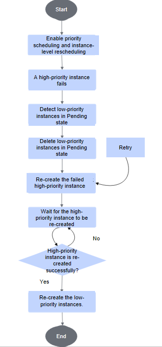

# Configuring Instance-Level Rescheduling for Inference Jobs

<!-- md-trans-meta sourceCommit=6f7a6aaf48adf808f43bcc175f4a532891d986e4 translatedAt=2026-09-01T08:02:30.431Z pushedAt=2026-09-01T08:03:28.196Z -->

When node, chip, or other faults occur in an Infer Operator inference job, the MindCluster cluster scheduling components can isolate the faulty resources and automatically perform instance-level rescheduling. For details about the fault detection principles, see [Fault Detection](../04_resumable_training/01_solutions_principles.md#fault-detection).

## Prerequisites

The Infer Operator service has been deployed. For details, see [Deploying an Infer Operator Job](./01_deploying_infer_operator_inference_job_with_vllm_proxy.md).

## Rescheduling Principles

When deploying instances of different roles, Infer Operator creates a Deployment/StatefulSet (the specific type depends on the workload configuration item) corresponding to each instance. When a fault occurs, the entire instance corresponding to the faulty Pod is rescheduled.

When priority scheduling is enabled and a high-priority instance fails, the low-priority instances in the Pending state are deleted first, and then the faulty high-priority instance is brought up again. After the high-priority instance is successfully brought up, the low-priority instances are brought up again, ensuring that resources are preferentially scheduled to high-priority instances. The specific process is shown in [Figure 1](#fig-priority-reschedule).

**Figure 1** Instance-level rescheduling flowchart with priority scheduling enabled

When adapting to other serving platforms (for example, MindIE PyMotor) to enable scaling down prefill to preserve decode, you need to enable both priority scheduling and instance-level rescheduling at the same time.

## Configuring Instance-Level Rescheduling

The following is an example of configuring instance-level rescheduling for an Infer Operator job. You need to modify the bolded configurations below. For descriptions of related configuration items, see [YAML Parameter Description](./01_deploying_infer_operator_inference_job_with_vllm_proxy.md#YAML-parameter-description).
<pre codetype="yaml">
apiVersion: mindcluster.huawei.com/v1
kind: InferServiceSet
metadata:
  name: "my-test"
  namespace: default
spec:
  replicas: 1 # Replica count of the inference service
  template:
    roles:
    - name: prefill # Prefill definition
      replicas: 1   # Prefill replica count
      workload:     # CRD type information of the instances in prefill
        apiVersion: apps/v1
        kind: StatefulSet # Workload type. Currently supported: StatefulSet/Deployment
      metadata:
        labels:
          infer.huawei.com/gang-schedule: 'false' # Disable gang scheduling. When enabled, a PodGroup is created for each workload instance.
      spec:
        replicas: 1 # Pod replica count of the workload in prefill
        podManagementPolicy: Parallel # This configuration is optional. When the workload is a StatefulSet and infer.huawei.com/gang-schedule is true, set it to Parallel.
        selector:
          matchLabels:
            app: test-prefill # User-defined. Must be consistent with the app configuration in the labels below.
        template:
          metadata:
            labels:
              app: test-prefill # User-defined. Must be consistent with the app configuration in the labels below.
              <strong>fault-scheduling: 'external-force' # Enable instance-level rescheduling</strong>
              fault-retry-times: '10'
              ring-controller.atlas: ascend-910b # Identifies the product type
            annotations:
              huawei.com/schedule_policy: chip8-node8 # Set based on the hardware form
          spec:
            schedulerName: volcano # Specify Volcano as the scheduler
            containers:
            - name: prefill
              image: vllm-ascend:xxx # Custom vLLM image name
              ...
              resources:
                requests:
                  huawei.com/Ascend910: 8
                limits:
                  huawei.com/Ascend910: 8
              ... # Necessary mount items and run commands for the supplementary container
    - name: decode  # Decode definition
      replicas: 1   # Decode replica count
      workload:     # CRD type information of the instances in decode
        apiVersion: apps/v1
        kind: StatefulSet # Workload type, currently supported: StatefulSet/Deployment
      metadata:
        labels:
          infer.huawei.com/gang-schedule: 'false' # Disable gang scheduling; when enabled, a PodGroup is created for each workload instance
      spec:
        replicas: 1 # Pod replica count of the workload in decode
        podManagementPolicy: Parallel # this configuration is optional; when the workload is a StatefulSet and infer.huawei.com/gang-schedule is true, it must be set to Parallel
        selector:
          matchLabels:
            app: test-decode # user-defined, must be consistent with the app configuration in the labels below
        template:
          metadata:
            labels:
              app: test-decode # user-defined, must be consistent with the app configuration in the labels below
              <strong>fault-scheduling: 'external-force' # enable instance-level rescheduling</strong>
              fault-retry-times: '10'
              ring-controller.atlas: ascend-910b # identify the product type
            annotations:
              huawei.com/schedule_policy: chip8-node8 # set based on the hardware form
          spec:
            schedulerName: volcano # specify the scheduler as Volcano
            containers:
            - name: decode
              image: vllm-ascend:xxx # custom vLLM image name
              ...
              resources:
                requests:
                  huawei.com/Ascend910: 8
                limits:
                  huawei.com/Ascend910: 8
              ... # add necessary mount items and run commands for the supplementary container
    - name: router  # router definition
      replicas: 1   # router replica count
      services:     # router services definition. The service defined here is created only once within a role.
      - name: vllm-router-service
        spec:
          ports:    # service port definition
          - port: 1026
            protocol: TCP
            targetPort: 1026
          selector:
            app: test-router # user-defined, must maintain configuration consistency with the app in labels below
          type: ClusterIP
      workload:     # CRD type information of the instance in router
        apiVersion: apps/v1
        kind: Deployment # workload type, currently supported: StatefulSet/Deployment
      spec:
        replicas: 1 # pod replica count of the workload in router
        selector:
          matchLabels:
            app: test-router # user-defined, must maintain configuration consistency with the app in labels below
        template:
          metadata:
            labels:
              app: test-router # user-defined, must maintain configuration consistency with the app in labels below
          spec:
            schedulerName: volcano # specify the scheduler as Volcano
            containers:
            - name: router
              image: xxx:yyy # custom image name
              ... # add necessary mount items and run commands for the supplementary container
</pre>
