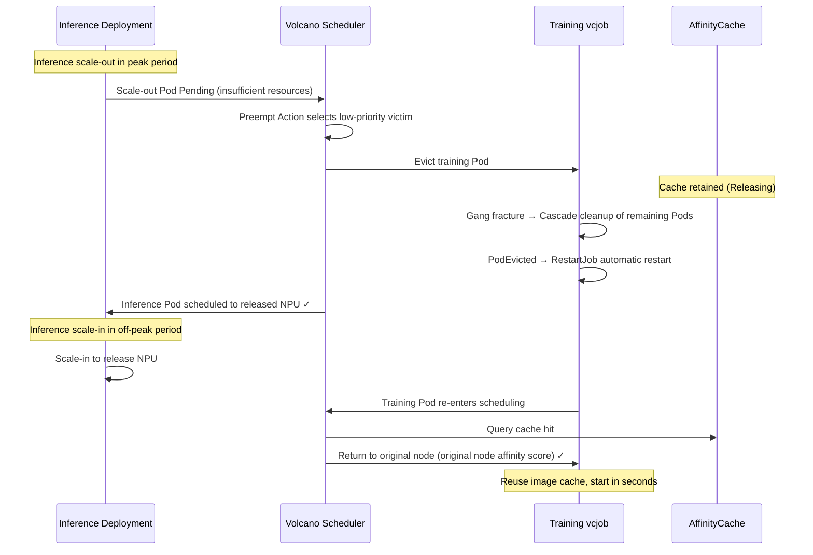

# Preempt-based Tidal Scheduling for Inference/Training Jobs<a name="ZH-CN_TOPIC_000000_preempt_alternation"></a>

<!-- md-trans-meta sourceCommit=cd1b1f6db3dd6679ea1d2324ac11637806933eae translatedAt=2026-08-27T10:56:17.674Z pushedAt=2026-08-27T10:56:40.866Z -->

## Overview<a name="section_overview_preempt"></a>

Preempt is a core mechanism of the Volcano scheduler: when a high-priority job cannot find sufficient resources, the scheduler selects a victim from low-priority jobs and evicts the Pods it occupies to release resources.

In a shared inference/training cluster, inference jobs use high priority while training jobs use low priority. When inference services need to scale out during peak hours, NPU resources are automatically preempted from training jobs; when inference services scale in during off-peak hours, the released NPU resources are returned to training jobs. Training jobs configure `minAvailable` equal to `replicas` to ensure gang integrity. After a Pod is preempted and the job fails, the rescheduling module automatically triggers a job restart, and the rebuilt Pods return to their original nodes through the return-to-original-node feature, restoring training within seconds.

## Implementation Principle<a name="section_principle_preempt"></a>



## Procedure<a name="section_steps_preempt"></a>

1. Create a `PriorityClass`. For detailed descriptions of `PriorityClass`-related fields, see the [official Kubernetes website](https://kubernetes.io/docs/concepts/scheduling-eviction/pod-priority-preemption/).

   ```yaml
   # Inference job: high priority, can preempt low-priority resources
   apiVersion: scheduling.k8s.io/v1
   kind: PriorityClass
   metadata:
     name: inference-high
   value: 1000
   preemptionPolicy: PreemptLowerPriority
   globalDefault: false
   description: "Inference job has high priority"

   ---
   # Training job: low priority, can be preempted
   apiVersion: scheduling.k8s.io/v1
   kind: PriorityClass
   metadata:
     name: training-low
   value: 100
   globalDefault: false
   preemptionPolicy: Never
   description: "Training job has low priority and can be preempted"
   ```

2. Modify Scheduler Tier.

   Modify the ConfigMap (`volcano-scheduler-configmap`) of the Volcano scheduler, remove the `enqueue` action, add the `preempt` action, and configure the `gang` plugin to bypass gang protection:

   ```yaml
   data:
     volcano-scheduler.conf: |
       actions: "allocate, preempt, backfill"   # Remove the enqueue action and add the preempt action.
       tiers:
       - plugins:
         - name: priority
           enableNodeOrder: false
         - name: gang
           enableNodeOrder: false
           enablePreemptable: false      # Bypass gang protection to allow preempting any training Pod.
         - name: conformance
           enableNodeOrder: false
         - name: volcano-npu_v26.1.0_linux-x86_64
       - plugins:
         - name: drf
           enableNodeOrder: false
         - name: predicates
           enableNodeOrder: false
         - name: proportion
           enableNodeOrder: false
         - name: nodeorder
         - name: binpack
           enableNodeOrder: false
       configurations:
         - name: init-params
           arguments: {"grace-over-time":"900","presetVirtualDevice":"true","nslb-version":"1.0","shared-tor-num":"2",
       "useClusterInfoManager":"true","self-maintain-available-card":"true","super-pod-size": "48", "reserve-nodes": "2",
       "forceEnqueue": "true", "prefer-previous-node": "true"}
   ```

3. Deploy the training job.

   ```yaml
   apiVersion: batch.volcano.sh/v1alpha1
   kind: Job
   metadata:
     name: train-job
     labels:
       fault-scheduling: grace        # Graceful rescheduling: automatically clean up and restart the Job when a Pod fails.
     annotations:
       huawei.com/schedule_policy: chip4-node8
   spec:
     queue: default
     schedulerName: volcano
     priorityClassName: training-low
     minAvailable: 2                  # Equal to replicas to ensure gang integrity.
     policies:
     - event: PodEvicted
       action: RestartJob
     tasks:
     - replicas: 2
       name: test
       template:
         spec:
           containers:
           - name: training
             image: ubuntu:22.04
             command:
             - /bin/bash
             - -c
             - sleep inf
             resources:
               limits:
                 huawei.com/Ascend910: 8
               requests:
                 huawei.com/Ascend910: 8
   ```

   Run the following command to deploy the training job and view the node corresponding to `rankIndex`:

   ```bash
   kubectl apply -f train-job.yaml
   kubectl get pods -l volcano.sh/job-name=train-job -o wide
   kubectl describe pod -l volcano.sh/job-name=train-job | grep hccl/rankIndex
   ```

   >[!NOTE]
   >Under the Preempt scheme, `minAvailable` equals `replicas` (required by gang scheduling). With `gang.enablePreemptable: false` bypassing gang protection, training Pods can still be preempted. After preemption, the number of training job Pods falls below `minAvailable`, and training usually cannot continue. For the vcjob scenario, you can add policies (event: `PodEvicted`, action: `RestartJob`) in the YAML to trigger cascade cleanup of the remaining Pods and restart the Job. For the acjob scenario, you can add the `fault-retry-times` and `fault-scheduling` labels to trigger the rescheduling module to automatically perform cascade cleanup of the remaining Pods. The rebuilt Pods preferentially return to their original nodes through the return-to-original-node feature.

4. Deploy the inference job.

   ```yaml
   apiVersion: apps/v1
   kind: Deployment
   metadata:
     name: inference-deploy
     labels:
       app: inference
   spec:
     replicas: 1                    # Number of inference replicas, which can be scaled up or down based on traffic.
     selector:
       matchLabels:
         app: inference
     template:
       metadata:
         labels:
           app: inference
         annotations:
           huawei.com/schedule_policy: chip4-node8
           huawei.com/schedule_minAvailable: "1"      # Minimum number of replicas for job scheduling. Since the pods of this inference job have no strong dependencies on each other, this value can be set to 1.
       spec:
         schedulerName: volcano
         priorityClassName: inference-high
         containers:
         - name: inference
           image: ubuntu:22.04
           command:
           - /bin/bash
           - -c
           - sleep inf
           resources:
             limits:
               huawei.com/Ascend910: 8
             requests:
               huawei.com/Ascend910: 8
   ```

   Run the following command to deploy the inference job:

   ```bash
   kubectl apply -f inference-deploy.yaml
   kubectl get pods -l app=inference -o wide
   ```

5. Trigger job alternation.

   **Scale out during inference peak hours (trigger Preempt to preempt training resources). If the cluster currently has no extra nodes, eviction is triggered directly without scaling out:**

   ```bash
   kubectl scale deployment inference-deploy --replicas=2
   ```

   Observe the preemption process:

   ```bash
   # Observe the status changes of inference Pods.
   kubectl get pods -l app=inference -w

   # Observe the eviction of training Pods.
   kubectl get pods -l volcano.sh/job-name=train-job -w
   ```

   Expected result: After the new inference Pod enters `Pending`, the training Pod is evicted, and the inference Pod is scheduled to the released NPU. The training Job triggers the `PodEvicted→RestartJob` policy, performs cascade cleanup of the remaining Pods, and then restarts automatically, entering Pending to wait for resources.

   **Scale-in during inference off-peak hours (release NPUs to the training job):**

   ```bash
   kubectl scale deployment inference-deploy --replicas=0
   ```

6. Verify return to the original node.

   1. View the node where the training Pod is rescheduled:

      ```bash
      kubectl get pods -l volcano.sh/job-name=train-job -o wide
      kubectl describe pod -l volcano.sh/job-name=train-job | grep hccl/rankIndex
      ```

   2. View the scheduler logs to confirm that the score boost takes effect:

      ```bash
      kubectl logs -n volcano-system <volcano-scheduler-pod> | grep "addPreferPreviousNodeScore"
      # Output example:
      # addPreferPreviousNodeScore: task=train-job-test-0 rank=0 boosted selfNode=node-gpu-05 score=100000100
      ```

The node where the training Pod is recreated should be the same as or highly consistent with the node before eviction. You can also continue to scale out the inference job again to check whether the scaled-out Pod returns to the original node for execution.
