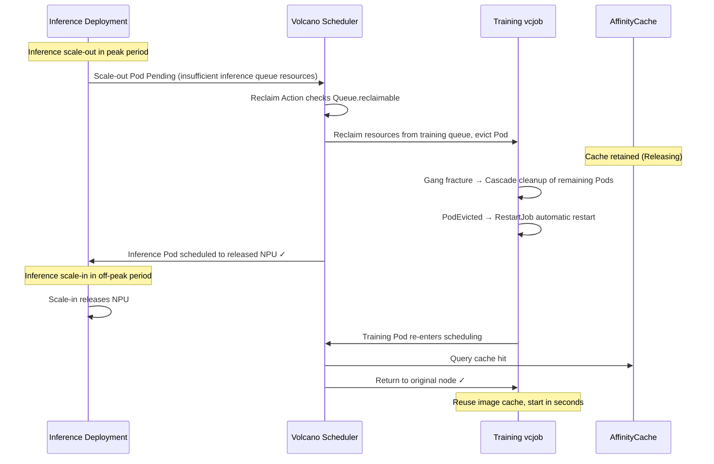

# Tidal Scheduling of Inference/Training Jobs Based on Reclaim<a name="ZH-CN_TOPIC_000000_reclaim_alternation"></a>

<!-- md-trans-meta sourceCommit=cd1b1f6db3dd6679ea1d2324ac11637806933eae translatedAt=2026-08-27T10:56:13.732Z pushedAt=2026-08-27T10:56:40.864Z -->

## Overview<a name="section_overview_reclaim"></a>

Reclaim is the resource return mechanism of the Volcano scheduler: when a high-weight queue runs short of resources, resources are reclaimed from low-weight queues with `reclaimable: true`. Unlike Preempt, which is based on job priority, Reclaim is based on queue weight, making it suitable for managing resource priorities by service line.

In an inference/training shared cluster, the training queue is set to `reclaimable: true` (reclaimable), while the inference queue is set to `reclaimable: false`. When the inference queue runs short of resources, resources are reclaimed from the training queue; after resources are released during the inference off-peak period, training jobs resume running. A training job sets `minAvailable` equal to `replicas` to ensure gang integrity. After a Pod is reclaimed and the Job fails, the rescheduling module automatically triggers a Job restart, and the rebuilt Pod returns to its original node through the return-to-original-node feature.

## Implementation Principle<a name="section_principle_reclaim"></a>



## Procedure<a name="section_steps_reclaim"></a>

1. Create a Queue.

   ```yaml
   # Inference queue: high weight, cannot be reclaimed by other queues
   apiVersion: scheduling.volcano.sh/v1beta1
   kind: Queue
   metadata:
     name: inference
   spec:
     weight: 1
     reclaimable: false              # Inference queue resources cannot be reclaimed

   ---
   # Training queue: low weight, can be reclaimed by higher-weight queues (exists by default in the cluster and does not need to be deployed separately)
   apiVersion: scheduling.volcano.sh/v1beta1
   kind: Queue
   metadata:
     name: default
   spec:
     weight: 1
     reclaimable: true               # Training queue resources can be reclaimed.
   ```

2. Modify Scheduler Tier.

   Modify the ConfigMap (`volcano-scheduler-configmap`) of the Volcano scheduler, delete the `enqueue` action, add the `reclaim` action, and configure the `gang` plugin to bypass gang protection:

   ```yaml
   data:
     volcano-scheduler.conf: |
       actions: "allocate, reclaim, backfill"  # Delete the enqueue action and add the reclaim action.
       tiers:
       - plugins:
         - name: priority
           enableNodeOrder: false
         - name: gang
           enableNodeOrder: false
           enableReclaimable: false       # Bypass gang protection to allow reclaiming any training Pod, for example, the Pod of a training task.
         - name: conformance
           enableNodeOrder: false
         - name: volcano-npu_v26.1.0_linux-x86_64
       - plugins:
         - name: drf
           enableNodeOrder: false
         - name: predicates
           enableNodeOrder: false
         - name: proportion
           enableNodeOrder: false
         - name: nodeorder
         - name: binpack
           enableNodeOrder: false
       configurations:
         - name: init-params
           arguments: {"grace-over-time":"900","presetVirtualDevice":"true","nslb-version":"1.0","shared-tor-num":"2",
       "useClusterInfoManager":"true","self-maintain-available-card":"true","super-pod-size": "48", "reserve-nodes": "2",
       "forceEnqueue": "true", "prefer-previous-node": "true"}
   ```

3. Deploy the training job.

   ```yaml
   apiVersion: batch.volcano.sh/v1alpha1
   kind: Job
   metadata:
     name: train-job
     annotations:
       huawei.com/schedule_policy: chip4-node8
   spec:
     queue: default
     schedulerName: volcano
     policies:
     - event: PodEvicted              # When a pod is evicted, all other pods of the job are deleted and restarted.
       action: RestartJob
     minAvailable: 2                  # Equal to replicas, ensuring gang integrity.
     tasks:
     - replicas: 2
       name: test
       template:
         spec:
           containers:
           - name: training
             image: ubuntu:22.04
             command:
             - /bin/bash
             - -c
             - sleep inf
             resources:
               limits:
                 huawei.com/Ascend910: 8
               requests:
                 huawei.com/Ascend910: 8
   ```

   Run the following command to deploy the training job:

   ```bash
   kubectl apply -f train-job.yaml
   kubectl get pods -l volcano.sh/job-name=train-job -o wide
   kubectl describe pod -l volcano.sh/job-name=train-job | grep hccl/rankIndex
   ```

   >[!NOTE]
   >Under the Reclaim scheme, the training queue with `reclaimable: true` + `gang.enableReclaimable: false` allows pods to be evicted by bypassing gang protection during reclaim. After being reclaimed, the number of pods of the training job falls below `minAvailable`, and the job usually cannot continue training. For the vcjob scenario, you can add policies (event: `PodEvicted`, action: `RestartJob`) in the YAML to trigger cascading cleanup of the remaining pods and restart the Job. For the acjob scenario, you can add the `fault-retry-times` and `fault-scheduling` labels to trigger the rescheduling module to automatically clean up the remaining pods in a cascading manner. The rebuilt pods preferentially return to the original nodes through the return-to-original-node feature.

4. Deploy the inference job.

   ```yaml
   apiVersion: apps/v1
   kind: Deployment
   metadata:
     name: inference-deploy
     labels:
       app: inference
   spec:
     replicas: 1                    # Number of inference replicas, which can be scaled up or down based on traffic
     selector:
       matchLabels:
         app: inference
     template:
       metadata:
         labels:
           app: inference
         annotations:
           huawei.com/schedule_policy: chip4-node8
           huawei.com/schedule_minAvailable: "1"
           scheduling.volcano.sh/queue-name: inference   # The job must be specified as belonging to the inference queue
       spec:
         schedulerName: volcano
         containers:
         - name: inference
           image: ubuntu:22.04
           command:
           - /bin/bash
           - -c
           - sleep inf
           resources:
             limits:
               huawei.com/Ascend910: 8
             requests:
               huawei.com/Ascend910: 8
   ```

   Run the following commands to deploy the inference job and view the nodes corresponding to `rankIndex`:

   ```bash
   kubectl apply -f inference-deploy.yaml
   kubectl get pods -l app=inference -o wide
   kubectl describe pod -l volcano.sh/job-name=train-job | grep hccl/rankIndex
   ```

5. Trigger job alternation.

   **Scale-out during inference peak hours (trigger Reclaim to reclaim training resources). If the cluster currently has no extra nodes, eviction is directly triggered without the need for scale-out:**

   ```bash
   kubectl scale deployment inference-deploy --replicas=2
   ```

   Observe the reclaim process:

   ```bash
   # Observe the status changes of inference Pods.
   kubectl get pods -l app=inference -w

   # Observe that training Pods are evicted.
   kubectl get pods -l volcano.sh/job-name=train-job -w
   ```

   Expected result: After the new inference Pod enters the `Pending` state, the scheduler reclaims resources from the training queue, the training Pods are evicted, and the inference Pod is scheduled to the released NPU. The training job triggers the `PodEvicted→RestartJob` policy, cascades the cleanup of the remaining Pods, and then automatically restarts, entering the Pending state to wait for resources.

   **Scale-in during inference off-peak hours (release NPUs to training jobs):**

   ```bash
   kubectl scale deployment inference-deploy --replicas=0
   ```

6. Verify that the pod returns to the original node.

   1. Check the node where the training pod is rescheduled:

      ```bash
      kubectl get pods -l volcano.sh/job-name=train-job -o wide
      kubectl describe pod -l volcano.sh/job-name=train-job | grep hccl/rankIndex
      ```

   2. Check the scheduler logs to confirm that the scoring takes effect:

      ```bash
      kubectl logs -n volcano-system <volcano-scheduler-pod> | grep "addPreferPreviousNodeScore"
      # Output example:
      # addPreferPreviousNodeScore: task=train-job-test-0 rank=0 boosted selfNode=node-gpu-05 score=100000100
      ```

After the training Pod is rebuilt, the node where it resides should be the same as or highly consistent with the node before eviction.
