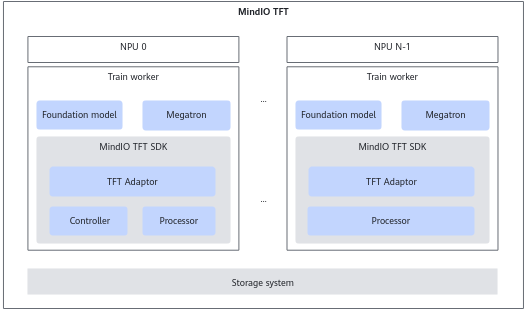

# Overview

<!-- md-trans-meta sourceCommit=unknown translatedAt=2026-06-09T06:23:44.833Z pushedAt=2026-06-09T07:15:15.698Z -->

## Product Introduction

MindCluster MindIO Training Fault Tolerance ( MindIO TFT) includes features such as dying gasp checkpoint saving, process-level online recovery, and process-level rescheduling.

- MindCluster MindIO Try To Persist (MindIO TTP) is designed to accelerate fault recovery during large model training. When a fault occurs during training, it verifies the integrity and consistency of intermediate state data, generates an dying gasp checkpoint, and uses this checkpoint to resume training, thereby reducing the loss of training iterations caused by the fault.
- MindCluster MindIO Uncorrectable Memory Error (MindIO UCE) is designed for UCE detection in on-chip memory during large model training and performs online repair to achieve step-level recomputation.
- MindCluster MindIO Air Refuelling (MindIO ARF): When a training anomaly occurs, there is no need to restart the entire cluster. Instead, restart or replace only the affected nodes. For some faults, only a single process needs to be restarted in place to complete the repair and continue training.

## Benefits

LLMs are currently a focal point of competition in the global technology industry. Training an LLM often takes tens of days or even months. Checkpoints are critical for resuming training after an interruption. During checkpointing, training tasks across the entire cluster are paused. To maximize cluster utilization, checkpoint intervals are often set relatively long—sometimes up to several hours. As a result, if a training job fails just before a scheduled checkpoint is about to be generated, and the checkpoint data is not successfully created, recovery can only be performed from the previous checkpoint. The training iterations between the last successful checkpoint and the point of failure must be recomputed, resulting in significant loss. The MindIO TTP feature generates a checkpoint immediately after a fault occurs, allowing recovery to the exact state just before the failure, thereby reducing iteration loss.

Additionally, for LLM training, the time required to save and load checkpoint data for each iteration is similarly long, comparable to the periodic checkpoint save and load time. MindIO UCE provides online repair. When a UCE fault occurs on an NPU, it first performs fault cleanup, recovery, and data rollback to resume training and restore the state just before the failure, minimizing training stop/restart time. If repair fails, it falls back to the TTP process as a safeguard.

## MindIO TFT Architecture

All functions of MindIO TFT are integrated into a single whl package for external use. Adaptation to large model frameworks such as MindSpeed-LLM and use of the corresponding functions require importing modules.

The key points of MindIO TFT are as follows:

- MindIO TTP
    - Through the Controller and Processor modules, the model training status is detected and periodically reported to the Controller module via heartbeat. Once a fault is detected, dying gasp checkpoint saving is initiated.
    - In large model training, the industry typically uses long intervals between periodic checkpoint saving. If a failure occurs a long time after the last checkpoint saving but before the next scheduled saving, restarting training from the last checkpoint would consume significant time and resources. MindIO TTP provides a near-zero-loss training resumption scheme, allowing training to restart from the exact point of the last failure.

- MindIO UCE
    - Once a UCE is detected, online repair begins immediately.
    - In large model training, whether using periodic checkpoint saving or MindIO TFT's dying gasp checkpoint saving, the cost of retraining is substantial. This feature provides step-level recomputation capability within the training framework, eliminating the need to restart processes while ensuring minimal iteration loss during training resumption. If it fails, the process falls back to the TTP flow.

- MindIO ARF
    - For a wider range of faults, the model does not need to stop training; repair and training resumption can be completed simply by restarting or replacing a failed node.
    - For abnormal service process faults or chip faults at the `RestartRequest` and `RestartBusiness` levels, the process-level in-place recovery function can be used to restart only the faulty process to complete repair and training resumption.

## Logical Model

- Controller module: Responsible for coordinating distributed tasks. It maintains an internal state machine that supports process control for different scenarios. It collects training status from each training process in real time. When a training anomaly occurs, it triggers the state machine based on the anomaly type and sends the corresponding actions to the Processor module for execution.
- Processor module: Responsible for interacting with the training framework, obtaining training status from training processes, and reporting it to the Controller. It also executes the actions issued by the Controller module.
- Adaptor module: Responsible for adapting the training framework to the MindIO TTP, MindIO UCE, and MindIO ARF features. Currently, MindIO TFT has completed adaptation for the [MindSpeed-LLM](./03_usage_guidance.md) training framework. For other training frameworks, refer to the reference implementation.

## **Deployment Form**

- Controller module: In the entire training cluster, only one Active Controller is supported. It is recommended to deploy it on cluster node 0. Up to two Backup Controllers are automatically started.
- Processor module: In the entire training cluster, a Processor must be started for each training process.
