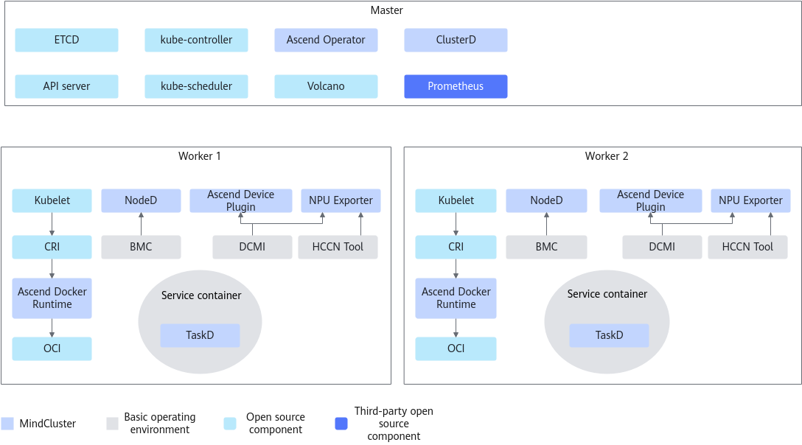

# Before You Start 

<!-- md-trans-meta sourceCommit=unknown translatedAt=2026-06-09T02:15:13.036Z pushedAt=2026-06-09T06:22:06.880Z -->

Before installing the components, you must read [Introduction](../introduction/00_overview.md) carefully to understand the detailed functions of each cluster scheduling component, and select the corresponding components to install based on the features you intend to use.

The Elastic Agent, TaskD, and MindIO components must be deployed in containers. For detailed installation steps, see [Creating an Image](../usage/resumable_training/07_using_resumable_training_on_the_cli.md).

> **NOTE**
> The Resilience Controller and Elastic Agent components have been deprecated. Content related to Resilience Controller will be removed in the version released on September 30, 2026; content related to Elastic Agent will be removed in the version released on December 30, 2026.

## Constraints 

- Ensure that the root directory has sufficient disk space. If the disk space utilization of the root directory exceeds 85%, the kubelet resource eviction mechanism will be triggered, causing service unavailability. For disk space requirements, see [Table 1](./01_environment_dependencies.md#software-and-hardware-specifications); for eviction policies, see the [Kubernetes official documentation](https://kubernetes.io/docs/concepts/scheduling-eviction/node-pressure-eviction/).
- To ensure the normal installation and use of MindCluster cluster scheduling components, keep the system time consistent across different training servers within the same cluster.
- Cluster scheduling component images used for Arm architecture and x86_64 architecture are not compatible.
- The default certificate validity period for K8s is 365 days. Users need to renew the certificates before they expire.

## Component Deployment Description

When installing and deploying cluster scheduling components, you can refer to [Figure 1](#fig87391254145620) to install the corresponding components or other third-party software on the corresponding nodes. Most components are deployed using images; Ascend Docker Runtime and Container Manager are deployed using binaries; only NPU Exporter can be deployed using either images or binaries.

**Figure 1**  Component installation and deployment in the K8s environment

> **NOTE**
>
>MindCluster provides Volcano, which integrates the Ascend-volcano-plugin on top of the open-source Volcano.

## Log Path Description

- The Ascend Docker Runtime log path is `/var/log/ascend-docker-runtime/`.
- For log paths of other cluster scheduling components, see [Creating Log Directories](../developer_guide/installation_deployment/manual_installation/01_preparing_for_installation.md).
