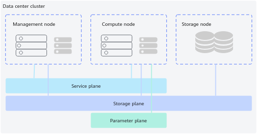

# Environment Dependencies

<!-- md-trans-meta sourceCommit=unknown translatedAt=2026-06-09T02:16:40.203Z pushedAt=2026-06-09T06:22:06.966Z -->

## Software Dependencies

**Ascend Docker Runtime**

- The Docker version in the current environment must be 18.09 and later.
- The host machine must have the drivers and firmware installed. For details, see "Installing the NPU Driver and Firmware" in the [CANN Software Installation Guide (Commercial)](https://www.hiascend.com/document/detail/en/canncommercial/900/softwareinst/instg/instg_0005.html?Mode=PmIns&InstallType=local&OS=Debian) or "Installing the NPU Driver and Firmware" in the [CANN Software Installation Guide (Community)](https://www.hiascend.com/document/detail/zh/CANNCommunityEdition/900/softwareinst/instg/instg_0005.html?Mode=PmIns&InstallType=local&OS=openEuler).
- For Atlas 500 A2 intelligent station, installing Ascend Docker Runtime requires modifying the Docker configuration. Run the **vi /etc/sysconfig/docker** command to delete the `--config-file=""` parameter, and run **systemctl restart docker** to make the configuration take effect.
- The MEF service pre-installed on the Atlas 500 A2 intelligent station performs security hardening on Docker. Ascend Docker Runtime does not support running in a security-hardened Docker environment. If you need to use Ascend Docker Runtime, manually uninstall the MEF service by referring to the "Uninstalling MEF Edge" in the [MindEdge Framework User Guide](https://gitcode.com/Ascend/MEF/blob/master/docs/zh/user_guide/installation_guide.md#%E5%8D%B8%E8%BD%BDmef-edge).

    >[!NOTE]
    >
    >Run the **systemctl status docker** command. If the returned information contains the `/docker_entrypoint.sh` field, Docker has been security-hardened by the MEF service.

**Other Cluster Scheduling Components**

The dependencies for the Arm architecture and x86_64 architecture are different. The cluster scheduling components support both IPv4 and IPv6, and use IPv4 by default.

**Table 1** Software environment

|Software |Supported Version|Installation Path|Description|
|--|--|--|--|
|Kubernetes|1.17.x~1.34.x (1.19.x and later versions are recommended)<ul><li>It is recommended to select the latest bugfix version.</li><li>If you need to install the Volcano component, install Kubernetes 1.19.x or later. For specific Kubernetes versions, see [the corresponding Kubernetes version on the Volcano official website](https://github.com/volcano-sh/volcano/blob/master/README.md#kubernetes-compatibility).</li></ul>|All nodes|For details about using K8s, see [Kubernetes Documentation](https://kubernetes.io/docs/).|
|(Optional) Docker|18.09.x~28.5.1|All nodes|It can be obtained from the [Docker community or official website](https://docs.docker.com/engine/install/). The Docker version used must be compatible with Kubernetes. For compatibility details, refer to the Kubernetes [release notes](https://github.com/kubernetes/kubernetes/tree/master/CHANGELOG) or obtain information from the Kubernetes community. It is recommended to select the latest bugfix version.|
|(Optional) Containerd|1.4.x~2.1.4 (1.6.x is recommended)|All nodes|It can be obtained from the Containerd [official website](https://containerd.io/downloads/) or [community](https://github.com/containerd/containerd/blob/main/docs/getting-started.md#installing-containerd). It is recommended to select the latest bugfix version. Pay attention to the [CRI version](https://kubernetes.io/docs/setup/production-environment/container-runtimes/#cri-versions) used with Kubernetes.|
|Ascend AI Processor Drivers and Firmware|See the [Version Compatibility Table](https://support.huawei.com/enterprise/en/ascend-computing/ascend-training-solution-pid-258915853/software) (training) or [Version Compatibility Table](https://support.huawei.com/enterprise/en/ascend-computing/ascend-inference-solution-pid-258915651/software) (inference). Select the drivers and firmware compatible with MindCluster based on the actual hardware device model.|Compute node|See the [Driver and Firmware Installation and Upgrade Guide](https://support.huawei.com/enterprise/en/ascend-computing/ascend-hdk-pid-252764743) for each hardware product for corresponding instructions.
**NOTE**

To ensure that NPU Exporter can be installed by a non-root user (such as hwMindX) when deployed as a binary, use the --install-for-all parameter during driver installation. An example is as follows.
<pre class="screen">./Ascend-hdk-&lt;chip_type&gt;-npu-driver_&lt;version&gt;_linux-&lt;arch&gt;.run --full --install-for-all</pre>

|
|(Optional) CANN|If only the cluster scheduling component is installed, CANN is not required. Users can choose to install the required CANN software package based on actual needs. See the version compatibility table to install the corresponding software package.|Compute node or inside training/inference containers|To install the CANN software package on the host, see [CANN Software Installation Guide (Commercial)](https://www.hiascend.com/document/detail/en/canncommercial/900/softwareinst/instg/instg_0000.html?Mode=PmIns&InstallType=netconda&OS=openEuler) or [CANN Software Installation Guide (Community)](https://www.hiascend.com/document/detail/zh/CANNCommunityEdition/900/softwareinst/instg/instg_0000.html?Mode=PmIns&InstallType=netconda&OS=openEuler).
**NOTE**
If the soft partitioning virtualization function is used, CANN must be installed, and the compatible CANN version is 8.5.0. For details, see [vCANN-RT](https://gitcode.com/openeuler/ubs-virt/blob/master/ubs-virt-enpu/vcann-rt/README.md).

|
|Python|3.8~3.12|Inside training or inference containers|When using Python, the version should be based on the specific AI framework.|

>**NOTE**
>
>- Choose to install Docker or Containerd based on the actual service scenario.
>- For installing the operating system on Atlas servers, see the [Installation Guide (Arm)](https://support.huawei.com/enterprise/en/ascend-computing/a800-9000-pid-250702818?category=installation-upgrade&subcategory=software-deployment-guide) and [Installation Guide (x86_64)](https://support.huawei.com/enterprise/en/ascend-computing/a800-9010-pid-250702809?category=installation-upgrade&subcategory=software-deployment-guide). The installation guides do not cover all the operating systems mentioned above and are for reference only.
>- Atlas A2 training series products have different operating system requirements in virtual machine scenarios. For specific operating system constraints, see the "[Installation and Uninstallation on Virtual Machines](https://support.huawei.com/enterprise/en/doc/EDOC1100568434/cb91d9dc)" section in the *Atlas A2 Center Inference and Training Hardware 26.0.RC1 NPU Driver and Firmware Installation Guide*.

## Networking Requirements

Since Volcano, the core scheduling component for cluster scheduling, is currently deployed on the management node of K8s, the following recommendations are made for deploying the management node based on K8s deployment requirements to ensure service health and stability. Customers can make adjustments based on their own service characteristics.

- Management nodes should be separated from compute nodes and storage nodes. It is recommended to use a dedicated server for deployment.
- If the cluster is large in scale or has high requirements for service reliability, multiple management nodes are required.

**Deployment Logic Diagram**

**Figure 1**  Deployment logic diagram

The node types in a data center cluster are generally classified into the following three types:

- Management node (Master node): Manages the cluster and is responsible for distributing training and inference jobs to each compute node for execution. Cluster scheduling components associated with the master node can be installed.
- Compute node (Worker node): Executes training and inference jobs. Cluster scheduling components associated with the worker node can be installed.
- Storage node: stores data such as datasets and models output from training.

Users need to divide the network planes into:

- Service plane: Used for K8s cluster service management.
- Storage plane: Used to read training datasets from storage nodes. Because there are certain bandwidth requirements, it is recommended to use a separate network plane and network port to connect training nodes (management nodes or compute nodes) with storage nodes.
- Parameter plane: Used for parameter exchange between training nodes during distributed training. Refer to the following networking instructions.
    - [*Ascend Training Solution Networking Guide*](https://support.huawei.com/enterprise/en/doc/EDOC1100302398/3a822881): Provides instructions on building networks for Huawei training computing devices (including Atlas 800 training servers, Atlas 900 PoD (model 9000), etc.).
    - [*Ascend Training Solution Networking Guide (Atlas A2 Training Products)*](https://support.huawei.com/enterprise/en/doc/EDOC1100570094/549e2956): Provides instructions on building networks for Huawei training computing devices (including Atlas 800T A2 training servers, Atlas 900 A2 PoD cluster basic units, and training servers integrated with the Atlas 200T A2 Box16 heterogeneous subrack).

## Software and Hardware Specifications

**Operating System Disk Partition**

The recommended operating system disk partition is shown in [Table 2](#table147711423499).

**Table 2**  Disk space planning

|Partition|Description|Size|Boot Flag|
|--|--|--|--|
|/boot|Boot partition.|500 MB|on|
|/var|Partition for storing data generated during software operation, such as logs and caches.|> 300 GB|off|
|/var/lib/docker|Partition for storing Docker images and containers.
[!NOTE] Note:
Docker images and containers are stored in the /var/lib/docker partition by default. If the usage of the /var/lib/docker partition exceeds 85%, K8s will trigger the resource eviction mechanism. Ensure that the usage of the /var/lib/docker partition remains below 85% during use.

|> 300 GB|off|
|/etc/mindx-dl|This partition stores imported certificates, KubeConfig, and other files. It is recommended to configure 100 MB, which can be adjusted based on actual conditions.|100 MB|off|
|/|Main partition.|> 300 GB|off|

**Hardware Specifications**

The hardware must meet the following requirements:

**Table 2** Resource requirements

|Name|Requirement|
|--|--|
|CPU|Management node CPU > 32 cores|
|Memory|Management node memory > 64 GB|
|Disk space|> 1 TB. For disk space planning, see [Table 1](#table147711423499)|
|Network|<ul><li>Out-of-band management (BMC): ≥ 1 Gbit/s</li><li>In-band management (SSH): ≥ 1 Gbit/s</li><li>Service plane: ≥ 10 Gbit/s</li><li>Storage plane: ≥ 25 Gbit/s</li><li>Parameter plane: 100 Gbit/s or 200 Gbit/s</li></ul>|

**Cluster Scheduling Component Resource Configuration Requirements**

The cluster scheduling component resource configuration must meet the following requirements:

**Table 3** Resource configuration requirements for components installed on management nodes

<table><thead align="left"><tr id="row13594171755810"><th class="cellrowborder" rowspan="2" valign="top" id="mcps1.2.8.1.1">
Component

</th>
<th class="cellrowborder" colspan="2" valign="top" id="mcps1.2.8.1.2">
Up to 100 Nodes

</th>
<th class="cellrowborder" colspan="2" valign="top" id="mcps1.2.8.1.3">
500 Nodes

</th>
<th class="cellrowborder" colspan="2" valign="top" id="mcps1.2.8.1.4">
1,000 Nodes

</th>
</tr>
<tr id="row124371832162218"><th class="cellrowborder" valign="top" id="mcps1.2.8.2.1">
CPU (Unit: Core)

</th>
<th class="cellrowborder" valign="top" id="mcps1.2.8.2.2">
Memory (Unit: GB)

</th>
<th class="cellrowborder" valign="top" id="mcps1.2.8.2.3">
CPU (Unit: Core)

</th>
<th class="cellrowborder" valign="top" id="mcps1.2.8.2.4">
Memory (Unit: GB)

</th>
<th class="cellrowborder" valign="top" id="mcps1.2.8.2.5">
CPU (Unit: Core)

</th>
<th class="cellrowborder" valign="top" id="mcps1.2.8.2.6">
Memory (Unit: GB)

</th>
</tr>
</thead>
<tbody><tr id="row10594191713589"><td class="cellrowborder" valign="top" width="14.34%" headers="mcps1.2.8.1.1 mcps1.2.8.2.1 ">
Volcano Scheduler

</td>
<td class="cellrowborder" valign="top" width="14.729999999999999%" headers="mcps1.2.8.1.2 mcps1.2.8.2.2 ">
2.5

</td>
<td class="cellrowborder" valign="top" width="14.05%" headers="mcps1.2.8.1.2 mcps1.2.8.2.3 ">
2.5

</td>
<td class="cellrowborder" valign="top" width="14.549999999999999%" headers="mcps1.2.8.1.3 mcps1.2.8.2.4 ">
4

</td>
<td class="cellrowborder" valign="top" width="13.780000000000001%" headers="mcps1.2.8.1.3 mcps1.2.8.2.5 ">
5

</td>
<td class="cellrowborder" valign="top" width="14.549999999999999%" headers="mcps1.2.8.1.4 mcps1.2.8.2.6 ">
5.5

</td>
<td class="cellrowborder" valign="top" width="14.000000000000002%" headers="mcps1.2.8.1.4 ">
8

</td>
</tr>
<tr id="row859401719586"><td class="cellrowborder" valign="top" width="14.34%" headers="mcps1.2.8.1.1 mcps1.2.8.2.1 ">
Volcano Controller

</td>
<td class="cellrowborder" valign="top" width="14.729999999999999%" headers="mcps1.2.8.1.2 mcps1.2.8.2.2 ">
2

</td>
<td class="cellrowborder" valign="top" width="14.05%" headers="mcps1.2.8.1.2 mcps1.2.8.2.3 ">
2.5

</td>
<td class="cellrowborder" valign="top" width="14.549999999999999%" headers="mcps1.2.8.1.3 mcps1.2.8.2.4 ">
2

</td>
<td class="cellrowborder" valign="top" width="13.780000000000001%" headers="mcps1.2.8.1.3 mcps1.2.8.2.5 ">
3

</td>
<td class="cellrowborder" valign="top" width="14.549999999999999%" headers="mcps1.2.8.1.4 mcps1.2.8.2.6 ">
2.5

</td>
<td class="cellrowborder" valign="top" width="14.000000000000002%" headers="mcps1.2.8.1.4 ">
4

</td>
</tr>
<tr id="row19828191113591"><td class="cellrowborder" valign="top" width="14.34%" headers="mcps1.2.8.1.1 mcps1.2.8.2.1 ">
Infer Operator

</td>
<td class="cellrowborder" valign="top" width="14.729999999999999%" headers="mcps1.2.8.1.2 mcps1.2.8.2.2 ">
2

</td>
<td class="cellrowborder" valign="top" width="14.05%" headers="mcps1.2.8.1.2 mcps1.2.8.2.3 ">
2

</td>
<td class="cellrowborder" valign="top" width="14.549999999999999%" headers="mcps1.2.8.1.3 mcps1.2.8.2.4 ">
4

</td>
<td class="cellrowborder" valign="top" width="13.780000000000001%" headers="mcps1.2.8.1.3 mcps1.2.8.2.5 ">
4

</td>
<td class="cellrowborder" valign="top" width="14.549999999999999%" headers="mcps1.2.8.1.4 mcps1.2.8.2.6 ">
8

</td>
<td class="cellrowborder" valign="top" width="14.000000000000002%" headers="mcps1.2.8.1.4 ">
8

</td>
</tr>
<tr id="row19828191113591"><td class="cellrowborder" valign="top" width="14.34%" headers="mcps1.2.8.1.1 mcps1.2.8.2.1 ">
Ascend Operator

</td>
<td class="cellrowborder" valign="top" width="14.729999999999999%" headers="mcps1.2.8.1.2 mcps1.2.8.2.2 ">
2

</td>
<td class="cellrowborder" valign="top" width="14.05%" headers="mcps1.2.8.1.2 mcps1.2.8.2.3 ">
2.5

</td>
<td class="cellrowborder" valign="top" width="14.549999999999999%" headers="mcps1.2.8.1.3 mcps1.2.8.2.4 ">
2

</td>
<td class="cellrowborder" valign="top" width="13.780000000000001%" headers="mcps1.2.8.1.3 mcps1.2.8.2.5 ">
3

</td>
<td class="cellrowborder" valign="top" width="14.549999999999999%" headers="mcps1.2.8.1.4 mcps1.2.8.2.6 ">
2.5

</td>
<td class="cellrowborder" valign="top" width="14.000000000000002%" headers="mcps1.2.8.1.4 ">
4

</td>
</tr>
<tr id="row138951522135910"><td class="cellrowborder" valign="top" width="14.34%" headers="mcps1.2.8.1.1 mcps1.2.8.2.1 ">
ClusterD

</td>
<td class="cellrowborder" valign="top" width="14.729999999999999%" headers="mcps1.2.8.1.2 mcps1.2.8.2.2 ">
1

</td>
<td class="cellrowborder" valign="top" width="14.05%" headers="mcps1.2.8.1.2 mcps1.2.8.2.3 ">
1

</td>
<td class="cellrowborder" valign="top" width="14.549999999999999%" headers="mcps1.2.8.1.3 mcps1.2.8.2.4 ">
2

</td>
<td class="cellrowborder" valign="top" width="13.780000000000001%" headers="mcps1.2.8.1.3 mcps1.2.8.2.5 ">
2

</td>
<td class="cellrowborder" valign="top" width="14.549999999999999%" headers="mcps1.2.8.1.4 mcps1.2.8.2.6 ">
4

</td>
<td class="cellrowborder" valign="top" width="14.000000000000002%" headers="mcps1.2.8.1.4 ">
8

</td>
</tr>
</tbody>
</table>

**Table 4** Resource configuration requirements for components installed on compute nodes

|Component |CPU (Unit: Cores)|Memory (Unit: GB)|
|--|--|--|
|Ascend Device Plugin|0.5|0.5|
|NodeD|0.5|0.3|
|NPU Exporter|1|1|
|Ascend Docker Runtime|A Docker service plugin that does not require dedicated CPU and memory space|
