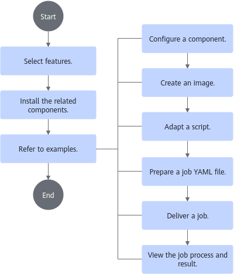

# Overview

<!-- md-trans-meta sourceCommit=unknown translatedAt=2026-06-09T02:16:14.814Z pushedAt=2026-06-09T06:22:06.940Z -->

Based on Kubernetes—the industry's leading cluster scheduling system—the cluster scheduling components add support for Ascend AI Processors (NPUs). They provide essential functions such as NPU resource management, optimized scheduling, and collective communication configuration for distributed training. By leveraging these components, deep learning platform developers can significantly reduce the software development effort associated with underlying resource scheduling, enabling users to rapidly build deep learning platforms on MindCluster.

This document is a guide on how to use cluster scheduling components. Before installing and using them, familiarize yourself with [their features](./02_feature_description.md), and [install the corresponding components](../installation_guide/03_installation/manual_installation/00_obtaining_software_packages.md) based on your actual needs.

## Usage Process

The figure below shows the component installation and usage process.

**Table 1**  Usage process

|Step|Description|
|--|--|
|Select features|Multiple features for training and inference jobs are provided. Each feature requires different components, and the component configurations also vary. Select features as needed. Multiple features can be used simultaneously.|
|Install the corresponding components|After selecting features, you need to install the corresponding components via a manual installation or tool-based installation mode.|
|Refer to examples|Feature usage examples are provided, including training job examples and inference job examples. The examples include the frameworks, models, and corresponding script adaptation operations supported by cluster scheduling components, helping you better understand and use the cluster scheduling components.|

## Disclaimer

- This document may contain third-party information, products, services, software, components, data, or content (collectively referred to as "Third-Party Content"). Huawei does not control and assumes no responsibility for any Third-Party Content, including but not limited to its accuracy, compatibility, reliability, availability, legality, appropriateness, performance, non-infringement, or update status, unless otherwise expressly stated in this document. Any mention or reference to Third-Party Content in this document does not imply endorsement or warranty by Huawei.
- If users require third-party licenses, they must obtain such licenses through legal means, unless otherwise expressly stated in this document.
