# Component Description

## Ascend Docker Runtime

**Application Scenarios**

When a container is created, Ascend driver scripts and commands must be imported to ensure that the Ascend AI Processor (referred to as NPU) can be properly used in the container. However, these scripts and commands are stored across multiple files and may be subject to changes. To avoid time-consuming file mounting during container creation, MindCluster provides Ascend Docker Runtime, deployed on compute nodes, to resolve such a problem. By inputting the Ascend AI Processor's ID, you can quickly mount the necessary files and related drivers.

**Component Functions**

- It supports Ascend containerization for Docker or containerd to automatically mount required files and device dependencies.
- Some hardware forms support the input of vNPU information to create and destroy vNPUs.

**Upstream and Downstream Dependencies**

[Figure 1](#fig98811251715) shows the logical interfaces of Ascend Docker Runtime.

**Figure 1** Upstream and downstream dependencies
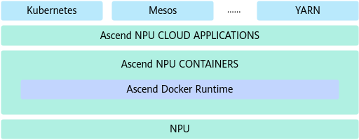

## NPU Exporter

**Application Scenarios**

During task running, in addition to monitoring chip faults, it is crucial to pay attention to the network usage and computing power of chips. This helps identify performance bottlenecks and provides direction for improving task performance. MindCluster provides NPU Exporter, deployed on compute nodes, to report chip data.

**Component Functions**

- Obtain chip and network data from the driver.
- Adapt to Prometheus hook functions and provide standard interfaces for the Prometheus service to call.
- Adapt to Telegraf hook functions and provide standard interfaces for the Telegraf service to call.

**Upstream and Downstream Dependencies**

**Figure 1** Upstream and downstream dependencies
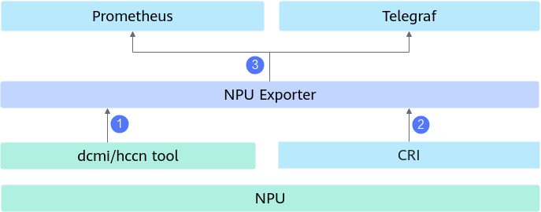

1. Obtain the chip and network information from the driver and save the information to the local cache.
2. Obtain container information from the Kubernetes standard interface CRI and save the information to the local cache.
3. Implement the Prometheus or Telegraf interfaces to periodically obtain data from the cache.

## Ascend Device Plugin

**Application Scenarios**

Kubernetes needs to detect resource information for scheduling. Besides the basic CPU and memory data, the Kubernetes device plugin mechanism is necessary to define new resource types and customize solutions for resource discovery and reporting. MindCluster provides Ascend Device Plugin, deployed on compute nodes, to provide resource discovery and reporting policies suitable for Ascend devices.

**Component Functions**

- Obtain the chip type and model from the driver and report them to kubelet and ClusterD (upper-layer service for resource scheduling).
- Subscribe to chip fault information from the driver, report the chip status to kubelet, and report both the chip status and fault information to the upper-layer service for resource scheduling.
- Subscribe to UnifiedBus (UB) network fault information from the UB driver, report the network status to kubelet, and report both the UB network status and fault information to the upper-layer service for resource scheduling.
- Establish fault handling levels. The level can be escalated if a fault recurs frequently or persists for an extended period.
- Obtain the selected chip information for cluster scheduling in the resource mounting phase and pass the information to Ascend Docker Runtime through environment variables.
- Perform a hot reset on an idle, faulty chip. The chip can be recoverable after a restart.

**Upstream and Downstream Dependencies**

**Figure 1** Upstream and downstream dependencies
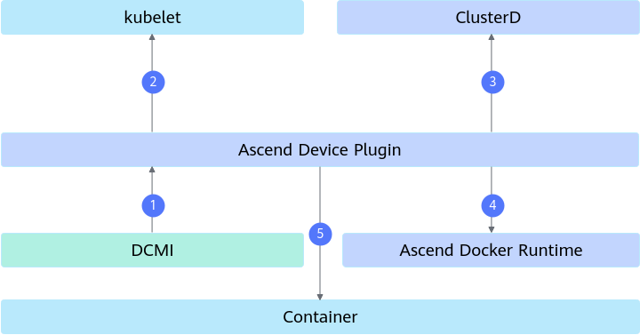

1. Obtain the chip type, quantity, and health status from the DCMI, or deliver a chip reset command.
2. Report the chip type, quantity, and status to kubelet.
3. Report the chip type, quantity, and fault information to ClusterD.
4. Inform Ascend Docker Runtime of the chip information selected by a scheduler via environment variables.
5. Deliver the commands for starting and stopping training jobs to the container.

## Volcano

**Application Scenarios**

The basic scheduling in Kubernetes can only allocate resources by detecting the number of Ascend chips. To implement affinity scheduling and maximize resource utilization, the network connection mode between Ascend chips needs to be identified to select the optimal network resource. MindCluster provides Volcano, deployed on the management node, to implement network affinity scheduling for different Ascend devices and networking modes.

**Component Functions**

- Calculate the available devices in a cluster based on the fault information and node information reported by the underlying cluster scheduling components. (`self-maintain-available-card` is enabled by default. If it is disabled, the information about available devices in a cluster is obtained from the underlying cluster scheduling components.)
- Obtain the expected number of resources from the Kubernetes task object, and allocate the optimal resources to the task based on the number of devices in a cluster, device type, and device networking mode.
- Reschedule the task when its resources are faulty.

**Upstream and Downstream Dependencies**

**Figure 1** Upstream and downstream dependencies
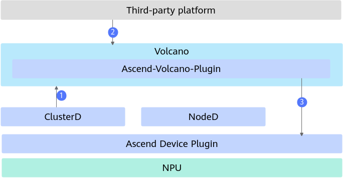

1. Calculate cluster resource information based on the information reported by ClusterD. In this scenario, ClusterD must be used by default.
2. Receive the task startup configuration delivered by a third-party system and select the optimal node resource based on the cluster resource information.
3. Pass the selected resource information to Ascend Device Plugin on compute nodes for device mounting.

## ClusterD

**Application Scenarios**

A node can experience multiple faults, and if each node addresses faults independently, a task may end up in several recovery scenarios simultaneously. To coordinate task processing effectively, MindCluster provides the ClusterD service, which is deployed on the management node. ClusterD collects and summarizes information about cluster tasks, resources, faults, and their impact scopes. It analyzes the data from the task, chip, and fault dimensions to determine the fault handling level and policy in a unified manner.

**Component Functions**

- Obtain the chip, node, and network information from Ascend Device Plugin and NodeD, and obtain public fault information from ConfigMap or gRPC.
- Summarize the preceding fault information for the upper-layer cluster scheduling services to call.
- Establish a connection with the training container and control the training process to perform recomputation.
- Interact with out-of-band services and transmit task information.

**Upstream and Downstream Dependencies**

**Figure 1** Upstream and downstream dependencies
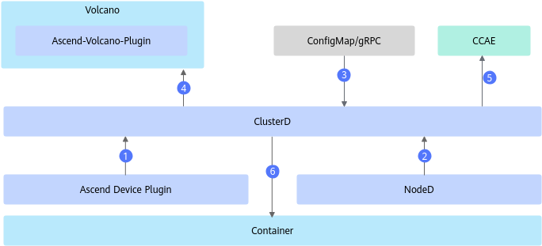

1. Obtain the chip information from Ascend Device Plugin on each compute node.
2. Obtain the health status of the CPU, memory, and hard drive, DPC shared storage fault information, and UB network fault information from NodeD on each compute node.
3. Obtain public fault information from ConfigMap or gRPC.
4. Summarize the resource information of the entire cluster and report the information to Ascend-volcano-plugin.
5. Monitor cluster task information and report information such as the task status and resource usage to CCAE.
6. Interact with processes in the container to control the training process for recomputation.

## Ascend Operator

**Application Scenarios**

MindCluster provides Ascend Operator, which provides the IP address of the main process needed for collective communication, the RankTable information required for collective communication in static networking, and the rank ID of the current pod.

**Component Functions**

- Create a pod and inject collective communication parameters as environment variables.
- Create a RankTable file and mount it to the container in shared storage or ConfigMap mode to optimize the link setup performance for collective communication.

**Upstream and Downstream Dependencies**

**Figure 1** Upstream and downstream dependencies
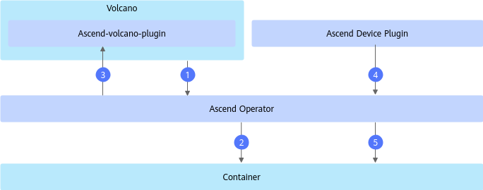

1. Check whether the resources required by the current task are sufficient based on Volcano.
2. Create a pod for a task and inject environment variables for collective communication after detecting that resources are sufficient.
3. Select resources via Volcano after the pod is created.
4. Obtain the chip ID, IP address, and rank ID of the task from Ascend Device Plugin, summarize the information, and generate a collective communication file.
5. Mount the collective communication file to the container through shared storage or ConfigMap.

## NodeD

**Application Scenarios**

If the CPU, memory, or hard drive of a node is faulty, training jobs will fail. To ensure that training jobs can quickly exit when a node is faulty and new jobs are not scheduled to the faulty node, MindCluster provides NodeD to detect node exceptions.

**Component Functions**

- Obtain node exceptions from IPMI and report the exceptions to the upper-layer service for resource scheduling.
- Periodically send node status information to the upper-layer service for resource scheduling.

**Upstream and Downstream Dependencies**

**Figure 1** Upstream and downstream dependencies
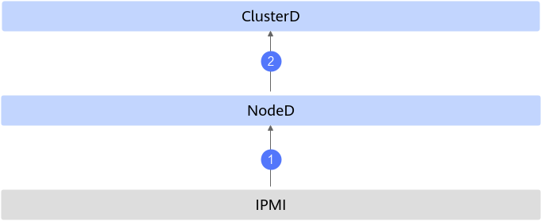

1. Obtain the CPU, memory, and hard drive fault information of compute nodes from IPMI.
2. Report the CPU, memory, and hard drive fault information of compute nodes to ClusterD.

## Resilience Controller

>[!NOTE]
>The Resilience Controller component has been deprecated and will be removed in the version released on September 30, 2026. For details about the latest elastic training capabilities, see [Elastic Training](../usage/resumable_training/01_solutions_principles.md#elastic-training).

**Application Scenarios**

If a training job encounters a fault and there are not enough healthy resources available to replace the faulty ones, you can enable dynamic scale-in to keep the training job running. Once sufficient resources are available, enable dynamic scale-out to restore the training job. Resilience Controller is provided for dynamic scaling during execution of training jobs.

**Component Functions**

This component provides elastic scale-in training services. When the hardware used by a training job is faulty, the hardware can be removed to continue training.

**Upstream and Downstream Dependencies**

Resilience Controller is a Kubernetes plugin and needs to be installed in the Kubernetes cluster. Resilience Controller supports only Volcano Job tasks. Therefore, Volcano must be installed in the cluster. During the running of Resilience Controller, it interacts only with Kubernetes, as shown in the following figure.

**Figure 1** Upstream and downstream dependencies
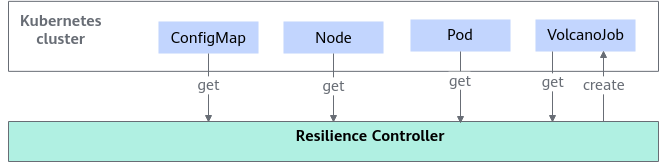

- MindCluster uses Kubernetes to write the NPU device, node status, and scheduling configuration to ConfigMap.
- Resilience Controller reads the `NodeInfo` field in ConfigMap whose name prefix is `mindx-dl-nodeinfo-` in the `mindx-dl` namespace to obtain the node heartbeat status.
- Resilience Controller reads the `DeviceInfoCfg` field in ConfigMap whose name prefix is `mindx-dl-deviceinfo-` in the `kube-system` namespace to obtain the NPU health status.
- Resilience Controller reads the `grace-over-time` field of the `volcano-scheduler` ConfigMap in the `volcano-system` namespace to obtain the graceful deletion timeout configuration of the rescheduled pod.
- Resilience Controller designates all nodes whose label is `nodeDEnable=on` in the cluster as the scheduling resource pool.
- Resilience Controller obtains all Volcano Job pods in the cluster and reads `huawei.com/AscendReal` to obtain the NPU list used by pods.
- Resilience Controller reads a Volcano Job and obtains fields such as `fault-scheduling`, `elastic-scheduling`, `minReplicas`, and `phase` to determine whether the Volcano Job supports elastic training.
- When a device or node is faulty, Resilience Controller creates a Volcano Job with half of the required NPU resources based on the number of replicas of the original Volcano Job and the cluster resources.

## Elastic Agent

>[!NOTE]
>The Elastic Agent component has been deprecated and will be removed in the version released on December 30, 2026. TaskD will be used to provide the process-level recovery capability.

**Application Scenarios**

Various software and hardware faults may occur during foundation model training, affecting training jobs. To address this issue, MindCluster provides the binary package of Elastic Agent deployed on compute nodes to manage training jobs on Ascend devices.

Component Functions

- Manage Ascend device processes in the PyTorch framework. That is, stop or restart training processes if a software or hardware fault occurs.
- Connect to the control plane in the Kubernetes cluster and manage training jobs based on the plane.

Upstream and Downstream Dependencies

**Figure 1** Upstream and downstream dependencies
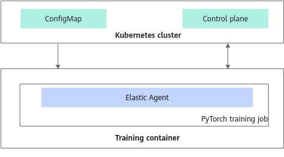

- MindCluster writes information such as the device and training job status to ConfigMap through Kubernetes and maps the information to the container. The ConfigMap name is [reset-config-*Job name*](../api/volcano.md).
- Elastic Agent obtains the device and training job status of the current training container through ConfigMap.
- Elastic Agent connects to the control plane in the Kubernetes cluster and manages training jobs based on the control plane.

## TaskD

**Application Scenarios**

Faults and performance deterioration may occur during the execution of foundation model training and inference jobs, affecting job execution. TaskD, one of the MindCluster cluster scheduling components, provides training and inference job status monitoring and control capabilities on Ascend devices.

In the current version, TaskD provides two service flows: 1. Fast fault recovery in the PyTorch and MindSpore scenarios; 2. Training service O&M management. (These two service flows rely on different installation and deployment mechanisms, with distinct upstream and downstream dependencies. In future versions, they will be unified under the same mechanism.)

**Component Architecture**

**Figure 1** Software architecture
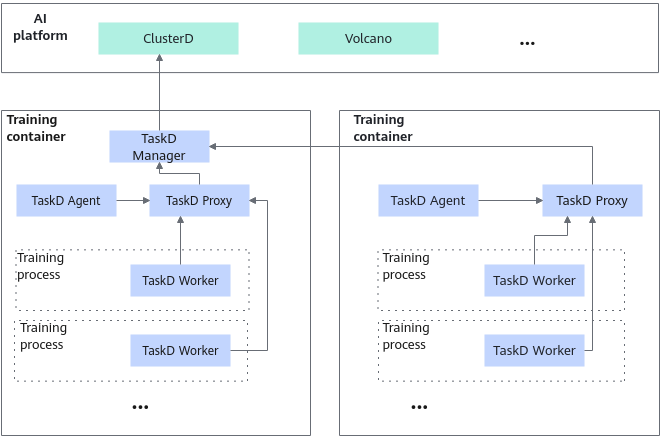

In the figure:

- TaskD Manager: controls the service status by managing other TaskD modules.
- TaskD Proxy: forwards messages. As the message proxy in each container, it sends messages to TaskD Manager.
- TaskD Agent: manages processes and the service process lifetime.
- TaskD Worker: manages services and the service process status.

**Component Functions**

- Functions of each component in service flow 1
    - Manage Ascend device processes in the PyTorch and MindSpore frameworks. That is, stop or restart training processes if a software or hardware fault occurs.

    - Connect to the control plane in the Kubernetes cluster and manage training job status based on the plane.

- Functions of each component in service flow 2
    - Provide lightweight profiling capabilities for training data and collect profile data based on the control plane of the cluster.
    - Provide the capabilities of link failover and switchback and online stress testing.

**Upstream and Downstream Dependencies**

- Dependency description in service flow 1

    - MindCluster writes information such as the device and training status to ConfigMap through Kubernetes and maps the information to the container. The ConfigMap name is [reset-config-<*Job name*\>](../api/ascend_device_plugin.md).
    - MindCluster writes the training status detection instruction to ConfigMap through Kubernetes and maps the instruction to the container.
    - TaskD Manager obtains the device and training job status of the current training container through ConfigMap.
    - TaskD Manager connects to the control plane in the Kubernetes cluster and manages training jobs based on the control plane.

    **Figure 2** Upstream and downstream dependencies service flow 1
    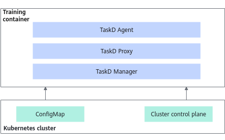

- Dependency description in service flow 2

    - TaskD Worker obtains the instruction for enabling training detection of the current task through ConfigMap.
    - TaskD Manager obtains the instruction for enabling training detection of the current task through gRPC.

    **Figure 3** Upstream and downstream dependencies service flow 2
    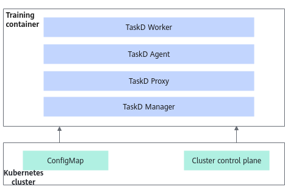

## MindIO ACP

**Application Scenarios**

Checkpoints are crucial for model recovery after training interruptions. The density of checkpoints, as well as their storage and recovery performance, are important factors that can significantly improve the effective throughput of the training system. MindIO ACP introduces a checkpoint acceleration solution, helping Ascend products expand their market share in the LLM field.

**Component Functions**

This component uses the training server memory as the cache in foundation model training, to accelerate checkpoint saving and loading.

**Upstream and Downstream Dependencies**

**Figure 1** MindIO ACP

## MindIO TFT

**Application Scenarios**

During LLM training, saving and loading periodic checkpoint data, as well as loading data for iterative training, can be time-consuming. With MindIO TFT, checkpoint data can be generated promptly following a fault. Once the fault is rectified, training can be resumed from the state just before the fault occurs, thereby minimizing iteration loss. MindIO UCE and MindIO ARF, based on different fault types, either perform online repairs or simply restart faulty nodes, reducing the overall cluster restart time.

**Component Functions**

MindIO TFT provides dying gasp checkpoint saving, process-level online recovery, and graceful fault tolerance functions. The details are offered as follows:

- MindIO TTP verifies the integrity and consistency of intermediate state data and generates a dying gasp checkpoint upon a fault during foundation model training. This checkpoint can be used to restore training, reducing the loss of training iterations caused by the fault.
- MindIO UCE detects uncorrectable errors (UCEs) in the on-chip memory during foundation model training and completes online repairs to implement step-level recomputation.
- MindIO ARF restarts or replaces a node where an exception occurs during training, instead of the entire cluster, to rectify the fault and continue training.

**Upstream and Downstream Dependencies**

**Figure 1** MindIO TFT
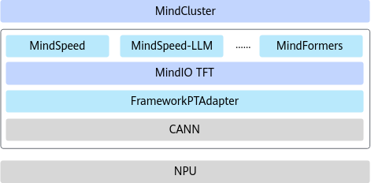

## Container Manager

**Application Scenarios**

If no Kubernetes is available, when the inference or training process is abnormal, Volcano and Ascend Device Plugin cannot be used to stop and reschedule containers, isolate faulty nodes, or reset NPUs. MindCluster provides Container Manager for container management and processor reset in scenarios where Kubernetes is not deployed.

**Component Functions**

- Subscribe to chip fault information from the driver, and store the chip status and fault information in the cache for subsequent container management and processor reset.
- Configure fault handling levels.
- Perform a hot reset on an idle, faulty chip. The chip can be recoverable after a restart.
- If the faulty chip is being used by a container, stop the container according to the user's startup configuration. After the faulty chip is reset, restart the container.

**Upstream and Downstream Dependencies**

**Figure 1** Upstream and downstream dependencies

1. Obtain the chip type, quantity, and health status from the DCMI.
2. Deliver a chip reset command to the DCMI.
3. Obtain the information about the running containers and mounted chips from the container runtime Docker or containerd.
4. Deliver the commands for stopping and starting containers to the container runtime.

## Infer Operator

**Application Scenarios**

MindCluster provides Infer Operator which starts an inference service based on its instance configuration and supports manual scaling of inference instances.

**Component Functions**

- Create Workload and Service of an inference instance.
- Manually scale in or scale out inference instances.

**Upstream and Downstream Dependencies**

**Figure 1** Upstream and downstream dependencies

1. Create Workload of an inference instance based on the job YAML configured by the user.
2. Select resources via Volcano after Workload Controller creates a pod.
3. After Workload allocates NPUs, Ascend Device Plugin obtains NPU information and mounts the devices.
