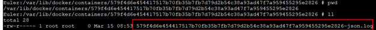
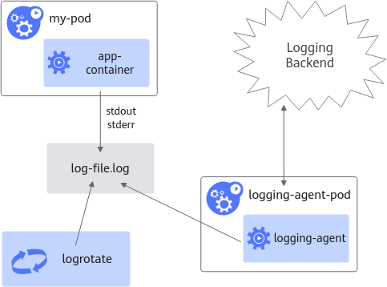
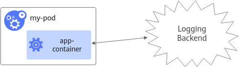

# Appendix

## Edge Container Log Output Guidelines <a name="ZH-CN_TOPIC_0000002479226424"></a>

**Background <a name="zh-cn_topic_0000001589264561_section15670165114555"></a>**

Due to the limited storage space on edge devices (such as the Atlas 500 A2 edge station), and because these devices typically use flash storage media like eMMC, which has a limited lifespan, users are advised to follow the log output recommendations for edge containers in this chapter. This will help ensure that edge containers output logs in an appropriate manner, preventing storage space from being filled too quickly—which could impact services—and avoiding premature exhaustion of the storage medium's lifespan.

**Output Methods <a name="zh-cn_topic_0000001589264561_section5556162785617"></a>**

Edge container applications running on Atlas hardware are generally managed through Kubernetes-compatible edge management platforms, such as Huawei Cloud IEF or third-party edge platforms built on KubeEdge. On such platforms, container log output methods are mainly divided into the following three types:

- Container console standard output (STDOUT and STDERR)
- (Recommended) Mounting to a host directory
- Outputting container logs directly to a log service

>[!NOTE]
>If a log server exists in the system, it is recommended to output logs directly to the log service within the container. Otherwise, it is recommended to output logs by mounting them to a host directory, thereby reducing the risk of logs impacting the hardware or other services.

**Container Console Standard Output<a name="zh-cn_topic_0000001589264561_section8645749571"></a>**

In this method, the application outputs the container log to standard output. By default, the Docker engine captures the standard output of all containers, writes it to a file in JSON format, and saves the file to the host's `/var/lib/docker/containers/{containerid}` directory, as shown in [Figure 1](#zh-cn_topic_0000001589264561_zh-cn_topic_0000001182332559_zh-cn_topic_0000001092717454_fig167489420139).

**Figure 1** Path example for the `{containerid}-json.log` file<a name="zh-cn_topic_0000001589264561_zh-cn_topic_0000001182332559_zh-cn_topic_0000001092717454_fig167489420139"></a>



>[!NOTE]
>If the edge management platform does not support log rotation for log files in this directory or the log rotation configuration is incorrect, it may cause `/var/lib/docker` to become full, thereby affecting the deployment of new containers and the normal operation of other container services. Therefore, this method is not recommended.

**(Recommended) Mounting Logs to Host Directory<a name="zh-cn_topic_0000001589264561_section139871046185718"></a>**

In this method, the collection of edge platform logs is illustrated in [Figure 2](#zh-cn_topic_0000001589264561_zh-cn_topic_0000001182452463_zh-cn_topic_0000001140102079_fig13294175199).

**Figure 2**  Solution architecture<a name="zh-cn_topic_0000001589264561_zh-cn_topic_0000001182452463_zh-cn_topic_0000001140102079_fig13294175199"></a>



Applications mount container logs to the edge host. The edge management platform provides log collection capabilities on the host and performs log rotation for host file logs.

>[!NOTE]
>
>- Applications can mount container logs to non-critical, high-capacity directories on the host. It is recommended not to mount them to storage media such as eMMC to avoid affecting the overall hardware lifespan.
>- Edge container management platforms generally support this capability to reduce the impact on the system directory `/var/lib/docker`. For security reasons, this configuration must comply with the security requirements of your organization.

**Outputting Container Logs Directly to a Log Service<a name="zh-cn_topic_0000001589264561_section195870131582"></a>**

As shown in [Figure 3](#zh-cn_topic_0000001589264561_zh-cn_topic_0000001136212966_zh-cn_topic_0000001093005606_fig8724931363), if a log server exists in the application environment, container logs can be directly output to the external log server, preventing logs from persisting to disk in the edge environment and minimizing the impact on hardware and other services.

**Figure 3** Solution architecture<a name="zh-cn_topic_0000001589264561_zh-cn_topic_0000001136212966_zh-cn_topic_0000001093005606_fig8724931363"></a>



## Content Mounted by Ascend Docker Runtime<a name="ZH-CN_TOPIC_0000002511346331"></a>

Ascend Docker Runtime mounts the following directories and files into containers in read-only mode by default based on the actual environment. The mounted files must not grant write permissions for `other` users, nor for others in the same group.

**Table 1** Default mount directories and files (Atlas 200 AI accelerator module (RC))

<a name="zh-cn_topic_0000001538584750_table11867194212594"></a>

|Path|Description|
|--|--|
|/dev/davinci*X*|NPU device, where *X* is the ID number. For example: davinci0.|
|/dev/davinci_manager|Device manager.|
|/usr/local/Ascend/driver/tools|Directory containing the tool package provided by the driver.|
|/usr/local/Ascend/driver/lib64|Directory containing the user-mode libraries provided by the driver.|
|/usr/local/sbin/npu-smi|The npu-smi tool|
|/etc/hdcBasic.cfg|The hdc base file.|
|/etc/sys_version.conf|The driver version information.|
|/dev/dvpp_cmdlist|Device file, supporting inference services.|
|/var/queue_schedule|FlowGW scheduling framework.<div class="note"><span class="notetitle">NOTE: </span><div class="notebody"><p>Mounting this directory requires the following conditions to be met simultaneously:</p><ul><li>MindCluster ≥ 6.0.0.</li><li>HDK ≥ 24.1.RC2</li></ul></div></div>|

**Table 2**  Default mount directory and file (Atlas 200I SoC A1 core board)

<a name="zh-cn_topic_0000001538584750_table2868154235914"></a>

|Path|Description|
|--|--|
|/dev/davinci*X*|NPU device, where *X* is the ID number. For example: davinci0.|
|/dev/davinci_manager|Da Vinci-related device manager.|
|/usr/local/bin/npu-smi|The npu-smi tool.|
|/etc/hdcBasic.cfg|The hdc base file.|
|/etc/sys_version.conf|The driver version information.|
|/dev/dvpp_cmdlist|Device file, supporting inference services.|
|/var/queue_schedule|FlowGW scheduling framework.<div class="note"><span class="notetitle">NOTE:</span><div class="notebody"><p>Mounting this directory requires the following conditions to be met simultaneously:</p><ul><li>MindCluster ≥ 6.0.0.</li><li>HDK ≥ 24.1.RC2</li></ul></div></div>|

**Table 3**  Default mount directories and files (Atlas 200I A2 acceleration module and Atlas 200I DK A2)

<a name="zh-cn_topic_0000001538584750_table1986129115"></a>
<table><thead align="left"><tr id="zh-cn_topic_0000001538584750_row158718919114"><th class="cellrowborder" valign="top" width="42.86%" id="mcps1.2.3.1.1"><p id="zh-cn_topic_0000001538584750_p2871497112"><a name="zh-cn_topic_0000001538584750_p2871497112"></a><a name="zh-cn_topic_0000001538584750_p2871497112"></a>Path</p>
</th>
<th class="cellrowborder" valign="top" width="57.14%" id="mcps1.2.3.1.2"><p id="zh-cn_topic_0000001538584750_p148716919110"><a name="zh-cn_topic_0000001538584750_p148716919110"></a><a name="zh-cn_topic_0000001538584750_p148716919110"></a>Description</p>
</th>
</tr>
</thead>
<tbody><tr id="zh-cn_topic_0000001538584750_row887398115"><td class="cellrowborder" valign="top" width="42.86%" headers="mcps1.2.3.1.1 "><p id="zh-cn_topic_0000001538584750_p3873913114"><a name="zh-cn_topic_0000001538584750_p3873913114"></a><a name="zh-cn_topic_0000001538584750_p3873913114"></a>/dev/davinciX</p>
</td>
<td class="cellrowborder" valign="top" width="57.14%" headers="mcps1.2.3.1.2 "><p id="zh-cn_topic_0000001538584750_p987149212"><a name="zh-cn_topic_0000001538584750_p987149212"></a><a name="zh-cn_topic_0000001538584750_p987149212"></a>NPU device, where *X* is the ID number. For example: davinci0.</p>
</td>
</tr>
<tr id="zh-cn_topic_0000001538584750_row88720918119"><td class="cellrowborder" valign="top" width="42.86%" headers="mcps1.2.3.1.1 "><p id="zh-cn_topic_0000001538584750_p587191016"><a name="zh-cn_topic_0000001538584750_p587191016"></a><a name="zh-cn_topic_0000001538584750_p587191016"></a>/dev/davinci_manager</p>
</td>
<td class="cellrowborder" valign="top" width="57.14%" headers="mcps1.2.3.1.2 "><p id="zh-cn_topic_0000001538584750_p18878915118"><a name="zh-cn_topic_0000001538584750_p18878915118"></a><a name="zh-cn_topic_0000001538584750_p18878915118"></a>Da Vinci-related device manager.</p>
</td>
</tr>
<tr id="zh-cn_topic_0000001538584750_row17871991715"><td class="cellrowborder" valign="top" width="42.86%" headers="mcps1.2.3.1.1 "><p id="zh-cn_topic_0000001538584750_p5871596110"><a name="zh-cn_topic_0000001538584750_p5871596110"></a><a name="zh-cn_topic_0000001538584750_p5871596110"></a>/dev/svm0</p>
</td>
<td class="cellrowborder" valign="top" width="57.14%" headers="mcps1.2.3.1.2 "><p id="zh-cn_topic_0000001538584750_p4874911116"><a name="zh-cn_topic_0000001538584750_p4874911116"></a><a name="zh-cn_topic_0000001538584750_p4874911116"></a>Memory management device.</p>
</td>
</tr>
<tr id="zh-cn_topic_0000001538584750_row12871991110"><td class="cellrowborder" valign="top" width="42.86%" headers="mcps1.2.3.1.1 "><p id="zh-cn_topic_0000001538584750_p118714910112"><a name="zh-cn_topic_0000001538584750_p118714910112"></a><a name="zh-cn_topic_0000001538584750_p118714910112"></a>/dev/ts_aisle</p>
</td>
<td class="cellrowborder" valign="top" width="57.14%" headers="mcps1.2.3.1.2 "><p id="zh-cn_topic_0000001538584750_p14871191816"><a name="zh-cn_topic_0000001538584750_p14871191816"></a><a name="zh-cn_topic_0000001538584750_p14871191816"></a>aicpudrv driver, providing an event-driven channel interface for task scheduling.</p>
</td>
</tr>
<tr id="zh-cn_topic_0000001538584750_row387694111"><td class="cellrowborder" valign="top" width="42.86%" headers="mcps1.2.3.1.1 "><p id="zh-cn_topic_0000001538584750_p158717920111"><a name="zh-cn_topic_0000001538584750_p158717920111"></a><a name="zh-cn_topic_0000001538584750_p158717920111"></a>/dev/upgrade</p>
</td>
<td class="cellrowborder" rowspan="2" valign="top" width="57.14%" headers="mcps1.2.3.1.2 "><p id="zh-cn_topic_0000001538584750_p787109313"><a name="zh-cn_topic_0000001538584750_p787109313"></a><a name="zh-cn_topic_0000001538584750_p787109313"></a>Drivers.</p>
<p id="zh-cn_topic_0000001538584750_p488199419"><a name="zh-cn_topic_0000001538584750_p488199419"></a><a name="zh-cn_topic_0000001538584750_p488199419"></a></p>
</td>
</tr>
<tr id="zh-cn_topic_0000001538584750_row1888792116"><td class="cellrowborder" valign="top" headers="mcps1.2.3.1.1 "><p id="zh-cn_topic_0000001538584750_p2881297112"><a name="zh-cn_topic_0000001538584750_p2881297112"></a><a name="zh-cn_topic_0000001538584750_p2881297112"></a>/dev/sys</p>
</td>
</tr>
<tr id="zh-cn_topic_0000001538584750_row16881191116"><td class="cellrowborder" valign="top" width="42.86%" headers="mcps1.2.3.1.1 "><p id="zh-cn_topic_0000001538584750_p3881291514"><a name="zh-cn_topic_0000001538584750_p3881291514"></a><a name="zh-cn_topic_0000001538584750_p3881291514"></a>/dev/vdec</p>
</td>
<td class="cellrowborder" rowspan="5" valign="top" width="57.14%" headers="mcps1.2.3.1.2 "><p id="zh-cn_topic_0000001538584750_p19885910111"><a name="zh-cn_topic_0000001538584750_p19885910111"></a><a name="zh-cn_topic_0000001538584750_p19885910111"></a>Device files that support inference services.</p>
</td>
</tr>
<tr id="zh-cn_topic_0000001538584750_row2088891710"><td class="cellrowborder" valign="top" headers="mcps1.2.3.1.1 "><p id="zh-cn_topic_0000001538584750_p1088691118"><a name="zh-cn_topic_0000001538584750_p1088691118"></a><a name="zh-cn_topic_0000001538584750_p1088691118"></a>/dev/vpc</p>
</td>
</tr>
<tr id="zh-cn_topic_0000001538584750_row158819919112"><td class="cellrowborder" valign="top" headers="mcps1.2.3.1.1 "><p id="zh-cn_topic_0000001538584750_p1188891316"><a name="zh-cn_topic_0000001538584750_p1188891316"></a><a name="zh-cn_topic_0000001538584750_p1188891316"></a>/dev/pngd</p>
</td>
</tr>
<tr id="zh-cn_topic_0000001538584750_row588179715"><td class="cellrowborder" valign="top" headers="mcps1.2.3.1.1 "><p id="zh-cn_topic_0000001538584750_p168829515"><a name="zh-cn_topic_0000001538584750_p168829515"></a><a name="zh-cn_topic_0000001538584750_p168829515"></a>/dev/venc</p>
</td>
</tr>
<tr id="zh-cn_topic_0000001538584750_row488199215"><td class="cellrowborder" valign="top" headers="mcps1.2.3.1.1 "><p id="zh-cn_topic_0000001538584750_p38889319"><a name="zh-cn_topic_0000001538584750_p38889319"></a><a name="zh-cn_topic_0000001538584750_p38889319"></a>/dev/dvpp_cmdlist</p>
</td>
</tr>
<tr id="zh-cn_topic_0000001538584750_row5881891118"><td class="cellrowborder" valign="top" width="42.86%" headers="mcps1.2.3.1.1 "><p id="zh-cn_topic_0000001538584750_p38815916118"><a name="zh-cn_topic_0000001538584750_p38815916118"></a><a name="zh-cn_topic_0000001538584750_p38815916118"></a>/dev/log_drv</p>
</td>
<td class="cellrowborder" valign="top" width="57.14%" headers="mcps1.2.3.1.2 "><p id="zh-cn_topic_0000001538584750_p108811910116"><a name="zh-cn_topic_0000001538584750_p108811910116"></a><a name="zh-cn_topic_0000001538584750_p108811910116"></a>Log driver.</p>
</td>
</tr>
<tr id="zh-cn_topic_0000001538584750_row188829510"><td class="cellrowborder" valign="top" width="42.86%" headers="mcps1.2.3.1.1 "><p id="zh-cn_topic_0000001538584750_p165082055743"><a name="zh-cn_topic_0000001538584750_p165082055743"></a><a name="zh-cn_topic_0000001538584750_p165082055743"></a>/etc/sys_version.conf</p>
</td>
<td class="cellrowborder" valign="top" width="57.14%" headers="mcps1.2.3.1.2 "><p id="zh-cn_topic_0000001538584750_p1488791019"><a name="zh-cn_topic_0000001538584750_p1488791019"></a><a name="zh-cn_topic_0000001538584750_p1488791019"></a>File containing driver version information.</p>
</td>
</tr>
<tr id="zh-cn_topic_0000001538584750_row1788391510"><td class="cellrowborder" valign="top" width="42.86%" headers="mcps1.2.3.1.1 "><p id="zh-cn_topic_0000001538584750_p205071551147"><a name="zh-cn_topic_0000001538584750_p205071551147"></a><a name="zh-cn_topic_0000001538584750_p205071551147"></a>/etc/hdcBasic.cfg</p>
</td>
<td class="cellrowborder" valign="top" width="57.14%" headers="mcps1.2.3.1.2 "><p id="zh-cn_topic_0000001538584750_p207918322811"><a name="zh-cn_topic_0000001538584750_p207918322811"></a><a name="zh-cn_topic_0000001538584750_p207918322811"></a>The hdc base file.</p>
</td>
</tr>
<tr id="zh-cn_topic_0000001538584750_row4405101113211"><td class="cellrowborder" valign="top" width="42.86%" headers="mcps1.2.3.1.1 "><p id="zh-cn_topic_0000001538584750_p767371282114"><a name="zh-cn_topic_0000001538584750_p767371282114"></a><a name="zh-cn_topic_0000001538584750_p767371282114"></a>/usr/local/sbin/npu-smi</p>
</td>
<td class="cellrowborder" valign="top" width="57.14%" headers="mcps1.2.3.1.2 "><p id="zh-cn_topic_0000001538584750_p8406151192117"><a name="zh-cn_topic_0000001538584750_p8406151192117"></a><a name="zh-cn_topic_0000001538584750_p8406151192117"></a>The npu-smi tool.</p>
</td>
</tr>
<tr id="zh-cn_topic_0000001538584750_row191323162119"><td class="cellrowborder" valign="top" width="42.86%" headers="mcps1.2.3.1.1 "><p id="zh-cn_topic_0000001538584750_p202501407219"><a name="zh-cn_topic_0000001538584750_p202501407219"></a><a name="zh-cn_topic_0000001538584750_p202501407219"></a>/usr/local/Ascend/driver/lib64</p>
</td>
<td class="cellrowborder" rowspan="2" valign="top" width="57.14%" headers="mcps1.2.3.1.2 "><p id="zh-cn_topic_0000001538584750_p14913103162113"><a name="zh-cn_topic_0000001538584750_p14913103162113"></a><a name="zh-cn_topic_0000001538584750_p14913103162113"></a>Directories containing user-mode libraries provided by the driver.</p>
</td>
</tr>
<tr id="zh-cn_topic_0000001538584750_row591373112319"><td class="cellrowborder" valign="top" headers="mcps1.2.3.1.1 "><p id="zh-cn_topic_0000001538584750_p52527011210"><a name="zh-cn_topic_0000001538584750_p52527011210"></a><a name="zh-cn_topic_0000001538584750_p52527011210"></a>/usr/lib64/aicpu_kernels/</p>
</td>
</tr>
<tr id="zh-cn_topic_0000001538584750_row71535348212"><td class="cellrowborder" valign="top" width="42.86%" headers="mcps1.2.3.1.1 "><p id="zh-cn_topic_0000001538584750_p92491501323"><a name="zh-cn_topic_0000001538584750_p92491501323"></a><a name="zh-cn_topic_0000001538584750_p92491501323"></a>/var/slogd</p>
</td>
<td class="cellrowborder" valign="top" width="57.14%" headers="mcps1.2.3.1.2 "><p id="zh-cn_topic_0000001538584750_p189302374220"><a name="zh-cn_topic_0000001538584750_p189302374220"></a><a name="zh-cn_topic_0000001538584750_p189302374220"></a>File; log component.</p>
</td>
</tr>
<tr id="zh-cn_topic_0000001538584750_row15553144182114"><td class="cellrowborder" valign="top" width="42.86%" headers="mcps1.2.3.1.1 "><p id="zh-cn_topic_0000001538584750_p1455394452117"><a name="zh-cn_topic_0000001538584750_p1455394452117"></a><a name="zh-cn_topic_0000001538584750_p1455394452117"></a>/var/dmp_daemon</p>
</td>
<td class="cellrowborder" valign="top" width="57.14%" headers="mcps1.2.3.1.2 "><p id="zh-cn_topic_0000001538584750_p3553444112118"><a name="zh-cn_topic_0000001538584750_p3553444112118"></a><a name="zh-cn_topic_0000001538584750_p3553444112118"></a>File; dmp daemon.</p>
</td>
</tr>
<tr id="row4773105231920"><td class="cellrowborder" valign="top" width="42.86%" headers="mcps1.2.3.1.1 "><p id="p37731952181911"><a name="p37731952181911"></a><a name="p37731952181911"></a>/usr/lib64/libcrypto.so.1.1</p>
</td>
<td class="cellrowborder" rowspan="2" valign="top" width="57.14%" headers="mcps1.2.3.1.2 "><p id="p1354341203715"><a name="p1354341203715"></a><a name="p1354341203715"></a>Files; dynamic libraries required by the driver.</p>
<p id="p10927155142111"><a name="p10927155142111"></a><a name="p10927155142111"></a><span id="ph9796114014252"><a name="ph9796114014252"></a><a name="ph9796114014252"></a>Required by openEuler</span> 22.03.</p>
</td>
</tr>
<tr id="row2418501193"><td class="cellrowborder" valign="top" headers="mcps1.2.3.1.1 "><p id="p144145021912"><a name="p144145021912"></a><a name="p144145021912"></a>/usr/lib64/libyaml-0.so.2</p>
</td>
</tr>
<tr id="row1826901502019"><td class="cellrowborder" valign="top" width="42.86%" headers="mcps1.2.3.1.1 "><p id="p226991514205"><a name="p226991514205"></a><a name="p226991514205"></a>/usr/lib/aarch64-linux-gnu/libcrypto.so.1.1</p>
</td>
<td class="cellrowborder" rowspan="2" valign="top" width="57.14%" headers="mcps1.2.3.1.2 "><p id="p19161449374"><a name="p19161449374"></a><a name="p19161449374"></a>Files; dynamic libraries required by the driver.</p>
<p id="p540120472227"><a name="p540120472227"></a><a name="p540120472227"></a><span id="ph1052114212228"><a name="ph1052114212228"></a><a name="ph1052114212228"></a>Required by Ubuntu</span> 22.04.</p>
</td>
</tr>
<tr id="row211711176202"><td class="cellrowborder" valign="top" headers="mcps1.2.3.1.1 "><p id="p1111821752013"><a name="p1111821752013"></a><a name="p1111821752013"></a>/usr/lib/aarch64-linux-gnu/libyaml-0.so.2</p>
</td>
</tr>
<tr id="zh-cn_topic_0000001538584750_row989119916"><td class="cellrowborder" valign="top" width="42.86%" headers="mcps1.2.3.1.1 "><p id="zh-cn_topic_0000001538584750_p11506655744"><a name="zh-cn_topic_0000001538584750_p11506655744"></a><a name="zh-cn_topic_0000001538584750_p11506655744"></a>/usr/lib64/libaicpu_processer.so</p>
</td>
<td class="cellrowborder" rowspan="9" valign="top" width="57.14%" headers="mcps1.2.3.1.2 "><p id="zh-cn_topic_0000001538584750_p1189591513"><a name="zh-cn_topic_0000001538584750_p1189591513"></a><a name="zh-cn_topic_0000001538584750_p1189591513"></a>Files, dynamic libraries required by the driver.</p>
</td>
</tr>
<tr id="zh-cn_topic_0000001538584750_row108919919120"><td class="cellrowborder" valign="top" headers="mcps1.2.3.1.1 "><p id="zh-cn_topic_0000001538584750_p175057555415"><a name="zh-cn_topic_0000001538584750_p175057555415"></a><a name="zh-cn_topic_0000001538584750_p175057555415"></a>/usr/lib64/libaicpu_prof.so</p>
</td>
</tr>
<tr id="zh-cn_topic_0000001538584750_row108912918120"><td class="cellrowborder" valign="top" headers="mcps1.2.3.1.1 "><p id="zh-cn_topic_0000001538584750_p450413551641"><a name="zh-cn_topic_0000001538584750_p450413551641"></a><a name="zh-cn_topic_0000001538584750_p450413551641"></a>/usr/lib64/libaicpu_sharder.so</p>
</td>
</tr>
<tr id="zh-cn_topic_0000001538584750_row389149511"><td class="cellrowborder" valign="top" headers="mcps1.2.3.1.1 "><p id="zh-cn_topic_0000001538584750_p1625520017218"><a name="zh-cn_topic_0000001538584750_p1625520017218"></a><a name="zh-cn_topic_0000001538584750_p1625520017218"></a>/usr/lib64/libadump.so</p>
</td>
</tr>
<tr id="zh-cn_topic_0000001538584750_row989199714"><td class="cellrowborder" valign="top" headers="mcps1.2.3.1.1 "><p id="zh-cn_topic_0000001538584750_p425514020216"><a name="zh-cn_topic_0000001538584750_p425514020216"></a><a name="zh-cn_topic_0000001538584750_p425514020216"></a>/usr/lib64/libtsd_eventclient.so</p>
</td>
</tr>
<tr id="zh-cn_topic_0000001538584750_row78919917112"><td class="cellrowborder" valign="top" headers="mcps1.2.3.1.1 "><p id="zh-cn_topic_0000001538584750_p5254304219"><a name="zh-cn_topic_0000001538584750_p5254304219"></a><a name="zh-cn_topic_0000001538584750_p5254304219"></a>/usr/lib64/libaicpu_scheduler.so</p>
</td>
</tr>
<tr id="zh-cn_topic_0000001538584750_row58918913114"><td class="cellrowborder" valign="top" headers="mcps1.2.3.1.1 "><p id="zh-cn_topic_0000001538584750_p9946242610"><a name="zh-cn_topic_0000001538584750_p9946242610"></a><a name="zh-cn_topic_0000001538584750_p9946242610"></a>/usr/lib64/libdcmi.so</p>
</td>
</tr>
<tr id="zh-cn_topic_0000001538584750_row19901097112"><td class="cellrowborder" valign="top" headers="mcps1.2.3.1.1 "><p id="zh-cn_topic_0000001538584750_p625330423"><a name="zh-cn_topic_0000001538584750_p625330423"></a><a name="zh-cn_topic_0000001538584750_p625330423"></a>/usr/lib64/libmpi_dvpp_adapter.so</p>
</td>
</tr>
<tr id="zh-cn_topic_0000001538584750_row14901996110"><td class="cellrowborder" valign="top" headers="mcps1.2.3.1.1 "><p id="zh-cn_topic_0000001538584750_p62511103210"><a name="zh-cn_topic_0000001538584750_p62511103210"></a><a name="zh-cn_topic_0000001538584750_p62511103210"></a>/usr/lib64/libstackcore.so</p>
</td>
</tr>
<tr id="row88572085920"><td class="cellrowborder" valign="top" width="42.86%" headers="mcps1.2.3.1.1 "><p id="p17250112212918"><a name="p17250112212918"></a><a name="p17250112212918"></a>/var/queue_schedule</p>
</td>
<td class="cellrowborder" valign="top" width="57.14%" headers="mcps1.2.3.1.2 "><p id="p192505227918"><a name="p192505227918"></a><a name="p192505227918"></a>FlowGW scheduling framework.</p>
<div class="note" id="note62503223913"><a name="note62503223913"></a><div class="notebody"><p id="p325017223919"><a name="p325017223919"></a><a name="p325017223919"></a>Mounting this directory requires the following conditions to be met simultaneously:</p>
<a name="ul112517221897"></a><a name="ul112517221897"></a><ul id="ul112517221897"><li>MindCluster ≥ 6.0.0.</li><li>HDK ≥ 24.1.RC2</li></ul>
</div></div>
</td>
</tr>
</tbody>
</table>

**Table 4** Default mount directories and files (Atlas 500 intelligent station (model 3000))

<a name="zh-cn_topic_0000001538584750_table13873642175917"></a>

|Path|Description|
|--|--|
|/dev/davinci*X*|NPU device, where *X* is the ID number. For example: davinci0.|
|/dev/davinci_manager|Device manager.|
|/dev/hisi_hdc|Device manager.|
|/dev/devmm_svm|Device manager.|
|/home/data/miniD/driver/lib64|Directory; user-mode libraries provided by the driver.|
|/usr/local/dcmi|Directory; DCMI header files and libraries.|
|/usr/local/lib/libdcmi.so|File; DCMI dynamic library.|
|/usr/local/bin/npu-smi|File; npu-smi tool.|
|/dev/dvpp_cmdlist|Device file, supports inference services.|
|/var/queue_schedule|FlowGW scheduling framework.<div class="note"><span class="notetitle">NOTE:</span><div class="notebody"><p>Mounting this directory requires the following conditions to be met simultaneously:</p><ul><li>MindCluster ≥ 6.0.0.</li><li>HDK ≥ 24.1.RC2</li></ul></div></div>|

**Table 5** Default mount directories and files (Atlas 500 A2 intelligent station)

<a name="zh-cn_topic_0000001538584750_table1023983110534"></a>
<table><thead align="left"><tr id="zh-cn_topic_0000001538584750_row11240193115538"><th class="cellrowborder" valign="top" width="42.86%" id="mcps1.2.3.1.1"><p id="zh-cn_topic_0000001538584750_p16240731145317"><a name="zh-cn_topic_0000001538584750_p16240731145317"></a><a name="zh-cn_topic_0000001538584750_p16240731145317"></a>Path</p>
</th>
<th class="cellrowborder" valign="top" width="57.14%" id="mcps1.2.3.1.2"><p id="zh-cn_topic_0000001538584750_p32401731185310"><a name="zh-cn_topic_0000001538584750_p32401731185310"></a><a name="zh-cn_topic_0000001538584750_p32401731185310"></a>Description</p>
</th>
</tr>
</thead>
<tbody><tr id="zh-cn_topic_0000001538584750_row424018316537"><td class="cellrowborder" valign="top" width="42.86%" headers="mcps1.2.3.1.1 "><p id="zh-cn_topic_0000001538584750_p91141812145416"><a name="zh-cn_topic_0000001538584750_p91141812145416"></a><a name="zh-cn_topic_0000001538584750_p91141812145416"></a>/dev/davinciX</p>
</td>
<td class="cellrowborder" valign="top" width="57.14%" headers="mcps1.2.3.1.2 "><p id="zh-cn_topic_0000001538584750_p1733622015418"><a name="zh-cn_topic_0000001538584750_p1733622015418"></a><a name="zh-cn_topic_0000001538584750_p1733622015418"></a>NPU device, where *X* is the ID number. For example: davinci0.</p>
</td>
</tr>
<tr id="zh-cn_topic_0000001538584750_row1724013155312"><td class="cellrowborder" valign="top" width="42.86%" headers="mcps1.2.3.1.1 "><p id="zh-cn_topic_0000001538584750_p3785534175420"><a name="zh-cn_topic_0000001538584750_p3785534175420"></a><a name="zh-cn_topic_0000001538584750_p3785534175420"></a>/dev/davinci_manager</p>
</td>
<td class="cellrowborder" valign="top" width="57.14%" headers="mcps1.2.3.1.2 "><p id="zh-cn_topic_0000001538584750_p19759114295414"><a name="zh-cn_topic_0000001538584750_p19759114295414"></a><a name="zh-cn_topic_0000001538584750_p19759114295414"></a>Da Vinci-related device manager.</p>
</td>
</tr>
<tr id="zh-cn_topic_0000001538584750_row175343390145"><td class="cellrowborder" valign="top" width="42.86%" headers="mcps1.2.3.1.1 "><p id="zh-cn_topic_0000001538584750_p8535939101418"><a name="zh-cn_topic_0000001538584750_p8535939101418"></a><a name="zh-cn_topic_0000001538584750_p8535939101418"></a>/dev/svm0</p>
</td>
<td class="cellrowborder" valign="top" width="57.14%" headers="mcps1.2.3.1.2 "><p id="zh-cn_topic_0000001538584750_p0535113961415"><a name="zh-cn_topic_0000001538584750_p0535113961415"></a><a name="zh-cn_topic_0000001538584750_p0535113961415"></a>Memory management device.</p>
</td>
</tr>
<tr id="zh-cn_topic_0000001538584750_row081724113149"><td class="cellrowborder" valign="top" width="42.86%" headers="mcps1.2.3.1.1 "><p id="zh-cn_topic_0000001538584750_p7817154161415"><a name="zh-cn_topic_0000001538584750_p7817154161415"></a><a name="zh-cn_topic_0000001538584750_p7817154161415"></a>/dev/ts_aisle</p>
</td>
<td class="cellrowborder" valign="top" width="57.14%" headers="mcps1.2.3.1.2 "><p id="zh-cn_topic_0000001538584750_p08177412149"><a name="zh-cn_topic_0000001538584750_p08177412149"></a><a name="zh-cn_topic_0000001538584750_p08177412149"></a>aicpudrv driver, providing an event-driven channel interface for task scheduling.</p>
</td>
</tr>
<tr id="zh-cn_topic_0000001538584750_row97701421617"><td class="cellrowborder" valign="top" width="42.86%" headers="mcps1.2.3.1.1 "><p id="zh-cn_topic_0000001538584750_p1677111219613"><a name="zh-cn_topic_0000001538584750_p1677111219613"></a><a name="zh-cn_topic_0000001538584750_p1677111219613"></a>/dev/upgrade</p>
</td>
<td class="cellrowborder" rowspan="2" valign="top" width="57.14%" headers="mcps1.2.3.1.2 "><p id="zh-cn_topic_0000001538584750_p4771821368"><a name="zh-cn_topic_0000001538584750_p4771821368"></a><a name="zh-cn_topic_0000001538584750_p4771821368"></a>Drivers.</p>
<p id="zh-cn_topic_0000001538584750_p139858917612"><a name="zh-cn_topic_0000001538584750_p139858917612"></a><a name="zh-cn_topic_0000001538584750_p139858917612"></a></p>
</td>
</tr>
<tr id="zh-cn_topic_0000001538584750_row19985159863"><td class="cellrowborder" valign="top" headers="mcps1.2.3.1.1 "><p id="zh-cn_topic_0000001538584750_p398514910612"><a name="zh-cn_topic_0000001538584750_p398514910612"></a><a name="zh-cn_topic_0000001538584750_p398514910612"></a>/dev/sys</p>
</td>
</tr>
<tr id="zh-cn_topic_0000001538584750_row68010161568"><td class="cellrowborder" valign="top" width="42.86%" headers="mcps1.2.3.1.1 "><p id="zh-cn_topic_0000001538584750_p1280616867"><a name="zh-cn_topic_0000001538584750_p1280616867"></a><a name="zh-cn_topic_0000001538584750_p1280616867"></a>/dev/vdec</p>
</td>
<td class="cellrowborder" rowspan="5" valign="top" width="57.14%" headers="mcps1.2.3.1.2 "><p id="zh-cn_topic_0000001538584750_p1572782173418"><a name="zh-cn_topic_0000001538584750_p1572782173418"></a><a name="zh-cn_topic_0000001538584750_p1572782173418"></a>Device files that support inference services.</p>
</td>
</tr>
<tr id="zh-cn_topic_0000001538584750_row512410151477"><td class="cellrowborder" valign="top" headers="mcps1.2.3.1.1 "><p id="zh-cn_topic_0000001538584750_p1412417155713"><a name="zh-cn_topic_0000001538584750_p1412417155713"></a><a name="zh-cn_topic_0000001538584750_p1412417155713"></a>/dev/vpc</p>
</td>
</tr>
<tr id="zh-cn_topic_0000001538584750_row96243616713"><td class="cellrowborder" valign="top" headers="mcps1.2.3.1.1 "><p id="zh-cn_topic_0000001538584750_p362143610714"><a name="zh-cn_topic_0000001538584750_p362143610714"></a><a name="zh-cn_topic_0000001538584750_p362143610714"></a>/dev/pngd</p>
</td>
</tr>
<tr id="zh-cn_topic_0000001538584750_row196382414717"><td class="cellrowborder" valign="top" headers="mcps1.2.3.1.1 "><p id="zh-cn_topic_0000001538584750_p1763815414719"><a name="zh-cn_topic_0000001538584750_p1763815414719"></a><a name="zh-cn_topic_0000001538584750_p1763815414719"></a>/dev/venc</p>
</td>
</tr>
<tr id="zh-cn_topic_0000001538584750_row16599816203215"><td class="cellrowborder" valign="top" headers="mcps1.2.3.1.1 "><p id="zh-cn_topic_0000001538584750_p1659910166323"><a name="zh-cn_topic_0000001538584750_p1659910166323"></a><a name="zh-cn_topic_0000001538584750_p1659910166323"></a>/dev/dvpp_cmdlist</p>
</td>
</tr>
<tr id="zh-cn_topic_0000001538584750_row2279321123214"><td class="cellrowborder" valign="top" width="42.86%" headers="mcps1.2.3.1.1 "><p id="zh-cn_topic_0000001538584750_p3279192113211"><a name="zh-cn_topic_0000001538584750_p3279192113211"></a><a name="zh-cn_topic_0000001538584750_p3279192113211"></a>/dev/log_drv</p>
</td>
<td class="cellrowborder" valign="top" width="57.14%" headers="mcps1.2.3.1.2 "><p id="zh-cn_topic_0000001538584750_p7279192111324"><a name="zh-cn_topic_0000001538584750_p7279192111324"></a><a name="zh-cn_topic_0000001538584750_p7279192111324"></a>Log driver.</p>
</td>
</tr>
<tr id="zh-cn_topic_0000001538584750_row9232145311019"><td class="cellrowborder" valign="top" width="42.86%" headers="mcps1.2.3.1.1 "><p id="zh-cn_topic_0000001538584750_p223317531407"><a name="zh-cn_topic_0000001538584750_p223317531407"></a><a name="zh-cn_topic_0000001538584750_p223317531407"></a>/usr/local/Ascend/driver/lib64</p>
</td>
<td class="cellrowborder" rowspan="2" valign="top" width="57.14%" headers="mcps1.2.3.1.2 "><p id="zh-cn_topic_0000001538584750_p62338531306"><a name="zh-cn_topic_0000001538584750_p62338531306"></a><a name="zh-cn_topic_0000001538584750_p62338531306"></a>Directories containing user-mode libraries provided by the driver.</p>
</td>
</tr>
<tr id="zh-cn_topic_0000001538584750_row1172341822420"><td class="cellrowborder" valign="top" headers="mcps1.2.3.1.1 "><p id="zh-cn_topic_0000001538584750_p7205142018244"><a name="zh-cn_topic_0000001538584750_p7205142018244"></a><a name="zh-cn_topic_0000001538584750_p7205142018244"></a>/usr/lib64/aicpu_kernels</p>
</td>
</tr>
<tr id="zh-cn_topic_0000001538584750_row127775519018"><td class="cellrowborder" valign="top" width="42.86%" headers="mcps1.2.3.1.1 "><p id="zh-cn_topic_0000001538584750_p8777559012"><a name="zh-cn_topic_0000001538584750_p8777559012"></a><a name="zh-cn_topic_0000001538584750_p8777559012"></a>/usr/local/sbin/npu-smi</p>
</td>
<td class="cellrowborder" valign="top" width="57.14%" headers="mcps1.2.3.1.2 "><p id="zh-cn_topic_0000001538584750_p1377195514015"><a name="zh-cn_topic_0000001538584750_p1377195514015"></a><a name="zh-cn_topic_0000001538584750_p1377195514015"></a>File; npu-smi tool.</p>
</td>
</tr>
<tr id="zh-cn_topic_0000001538584750_row4981195619016"><td class="cellrowborder" valign="top" width="42.86%" headers="mcps1.2.3.1.1 "><p id="zh-cn_topic_0000001538584750_p206061719115"><a name="zh-cn_topic_0000001538584750_p206061719115"></a><a name="zh-cn_topic_0000001538584750_p206061719115"></a>/etc/sys_version.conf</p>
</td>
<td class="cellrowborder" valign="top" width="57.14%" headers="mcps1.2.3.1.2 "><p id="zh-cn_topic_0000001538584750_p10601117412"><a name="zh-cn_topic_0000001538584750_p10601117412"></a><a name="zh-cn_topic_0000001538584750_p10601117412"></a>File; driver version information.</p>
</td>
</tr>
<tr id="zh-cn_topic_0000001538584750_row974117581204"><td class="cellrowborder" valign="top" width="42.86%" headers="mcps1.2.3.1.1 "><p id="zh-cn_topic_0000001538584750_p165913171314"><a name="zh-cn_topic_0000001538584750_p165913171314"></a><a name="zh-cn_topic_0000001538584750_p165913171314"></a>/etc/ld.so.conf.d/mind_so.conf</p>
</td>
<td class="cellrowborder" valign="top" width="57.14%" headers="mcps1.2.3.1.2 "><p id="zh-cn_topic_0000001538584750_p658111714114"><a name="zh-cn_topic_0000001538584750_p658111714114"></a><a name="zh-cn_topic_0000001538584750_p658111714114"></a>Driver dynamic library path configuration file</p>
</td>
</tr>
<tr id="zh-cn_topic_0000001538584750_row16158163414"><td class="cellrowborder" valign="top" width="42.86%" headers="mcps1.2.3.1.1 "><p id="zh-cn_topic_0000001538584750_p20158935113"><a name="zh-cn_topic_0000001538584750_p20158935113"></a><a name="zh-cn_topic_0000001538584750_p20158935113"></a>/etc/hdcBasic.cfg</p>
</td>
<td class="cellrowborder" valign="top" width="57.14%" headers="mcps1.2.3.1.2 "><p id="zh-cn_topic_0000001538584750_p1915812317110"><a name="zh-cn_topic_0000001538584750_p1915812317110"></a><a name="zh-cn_topic_0000001538584750_p1915812317110"></a>The hdc base file.</p>
</td>
</tr>
<tr id="zh-cn_topic_0000001538584750_row84221482011"><td class="cellrowborder" valign="top" width="42.86%" headers="mcps1.2.3.1.1 "><p id="zh-cn_topic_0000001538584750_p124221581918"><a name="zh-cn_topic_0000001538584750_p124221581918"></a><a name="zh-cn_topic_0000001538584750_p124221581918"></a>/var/dmp_daemon</p>
</td>
<td class="cellrowborder" valign="top" width="57.14%" headers="mcps1.2.3.1.2 "><p id="zh-cn_topic_0000001538584750_p154226813114"><a name="zh-cn_topic_0000001538584750_p154226813114"></a><a name="zh-cn_topic_0000001538584750_p154226813114"></a>File; dmp daemon.</p>
</td>
</tr>
<tr id="zh-cn_topic_0000001538584750_row116051118118"><td class="cellrowborder" valign="top" width="42.86%" headers="mcps1.2.3.1.1 "><p id="zh-cn_topic_0000001538584750_p560531113116"><a name="zh-cn_topic_0000001538584750_p560531113116"></a><a name="zh-cn_topic_0000001538584750_p560531113116"></a>/var/slogd</p>
</td>
<td class="cellrowborder" valign="top" width="57.14%" headers="mcps1.2.3.1.2 "><p id="zh-cn_topic_0000001538584750_p46056111118"><a name="zh-cn_topic_0000001538584750_p46056111118"></a><a name="zh-cn_topic_0000001538584750_p46056111118"></a>File; log component.</p>
</td>
</tr>
<tr id="row08099714240"><td class="cellrowborder" valign="top" width="42.86%" headers="mcps1.2.3.1.1 "><p id="p1759334492418"><a name="p1759334492418"></a><a name="p1759334492418"></a>/usr/lib64/libcrypto.so.1.1</p>
</td>
<td class="cellrowborder" rowspan="2" valign="top" width="57.14%" headers="mcps1.2.3.1.2 "><p id="p41371512123710"><a name="p41371512123710"></a><a name="p41371512123710"></a>Files, dynamic libraries required by the driver.</p>
<p id="p195937445243"><a name="p195937445243"></a><a name="p195937445243"></a><span id="ph3593184412244"><a name="ph3593184412244"></a><a name="ph3593184412244"></a>Required by openEuler</span> 22.03 or <span id="ph959324412415"><a name="ph959324412415"></a><a name="ph959324412415"></a>EulerOS</span> 2.11 and later.</p>
</td>
</tr>
<tr id="row5838189192417"><td class="cellrowborder" valign="top" headers="mcps1.2.3.1.1 "><p id="p2059315446244"><a name="p2059315446244"></a><a name="p2059315446244"></a>/usr/lib64/libyaml-0.so.2</p>
</td>
</tr>
<tr id="row325513118245"><td class="cellrowborder" valign="top" width="42.86%" headers="mcps1.2.3.1.1 "><p id="p959316445241"><a name="p959316445241"></a><a name="p959316445241"></a>/usr/lib/aarch64-linux-gnu/libcrypto.so.1.1</p>
</td>
<td class="cellrowborder" rowspan="2" valign="top" width="57.14%" headers="mcps1.2.3.1.2 "><p id="p469285716395"><a name="p469285716395"></a><a name="p469285716395"></a>Files, dynamic libraries required by the driver.</p>
<p id="p165931844152419"><a name="p165931844152419"></a><a name="p165931844152419"></a><span id="ph15593164414247"><a name="ph15593164414247"></a><a name="ph15593164414247"></a>Required by Ubuntu</span> 22.04.</p>
<p id="p453474217249"><a name="p453474217249"></a><a name="p453474217249"></a></p>
</td>
</tr>
<tr id="row3534194217242"><td class="cellrowborder" valign="top" headers="mcps1.2.3.1.1 "><p id="p953494282412"><a name="p953494282412"></a><a name="p953494282412"></a>/usr/lib/aarch64-linux-gnu/libyaml-0.so.2</p>
</td>
</tr>
<tr id="zh-cn_topic_0000001538584750_row1666318232319"><td class="cellrowborder" valign="top" width="42.86%" headers="mcps1.2.3.1.1 "><p id="zh-cn_topic_0000001538584750_p135803395414"><a name="zh-cn_topic_0000001538584750_p135803395414"></a><a name="zh-cn_topic_0000001538584750_p135803395414"></a>/usr/lib64/libsemanage.so.2</p>
</td>
<td class="cellrowborder" rowspan="12" valign="top" width="57.14%" headers="mcps1.2.3.1.2 "><p id="zh-cn_topic_0000001538584750_p28911240182511"><a name="zh-cn_topic_0000001538584750_p28911240182511"></a><a name="zh-cn_topic_0000001538584750_p28911240182511"></a>Files, dynamic libraries required by the driver.</p>
</td>
</tr>
<tr id="zh-cn_topic_0000001538584750_row71821847239"><td class="cellrowborder" valign="top" headers="mcps1.2.3.1.1 "><p id="zh-cn_topic_0000001538584750_p85796395418"><a name="zh-cn_topic_0000001538584750_p85796395418"></a><a name="zh-cn_topic_0000001538584750_p85796395418"></a>/usr/lib64/libmmpa.so</p>
</td>
</tr>
<tr id="zh-cn_topic_0000001538584750_row111170712310"><td class="cellrowborder" valign="top" headers="mcps1.2.3.1.1 "><p id="zh-cn_topic_0000001538584750_p25771539843"><a name="zh-cn_topic_0000001538584750_p25771539843"></a><a name="zh-cn_topic_0000001538584750_p25771539843"></a>/usr/lib64/libdrvdsmi.so</p>
</td>
</tr>
<tr id="zh-cn_topic_0000001538584750_row166051381237"><td class="cellrowborder" valign="top" headers="mcps1.2.3.1.1 "><p id="zh-cn_topic_0000001538584750_p3576113911410"><a name="zh-cn_topic_0000001538584750_p3576113911410"></a><a name="zh-cn_topic_0000001538584750_p3576113911410"></a>/usr/lib64/libdcmi.so</p>
</td>
</tr>
<tr id="zh-cn_topic_0000001538584750_row19801191230"><td class="cellrowborder" valign="top" headers="mcps1.2.3.1.1 "><p id="zh-cn_topic_0000001538584750_p1057510391544"><a name="zh-cn_topic_0000001538584750_p1057510391544"></a><a name="zh-cn_topic_0000001538584750_p1057510391544"></a>/usr/lib64/libstackcore.so</p>
</td>
</tr>
<tr id="zh-cn_topic_0000001538584750_row472511122310"><td class="cellrowborder" valign="top" headers="mcps1.2.3.1.1 "><p id="zh-cn_topic_0000001538584750_p1957413391646"><a name="zh-cn_topic_0000001538584750_p1957413391646"></a><a name="zh-cn_topic_0000001538584750_p1957413391646"></a>/usr/lib64/libmpi_dvpp_adapter.so</p>
</td>
</tr>
<tr id="zh-cn_topic_0000001538584750_row72932134239"><td class="cellrowborder" valign="top" headers="mcps1.2.3.1.1 "><p id="zh-cn_topic_0000001538584750_p65733390417"><a name="zh-cn_topic_0000001538584750_p65733390417"></a><a name="zh-cn_topic_0000001538584750_p65733390417"></a>/usr/lib64/libaicpu_scheduler.so</p>
</td>
</tr>
<tr id="zh-cn_topic_0000001538584750_row127171614192320"><td class="cellrowborder" valign="top" headers="mcps1.2.3.1.1 "><p id="zh-cn_topic_0000001538584750_p057283911412"><a name="zh-cn_topic_0000001538584750_p057283911412"></a><a name="zh-cn_topic_0000001538584750_p057283911412"></a>/usr/lib64/libaicpu_processer.so</p>
</td>
</tr>
<tr id="zh-cn_topic_0000001538584750_row970931410111"><td class="cellrowborder" valign="top" headers="mcps1.2.3.1.1 "><p id="zh-cn_topic_0000001538584750_p1357123911416"><a name="zh-cn_topic_0000001538584750_p1357123911416"></a><a name="zh-cn_topic_0000001538584750_p1357123911416"></a>/usr/lib64/libaicpu_prof.so</p>
</td>
</tr>
<tr id="zh-cn_topic_0000001538584750_row129961716612"><td class="cellrowborder" valign="top" headers="mcps1.2.3.1.1 "><p id="zh-cn_topic_0000001538584750_p5569133918412"><a name="zh-cn_topic_0000001538584750_p5569133918412"></a><a name="zh-cn_topic_0000001538584750_p5569133918412"></a>/usr/lib64/libaicpu_sharder.so</p>
</td>
</tr>
<tr id="zh-cn_topic_0000001538584750_row198131201110"><td class="cellrowborder" valign="top" headers="mcps1.2.3.1.1 "><p id="zh-cn_topic_0000001538584750_p12568739540"><a name="zh-cn_topic_0000001538584750_p12568739540"></a><a name="zh-cn_topic_0000001538584750_p12568739540"></a>/usr/lib64/libadump.so</p>
</td>
</tr>
<tr id="zh-cn_topic_0000001538584750_row2038118222116"><td class="cellrowborder" valign="top" headers="mcps1.2.3.1.1 "><p id="zh-cn_topic_0000001538584750_p756723910412"><a name="zh-cn_topic_0000001538584750_p756723910412"></a><a name="zh-cn_topic_0000001538584750_p756723910412"></a>/usr/lib64/libtsd_eventclient.so</p>
</td>
</tr>
<tr id="row620342498"><td class="cellrowborder" valign="top" width="42.86%" headers="mcps1.2.3.1.1 "><p id="p157612531895"><a name="p157612531895"></a><a name="p157612531895"></a>/var/queue_schedule</p>
</td>
<td class="cellrowborder" valign="top" width="57.14%" headers="mcps1.2.3.1.2 "><p id="p2076218531290"><a name="p2076218531290"></a><a name="p2076218531290"></a>FlowGW scheduling framework.</p>
<div class="note" id="note177621753592"><a name="note177621753592"></a><div class="notebody"><p id="p476220537918"><a name="p476220537918"></a><a name="p476220537918"></a>Mounting this directory requires the following conditions to be met simultaneously:</p>
<a name="ul1276295317916"></a><a name="ul1276295317916"></a><ul id="ul1276295317916"><li>MindCluster ≥ 6.0.0.</li><li>HDK ≥ 24.1.RC2</li></ul>
</div></div>
</td>
</tr>
</tbody>
</table>

**Table 6** Default mount directories and files (Atlas 350 PCIe card)

|Path|Description|
|--|--|
|/dev/davinci*X*|NPU device, where *X* is the ID number. For example: davinci0.|
|/dev/davinci_manager|Device manager.|
|/dev/hisi_hdc|Device manager.|
|/dev/uburma|Device manager that supports the UB protocol. This device is not mounted when the UB protocol is not supported.|
|/dev/ummu|Device manager that supports the UB protocol. This device is not mounted when the UB protocol is not supported.|
|/usr/local/Ascend/driver/lib64|Directory containing user-mode libraries provided by the driver.|
|/usr/local/Ascend/driver/include|Directory containing header files provided by the driver.|
|/usr/local/dcmi|Directory containing DCMI header files and libraries.|
|/usr/local/bin/npu-smi|File, the npi-smi tool.|
|/etc/hccl_rootinfo.json|rootinfo file generated by mindcluster-tools. This file is optional.|
|/usr/local/Ascend/driver/topo|Topology directory.|

**Table 7** Default mount directories and files (other devices)

<a name="zh-cn_topic_0000001538584750_table3875124214592"></a>

|Path|Description|
|--|--|
|/dev/davinci*X*|NPU device, where *X* is the ID number. For example: davinci0.|
|/dev/davinci_manager|Device manager.|
|/dev/hisi_hdc|Device manager.|
|/dev/devmm_svm|Device manager.|
|/usr/local/Ascend/driver/lib64|Directory containing user-mode libraries provided by the driver.|
|/usr/local/Ascend/driver/include|Directory containing header files provided by the driver.|
|/usr/local/dcmi|Directory containing DCMI header files and libraries.|
|/usr/local/bin/npu-smi|File, the npu-smi tool.|
|/dev/dvpp_cmdlist|Device file that supports digital vision pre-processing functions.|
|/var/queue_schedule|FlowGW scheduling framework.<div class="note"><span class="notetitle">NOTE:</span><div class="notebody"><p>Mounting this directory requires the following conditions to be met simultaneously:</p><ul><li>MindCluster ≥ 6.0.0.</li><li>HDK ≥ 24.1.RC2</li></ul></div></div>|

## Default Mount Whitelist of Ascend Docker Runtime

Ascend Docker Runtime supports custom mounting via `ASCEND_RUNTIME_MOUNTS`. For details, see [(Optional) Configuring Custom Mounted Content](../usage/containerization/01_configuring_custom_mounted_content.md). The default mount whitelists of Ascend Docker Runtime are restriced, as shown in [Table 1](#runtime_mount_white_list).

**Table 1**  Default mount whitelists

<a name="runtime_mount_white_list"></a>
<table>
  <thead>
    <tr>
      <th>Path</th>
      <th>Description</th>
    </tr>
  </thead>
  <tbody>
    <tr>
      <td>/usr/local/Ascend/driver/lib64</td>
      <td>Directory, user-mode library provided by the driver.</td>
    </tr>
    <tr>
      <td>/usr/local/Ascend/driver/include</td>
      <td>Directory, header file provided by the driver.</td>
    </tr>
    <tr>
      <td>/usr/local/dcmi</td>
      <td>Directory, DCMI header file and library.</td>
    </tr>
    <tr>
      <td>/usr/local/bin/npu-smi</td>
      <td>File, the npu-smi tool.</td>
    </tr>
    <tr>
      <td>/home/data/miniD/driver/lib64</td>
      <td rowspan="2">Directory, user-mode library provided by the driver.</td>
    </tr>
    <tr>
      <td>/usr/lib64/aicpu_kernels</td>
    </tr>
    <tr>
      <td>/usr/local/sbin/npu-smi</td>
      <td>File, the npu-smi tool.</td>
    </tr>
    <tr>
      <td>/usr/local/Ascend/driver/tools</td>
      <td>Directory, tool package provided by the tool.</td>
    </tr>
    <tr>
      <td>/etc/hdcBasic.cfg</td>
      <td>File, HDC base file.</td>
    </tr>
    <tr>
      <td>/etc/sys_version.conf</td>
      <td>File, driver version information.</td>
    </tr>
    <tr>
      <td>/etc/ld.so.conf.d/mind_so.conf</td>
      <td>Configurtion file of driver dynamic library.</td>
    </tr>
    <tr>
      <td>/etc/slog.conf</td>
      <td>Log configuration file.</td>
    </tr>
    <tr>
      <td>/var/dmp_daemon</td>
      <td>File, dmp daemon.</td>
    </tr>
    <tr>
      <td>/var/slogd</td>
      <td>File, log component.</td>
    </tr>
    <tr>
      <td>/usr/lib64/libsemanage.so.2</td>
      <td rowspan="16">File, dynamic library required by the driver.</td>
    </tr>
    <tr>
      <td>/usr/lib64/libmmpa.so</td>
    </tr>
    <tr>
      <td>/usr/lib64/libcrypto.so.1.1</td>
    </tr>
    <tr>
      <td>/usr/lib64/libdrvdsmi.so</td>
    </tr>
    <tr>
      <td>/usr/lib64/libdcmi.so</td>
    </tr>
    <tr>
      <td>/usr/lib64/libstackcore.so</td>
    </tr>
    <tr>
      <td>/usr/lib64/libmpi_dvpp_adapter.so</td>
    </tr>
    <tr>
      <td>/usr/lib64/libaicpu_scheduler.so</td>
    </tr>
    <tr>
      <td>/usr/lib64/libaicpu_processer.so</td>
    </tr>
    <tr>
      <td>/usr/lib64/libaicpu_prof.so</td>
    </tr>
    <tr>
      <td>/usr/lib64/libaicpu_sharder.so</td>
    </tr>
    <tr>
      <td>/usr/lib64/libadump.so</td>
    </tr>
    <tr>
      <td>/usr/lib64/libtsd_eventclient.so</td>
    </tr>
    <tr>
      <td>/usr/lib64/libyaml-0.so.2</td>
      <td></td>
    </tr>
    <tr>
      <td>/usr/lib/aarch64-linux-gnu/libyaml-0.so.2</td>
      <td></td>
    </tr>
    <tr>
      <td>/usr/lib/aarch64-linux-gnu/libcrypto.so.1.1</td>
      <td></td>
    </tr>
    <tr>
      <td>/var/queue_schedule</td>
      <td>FlowGW scheduling framework.</td>
    </tr>
    <tr>
      <td>/etc/hccl_rootinfo.json</td>
      <td>rootinfo file generated by mindcluster-tools</td>
    </tr>
    <tr>
      <td>/usr/local/Ascend/driver/topo</td>
      <td>Topology</td>
    </tr>
  </tbody>
</table>

## Ascend Docker Runtime Command Description<a name="ZH-CN_TOPIC_0000002511346347"></a>

After Ascend Docker Runtime is installed, executable tools are generated in the installation directory. The commands involved are internal commands and should not be used directly by users. The relevant commands are shown in <a href="#zh-cn_topic_0000001538744718_table0615184315110">Table 1</a>.

**Table 1**  Command description

<a name="zh-cn_topic_0000001538744718_table0615184315110"></a>
<table><thead align="left"><tr id="zh-cn_topic_0000001538744718_row061664319112"><th class="cellrowborder" valign="top" width="19.97%" id="mcps1.2.6.1.1"><p id="zh-cn_topic_0000001538744718_p46161543414"><a name="zh-cn_topic_0000001538744718_p46161543414"></a><a name="zh-cn_topic_0000001538744718_p46161543414"></a>Tool Name</p>
</th>
<th class="cellrowborder" valign="top" width="20.03%" id="mcps1.2.6.1.2"><p id="zh-cn_topic_0000001538744718_p9616343615"><a name="zh-cn_topic_0000001538744718_p9616343615"></a><a name="zh-cn_topic_0000001538744718_p9616343615"></a>Short Command</p>
</th>
<th class="cellrowborder" valign="top" width="20%" id="mcps1.2.6.1.3"><p id="zh-cn_topic_0000001538744718_p1561644313114"><a name="zh-cn_topic_0000001538744718_p1561644313114"></a><a name="zh-cn_topic_0000001538744718_p1561644313114"></a>Long Command</p>
</th>
<th class="cellrowborder" valign="top" width="19.97%" id="mcps1.2.6.1.4"><p id="zh-cn_topic_0000001538744718_p17616443112"><a name="zh-cn_topic_0000001538744718_p17616443112"></a><a name="zh-cn_topic_0000001538744718_p17616443112"></a>Other Parameter Type</p>
</th>
<th class="cellrowborder" valign="top" width="20.03%" id="mcps1.2.6.1.5"><p id="zh-cn_topic_0000001538744718_p14616943811"><a name="zh-cn_topic_0000001538744718_p14616943811"></a><a name="zh-cn_topic_0000001538744718_p14616943811"></a>Other Parameter Position</p>
</th>
</tr>
</thead>
<tbody><tr id="zh-cn_topic_0000001538744718_row6616743117"><td class="cellrowborder" rowspan="6" valign="top" width="19.97%" headers="mcps1.2.6.1.1 "><p id="zh-cn_topic_0000001538744718_p8811226233"><a name="zh-cn_topic_0000001538744718_p8811226233"></a><a name="zh-cn_topic_0000001538744718_p8811226233"></a>ascend-docker-cli</p>
</td>
<td class="cellrowborder" valign="top" width="20.03%" headers="mcps1.2.6.1.2 "><p id="zh-cn_topic_0000001538744718_p742716165314"><a name="zh-cn_topic_0000001538744718_p742716165314"></a><a name="zh-cn_topic_0000001538744718_p742716165314"></a>p</p>
</td>
<td class="cellrowborder" valign="top" width="20%" headers="mcps1.2.6.1.3 "><p id="zh-cn_topic_0000001538744718_p20427646339"><a name="zh-cn_topic_0000001538744718_p20427646339"></a><a name="zh-cn_topic_0000001538744718_p20427646339"></a>pid</p>
</td>
<td class="cellrowborder" valign="top" width="19.97%" headers="mcps1.2.6.1.4 "><p id="zh-cn_topic_0000001538744718_p66161143214"><a name="zh-cn_topic_0000001538744718_p66161143214"></a><a name="zh-cn_topic_0000001538744718_p66161143214"></a>-</p>
</td>
<td class="cellrowborder" valign="top" width="20.03%" headers="mcps1.2.6.1.5 "><p id="zh-cn_topic_0000001538744718_p126165434112"><a name="zh-cn_topic_0000001538744718_p126165434112"></a><a name="zh-cn_topic_0000001538744718_p126165434112"></a>-</p>
</td>
</tr>
<tr id="zh-cn_topic_0000001538744718_row106162432116"><td class="cellrowborder" valign="top" headers="mcps1.2.6.1.1 "><p id="zh-cn_topic_0000001538744718_p9427121619312"><a name="zh-cn_topic_0000001538744718_p9427121619312"></a><a name="zh-cn_topic_0000001538744718_p9427121619312"></a>r</p>
</td>
<td class="cellrowborder" valign="top" headers="mcps1.2.6.1.2 "><p id="zh-cn_topic_0000001538744718_p54271046937"><a name="zh-cn_topic_0000001538744718_p54271046937"></a><a name="zh-cn_topic_0000001538744718_p54271046937"></a>rootfs</p>
</td>
<td class="cellrowborder" valign="top" headers="mcps1.2.6.1.3 "><p id="zh-cn_topic_0000001538744718_p961684319116"><a name="zh-cn_topic_0000001538744718_p961684319116"></a><a name="zh-cn_topic_0000001538744718_p961684319116"></a>-</p>
</td>
<td class="cellrowborder" valign="top" headers="mcps1.2.6.1.4 "><p id="zh-cn_topic_0000001538744718_p136160431212"><a name="zh-cn_topic_0000001538744718_p136160431212"></a><a name="zh-cn_topic_0000001538744718_p136160431212"></a>-</p>
</td>
</tr>
<tr id="zh-cn_topic_0000001538744718_row1616164318118"><td class="cellrowborder" valign="top" headers="mcps1.2.6.1.1 "><p id="zh-cn_topic_0000001538744718_p194270161639"><a name="zh-cn_topic_0000001538744718_p194270161639"></a><a name="zh-cn_topic_0000001538744718_p194270161639"></a>o</p>
</td>
<td class="cellrowborder" valign="top" headers="mcps1.2.6.1.2 "><p id="zh-cn_topic_0000001538744718_p104278460313"><a name="zh-cn_topic_0000001538744718_p104278460313"></a><a name="zh-cn_topic_0000001538744718_p104278460313"></a>options</p>
</td>
<td class="cellrowborder" valign="top" headers="mcps1.2.6.1.3 "><p id="zh-cn_topic_0000001538744718_p961712432112"><a name="zh-cn_topic_0000001538744718_p961712432112"></a><a name="zh-cn_topic_0000001538744718_p961712432112"></a>-</p>
</td>
<td class="cellrowborder" valign="top" headers="mcps1.2.6.1.4 "><p id="zh-cn_topic_0000001538744718_p8617943419"><a name="zh-cn_topic_0000001538744718_p8617943419"></a><a name="zh-cn_topic_0000001538744718_p8617943419"></a>-</p>
</td>
</tr>
<tr id="zh-cn_topic_0000001538744718_row166179431016"><td class="cellrowborder" valign="top" headers="mcps1.2.6.1.1 "><p id="zh-cn_topic_0000001538744718_p842771610316"><a name="zh-cn_topic_0000001538744718_p842771610316"></a><a name="zh-cn_topic_0000001538744718_p842771610316"></a>f</p>
</td>
<td class="cellrowborder" valign="top" headers="mcps1.2.6.1.2 "><p id="zh-cn_topic_0000001538744718_p17427134619318"><a name="zh-cn_topic_0000001538744718_p17427134619318"></a><a name="zh-cn_topic_0000001538744718_p17427134619318"></a>mount-file</p>
</td>
<td class="cellrowborder" valign="top" headers="mcps1.2.6.1.3 "><p id="zh-cn_topic_0000001538744718_p6617543816"><a name="zh-cn_topic_0000001538744718_p6617543816"></a><a name="zh-cn_topic_0000001538744718_p6617543816"></a>-</p>
</td>
<td class="cellrowborder" valign="top" headers="mcps1.2.6.1.4 "><p id="zh-cn_topic_0000001538744718_p136179438110"><a name="zh-cn_topic_0000001538744718_p136179438110"></a><a name="zh-cn_topic_0000001538744718_p136179438110"></a>-</p>
</td>
</tr>
<tr id="zh-cn_topic_0000001538744718_row461724318120"><td class="cellrowborder" valign="top" headers="mcps1.2.6.1.1 "><p id="zh-cn_topic_0000001538744718_p144271816836"><a name="zh-cn_topic_0000001538744718_p144271816836"></a><a name="zh-cn_topic_0000001538744718_p144271816836"></a>l</p>
</td>
<td class="cellrowborder" valign="top" headers="mcps1.2.6.1.2 "><p id="zh-cn_topic_0000001538744718_p1942774619319"><a name="zh-cn_topic_0000001538744718_p1942774619319"></a><a name="zh-cn_topic_0000001538744718_p1942774619319"></a>allow-link</p>
</td>
<td class="cellrowborder" valign="top" headers="mcps1.2.6.1.3 "><p id="zh-cn_topic_0000001538744718_p1561712431611"><a name="zh-cn_topic_0000001538744718_p1561712431611"></a><a name="zh-cn_topic_0000001538744718_p1561712431611"></a>-</p>
</td>
<td class="cellrowborder" valign="top" headers="mcps1.2.6.1.4 "><p id="zh-cn_topic_0000001538744718_p14617194314116"><a name="zh-cn_topic_0000001538744718_p14617194314116"></a><a name="zh-cn_topic_0000001538744718_p14617194314116"></a>-</p>
</td>
</tr>
<tr id="zh-cn_topic_0000001538744718_row116174431311"><td class="cellrowborder" valign="top" headers="mcps1.2.6.1.1 "><p id="zh-cn_topic_0000001538744718_p1242791617310"><a name="zh-cn_topic_0000001538744718_p1242791617310"></a><a name="zh-cn_topic_0000001538744718_p1242791617310"></a>i</p>
</td>
<td class="cellrowborder" valign="top" headers="mcps1.2.6.1.2 "><p id="zh-cn_topic_0000001538744718_p342712461838"><a name="zh-cn_topic_0000001538744718_p342712461838"></a><a name="zh-cn_topic_0000001538744718_p342712461838"></a>mount-dir</p>
</td>
<td class="cellrowborder" valign="top" headers="mcps1.2.6.1.3 "><p id="zh-cn_topic_0000001538744718_p1961713431416"><a name="zh-cn_topic_0000001538744718_p1961713431416"></a><a name="zh-cn_topic_0000001538744718_p1961713431416"></a>-</p>
</td>
<td class="cellrowborder" valign="top" headers="mcps1.2.6.1.4 "><p id="zh-cn_topic_0000001538744718_p176171436115"><a name="zh-cn_topic_0000001538744718_p176171436115"></a><a name="zh-cn_topic_0000001538744718_p176171436115"></a>-</p>
</td>
</tr>
<tr id="zh-cn_topic_0000001538744718_row186172438110"><td class="cellrowborder" rowspan="8" valign="top" width="19.97%" headers="mcps1.2.6.1.1 "><p id="zh-cn_topic_0000001538744718_p34219818414"><a name="zh-cn_topic_0000001538744718_p34219818414"></a><a name="zh-cn_topic_0000001538744718_p34219818414"></a>ascend-docker-plugin-install-helper</p>
</td>
<td class="cellrowborder" valign="top" width="20.03%" headers="mcps1.2.6.1.2 "><p id="zh-cn_topic_0000001538744718_p19617943318"><a name="zh-cn_topic_0000001538744718_p19617943318"></a><a name="zh-cn_topic_0000001538744718_p19617943318"></a>-</p>
</td>
<td class="cellrowborder" valign="top" width="20%" headers="mcps1.2.6.1.3 "><p id="zh-cn_topic_0000001538744718_p297862116415"><a name="zh-cn_topic_0000001538744718_p297862116415"></a><a name="zh-cn_topic_0000001538744718_p297862116415"></a>add</p>
</td>
<td class="cellrowborder" valign="top" width="19.97%" headers="mcps1.2.6.1.4 "><p id="zh-cn_topic_0000001538744718_p14617204314111"><a name="zh-cn_topic_0000001538744718_p14617204314111"></a><a name="zh-cn_topic_0000001538744718_p14617204314111"></a>-</p>
</td>
<td class="cellrowborder" valign="top" width="20.03%" headers="mcps1.2.6.1.5 "><p id="zh-cn_topic_0000001538744718_p16618124312113"><a name="zh-cn_topic_0000001538744718_p16618124312113"></a><a name="zh-cn_topic_0000001538744718_p16618124312113"></a>1</p>
</td>
</tr>
<tr id="zh-cn_topic_0000001538744718_row176188435113"><td class="cellrowborder" valign="top" headers="mcps1.2.6.1.1 "><p id="zh-cn_topic_0000001538744718_p46181643818"><a name="zh-cn_topic_0000001538744718_p46181643818"></a><a name="zh-cn_topic_0000001538744718_p46181643818"></a>-</p>
</td>
<td class="cellrowborder" valign="top" headers="mcps1.2.6.1.2 "><p id="zh-cn_topic_0000001538744718_p397811211640"><a name="zh-cn_topic_0000001538744718_p397811211640"></a><a name="zh-cn_topic_0000001538744718_p397811211640"></a>rm</p>
</td>
<td class="cellrowborder" valign="top" headers="mcps1.2.6.1.3 "><p id="zh-cn_topic_0000001538744718_p1861819432013"><a name="zh-cn_topic_0000001538744718_p1861819432013"></a><a name="zh-cn_topic_0000001538744718_p1861819432013"></a>-</p>
</td>
<td class="cellrowborder" valign="top" headers="mcps1.2.6.1.4 "><p id="zh-cn_topic_0000001538744718_p161817436117"><a name="zh-cn_topic_0000001538744718_p161817436117"></a><a name="zh-cn_topic_0000001538744718_p161817436117"></a>1</p>
</td>
</tr>
<tr id="zh-cn_topic_0000001538744718_row1261810431416"><td class="cellrowborder" valign="top" headers="mcps1.2.6.1.1 "><p id="zh-cn_topic_0000001538744718_p761810431616"><a name="zh-cn_topic_0000001538744718_p761810431616"></a><a name="zh-cn_topic_0000001538744718_p761810431616"></a>h</p>
</td>
<td class="cellrowborder" valign="top" headers="mcps1.2.6.1.2 "><p id="zh-cn_topic_0000001538744718_p166187431316"><a name="zh-cn_topic_0000001538744718_p166187431316"></a><a name="zh-cn_topic_0000001538744718_p166187431316"></a>-</p>
</td>
<td class="cellrowborder" valign="top" headers="mcps1.2.6.1.3 "><p id="zh-cn_topic_0000001538744718_p81741521654"><a name="zh-cn_topic_0000001538744718_p81741521654"></a><a name="zh-cn_topic_0000001538744718_p81741521654"></a>-</p>
</td>
<td class="cellrowborder" valign="top" headers="mcps1.2.6.1.4 "><p id="zh-cn_topic_0000001538744718_p1261816431817"><a name="zh-cn_topic_0000001538744718_p1261816431817"></a><a name="zh-cn_topic_0000001538744718_p1261816431817"></a>-</p>
</td>
</tr>
<tr id="zh-cn_topic_0000001538744718_row1061816436110"><td class="cellrowborder" valign="top" headers="mcps1.2.6.1.1 "><p id="zh-cn_topic_0000001538744718_p196181843512"><a name="zh-cn_topic_0000001538744718_p196181843512"></a><a name="zh-cn_topic_0000001538744718_p196181843512"></a>-</p>
</td>
<td class="cellrowborder" valign="top" headers="mcps1.2.6.1.2 "><p id="zh-cn_topic_0000001538744718_p126188439117"><a name="zh-cn_topic_0000001538744718_p126188439117"></a><a name="zh-cn_topic_0000001538744718_p126188439117"></a>-</p>
</td>
<td class="cellrowborder" valign="top" headers="mcps1.2.6.1.3 "><p id="zh-cn_topic_0000001538744718_p10192061850"><a name="zh-cn_topic_0000001538744718_p10192061850"></a><a name="zh-cn_topic_0000001538744718_p10192061850"></a>destPath</p>
</td>
<td class="cellrowborder" valign="top" headers="mcps1.2.6.1.4 "><p id="zh-cn_topic_0000001538744718_p76193433119"><a name="zh-cn_topic_0000001538744718_p76193433119"></a><a name="zh-cn_topic_0000001538744718_p76193433119"></a>2</p>
</td>
</tr>
<tr id="zh-cn_topic_0000001538744718_row76190431817"><td class="cellrowborder" valign="top" headers="mcps1.2.6.1.1 "><p id="zh-cn_topic_0000001538744718_p162019431814"><a name="zh-cn_topic_0000001538744718_p162019431814"></a><a name="zh-cn_topic_0000001538744718_p162019431814"></a>-</p>
</td>
<td class="cellrowborder" valign="top" headers="mcps1.2.6.1.2 "><p id="zh-cn_topic_0000001538744718_p7620114314118"><a name="zh-cn_topic_0000001538744718_p7620114314118"></a><a name="zh-cn_topic_0000001538744718_p7620114314118"></a>-</p>
</td>
<td class="cellrowborder" valign="top" headers="mcps1.2.6.1.3 "><p id="zh-cn_topic_0000001538744718_p1619136957"><a name="zh-cn_topic_0000001538744718_p1619136957"></a><a name="zh-cn_topic_0000001538744718_p1619136957"></a>srcPath</p>
</td>
<td class="cellrowborder" valign="top" headers="mcps1.2.6.1.4 "><p id="zh-cn_topic_0000001538744718_p16620184311116"><a name="zh-cn_topic_0000001538744718_p16620184311116"></a><a name="zh-cn_topic_0000001538744718_p16620184311116"></a>3</p>
</td>
</tr>
<tr id="zh-cn_topic_0000001538744718_row8620124310116"><td class="cellrowborder" valign="top" headers="mcps1.2.6.1.1 "><p id="zh-cn_topic_0000001538744718_p186203431713"><a name="zh-cn_topic_0000001538744718_p186203431713"></a><a name="zh-cn_topic_0000001538744718_p186203431713"></a>-</p>
</td>
<td class="cellrowborder" valign="top" headers="mcps1.2.6.1.2 "><p id="zh-cn_topic_0000001538744718_p362012432111"><a name="zh-cn_topic_0000001538744718_p362012432111"></a><a name="zh-cn_topic_0000001538744718_p362012432111"></a>-</p>
</td>
<td class="cellrowborder" valign="top" headers="mcps1.2.6.1.3 "><p id="zh-cn_topic_0000001538744718_p1119206158"><a name="zh-cn_topic_0000001538744718_p1119206158"></a><a name="zh-cn_topic_0000001538744718_p1119206158"></a>installPath</p>
</td>
<td class="cellrowborder" valign="top" headers="mcps1.2.6.1.4 "><p id="zh-cn_topic_0000001538744718_p1362004319110"><a name="zh-cn_topic_0000001538744718_p1362004319110"></a><a name="zh-cn_topic_0000001538744718_p1362004319110"></a>4 during installation</p>
</td>
</tr>
<tr id="zh-cn_topic_0000001538744718_row562014432017"><td class="cellrowborder" valign="top" headers="mcps1.2.6.1.1 "><p id="zh-cn_topic_0000001538744718_p362064312112"><a name="zh-cn_topic_0000001538744718_p362064312112"></a><a name="zh-cn_topic_0000001538744718_p362064312112"></a>-</p>
</td>
<td class="cellrowborder" valign="top" headers="mcps1.2.6.1.2 "><p id="zh-cn_topic_0000001538744718_p262018439118"><a name="zh-cn_topic_0000001538744718_p262018439118"></a><a name="zh-cn_topic_0000001538744718_p262018439118"></a>-</p>
</td>
<td class="cellrowborder" valign="top" headers="mcps1.2.6.1.3 "><p id="zh-cn_topic_0000001538744718_p61956955"><a name="zh-cn_topic_0000001538744718_p61956955"></a><a name="zh-cn_topic_0000001538744718_p61956955"></a>reserveDefault</p>
</td>
<td class="cellrowborder" valign="top" headers="mcps1.2.6.1.4 "><p id="zh-cn_topic_0000001538744718_p1662017431915"><a name="zh-cn_topic_0000001538744718_p1662017431915"></a><a name="zh-cn_topic_0000001538744718_p1662017431915"></a>5 during installation, 4 during uninstallation</p>
</td>
</tr>
<tr id="row29416591138"><td class="cellrowborder" valign="top" headers="mcps1.2.6.1.1 "><p id="p19942135921317"><a name="p19942135921317"></a><a name="p19942135921317"></a>-</p>
</td>
<td class="cellrowborder" valign="top" headers="mcps1.2.6.1.2 "><p id="p12942105951317"><a name="p12942105951317"></a><a name="p12942105951317"></a>-</p>
</td>
<td class="cellrowborder" valign="top" headers="mcps1.2.6.1.3 "><p id="p420017310239"><a name="p420017310239"></a><a name="p420017310239"></a>installScene</p>
</td>
<td class="cellrowborder" valign="top" headers="mcps1.2.6.1.4 "><p id="p82001435233"><a name="p82001435233"></a><a name="p82001435233"></a>6 during installation, 5 during uninstallation</p>
</td>
</tr>

<tr id="zh-cn_topic_0000001538744718_row146209438117"><td class="cellrowborder" rowspan="2" valign="top" width="19.97%" headers="mcps1.2.6.1.1 "><p id="zh-cn_topic_0000001538744718_p19762345867"><a name="zh-cn_topic_0000001538744718_p19762345867"></a><a name="zh-cn_topic_0000001538744718_p19762345867"></a>ascend-docker-runtime</p>
<p id="zh-cn_topic_0000001538744718_p156203435115"><a name="zh-cn_topic_0000001538744718_p156203435115"></a><a name="zh-cn_topic_0000001538744718_p156203435115"></a></p>
</td>
<td class="cellrowborder" valign="top" width="20.03%" headers="mcps1.2.6.1.2 "><p id="zh-cn_topic_0000001538744718_p13620243516"><a name="zh-cn_topic_0000001538744718_p13620243516"></a><a name="zh-cn_topic_0000001538744718_p13620243516"></a>0</p>
</td>
<td class="cellrowborder" valign="top" width="20%" headers="mcps1.2.6.1.3 "><p id="zh-cn_topic_0000001538744718_p24111859667"><a name="zh-cn_topic_0000001538744718_p24111859667"></a><a name="zh-cn_topic_0000001538744718_p24111859667"></a>create</p>
</td>
<td class="cellrowborder" valign="top" width="19.97%" headers="mcps1.2.6.1.4 "><p id="zh-cn_topic_0000001538744718_p1362074311118"><a name="zh-cn_topic_0000001538744718_p1362074311118"></a><a name="zh-cn_topic_0000001538744718_p1362074311118"></a>-</p>
</td>
<td class="cellrowborder" valign="top" width="20.03%" headers="mcps1.2.6.1.5 "><p id="zh-cn_topic_0000001538744718_p8620204318119"><a name="zh-cn_topic_0000001538744718_p8620204318119"></a><a name="zh-cn_topic_0000001538744718_p8620204318119"></a>-</p>
</td>
</tr>
<tr id="zh-cn_topic_0000001538744718_row26206433119"><td class="cellrowborder" valign="top" headers="mcps1.2.6.1.1 "><p id="zh-cn_topic_0000001538744718_p16620143414"><a name="zh-cn_topic_0000001538744718_p16620143414"></a><a name="zh-cn_topic_0000001538744718_p16620143414"></a>b</p>
</td>
<td class="cellrowborder" valign="top" headers="mcps1.2.6.1.2 "><p id="zh-cn_topic_0000001538744718_p154110591664"><a name="zh-cn_topic_0000001538744718_p154110591664"></a><a name="zh-cn_topic_0000001538744718_p154110591664"></a>bundle</p>
</td>
<td class="cellrowborder" valign="top" headers="mcps1.2.6.1.3 "><p id="zh-cn_topic_0000001538744718_p5620104318116"><a name="zh-cn_topic_0000001538744718_p5620104318116"></a><a name="zh-cn_topic_0000001538744718_p5620104318116"></a>-</p>
</td>
<td class="cellrowborder" valign="top" headers="mcps1.2.6.1.4 "><p id="zh-cn_topic_0000001538744718_p1862034312117"><a name="zh-cn_topic_0000001538744718_p1862034312117"></a><a name="zh-cn_topic_0000001538744718_p1862034312117"></a>-</p>
</td>
</tr>
<tr id="zh-cn_topic_0000001538744718_row1962114431418"><td class="cellrowborder" valign="top" width="19.97%" headers="mcps1.2.6.1.1 "><p id="zh-cn_topic_0000001538744718_p75417201577"><a name="zh-cn_topic_0000001538744718_p75417201577"></a><a name="zh-cn_topic_0000001538744718_p75417201577"></a>ascend-docker-destroy</p>
</td>
<td class="cellrowborder" valign="top" width="20.03%" headers="mcps1.2.6.1.2 "><p id="zh-cn_topic_0000001538744718_p66211443512"><a name="zh-cn_topic_0000001538744718_p66211443512"></a><a name="zh-cn_topic_0000001538744718_p66211443512"></a>-</p>
</td>
<td class="cellrowborder" valign="top" width="20%" headers="mcps1.2.6.1.3 "><p id="zh-cn_topic_0000001538744718_p186217438110"><a name="zh-cn_topic_0000001538744718_p186217438110"></a><a name="zh-cn_topic_0000001538744718_p186217438110"></a>-</p>
</td>
<td class="cellrowborder" valign="top" width="19.97%" headers="mcps1.2.6.1.4 "><p id="zh-cn_topic_0000001538744718_p4929659973"><a name="zh-cn_topic_0000001538744718_p4929659973"></a><a name="zh-cn_topic_0000001538744718_p4929659973"></a>cardId</p>
</td>
<td class="cellrowborder" valign="top" width="20.03%" headers="mcps1.2.6.1.5 "><p id="zh-cn_topic_0000001538744718_p362104320116"><a name="zh-cn_topic_0000001538744718_p362104320116"></a><a name="zh-cn_topic_0000001538744718_p362104320116"></a>1</p>
</td>
</tr>
<tr id="zh-cn_topic_0000001538744718_row5621114319120"><td class="cellrowborder" valign="top" width="19.97%" headers="mcps1.2.6.1.1 "><p id="zh-cn_topic_0000001538744718_p12621743815"><a name="zh-cn_topic_0000001538744718_p12621743815"></a><a name="zh-cn_topic_0000001538744718_p12621743815"></a>-</p>
</td>
<td class="cellrowborder" valign="top" width="20.03%" headers="mcps1.2.6.1.2 "><p id="zh-cn_topic_0000001538744718_p66211143918"><a name="zh-cn_topic_0000001538744718_p66211143918"></a><a name="zh-cn_topic_0000001538744718_p66211143918"></a>-</p>
</td>
<td class="cellrowborder" valign="top" width="20%" headers="mcps1.2.6.1.3 "><p id="zh-cn_topic_0000001538744718_p862116431113"><a name="zh-cn_topic_0000001538744718_p862116431113"></a><a name="zh-cn_topic_0000001538744718_p862116431113"></a>-</p>
</td>
<td class="cellrowborder" valign="top" width="19.97%" headers="mcps1.2.6.1.4 "><p id="zh-cn_topic_0000001538744718_p2092913591074"><a name="zh-cn_topic_0000001538744718_p2092913591074"></a><a name="zh-cn_topic_0000001538744718_p2092913591074"></a>deviceId</p>
</td>
<td class="cellrowborder" valign="top" width="20.03%" headers="mcps1.2.6.1.5 "><p id="zh-cn_topic_0000001538744718_p462194314112"><a name="zh-cn_topic_0000001538744718_p462194314112"></a><a name="zh-cn_topic_0000001538744718_p462194314112"></a>2</p>
</td>
</tr>
<tr id="zh-cn_topic_0000001538744718_row06218435116"><td class="cellrowborder" valign="top" width="19.97%" headers="mcps1.2.6.1.1 "><p id="zh-cn_topic_0000001538744718_p1062113433110"><a name="zh-cn_topic_0000001538744718_p1062113433110"></a><a name="zh-cn_topic_0000001538744718_p1062113433110"></a>-</p>
</td>
<td class="cellrowborder" valign="top" width="20.03%" headers="mcps1.2.6.1.2 "><p id="zh-cn_topic_0000001538744718_p362124317120"><a name="zh-cn_topic_0000001538744718_p362124317120"></a><a name="zh-cn_topic_0000001538744718_p362124317120"></a>-</p>
</td>
<td class="cellrowborder" valign="top" width="20%" headers="mcps1.2.6.1.3 "><p id="zh-cn_topic_0000001538744718_p662114431119"><a name="zh-cn_topic_0000001538744718_p662114431119"></a><a name="zh-cn_topic_0000001538744718_p662114431119"></a>-</p>
</td>
<td class="cellrowborder" valign="top" width="19.97%" headers="mcps1.2.6.1.4 "><p id="zh-cn_topic_0000001538744718_p992910591075"><a name="zh-cn_topic_0000001538744718_p992910591075"></a><a name="zh-cn_topic_0000001538744718_p992910591075"></a>vDeviceId</p>
</td>
<td class="cellrowborder" valign="top" width="20.03%" headers="mcps1.2.6.1.5 "><p id="zh-cn_topic_0000001538744718_p36213439117"><a name="zh-cn_topic_0000001538744718_p36213439117"></a><a name="zh-cn_topic_0000001538744718_p36213439117"></a>3</p>
</td>
</tr>
</tbody>
</table>

>[!NOTE]
>
>- Because Ascend Docker Runtime passes input parameters directly to runc or docker-runc, parameters related to runc/docker-runc are also accepted by Ascend Docker Runtime. Refer to the command-line options of runc/docker-runc in your environment for usage.
>- The ascend-docker-hook tool ignores parameters when running and accepts standard input during runtime.

## Differences Between Image and Binary Deployments<a name="ZH-CN_TOPIC_0000002479386442"></a>

**Table 1** Differences between the two installation methods

<a name="zh-cn_topic_0000001447284928_table19317191474517"></a>

| Installation Method | Difference |
|--|--|
| Binary | <ul><li>Deployment on a physical machine as a system service.</li><li>After `Capability` is configured, it can run as a regular user (`hwMindX`).</li></ul> |
| Image | Kubernetes serves as the scheduling management platform, requiring privileged containers and the `root` user. |

## Differences Between Using ServiceAccount and KubeConfig <a name="ZH-CN_TOPIC_0000002511346357"></a>

**Table 1** Differences in Kubernetes authentication and authorization methods

<a name="zh-cn_topic_0000001497205377_table75257815113"></a>

| Authentication Credential | Component | Difference |
|--|--|--|
| ServiceAccount | <ul><li>Ascend Operator</li><li>Ascend Device Plugin</li><li>NodeD</li><li>Volcano</li><li>ClusterD</li></ul> | The token file content of the ServiceAccount is mounted to the physical machine in plain text, posing a risk of exposure. |
| Imported KubeConfig File | Resilience Controller | After being imported using the encryption tool provided by the cluster scheduling component, it is persisted to disk as ciphertext. The tool does not provide a decryption and export function, offering higher security. If both a ServiceAccount is configured and a KubeConfig file is imported, the latter takes higher priority. |

## Scheduling Components in High-Availability Clusters <a name="ZH-CN_TOPIC_0000002479226440"></a>

In a production environment, Kubernetes clusters typically deploy multiple management nodes to prevent the entire cluster from becoming unavailable due to a single management node failure. Kubernetes officially provides two high-availability cluster setup solutions. For details, see the high-availability topology options in the [Kubernetes documentation](https://kubernetes.io/docs/setup/production-environment/tools/kubeadm/ha-topology/). The cluster scheduling components have been verified based on the official **Stacked etcd topology** solution. Each component can run normally in scenarios with multiple management nodes, and all functions operate correctly.

In a multi-management node scenario, you must ensure that the configurations of all management nodes are consistent, such as the cluster scheduling component images, log directories, running users, and node labels. For the installation of cluster scheduling components in a multi-management node scenario, see [Installation and Deployment](../developer_guide/installation_deployment/manual_installation/00_obtaining_software_packages.md). For the installation of multiple management nodes, see the Kubernetes official documentation [Creating Highly Available Clusters with kubeadm](https://kubernetes.io/docs/setup/production-environment/tools/kubeadm/high-availability/).

## Cluster Scheduling Components Using Containerd <a name="ZH-CN_TOPIC_0000002479226400"></a>

For Kubernetes > 1.20, using Docker as the CRI (container runtime interface) will no longer be supported. In a production environment, if a higher version of Kubernetes is required, you need to consider switching to another CRI. The cluster scheduling components have been installed and verified based on Containerd version 1.4.4, a mainstream CRI. Each component can run normally in the Containerd + Kubernetes scenario, and all functions operate correctly.

For the Containerd installation process, see the [official documentation](https://github.com/containerd/containerd/blob/master/BUILDING.md). Ascend Docker Runtime is used by default during installation. You can configure Containerd to use Ascend Docker Runtime instead of runc to automatically mount devices when starting containers. For the configuration required for Containerd, see the section on installing Ascend Docker Runtime in the Containerd scenario in [Installation and Deployment](../developer_guide/installation_deployment/manual_installation/00_obtaining_software_packages.md).

## Model Training Job Description<a name="ZH-CN_TOPIC_0000002479226458"></a>

The table below lists constraints on training jobs based on server type when schedulers other than Volcano are used. When Volcano is used, these constraints are already satisfied during job scheduling.

**Table 1**  Training job instructions

<a name="table2251851172715"></a>
<table><thead align="left"><tr id="row1426351202717"><th class="cellrowborder" valign="top" width="20%" id="mcps1.2.4.1.1"><p id="p1626105117274"><a name="p1626105117274"></a><a name="p1626105117274"></a>Product Name</p>
</th>
<th class="cellrowborder" valign="top" width="20%" id="mcps1.2.4.1.2"><p id="p1226351182715"><a name="p1226351182715"></a><a name="p1226351182715"></a>Training Scenario</p>
</th>
<th class="cellrowborder" valign="top" width="60%" id="mcps1.2.4.1.3"><p id="p1926115110279"><a name="p1926115110279"></a><a name="p1926115110279"></a>Usage Instructions</p>
</th>
</tr>
</thead>
<tbody><tr id="row326155119271"><td class="cellrowborder" rowspan="2" valign="top" width="20%" headers="mcps1.2.4.1.1 "><p id="p32614515273"><a name="p32614515273"></a><a name="p32614515273"></a><span id="ph1181011812299"><a name="ph1181011812299"></a><a name="ph1181011812299"></a>Atlas 800 Training Server (Full NPU Configuration)</span></p>
<p id="p102616512270"><a name="p102616512270"></a><a name="p102616512270"></a></p>
</td>
<td class="cellrowborder" valign="top" width="20%" headers="mcps1.2.4.1.2 "><p id="p5261151172716"><a name="p5261151172716"></a><a name="p5261151172716"></a>Single-server Scenario</p>
</td>
<td class="cellrowborder" valign="top" width="60%" headers="mcps1.2.4.1.3 "><p id="p77141494309"><a name="p77141494309"></a><a name="p77141494309"></a>The number of NPUs that can be requested is 1, 2, 4, or 8.</p>
<p id="p185881543163017"><a name="p185881543163017"></a><a name="p185881543163017"></a>When the requested number of NPUs is 2 or 4, the allocated NPUs must be on the same server and within the same ring (NPUs 0–3 form one ring, and NPUs 4–7 form another ring) due to affinity constraints.</p>
<p id="p102655116277"><a name="p102655116277"></a><a name="p102655116277"></a>For example, if 2 NPUs are requested for training, the allocated 2 NPUs must either both be among NPUs 0–3 of the same server or both be among NPUs 4–7. It is not allowed for one to be among NPUs 0–3 and the other among NPUs 4–7.</p>
</td>
</tr>
<tr id="row52618519270"><td class="cellrowborder" valign="top" headers="mcps1.2.4.1.1 "><p id="p1526175115279"><a name="p1526175115279"></a><a name="p1526175115279"></a>Distributed Scenario</p>
</td>
<td class="cellrowborder" valign="top" headers="mcps1.2.4.1.2 "><p id="p178849347316"><a name="p178849347316"></a><a name="p178849347316"></a>The number of NPUs that can be requested is 1N, 2N, 4N, or 8N.</p>
<p id="p172611510279"><a name="p172611510279"></a><a name="p172611510279"></a>N represents the number of nodes, and the NPU scheduling constraints for each node are the same as those in the single-server scenario.</p>
</td>
</tr>
<tr id="row1826951172711"><td class="cellrowborder" rowspan="2" valign="top" width="20%" headers="mcps1.2.4.1.1 "><p id="p826165112711"><a name="p826165112711"></a><a name="p826165112711"></a><span id="ph33362565317"><a name="ph33362565317"></a><a name="ph33362565317"></a>Atlas 800 Training Server (Half NPU Configuration)</span></p>
<p id="p182705119278"><a name="p182705119278"></a><a name="p182705119278"></a></p>
</td>
<td class="cellrowborder" valign="top" width="20%" headers="mcps1.2.4.1.2 "><p id="p16616135918317"><a name="p16616135918317"></a><a name="p16616135918317"></a>Single-server Scenario</p>
</td>
<td class="cellrowborder" valign="top" width="60%" headers="mcps1.2.4.1.3 "><p id="p182725132716"><a name="p182725132716"></a><a name="p182725132716"></a>The number of NPUs that can be requested is 1, 2, or 4.</p>
</td>
</tr>
<tr id="row1727551132714"><td class="cellrowborder" valign="top" headers="mcps1.2.4.1.1 "><p id="p26161459183110"><a name="p26161459183110"></a><a name="p26161459183110"></a>Distributed Scenario</p>
</td>
<td class="cellrowborder" valign="top" headers="mcps1.2.4.1.2 "><p id="p1956123214326"><a name="p1956123214326"></a><a name="p1956123214326"></a>The number of NPUs that can be requested is 1N, 2N, or 4N. N represents the number of nodes.</p>
</td>
</tr>
<tr id="row83031728327"><td class="cellrowborder" rowspan="2" valign="top" width="20%" headers="mcps1.2.4.1.1 "><p id="p030419223219"><a name="p030419223219"></a><a name="p030419223219"></a><span id="ph1435231416346"><a name="ph1435231416346"></a><a name="ph1435231416346"></a>Atlas 200T A2 Box16 Heterogeneous Subrack</span></p>
<p id="p62201442326"><a name="p62201442326"></a><a name="p62201442326"></a></p>
</td>
<td class="cellrowborder" valign="top" width="20%" headers="mcps1.2.4.1.2 "><p id="p230416293218"><a name="p230416293218"></a><a name="p230416293218"></a>Single-server Scenario</p>
</td>
<td class="cellrowborder" valign="top" width="60%" headers="mcps1.2.4.1.3 "><p id="p202281257143415"><a name="p202281257143415"></a><a name="p202281257143415"></a>The number of NPUs that can be requested is 1, 2, 3, 4, 5, 6, 7, 8, 10, 12, 14, or 16.</p>
<a name="ul14261149163515"></a><a name="ul14261149163515"></a><ul id="ul14261149163515"><li>When the requested number of NPUs is fewer than 8, the allocated NPUs must be on the same server and within the same ring (NPUs 0–7 form one ring, and NPUs 8–16 form another ring) due to affinity constraints.</li><li>When the requested number of NPUs is 10, 12, or 14, the required NPUs must be evenly distributed across the two rings, and the corresponding physical addresses must also be consistent. For example, if 2 NPUs are requested for training, the allocated 2 NPUs must either both be among NPUs 0–7 of the same server or both be among NPUs 8–16. It is not allowed for one to be among NPUs 0–7 and the other among NPUs 8–16.</li></ul>
</td>
</tr>
<tr id="row20219245321"><td class="cellrowborder" valign="top" headers="mcps1.2.4.1.1 "><p id="p95591734153713"><a name="p95591734153713"></a><a name="p95591734153713"></a>Distributed Scenario</p>
</td>
<td class="cellrowborder" valign="top" headers="mcps1.2.4.1.2 "><p id="p881212548376"><a name="p881212548376"></a><a name="p881212548376"></a>The number of NPUs that can be requested is 1N, 2N, 3N, 4N, 5N, 6N, 7N, 8N, 10N, 12N, 14N, or 16N.</p>
<a name="ul153831715113813"></a><a name="ul153831715113813"></a><ul id="ul153831715113813"><li>N represents the number of nodes, and the NPU scheduling constraints for each node are the same as those in the single-server scenario.</li><li>When the requested number of NPUs is 10N, 12N, or 14N, the required NPUs must be evenly distributed across the two rings, but the corresponding physical addresses do not need to be consistent.</li></ul>
</td>
</tr>
<tr id="row8392059113816"><td class="cellrowborder" rowspan="2" valign="top" width="20%" headers="mcps1.2.4.1.1 "><p id="p163965933816"><a name="p163965933816"></a><a name="p163965933816"></a><span id="ph20714203916"><a name="ph20714203916"></a><a name="ph20714203916"></a>Atlas 800T A2 Training Server</span> or <span id="ph366416144394"><a name="ph366416144394"></a><a name="ph366416144394"></a>Atlas 900 A2 PoD Cluster Base Unit</span></p>
<p id="p2077250203910"><a name="p2077250203910"></a><a name="p2077250203910"></a></p>
</td>
<td class="cellrowborder" valign="top" width="20%" headers="mcps1.2.4.1.2 "><p id="p16953101913920"><a name="p16953101913920"></a><a name="p16953101913920"></a>Single-server Scenario</p>
</td>
<td class="cellrowborder" valign="top" width="60%" headers="mcps1.2.4.1.3 "><p id="p2402599384"><a name="p2402599384"></a><a name="p2402599384"></a>The number of NPUs that can be requested is 1, 2, 3, 4, 5, 6, 7, or 8.</p>
</td>
</tr>
<tr id="row1677130173911"><td class="cellrowborder" valign="top" headers="mcps1.2.4.1.1 "><p id="p19531919123915"><a name="p19531919123915"></a><a name="p19531919123915"></a>Distributed Scenario</p>
</td>
<td class="cellrowborder" valign="top" headers="mcps1.2.4.1.2 "><p id="p18772120173911"><a name="p18772120173911"></a><a name="p18772120173911"></a>The number of NPUs that can be requested is 1N, 2N, 3N, 4N, 5N, 6N, 7N, 8N, or 16N. N represents the number of nodes.</p>
</td>
</tr>
<tr id="row140031116473"><td class="cellrowborder" rowspan="2" valign="top" width="20%" headers="mcps1.2.4.1.1 "><p id="p18993101513479"><a name="p18993101513479"></a><a name="p18993101513479"></a><span id="ph11548211143817"><a name="ph11548211143817"></a><a name="ph11548211143817"></a>Atlas 900 A3 SuperPoD</span></p>
</td>
<td class="cellrowborder" valign="top" width="20%" headers="mcps1.2.4.1.2 "><p id="p425423854716"><a name="p425423854716"></a><a name="p425423854716"></a>Single-server Scenario</p>
</td>
<td class="cellrowborder" valign="top" width="60%" headers="mcps1.2.4.1.3 "><p id="p19401181104712"><a name="p19401181104712"></a><a name="p19401181104712"></a>The number of NPUs that can be requested is 1, 2, 4, 6, 8, 10, 12, 14, or 16.</p>
</td>
</tr>
<tr id="row17140171317472"><td class="cellrowborder" valign="top" headers="mcps1.2.4.1.1 "><p id="p0254143813479"><a name="p0254143813479"></a><a name="p0254143813479"></a>Distributed Scenario</p>
</td>
<td class="cellrowborder" valign="top" headers="mcps1.2.4.1.2 "><p id="p9141413194710"><a name="p9141413194710"></a><a name="p9141413194710"></a>The number of NPUs that can be requested is 2, 4, 6, 8, 10, 12, 14, or 16. If it is a logical SuperPoD affinity task, meaning the sp-block field in the task YAML configures the logical SuperPoD size, the number of NPUs that can be requested can only be 16.</p>
</td>
</tr>
<tr id="row22120464408"><td class="cellrowborder" colspan="3" valign="top" headers="mcps1.2.4.1.1 mcps1.2.4.1.2 mcps1.2.4.1.3 "><p id="p1889218054115"><a name="p1889218054115"></a><a name="p1889218054115"></a>NOTE:</p>
<p id="p4703164155014"><a name="p4703164155014"></a><a name="p4703164155014"></a>For pods that do not use NPUs, there is no requirement on the number of NPUs.</p>
</td>
</tr>
</tbody>
</table>

## Ascend Device Plugin Communication Files<a name="ZH-CN_TOPIC_0000002479386384"></a>

**Socket Files<a name="zh-cn_topic_0000001446805124_section16108175614459"></a>**

In Ascend Device Plugin, sock files used for communication are generated. The types of sock files are as follows.

- npu.sock
- Ascend910.sock
- Ascend310.sock
- Ascend310P.sock
- davinci-mini.sock
- Ascend910-*X*.sock: *X* can be 2c, 4c, 8c, 16c, 12c.3cpu.32g, 12c.3cpu.32g.dvpp, 12c.3cpu.32g.ndvpp, 6c.1cpu.16g, 3c.0.5cpu.8g, 10c.3cpu.16g, 10c.3cpu.16g.dvpp, 10c.3cpu.16g.ndvpp, 5c.1cpu.8g, 4c.1cpu.5g, 10c.3cpu.32g, 10c.3cpu.32g.dvpp, 10c.3cpu.32g.ndvpp, and 5c.1cpu.16g
- Ascend310P-*X*.sock: *X* can be 1c, 2c, 4c, 2c.1cpu, 4c.3cpu, 4c.3cpu.ndvpp, and 4c.4cpu.dvpp

The preceding sock files are only used for communication with the local Kubernetes.

## Chip Fault Code References<a name="ZH-CN_TOPIC_0000002511426289"></a>

For detailed descriptions of chip fault codes for each product, see [Table 1](#table87909405314).

**Table 1** Fault code referencs

<a name="table87909405314"></a>

|Product|Reference Document|
|--|--|
|Atlas Training Series Products|<ul><li><span>*Atlas Center Training Server 26.0.RC1 Health Management Fault Definition*</span></li><li><span>*Atlas Center Training Server 26.0.RC1 Black Box Error Code List*</span></li></ul>|
|<term>Atlas A2 Training Series Products</term>|<ul><li><span>*Atlas A2 Center Inference and Training Hardware 26.0.RC1 Health Management Fault Definition*</span></li><li><span>*Atlas A2 Center Inference and Training Hardware 26.0.RC1 Black Box Error Code List*</span></li></ul>|
|<term>Atlas A3 Training Series Products</term>|<ul><li><span>*Atlas A3 Center Inference and Training Hardware 26.0.RC1 Health Management Fault Definition*</span></li><li><span>*Atlas A3 Center Inference and Training Hardware 26.0.RC1 Black Box Error Code List*</span></li></ul>|
|Inference Server (with Atlas 300I Inference Card)|<span>[Atlas 300I Inference Card Black Box Error Code List (Models 3000, 3010)](https://support.huawei.com/enterprise/en/doc/EDOC1100438311)</span>|
|Atlas 200I SoC A1 Core Board|<ul><li><span>*Atlas 200I SoC A1 Core Board Health Management Fault Definition*</span></li><li><span>*Atlas 200I SoC A1 Core Board Black Box Error Code List*</span></li></ul>|
|Atlas Inference Series Products (Excluding Atlas 200I SoC A1 Core Board)|<ul><li><span>*Atlas Center Inference Card 26.0.RC1 Health Management Fault Definition*</span></li><li><span>*Atlas Center Inference Card 26.0.RC1 Black Box Error Code List*</span></li></ul>|

## Node Fault Code References<a name="ZH-CN_TOPIC_0000002479386430"></a>

For detailed descriptions of node fault codes for each product, see [Table 1](#table879094053145).

**Table 1** Node fault code reference documentation

<a name="table879094053145"></a>

|Product |Reference |
|--|--|
|Atlas 800T A2 Training Server|[Atlas 800T A2 Training Server iBMC Alarm Handling](https://support.huawei.com/enterprise/en/doc/EDOC1100317322/)|
|Atlas 900 A2 PoD Cluster Base Unit|[Atlas 900 RCK A2 Compute Node iBMC Alarm Handling](https://support.huawei.com/enterprise/en/doc/EDOC1100313926)|

>[!NOTE]
>For iBMC alarms of other products, please query them from the [Support website](https://support.huawei.com/enterprise/en/category/ascend-computing-pid-1557196528909), select the corresponding product, and find the iBMC alarm handling reference for that product.

## Terms<a name="ZH-CN_TOPIC_0000002511426337"></a>

This section introduces some terms in the cluster scheduling component user guide to help you better understand the document content and steps. The term descriptions are shown in [Table 1](#zh-cn_topic_0000001497364769_table163361144124517).

**Table 1** Terms

<a name="zh-cn_topic_0000001497364769_table163361144124517"></a>

| Term | Description |
|--|--|
| Multi-server multi-device training | Distributed training that simultaneously uses multiple chips on multiple training servers. |
| Single-server single-device training | Training that uses one chip on one training server. |

>[!NOTE]
>For more details on the products supported by cluster scheduling components, see [Supported Product Forms and OS List](../introduction/03_supported_product_models_and_os.md).

## Public Network Address<a name="ZH-CN_TOPIC_0000002511346387"></a>

**Table 1** Description of non-public network addresses in the cluster scheduling component code

<a name="zh-cn_topic_0000001447124752_table52574541269"></a>

|URL|Description|
|--|--|
|huawei.com/Ascend910|Resource name for Atlas training series products, not a URL, cannot be accessed.|
|huawei.com/Ascend310P|Resource name for Atlas inference series products, not a URL, cannot be accessed.|
|huawei.com/Ascend310|Resource name for <term>Atlas 200/300/500 inference products</term>, not a URL, cannot be accessed.|
|huawei.com/Ascend*|Resource name for Ascend* partitioned chips, not a URL, cannot be accessed.|
|`https://datatracker.ietf.org/doc/html/rfc5280#section-4.2.1.3`|Comment reference cannot be accessed.|
|huawei.com/Ascend310P-V|Resource name for Atlas inference series products in mixed insertion mode: Atlas 300V video analysis card, not a URL, cannot be accessed.|
|huawei.com/Ascend310P-VPro|Resource name for Atlas inference series products in mixed insertion mode: Atlas 300V Pro video analysis card, not a URL, cannot be accessed.|
|huawei.com/Ascend310P-IPro|Resource name for Atlas inference series products in mixed insertion mode: Atlas 300I Pro inference card, not a URL, cannot be accessed.|
|huawei.com/npu|Resource name for Atlas 350/850/950 series products, not a URL, cannot be accessed.|

## Security Statement<a name="ZH-CN_TOPIC_0000002479386374"></a>

The code displayed for resumable training is open-source code, and the scripts involved (Python and shell) need to be set with the same user and user group. For security reasons, it is recommended that you validate input parameters, file directories, file paths, and other information.

Input parameter validation items include but are not limited to:

- Strict parameter validation and injection prevention measures are implemented for any use of external variables as part of commands.
- External variables obtained from environment variables must undergo strict validation and injection prevention measures before being used in command concatenation.
- All processes should follow the principle of least privilege to avoid severe consequences caused by injection.
- No external variables are directly used as commands in the code.
- Comply with the security specifications of various programming languages.

File path validation items include but are not limited to:

- Path length is restricted.
- There are special character filtering and anti-bypass mechanisms on paths.
- No command injection exists.
- Processes adhere to the principle of least privilege.
- No high-risk paths exist in the trustlist.
- File path authenticity is verified, and exception handling is implemented.
- Command injection is an unexpected behavior caused by controllable external variables.
- The recovery policy only supports Python 3.7 and Python 3.9.
- During script adaptation, you need to catch exceptions and handle them according to business logic.

## User Information List<a name="ZH-CN_TOPIC_0000002479226450"></a>

Update passwords periodically to avoid the risks associated with using the same password for a long time.

**System Users<a name="zh-cn_topic_0000001515257736_zh-cn_topic_0000001446965016_section1069715500319"></a>**

|User|Description|Initial Password|Password Change Method|
|--|--|--|--|
|root|-|user-defined|Use the `passwd` command to change.|
|HwHiAiUser|The running user of the driver run package.|user-defined|Use the `passwd` command to change.|
|hwMindX|The default running user of the cluster scheduling components; set to `nologin` by default.|None|-|
|HwBaseUser|The running user for driver-related devices on the Atlas 200I SoC A1 core board, created by the driver run package or the user during driver installation; set to `nologin` by default.|None|-|
|HwDmUser|The running user for driver-related devices on the Atlas 200I SoC A1 core board, created by the driver run package or the user during driver installation; set to `nologin` by default.|None|-|

**Users of Cluster Scheduling Component Containers<a name="zh-cn_topic_0000001515257736_zh-cn_topic_0000001446965016_section222461118323"></a>**

| User | Description | Initial Password | Password Change Method |
|--|--|--|--|
| root | - | None | - |
| HwHiAiUser | The running user of the driver run package. On non-Atlas 200I SoC A1 core boards, the default user is `nologin`, and this user cannot be used for login. | None | - |
| hwMindX | The default running user inside the cluster scheduling component containers; set to `nologin` by default. | None | - |
| HwBaseUser | The running user for driver-related devices on the Atlas 200I SoC A1 core board. Inside the cluster scheduling component containers, this user is created by the user. | None | - |
| HwDmUser | The running user for driver-related devices on the Atlas 200I SoC A1 core board. Inside the cluster scheduling component containers, this user is created by the user. | None | - |

**User in the nginx Container (Not Applicable in Non-security Hardening Scenarios)<a name="section1462355162610"></a>**

| User | Description | Initial Password | Password Change Method |
|--|--|--|--|
| nginx | The running account for the nginx container | None | - |

**Alpha Base Image Users in the Dockerfile Example<a name="zh-cn_topic_0000001515257736_zh-cn_topic_0000001446965016_section16137174143318"></a>**

| User | Initial Password | Password Change Method |
|--|--|--|
| root | None | - |
| bin | None | - |
| daemon | None | - |
| adm | None | - |
| lp | None | - |
| sync | None | - |
| shutdown | None | - |
| halt | None | - |
| mail | None | - |
| news | None | - |
| uucp | None | - |
| operator | None | - |
| man | None | - |
| postmaster | None | - |
| cron | None | - |
| ftp | None | - |
| sshd | None | - |
| at | None | - |
| squid | None | - |
| xfs | None | - |
| games | None | - |
| cyrus | None | - |
| vpopmail | None | - |
| ntp | None | - |
| smmsp | None | - |
| guest | None | - |
| nobody | None | - |

**Ubuntu Base Image Users in the Dockerfile Example**<a name="zh-cn_topic_0000001515257736_zh-cn_topic_0000001446965016_section158195363315"></a>

| User | Initial Password | Password Change Method |
|--|--|--|
| root | None | - |
| daemon | None | - |
| bin | None | - |
| sys | None | - |
| sync | None | - |
| games | None | - |
| man | None | - |
| lp | None | - |
| mail | None | - |
| news | None | - |
| uucp | None | - |
| proxy | None | - |
| www-data | None | - |
| backup | None | - |
| list | None | - |
| irc | None | - |
| gnats | None | - |
| nobody | None | - |
| _apt | None | - |

**ServiceAccount of Kubernetes**<a name="section0422920124516"></a>

**Table 1**  List of ServiceAccounts created by components in Kubernetes

<a name="table7715152119467"></a>

| Account Name | Description |
|--|--|
| volcano-controllers | User created in Kubernetes by the controller component of open-source Volcano. |
| volcano-scheduler | User created in Kubernetes by the scheduler component of open-source Volcano. |
| ascend-device-plugin-sa-910 | When starting the service using YAML, this user will be created in Kubernetes. The account name varies depending on the device model. |
| ascend-device-plugin-sa-310p | When starting the service using YAML, this user will be created in Kubernetes. The account name varies depending on the device model. |
| ascend-device-plugin-sa-310 | When starting the service using YAML, this user will be created in Kubernetes. The account name varies depending on the device model. |
| ascend-operator-manager | When starting the service using YAML, this user will be created in Kubernetes, for example: ascend-operator-v{version}.yaml. |
| resilience-controller | It is recommended to enable security hardening and start the service using the YAML file with `without-token`. The resilience-controller account is created and used in Kubernetes, and appropriate permissions are granted to this account. |
| noded | When starting the service using YAML, this user will be created in Kubernetes, for example: noded-v{version}.yaml. |
| clusterd | When starting the service using YAML, this user will be created in Kubernetes, for example: clusterd-v{version}.yaml. |
| default | User automatically created in Kubernetes when deploying the MindCluster components or open-source Volcano. |

## mindcluster-deploy Open-Source Repository Version Description

[mindcluster-deploy](https://gitcode.com/Ascend/mindxdl-deploy) is the open-source repository for the MindCluster cluster scheduling components. The repository provides MindCluster sample code and scripts for reference only and cannot be used in a production environment.

The table below describes the version compatibility.

**Table 1**  Version compatibility of the mindcluster-deploy repository

<a name="table134454151315"></a>

|MindCluster Version|mindcluster-deploy Branch|
|--|--|
|26.0.0|branch_v26.0.0|
|7.3.0|branch_v7.3.0|
|7.2.RC1|branch_v7.2.RC1|
|7.1.RC1|branch_v7.1.RC1|
|7.0.RC1|branch_v7.0.0-RC1|
|6.0.0|branch_v6.0.0|
|6.0.RC3|branch_v6.0.0-RC3|
|6.0.RC2|branch_v6.0.0-RC2|
|6.0.RC1, 5.0.1, 5.0.0, 3.0.0|branch_v6.0.0-RC1|

## Kubernetes Cluster Basic Performance Tuning<a name="ZH-CN_TOPIC_0000002511346319"></a>

The MindCluster is a functional component based on the Kubernetes ecosystem. Therefore, resumable training is supported only when the Kubernetes platform is deployed. The Kubernetes versions supported for this feature are the same as those for MindCluster cluster scheduling components, currently 1.17.x to 1.34.x (1.19.x or later is recommended).

>[!NOTE]
>The following configurations are recommended for a 10,000-card cluster. Adjust the configurations based on the actual cluster scale.

**Table 1** Configuration description

<a name="table47841609234"></a>
<table><thead align="left"><tr id="row197846082318"><th class="cellrowborder" valign="top" width="17.578242175782425%" id="mcps1.2.5.1.1"><p id="p47851805231"><a name="p47851805231"></a><a name="p47851805231"></a>Configuration Item</p>
</th>
<th class="cellrowborder" valign="top" width="41.675832416758325%" id="mcps1.2.5.1.2"><p id="p47851703237"><a name="p47851703237"></a><a name="p47851703237"></a>Description</p>
</th>
<th class="cellrowborder" valign="top" width="25.51744825517448%" id="mcps1.2.5.1.3"><p id="p1078518052319"><a name="p1078518052319"></a><a name="p1078518052319"></a>Recommended Configuration</p>
</th>
<th class="cellrowborder" valign="top" width="15.22847715228477%" id="mcps1.2.5.1.4"><p id="p9532854142416"><a name="p9532854142416"></a><a name="p9532854142416"></a>Reference File Path</p>
</th>
</tr>
</thead>
<tbody><tr id="row678511012234"><td class="cellrowborder" rowspan="2" valign="top" width="17.578242175782425%" headers="mcps1.2.5.1.1 "><p id="p1146512301552"><a name="p1146512301552"></a><a name="p1146512301552"></a></p>
<p id="p175123717238"><a name="p175123717238"></a><a name="p175123717238"></a>Startup Parameters of API Server</p>
<p id="p3785160112316"><a name="p3785160112316"></a><a name="p3785160112316"></a></p>
</td>
<td class="cellrowborder" valign="top" width="41.675832416758325%" headers="mcps1.2.5.1.2 "><p id="p207408581462"><a name="p207408581462"></a><a name="p207408581462"></a>The --max-request-inflight and --max-mutating-requests-inflight parameters indicate the maximum number of parallel read and write requests allowed within a given time.</p>
<p id="p277719526010"><a name="p277719526010"></a><a name="p277719526010"></a>If the value is too low, request throttling errors will occur. If it is too high, excessive memory will be consumed.</p>
</td>
<td class="cellrowborder" valign="top" width="25.51744825517448%" headers="mcps1.2.5.1.3 "><pre class="screen" id="screen19731459194413"><a name="screen19731459194413"></a><a name="screen19731459194413"></a>--max-request-inflight=20000
--max-mutating-requests-inflight=2000</pre>
</td>
<td class="cellrowborder" valign="top" width="15.22847715228477%" headers="mcps1.2.5.1.4 "><p id="p787221917258"><a name="p787221917258"></a><a name="p787221917258"></a>/etc/kubernetes/manifests/kube-apiserver.yaml</p>
</td>
</tr>
<tr id="row137854022316"><td class="cellrowborder" valign="top" headers="mcps1.2.5.1.1 "><p id="p8785406238"><a name="p8785406238"></a><a name="p8785406238"></a>The --watch-cache and --watch-cache-sizes parameters indicate the cache size of the API Server.</p>
<p id="p7515525461"><a name="p7515525461"></a><a name="p7515525461"></a>When the API Server retrieves etcd objects, it accesses the local cache first. If the required information is not in the cache, it accesses etcd and stores the etcd data in the cache. If the cache reaches its limit, it overwrites the cache. Configuring a reasonable cache size can improve etcd retrieval efficiency.</p>
</td>
<td class="cellrowborder" valign="top" headers="mcps1.2.5.1.2 "><pre class="screen" id="screen16516174921615"><a name="screen16516174921615"></a><a name="screen16516174921615"></a>--watch-cache=true
--watch-cache-sizes=node#1000,pod#2000,event#200,namespace#100,service#200</pre>
</td>
<td class="cellrowborder" valign="top" headers="mcps1.2.5.1.3 "><p id="p8516749111613"><a name="p8516749111613"></a><a name="p8516749111613"></a>/etc/kubernetes/manifests/kube-apiserver.yaml</p>
<p id="p1053235417243"><a name="p1053235417243"></a><a name="p1053235417243"></a></p>
</td>
</tr>
<tr id="row47851014235"><td class="cellrowborder" valign="top" width="17.578242175782425%" headers="mcps1.2.5.1.1 "><p id="p1178512017239"><a name="p1178512017239"></a><a name="p1178512017239"></a>Resources of API Server</p>
</td>
<td class="cellrowborder" valign="top" width="41.675832416758325%" headers="mcps1.2.5.1.2 "><p id="p97856052315"><a name="p97856052315"></a><a name="p97856052315"></a>The CPU resources configured for the API Server will affect its processing capability.</p>
</td>
<td class="cellrowborder" valign="top" width="25.51744825517448%" headers="mcps1.2.5.1.3 "><p id="p52391218132810"><a name="p52391218132810"></a><a name="p52391218132810"></a>Adjust the CPU resource limit for API Server requests to 35 cores.</p>
<pre class="screen" id="screen1066354754917"><a name="screen1066354754917"></a><a name="screen1066354754917"></a>resources:
  requests:
    cpu: 35000m</pre>
<div class="note" id="note1956143192814"><a name="note1956143192814"></a><a name="note1956143192814"></a><span class="notetitle">[!NOTE] NOTE</span><div class="notebody"><p id="p55611931112817"><a name="p55611931112817"></a><a name="p55611931112817"></a>The overall CPU usage of the API Server is not limited by this parameter.</p>
</div></div>
</td>
<td class="cellrowborder" valign="top" width="15.22847715228477%" headers="mcps1.2.5.1.4 "><p id="p62971115275"><a name="p62971115275"></a><a name="p62971115275"></a>/etc/kubernetes/manifests/kube-apiserver.yaml</p>
</td>
</tr>
<tr id="row3786150112317"><td class="cellrowborder" rowspan="2" valign="top" width="17.578242175782425%" headers="mcps1.2.5.1.1 "><p id="p1678690152319"><a name="p1678690152319"></a><a name="p1678690152319"></a>etcd Startup Parameters</p>
<p id="p4773205225"><a name="p4773205225"></a><a name="p4773205225"></a></p>
</td>
<td class="cellrowborder" valign="top" width="41.675832416758325%" headers="mcps1.2.5.1.2 "><p id="p7151173693015"><a name="p7151173693015"></a><a name="p7151173693015"></a>The --quota-backend-bytes parameter is the storage limit for etcd, which defaults to 2G.</p>
</td>
<td class="cellrowborder" valign="top" width="25.51744825517448%" headers="mcps1.2.5.1.3 "><p id="p7795115813293"><a name="p7795115813293"></a><a name="p7795115813293"></a>Modify to 8G.</p>
<pre class="screen" id="screen59032533500"><a name="screen59032533500"></a><a name="screen59032533500"></a>--quota-backend-bytes=8589934592</pre>
</td>
<td class="cellrowborder" rowspan="2" valign="top" width="15.22847715228477%" headers="mcps1.2.5.1.4 "><p id="p1052214919162"><a name="p1052214919162"></a><a name="p1052214919162"></a>/etc/kubernetes/manifests/etcd.yaml</p>
<p id="p25331854162415"><a name="p25331854162415"></a><a name="p25331854162415"></a></p>
</td>
</tr>
<tr id="row4773135823"><td class="cellrowborder" valign="top" headers="mcps1.2.5.1.1 "><p id="p2773351428"><a name="p2773351428"></a><a name="p2773351428"></a>--auto-compaction-retention: Performs automatic compaction to reduce resource usage.</p>
</td>
<td class="cellrowborder" valign="top" headers="mcps1.2.5.1.2 "><p id="p570371410337"><a name="p570371410337"></a><a name="p570371410337"></a>Performs defragmentation to reduce resource usage.</p>
<pre class="screen" id="screen15970531113311"><a name="screen15970531113311"></a><a name="screen15970531113311"></a>--auto-compaction-retention</pre>
<div class="note" id="note989123811420"><a name="note989123811420"></a><a name="note989123811420"></a><span class="notetitle">[!NOTE] NOTE</span><div class="notebody"><p id="p188918381649"><a name="p188918381649"></a><a name="p188918381649"></a>--auto-compaction-retention does not actually release space. You need to manually use etcdctl compact and etcdctl defrag to clean up space.</p>
</div></div>
</td>
</tr>
<tr id="row0820640122718"><td class="cellrowborder" valign="top" width="17.578242175782425%" headers="mcps1.2.5.1.1 "><p id="p138203403275"><a name="p138203403275"></a><a name="p138203403275"></a>etcd Resources</p>
</td>
<td class="cellrowborder" valign="top" width="41.675832416758325%" headers="mcps1.2.5.1.2 "><p id="p7820140192711"><a name="p7820140192711"></a><a name="p7820140192711"></a>The CPU and memory resources configured for etcd will affect its processing capability.</p>
</td>
<td class="cellrowborder" valign="top" width="25.51744825517448%" headers="mcps1.2.5.1.3 "><p id="p196391628173210"><a name="p196391628173210"></a><a name="p196391628173210"></a>Adjust the CPU resource limit for etcd requests to 20 cores and the memory resource limit to 10000Mi.</p>
<pre class="screen" id="screen4260163245215"><a name="screen4260163245215"></a><a name="screen4260163245215"></a>resources:
  requests:
    cpu: 20000m
    memory: 10000Mi</pre>
</td>
<td class="cellrowborder" valign="top" width="15.22847715228477%" headers="mcps1.2.5.1.4 "><p id="li281135811710p0"><a name="li281135811710p0"></a><a name="li281135811710p0"></a>/etc/kubernetes/manifests/etcd.yaml</p>
<p id="p38202040102713"><a name="p38202040102713"></a><a name="p38202040102713"></a></p>
</td>
</tr>
<tr id="row19820114015278"><td class="cellrowborder" valign="top" width="17.578242175782425%" headers="mcps1.2.5.1.1 "><p id="p18967164583211"><a name="p18967164583211"></a><a name="p18967164583211"></a>Volcano Resources</p>
</td>
<td class="cellrowborder" valign="top" width="41.675832416758325%" headers="mcps1.2.5.1.2 "><p id="p18820154062717"><a name="p18820154062717"></a><a name="p18820154062717"></a>The CPU and memory resources configured for Volcano will affect its processing capability.</p>
</td>
<td class="cellrowborder" valign="top" width="25.51744825517448%" headers="mcps1.2.5.1.3 "><p id="p3821140192710"><a name="p3821140192710"></a><a name="p3821140192710"></a>Adjust the CPU resource limit for Volcano requests to 20 cores and the memory resource limit to 8Gi.</p>
<pre class="screen" id="screen6620102175310"><a name="screen6620102175310"></a><a name="screen6620102175310"></a>resources:
  requests:
    cpu: 20000m
    memory: 8Gi</pre>
</td>
<td class="cellrowborder" valign="top" width="15.22847715228477%" headers="mcps1.2.5.1.4 "><div class="p" id="p18444555165312"><a name="p18444555165312"></a><a name="p18444555165312"></a>Reference configuration command:<pre class="screen" id="screen3754120691"><a name="screen3754120691"></a><a name="screen3754120691"></a>kubectl edit deployment -n volcano-system volcano-scheduler</pre>
</div>
<p id="p1282144032717"><a name="p1282144032717"></a><a name="p1282144032717"></a></p>
</td>
</tr>
</tbody>
</table>

## Custom Metric Development

For details, see Developer Guide - Custom Metric Development.

## Preparing the Installation Environment <a name="ZH-CN_TOPIC_0000002479386402"></a>

### Notes on Installing Kubernetes <a name="section1188585815256"></a>

- When Kubernetes uses Calico as the cluster network plugin, the default network configuration is node-to-node mesh. In large-scale clusters, this configuration may cause excessive network load on service switches. It is recommended to configure it to reflector mode. For details, see the [Calico official documentation](https://docs.tigera.io/calico-enterprise/latest/networking/configuring/bgp#disable-the-default-bgp-node-to-node-mesh).
- When installing Kubernetes on CentOS 7.6 and using Calico v3.24 as the cluster network plugin, the installation may fail. For related constraints, see [System Requirements](https://docs.tigera.io/calico/3.24/getting-started/kubernetes/requirements).
- Starting from Kubernetes 1.24, Dockershim has been removed from the Kubernetes project. If you still want to use Docker as the container engine for Kubernetes, you need to install cri-dockerd. For details, see the [Docker Usage Failure When Using Kubernetes 1.24 or Later](https://gitcode.com/Ascend/mind-cluster/issues/340) section.
- Kubernetes 1.25.10 and later versions do not support the recovery feature of virtualized NPUs.

### Installing the Open-Source System<a name="section1849016313266"></a>

Before installing the cluster scheduling components, ensure that the following basic environment preparations are complete:

- Install Docker. Versions 18.09.x to 28.5.1 are supported. For details, see [Install Docker](https://docs.docker.com/engine/install/).
- Install Containerd. Versions 1.4.x to 2.1.4 are supported. For details, see [Install Containerd](https://github.com/containerd/containerd/blob/main/docs/getting-started.md).
- Install Kubernetes. Kubernetes versions 1.17.x to 1.34.x are supported (version 1.19.x or later is recommended). For details, see [Install Kubernetes](https://kubernetes.io/docs/setup/production-environment/tools/). It is recommended to [create a cluster using Kubeadm](https://kubernetes.io/docs/setup/production-environment/tools/kubeadm/create-cluster-kubeadm/). For some issues during cluster initialization, see [Kubernetes Initialization Failure](https://gitcode.com/Ascend/mind-cluster/issues/338). Also, you need to de-isolate the management node. The command example is as follows.

    - Kubernetes < 1.24
        - De-isolate a single node.

          ```shell
          kubectl taint nodes <hostname> node-role.kubernetes.io/master-
          ```

        - De-isolate all nodes.

          ```shell
          kubectl taint nodes --all node-role.kubernetes.io/master-
          ```

    - Kubernetes ≥ 1.24
        - De-isolate a single node.

          ```shell
          kubectl taint nodes <hostname> node-role.kubernetes.io/control-plane:NoSchedule-
          ```

        - De-isolate all nodes.

          ```shell
          kubectl taint nodes --all node-role.kubernetes.io/control-plane:NoSchedule-
          ```

  >[!NOTE]
  >De-isolating the management node removes the taint from the master node, allowing pods to be scheduled onto the master node.
