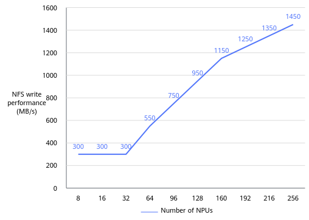
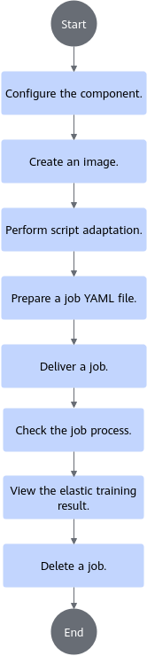

# Elastic Training <a name="ZH-CN_TOPIC_0000002479227142"></a>

<!-- md-trans-meta sourceCommit=unknown translatedAt=2026-06-30T12:21:26.355Z pushedAt=2026-06-30T12:23:24.376Z -->

## Before You Start <a name="ZH-CN_TOPIC_0000002479227148"></a>

>[!NOTE]
>This section describes elastic training based on the Resilience Controller component, which has reached the end of life. Related documents will be deleted on the 30th of September, 2026. For the latest elastic training capabilities, see [Elastic Training](../usage/resumable_training/01_solutions_principles.md#elastic-training).

If a hardware fault occurs and no backup device is available, the cluster scheduling components isolate the faulty node, reset the number of job replicas based on the preset job scale and the number of available nodes in the current cluster, and perform rescheduling and retraining (script adaptation is required).

**Prerequisites <a name="section722033433815"></a>**

- Ensure that the environment has a corresponding storage solution configured. For example, to use the network file system (NFS), perform operations as described in [Installing NFS](./common_operations.md#installing-nfs).

    NFS requires you to isolate directories based on usage. The random read/write performance of NFS must be capable of saving a complete checkpoint file within 15 minutes. It is recommended that you use professional storage servers. The specific performance requirements for NFS are provided as a reference below.

    

- To use the elastic training feature in a command-line scenario, ensure that the following components are installed.
    - Ascend Device Plugin
    - Ascend Docker Runtime
    - Volcano (Only Volcano can be used as the scheduler to allow for elastic training)
    - Ascend Operator
    - NodeD
    - Resilience Controller
    - ClusterD

- If not installed, refer to the [Installation and Deployment](../developer_guide/installation_deployment/manual_installation/00_obtaining_software_packages.md) section for operations.

**Usage Method<a name="section1215781619816"></a>**

The usage method of the elastic training feature is as follows:

- [Using via Command Line](#ZH-CN_TOPIC_0000002511427031): Install cluster scheduling components and use the elastic training feature via the command line.
- [Using After Integration](#ZH-CN_TOPIC_0000002511347077): Integrate the cluster scheduling components into an existing third-party AI platform or an AI platform developed based on these component.

**Usage Notes<a name="section252320491398"></a>**

- Resource monitoring can be used together with all features in training scenarios.
- When multiple training jobs run simultaneously in a cluster, each job can use different features.
- When a training node managed by cluster scheduling components encounters a fault (a network fault or chip fault on a node where the Ascend AI Processor is installed and NodeD is enabled), the cluster scheduling components isolate the faulty node and reset the number of job replicas based on the preset job scale and the number of available nodes in the current cluster. This allows for rescheduling and retraining (note that script adaptation is required).
- The rescheduling function is implemented by Kubernetes (K8s for short) in conjunction with Volcano or other schedulers.
- For more details, see [Table 1](#table1337017499206).

    **Table 1** Usage notes

    <a name="table1337017499206"></a>
    <table><thead align="left"><tr id="row1537112499205"><th class="cellrowborder" valign="top" width="20%" id="mcps1.2.3.1.1"><p id="p1737115497204"><a name="p1737115497204"></a><a name="p1737115497204"></a>Scenario</p>
    </th>
    <th class="cellrowborder" valign="top" width="80%" id="mcps1.2.3.1.2"><p id="p73711249152017"><a name="p73711249152017"></a><a name="p73711249152017"></a>Description</p>
    </th>
    </tr>
    </thead>
    <tbody><tr id="row12371949152010"><td class="cellrowborder" rowspan="2" valign="top" width="20%" headers="mcps1.2.3.1.1 "><p id="p5371204918208"><a name="p5371204918208"></a><a name="p5371204918208"></a>Environment requirements</p>
    <p id="p53711949192013"><a name="p53711949192013"></a><a name="p53711949192013"></a></p>
    </td>
    <td class="cellrowborder" valign="top" width="80%" headers="mcps1.2.3.1.2 "><p id="p317010582217"><a name="p317010582217"></a><a name="p317010582217"></a>Ensure that the time on all nodes in the <span id="ph1093220553219"><a name="ph1093220553219"></a><a name="ph1093220553219"></a>K8s</span> cluster is synchronized to prevent incorrect program determination</p>
    </td>
    </tr>
    <tr id="row1937117496204"><td class="cellrowborder" valign="top" headers="mcps1.2.3.1.1 "><p id="p132798152215"><a name="p132798152215"></a><a name="p132798152215"></a>It is recommended that the IP address used to check the connectivity between NPUs be set to the IP address of the router.</p>
    </td>
    </tr>
    <tr id="row12371154922014"><td class="cellrowborder" rowspan="3" valign="top" width="20%" headers="mcps1.2.3.1.1 "><p id="p83713498203"><a name="p83713498203"></a><a name="p83713498203"></a>Fault handling</p>
    <p id="p16371114912201"><a name="p16371114912201"></a><a name="p16371114912201"></a></p>
    <p id="p20371194932016"><a name="p20371194932016"></a><a name="p20371194932016"></a></p>
    </td>
    <td class="cellrowborder" valign="top" width="80%" headers="mcps1.2.3.1.2 "><p id="p471123192217"><a name="p471123192217"></a><a name="p471123192217"></a>If a fault occurs when a single-server system with multiple processors is used for training, the original job specifications are preferentially used for recovery, and the job specifications comply with the eight-processor, four-processor, dual-processor, or single-processor recovery policy.</p>
    </td>
    </tr>
    <tr id="row43711949102018"><td class="cellrowborder" valign="top" headers="mcps1.2.3.1.1 "><p id="p1611164119224"><a name="p1611164119224"></a><a name="p1611164119224"></a>If a new fault occurs in the job while <span id="ph23311639112215"><a name="ph23311639112215"></a><a name="ph23311639112215"></a>Resilience Controller</span> is rescheduling the job, it will not be processed.</p>
    </td>
    </tr>
    <tr id="row53711449152015"><td class="cellrowborder" valign="top" headers="mcps1.2.3.1.1 "><p id="p45358632316"><a name="p45358632316"></a><a name="p45358632316"></a>In scenarios with limited cluster resources, when multiple jobs fail simultaneously and trigger rescheduling, jobs may enter a Pending state due to insufficient resources.</p>
    </td>
    </tr>
    <tr id="row046671715231"><td class="cellrowborder" rowspan="3" valign="top" width="20%" headers="mcps1.2.3.1.1 "><p id="p1471143519233"><a name="p1471143519233"></a><a name="p1471143519233"></a>Feature dDescription</p>
    </td>
    <td class="cellrowborder" valign="top" width="80%" headers="mcps1.2.3.1.2 "><p id="p87431448172312"><a name="p87431448172312"></a><a name="p87431448172312"></a>This feature is not applicable to virtual instances.</p>
    </td>
    </tr>
    <tr id="row1526201918238"><td class="cellrowborder" valign="top" headers="mcps1.2.3.1.1 "><p id="p57511456152312"><a name="p57511456152312"></a><a name="p57511456152312"></a>This feature currently supports distributed vcjob-type training jobs with data parallelism and hybrid parallelism across servers and chips.</p>
    </td>
    </tr>
    <tr id="row16951221172311"><td class="cellrowborder" valign="top" headers="mcps1.2.3.1.1 "><p id="p1993291632412"><a name="p1993291632412"></a><a name="p1993291632412"></a>This feature only supports device fault and server network fault detection, as described below:</p>
    <a name="ul175182082413"></a><a name="ul175182082413"></a><ul id="ul175182082413"><li>Device faults support include <span class="parmvalue" id="parmvalue11232151011244"><a name="parmvalue11232151011244"></a><a name="parmvalue11232151011244"></a>"service re-execution"</span>, <span class="parmvalue" id="parmvalue112321310182410"><a name="parmvalue112321310182410"></a><a name="parmvalue112321310182410"></a>"chip hot reset"</span>, and <span class="parmvalue" id="parmvalue1423217104248"><a name="parmvalue1423217104248"></a><a name="parmvalue1423217104248"></a>"chip isolation"</span> types reported by the DCMI in <span id="ph1914015620494"><a name="ph1914015620494"></a><a name="ph1914015620494"></a><a href="https://support.huawei.com/enterprise/zh/doc/EDOC1100568349" target="_blank" rel="noopener noreferrer">Atlas Center Training Server 26.0.RC1 Health Management Fault Definition</a></span>.</li><li>Device network faults detected by the device network probing tool hccn_tool; server network faults depend on the node status reporting mechanism of<span id="ph1523271015245"><a name="ph1523271015245"></a><a name="ph1523271015245"></a>NodeD</span>. If <span id="ph1123281019246"><a name="ph1123281019246"></a><a name="ph1123281019246"></a>NodeD</span> is not correctly installed or the network between nodes is unreachable, the fault detection function will be affected.</li></ul>
    </td>
    </tr>
    </tbody>
    </table>

**Supported Product Forms<a name="section10503153618487"></a>**

Atlas 800 training servers

**Usage Process<a name="section9435132545416"></a>**

The process of using the elastic training feature via the command line can be seen in [Figure 1](#fig1445992135513).

**Figure 1** Usage process<a name="fig1445992135513"></a>


## Using via Command Line (Volcano)<a name="ZH-CN_TOPIC_0000002511427031"></a>

### (Optional) Configuring Components<a name="ZH-CN_TOPIC_0000002479227154"></a>

If you have already configured elastic training-related functions when installing Ascend Device Plugin and NodeD, this chapter can be skipped; if not configured, [MindCluster Ascend Device Plugin](#zh-cn_topic_0000001609393673_section22911654123018) and [MindCluster NodeD](#section4599195414500) need to be configured accordingly to use this feature properly.

**Configure Ascend Device Plugin<a name="zh-cn_topic_0000001609393673_section22911654123018"></a>**

When the rescheduling policy is enabled, exceptions in Ascend Device Plugin will also trigger fault rescheduling.

1. Modify the startup YAML of Ascend Device Plugin. The modifications are shown in bold below.

    <pre codetype="yaml">
    ...
          containers:
          - image: ascend-k8sdeviceplugin:v{version}
            name: device-plugin-01
            resources:
              requests:
                memory: 500Mi
                cpu: 500m
              limits:
                memory: 500Mi
                cpu: 500m
            command: [ "/bin/bash", "-c", "--"]
            args: [ "device-plugin
                     -useAscendDocker=true
                     <strong>-volcanoType=true                    # Volcano must be used in rescheduling scenarios.</strong>
                     <strong>-autoStowing=true                    # Whether to enable automatic node management. The default value is true. Setting it to false disables automatic node management. When the chip health status changes from unhealthy to healthy, it will not be automatically added to the schedulable resource pool. When automatic node management is disabled, the chip will not be automatically added to the schedulable resource pool after the parameter plane network fault is recovered. This feature is only applicable to Atlas training series products.</strong>
                     -listWatchPeriod=5                   # Set the health status check interval, in seconds. Range: [3, 1800]
                     -logFile=/var/log/mindx-dl/devicePlugin/devicePlugin.log
                     -logLevel=0" ]
            securityContext:
              privileged: true
              readOnlyRootFilesystem: true
    ...</pre>

2. Run the following command on the K8s management node to start Ascend Device Plugin.

    ```shell
    kubectl apply -f device-plugin-xxx-v{version}.yaml
    ```

    For example, to start the component on Atlas training product, run the following command:

    ```shell
    kubectl apply -f device-plugin-volcano-v26.0.0.yaml
    ```

**Configuring NodeD<a name="section4599195414500"></a>**

You can manually modify the startup YAML file of NodeD to configure the node status reporting interval.

1. Run the following command to edit the startup YAML file of NodeD.

    ```shell
    vi noded-v{version}.yaml
    ```

2. Modify the `-reportInterval` parameter in the `args` line of the YAML file as shown below:

    ```Yaml
    ...
              env:
                - name: NODE_NAME
                  valueFrom:
                    fieldRef:
                      fieldPath: spec.nodeName
              imagePullPolicy: Never
              command: [ "/bin/bash", "-c", "--"]
              args: [ "/home/hwMindX/noded -logFile=/var/log/mindx-dl/noded/noded.log -logLevel=0 -reportInterval=5" ]
              securityContext:
                readOnlyRootFilesystem: true
                allowPrivilegeEscalation: false
                capabilities:
                  drop: [ "ALL" ]
                runAsUser: 9000
                runAsGroup: 9000
              volumeMounts:
                - name: log-noded
    ...
    ```

### Image Creation<a name="ZH-CN_TOPIC_0000002511427037"></a>

Elastic training requires a training base image. You need to create it by referring to the [Image Creation](./common_operations.md) section based on the training framework you are using.

>[!NOTE]
>For the [Pangu model](#ZH-CN_TOPIC_0000002479387110) of the MindSpore framework, you also need to refer to this chapter to create an image adapted to the Pangu model.

**Prerequisites** <a name="zh-cn_topic_0272789326_section193545302315"></a>

Obtain the software packages for the corresponding operating system, as well as the Dockerfile and script files required for image creation, as shown in [Table 1](#zh-cn_topic_0272789326_table13971125465512). In the name of the checkpoint resume training software package, `{version}` represents the version number.

**Table 1** Required software

<a name="zh-cn_topic_0272789326_table13971125465512"></a>

| Software Package | Mandatory | Description | How to Obtain |
|--|--|--|--|
| mindformers-<em>{version}</em>-py3-none-any.whl | Yes | MindSpore Transformers suite, a full-process development suite for building large model training, fine-tuning, evaluation, inference, and deployment. For the master version of MindSpore, use the r0.3 branch code version. | [Obtain Link](https://gitcode.com/mindspore/mindformers/tree/master) |
| Dockerfile | Yes | Required for image creation. | Prepared by the user based on their service requirements. |

To prevent software packages from being maliciously tampered with during transmission or storage, you need to download the corresponding digital signature file for integrity verification when downloading the software package.

After downloading the software package, refer to the *[OpenPGP Signature Verification Guide](https://support.huawei.com/enterprise/en/doc/EDOC1100209376)* to perform PGP digital signature verification on the software package downloaded from the Support website. If the verification fails, do not use the software package and contact Huawei technical support engineers first.

Before installing or upgrading using the software package, you also need to verify the digital signature of the software package following the above process to ensure that the software package has not been tampered with.

For carrier customers, please visit [https://support.huawei.com/carrier/digitalSignatureAction](https://support.huawei.com/carrier/digitalSignatureAction).

For enterprise customers, please visit [https://support.huawei.com/enterprise/en/tool/pgp-verify-TL1000000054](https://support.huawei.com/enterprise/en/tool/pgp-verify-TL1000000054).

>[!NOTE]
>This section uses Ubuntu as an example.

**Operation Steps<a name="section173381914413"></a>**

1. Log in to the server as the `root` user.
2. Upload the prepared MindFormers source code software package to any directory on the server (such as `/home/test`).
3. Perform the following steps to prepare a Dockerfile.
4. Go to the directory where the software package is located and run the following command to create a Dockerfile file (example filename: "Dockerfile").

        ```shell
        vi Dockerfile
        ```

5. Refer to the [Dockerfile](#zh-cn_topic_0272789326_li104026527188) writing example, write the content into the Dockerfile file, and then run the `:wq` command to save the content.

6. Go to the directory where the software package is located and run the following command to build the container image. **Note: Do not omit the dot (".") at the end of the command**.

    ```shell
    docker build -t  [OPTIONS] Image name_System architecture:Image tag .
    ```

For example:

    ```shell
    docker build -t test_train_arm64:v1.0 .
    ```

[Table 2](#zh-cn_topic_0272789326_zh-cn_topic_0256378845_table47051919193111) describes parameters in the command.

    **Table 2** Command parameter description

    <a name="zh-cn_topic_0272789326_zh-cn_topic_0256378845_table47051919193111"></a>

    |Parameter|Description|
    |--|--|
    |-t|Image name|
    |OPTIONS|"--disable-content-trust" option: Ignores verification, which is enabled by default. For security reasons, it is recommended to disable this option.|
    |Image name_System architecture:Image tag|Image name and tag. Change them based on the actual situation.|

    When "Successfully built xxx" appears, it indicates that the image has been built successfully.

7. After the build is complete, run the following command to view the image information.

    ```shell
    docker images
    ```

    Command output:

    ```ColdFusion
    REPOSITORY                TAG                 IMAGE ID            CREATED             SIZE
    test_train_arm64          v1.0                d82746acd7f0        27 minutes ago      749MB
    ```

**Writing Examples<a name="zh-cn_topic_0272789326_section3523631151714"></a>**

Modify the software package version and architecture based on the actual situation.

1. <a name="zh-cn_topic_0272789326_li104026527188"></a>Dockerfile writing examples

    - Ubuntu Arm:

        ```Dockerfile
        FROM xxx # Base training image
        ARG MINDFORMERS_PKG=mindformers-{version}-py3-none-any.whl

        WORKDIR /tmp
        COPY . ./

        ENV http_proxy xxx
        ENV https_proxy xxx

        # Configure Python pip source
        RUN mkdir -p ~/.pip \
        && echo '[global] \n\
        index-url=https://pypi.doubanio.com/simple/\n\
        trusted-host=pypi.doubanio.com' >> ~/.pip/pip.conf

        # Install MindFormers
        RUN pip install $MINDFORMERS_PKG


        ENV http_proxy ""
        ENV https_proxy ""

        ```

    - Ubuntu x86_64:

        ```Dockerfile
        FROM xxx # Base training image
        ARG MINDFORMERS_PKG=mindformers-{version}-py3-none-any.whl

        WORKDIR /tmp
        COPY . ./

        ENV http_proxy xxx
        ENV https_proxy xxx

        # # Configure Python pip source
        RUN mkdir -p ~/.pip \
        && echo '[global] \n\
        index-url=https://pypi.doubanio.com/simple/\n\
        trusted-host=pypi.doubanio.com' >> ~/.pip/pip.conf

        # # Install MindFormers
        RUN pip install $MINDFORMERS_PKG


        ENV http_proxy ""
        ENV https_proxy ""

        ```

    To make the Dockerfile more secure, you can define `HEALTHCHECK` in it based on business needs. The container's health status is checked by running the **HEALTHCHECK** _\[OPTIONS\]_ **CMD** command inside the container.

### Script Adaptation <a name="ZH-CN_TOPIC_0000002479387132"></a>

This chapter provides fault recovery script adaptation examples. Select a script adaptation example based on your actual requirements.

- ResNet50 model adaptation
    - [PyTorch-based fault recovery](#section72859254718)
    - [MindSpore-based fault recovery](#section127532091511)

- Pangu_alpha model adaptation (MindSpore framework)

    [Pangu_alpha-based fault recovery example](#section1844516123710)

> [!NOTE]
> The sample model code provided below may differ from the actual version. Please use the actual version code.

**Example of PyTorch-based Fault Recovery<a name="section72859254718"></a>**

1. <a name="li14102111234717"></a>Download "ResNet50_ID4149_for_PyTorch" from the master branch of the [PyTorch code repository](https://gitcode.com/Ascend/ModelZoo-PyTorch/tree/master/PyTorch/built-in/cv/classification/ResNet50_ID4149_for_PyTorch) as the training code.
2. Prepare the dataset corresponding to ResNet50 on your own, and comply with the corresponding specifications when using it.
3. The administrator user uploads the dataset to the storage node.
    1. Go to the `/data/atlas_dls/public` directory and upload the dataset to any location, such as `/data/atlas_dls/public/dataset/resnet50/imagenet`.

        ```shell
        root@ubuntu:/data/atlas_dls/public/dataset/resnet50/imagenet# pwd
        ```

        Command output:

        ```ColdFusion
        /data/atlas_dls/public/dataset/resnet50/imagenet
        ```

    2. Run the **du -sh** command to check the dataset size.

        ```shell
        root@ubuntu:/data/atlas_dls/public/dataset/resnet50/imagenet# du -sh
        ```

        Command output:

        ```ColdFusion
        11G
        ```

4. Decompress the training code downloaded in [Step 1](#li14102111234717) to the local host, and upload the `ModelZoo-PyTorch/PyTorch/built-in/cv/classification/ResNet50_ID4149_for_PyTorch` directory from the decompressed training code to the environment, such as the `/data/atlas_dls/public/code/` directory.
5. Go to the [mindcluster-deploy](https://gitcode.com/Ascend/mindxdl-deploy) repository, switch to the corresponding branch according to the [mindcluster-deploy open-source repository version description](./appendix.md#mindcluster-deploy-open-source-repository-version-description), obtain the `train_start.sh`, `utils.sh`, and `rank_table.sh` files from the `samples/train/resumable-training/fault-rescheduling/withRanktable/pytorch/resnet50` directory, create a `scripts` directory in the training code, and construct the following directory structure on the management node.

    ```text
    root@ubuntu:/data/atlas_dls/public/code/ResNet50_ID4149_for_PyTorch/scripts/#
    scripts/
    ├── rank_table.sh
    ├── utils.sh
    └── train_start.sh
    ```

6. Modify the main.py code under the `/data/atlas_dls/public/code/ResNet50_ID4149_for_PyTorch` path. Modify the bolded content below, which involves logic adjustments for model saving and loading.

    <pre codetype="Python">
    import argparse
    <strong>import glob</strong>
    import os
    ...
        if args.resume:
            <strong>candidate_ckpt_path = ""</strong>
            <strong>for p in glob.glob(f"./rank*"):</strong>
                <strong>best_ckpt_path = os.path.join(p, "model_best.pth.tar")</strong>
                <strong>if os.path.exists(best_ckpt_path):</strong>
                    <strong>candidate_ckpt_path = best_ckpt_path</strong>
                    <strong>break</strong>
            <strong>if candidate_ckpt_path:</strong>
                <strong>print("[gpu id:", args.gpu, "]", "=> loading checkpoint '{}'".format(candidate_ckpt_path))</strong>
                <strong># Map model to be loaded to specified single npu.</strong>
                <strong>loc = 'npu:{}'.format(args.gpu)</strong>
                <strong>checkpoint = torch.load(candidate_ckpt_path, map_location=loc)</strong>
                <strong>print(f"load checkpoint to : {loc}")</strong>
                <strong>args.start_epoch = checkpoint['epoch']</strong>
                <strong>best_acc1 = checkpoint['best_acc1']</strong>
                <strong>model.load_state_dict(checkpoint['state_dict'])</strong>
                <strong>optimizer.load_state_dict(checkpoint['optimizer'])</strong>
                <strong>print("[gpu id:", args.gpu, "]", "=> loaded checkpoint '{}' (epoch {})".format(candidate_ckpt_path, checkpoint['epoch']))</strong>
            <strong>else:</strong>
                <strong>print("no valid ckpt found to resume.")</strong>
    ...
            if not args.multiprocessing_distributed or (args.multiprocessing_distributed and args.rank % ngpus_per_node == 0):
                <strong>save_path = f"./rank_{args.rank}"</strong>
                <strong>if not os.path.exists(save_path):</strong>
                    <strong>os.makedirs(save_path, exist_ok=True)</strong>
                save_checkpoint({
                    'epoch': epoch + 1,
                    'arch': args.arch,
                    'state_dict': model.state_dict(),
                    'best_acc1': best_acc1,
                    'optimizer': optimizer.state_dict(),
                <strong>}, is_best, save_path=save_path)</strong>
    ...
    ...
            # Modify the original save_checkpoint function
    <strong>def save_checkpoint(state, is_best, filename='checkpoint.pth.tar', save_path="./"):</strong>
        <strong>if is_best:</strong>
            <strong>target_path = os.path.join(save_path, 'model_best.pth.tar')</strong>
            <strong>torch.save(state, target_path)</strong>
            <strong>print(f"save ckpt to {target_path} done. Best epoch for now is :{state['epoch']}")</strong></pre>

**Example of MindSpore Fault Recovery<a name="section127532091511"></a>**

1. Download the master branch code from the [MindSpore code repository](https://gitee.com/mindspore/models/tree/master/official/cv/ResNet), rename the `models/official/cv/ResNet` directory to `resnet` and use it as the training code.
2. Run the following command to create a code directory on the management node and upload the training code to this directory.

    ```shell
    mkdir /data/atlas_dls/code
    ```

3. Go to the [mindcluster-deploy](https://gitcode.com/Ascend/mindxdl-deploy) repository, enter the corresponding branch according to the [mindcluster-deploy open-source repository version description](./appendix.md#mindcluster-deploy-open-source-repository-version-description), obtain the `train_start.sh` and `main.sh` files from the `samples/train/resumable-training/fault-rescheduling/withRanktable/mindspore/resnet50` directory, and combine them with the `resnet/scripts` directory in the training code to construct the following directory structure on the management node.

    ```text
    root@ubuntu:/data/atlas_dls/public/code/resnet/scripts/#
    scripts/
    ├── main.sh
     ...
    ├── run_distribute_train.sh
    ├── run_distribute_train_gpu.sh
    └── train_start.sh
    ```

4. Modify the `train_start.sh` file in the `/data/atlas_dls/public/code/resnet/scripts` directory.

    1. Change `dataset_path` to the actual dataset directory in the container.
    2. Change `config_yaml_path` to the actual configuration file path in the container.

    ```shell
    # Modify the parameters based on your needs (global configuration parameters: dataset path and configuration file path). For other model adaptation, add or delete parameters based on your needs.
    dataset_path=/job/data/imagenet/train
    config_yaml_path=/job/code/resnet/resnet50_imagenet2012_config.yaml
    ```

    The `train_start.sh` script starts the training job by calling the `main.sh` script. When adapting other models, adjust the environment variable configuration, startup script path, and startup script parameters in the `main.sh` script according to the usage guide of their training startup script (`train.py` in this example).

    ```shell
    # main.sh: For this example (ResNet50 model), you do not need to modify this script. For other model adaptations, add, delete, or modify environment variable configurations as needed, then modify the training startup script path and corresponding parameters, i.e., the Python command invocation part in the main.sh script.
    # In this example, the Python command for single-server single-processor is as follows:
    python ${ROOT_PATH}/../train.py --data_path=${DATA_PATH} --config_path=${CONFIG_PATH}
    # In this example, the commands for single-server multi-processor and distributed training are as follows:
    python ${ROOT_PATH}/../train.py --run_distribute=True --device_num=${RANK_SIZE} --data_path=${DATA_PATH} --config_path=${CONFIG_PATH}
    ```

5. Modify the configuration file `resnet50_imagenet2012_config.yaml` in the `/data/atlas_dls/public/code/resnet/config/` directory. Configure model and graph build saving and loading functions.

    ```Yaml
    ...
    run_distribute: False
    enable_profiling: False
    data_path: "/cache/data"
    output_dir: "/job/code/output" # Modify the checkpoint save path according to the actual situation.
    load_path: "/cache/checkpoint_path/"
    device_target: "Ascend"
    checkpoint_path: "./checkpoint/"
    checkpoint_file_path: ""
    ...
    net_name: "resnet50"
    dataset: "imagenet2012"
    device_num: 1
    pre_trained: "/job/code/output/resnet50/imagenet2012/ckpt" # Actual in-container pre-trained model loading path (supports directories and files). Fuzzy search for .ckpt files is supported in the specified path, and the latest .ckpt file will be found and loaded. Refer to the training YAML and modify it according to the actual situation.
    run_eval: False
    eval_dataset_path: ""
    parameter_server: False
    filter_weight: False
    save_best_ckpt: True
    eval_start_epoch: 40
    ...
    network_dataset: "resnet50_imagenet2012"


    # Retraining options
    save_graphs: False  # Whether to save graph compilation results
    save_graphs_path: "./graphs" # Graph compilation result save path
    has_trained_epoch: 0 # Epoch of model pre-training; defaulte to 0
    has_trained_step: 0 # Step of model pre-training; defaulte to 0
    ---
    # Help description for each configuration item
    enable_modelarts: "Whether training on modelarts, default: False"
    ...
    batch_size: "Batch size for training and evaluation"
    epoch_size: "Total training epochs."
    checkpoint_path: "The location of the checkpoint file."
    checkpoint_file_path: "The location of the checkpoint file."
    save_graphs: "Whether save graphs during training, default: False."
    save_graphs_path: "Path to save graphs."
    ```

6. The startup script for the resnet code is `train.py`. Check whether there is code for saving checkpoints in `train.py`. An example code snippet is as follows.

    - If it exists, skip this step.
    - If it does not exist, add the following sample code for saving checkpoints. The parameters used need to be defined and set by the user in the configuration file. For other model adaptations, refer to the following snippet and add the code for saving checkpoints based on the specific content of the startup script. If needed, refer to the [official MindSpore tutorial](https://www.mindspore.cn/en) for modifications.

    <pre codetype="Python">
    ...
        # Model saving code
        <strong>if config.save_checkpoint:</strong>
            ckpt_append_info = [{"epoch_num": 0, "step_num": 0}]
            config_ck = CheckpointConfig(save_checkpoint_steps=config.save_checkpoint_epochs * step_size,
                                         keep_checkpoint_max=config.keep_checkpoint_max,
                                         append_info=ckpt_append_info)
            <strong>ckpt_cb = ModelCheckpoint(prefix=config.net_name, directory=config.save_ckpt_dir+"_"+str(config.rank_id), config=config_ck)</strong>
            cb += [ckpt_cb]
    ...</pre>

7. The startup script for the resnet code is `train.py`. Check whether the code for loading checkpoints exists in `train.py`. If it does, the configuration is complete, and you can proceed to the next chapter. Otherwise, go to [Step 8](#li1621315181018).
8. <a name="li1621315181018"></a>Add the code for loading checkpoints in `train.py`. The following is a checkpoint loading example, where the parameters used need to be defined and set by the user in the configuration file. For other model adaptations, refer to the following snippet and add the checkpoint loading code based on the specific content of the startup script. If necessary, refer to the [official MindSpore tutorial](https://www.mindspore.cn/en) for modifications.
    1. Modify `src/utils.py` and add the code for reading the epoch. After loading the checkpoint, the training log will start printing from the epoch at which the checkpoint was saved.

        <pre codetype="Python">
        ...
        def init_weight(net, cfg):
            """init_weight"""
            if cfg.pre_trained:
                if not os.path.isfile(cfg.pre_trained):
                    cfg.logger.warning("There is not ckpt file: %s", cfg.pre_trained)
                else:
                    param_dict = ms.load_checkpoint(cfg.pre_trained)
                    if cfg.filter_weight:
                        filter_list = [x.name for x in net.end_point.get_parameters()]
                        filter_checkpoint_parameter_by_list(param_dict, filter_list)
                    ms.load_param_into_net(net, param_dict)
                    <strong>cfg.start_epoch = int(param_dict.get('epoch_num', ms.Tensor(0, ms.int32)).asnumpy().item())</strong>
                    cfg.logger.info("Pre trained ckpt mode: %s loading", cfg.pre_trained)
        ...</pre>

    2. Modify `train.py`, replace the original `init_weight` function, and `use _try_to_init_weight` to attempt loading the checkpoint file, avoiding the issue of loading an incomplete checkpoint that causes training errors.

        ```Python
        import glob
        ...
        # Find the latest *.ckpt file in the pre_trained directory
        def _find_latest_ckpt():
            ckpt_files = glob.glob(config.pre_trained+"*/*.ckpt")
            if ckpt_files:
                ckpt_files.sort(key=os.path.getmtime, reverse=True)
            return ckpt_files

        # Attempt to load the *.ckpt file, with the number of attempts being INIT_WEIGHT_MAX_ATTEMPTS
        def _try_to_init_weight(net, config):
            if os.path.isfile(config.pre_trained):
                latest_ckpt = [config.pre_trained]
            else:
                latest_ckpt = _find_latest_ckpt()

            if not latest_ckpt:
                config.logger.warning("There is not ckpt file: %s", config.pre_trained)
                return

            init_weight_attempts = 0
            INIT_WEIGHT_MAX_ATTEMPTS = 5
            while(latest_ckpt and init_weight_attempts < INIT_WEIGHT_MAX_ATTEMPTS):
                try:
                    config.pre_trained = latest_ckpt[0]
                    init_weight(net, config)
                    break
                except Exception:
                    config.logger.warning("Pre trained ckpt %s format is incorrect, try to load the last most recent ckpt", config.pre_trained)
                    if latest_ckpt[1:]:
                        latest_ckpt = latest_ckpt[1:]
                        init_weight_attempts+=1
                        continue
                    else:
                        config.logger.error("no more ckpt to load", config.pre_trained)
                        raise ValueError("ckpt format is incorrect, no more ckpt to load, load ckpt failed.")

        ...
        @moxing_wrapper()
        def train_net():
            """train net"""
            target = config.device_target
            set_parameter()
            set_output_dir(config)
            config.logger = get_logger(config.log_dir, config.rank_id, config.parameter_server)
            dataset = create_dataset(dataset_path=config.data_path, do_train=True,
                                     batch_size=config.batch_size, train_image_size=config.train_image_size,
                                     eval_image_size=config.eval_image_size, target=target,
                                     distribute=config.run_distribute)
            step_size = dataset.get_dataset_size()
            net = resnet(class_num=config.class_num)
            if config.parameter_server:
                net.set_param_ps()
            # Replace the original init_weight function, use _try_to_init_weight to attempt loading the *.ckpt file, and avoid loading an incomplete *.ckpt that causes training errors
            _try_to_init_weight(net, config)

            if config.resume_ckpt:
                resume_param = ms.load_checkpoint(config.resume_ckpt,
                                                  choice_func=lambda x: not x.startswith(('learning_rate', 'global_step')))
                config.start_epoch = int(resume_param.get('epoch_num', ms.Tensor(0, ms.int32)).asnumpy().item())
            lr = ms.Tensor(init_lr(step_size=step_size))
        ...
        ```

**Example of Pangu_alpha Adaptation<a name="section1844516123710"></a>**

1. Download the master branch code from the [MindSpore code repository](https://gitee.com/mindspore/models/tree/master/official/nlp/Pangu_alpha), rename the `models/official/nlp/Pangu_alpha` directory to `pangu_alpha` and use it as the training code. When using this version of the model script, ensure that the MindSpore version installed in the image is not lower than 2.0.0, and install the MindFormers component.
2. Run the following command to create the code directory on the management node.

    ```shell
    mkdir /data/atlas_dls/code
    ```

3. Go to the "[mindcluster-deploy](https://gitcode.com/Ascend/mindxdl-deploy)" repository, enter the corresponding branch according to the [mindcluster-deploy open-source repository version description](./appendix.md#mindcluster-deploy-open-source-repository-version-description), obtain the `train_start.sh` and `main.sh` files from the `samples/train/resumable-training/fault-rescheduling/withRanktable/mindspore/pangu_alpha` directory, and construct the following directory structure on the management node in combination with the `pangu_alpha/scripts` directory in the training code. For the Pangu 100B model, use the corresponding files in the `samples/train/resumable-training/fault-rescheduling/withRanktable/mindspore/pangu_alpha_13B` directory.

    ```text
    root@ubuntu:/data/atlas_dls/code/pangu_alpha/scripts/#
    scripts/
    ├── main.sh
    ├── run_cluster_export.sh
    ├── run_distribute_eval_gpu.sh
    ├── run_distribute_eval.sh
     ...
    ├── run_distribute_train.sh
    ├── run_standalone_eval.sh
    ├── run_standalone_export.sh
    ├── run_standalone_predict.sh
    └── train_start.sh
    ```

4. Modify the `train_start.sh` file in the `/data/atlas_dls/code/pangu_alpha/scripts` directory, and change `dataset` to the actual in-container dataset directory.

    ```shell
    ...
    # Training dataset path, modify according to the actual situation
    # Security tip: involves validation of paths and input parameters
    dataset="/job/data/train_data"

    # Set training environment variables
    set_env

    # Single-server training scenario
    if [[ "$server_count" == "1" ]]; then
        server_id=0
        if [ ${device_count} -lt 8 ]; then
            echo "Less than 8 card training is not supported for pangu alpha model." | tee log
        fi
        if [ ${device_count} -eq 8 ]; then
            bash main.sh ${device_count} ${server_count} ${RANK_TABLE_FILE} ${server_id} ${dataset}
        fi

    # Distributed training scenario
    else
        server_id=$(get_server_id)
        if [ $? -eq 1 ];then
            echo "get server id failed."
            exit 1
        fi
        echo "server id is: "${server_id}
        bash main.sh ${device_count} ${server_count} ${RANK_TABLE_FILE} ${server_id} ${dataset}

    ```

5. Skip this step for models with 10 billion or fewer parameters. To train a model with hundreds of billions of parameters and recover it within 5 minutes, additional script adaptation is required. The following uses the master branch of Pangu_alpha code in the [MindSpore code repository](https://gitee.com/mindspore/models/tree/master/official/nlp/Pangu_alpha) as an example (**The elastic training job configuration and script adaptation have been completed.**).
    1. Modify the `src/pangu_alpha_config.py` file, mainly involving changes to three parameters: `args_opt.num_layers`, `args_opt.stage_num`, and `args_opt.micro_size`.

        ```Python
        def set_parse_200B(args_opt):
            """
                Set config for 200B mode
            """
            args_opt.embedding_size = 16384
            args_opt.num_layers = 32                 # Number of model layers
            args_opt.num_heads = 128
            if args_opt.per_batch_size == 0:
                args_opt.per_batch_size = 1
            args_opt.word_emb_dp = 0
            if args_opt.run_type == "train":
                args_opt.start_lr = 6e-5
                args_opt.end_lr = 6e-6
               args_opt.stage_num = 8               # Number of pipeline stages
               args_opt.micro_size = 16             # Micro-batch size in pipeline parallelism mode. Its value should be greater than args_opt.stage_num.
                args_opt.op_level_model_parallel_num = 16
                if args_opt.optimizer_shard = 1:
                    args_opt.op_level_model_parallel_num = 8
            elif args_opt.run_type == "predict":
                args_opt.stage_num = 4
                args_opt.micro_size = 1
                args_opt.op_level_model_parallel_num = 16
                if args_opt.optimizer_shard == 1:
                    args_opt.op_level_model_parallel_num = 8
        ```

    2. In addition, you need to specify or directly modify the `micro_batch_interleaved` parameter in `src/utils.py` to `1` (please refer to the calculation relationships among `stage_device_num`, `data_parallel_num`, `batch_size`, and `micro_batch_interleaved` in the `run_train_pipeline` function of the `train.py` script. The final result must satisfy that the `batch_size` value of `PanguAlphaConfig` is a multiple of `data_parallel` in `TransformerOpParallelConfig`).

6. Check whether there is code for saving checkpoints in `train.py` (startup script of the Pangu code). A code example is as follows.

    - If it exists, skip this step.
    - If it does not exist, add the following sample code for saving checkpoints. The parameters used can be defined and set in the configuration file `src/utils.py` by referring to [Step 9](#li13178638874).

    ```Python
    ...

        # Code for saving checkpoints
        add_checkpoint_callback_policy(args_opt, callback, rank)
    ...
    # Code definition for saving checkpoints
    def add_checkpoint_callback_policy(args_param, callback, rank_id):
        r"""
        Add checkpoint policy to callback.
        """
        # Security notice, involving validation of paths and input parameters
        if args_param.save_checkpoint:
            # Checkpoint saves epoch_num and step_num info
            ckpt_append_info = [{"epoch_num": args_param.has_trained_epoches, "step_num": args_param.has_trained_steps}]
            ckpt_config = CheckpointConfig(save_checkpoint_steps=args_param.save_checkpoint_steps,
                                           keep_checkpoint_max=args_param.keep_checkpoint_max,
                                           integrated_save=False,
                                           append_info=ckpt_append_info
                                           )


            ckpoint_cb = ModelCheckpoint(prefix=args_param.ckpt_name_prefix + str(rank_id),
                                         directory=os.path.join(args_param.save_checkpoint_path, f"rank_{rank_id}"),
                                         config=ckpt_config)


            callback.append(ckpoint_cb)
    ...
    ```

7. Check whether there is code for loading checkpoints in `train.py` (startup script of the Pangu code). If it exists, proceed to [Step 10](#li6181138370); otherwise, proceed to [Step 8](#li12175938673).
8. <a name="li12175938673"></a>Add the code for loading checkpoints in `train.py`. The following is a checkpoint loading example. Some checkpoint loading code already exists, and you need to add the checkpoint loading code related to the elastic training feature. The parameters used can be defined and set in the configuration file `src/utils.py` by referring to [Step 9](#li13178638874).

    ```Python
    ...
    # If the running model does not have pipeline parallelism enabled, modify the following function
    def set_parallel_context(args_opt):
    # If the running model has pipeline parallelism enabled, modify the following function
    # Security tip: involves validation of paths and input parameters
    def set_pipeline_parallel_context(args_opt):
    # Add the following code before mindspore.set_auto_parallel_context. Refer to [MindSpore tutorial on distributed parallel interface instructions](https://www.mindspore.cn/tutorials/experts/zh-CN/r2.0/index.html) for usage instructions of the set_auto_parallel_context parametert_auto_parallel_context parameter


            # Content added for elastic training
            if not os.path.exists(args_opt.strategy_load_ckpt_path):
                args_opt.strategy_load_ckpt_path = ""

            # Content added for elastic training. The strategy_ckpt_save_file_path parameter can be specified based on the in-container path.
            strategy_ckpt_save_file_path = '/job/data/code/fault_torlence/pangu_alpha/strategy.ckpt'
            if args_opt.strategy_load_ckpt_path == strategy_ckpt_save_file_path:
                 strategy_ckpt_save_file_path = '/job/data/code/fault_torlence/pangu_alpha/strategy_new.ckpt'

            # Change strategy_ckpt_save_file='strategy.ckpt' to strategy_ckpt_save_file=strategy_ckpt_save_file_path. If the strategy_ckpt_save_file parameter is not specified in set_auto_parallel_context, you need to manually add strategy_ckpt_save_file=strategy_ckpt_save_file_path, as shown in bold below.
            mindspore.set_auto_parallel_context(
                parallel_mode=args_opt.parallel_mode, gradients_mean=False, search_mode=args_opt.search_mode,
                full_batch=bool(args_opt.full_batch), loss_repeated_mean=True,
                device_num=device_num, enable_parallel_optimizer=bool(args_opt.optimizer_shard),
                pipeline_stages=args_opt.stage_num, enable_alltoall=bool(args_opt.enable_alltoall),
                strategy_ckpt_save_file=strategy_ckpt_save_file_path)

    ...
    ...
    # Checkpoint loading code definition
    # Security tip: involves validation of paths and input parameters
    def restore_checkpoint(args_param, sink_size, dataset, model, network, epoch):
        r"""
        Load checkpoint process.
        """
        print("======start single checkpoint", flush=True)
        ckpt_name = args_param.ckpt_name_prefix
        # For brevity and readability, the validation of the command-line parameters save_checkpoint_path and ckpt_name is omitted here. Users should add the relevant validation themselves.
        ckpt_pattern = os.path.join(args_param.save_checkpoint_path, "rank_{}".format(D.get_rank()),
                                    f"{ckpt_name}*.ckpt")
        ckpt_all_files = glob.glob(ckpt_pattern)
        if not ckpt_all_files:
            print(f"There is no ckpt file in {args_param.save_checkpoint_path}, "
                  f"current ckpt_files found is {ckpt_files} "
                  f"with pattern {ckpt_pattern}, so skip the loading.")
            return
        ckpt_exp_pattern = os.path.join(
            args_param.save_checkpoint_path,
            "rank_{}".format(D.get_rank()),
            f"{ckpt_name}*_breakpoint.ckpt",
        )
        ckpt_exp_files = glob.glob(ckpt_exp_pattern)
        ckpt_files = []
        for file in ckpt_all_files:
            if file not in ckpt_exp_files:
                ckpt_files.append(file)

        if not ckpt_files:
            print(
                f"There is no ckpt file in {args_param.save_checkpoint_path}, "
                f"current ckpt_files found is {ckpt_files} "
                f"with pattern {ckpt_pattern}, so skip the loading."
            )
            return
        ckpt_files.sort(key=os.path.getmtime, reverse=True)
        time_stamp = datetime.datetime.now()
        print(f"time stamp {time_stamp.strftime('%Y.%m.%d-%H:%M:%S')} pre trained ckpt model {ckpt_files} loading",
              flush=True)
        # Load the latest checkpoint file
        print(f'Start to load from {ckpt_files[0]}')
        param_dict = load_checkpoint(ckpt_files[0])
        if param_dict.get("epoch_num") and param_dict.get("step_num"):
            args_param.has_trained_epoches = int(param_dict["epoch_num"].data.asnumpy())
            args_param.has_trained_steps = int(param_dict["step_num"].data.asnumpy())
        model.build(train_dataset=dataset, sink_size=sink_size, epoch=epoch)
        load_param_into_net(network, param_dict)
    ...
    ```

9. <a name="li13178638874"></a>Modify the parameters in the `src/utils.py` file.

    ```Python
    ...
        opt.add_argument("--vocab_size",
                          type=int,
                          default=50304, # Modify based on the training dataset. This has been changed to the value of the sample dataset.
                          help="vocabulary size, default is 40000.")
    ...
        opt.add_argument("--data_column_name",
                         type=str,
                         default="text", # Modify based on the fields defined in the dataset. This has been changed to the value of the sample dataset.
                         help="Column name of datasets")
    ...
        parser.add_argument("--strategy_load_ckpt_path",
                            type=str,
                            default="/job/data/code/fault_torlence/pangu_alpha/strategy/strategy.ckpt", # In elastic training, specify the in-container path based on user habits, and the path will not be overwritten by training.
                            help="The training prallel strategy for the model.")
        parser.add_argument("--tokenizer_path",
                            type=str,
                            default="./tokenizer_path",
                            help="The path where stores vocab and vocab model file")
    ...
    def add_retrain_params(opt):
        """
        Add parameters about retrain.
        """
        opt.add_argument("--pre_trained",
                         type=str,
                         default="/job/data/code/fault_torlence/pangu_alpha/8p", # Specify the pre-trained model path
                         help="Pretrained checkpoint path.")
        opt.add_argument("--save_checkpoint_path",
                         type=str,
                         default="/job/data/code/fault_torlence/pangu_alpha/8p",   # Specify the model save path
                         help="Save checkpoint path.")
        opt.add_argument("--keep_checkpoint_max", # Specify the model saving policy: maximum number
                         type=int,
                         default=1,
                         help="Max checkpoint save number.")
        opt.add_argument("--save_checkpoint_steps", # Specify the model saving policy: save interval
                         type=int,
                         default=20,
                         help="Save checkpoint step number.")
        opt.add_argument("--save_checkpoint", # Specify whether to save the model for current training
                         type=ast.literal_eval,
                         default=True,
                         help="Whether save checkpoint in local disk.")
        opt.add_argument("--ckpt_name_prefix", # Specify the model saving policy: filename prefix
                         type=str,
                         default="pangu",
                         help="Saving checkpoint name prefix.")
    ...
    ```

10. <a name="li6181138370"></a>Create an empty file `group_info_env` in the `/data/atlas_dls/code/pangu_alpha` directory.

    ```text
    root@ubuntu:/data/atlas_dls/code/pangu_alpha/#
    pangu_alpha/
    ├── README.md
    ├── README_CN.md
    ├── group_info_env
     ...
    ├── scripts
    ├── serving_increment
    ├── src
    ├── tasks.py
    └── train.py
     ```

11. Modify the `group_info_env` path in the `train.py` file.

    ```Python
    ...
        # env variable prepare
        group_info_file = os.getenv("GROUP_INFO_FILE")
        if group_info_file:
            with open(os.path.expanduser("/job/code/group_info_env"), "a") as outfile:
                outfile.write(f"export GROUP_INFO_FILE_REFLECT={group_info_file}\n")
    ...
    ```

### Preparation of Job YAML Files<a name="ZH-CN_TOPIC_0000002479227132"></a>

#### YAML Selection<a name="ZH-CN_TOPIC_0000002479387110"></a>

YAML examples for elastic training are not provided. You can obtain the YAML examples for resumable training and modify them accordingly.

**Table 1**  YAML files

<a name="table194871213135113"></a>
<table><thead align="left"><tr id="row15488613165116"><th class="cellrowborder" valign="top" width="12.98259651930386%" id="mcps1.2.6.1.1"><p id="p1694212055114"><a name="p1694212055114"></a><a name="p1694212055114"></a>Job Type</p></th>
<th class="cellrowborder" valign="top" width="21.754350870174033%" id="mcps1.2.6.1.2"><p id="p894252065116"><a name="p894252065116"></a><a name="p894252065116"></a>Model</p></th>
<th class="cellrowborder" valign="top" width="21.754350870174033%" id="mcps1.2.6.1.3"><p id="p1694216209514"><a name="p1694216209514"></a><a name="p1694216209514"></a>YAML File Name</p></th>
<th class="cellrowborder" valign="top" width="21.754350870174033%" id="mcps1.2.6.1.4"><p id="p8942122025113"><a name="p8942122025113"></a><a name="p8942122025113"></a>Obtaining Link</p></th>
<th class="cellrowborder" valign="top" width="21.754350870174033%" id="mcps1.2.6.1.5"><p id="p7942172025115"><a name="p7942172025115"></a><a name="p7942172025115"></a>Description</p></th>
</tr>
</thead>
<tbody><tr id="row10488181375112"><td class="cellrowborder" rowspan="3" valign="top" width="12.98259651930386%" headers="mcps1.2.6.1.1 "><p id="p9942132045117"><a name="p9942132045117"></a><a name="p9942132045117"></a>Volcano Job</p>
</td>
<td class="cellrowborder" rowspan="2" valign="top" width="21.754350870174033%" headers="mcps1.2.6.1.2 "><p id="p1394262015120"><a name="p1394262015120"></a><a name="p1394262015120"></a>ResNet50</p>
</td>
<td class="cellrowborder" valign="top" headers="mcps1.2.6.1.1 "><p id="p92173245117"><a name="p92173245117"></a><a name="p92173245117"></a>a800_pytorch_vcjob.yaml</p>
</td>
<td class="cellrowborder" valign="top" headers="mcps1.2.6.1.2 "><p id="p191773377514"><a name="p191773377514"></a><a name="p191773377514"></a><a href="https://gitcode.com/Ascend/mindxdl-deploy/blob/branch_v26.0.0/samples/train/resumable-training/fault-rescheduling/withRanktable/pytorch/resnet50/yamls/910/a800_pytorch_vcjob.yaml" target="_blank" rel="noopener noreferrer">Get YAML</a></p>
</td>
<td class="cellrowborder" valign="top" width="21.754350870174033%" headers="mcps1.2.6.1.5 "><p id="p1694222015119"><a name="p1694222015119"></a><a name="p1694222015119"></a>A single-server eight-processor job is presented in the example file by default.</p>
<p id="p1161014614466"><a name="p1161014614466"></a><a name="p1161014614466"></a></p>
</td>
</tr>
<tr id="row348851319516"><td class="cellrowborder" valign="top" headers="mcps1.2.6.1.1 "><p id="p32203210515"><a name="p32203210515"></a><a name="p32203210515"></a>a800_vcjob.yaml (MindSpore)</p>
</td>
<td class="cellrowborder" valign="top" headers="mcps1.2.6.1.2 "><p id="p5177173765117"><a name="p5177173765117"></a><a name="p5177173765117"></a><a href="https://gitcode.com/Ascend/mindxdl-deploy/blob/branch_v26.0.0/samples/train/resumable-training/fault-rescheduling/withRanktable/mindspore/resnet50/yamls/a800_vcjob.yaml" target="_blank" rel="noopener noreferrer">Get YAML</a></p>
</td>
<td class="cellrowborder" valign="top" headers="mcps1.2.6.1.3 "><p id="p1561116674613"><a name="p1561116674613"></a><a name="p1561116674613"></a>A single-server single-processor job is presented in the example file by default.</p>
</td>
</tr>
<tr id="row16489613125118"><td class="cellrowborder" valign="top" headers="mcps1.2.6.1.1 "><p id="p548911315117"><a name="p548911315117"></a><a name="p548911315117"></a>Pangu</p>
</td>
<td class="cellrowborder" valign="top" headers="mcps1.2.6.1.2 "><p id="p19293215114"><a name="p19293215114"></a><a name="p19293215114"></a>a800_vcjob.yaml (MindSpore)</p>
</td>
<td class="cellrowborder" valign="top" headers="mcps1.2.6.1.3 "><p id="p317719373516"><a name="p317719373516"></a><a name="p317719373516"></a><a href="https://gitcode.com/Ascend/mindxdl-deploy/blob/branch_v26.0.0/samples/train/resumable-training/fault-rescheduling/withRanktable/mindspore/pangu_alpha/yamls/a800_vcjob.yaml" target="_blank" rel="noopener noreferrer">Get YAML</a></p>
</td>
<td class="cellrowborder" valign="top" headers="mcps1.2.6.1.4 "><p id="p156115614615"><a name="p156115614615"></a><a name="p156115614615"></a>A dual-server eight-processor job is presented in the example file by default.</p>
</td>
</tr>
</tbody>
</table>

#### Parameters in the YAML File<a name="ZH-CN_TOPIC_0000002479387134"></a>

Before performing specific operations, refer to [YAML configuration description](../api/) to understand the parameter descriptions of the relevant YAML examples, and then proceed with the operations.

>[!NOTE]
>The range of replicas for a new training job is `[minReplicas, replicas]`. The specific value is determined by the number of available nodes in the current cluster and is effective for multi-node distributed training.

#### YAML Configuration<a name="ZH-CN_TOPIC_0000002479227138"></a>

**Operation Steps<a name="section6131855154814"></a>**

1. Upload the YAML file to any directory on the management node and modify the file content based on the actual situation.

    To use the elastic training feature, refer to this configuration. Taking `a800_vcjob.yaml` as an example, create a single-server training job on an Atlas 800 training server. The job uses 8 chips. The modification example is as follows.

    ```Yaml
    apiVersion: v1
    kind: ConfigMap
    metadata:
      name: rings-config-mindx-dls-test     # The name after rings-config- must be consistent with the job name
    ...
      labels:
        ring-controller.atlas: ascend-910   # Identifies the product type of the chip used by the job
    ...
    ---
    apiVersion: batch.volcano.sh/v1alpha1   # Do not modify. The Volcano API must be used
    kind: Job                               # Currently only Job type is supported
    metadata:
      name: mindx-dls-test                  # Job name, customizable
      labels:
        ring-controller.atlas: ascend-910    # Identifies the product type of the chip used by the job
        fault-scheduling: "grace"        # Enable fault rescheduling
        elastic-scheduling: "on"          # Enable elastic training, quotation marks required
      annotations:
        minReplicas: "1"                 # Minimum number of replicas
    ...
    spec:
      minAvailable: 1                  # Set to 1
    ...
      maxRetry: 0              # Set to 0
    ...
      - name: "default-test"
          template:
            metadata:
    ...
            spec:
    ...
              env:
    ...
              - name: ASCEND_VISIBLE_DEVICES                       # Ascend Docker Runtime uses this field
                valueFrom:
                  fieldRef:
                    fieldPath: metadata.annotations['huawei.com/Ascend910']               # Must be consistent with resources.requests below
    ...
                resources:
                  requests:
                    huawei.com/Ascend910: 8          # Number of NPUs required is 8
                  limits:
                    huawei.com/Ascend910: 8          # Consistent with the requests above
    ...
                nodeSelector:
                  host-arch: huawei-arm       # Optional. Fill in according to the actual situation
    ...
    ```

2. To use the elastic training feature, expand the memory and add parameters based on the comments. In addition, use the `maxRetry` mechanism, as shown in the example below.

    ```Yaml
    ...
              volumeMounts:                             # Elastic training scaling
              - name: shm
               mountPath: /dev/shm
            volumes:
            - name: shm
              emptyDir:
                medium: Memory
                sizeLimit: 16Gi
    ...
    ```

3. If you need to configure CPU and memory resources, manually add the `cpu` and `memory` parameters and their corresponding values as shown in the following example. Configure the specific values based on the actual situation.

    ```Yaml
    ...
              resources:
                requests:
                  huawei.com/Ascend910: 8
                  cpu: 100m
                  memory: 100Gi
                limits:
                  huawei.com/Ascend910: 8
                  cpu: 100m
                  memory: 100Gi
    ...
    ```

4. Modify the mount paths for the training scripts and code.

    The base image pulled from the Ascend image repository does not contain files such as training scripts and code. During training, files such as training scripts and code are typically mapped into the container using the mount method.

    ```Yaml
              volumeMounts:
              - name: ascend-910-config
                mountPath: /user/serverid/devindex/config
              - name: code
                mountPath: /job/code                     # Training script path in the container
              - name: data
                mountPath: /job/data                      # Training dataset path in the container
              - name: output
                mountPath: /job/output                    # Training output path in the container
    ```

5. As shown below, the three parameters following the training command `bash train_start.sh` in the YAML are the training code directory in the container, the output directory (which includes the generated log redirection file and framework model files), and the path of the startup script relative to the code directory. The parameters starting with "--" that follow are the parameters required by the training script. For single-server and distributed training scripts and script parameters, refer to the model description at the model script source for modifications.
    - **PyTorch command parameters**

        ```Yaml
        command:
        - "/bin/bash"
        - "-c"
        - "cd /job/code/scripts;chmod +x train_start.sh;bash train_start.sh /job/code/ /job/output/ main.py --data=/job/data/resnet50/imagenet --amp --arch=resnet50 --seed=49 -j=128 --lr=1.6 --dist-backend='hccl' --multiprocessing-distributed --epochs=90 --batch-size=1024 --resume=true;"
        ...
        ```

    - Models using the **MindSpore architecture**, including the ResNet50 model and the Pangu_alpha model, can skip this step.

6. If the NFS is used, specify the NFS server address, training dataset path, script path, and training output path in the YAML file as required. If the NFS is not used, modify the configuration based on the K8s guide.

    ```Yaml
    ...
              volumeMounts:
              - name: ascend-910-config
                mountPath: /user/serverid/devindex/config
              - name: code
                mountPath: /job/code                     # Training script path in container
              - name: data
                mountPath: /job/data                      # Training dataset path in container
              - name: output
                mountPath: /job/output                    # Training output path in container
    ...
            volumes:
    ...
            - name: code
              nfs:
                server: 127.0.0.1        # NFS server IP address
                path: "xxxxxx"           # Configure training script path
            - name: data
              nfs:
                server: 127.0.0.1
                path: "xxxxxx"           # Configure the training dataset path
            - name: output
              nfs:
                server: 127.0.0.1
                path: "xxxxxx"           # Set the script-related configuration model save path
    ...
    ```

### Job Delivery<a name="ZH-CN_TOPIC_0000002511427035"></a>

**Operation steps<a name="section12502215114011"></a>**

This section uses the ResNet-50 model of the MindSpore framework as an example to describe how to deliver a training job.

1. Log in to the management node and navigate to the path where the YAML file is located.
2. Run the following command on the management node to submit the training job using the YAML file.

    ```shell
    kubectl apply -f XXX.yaml
    ```

    For example:

    ```shell
    kubectl apply -f a800_vcjob.yaml
    ```

    Command output:

    ```ColdFusion
    configmap/rings-config-mindx-dls-test created
    job.batch.volcano.sh/mindx-dls-test created
    ```

    >[!NOTE]
    >If the job YAML is modified after the job is successfully submitted, you need to run the `kubectl delete -f _XXX_.yaml` command to delete the original job first, and then resubmit the job.

### Job Process Viewing<a name="ZH-CN_TOPIC_0000002479227140"></a>

After a training job is successfully submitted, it can run normally. You can view the running status of the training job as follows.

**Viewing All Training Jobs<a name="section181299581348"></a>**

To view all training jobs running on the current node, follow the steps below.

1. Log in to the management node.
2. Run the following command to check the running status of the training job.

    ```shell
    kubectl get pods -A -o wide
    ```

    Command output:

    ```ColdFusion
    NAMESPACE        NAME                                       READY   STATUS    RESTARTS   AGE     IP                NODE         NOMINATED NODE   READINESS GATES
    ……
    vcjob            mindx-dls-test-default-test-0              1/1     Running   0          92s     192.168.70.118    ubuntu-155   <none>           <none>
    vcjob            mindx-dls-test-default-test-1              1/1     Running   0          92s     192.168.185.213   ubuntu-177   <none>           <none>
    ```

### Viewing Results<a name="ZH-CN_TOPIC_0000002479387114"></a>

#### Constructing a Fault<a name="ZH-CN_TOPIC_0000002511347079"></a>

You can refer to this section to construct a fault.

**(Optional) Creating an NPU Fault<a name="section182989331585"></a>**

Simulate a parameter plane network fault by disconnecting the NPU network link. NPU network faults do not affect single-server training jobs. You must manually restore the link after disconnecting it; otherwise, the fault will persist.

1. Log in to the compute node.
2. Run the following command to simulate an NPU network link fault.

    ```shell
    hccn_tool -i {device_id} -link -s down
    ```

    >[!NOTE]
    >`device_id` is the NPU ID, which can be viewed using the `npu-smi` info command.

3. Run the following command to check the NPU link status.

    ```shell
    hccn_tool -i {device_id} -net_health -g
    ```

    If the following information is displayed, the NPU network link fault is successfully created.

    ```ColdFusion
    net health status: Fault
    ```

4. Run the following command to recover the NPU network link fault.

    ```shell
    hccn_tool -i {device_id} -cfg recovery
    ```

5. Run the following command to check the NPU link status.

    ```shell
    hccn_tool -i {device_id} -net_health -g
    ```

   If the following information is displayed, the NPU network link fault is rectified.

    ```ColdFusion
    net health status: Success
    ```

#### Viewing the Running Results<a name="ZH-CN_TOPIC_0000002511427041"></a>

When a node fault occurs, Volcano will delete the training job, and Resilience Controller will modify the job's resource requirements based on available resources. Volcano will then schedule the job to run on the remaining available resources.

**Elastic Training Status<a name="section55191324318"></a>**

1. Log in to the management node and run the following command to view the running status of the training job.

    ```shell
    ~# kubectl get pods -A -o wide
    ```

    Assume that a 16-processor job is delivered on two nodes. The following command output indicates the job running status when the training job is executed properly.

    ```ColdFusion
    NAMESPACE        NAME                                       READY   STATUS              RESTARTS   AGE     IP                NODE         NOMINATED NODE   READINESS GATES
    ……
    vcjob            mindx-dls-test-default-test-0              1/1     Running   0          47s     192.168.70.82   Node-1   <none>           <none>
    vcjob            mindx-dls-test-default-test-1              1/1     Running   0          47s     192.168.39.9    Node-2     <none>           <none>
    ……
    ```

2. When an NPU network fault occurs on Node-1, Volcano deletes the job. Run the following command to check the termination status of the training job.

    ```shell
     kubectl get pods -A -o wide
    ```

    If the following information is displayed, the training job is deleted.

    ```ColdFusion
    NAMESPACE        NAME                                       READY   STATUS              RESTARTS   AGE     IP                NODE         NOMINATED NODE   READINESS GATES
    ……
    vcjob            mindx-dls-test-default-test-0              0/1     Terminating   0          6m59s     192.168.70.82   Node-1   <none>           <none>
    vcjob            mindx-dls-test-default-test-1              1/1     Terminating   0          6m59s     192.168.39.9    Node-2     <none>           <none>
    ……
    ```

3. Wait for a period of time, then run the following command to check the scaling status of the training job.

    ```shell
     kubectl get pods -A -o wide
    ```

    If the following information is displayed, the original 16-processor job is scaled to an 8-processor job on one node based on the number of available nodes.

    ```ColdFusion
    NAMESPACE        NAME                                       READY   STATUS              RESTARTS   AGE     IP                NODE         NOMINATED NODE   READINESS GATES
    ……
    vcjob            mindx-dls-test-default-test-0              1/1     Running   0          107s    192.168.70.86   Node-2   <none>           <none>
    ……
    ```

**Viewing the Running Status of a Single Pod**<a name="section89223312467"></a>

Run the following command to view the training job running status of a single Pod.

```shell
kubectl logs mindx-dls-test-default-test-0 -n vcjob -f
```

- The following is a sample command output, which shows that the latest checkpoint file saved in the 39th epoch is used to resume the training job after a fault occurs, and then the training job continues from the 40th epoch.

    ```ColdFusion
    ...
    2023-06-09 22:17:33,441:INFO:--> pre_trained: /job/code/mindspore/output/resnet50/imagenet2012/ckpt_0/resnet50-39_48.ckpt
    2023-06-09 22:17:33,441:INFO:--> run_eval: False
    2023-06-09 22:17:33,441:INFO:--> eval_dataset_path:
    2023-06-09 22:17:33,441:INFO:--> parameter_server: False
    2023-06-09 22:17:33,441:INFO:--> filter_weight: False
    2023-06-09 22:17:33,441:INFO:--> save_best_ckpt: True
    2023-06-09 22:17:33,441:INFO:--> eval_start_epoch: 40
    2023-06-09 22:17:33,441:INFO:--> eval_interval: 1
    2023-06-09 22:17:33,441:INFO:--> enable_cache: False
    2023-06-09 22:17:33,441:INFO:--> cache_session_id:
    2023-06-09 22:17:33,441:INFO:--> mode_name: GRAPH
    2023-06-09 22:17:33,441:INFO:--> boost_mode: O0
    2023-06-09 22:17:33,441:INFO:--> conv_init: XavierUniform
    2023-06-09 22:17:33,441:INFO:--> dense_init: TruncatedNormal
    2023-06-09 22:17:33,442:INFO:--> all_reduce_fusion_config: [85, 160]
    2023-06-09 22:17:33,442:INFO:--> train_image_size: 224
    2023-06-09 22:17:33,442:INFO:--> eval_image_size: 224
    2023-06-09 22:17:33,442:INFO:--> device_id: 0
    2023-06-09 22:17:33,442:INFO:--> width: 224
    2023-06-09 22:17:33,442:INFO:--> height: 224
    2023-06-09 22:17:33,442:INFO:--> file_name: resnet50
    2023-06-09 22:17:33,442:INFO:--> file_format: MINDIR
    2023-06-09 22:17:33,442:INFO:--> ckpt_file:
    2023-06-09 22:17:33,442:INFO:--> network_dataset: resnet50_imagenet2012
    2023-06-09 22:17:33,442:INFO:--> save_graphs: False
    2023-06-09 22:17:33,442:INFO:--> save_graphs_path: ./graphs
    2023-06-09 22:17:33,442:INFO:--> has_trained_epoch: 0
    2023-06-09 22:17:33,442:INFO:--> has_trained_step: 0
    2023-06-09 22:17:33,442:INFO:--> result_path:
    2023-06-09 22:17:33,442:INFO:--> label_path:
    2023-06-09 22:17:33,442:INFO:--> config_path: /job/code/mindspore/config/resnet50_imagenet2012_config.yaml
    2023-06-09 22:17:33,442:INFO:--> rank_id: 0
    2023-06-09 22:17:33,442:INFO:--> save_ckpt_dir: /job/code/mindspore/output/resnet50/imagenet2012/ckpt
    2023-06-09 22:17:33,442:INFO:--> log_dir: /job/code/mindspore/output/resnet50/imagenet2012/log
    2023-06-09 22:17:33,442:INFO:--> logger: <LOGGER resnet (NOTSET)>
    2023-06-09 22:17:33,442:INFO:
    [WARNING] DEVICE(312,fffd6e363470,python):2023-06-09-22:17:33.999.925 [mindspore/ccsrc/plugin/device/ascend/hal/hardware/ge_graph_executor.cc:128] RunGEInitGraph] Can not find init_subgraph.kernel_graph_0 subgraph, don't need data init subgraph in INFER mode.
    [WARNING] DEVICE(312,fffd6e363470,python):2023-06-09-22:17:43.733.157 [mindspore/ccsrc/plugin/device/ascend/hal/hardware/ge_graph_executor.cc:128] RunGEInitGraph] Can not find init_subgraph.kernel_graph_1 sub graph, don't need data init subgraph in INFER mode.
    ....2023-06-09 22:18:45,025:INFO:epoch: [40/90] loss: 3.465011, epoch time: 71.582 s, per step time: 1491.285 ms
    2023-06-09 22:18:49,453:INFO:epoch: [41/90] loss: 3.396700, epoch time: 4.428 s, per step time: 92.245 ms
    .2023-06-09 22:19:02,685:INFO:epoch: [42/90] loss: 3.297215, epoch time: 13.232 s, per step time: 275.659 ms
    2023-06-09 22:19:07,323:INFO:epoch: [43/90] loss: 3.289656, epoch time: 4.638 s, per step time: 96.622 ms
    2023-06-09 22:19:11,746:INFO:epoch: [44/90] loss: 3.266534, epoch time: 4.423 s, per step time: 92.139 ms
    2023-06-09 22:19:16,913:INFO:epoch: [45/90] loss: 3.180886, epoch time: 5.167 s, per step time: 107.650 ms
    2023-06-09 22:19:21,377:INFO:epoch: [46/90] loss: 2.895963, epoch time: 4.464 s, per step time: 92.997 ms
    2023-06-09 22:19:25,798:INFO:epoch: [47/90] loss: 2.815258, epoch time: 4.420 s, per step time: 92.090 ms
    2023-06-09 22:19:31,122:INFO:epoch: [48/90] loss: 2.826911, epoch time: 5.324 s, per step time: 110.918 ms
    2023-06-09 22:19:35,591:INFO:epoch: [49/90] loss: 2.712467, epoch time: 4.469 s, per step time: 93.098 ms
    ...
    ```

### Job Deletion<a name="ZH-CN_TOPIC_0000002511347063"></a>

1. Log in to the management node and go to the directory where the YAML file is stored.
2. Run the following command on the management node to delete the training job using the YAML file.

    ```shell
    kubectl delete -f XXX.yaml
    ```

    For example:

    ```shell
    kubectl delete -f a800_vcjob.yaml
    ```

    Command output:

    ```ColdFusion
    configmap/rings-config-mindx-dls-test deleted
    job.batch.volcano.sh/mindx-dls-test deleted
    ```

## Using After Integration<a name="ZH-CN_TOPIC_0000002511347077"></a>

This section requires you to be familiar with programming and development process, as well as Kubernetes. If you have an AI platform or want to develop an AI platform based on cluster scheduling components, perform the following operations:

1. Find the corresponding [official API library](https://github.com/kubernetes-client) for K8s based on your programming language.
2. Create, query, delete, and perform other operations on jobs using the official Kubernetes API library.
3. When creating, querying, or deleting a job, you need to convert the content of the [example YAML](#preparation-of-job-yaml-files) into objects defined in the official Kubernetes API and send them to the Kubernetes API server through the official API, or convert the YAML content into JSON format and send it directly to the Kubernetes API server.
