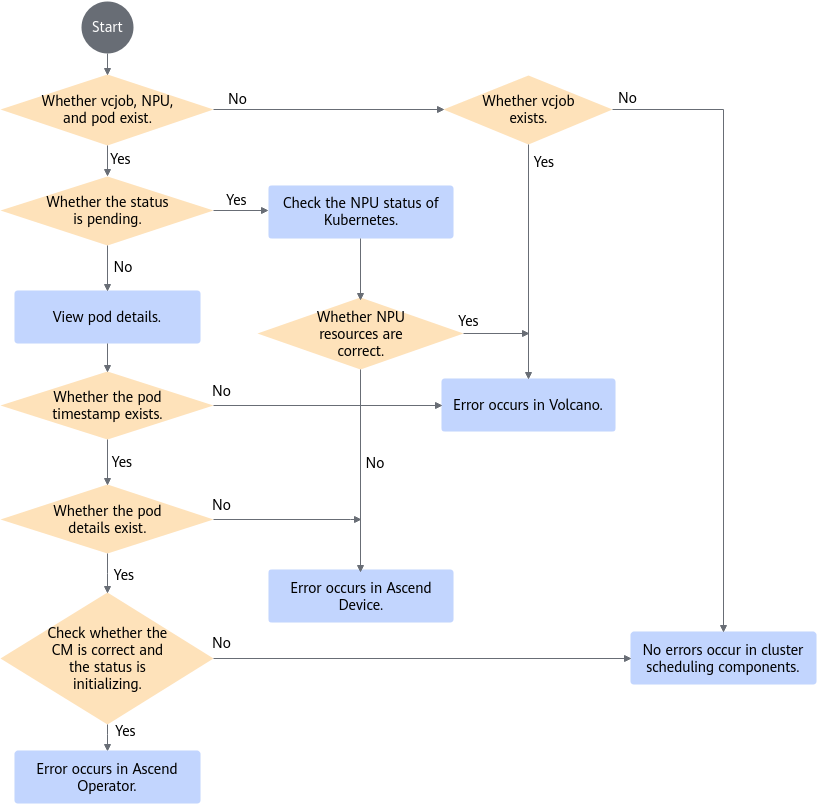

# FAQs

<!-- md-trans-meta sourceCommit=unknown translatedAt=2026-06-09T06:26:26.393Z pushedAt=2026-06-09T07:15:15.713Z -->

> The FAQs in this document has been migrated to GitCode Issues. Click the corresponding problem description to view details.

## Faults During Installation

- [Kubernetes initialization failure](https://gitcode.com/Ascend/mind-cluster/issues/338)
- [Kubernetes 1.25.10 and later versions do not support vNPU recovery](https://gitcode.com/Ascend/mind-cluster/issues/339)
- [Docker fails to work when using Kubernetes version 1.24 or later](https://gitcode.com/Ascend/mind-cluster/issues/340)
- [Cluster initialization fails when Containerd is used as the Kubernetes container engine](https://gitcode.com/Ascend/mind-cluster/issues/341)
- [Component Pod status is not Running](https://gitcode.com/Ascend/mind-cluster/issues/342)
- [Cluster scheduling component Pod is in ContainerCreating status](https://gitcode.com/Ascend/mind-cluster/issues/343)
- [User UID or GID is occupied](https://gitcode.com/Ascend/mind-cluster/issues/337)
- [Failed to start cluster scheduling component, log prints "get sem errno =13"](https://gitcode.com/Ascend/mind-cluster/issues/390)
- [Cluster scheduling component fails to connect to K8s](https://gitcode.com/Ascend/mind-cluster/issues/344)
- [Component startup YAML executed successfully, but the corresponding Pod cannot be found](https://gitcode.com/Ascend/mind-cluster/issues/345)
- [Log shows "connecting to container runtime failed"](https://gitcode.com/Ascend/mind-cluster/issues/346)
- [After manually installing Volcano, Pod status is: CrashLoopBackOff](https://gitcode.com/Ascend/mind-cluster/issues/347)
- [Volcano component works abnormally, log shows Failed to get plugin](https://gitcode.com/Ascend/mind-cluster/issues/348)
- [Ascend Operator log prints Failed to watch \*v1alpha1.Job](https://gitcode.com/Ascend/mind-cluster/issues/349)
- [NPU Exporter fails to check dynamic path, log shows check uid or mode failed](https://gitcode.com/Ascend/mind-cluster/issues/350)

## Faults During Use

### Fault Locating Process

Generally, fault handling involves three stages: "Collect information > Locate the fault > Troubleshoot the fault". After receiving an alarm, you need to collect fault symptom information, analyze the fault cause, locate the fault, and troubleshoot the fault before services can be restored to normal. For the common fault handling process, see [Figure 1](#fig16356123319514).

**Figure 1**  Fault handling

- [After kubelet restarts, NPU Exporter cannot obtain current container information](https://gitcode.com/Ascend/mind-cluster/issues/321)
- [The hccl.json file is not generated](https://gitcode.com/Ascend/mind-cluster/issues/323)
- [npu-smi info cannot be used after K8s configures CPU core binding](https://gitcode.com/Ascend/mind-cluster/issues/351)
- [Training job stuck in Pending status, reason: nodes are unavailable](https://gitcode.com/Ascend/mind-cluster/issues/352)
- [df -h execution failed, NFS startup failed](https://gitcode.com/Ascend/mind-cluster/issues/353)
- [Pod stuck in Terminating status after manually deleting vcjob](https://gitcode.com/Ascend/mind-cluster/issues/354)
- [Job stuck in Pending status due to insufficient resources](https://gitcode.com/Ascend/mind-cluster/issues/355)
- [Job container failed to mount NPU](https://gitcode.com/Ascend/mind-cluster/issues/356)
- [NPU fault cannot trigger rescheduling feature when configuration is correct](https://gitcode.com/Ascend/mind-cluster/issues/357)
- [Inconsistent Pod status after task rescheduling](https://gitcode.com/Ascend/mind-cluster/issues/358)
- [Inference service fails when running as a regular user with dynamic virtualization](https://gitcode.com/Ascend/mind-cluster/issues/359)
- [Unable to query Pod status when using Volcano v1.7.0](https://gitcode.com/Ascend/mind-cluster/issues/360)
- [Executing shell script reports $'\r': command not found exception](https://gitcode.com/Ascend/mind-cluster/issues/361)
- [In scenarios using Volcano and Ascend Operator components, all Pod statuses of a task with a service plane fault become Failed, and the task cannot trigger unconditional retry and rescheduling](https://gitcode.com/Ascend/mind-cluster/issues/362)
- [When executing a training task for the Pangu model, an error report prompts No module named '_sqlite3'](https://gitcode.com/Ascend/mind-cluster/issues/363)
- [When executing a training task using the PyTorch framework, it prompts that amp_C cannot be found](https://gitcode.com/Ascend/mind-cluster/issues/364)
- [The same chip fault occurs repeatedly, causing training task interruptions and repeated rescheduling](https://gitcode.com/Ascend/mind-cluster/issues/365)
- [After hostNetwork is set to true, communication blocks and times out, causing the task to fail](https://gitcode.com/Ascend/mind-cluster/issues/366)
- [ClusterD does not report ConfigMap](https://gitcode.com/Ascend/mind-cluster/issues/367)
- [After enabling process-level online recovery, the error report "There is unsafe data in the input tensor" appears, and recovery fails](https://gitcode.com/Ascend/mind-cluster/issues/368)
- [When executing a model training task using the MindSpore framework, an error report "The pointer\[origin_node_output_addr\] is null" occurs during compilation](https://gitcode.com/Ascend/mind-cluster/issues/369)
- [The Pod status of the NPU Exporter component is CrashLoopBackOff](https://gitcode.com/Ascend/mind-cluster/issues/370)
- [Executing the kubectl command reports an error: Error from server (Forbidden), can only create tokens for individual service accounts](https://gitcode.com/Ascend/mind-cluster/issues/371)
- [Task submission failed, Pod not generated](https://gitcode.com/Ascend/mind-cluster/issues/372)
- [vcjob not started properly, get event shows tasks in gang unschedulable: pod group is not ready, 1 minAvailable](https://gitcode.com/Ascend/mind-cluster/issues/373)
- [Viewing Pod logs shows error report: NPU is busy, check again](https://gitcode.com/Ascend/mind-cluster/issues/374)
- [Recovery message for common fault lost, causing faulty chip to remain in isolated status](https://gitcode.com/Ascend/mind-cluster/issues/375)
- [Total number of chips requested by the task is 32, sp-block set to 32 allows normal training, sp-block set to 16 fails to complete training, training container error report indicates initialization connection failed](https://gitcode.com/Ascend/mind-cluster/issues/377)
- [No training tasks are executed on the worker node, and new training tasks cannot be dispatched](https://gitcode.com/Ascend/mind-cluster/issues/378)
- [Training logs are overwritten after task rescheduling](https://gitcode.com/Ascend/mind-cluster/issues/379)
- [Calico network plugin Not Ready](https://gitcode.com/Ascend/mind-cluster/issues/380)
- [Training process exits with an error report, but the Pod status is not Error, preventing service-plane rescheduling from being triggered](https://gitcode.com/Ascend/mind-cluster/issues/381)
- [The number of chips corresponding to Allocatable.huawei.com/Ascend910 in the Node information is 8, but when an 8-card task is dispatched, the task remains in Pending status](https://gitcode.com/Ascend/mind-cluster/issues/382)
- [Training task stuck on Atlas 800 training server, driver log error: int_process_hwts_sdma_timeout](https://gitcode.com/Ascend/mind-cluster/issues/383)
- [Different Pods of the same task configured with different nodeSelector causing rescheduling failure](https://gitcode.com/Ascend/mind-cluster/issues/385)
- [gRPC client reports "too_many_pings" error when connecting to ClusterD](https://gitcode.com/Ascend/mind-cluster/issues/386)
- [Duplicate registration error in MindSpore checkpoint resume scenario](https://gitcode.com/Ascend/mind-cluster/issues/387)
- [Communication domain rebuild failure during process-level recovery](https://gitcode.com/Ascend/mind-cluster/issues/388)
- [npu-exporter automatic restart, freeze, and inability to obtain metric information](https://gitcode.com/Ascend/mind-cluster/issues/395)
