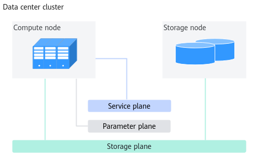

# Installation and Deployment

<!-- md-trans-meta sourceCommit=unknown translatedAt=2026-06-09T06:23:51.407Z pushedAt=2026-06-09T07:15:15.702Z -->

## Before You Start

### Disclaimer

This document may contain third-party information, products, services, software, components, data, or content (collectively referred to as "third-party content"). Huawei does not control and assumes no responsibility for third-party content, including but not limited to accuracy, compatibility, reliability, availability, legality, appropriateness, performance, non-infringement, update status, etc., unless otherwise explicitly stated in this document. Mentioning or referencing any third-party content in this document does not imply endorsement or warranty by Huawei.

If you require third-party licenses, obtain them through legal means, unless otherwise explicitly stated in this document.

### Constraints

- Currently, the high availability feature based on MindIO and MindSpeed-llm provides high availability examples to help users quickly experience this feature. Currently, only the adaptation of basic models and basic training features is completed. The compatibility of all training features is not implemented. If you have any compatibility requirements for a training feature, please submit an issue in the community, and we will quickly complete the adaptation.
- MindIO provides three features: TTP, UCE, and ARF. MindIO TTP supports the Atlas 800 training server (model: 9000), while MindIO UCE and MindIO ARF do not support this server type.
- Many large model frameworks support ZeRO (Zero Redundancy Optimizer) to reduce memory usage. Currently, MindIO TFT only supports ZeRO-1 and requires the DP (Data Parallelism) Size to be an even number. Different features also impose different restrictions on the DP Size:
    - MindIO TTP
        - To ensure complete optimizer state data after a fault occurs, the DP Size must be divisible by the number of replicas.
        - Before enabling MoE (Mixture of Experts), DP Size at the dense layer must be greater than 1; after enabling MoE, DP Size at both the dense layer and sparse layer must be greater than 1.
        - For the distributed optimizer, MindIO TFT re-shards the optimizer ZeRO-1 scope across DP Groups through computation‑to‑communication substitution, thereby implementing optimizer data replicas.

    - MindIO UCE and MindIO ARF
        - To resume training from the current step, the DP Size constraints are the same as those for the MindIO TTP feature.
        - For scenarios with limited memory where no replication is performed (i.e., DP Size = 1), if a UCE or node failure occurs, the system supports online recovery by loading model weights and optimizer parameters from periodic checkpoints. The training cost between the current step and the last periodic checkpoint step is lost.

    - After the ZeRO feature is enabled for the distributed optimizer, there is only one global copy of the optimizer state data, with no data redundancy. MindIO TFT ensures the integrity of optimizer state data in fault scenarios by adding redundant replicas of optimizer state data, but this solution also increases on-chip memory usage. Based on the original model configuration, directly using MindIO TFT may cause an on-chip memory OOM (Out Of Memory) exception during model training startup. In this case, the total on-chip memory of the training job needs to be increased through scaling.

        Formula for calculating the additional on-chip memory size for adding replicas: Total additional on-chip memory (GB) = Number of model parameters N (B) × 12 × Number of copies. The unit of the number of model parameters is B (billion). The formula determines the additional memory required. After scaling up, MindIO TFT can be used.

- There is one Active Controller and two Backup Controllers in the training fault tolerance framework. To ensure a smooth switchover to a Backup Controller to complete the final save when multiple devices, including the Active Controller, fail, the number of devices in normal status must be greater than half of `world_size`.
- MindIO TFT creates replicas of optimizer state data. During MindIO UCE or MindIO ARF repair, valid replicas are found to repair the faulty device. When there are many faults in the training cluster and a complete copy still cannot be assembled, the system will fall back to online repair via periodic checkpoint loading from online step repair.
- When generating the dying gasp Checkpoint data, MindIO TFT not only considers a complete data copy but also verifies data consistency. If, after a fault occurs, an optimizer state data shard remains in a modified state for a long time, or the training iterations are inconsistent across different optimizer state data shards, it is considered global data inconsistency, and the dying gasp checkpoint cannot be generated.
- MindIO TTP does not use the MindIO ACP feature. After MindIO TTP completes saving the dying gasp checkpoint, it terminates the training process. To ensure that the dying gasp checkpoint has been saved to persistent storage before the process exits, MindIO TTP is constrained to write data directly to persistent storage rather than using the asynchronous checkpoint saving method.
- MindIO TFT currently does not support cascading failure scenarios. For example, if another fault occurs while MindIO TTP is saving, the save operation will fail.
- MindIO TFT increases memory usage. For details, see [Table 1 Theoretical numerical changes of optimizer parameters between the native optimizer and the optimizer after enabling the fast fault recovery feature](./03_usage_guidance.md#table_tft_03).
- The TLS (Transport Layer Security) is enabled by default. Disabling it may allow forged Controller connections, affecting the training process.
- MindIO ARF requires multiple nodes (≥ 2), does not support Controller node failures, and does not support cascading failures. After MindIO ARF repair fails, MindCluster controls the subsequent process.
- The default log storage path is the `logs/ttp_log.log` file in the same directory as the running script. You can configure it in the running script. The default log level is "INFO". The size limit for a single log file is 10 MB, and logs are written in append‑only mode. When a log file reaches the size limit, it rolls over to a new log file. The maximum number of rolling log files is five, with older files being overwritten in a circular manner.

## Preparations Before Installation

### Networking Plan

**Figure 1** Deployment logic diagram



Nodes related to the deep learning platform and training tasks include compute nodes and storage nodes. The main functions of each type of node are as follows:

- Compute node: Executes training and inference tasks. MindIO TFT is deployed only on compute nodes.
- Storage node: Stores platform data and user data, such as platform logs, datasets uploaded by users, training scripts, and models output from training.

Network planes are divided into:

- Service plane: Used for managing cluster services. It connects management nodes and compute nodes.
- Storage plane: Used for accessing storage nodes. Management nodes and compute nodes connect to storage nodes.
- Parameter plane: Used for parameter exchange and connection between training nodes during distributed training.

    > [!NOTE]
    > - The logical deployment diagram shows the complete schematic diagram of the deep learning platform. The MindIO TFT feature only requires deploying an SDK on the compute node, and does not involve the installation and deployment on the storage node.
    > - The MindIO TFT SDK needs to communicate with each other on the compute nodes and send heartbeat packets, which requires the service plane network. The SDK is deployed symmetrically on all compute nodes running large model training. There is no distinction between management nodes and compute nodes during deployment.

### Environment Requirements

**Hardware Environment**

Before installation, check the following hardware configurations, as shown in [Table 1](#table_tft_01).

**Table 1<a id="table_tft_01"></a>** Hardware environment

|Type|Configuration reference|
|--|--|
|Server (single-node scenario)|<ul><li>Atlas 800 training server (model: 9000): supports MindIO TTP function only</li><li>Atlas 800T A2 training server</li><li>Atlas 900 A3 SuperPoD</li></ul>|
|Server (cluster scenario)|Compute node: <ul><li>Atlas 800 training server (model: 9000): supports MindIO TTP function only</li><li>Atlas 800T A2 training server</li><li>Atlas 900 A3 SuperPoD</li></ul> Storage node: storage server|
|Network|<ul><li>Out-of-band management (BMC): ≥1 Gbit/s</li><li>In-band management (SSH): ≥1 Gbit/s</li><li>Service plane: ≥10 Gbit/s</li><li>Storage plane: ≥25 Gbit/s</li><li>Parameter plane: 100 Gbit/s</li></ul>|

**Software Environment**

Before installation, ensure the following environments are installed, as shown in [Table 2](#table_tft_02).

**Table 2<a id="table_tft_02"></a>** Software environment

|Software|Version|Installation Path|Obtaining Method|
|--|--|--|--|
|Operating System|<ul><li>CentOS 7.6</li><li>Ubuntu 18.04</li><li>Ubuntu 20.04</li><li>Ubuntu 22.04</li></ul>|All nodes|-|
|Python|3.7 ~ 3.11|Compute node|User-installed|
|Torch|2.7.1|Compute node|User-installed|
|torch_npu|26.0.0|Compute node|User-installed|
|CANN|9.0.0|Compute node|User-installed|
|Driver and Firmware|26.0.RC1|Compute node|User-installed|

### Preparing the Software Package

**Downloading the Software Package**

Once downloading this software, you agree to the terms and conditions of the [Huawei Enterprise End User License Agreement (EULA)](https://e.huawei.com/en/about/eula).

**Table 1**  Software Download

| Component Name | Software Package | Download URL |
|--|--|--|
| MindIO TFT | Memory cache system package | [Download Link](https://gitcode.com/Ascend/mind-cluster/releases) |

**Verifying the Software Digital Signature**

To prevent the software package from being maliciously tampered with during transmission or storage, you need to download the corresponding digital signature file for integrity verification when downloading the software package.

After downloading the software package, see the *OpenPGP Signature Verification Guide* to perform PGP digital signature verification on the software package downloaded from the Support website. If the verification fails, do not use the software package and contact Huawei technical support engineers for resolution.

Before installing or upgrading using the software package, you also need to verify the digital signature of the software package following the preceding process to ensure that the software package has not been tampered with.

Carrier customers, visit [http://support.huawei.com/carrier/digitalSignatureAction](http://support.huawei.com/carrier/digitalSignatureAction)

Enterprise customers, visit [https://support.huawei.com/enterprise/en/tool/pgp-verify-TL1000000054](https://support.huawei.com/enterprise/en/tool/pgp-verify-TL1000000054)

### (Optional) Starting the haveged Service

1. Check whether the haveged service is enabled on the system (it is recommended to keep it enabled).

    ```bash
    systemctl status haveged.service
    ```

    Or

    ```bash
    ps -ef | grep "haveged" | grep -v "grep"
    ```

2. Start the haveged service and configure it to start automatically with the system to ensure the haveged service remains running.

    ```bash
    systemctl start haveged.service
    systemctl enable haveged.service
    ```

3. Check the speed of random number output on the screen.

    ```bash
    cat /dev/random | od -x
    ```

    Check the current entropy value.

    ```bash
    cat /proc/sys/kernel/random/entropy_avail
    ```

    Under normal circumstances, the entropy value is around 100 when haveged is not started, and will increase to over 1,000 or even 2,000 after haveged is started.

## Installing MindIO TFT SDK on Compute Nodes

Install MindIO TFT SDK in the Python environment used by the large model training framework to enable fault recovery for training jobs, thereby accelerating training recovery.

**Procedure**

1. Log in to the installation node as the installation user *{MindIO-install-user}*.

    > [!NOTE]
    > The password set for the installation user must meet the [password complexity requirements] (./06_appendixes.md#password-complexity-requirements). The password validity period is 90 days. You can modify the number of days for the validity period in the `"/etc/login.defs"` file, or use the `chage` command to set the user validity period. For details, see [Setting User Validity Period](./06_appendixes.md#setting-user-validity-period).

2. Upload the memory cache system package to a path on the device where the installation user has read and write permissions.

    > [!NOTE]
    > - The actual package name of the memory cache system package shall prevail.
    > - If the Python environment is a shared directory, upload the package on any compute node. Otherwise, upload the installation package on all compute nodes.

3. Go to the software package upload path and decompress the package.

    ```bash
    unzip Ascend-mindxdl-mindio_{version}_linux-{arch}.zip
    ```

    **Table 1** Decompressed files

    |File|Description|
    |--|--|
    |mindio_acp-*{mindio_acp_version}*-py3-none-linux_*{arch}*.whl|MindIO ACP installation package.|
    |mindio_ttp-*{mindio_ttp_version}*-py3-none-linux_*{arch}*.whl|MindIO TFT installation package.|

4. Go to the upload path and run the following command to install the MindIO TFT SDK.

    Here, `mindio_ttp-{mindio_ttp_version}-py3-none-linux_{arch}.whl` is used as an example. Select the appropriate file based on your actual situation.

    ```bash
    pip3 install mindio_ttp-{mindio_ttp_version}-py3-none-linux_{arch}.whl --force-reinstall --no-index
    ```

    - If this is the first time you are installing the MindIO TFT SDK, the following output indicates a successful installation.

        ```bash
        Processing ./mindio_ttp-{mindio_ttp_version}-py3-none-linux_{arch}.whl
        Installing collected packages: mindio_ttp
        Successfully installed mindio_ttp-{mindio_ttp_version}
        ```

    - If this is not the first time you are installing the MindIO TFT SDK, the following output indicates a successful installation.

        ```bash
        Processing ./mindio_ttp-{mindio_ttp_version}-py3-none-linux_{arch}.whl
        Installing collected packages: mindio_ttp
          Attempting uninstall: mindio-ttp
            Found existing installation: mindio_ttp {mindio_ttp_version}
            Uninstalling mindio_ttp-{mindio_ttp_version}:
              Successfully uninstalled mindio_ttp-{mindio_ttp_version}
        Successfully installed mindio_ttp-{mindio_ttp_version}
        ```

5. Change the permissions of the executable files and code scripts in the software installation directory to 550 to prevent unauthorized tampering.

    ```bash
    chmod -R 550 {MindIO TFT SDK installation directory}
    ```

## Uninstalling the MindIO TFT SDK

**Procedure**

1. Change the permissions of executable files and code scripts in the software installation directory to `750`.

    ```bash
    chmod -R 750 {MindIO TFT SDK installation directory}
    ```

2. Uninstall the MindIO TFT SDK.

    ```bash
    pip3 uninstall mindio_ttp
    ```
