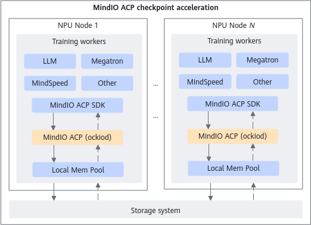

# Product Description

<!-- md-trans-meta sourceCommit=unknown translatedAt=2026-06-09T06:27:12.715Z pushedAt=2026-06-09T07:15:15.727Z -->

## Overview

MindCluster MindIO Async Checkpoint Persistence ( MindIO ACP) primarily accelerates the saving and loading of checkpoints during large model training. Checkpoint data is first written to the memory system of a training server and then asynchronously written to a reliable backend storage device. This document focuses on the vertical acceleration aspect, covering the checkpoint write and read processes within this system.

## Benefits

Large Language Model (LLM) is currently the focus of global competition in the technology sector. Training LLMs often takes dozens of days or even months. Checkpoints are key points for resuming training after model interruption. The density of checkpoints and the performance of saving and restoring them are critical, as they can improve the effective throughput of the training system. MindIO ACP introduces a checkpoint acceleration solution, helping Ascend products expand their market share in the LLM field.

This solution improves the training throughput of LLMs on the Ascend platform, with performance surpassing the [Microsoft Azure Nebula solution](https://learn.microsoft.com/zh-cn/azure/machine-learning/reference-checkpoint-performance-for-large-models?view=azureml-api-2&tabs=PYTORCH).

## MindIO ACP Architecture

The four key points of MindIO ACP for accelerating LLM checkpoint saving and loading are as follows:

- Asynchronous persistence: After the training framework saves the checkpoint to MindIO ACP through the `save`/`load` interface or the MindSpore framework, it immediately returns and continues training. This takes seconds. MindIO ACP then asynchronously writes the checkpoint to persistent distributed storage, a process that takes minutes.
- High-performance MemFS (Memory File System): To achieve ultra-fast checkpoint writing, MindIO ACP implements a fully user-mode file system that uses memory as the storage medium, eliminating system calls and user-to-kernel space memory copies associated with standard file systems.
- Efficient checkpoint saving and loading. To achieve ultra-fast checkpoint writing and recovery, MindIO ACP has developed efficient checkpoint saving and loading methods.
- Automatic fault tolerance: When MindIO ACP service exceptions cause data read/write failures, timeouts, or other anomalies, the native data storage method is automatically switched to ensure business continuity.

    > **NOTE**
    > MindIO ACP only saves checkpoint data during the training process and does not save and process sensitive data. If sensitive data storage is involved, please complete the relevant desensitization operations in the preceding workflow to avoid information security issues.
