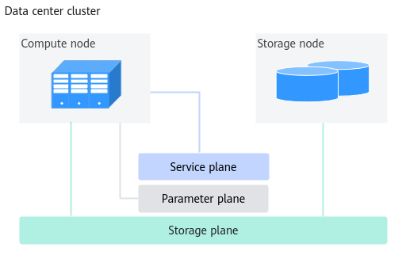

# Installation and Deployment

<!-- md-trans-meta sourceCommit=unknown translatedAt=2026-06-09T06:27:35.641Z pushedAt=2026-06-09T07:15:15.733Z -->

## Before You Start

### Disclaimer

This document may contain third-party information, products, services, software, components, data, or content (collectively referred to as "third-party content"). Huawei does not control and assumes no responsibility for third-party content, including but not limited to accuracy, compatibility, reliability, availability, legality, appropriateness, performance, non-infringement, update status, etc., unless otherwise explicitly stated in this document. Mentioning or referencing any third-party content in this document does not imply endorsement or warranty by Huawei.

If you require third-party licenses, obtain them through legal means, unless otherwise explicitly stated in this document.

### Constraints

- When the [MindIO TFT](../fault_recovery_acceleration/01_product_description.md) framework is saving a checkpoint to MindIO ACP, if the checkpoint save fails, the checkpoint currently being saved cannot be used as a training recovery point. The training framework needs to recover from the last complete checkpoint.
- If a MindIO ACP fault occurs during training, for services that have already been delivered, the MindIO ACP SDK will retry the connection three times. If all three attempts fail, it will fall back to the native storage method, with a maximum retry wait time of 60 seconds. If a MindIO ACP fault occurs before training starts, the MindIO ACP SDK will skip connecting to MindIO ACP, and the checkpoint data will be directly written to the native data storage.
- This feature is not compatible with versions earlier than MindSpore 2.7.0.

## Pre-installation Preparation

### Networking Plan

**Figure 1**  Deployment logic



The nodes related to training jobs on the deep learning platform include compute nodes and storage nodes. The main functions of each type of node are as follows:

- Compute node: Executes training and inference jobs. MindIO ACP is deployed only on compute nodes.
- Storage node: Stores platform data and user data, such as platform logs, datasets uploaded by users, training scripts, and models output from training.

Network planes are divided into:

- Service plane: Connects between management nodes and compute nodes for managing cluster services.
- Storage plane: Management nodes and compute nodes connect to storage nodes for accessing storage nodes.
- Parameter plane: Used for parameter exchange and connection between training nodes during distributed training.

>[!NOTE] **NOTE**
>
> - The deployment logic diagram shows the complete schematic of the deep learning platform. MindIO ACP is deployed as a component on compute nodes. The installation and deployment of management nodes and storage nodes is not involved.
> - MindIO ACP is a single-node memory cache system. Training checkpoint data accesses MindIO ACP through shared memory and does not involve network plane division.

### Environment Requirements

**Hardware Environment**

Before installation, check the following hardware configurations, as shown in [Table 1](#table_acp_01).

**Table 1 <a id="table_acp_01"></a>** Hardware Environment

|Type|Configuration Reference|
|--|--|
|Server (Single-Node Scenario)|Atlas 800 training server (model: 9000)|
|Server (Cluster Scenario)|<ul><li>Compute node: Atlas 800 training server (model: 9000)</li><li>Storage node: Storage server</li></ul>|
|Memory|<ul><li>Recommended: ≥ 64 GB</li><li>Minimum: ≥ 32 GB</li></ul>|
|Disk Space|≥ 1 TB <br> For disk space planning, see [Table 3](#table_acp_03)|
|Network|<ul><li>Out-of-band management (BMC): ≥ 1 Gbit/s</li><li>In-band management (SSH): ≥ 1 Gbit/s</li><li>Service plane: ≥ 10 Gbit/s</li><li>Storage plane: ≥ 25 Gbit/s</li><li>Parameter plane: 100 Gbit/s</li></ul>|

**Software Environment**

Before installation, ensure the following environments are installed, as shown in [Table 2](#table_acp_02).

**Table 2 <a id="table_acp_02"></a>** Software Environment

|Software|Version|Installation Path|How to Obtain|
|--|--|--|--|
|Operating System|<ul><li>CentOS 7.6 Arm</li><li>CentOS 7.6 x86</li><li>openEuler 20.03 Arm</li><li>openEuler 20.03 x86</li><li>openEuler 22.03 Arm</li><li>openEuler 22.03 x86</li><li>Ubuntu 20.04 Arm</li><li>Ubuntu 20.04 x86</li><li>Ubuntu 18.04.5 Arm</li><li>Ubuntu 18.04.5 x86</li><li>Ubuntu 18.04.1 Arm</li><li>Ubuntu 18.04.1 x86</li><li>Kylin V10 SP2 Arm</li><li>Kylin V10 SP2 x86</li><li>UOS20 1020e Arm</li></ul>|All nodes|-|
|Python|3.7 or later|Compute node|Installed by yourself|
|Torch|2.7.1|Compute node|Installed by yourself|
|MindSpore|2.7.0 or later|Compute node|Installed by yourself|

**Operating System Disk Partition**

The recommended disk partitions for the operating system are shown in [Table 3](#table_acp_03).

**Table 3 <a id="table_acp_03"></a>** Disk partitions

|Partition|Description|Size|Bootable Flag|
|--|--|--|--|
|/boot|Boot partition|500 MB|on|
|/var|Data storage partition for software operation, such as logs and caches|>300 GB|off|
|/|Primary partition|>300 GB|off|

### Preparing the Software Package

**Downloading the Software Package**

Once downloading this software, you agree to the terms and conditions of the [Huawei Enterprise End User License Agreement (EULA)](https://e.huawei.com/en/about/eula).

**Table 1** Required software

|Component Name|Software Package|URL|
|--|--|--|
|MindIO ACP|Memory cache system package|[Download link](https://gitcode.com/Ascend/mind-cluster/releases)|

**Verifying the Software Digital Signature**

To prevent the software package from being maliciously tampered with during transmission or storage, you need to download the corresponding digital signature file for integrity verification when downloading the software package.

After downloading the software package, see the *OpenPGP Signature Verification Guide* to perform PGP digital signature verification on the software package downloaded from the Support website. If the verification fails, do not use the software package and contact Huawei technical support engineers for resolution.

Before installing or upgrading using the software package, you also need to verify the digital signature of the software package following the preceding process to ensure that the software package has not been tampered with.

Carrier customers, visit [http://support.huawei.com/carrier/digitalSignatureAction](http://support.huawei.com/carrier/digitalSignatureAction)

Enterprise customers, visit [https://support.huawei.com/enterprise/en/tool/pgp-verify-TL1000000054](https://support.huawei.com/enterprise/en/tool/pgp-verify-TL1000000054)

## Installing MindIO ACP SDK on the Compute Node

Use MindIO ACP SDK to interface with Torch and MindSpore, accelerating the checkpoint saving and loading operations for Torch and MindSpore training.

**Procedure**

1. Log in to the installation node as the installation user *{MindIO-install-user}*.

    >[!NOTE] **NOTE**
    >The password set for the installation user must comply with the [password complexity requirements](./07_appendixes.md#password-complexity-requirements). The password validity period is 90 days. You can modify the number of days for the validity period in the `"/etc/login.defs"` file, or use the `chage` command to set the user validity period. For details, see [Setting User Validity Period](./07_appendixes.md).

2. Upload the memory cache system package to a path on the device where the installation user has read and write permissions.

    > [!NOTE] **NOTE**
    > - The actual package name of the memory cache system package shall prevail.
    > - If the Python environment is a shared directory, upload the package on any compute node. Otherwise, upload the installation package on all compute nodes.

3. Go to the software package upload path and decompress the package.

    ```bash
    unzip Ascend-mindxdl-mindio_{version}_linux-{arch}.zip
    ```

    **Table 1** Decompressed files

    |File|Description|
    |--|--|
    |mindio_acp-*{mindio_acp_version}*-py3-none-linux_*{arch}*.whl|MindIO ACP installation package.|
    |mindio_ttp-*{mindio_ttp_version}*-py3-none-linux_*{arch}*.whl|MindIO TFT installation package.|

4. Go to the upload path and install MindIO ACP SDK.

    ```bash
    pip3 install mindio_acp-{mindio_acp_version}-py3-none-linux_{arch}.whl --force-reinstall
    ```

    - If MindIO ACP SDK is installed for the first time, the following output indicates a successful installation.

        ```bash
        Processing ./mindio_acp-{mindio_acp_version}-py3-none-linux_{arch}.whl
        Installing collected packages: mindio_acp
        Successfully installed mindio_acp-{version}
        ```

    - If MindIO ACP SDK is not installed for the first time, the following output indicates a successful installation.

        ```bash
        Processing ./mindio_acp-{mindio_acp_version}-py3-none-linux_{arch}.whl
         Installing collected packages: mindio_acp
           Attempting uninstall: mindio_acp
             Found existing installation: mindio_acp {mindio_acp_version}
             Uninstalling mindio_acp-{mindio_acp_version}:
               Successfully uninstalled mindio_acp-{mindio_acp_version}
         Successfully installed mindio_acp-{mindio_acp_version}
        ```

5. Change the permissions of executable files and code scripts in the software installation directory to `550` to prevent unauthorized tampering.

    ```bash
    chmod -R 550 {MindIO ACP SDK installation directory}
    ```

## Uninstalling MindIO ACP SDK

**Procedure**

1. Change the permissions of executable files and code scripts in the software installation directory to 750.

    ```bash
    chmod -R 750 {MindIO ACP SDK installation directory}
    ```

2. Uninstall MindIO ACP SDK.

    ```bash
    pip3 uninstall mindio_acp
    ```
