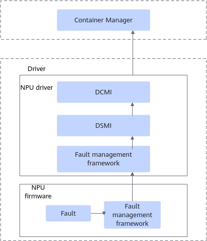

# NPU Hardware Fault Detection and Recovery<a name="ZH-CN_TOPIC_0000002518340693"></a>

In scenarios without K8s, there is no effective recovery method after a training or inference process becomes abnormal. To address this issue, you can configure the container recovery feature. To support the container recovery feature, you need to install Container Manager. For details on installing Container Manager, see [Installation and Deployment](../../developer_guide/installation_deployment/manual_installation/00_obtaining_software_packages.md).

## Feature Description<a name="ZH-CN_TOPIC_0000002486738074"></a>

<a name="table1866285218270"></a>

|Function|Description|Principle and Configuration Steps|
|--|--|--|
|Fault Detection|This feature supports real-time monitoring of 350+ hardware faults.|[Fault Detection](#fault-detection)|
|Fault Handling|For faults whose fault level is configured as RestartRequestCodes, RestartBusinessCodes, FreeRestartNPUCodes, and RestartNPUCodes, the faulty device can be automatically recovered without manual intervention after the fault occurs.|[Fault Handling](#fault-handling)|
|Container Recovery|You can configure container start/stop policies. For faults whose level is configured as RestartRequestCodes, RestartBusinessCodes, FreeRestartNPUCodes, and RestartNPUCodes, the container will be stopped when the fault occurs and restarted after the fault is recovered.|[Container Recovery](#container-recovery)|

> [!NOTE]
> This feature is not applicable to computing power virtualization scenarios, and does not support shared devices or mixed insertion modes.

## Fault Detection<a name="ZH-CN_TOPIC_0000002518738073"></a>

### Solution Description<a name="ZH-CN_TOPIC_0000002518738601"></a>

When Container Manager starts, it first registers the DCMI fault subscription interface. When a fault occurs, the driver reports the fault event to Container Manager through this interface. When the fault is recovered, the recovery event is reported to Container Manager through the same interface.

When an NPU fault occurs, the fault management framework obtains the fault information and reports it to the NPU driver's fault management framework. After receiving the fault information, the fault management framework reports it to Container Manager through the DCMI, as shown in [Figure 1](#fig610813710515).

**Figure 1**  Fault detection schematic diagram<a name="fig610813710515"></a>


### Fault Level Configuration<a name="ZH-CN_TOPIC_0000002518737701"></a>

#### Fault Configuration Description<a name="ZH-CN_TOPIC_0000002486577908"></a>

To handle chip faults according to severity levels, Container Manager obtains the fault code for the current issue and performs actions aligned with its assigned level.

**Default Fault Code Configuration<a name="section44743445012"></a>**

After Container Manager starts, it uses the following configuration as the basis for current fault handling by default:

```json
{
  "NotHandleFaultCodes":[
    "80E21007","80E38003","80F78006","80C98006","80CB8006","81318006","80A18006","80A18005","80FB8000","8C1F8609",
    "80CD8006","80CD8003","80A38006","80A38003","80A58006","80A58003","80DE1805","80F18006","80F18003","80DF8006",
    "80E01805","80E18400","80E01809","80E18401","80E00209","80F38006","80F38003","80E18006","80D38009","819B800D",
    "80DD8008","80DD8007","80B98006","80BD8006","819B8006","80DE1803","819D8000","81998006","81978006","81978004",
    "815F8006","815F8004","81338006","81338004","817F8006","817F8004","816F8006","816F8004","814F8006","814F8004",
    "81938006","81938004","81478006","81478004","813B8006","813B8004","81578006","81578004","81958006","81958004",
    "81078603","8C2FA009","A4025021","A60250C1","A4025081","A214000D","A414000D","A4028801","A4025101","A2140007",
    "A4140007","A2140008","A4140008","A40250E1","A214000A","A414000A","A4025061","A4025041","A214000B","A414000B",
    "A414000C","A2140009","A4140009","A4303002","80B78006","80B78005","80E1800F","80DE0200","814D8006","8C1F860B",
    "8C1F8608","4C1F8608","819B8003","80DF8401","80DF8400","80818200","80818201","80818202","80818203","80818204",
    "80818205","80F38009","81A3880C","81AD8605","80E20207","81078605","80DE0207","8C2FA001","819B8605","80818C06",
    "8C1F860A","80E18405"
  ],
  "RestartRequestCodes":[
    "80C98008","80C98002","80C98003","80C98009","80CB8002","80CB8008","80CB8009","80CF8003","81318008","80D58000",
    "80D58009","80D98008","80DB800A","80DB8000","80DD8000","80DD8003","80C98000","81AB800D","81AB8003","80BD8000",
    "80BB8009","80BD8003","80BD8009","80BB8000","80BB8003","80BB8008","80BB800A","81AB8008","80C9800A","80CB800A"
  ],
  "RestartBusinessCodes":[
    "8C204E00","A8028802","A4302003","A4302004","A4302005","A4302006","A4302009","A430200A", "A6301002","B4060011",
    "B406009C","B4060008","B4060009","B406000E","A60250A1","A2301001","A2301002","A2303001", "B4060006","B4060007",
    "B406000D","B4060014","B4060010","B4060011","80E01801", "81B38009","81B38004"
  ],
  "FreeRestartNPUCodes":[
    "8C0E4E00","8C104E00","8C0C4E00","8C044E00","8C064E00","8C17A005","8C1DA005","8C19A005","8C0A4E00","8C084E00",
    "A4193217","A4193218","A42A0000","A42F3917","A42F3918","8C464E00","8C124E00"
  ],
  "RestartNPUCodes":[
    "8C03A000","8C1FA006","40F84E00","80E24E00","80E21E01","80E38008","80E3A202","80E3A203","80E39200","819B800A",
    "80E2120D","80E78000","80E78008","80FA4E00","812E4E00","80C78008","80F78009","80F78008","80F78003","80E18404",
    "80FB8005","80A18008","80CD8008","80A38008","80A58008","80DE1801","80F18008","80F18000","80F1800A","80CF8000",
    "80DF8000","80DF8009","80DF8008","80DF800A","80F38008","80F2180D","80E18005","80E18008","80E1800A","812F8000",
    "80B98000","80B98008","80BD8008","80CB8001","81998009","81998008","81978008","815F8008","81338008","817F8008",
    "81478008","813B8008","81578008","81958008","A2141004","A2141006","A2142004","A2142006","A2145004","A4183200",
    "A6023001","A6023002","A6023003","A6023004","A6060000","A6060001","A6060002","A6060003","A6060004","A6060005",
    "A606000A","A606000B","A606000C","A606000F","A606009D","A6060FFF","A607FFFF","A6140001","A6140002","A6140003",
    "A6140004","A6140005","A6140006","A6141003","A6142003","A6143003","A6144003","A6145003","A6192D15","A6193206",
    "A6193215","A6193248","A62F3905","A62FFFFF","A6303003","A6303004","A6360000","A6361000","A6362000","A8021004",
    "A8060FFF","A807FFFF","A82A0000","80B78000","80B58000","81498004","80F78C02","80F78C03","80F78C04","81B38008",
    "80E18000","80E21008","80C98001","80E58005","80E58009","80E58E02","80E58E03","816F8008","814F8008","81938008",
    "80E44E00","80CF8009","80CF8008","813B8002","81338002","81578002","81958002","81938002","81478002","81978002",
    "815F8002","81C9800A","81C7800A","81C5800A","813F800A","8139800A","8145800A","8C4BA00C","80E3A207"
  ],
  "SeparateNPUCodes":[
    "80E3A201","80E18402","80E0020B","817F8002","816F8002","814F8002","9419321B","A2301000","A2301001","A2302001",
    "A4192C1A","A4193216","A419321B","A419321C","A42F390F","A42F3916","A42F391A","A6183207","A62F3934","A8028801",
    "A819320F","A8193234","A8193235","80818c00","80818C05","80DF8402","80818C00","4C4BA00C"
  ]
}
```

>[!NOTE]
>
>- For information corresponding to each fault, see [Chip Fault Code Reference](../../references/appendix.md#chip-fault-code-references).
>- For the support chip fault levels, see [Fault Code Level Description](#zh-cn_topic_0000002171521445_section5245155017242).

**Fault Code Level Description<a name="zh-cn_topic_0000002171521445_section5245155017242"></a>**

After Container Manager obtains chip fault codes from the driver, it classifies faults into the following six levels based on their impact on devices and services. For details, see [Table 1](#zh-cn_topic_0000002171521445_table7618951152212). If you need to modify the fault level of a fault code, see [(Optional) Configuring Chip Fault Levels](#optional-configuring-chip-fault-levels).

**Table 1**  Fault levels and handling descriptions

<a name="zh-cn_topic_0000002171521445_table7618951152212"></a>
<table><thead align="left"><tr id="zh-cn_topic_0000002171521445_row461812518228"><th class="cellrowborder" valign="top" width="23.830000000000002%" id="mcps1.2.4.1.1"><p id="zh-cn_topic_0000002171521445_p12618851162220"><a name="zh-cn_topic_0000002171521445_p12618851162220"></a><a name="zh-cn_topic_0000002171521445_p12618851162220"></a>Fault Level</p>
</th>
<th class="cellrowborder" valign="top" width="44.73%" id="mcps1.2.4.1.2"><p id="zh-cn_topic_0000002171521445_p16618125162219"><a name="zh-cn_topic_0000002171521445_p16618125162219"></a><a name="zh-cn_topic_0000002171521445_p16618125162219"></a>NPU Reset Policy</p>
</th>
<th class="cellrowborder" valign="top" width="31.44%" id="mcps1.2.4.1.3"><p id="zh-cn_topic_0000002171521445_p171971327125410"><a name="zh-cn_topic_0000002171521445_p171971327125410"></a><a name="zh-cn_topic_0000002171521445_p171971327125410"></a>Container Handling Policy</p>
</th>
</tr>
</thead>
<tbody><tr id="zh-cn_topic_0000002171521445_row961811511228"><td class="cellrowborder" valign="top" width="23.830000000000002%" headers="mcps1.2.4.1.1 "><p id="zh-cn_topic_0000002171521445_p7618125114229"><a name="zh-cn_topic_0000002171521445_p7618125114229"></a><a name="zh-cn_topic_0000002171521445_p7618125114229"></a>NotHandleFault</p>
</td>
<td class="cellrowborder" valign="top" width="44.73%" headers="mcps1.2.4.1.2 "><p id="zh-cn_topic_0000002171521445_p1261835110227"><a name="zh-cn_topic_0000002171521445_p1261835110227"></a><a name="zh-cn_topic_0000002171521445_p1261835110227"></a>Faults that do not affect services and require no handling.</p>
</td>
<td class="cellrowborder" valign="top" width="31.44%" headers="mcps1.2.4.1.3 "><p id="zh-cn_topic_0000002171521445_p719714273546"><a name="zh-cn_topic_0000002171521445_p719714273546"></a><a name="zh-cn_topic_0000002171521445_p719714273546"></a>Not handled for now.</p>
</td>
</tr>
<tr id="zh-cn_topic_0000002171521445_row116184515226"><td class="cellrowborder" valign="top" width="23.830000000000002%" headers="mcps1.2.4.1.1 "><p id="zh-cn_topic_0000002171521445_p5618751102216"><a name="zh-cn_topic_0000002171521445_p5618751102216"></a><a name="zh-cn_topic_0000002171521445_p5618751102216"></a>RestartRequest</p>
</td>
<td class="cellrowborder" rowspan="2" valign="top" width="44.73%" headers="mcps1.2.4.1.2 "><p id="zh-cn_topic_0000002171521445_p05771854113911"><a name="zh-cn_topic_0000002171521445_p05771854113911"></a><a name="zh-cn_topic_0000002171521445_p05771854113911"></a><span id="ph6926121810160"><a name="ph6926121810160"></a><a name="ph6926121810160"></a>Container Manager</span> adds the faulty chip and associated chips to the chip reset cache after the fault persists for 60 seconds. For details about the chip reset logic, see <a href="#fault-handling">Fault Handling</a>.</p>
</td>
<td class="cellrowborder" rowspan="4" valign="top" width="31.44%" headers="mcps1.2.4.1.3 "><p id="p11041540152412"><a name="p11041540152412"></a><a name="p11041540152412"></a>When the startup parameter <span class="parmname" id="parmname127339182715"><a name="parmname127339182715"></a><a name="parmname127339182715"></a>“-ctrStrategy”</span> of the run command is set to <span class="parmvalue" id="parmvalue058714462711"><a name="parmvalue058714462711"></a><a name="parmvalue058714462711"></a>“singleRecover”</span> or <span class="parmvalue" id="parmvalue1923725032719"><a name="parmvalue1923725032719"></a><a name="parmvalue1923725032719"></a>“ringRecover”</span>, the container start/stop function is enabled. For differences between the two configuration parameters, see <a href="../../developer_guide/installation_deployment/manual_installation/11_container_manager.md">Container Manager Startup Parameters</a>.</p>
</td>
</tr>
<tr id="zh-cn_topic_0000002171521445_row14618105116225"><td class="cellrowborder" valign="top" headers="mcps1.2.4.1.1 "><p id="zh-cn_topic_0000002171521445_p15618851132212"><a name="zh-cn_topic_0000002171521445_p15618851132212"></a><a name="zh-cn_topic_0000002171521445_p15618851132212"></a>RestartBusiness</p>
</td>
</tr>
<tr id="zh-cn_topic_0000002171521445_row561825132214"><td class="cellrowborder" valign="top" headers="mcps1.2.4.1.1 "><p id="zh-cn_topic_0000002171521445_p66188511222"><a name="zh-cn_topic_0000002171521445_p66188511222"></a><a name="zh-cn_topic_0000002171521445_p66188511222"></a>FreeRestartNPU</p>
</td>
<td class="cellrowborder" rowspan="2" valign="top" headers="mcps1.2.4.1.2 "><p id="p17596495131"><a name="p17596495131"></a><a name="p17596495131"></a><span id="ph1559049101318"><a name="ph1559049101318"></a><a name="ph1559049101318"></a>Container Manager</span> immediately adds the faulty chip and associated chips to the chip reset cache upon receiving the fault. For details about the chip reset logic, see <a href="#fault-handling">Fault Handling</a>.</p>
</td>
</tr>
<tr id="zh-cn_topic_0000002171521445_row14618125152210"><td class="cellrowborder" valign="top" headers="mcps1.2.4.1.1 "><p id="zh-cn_topic_0000002171521445_p17618155116227"><a name="zh-cn_topic_0000002171521445_p17618155116227"></a><a name="zh-cn_topic_0000002171521445_p17618155116227"></a>RestartNPU</p>
</td>
</tr>
<tr id="zh-cn_topic_0000002171521445_row1061895115227"><td class="cellrowborder" valign="top" width="23.830000000000002%" headers="mcps1.2.4.1.1 "><p id="zh-cn_topic_0000002171521445_p961885142215"><a name="zh-cn_topic_0000002171521445_p961885142215"></a><a name="zh-cn_topic_0000002171521445_p961885142215"></a>SeparateNPU</p>
</td>
<td class="cellrowborder" valign="top" width="44.73%" headers="mcps1.2.4.1.2 "><p id="zh-cn_topic_0000002171521445_p18618151202216"><a name="zh-cn_topic_0000002171521445_p18618151202216"></a><a name="zh-cn_topic_0000002171521445_p18618151202216"></a>The fault cannot be recovered through reset, and the chip needs to be isolated.</p>
</td>
<td class="cellrowborder" valign="top" width="31.44%" headers="mcps1.2.4.1.3 "><p id="zh-cn_topic_0000002171521445_p019742745411"><a name="zh-cn_topic_0000002171521445_p019742745411"></a><a name="zh-cn_topic_0000002171521445_p019742745411"></a>Not handled for now.</p>
</td>
</tr>
</tbody>
</table>

#### (Optional) Configuring Chip Fault Levels<a name="ZH-CN_TOPIC_0000002486737872"></a>

If you want to customize fault levels, create a custom fault code configuration file and pass it as the value of the `-faultConfigPath` parameter when starting Container Manager. Take the fault "dmp_daemon node status detection abnormal", corresponding to fault code 80E21007, as an example. The following operation example shows how to change the handling policy of the fault from `NotHandleFault` to `RestartNPU`.

1. Log in to the environment and go to any directory, for example, `/home/container-manager`.
2. Create a custom fault code configuration file, for example, `faultCode.json`.

    ```shell
    vi faultCode.json
    ```

3. Press `i` to enter insert mode, and copy the default fault code configuration from [Default Fault Code Configuration](#fault-configuration-description) into this file.
4. Locate the fault code 80E21007.

    <pre codetype="json">
    <strong>"NotHandleFaultCodes"</strong>:[
       <strong>"80E21007"</strong>,"80E38003","80F78006","80C98006","80CB8006","81318006","80A18006","80A18005","80FB8000","8C1F8609",
    ...
      ],
    ...</pre>

    >[!NOTE]
    >If the same fault code is configured in multiple fault levels, the configuration will be reported as successful, but the fault will be handled according to the highest severity level by default.

5. Delete the fault code 80E21007 from `NotHandleFaultCodes` and add it to `RestartNPUCodes`.

    <pre codetype="json">
    <strong>"NotHandleFaultCodes"</strong>:[
       "80E38003","80F78006","80C98006","80CB8006","81318006","80A18006","80A18005","80FB8000","8C1F8609",
    ...
      ],
    ...
    <strong>"RestartNPUCodes"</strong>:[
       "8C204E00","A8028802","A4302003","A4302004","A4302005","A4302006","A4302009","A430200A","80CF8009","80CF8008",<strong>"80E21007"</strong>,...
    ...
       ],</pre>

6. After the modification is complete, press `Esc`, enter `:wq!` to save and exit.
7. Confirm the permissions of the custom fault code configuration file, ensuring that its permissions are not higher than `640`.
8. Start Container Manager. If the Container Manager service has already been installed, you need to restart the Container Manager service for the configuration to take effect.

    ```shell
    systemctl daemon-reload && systemctl restart container-manager.service # Reload the service configuration and restart the installed Container Manager service.
    ```

If the log displays "load custom fault config file from /home/container-manager/faultCode.json success", the custom fault code configuration operation is successful.

>[!NOTICE]
>
>- The fault code configuration is a system configuration. Do not modify it arbitrarily unless you have special requirements. Otherwise, the system fault handling may malfunction.
>- After the custom fault code configuration file is modified, you need to restart Container Manager for it to take effect. If the custom configuration file has format errors or other issues, Container Manager will directly report an error and exit.

## Fault Handling<a name="ZH-CN_TOPIC_0000002486738174"></a>

When a `RestartRequest` or `RestartBusiness` fault persists for 60 seconds, or when a `FreeRestartNPU` or `RestartNPU` type fault is detected, Container Manager places the faulty chip and associated chips into the pending reset cache. Container Manager periodically attempts to reset the chips in the pending reset cache. When the chips meet the following conditions, Container Manager calls the DCMI to perform the chip reset operation.

- No task processes exist on the current faulty chip or associated chips.
- No running containers occupy the current faulty chip or associated chips.
- The current faulty chip or associated chips still have faults at any of the four highest levels: `RestartRequest`, `RestartBusiness`, `FreeRestartNPU`, or `RestartNPU`.

>[!NOTE]
>
>- After Container Manager successfully performs a chip reset within a cycle and obtains the result indicating that the chip has started successfully, the fault reset function pauses for 30 seconds to wait for chip initialization to complete.
>- After a chip fails to reset three consecutive times, Container Manager no longer attempts to reset this chip.

## Container Recovery

When Container Manager detects that a chip is in a `RestartRequest`, `RestartBusiness`, `FreeRestartNPU`, or `RestartNPU` fault state, it stops and recovers containers according to the restart policy configured by the `-ctrStrategy` parameter of the `run` command. For details on the specific scope of container stop and recovery, see [Container Manager Startup Parameters](../../developer_guide/installation_deployment/manual_installation/11_container_manager.md).

During container stop and start, the status changes as follows:

- When the container is stopping, the container status is `pausing`. If the container status is `pausing` and the status duration exceeds 30s, the container description queried by the `status` command is "Container pause may fail. Please manually delete the container".
- After the container stops, the container status changes to `paused`. If the container status is `paused` and the status duration exceeds 400s, the container description queried by the `status` command is "Device hot reset may fail. Please check of device status and recovery are required".
- When the container is `recovering`, the container status is `resuming`. If the container status is resuming and the status duration exceeds 30s, the container description queried by the `status` command is "The device has been recovered, but the container failed to be resumed. Please manually pull up the container".
- At other times, the container status is `running`, and the description indicates `normal`. The container status start time queried by the `status` command is the time when Container Manager detects the container startup or the time after the container is recovered.

>[!NOTE]
>
>- Container Manager only recovers containers that it stopped itself.
>- The container statuses involved in the container start/stop process described above are defined solely by Container Manager and are not official definitions provided by the container runtime.
>- In the containerd scenario, if the container's task does not exist, the stop operation will fail.
