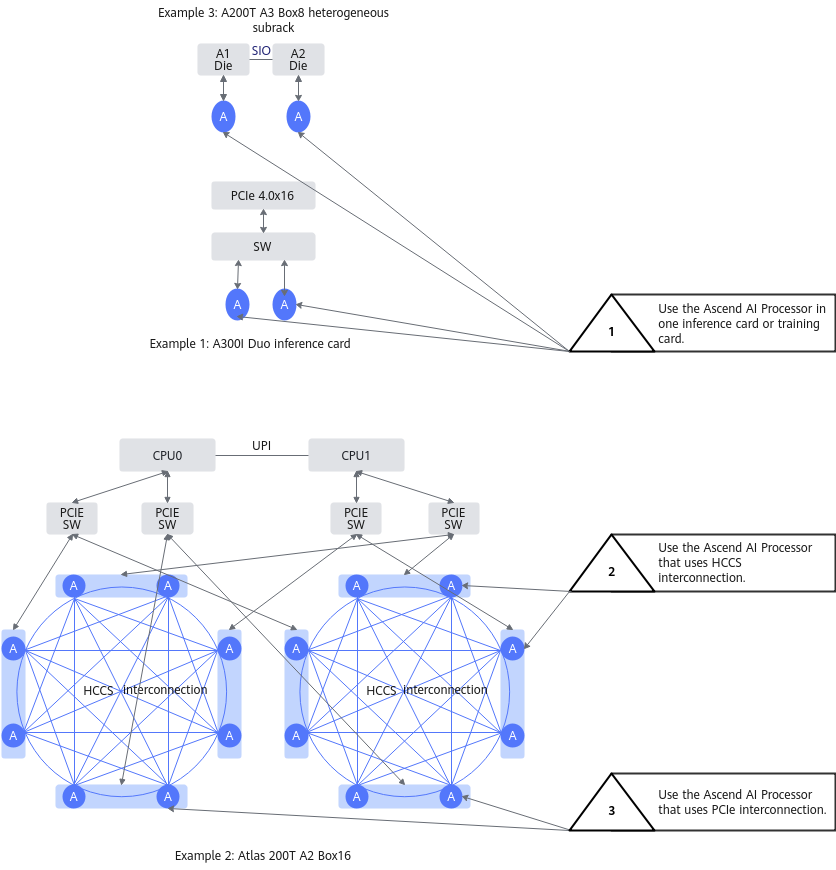
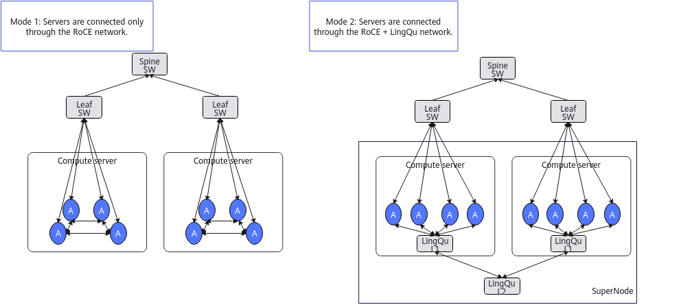

# Affinity Scheduling Description

Affinity scheduling refers to maximizing the computing power of Ascend AI processors by reducing resource fragmentation and reducing network congestion.

- Reduce resource fragmentation

    After task deployment, concentrate the remaining Ascend AI processors as much as possible in units with smoother network connectivity (such as nodes, SuperPoDs, or nodes under the same switch); avoid scenarios where the total number of Ascend AI processors is sufficient, but tasks cannot be scheduled due to resource fragmentation.

- Reduce network congestion

There are multiple network connection modes between Ascend AI processors. The interconnection modes of Ascend AI processors vary across different products; they also differ depending on the networking between products; and the network bandwidth varies significantly among different connection modes. Selecting different invocation strategies based on the interconnection modes of Ascend AI processors can reduce network congestion.

## Affinity Scheduling Based on Ascend AI Processors

Within a hardware product, there are three chip link modes. Their scheduling priorities are: first, schedule tasks to Ascend AI processors within the same inference card or training card; second, schedule to Ascend AI processors interconnected via HCCS; finally, schedule to Ascend AI processors interconnected via PCIe.

> [!NOTE]
>HCCS (Huawei Cache Coherence System) is the hardware form factor of HCCL (Huawei Collective Communication Library). HCCL provides high-performance collective communication functions between servers in deep learning training scenarios.

**Figure 1** Ascend AI processor interconnection modes

Different hardware products may contain one or more of these three interconnection modes. The specific scheduling policies are as follows:

**Table 1** **Affinity scheduling based on Ascend AI processors**

| Hardware Form | Ascend AI Processor Interconnection Mode | Reduce Network Congestion | Reduce Resource Fragmentation |
|--|--|--|--|
| Atlas training products | 4 Ascend AI processors interconnected via HCCS; Ascend AI processors between HCCS rings interconnected via PCIe. | Tasks requesting 4 or fewer Ascend AI processors are scheduled onto one HCCS ring. | If the network conditions of two resources are the same, the resource that produces less resource fragmentation after scheduling is selected. |
| 
Atlas 200T A2 Box16 heterogeneous subrack

Atlas 200I A2 Box16 heterogeneous subrack
 | 8 Ascend AI processors interconnected via HCCS; Ascend AI processors between HCCS rings interconnected via PCIe. | <ul><li>Tasks requesting 8 or fewer Ascend AI processors are scheduled onto one HCCS ring.</li><li>Tasks requesting more than 8 Ascend AI processors are evenly scheduled onto two rings.</li></ul> | If the network conditions of two resources are the same, the resource that produces less resource fragmentation after scheduling is selected. |
| 
Atlas 900 A3 SuperPoD

A200T A3 Box8 SuperPoD

Atlas 800I A3 SuperPoD

Atlas 800T A3 SuperPoD
 | 2 Ascend AI processors interconnected via SIO, forming 8 HiAM modules; each HiAM module interconnected via HCCS. | When the number of requested Ascend AI processors is even, they must be scheduled onto the same HiAM module. | - |
| Atlas 800 inference server (model 3000) (with Atlas 300I inference card) | 4 Ascend AI processors interconnected within each inference card; no interconnection between inference cards. | When the number of requested Ascend AI processors is less than 4 and scheduling by inference card is configured, the task is always scheduled onto one inference card. | If the network conditions of two resources are the same, the resource that produces less resource fragmentation after scheduling is selected. |
| Atlas 800 inference server (model 3000) (with Atlas 300I Duo inference card) | 2 Ascend AI processors interconnected via HCCS within each inference card; inference cards interconnected via PCIe. | 
For distributed inference scheduling, the task must be scheduled onto an entire Atlas 300I Duo inference card.

If the number of Ascend AI processors required by the task is odd, the portion using a single Ascend AI processor will be preferentially scheduled onto an Atlas 300I Duo inference card with 1 remaining Ascend AI processor.
 | If the network conditions of two resources are the same, the resource that produces less resource fragmentation after scheduling is selected. |
| Atlas 350 PCIe card (4-processor mesh; 8/16 processors) | 4 Ascend AI processors interconnected via UBC within each PCIe card; 4 processors interconnected each other via PCIe. | 
For standalone/distributed task scheduling, the task must be scheduled onto one or more 4-processor meshes within an entire Atlas 350 PCIe card.

If the number of Ascend AI processors required by the task is odd, the portion using a single Ascend AI processor will be preferentially scheduled onto an Atlas 350 PCIe card with 1 remaining Ascend AI processor.
 | If the network conditions of two resources are the same, the resource that produces less resource fragmentation after scheduling is selected. |
| Atlas 850 hardware products (common cluster) | 8 Ascend AI processors form an 8-processor mesh via UBC within each Server; Servers interconnected via PCIe. | 
For standalone task scheduling, the task must be scheduled onto a specific Server.

If the number of Ascend AI processors required by the task is odd, the portion using a single Ascend AI processor will be preferentially scheduled onto an Atlas 850 hardware product with 1 remaining Ascend AI processor.
 | If the network conditions of two resources are the same, the resource that produces less resource fragmentation after scheduling is selected. |

## Node-Based Affinity Scheduling

Nodes are connected through RoCE networks or UnifiedBus devices + RoCE networks. When scheduling tasks, the UnifiedBus device network is used preferentially. The RoCE network adopts a Spine-Leaf network architecture, prioritizing network traffic control within the Leaf layer. When the Spine layer must be used, traffic is evenly distributed across all Spine layers.

- Products using RoCE connections: Atlas 800T A2 training server, Atlas 800I A2 inference server, A200I A2 Box heterogeneous subrack, Atlas 200T A2 Box16 heterogeneous subrack, Atlas 200I A2 Box16 heterogeneous subrack, Atlas 800 training server (model 9000), and Atlas 800 training server (model 9010)
- Products using single-layer RoCE connections: Atlas 800I A2 inference server, A200I A2 Box heterogeneous subrack
- Products using UnifiedBus + RoCE connections: Atlas 900 A3 SuperPoD, Atlas 850 hardware products (SuperPoD), Atlas 950 SuperPoD

**Figure 2** Inter-node network

**Table 2** **Inter-node affinity scheduling**

|Interconnection Mode|Ascend AI Processor Interconnection Mode|Scheduling Mode|Reduce Network Congestion|Reduce Networking Costs|Reduce Resource Fragmentation|
|--|--|--|--|--|--|
|RoCE-connected dual-layer interconnection|Global dual-layer interconnection via Spine-Leaf|Switch affinity scheduling 1.0|<ul><li>Prioritize node resources under one Leaf.</li><li>When using cross-Leaf resources, ensure even distribution of upstream traffic to each Spine.</li><li>Among multiple tasks under one Leaf, at most one task can use Spine traffic; other tasks are small tasks within the Leaf.</li></ul>|-|If the network conditions of two resources are the same, select the resource that produces less resource fragmentation after scheduling.|
|RoCE-connected dual-layer interconnection|Global dual-layer interconnection via Spine-Leaf|Switch affinity scheduling 2.0|<ul><li>Prioritize node resources under one Leaf.</li><li>When using cross-Leaf resources, ensure even distribution of upstream traffic to each Spine.</li><li>Allow multiple tasks under a specific number of Leaves to use Spine traffic.</li><li>Among multiple tasks under one Leaf, at most one task can use Spine traffic; other tasks are small tasks within the Leaf.</li></ul>|-|If the network conditions of two resources are the same, select the resource that produces less resource fragmentation after scheduling.|
|RoCE-connected single-layer connection|Single-layer connection via Leaf|Single-layer switch affinity scheduling|-|A single-layer network can meet parameter plane interconnection requirements, greatly reducing networking costs.|If the network conditions of two resources are the same, select the resource that produces less resource fragmentation after scheduling.|
|UnifiedBus + RoCE|Global interconnection via Spine-Leaf, forming multiple SuperPoDs through the UnifiedBus network|Logical SuperPoD affinity scheduling|Based on the task partitioning strategy, obtain network affinity units with high network communication requirements. Ensure that each network affinity unit is distributed under one UnifiedBus network.|-|If the network conditions of two resources are the same, select the resource that produces less resource fragmentation after scheduling.|
