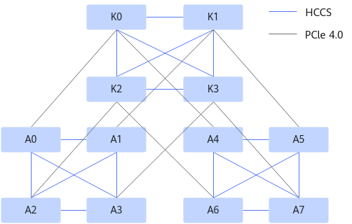
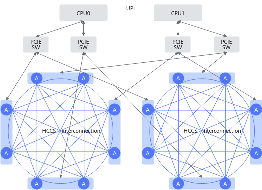
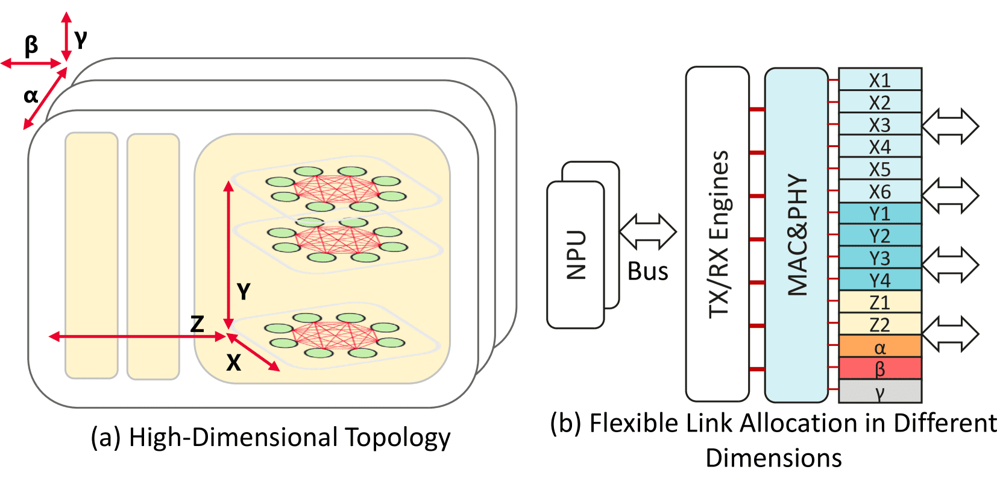

# Affinity Based on Ascend AI Processors

## Affinity Rules

### Atlas Training Series Products

The Ascend AI processor in the Atlas training series products is a high-performance AI processor developed by Huawei. The internal processors are connected via HCCS (for example, A0 to A3 form one HCCS).

Each device has two HCCS rings with a total of eight Ascend AI processors (A0 to A7). Each HCCS contains four Ascend AI processors. Ascend AI processors within the same HCCS can exchange data, while Ascend AI processors in different HCCS rings cannot communicate. The Ascend AI processors allocated to the same Pod (if less than or equal to four) must be within the same HCCS ring; otherwise, the task will fail. The interconnection topology of Atlas training series products is shown in [Figure 1](#fig17063331201), where K0 to K3 are Kunpeng processors.

**Figure 1** Interconnection topology of Atlas training series products

> [!NOTE]
> The Atlas 800T A2 training server and the Atlas 900 A2 PoD cluster basic unit do not support affinity scheduling of Ascend AI processors.

### Atlas 200T A2 Box16/Atlas 200I A2 Box16 Heterogeneous Subrack

The Ascend AI processors in the Atlas 200T A2 Box16 heterogeneous subrack and Atlas 200I A2 Box16 heterogeneous subrack are high-performance AI processors developed by Huawei, and the internal AI processors are interconnected via HCCS. Each Atlas 200T A2 Box16 heterogeneous subrack or Atlas 200I A2 Box16 heterogeneous subrack has two HCCS rings with a total of 16 Ascend AI processors. Each HCCS ring has 8 Ascend AI processors. Data exchange can be performed within the same HCCS ring, but communication between different HCCS rings is not possible. That is, the Ascend AI processors allocated to a task (if less than or equal to 8) must be within the same HCCS ring; otherwise, the task will fail to run. The interconnection topology diagram of the Atlas 200T A2 Box16 heterogeneous subrack and Atlas 200I A2 Box16 heterogeneous subrack is shown in [Figure 1](#fig1920102817143).

**Figure 1** Interconnection topology of Atlas 200T/200I A2 Box16 heterogeneous subrack

### Atlas 900 A3 SuperPoD

The Atlas 900 A3 SuperPoD is a high-performance AI computing cluster developed by Huawei, consisting of multiple compute nodes. On each compute node, two Ascend AI processors are interconnected via SIO to form a HiAM module. For example, Ascend AI processor 0 and processor 1 form a HiAM module; each compute node contains eight HiAM modules. HiAM modules are interconnected using HCCS-L1 connections, while compute nodes are interconnected using HCCS-L2 connections. SuperPoDs of various specifications can be expanded through L1 port cascading and L2 switch interconnection.

Tasks can request 1, 2, 4, 6, 8, 10, 12, 14, or 16 Ascend AI processors. The requested Ascend AI processors must preferentially occupy entire compute nodes. When the number of requested Ascend AI processors is even, they must occupy entire HiAM modules. For example, if a task requests two Ascend AI processors, and the remaining Ascend AI processor IDs on the compute node are 0, 2, 3, and 4, the task can only use Ascend AI processors 2 and 3 because only processors 2 and 3 belong to the same HiAM module. Distributed tasks can request 2, 4, 6, 8, 10, 12, 14, or 16 Ascend AI processors. If the task is a logical SuperPoD affinity task, meaning the `sp-block` field in the task YAML is configured with a logical SuperPoD size, the number of requested Ascend AI processors can only be 16.

**UnifiedBus Device Node Network Description**

- Compute nodes within the same logical SuperPoD communicate using the HCCS network, while compute nodes in different logical SuperPoDs communicate using the RoCE network. When the number of logical SuperPoDs for a task (number of task logical SuperPoDs = total task chip count/`sp-block`) is greater than 1, ensure the RoCE network connectivity between compute nodes.
- For example, if the number of chips in a compute node is 16, the total number of chips for the task is 64, and `sp-block` is 32, then this task will be divided into 2 logical SuperPoDs. That is, Pod (rank=0) and Pod (rank=1) will be divided into one logical SuperPoD, while Pod (rank=2) and Pod (rank=3) will be divided into another logical SuperPoD.
- In this case, Pod (rank=0) and Pod (rank=1) communicate using the HCCS network, and Pod (rank=2) and Pod (rank=3) also communicate using the HCCS network. However, Pod (rank=0/1) and Pod (rank=2/3) communicate using the RoCE network.

**Figure 1**  UnifiedBus device network

### A200T A3 Box8 SuperPoD Server, Atlas 800I A3 SuperPoD Server, and Atlas 800T A3 SuperPoD Server

The intra-node affinity of the A200T A3 Box8 SuperPoD server, Atlas 800I A3 SuperPoD server, and Atlas 800T A3 SuperPoD server is basically the same as that of the Atlas 900 A3 SuperPoD.

The Ascend AI processors in the A200T A3 Box8 SuperPoD server, Atlas 800I A3 SuperPoD server, and Atlas 800T A3 SuperPoD server are high-performance AI processors developed by Huawei. Internally, every two Ascend AI processors are interconnected via SIO to form a HiAM module. For example, Ascend AI processors 0 and 1 form a HiAM module. Each A200T A3 Box8 SuperPoD server, Atlas 800I A3 SuperPoD server, and Atlas 800T A3 SuperPoD server contains eight HiAM modules. The HiAM modules are interconnected using HCCS.

The number of Ascend AI processors that a task can request is 1, 2, 4, 6, 8, 10, 12, 14, or 16. The requested Ascend AI processors must preferentially occupy the entire node. When the number of requested Ascend AI processors is even, the entire HiAM module must be occupied. For example, if a task requests two Ascend AI processors and the remaining Ascend AI processor numbers on the node are 0, 2, 3, and 4, the task can only use Ascend AI processors 2 and 3 because only processors 2 and 3 are in the same HiAM module. The number of Ascend AI processors that a distributed task can request is 2, 4, 6, 8, 10, 12, 14, or 16.

### Atlas 850 Series Hardware Products (SuperPoD Server)

The Ascend AI processor in the Atlas 850 series hardware products (SuperPoD server) is a high-performance AI processor developed by Huawei. Internally, it consists of two compute DIEs and two IO DIEs packaged into a single chip. Each Atlas 850 series hardware product (SuperPoD server) contains eight Ascend AI processors. The Ascend AI processors are interconnected via HCCS to form a full-mesh connection. Servers are connected through 5808 switches, with each 5808 switch supporting a maximum of 16 Atlas 850 series hardware products (SuperPoD servers), totaling 128 Ascend AI processors. A two-layer 5808 switch network can support a 1K-scale SuperPoD, allowing flexible customization of the SuperPoD scale based on requirements.

The number of Ascend AI processors that a standalone task can request is 1, 2, 4, or 8. The requested Ascend AI processors must preferentially occupy the entire node. Distributed tasks only support full-NPU scheduling, that is, configured as 8. The scheduling priority is sorted from high to low based on communication efficiency, meaning that scheduling within the node is prioritized. If node resources are insufficient, scheduling is performed on Ascend AI processors within the SuperPoD.

### Atlas 950 SuperPoD

The Ascend AI processor of the Atlas 950 SuperPoD is a high-performance AI processor developed by Huawei. Its interior consists of two compute DIEs and two IO DIEs packaged into a single chip. Each Atlas 950 SuperPoD contains eight Ascend AI processors. The Ascend AI processors are interconnected via HCCS to form a full-mesh connection, constituting the X-axis in 1D-FullMesh. The rack of the Atlas 950 SuperPoD contains eight OSs. Ascend AI processors at the same Y-axis position within the rack achieve cross-board interconnection through LRS, and the 64 Ascend AI processors across the eight OSs achieve 2D full interconnection, constituting the Y-axis in 2D-FullMesh. Between racks of the Atlas 950 SuperPoD, LRS outputs UB x128 IO for Z-axis connection, and multiple racks form a physical SuperPoD, creating direct full interconnection and constituting the Z-axis in 3D-FullMesh. Matching LLM traffic locality, the X-Y-Z axes provide progressively converged bandwidth.

**Figure 1** Atlas 950 SuperPoD interconnection topology

A single-node task can request 1 to 8 Ascend AI processors, and the requested Ascend AI processors need to preferentially occupy an entire node. Distributed tasks only support full-NPU scheduling, that is, 8 Ascend AI processors are configured. The scheduling priority is sorted from high to low based on communication efficiency, that is, priority scheduling to the X-axis in 1D-FullMesh (within a node). If X-axis resources are insufficient, scheduling proceeds to the Y-axis in 2D-FullMesh (within a rack). If Y-axis resources are insufficient, scheduling proceeds to the Z-axis in 3D-FullMesh (within a SuperPoD).

### Inference Server (with Atlas 300I Inference Card)

The inference server (with Atlas 300I inference card) supports affinity scheduling. For example, an Atlas 800 inference server (model 3000) supports up to 8 Atlas 300I inference cards, and each Atlas 300I inference card has 4 Ascend AI processors. Users of the inference server (with Atlas 300I inference card) can specify the scheduling policy through the `npu-310-strategy` parameter when delivering a task YAML. Affinity scheduling can only be achieved when scheduling by inference card is specified.

The value description of the `npu-310-strategy` parameter is as follows:

- `card`: Schedule by inference card. The number of Ascend AI processors requested does not exceed 4, and the Ascend AI processors on the same Atlas 300I inference card are used.
- `chip:` Schedule by Ascend AI processor. The number of Ascend AI processors requested does not exceed the maximum number of processors that a single node hosts.

### Inference Server (with Atlas 300I Duo Inference Card) 

Inference servers (with Atlas 300I Duo inference cards) supports affinity scheduling. For example, an Atlas 800 inference server (model 3000) supports a maximum of 4 Atlas 300I Duo inference cards, and each Atlas 300I Duo inference card has 2 Ascend AI processors. When delivering a task YAML, users of inference servers (with Atlas 300I Duo inference cards) can first specify the use of Atlas 300I Duo inference cards through the `duo` parameter, then specify the scheduling mode through the `npu-310-strategy` parameter, and finally specify the scheduling policy through the `distributed` parameter. For details on each parameter, see [Table 1](#table65039365119).

**Table 1** Parameter description

|Parameter Name|Default Value|Value Description|
|--|--|--|
|duo|false|<ul><li>true: Use Atlas 300I Duo inference cards.</li><li>false: Do not use Atlas 300I Duo inference cards.</li></ul>|
|npu-310-strategy|chip|<ul><li>card: Schedule by inference card. The number of Ascend AI processors requested does not exceed 2, using Ascend AI processors on the same Atlas 300I Duo inference card.</li><li>chip: Schedule by Ascend AI processor. The number of Ascend AI processors requested does not exceed the maximum number of processors that a single node hosts.</li></ul>|
|distributed|false|<ul><li>true: Distributed inference scheduling policy. When using chip mode, tasks must be scheduled to an entire Atlas 300I Duo inference card. If the number of Ascend AI processors required by the task is odd, the portion using a single Ascend AI processor will be preferentially scheduled to an Atlas 300I Duo inference card with 1 remaining Ascend AI processor.</li><li>false: Non-distributed inference scheduling policy. When using chip mode, the number of Ascend AI processors requested does not exceed the maximum number of processors that a single node hosts.</li></ul>Regardless of whether it is distributed inference, the scheduling policy for card mode remains unchanged.|

## Affinity Policy in Single-Node Scenarios

### Atlas Training Series Products

#### Affinity Scheduling Policy

The characteristics of the Ascend AI processors in Atlas training series products and the rules for resource utilization are shown in [Table 1](#table1436611225137).

**Table 1** AI processor affinity policy for Atlas training series products

|**Priority**|**Policy Name**|**Details**|
|--|--|--|
|1|HCCS affinity scheduling principle|Select Ascend AI processors within the same HCCS to improve communication performance.<ul><li>If the requested number of Ascend AI processors is 1, the optimal choice is a node within the same HCCS with 1 currently available Ascend AI processor, followed by nodes with 3 available, then 2, then 4.</li><li>If the requested number of Ascend AI processors is 2, the optimal choice is a node within the same HCCS with 2 available Ascend AI processors, followed by nodes with 4 available, then 3.</li><li>If the requested number of Ascend AI processors is 4, choose a node within the same HCCS with 4 available Ascend AI processors.</li><li>If the requested number of Ascend AI processors is 8, all 8 Ascend AI processors of the requested node will be selected.</li></ul>|
|2|Preferentially occupying a node|Prioritize allocating nodes that already have Ascend AI processors assigned to reduce fragmentation.<ul><li>If the requested number of Ascend AI processors is 1, the optimal choice is a node with a capacity (resource capacity on the node) of 8 and 1 available Ascend AI processor in the HCCS, followed by nodes with 3 available processors, then 2, then 4.</li><li>If the requested number of Ascend AI processors is 2, the optimal choice is a node with a capacity of 8 and 2 available Ascend AI processors in the HCCS, followed by nodes with 4 available processors, then 3.</li><li>If the requested number of Ascend AI processors is 4, the optimal choice is a node with a capacity of 8 and 4 available Ascend AI processors.</li><li>If the requested number of Ascend AI processors is a positive integer multiple of 8, choose a node with a capacity of 8 and 0 Ascend AI processors used.</li></ul>
When a delivered distributed task may not fully occupy a node according to this principle:
<ul><li>Phenomenon description: For example, in a cluster of two Atlas 800 training servers (model 9000), when submitting 3-processor, 4-processor, and 1-processor tasks simultaneously, the 3-processor and 4-processor tasks may be scheduled to the same node, while the 1-processor task is scheduled to the other node.</li><li>Cause analysis: After Volcano schedules a task, there is a delay in the Ascend Device Plugin reporting the topology of the scheduled Ascend AI processors to mindx-dl-deviceinfo-${node_name}. This causes Volcano to fail in verifying the number of Ascend AI processors on that node and schedule the task to another node.</li></ul>|
|3|Even-number priority|First, select the HCCS that satisfies the above scheduling principles 1 and 2; then, select the HCCS with an even number of remaining Ascend AI processors.|

#### Resource Request Constraint

**Resource Request Constraints for Atlas Training Series Products**

Based on the service model, the following requirements apply to training tasks:

- The number of Ascend AI processors requested by a training task cannot exceed the total number of Ascend AI processors in a node.
- When the number of Ascend AI processors requested by a training task is no more than 4, the required Ascend AI processors must be scheduled within the same HCCS.
- When the number of Ascend AI processors requested by a training task is 8, all Ascend AI processors in a node must be allocated to the task.
- When the Ascend AI processor requested by a training task is a virtual device (vNPU), the requested count can only be 1.
- Follow other constraints of the open-source Volcano component.

**Scenario Description**

The scenarios sorted out based on affinity policies and service models are shown in [Table 1](#table1226225517318).

**Table 1** Affinity policy scenarios for Atlas training series products

|**Requested Number of Processors**|**A**|**B**|**C**|**D**|
|--|--|--|--|--|
|1|1~[0,1,2,3,4]|3~[0,2,3,4]|2~[0,2,4]|4~[0,4]|
|2|2~[0,1,2,3,4]|4~[0,1,3,4]|3~[0,1]|-|
|4|4~[0,1,2,3,4]|-|-|-|
|8|8|-|-|-|

- Columns A to D represent four groups, each indicating a scenario for selecting Ascend AI Processors on the node. These four scenarios are prioritized in descending order. That is, scenario B, C, or D is selected only when scenario A does not meet the scheduling requirements.
- Remaining Ascend AI Processors on the node when HCCS affinity is satisfied within a group: To the left of the tilde (~) is the remaining count for the HCCS that meets the requirements, and to the right is the remaining count for the other HCCS. For example, in the case of group A when requesting 1 Ascend AI Processor, the other HCCS may have 0, 1, 2, 3, or 4 remaining Ascend AI Processors.
- When the number of requested Ascend AI Processors is 8 or more, the request is placed in group A and requires full occupancy.

### Atlas 200T A2 Box16/Atlas 200I A2 Box16 Heterogeneous Subrack

#### Affinity Scheduling Policy

The characteristics and resource utilization rules of the Atlas 200T A2 Box16/Atlas 200I A2 Box16 heterogeneous subrack are shown in [Table 1](#table768417221315).

**Table 1** Affinity policy for Atlas 200T A2 Box16/Atlas 200I A2 Box16 heterogeneous subrack

| Priority | Policy Name | Policy Description |
|--|--|--|
| 1 | HCCS allocation | If the number of requested Ascend AI processors is 1 to 8, they must be scheduled to the same HCCS ring. If the number of requested Ascend AI processors is 10, 12, or 14, the required Ascend AI processors must be evenly distributed across two rings, with corresponding physical addresses also being identical. |
| 2 | Preferentially occupying a node | Prioritize allocation to nodes that already have Ascend AI processors assigned to reduce fragmentation. Using 1, 2, 4, and 8 as examples, the details are as follows: <ul><li>If requesting 1 Ascend AI processor, prioritize nodes with 1 available Ascend AI processor in the HCCS ring, followed by nodes with 2, 3, up to 8 available processors. For the same quantity, prioritize nodes with fewer total Ascend AI processors.</li><li>If requesting 2 Ascend AI processors, prioritize nodes with 2 available Ascend AI processors in the HCCS ring, followed by nodes with 3, 4, up to 8 available processors. For the same quantity, prioritize nodes with fewer total Ascend AI processors.</li><li>If requesting 4 Ascend AI processors, prioritize nodes with 4 available Ascend AI processors in the HCCS ring, followed by nodes with 5, 6, up to 8 available processors. For the same quantity, prioritize nodes with fewer total Ascend AI processors.</li><li>If requesting 8 Ascend AI processors, only request nodes with 8 available Ascend AI processors in the HCCS ring. For the same quantity, prioritize nodes with fewer total Ascend AI processors.</li></ul>
When a delivered distributed task may not fully occupy a node according to this principle:
<ul><li>Phenomenon description: For example, in a cluster of two Atlas 200T A2 Box16 heterogeneous subracks or Atlas 200I A2 Box16 heterogeneous subracks, when submitting 5-processor, 4-processor, and 3-processor tasks simultaneously, the 4-processor and 3-processor tasks may be scheduled to the same node, while the 5-processor task is scheduled to another node.</li><li>Cause analysis: After Volcano schedules a task, there is a delay in Ascend Device Plugin reporting the topology of the scheduled Ascend AI processors to mindx-dl-deviceinfo-${node_name}. This causes Volcano to fail when verifying the number of Ascend AI processors on that node, resulting in the task being scheduled to another node.</li></ul> |

#### Resource Request Constraint 

**Resource Request Constraints for Atlas 200T A2 Box16/Atlas 200I A2 Box16 Heterogeneous Subrack **

Based on the service model, the following requirements are imposed on the resource requests for training tasks on the Atlas 200T A2 Box16/Atlas 200I A2 Box16 heterogeneous subrack:

- The number of Ascend AI processors requested by a training task cannot exceed the total number of Ascend AI processors in a node.
- The number of Ascend AI processors requested by a training task is 1 to 8, 10, 12, 14, and 16.
- When the number of Ascend AI processors requested by a training task is no more than 8, the Ascend AI processors must be selected from within the same HCCS ring.
- When the number of Ascend AI processors requested by a training task is 10, 12, or 14, the required Ascend AI processors must be evenly distributed across two rings, with the corresponding physical addresses also being identical.
- When the number of Ascend AI processors requested by a training task is 16, all Ascend AI processors in the node must be allocated to this task.
- Follow other constraints of the open-source Volcano component.

### Atlas 900 A3 SuperPoD

#### Affinity Scheduling Policy

The resource utilization rules for the Atlas 900 A3 SuperPoD are shown in [Table 1](#table42428468401).

**Table 1** Atlas 900 A3 SuperPoD affinity policy

| Priority | Policy Name | Policy Description |
|--|--|--|
| 1 | Preferentially occupying a node | The fewer the number of processors in a node, the higher the priority. 
When a single-node task is dispatched, the task may not fully occupy a node according to this principle.
<ul><li>Phenomenon description: For example, in the Atlas 900 A3 SuperPoD, when 2-processor and 14-processor tasks are dispatched simultaneously, the 2-processor and 14-processor tasks may not be scheduled to the same node.</li><li>Cause analysis: After Volcano schedules a task, there is a delay in Ascend Device Plugin reporting the topology of the scheduled Ascend AI processor to mindx-dl-deviceinfo-${node_name}. This causes Volcano to fail to verify the number of Ascend AI processors on the node and schedule the task to another node.</li></ul> |
| 2 | Remaining node priority | When the number of reserved nodes in a SuperPoD is 2, and two SuperPoDs have 3 remaining nodes and 2 remaining nodes respectively, the SuperPoD with 3 remaining nodes is preferred. |
| 3 | Preferentially occupying a SuperPoD | When the number of reserved nodes in a SuperPoD is 2, and two SuperPoDs have 4 remaining nodes and 3 remaining nodes respectively, the SuperPoD with 3 remaining nodes is preferred. |

#### Resource Request Constraint

Based on the service model, the following requirements are imposed on the resource requests for training tasks on the Atlas 900 A3 SuperPoD:

- The number of Ascend AI processors requested by a training task cannot exceed the total number of Ascend AI processors in a node.
- The number of Ascend AI processors requested by a training task can only be 1, 2, 4, 6, 8, 10, 12, 14, or 16.
- Follow other constraints of the open-source Volcano component.

### Atlas 800I A3/Atlas 800T A3 SuperPoD Server

#### Affinity scheduling policy

The resource utilization rules for the Atlas 800I A3/Atlas 800T A3 SuperPoD server are shown in [Table 1](#table424284684011).

**Table 1** Affinity policies for Atlas 800I A3/Atlas 800T A3 SuperPoD server

| Priority | Policy Name | Policy Description |
|--|--|--|
| 1 | Preferentially occupying a node | The fewer processors a node has, the higher its priority.
When a single-node task is submitted, the task may not fully occupy a node.
<ul><li>Phenomenon description: For example, on the Atlas 800I A3/Atlas 800T A3 SuperPoD server, when 2-processor and 14-processor tasks are delivered simultaneously, the 2-processor and 14-processor tasks may not be scheduled to the same node.</li><li>Cause analysis: After Volcano schedules a task, there is a delay in the Ascend Device Plugin reporting the topology of the scheduled Ascend AI processors to mindx-dl-deviceinfo-${node_name}. This causes Volcano to fail when verifying the number of Ascend AI processors on the node, and the task is scheduled to another node.</li></ul>|

#### Resource Request Constraints

Based on the service model, the following requirements apply to training task resource requests for the Atlas 800I A3/Atlas 800T A3 SuperPoD server:

- The number of Ascend AI processors requested by a training task cannot exceed the total number of Ascend AI processors on a node.
- The number of Ascend AI processors requested by a training task can only be 1, 2, 4, 6, 8, 10, 12, 14, or 16.
- Other constraints of the open-source Volcano component must be followed.

### A200T A3 Box8 SuperPoD Server

#### Affinity Scheduling Policy

The resource utilization rules for the A200T A3 Box8 SuperPoD server are shown in [Table 1](#table424284684013).

**Table 1** A200T A3 Box8 SuperPoD server affinity policy

|Priority|Policy Name|Policy Description|
|--|--|--|
|1|Preferentially occupying a node|Nodes with fewer processors have higher priority.
When a distributed task is submitted, the task may not fully occupy a node.
<ul><li>Phenomenon description: For example, on the A200T A3 Box8 SuperPoD server, when 2-processor and 14-processor tasks are submitted simultaneously, the 2-processor and 14-processor tasks may not be scheduled to the same node.</li><li>Cause analysis: After Volcano schedules a task, there is a delay in the Ascend Device Plugin reporting the topology of the scheduled Ascend AI processor to mindx-dl-deviceinfo-${node_name}. This causes Volcano to fail to verify the number of Ascend AI processors on the node and schedule the task to another node.</li></ul>|

#### Resource Request Constraint

Based on the service model, the following requirements are imposed on the resource request of training tasks for the A200T A3 Box8 SuperPoD server:

- The number of Ascend AI processors requested by a training task cannot exceed the total number of Ascend AI processors in a node.
- The number of Ascend AI processors requested by a training task can only be 1, 2, 4, 6, 8, 10, 12, 14, or 16.
- Other constraints of the open-source Volcano component must be followed.

### Inference Server (with Atlas 300I Inference Card) 

#### Affinity Scheduling Policy

The characteristics and resource utilization rules of the inference server (with Atlas 300I inference card) are shown in [Table 1](#table768417221315).

**Table 1** Affinity policy for inference server (with Atlas 300I inference card)

|Policy Name|Policy Description|
|--|--|
|Scheduling by inference card affinity|Prioritize the Ascend AI processor on the same Atlas 300I inference card.
If the number of requested Ascend AI processors is 1 to 4, select the same Atlas 300I inference card. The optimal node is the one with 1 available Atlas 300I inference card, followed by 3, then 2, and finally 4.
|

#### Resource Request Constraint

Based on the service model, the following requirements apply to inference tasks:

- The number of Ascend AI processors requested by an inference task cannot exceed the total number of Ascend AI processors on the node.
- When the number of Ascend AI processors requested by an inference task is less than or equal to 4, the inference task must be scheduled to the same Atlas 300I inference card.
- Other constraints from the open-source Volcano component must be followed.

### Inference Server (with Atlas 300I Duo Inference Card) 

#### Affinity Scheduling Policy 

The characteristics and resource utilization rules of the inference server (with Atlas 300I Duo inference card) are shown in the following table.

**Table 1** Affinity policy for inference server (with Atlas 300I Duo inference card)

|Policy Name|Policy Description|
|--|--|
|Scheduling by inference card affinity|Prioritize the Ascend AI processor on the same Atlas 300I Duo inference card.
If the number of requested Ascend AI processors is 1 to 2, select the same Atlas 300I Duo inference card. The optimal node is the one with 1 available Atlas 300I inference card, followed by 2.
|
|Distributed inference scheduling by Ascend AI processor|The task must be scheduled to an entire Atlas 300I Duo inference card. If the number of Ascend AI processors required by the task is an odd number, the part using a single Ascend AI processor will be preferentially scheduled to an Atlas 300I Duo inference card with 1 remaining Ascend AI processor.|

#### Resource Request Constraints

Based on the service model, the following requirements apply to such inference tasks:

- The number of Ascend AI processors requested by an inference task cannot exceed the total number of Ascend AI processors on a node.
- When the number of Ascend AI processors requested by an inference task is less than or equal to 2, the inference task must be scheduled within the same Atlas 300I Duo inference card.
- When distributed inference is used, all replicas of the task can only be deployed within the same node, and the total number of Ascend AI processors requested cannot exceed the total number of Ascend AI processors on a node.
- Other constraints from the open-source Volcano component must be followed.

### Atlas 350 PCIe Card (Non-interconnected 8 Processors)

#### Affinity Scheduling Policy

The characteristics and resource utilization rules of the Atlas 350 PCIe card (non-interconnected 8 processors) are shown in the following table.

**Table 1** Affinity policy for Atlas 350 PCIe card (non-interconnected 8 processors)

| Priority | Policy Name | Policy Description |
|--|--|--|
| 1 | Preferentially occupying a node | Nodes with fewer processors have higher priority. 
When a single-node task is submitted, the task may not fully occupy a node.
<ul><li>Phenomenon description: For example, in the Atlas 350 PCIe card, when 2-processor and 6-processor tasks are submitted simultaneously, the 2-processor and 6-processor tasks may not be scheduled to the same node.</li><li>Cause analysis: After Volcano schedules a task, there is a delay for the Ascend Device Plugin to report the topology of the scheduled Ascend AI processors to mindx-dl-deviceinfo-${node_name}. This causes Volcano to fail to verify the number of Ascend AI processors on that node, and the task is scheduled to another node.</li></ul> |

#### Resource Request Constraint

- There are 8 Ascend AI processors in the PCIe card, with no internal interconnection.
- The number of Ascend AI processors requested by a single-node/distributed task supports 1-8.
- When multiple task Pods are scheduled to a single node, collective communication between Pods is not supported.

### Atlas 350 PCIe card (Non-interconnected 16 Processors)

#### Affinity Scheduling Policy

The characteristics and resource utilization rules of the Atlas 350 PCIe card (non-interconnected 16 processors) are shown in the following table.

**Table 1** Affinity policy for Atlas 350 PCIe card (non-interconnected 16 processors)

|Priority|Policy Name|Policy Description|
|--|--|--|
|1|Preferentially occupying a node|Nodes with fewer processors have higher priority.
When a single-node task is submitted, the task may not fully occupy a node.
<ul><li>Phenomenon description: For example, on an Atlas 350 PCIe card, if 2-processor and 14-processor tasks are delivered at the same time, the 2-processor and 14-processor tasks may not be scheduled to the same node.</li><li>Cause analysis: After Volcano schedules a task, there is a delay before the Ascend Device Plugin reports the topology of the scheduled Ascend AI processor to mindx-dl-deviceinfo-${node_name}. This causes Volcano to fail to verify the number of Ascend AI processors on the node and schedule the task to another node.</li></ul>|

#### Resource Request Constraints

- There are 16 Ascend AI processors in the PCIe card, with no internal interconnection.
- The number of Ascend AI processors requested by a single-node/distributed task supports 1–16.
- When multiple task Pods are scheduled to a single node, collective communication between Pods is not supported.

### Atlas 350 PCIe card (8 Processors, with Every Four Meshed)

#### Affinity Scheduling Policy

The characteristics and resource utilization rules of the Atlas 350 PCIe card (8 processors, with every four meshed) are shown in the following table.

**Table 1** Atlas 350 PCIe card (8 processors, with every four meshed) affinity policy

|Priority|Policy Name|Policy Description|
|--|--|--|
|1|Preferentially occupying a node|Nodes with fewer processors have higher priority.
When a single-node task is submitted, the task may not fully occupy a node.
<ul><li>Phenomenon description: For example, on an Atlas 350 PCIe card, if 2-processor and 6-processor tasks are submitted simultaneously, the 2-processor and 6-processor tasks may not be scheduled to the same node.</li><li>Cause analysis: After Volcano schedules a task, there is a delay before the Ascend Device Plugin reports the topology of the scheduled Ascend AI processors to mindx-dl-deviceinfo-${node_name}. This causes Volcano to fail to verify the number of Ascend AI processors on that node, and the task is scheduled to another node.</li></ul>|

#### Resource Request Constraint

- There are 8 Ascend AI processors in a PCIe card, with 4 Ascend processors meshed internally.
- The number of Ascend AI processors requested by a standalone/distributed task supports 1, 2, 3, 4, or 8 (affinity guaranteed), while requesting 5, 6, or 7 does not guarantee affinity.
- When multiple task Pods are scheduled to a single node, collective communication between Pods is not supported.

### Atlas 350 PCIe card (16 Processors, with Every Four Meshed)

#### Affinity Scheduling Policy

The characteristics and resource utilization rules of the Atlas 350 PCIe card (16 processors, with every four meshed) are shown in the following table.

**Table 1** Atlas 350 PCIe card (16 processors, with every four meshed) affinity policy

| Priority | Policy Name | Policy Description |
|--|--|--|
| 1 | Preferentially occupying a node | Nodes with fewer processors have higher priority.
When a single-node task is submitted, the task may not fully occupy a node.
<ul><li>Phenomenon description: For example, on an Atlas 350 PCIe card, if 2-processor and 14-processor tasks are delivered simultaneously, the 2-processor and 14-processor tasks may not be scheduled to the same node.</li><li>Cause analysis: After Volcano schedules a task, there is a delay for the Ascend Device Plugin to report the topology of the scheduled Ascend AI processors to mindx-dl-deviceinfo-${node_name}, causing Volcano to fail to verify the number of Ascend AI processors on the node and schedule the task to another node.</li></ul>|

#### Resource Request Constraint

- There are 16 Ascend AI processors in the PCIe card, with 4 Ascend processors meshed internally.
- For standalone/distributed tasks, the number of requested Ascend AI processors supports 1, 2, 3, 4, 8, 12, and 16 (affinity guaranteed), while requesting 5, 6, 7, 9, 10, 11, 13, 14, or 15 does not guarantee affinity.
- When multiple task Pods are scheduled to a single node, collective communication between Pods is not supported.

### Atlas 850 Series Hardware Products (Standard Cluster)

#### Affinity Scheduling Policy

The characteristics and resource utilization rules of Atlas 850 series hardware products (standard cluster) are shown in the following table.

**Table 1** Affinity scheduling policy for Atlas 850 series hardware products (standard cluster)

|Priority|Policy Name|Policy Description|
|--|--|--|
|1|Preferentially occupying a node | Nodes with fewer processors have higher priority.
When a single-node task is submitted, the task may not fully occupy a node.
<ul><li>Phenomenon description: For example, in Atlas 850 series hardware products, when 2-processor and 6-processor tasks are submitted simultaneously, the 2-processor and 6-processor tasks may not be scheduled to the same node.</li><li>Cause analysis: After Volcano schedules a task, there is a delay in the Ascend Device Plugin reporting the topology of the scheduled Ascend AI processor to mindx-dl-deviceinfo-${node_name}. This causes Volcano to fail to verify the number of Ascend AI processors on that node and schedule the task to another node.</li></ul>|

#### Resource Request Constraint

- There are 8 Ascend AI processors in a server, and the internal 8 Ascend processors are fully meshed.
- The number of Ascend AI processors requested by a standalone/distributed task supports 1, 2, 4, and 8 (affinity satisfied).
- When multiple task Pods are scheduled to a single node, collective communication between Pods is not supported.

### Atlas 850 Series Hardware Products (SuperPoD)

#### Affinity Scheduling Policy

The characteristics and resource utilization rules of the Atlas 850 series hardware products (SuperPoD) are shown in the following table.

**Table 1** Affinity policy for Atlas 850 series hardware products (SuperPoD)

| Priority | Policy Name | Policy Description |
|--|--|--|
| 1 | Preferentially occupying a node | Nodes with fewer processors have higher priority.
When a single-node task is submitted, the task may not fully occupy a node.
<ul><li>Phenomenon description: For example, in Atlas 850 series hardware products (SuperPoD), when 2-processor and 6-processor tasks are dispatched simultaneously, the 2-processor and 6-processor tasks may not be scheduled to the same node.</li><li>Cause analysis: After Volcano schedules a task, there is a delay in the Ascend Device Plugin reporting the topology of the scheduled Ascend AI processor to mindx-dl-deviceinfo-${node_name}. This causes Volcano to fail in verifying the number of Ascend AI processors on that node, and the task is scheduled to another node.</li></ul> |
| 2 | Remaining node priority | When the number of reserved nodes for a SuperPoD is 2, and two SuperPoDs have 3 and 2 remaining nodes respectively, the SuperPoD with 3 remaining nodes is preferred. |
| 3 | Preferentially occupying a SuperPoD | When the number of reserved nodes for a SuperPoD is 2, and two SuperPoDs have 4 and 3 remaining nodes respectively, the SuperPoD with 3 remaining nodes is preferred. |

#### Resource Request Constraints

- Within a server, there are 8 Ascend AI processors, and the internal 8 Ascend processors are fully meshed.
- The number of Ascend AI processors requested by a standalone task supports 1, 2, 4, or 8 (satisfying affinity), while distributed tasks only support full-processor scheduling, meaning the configuration is 8.
- When multiple task Pods are scheduled to a single node, collective communication between Pods is not supported.

### Atlas 950 SuperPoD

#### Affinity Scheduling Policy

The characteristics and resource utilization rules of Atlas 950 SuperPoD are shown in the following table.

**Table 1** Atlas 950 SuperPoD affinity policy

|Priority|Policy Name|Policy Description|
|--|--|--|
|1|Preferentially occupying a node | Nodes with fewer processors have higher priority.
When a single-node task is submitted, the task may not fully occupy a node.
<ul><li>Phenomenon description: For example, in Atlas 950 SuperPoD, when 2-processor and 6-processor tasks are submitted simultaneously, the 2-processor and 6-processor tasks may not be scheduled to the same node.</li><li>Cause analysis: After Volcano schedules a task, there is a delay in the Ascend Device Plugin reporting the topology of the scheduled Ascend AI processor to mindx-dl-deviceinfo-${node_name}. This causes Volcano to fail in verifying the number of Ascend AI processors on that node, and the task is scheduled to another node.</li></ul>|
|2|Remaining node priority|When the number of reserved nodes for a SuperPoD is 2, and the two SuperPoDs have 3 and 2 remaining nodes respectively, the SuperPoD with 3 remaining nodes is prioritized.|
|3|Preferentially occupying a SuperPoD|When the number of reserved nodes for a SuperPoD is 2, and the two SuperPoDs have 4 and 3 remaining nodes respectively, the SuperPoD with 3 remaining nodes is prioritized.|

#### Resource Request Constraint

- Within an OS, there are 8 Ascend AI processors, and the internal 8 Ascend processors are fully meshed.
- The number of Ascend AI processors requested by a single-node task supports 1–8 (satisfying affinity), while distributed tasks only support full-NPU scheduling, that is, the requested number of Ascend AI processors is 8.
- When multiple task Pods are scheduled to a single node, collective communication between Pods is not supported.

## Affinity Policy in Distributed Scenarios

**Distributed Affinity Policy for Atlas Training Series Products**

For distributed training tasks, the number of Ascend AI processors requested per node supports 1, 2, 4, and 8, and each task must be scheduled to a different node.

- Before MindCluster 5.0.RC1, due to underlying limitations, the number of Ascend AI processors requested per node for distributed training tasks only supported 8.

- In MindCluster 5.0.RC1 and later versions, the number of Ascend AI processors requested per node for distributed training tasks supports 1, 2, 4, and 8. For the affinity policy of a single node, see [Affinity Policy in Single-Node Scenarios](#affinity-policy-in-single-node-scenarios).

**Distributed Affinity Policy for Atlas 200T A2 Box16/Atlas 200I A2 Box16 Heterogeneous Subrack**

- For distributed tasks on the Atlas 200T A2 Box16/Atlas 200I A2 Box16 heterogeneous subrack, the number of Ascend AI processors requested per node supports 1 to 8, 10, 12, 14, and 16.
- When the number of Ascend AI processors requested by a training task is not greater than 8, Ascend AI processors within the HCCS ring must be selected.
- When the number of Ascend AI processors requested by a training task is 10, 12, or 14, the required Ascend AI processors only need to be evenly distributed across two rings, and the corresponding physical addresses may be inconsistent.

**Distributed Affinity Policy for Atlas 900 A3 SuperPoD**

- For logical SuperPoD affinity tasks, that is, when the `sp-block` field in the task YAML is configured with a logical SuperPoD size, the number of Ascend AI processors requested can only be 16.
- If distributed scheduling with a non-16-processor configuration is used, after setting the `huawei.com/schedule_policy` field in the task YAML to `chip2-node16`, its affinity policy is the same as that of the Atlas 800T A3 SuperPoD server. When multiple task pods are scheduled to a single node, collective communication between pods is not supported.

**Distributed Affinity Policy for A200T A3 Box8 SuperPoD Server, Atlas 800I A3 SuperPoD Server, and Atlas 800T A3 SuperPoD Server**

The number of Ascend AI processors requested by the task supports 2, 4, 6, 8, 10, 12, 14, and 16. When multiple task pods are scheduled to a single node, collective communication between pods is not supported.

**Distributed Affinity Policy for Inference Server (with Atlas 300I Inference Card)**

- The number of Ascend AI processors requested by the inference task cannot exceed the total number of Ascend AI processors on the node.
- When the number of Ascend AI processors requested by an inference task is less than or equal to 4, the inference task must be scheduled to the same Atlas 300I inference card.

***Distributed Affinity Policy for Inference Server (with Atlas 300I Duo Inference Card)**

- The number of Ascend AI processors requested by an inference task cannot exceed the total number of Ascend AI processors in a node.
- When the number of Ascend AI processors requested by an inference task is less than or equal to 2, the inference task must be scheduled to the same Atlas 300I Duo inference card.

**Distributed Affinity Policy for Atlas 850 Series Hardware Products (Standard Cluster)**

- The number of Ascend AI processors requested by a task cannot exceed the total number of Ascend AI processors on a node.
- When the number of Ascend AI processors requested by a task is less than or equal to 8, the task must be scheduled within the same Atlas 850 series hardware product.

**Distributed Affinity Policy for Atlas 850 Series Hardware Products (SuperPoD)**

- For distributed tasks on Atlas 850 series hardware products (SuperPoD), the number of Ascend AI processors requested per node is fixed at 8, and the 8 processors within the server are fully meshed.
- For logical SuperPoD affinity tasks, that is, when the `sp-block` field in the task YAML configures the logical SuperPoD size, the number of Ascend AI processors requested can only be a multiple of `sp-block`.

**Distributed Affinity Policy for Atlas 950 SuperPoD**

- For Atlas 950 SuperPoD distributed tasks, the number of Ascend AI processors requested per node is fixed at 8, and the 8 processors within the OS are fully meshed.
- For logical SuperPoD affinity tasks, where the `sp-block` field in the task YAML configures the logical SuperPoD size, the number of Ascend AI processors requested must be a multiple of `sp-block`.
- For rack affinity tasks, where the `ra-block` field in the task YAML configures the logical rack size, the number of Ascend AI processors requested must be a common multiple of `ra-block` and `sp-block`.
