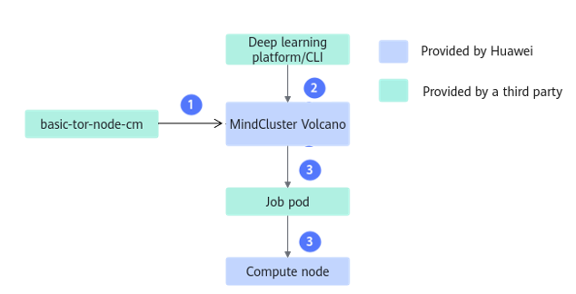
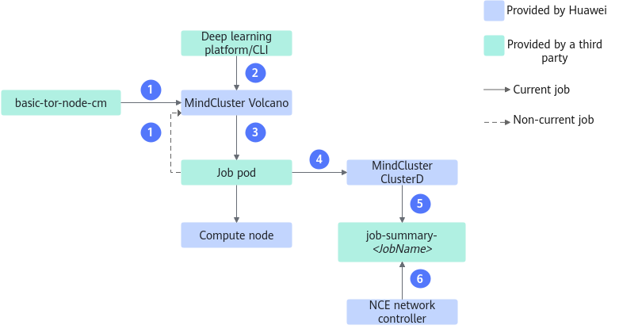

# Node-Based Affinity

## Solution Introduction

To address the issue of downstream traffic conflicts on Spine switches in a Spine-Leaf network architecture, MindCluster provides users with two versions of switch affinity scheduling. To reduce networking costs, MindCluster supports switch affinity scheduling for single-layer networking. To maximize the utilization of the higher-bandwidth SuperPoD UnifiedBus network, MindCluster provides users with logical SuperPoD affinity scheduling. Switch affinity means that there are multiple nodes under a Leaf switch, and the system selects the most appropriate nodes to assign to training tasks based on the configured switch affinity rules.

- Switch Affinity Scheduling 1.0

    Affinity scheduling is performed by Volcano to ensure that traffic during task training does not cause downstream traffic conflicts on Spine switches. Currently supported products are the Atlas training series and Atlas A2 training series; supported frameworks are PyTorch and MindSpore.

- Switch Affinity Scheduling 2.0

    This solution adopts Volcano + iMaster NCE-Fabric. iMaster NCE-Fabric dynamically calculates the network path for training task communication, eliminating the need for the scheduler to resolve downstream traffic conflicts on Spine switches. It also allows nodes under one switch to be used by multiple cross-switch tasks, improving cluster resource utilization. Currently supported products are the Atlas A2 training series; the supported framework is PyTorch.

- Single-Layer Switch Affinity Scheduling

    Supports Atlas 800I A2 inference servers and A200I A2 Box heterogeneous subracks in single-layer networking (only the Leaf layer, without the Spine layer). Single-layer switch affinity scheduling is used to select the most suitable nodes for distributed inference tasks.

- Logical SuperPoD Affinity Scheduling

    For Atlas 900 A3 SuperPoD, when cluster scheduling components dispatch training tasks, they divide the physical SuperPoDs into logical SuperPoDs based on the partitioning policy, which are used for affinity scheduling of training products.

**NOTE**
>
>- Currently, only full-NPU switch affinity scheduling is supported for training and inference tasks. Static or dynamic vNPU scheduling is not supported.
>- Before using switch affinity scheduling 2.0, see the "Parameter Plane Network Configuration Example > Network Configuration Description > NSLB Configuration Policy" and "Configuration Example" sections in the [Ascend Training Solution Networking Guide (Atlas A2 Training Product)](https://support.huawei.com/enterprise/en/doc/EDOC1100570094) to understand the principles and operation instructions of the relevant parameter plane networking.

**Switch Affinity Scheduling 1.0 Flowchart**

For the scheduling logic of switch affinity scheduling 1.0, see [Figure 1](#fig1189110673717).

**Figure 1**  Scheduling process

The steps are described as follows:

1. Volcano reads the `basic-tor-node-cm` file to obtain the cluster topology information in preparation for task scheduling.
2. The user submits a training task from the deep learning platform or via CLI.
3. Based on the information obtained from `basic-tor-node-cm`, Volcano schedules the task Pod to an appropriate compute node and writes the switch status of the current node at the time of Pod scheduling into the task Pod's annotation.

**Switch Affinity Scheduling 2.0 Flowchart**

For the scheduling logic of switch affinity scheduling 2.0, see [Figure 2](#fig178701112193911).

**Figure 2** Scheduling process

The steps are described as follows:

1. Volcano reads the `basic-tor-node-cm` file to obtain the cluster topology information. Volcano reads the annotations on all task Pods in the cluster to obtain the status of each switch in the cluster, preparing for task scheduling.
2. The user submits a training task from the deep learning platform or via CLI.
3. Based on the information obtained from `basic-tor-node-cm`, Volcano schedules the task Pods to appropriate compute nodes and writes the switch status of the current node at the time of scheduling into the annotation of the task Pod.
4. ClusterD detects that the task has been scheduled to appropriate compute nodes through the informer mechanism and aggregates the information of all Pods in the task.
5. ClusterD writes the task information into the `job-summary-_<JobName>_ ConfigMap`.
6. iMaster NCE-Fabric reads the task information from the `job-summary-_<JobName>_ ConfigMap` file and dynamically calculates the network path for communication during the training task.

**Task Description**

Switch affinity scheduling selects different scheduling policies based on the task type. The task type is the value of the `tor-affinity` field in the YAML file for submitting training tasks. Different task types have different replica count requirements for tasks, as described below:

**Table 1** Task type description

|Task Type|Task Label|Task Replica Count|
|--|--|--|
|Normal task|normal-schema|Unlimited|
|Large model task|large-model-schema|Greater than or equal to 4|
|Filler task|large-model-schema|Less than 4|

## Switch Affinity Scheduling 1.0

**Usage Instructions**

- The same switch cannot be invoked by multiple cross-switch tasks simultaneously. When a switch is used only for normal tasks, multiple cross-switch normal tasks are allowed to invoke the switch.
- The switches mentioned in this section are Leaf switches by default.

**Switch Affinity for Normal Tasks**

- When the normal task replica count is less than `M`, where `M` is the node count under a single Leaf switch, nodes under a switch that meets the replica requirement and has the fewest remaining available nodes are prioritized first, followed by nodes under a switch that is not currently in use. When selecting nodes across switches, only switches occupied by general tasks are chosen, and then nodes that will not cause congestion on the Spine switch downlink traffic are selected, with random scheduling as the final fallback.
- When the normal task replica count is greater than or equal to `M`, the scheduling logic for large‑model tasks is applied first. If a suitable node cannot be found, nodes under a switch that meets the replica requirement and has the most available nodes are prioritized, followed by switches occupied only by general tasks when cross‑switch selection is required, then nodes that will not cause Spine downlink congestion, and random scheduling as the final resort.

**Switch Affinity for Large Model Tasks**

- When the replica count of a large model task is less than 4, nodes under a switch that meets the replica requirement and has the fewest remaining available nodes are prioritized first, followed by nodes under a switch that is not currently in use.
- When the replica count of a large model task is greater than or equal to 4 and less than `M`, where `M` is the node count under one Leaf switch, the same priority is given to switches that meet the replica requirement with the fewest remaining available nodes, then to unused switches, and finally to nodes that will not cause congestion on the Spine switch downlink traffic when scheduling across switches.
- When the replica count of a large model task is greater than or equal to `M`, nodes under a switch that meets the replica requirement and has the most available nodes are prioritized first, followed by nodes that will not cause Spine downlink congestion when scheduling across switches.

**Switch Affinity for Filler Tasks**

For filler tasks, nodes under a switch that meets the replica requirement and has the most remaining available nodes are prioritized first, followed by nodes under a switch that is not currently in use.

**Fault Rescheduling**

When a fault occurs on the node where a task is located or on an Ascend AI processor, fault rescheduling is triggered for the task. Before rescheduling, Pods on normal nodes will be scheduled back to their original nodes to continue training, while Pods on the faulty node will select new nodes.

## Switch Affinity Scheduling 2.0

Currently, only the PyTorch framework supports switch affinity scheduling 2.0.

**Usage Instructions**

- The switches mentioned in this chapter default to Leaf switches. Nodes under a single switch can be scheduled by multiple cross-switch tasks.
- A cross-switch task refers to a task whose Pods can be deployed on nodes under multiple switches.
- Switches have the following states. You can query the switch status in the cluster by running the `kubectl describe cm -n volcano-system tor-share-cm` command.

    **NOTE**
    >
    >The key field values in the ConfigMap are described as follows.
    >- `IsSharedTor`: A value of `0` indicates an idle switch; a value of `1` indicates a shared switch; a value of `2` indicates an exclusive switch.
    >- `IsHealthy`: A value of `0` indicates a healthy shared switch; a value of `1` indicates an unhealthy shared switch.

    - Exclusive switch: A switch that has only one cross-switch task under it, and no new cross-switch tasks are allowed to be scheduled to nodes under this switch.
    - Shared switch: A switch used by multiple cross-switch tasks.
        - Healthy shared switch: A switch where the number of shared switches used by the tasks under it meets the cluster's maximum shared switch count requirement.
        - Unhealthy shared switch: A switch where the number of shared switches used by the tasks under it exceeds the cluster's maximum shared switch count requirement.

            > **NOTE**
            >
            >Large model tasks cannot be scheduled to nodes under unhealthy shared switches. Filler tasks and normal tasks can be scheduled to unhealthy shared switches.

    - Idle switch: The nodes under this switch have no tasks or no cross-switch tasks.

- The number of shared switches used by a task cannot exceed the limit on the number of shared switches in the cluster.

**Switch Affinity for Normal Tasks**

- If the cluster resources can satisfy the scheduling logic for large‑model tasks, the scheduling logic for large‑model tasks is used for scheduling.
- If the cluster resources cannot satisfy the scheduling logic for large model tasks, preferentially occupy all idle switches in the cluster and change the switch attribute to `exclusive`; use shared switches for the remaining unscheduled N Pods. The remaining N Pods are preferentially scheduled to nodes under unhealthy shared switches, and then scheduled to nodes under shared switches that only have normal tasks. If there are still Pods that have not been scheduled, change the task status to `Pending`.

**Switch Affinity for Large Model Tasks**

**Table 1** Node affinity policy

|Affinity Scheduling Policy|Details|
|--|--|
|Exclusive switch scheduling policy|Based on the number of available nodes under a switch, nodes under idle switches are fully occupied in descending order until N Pods remain unscheduled or the nodes under a single switch cannot be fully occupied.
The attribute of the fully occupied idle switch is changed to `exclusive` switch. The unscheduled N Pods use shared switches, following the shared switch scheduling policy.
|
|Shared switch scheduling policy|The exclusive switch policy is used first. After nodes under idle switches are fully occupied, if N Pods remain unscheduled, the following shared switch scheduling policies are adopted.<ul><li>When the number of shared switches available for the task in the cluster is 1<ul><li>Select the switch whose node count is closest to N for scheduling.</li><li>If no shared switch meets the requirement, select the idle switch whose node count is closest to N for scheduling, and change the attribute of this switch to `shared`.</li></ul></li><li>When the number of shared switches available for the task in the cluster is 2<ul><li>Select one shared switch whose available node count, or two shared switches whose sum of available node counts, is closest to N for scheduling.</li><li>If the node count of one switch and the combination of two switches are the same, preferentially select the combination of two switches.</li><li>If no shared switch meets the requirement, select the idle and exclusive switch whose node count is closest to N for scheduling, and change the attribute of this switch to `shared`.</li></ul></li></ul>|

**Switch Affinity for Filler Tasks**

Cross-switch scheduling is not allowed. Pods can only be deployed within a single switch. Nodes under the exclusive switch whose node count is closest to the number of task Pods are preferentially selected, nodes under shared switches are secondarily selected, and nodes under idle switches are selected last.

**Fault Rescheduling**

When a fault occurs on the node or Ascend AI Processor where the task is running, the task undergoes fault‑triggered rescheduling. Before rescheduling, Pods on healthy nodes will be scheduled back to their original nodes to continue training, while Pods on faulty nodes will be relocated to new nodes. The rescheduling priority is as follows: first, other nodes under the exclusive switch that was used by the task before rescheduling; second, other nodes under the shared switch that was used by the task before rescheduling; and finally, nodes that were not used before rescheduling.

## Single-Layer Switch Affinity Scheduling

**Usage Instructions**

- Only distributed inference tasks are supported for single-layer switch affinity scheduling.
- The total number of task replicas does not exceed the maximum node count under a single switch.
- Tasks can only be deployed under the same switch.
- On the premise of satisfying task requirements, preferentially select nodes under the switch with fewer remaining nodes.

**Fault Rescheduling**

When a fault occurs on the node or Ascend AI processor where the task is located, the task will undergo fault rescheduling. Before rescheduling, the Pods on the normally running nodes will be scheduled to the original nodes again to continue training, and the Pods on the faulty nodes will be rescheduled to new nodes.

## Logical SuperPoD Affinity Scheduling

**Usage Instructions**

- The number of logical SuperPoDs must be less than the number of physical SuperPoDs.
- Nodes within a logical SuperPoD must be within a physical SuperPoD.
- The rank IDs of NPUs within a logical SuperPoD are consecutive.

**Normal Task Scheduling**

- Logical SuperPoD scheduling preferentially ensures that reserved nodes exist within the physical SuperPoD, and secondarily prioritizes SuperPoDs with fewer remaining nodes.
- You can specify the `sp-block` field in the task YAML to define the number of chips per logical SuperPoD. For a single node, it must match the number of chips requested by the task. For distributed scenarios, it must be an integer multiple of the number of chips per node, and the total number of chips for the task must be an integer multiple of it. If the user does not specify this field, Volcano will set the logical SuperPoD size for this task to the total number of NPUs configured for the task during scheduling.

**Fault Rescheduling**

- If no nodes in the logical SuperPoD have failed, the nodes under that logical SuperPoD must continue to be used during rescheduling.
- If some nodes in the logical SuperPoD become faulty and unavailable, nodes are selected from the physical SuperPoD where they reside, while other nodes remain unchanged.
- If the remaining nodes in the physical SuperPoD can no longer satisfy the logical SuperPoD requirements, all tasks on the logical SuperPoD are scheduled to other physical SuperPoDs.

**MindIE Service Inference Task Scheduling**

For MindIE Service inference tasks, the following affinity scheduling policy is added. For detailed configuration instructions of this affinity scheduling policy, see the [Configuring Instance-Level Affinity Scheduling](../../mindie_motor_best_practice/01_deploying_mindie_motor.md) section.

- You can specify the `sp-block` field in the task YAML. The value of `sp-block` must be consistent with the number of job chips to ensure that the entire job is scheduled to one physical SuperPoD.

- Logical SuperPoD scheduling preferentially ensures that reserved nodes exist within the physical SuperPoD.
- For the same inference task, communication between nodes within the same physical SuperPoD uses the internal HCCS network.

- If `sp-fit` is set to `idlest`, the logical SuperPoD is scheduled to a more idle physical SuperPoD.
- If `sp-fit` is set to `podAffinity`, the logical SuperPoD is scheduled to a physical SuperPoD with more affinity Pods.

## Logical Rack Affinity Scheduling

**Usage Instructions**

- The number of logical racks must be less than the number of physical rack.
- Nodes within a logical rack must be within a physical rack.
- The rank IDs of NPUs within a logical rack are consecutive.

**Normal Task Scheduling**

- You can specify the `ra-block` field in the task YAML to define the number of logical rack chips. For a single node, it must match the number of chips requested by the task. For distributed scenarios, it must be an integer multiple of the node chip count, and the total number of task chips must be an integer multiple of it. If you do not specify this field, Volcano will set the logical rack size of this task to the total number of NPUs on the node during scheduling.

**Fault Rescheduling**

- If all nodes in the logical rack have no faults, the nodes under this logical rack must continue to be used during rescheduling.
- If some nodes in the logical rack become faulty and unavailable, nodes are selected from the physical rack they belong to, while other nodes remain unchanged.
- If the remaining nodes in the physical rack can no longer satisfy the logical rack requirements, all tasks on the logical rack are scheduled to other physical racks.
