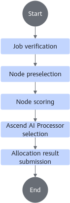
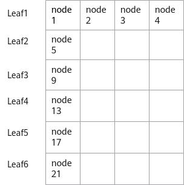
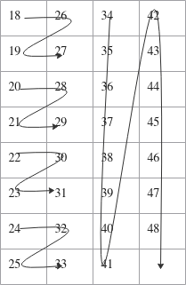
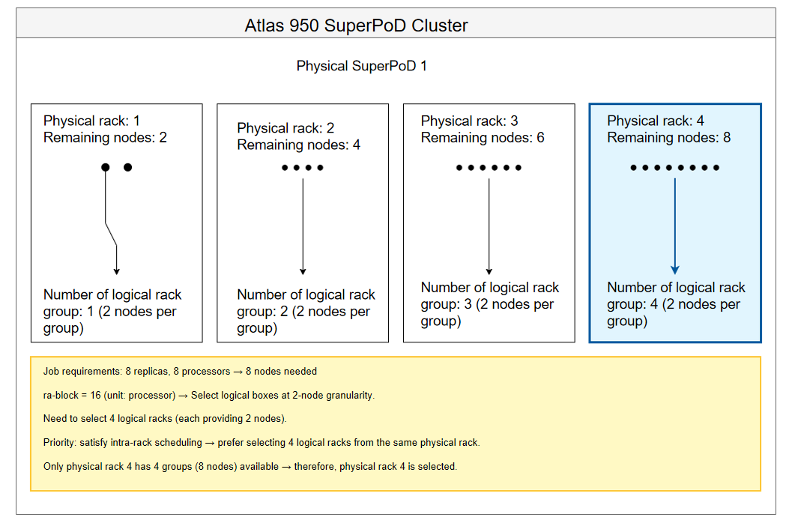

# Scheduling Algorithm of Ascend AI Processor

## Process Introduction

The scheduler's scheduling process mainly includes job validation, node pre-selection, node prioritization, Ascend AI processor selection, and submission of allocation results. For the implementation of Volcano's affinity scheduling code, please refer to the [ascend-for-volcano](https://gitcode.com/Ascend/mind-cluster/tree/master/component/ascend-for-volcano) open-source repository. You can refer to the code to integrate affinity scheduling strategies into your schedulers. The following uses the Ascend AI processor of the Atlas training series products as an example to introduce the Volcano scheduling process.

**Figure 1** Volcano scheduling process

**Process Description**

1. Job validation: Validates the number of Ascend AI processors requested by single-node and distributed jobs.
2. Node pre-selection: Determines whether the number of NPUs on a node meets the job requirements.
3. Node prioritization: Scores the pre-selected nodes based on affinity policies.
4. Ascend AI processor selection: Selects Ascend AI processors on the optimal node.
5. Submit allocation results: Volcano submits the allocation results to Kubernetes.

## Job Validation

**Description**

Determines the number of Ascend AI processors required for a job. For Atlas training series products, the required number of Ascend AI processors can only be 1, 2, 4, or 8.

**Specific Implementation**

For the specific code implementation, refer to the [ValidNPUJob](https://gitcode.com/Ascend/mind-cluster/blob/branch_v26.0.0/component/ascend-for-volcano/internal/npu/base/frame.go) method. The `ValidNPUJob` method is used to validate the rationality of the configuration submitted by the user. At this stage, it does not check whether the actual resources in the cluster environment are sufficient; instead, it simply validates whether the key fields of a job are complete, whether the field value ranges are correct, and whether the fields match each other.

## Node Pre-selection

**Description**

Determine whether a node meets the job requirements based on the number of Ascend AI processors required by a job and the number of available Ascend AI processors on the node. For Atlas training series products, when the job requires 1, 2, or 4 Ascend AI processors, the selection must be made within a single HCCL ring.

For example, if a job requires 4 Ascend AI processors and a node has 4 Ascend AI processors, but these 4 are not in the same HCCL ring—instead, two are in one ring and two are in another—the node will not be selected for job assignment.

**Specific Implementation**

For the specific code implementation, refer to the [CheckNodeNPUByTask](https://gitcode.com/Ascend/mind-cluster/blob/branch_v26.0.0/component/ascend-for-volcano/internal/npu/ascend910/ascend910old/module910x8/frame.go) method. It obtains the number of Ascend AI processors requested by the training job through the `GetTaskReqNPUNum` method, and then obtains the available NPU resources of the node through the `GetUsableTopFromNode` method. The `JudgeNodeAndTaskNPU` method implements the function of determining whether the node's NPU resources meet the job requirements.

## Node Prioritization

**Description**

According to the affinity scheduling strategy, all nodes that pass node pre-selection are scored, and the scheduler selects the final node.

For example, a Pod requires 1 Ascend AI processor. There are two nodes A and B that meet the requirements. On node A, one HCCL ring has 1 remaining Ascend AI processor, while on node B, two rings have 2 and 3 remaining Ascend AI processors respectively. According to the affinity scheduling strategy, node A will receive a higher score.

**Specific Implementation**

For the specific code implementation, refer to the [ScoreBestNPUNodes](https://gitcode.com/Ascend/mind-cluster/blob/branch_v26.0.0/component/ascend-for-volcano/internal/npu/ascend910/ascend910old/module910x8/frame.go) method, where the `getNodeBestScore` method implements node priority determination based on affinity. When selecting nodes, it first checks whether switch affinity scheduling and logical SuperPoD affinity scheduling are configured. If neither switch affinity scheduling nor logical SuperPoD affinity scheduling is configured, the normal node prioritization principle is used.

**Normal Node Prioritization Principle**

A two-dimensional array is used to represent the node's fitness for a job, such as `affScoreList[i][j]`, where `i` represents the number of chips required by one Pod of the job minus 1, `j` represents the number of chips currently available on the node minus 1, and the value of `affScoreList[i][j]` indicates the degree of unfitness of the node.

For example, if the number of chips required by one Pod of the job is 6, nodes with 1 to 5 available chips are completely unsuitable for the scheduling requirement, so their unfitness degree is set to the highest value of 8. A node with 6 available chips exactly meets the scheduling requirement without generating resource fragments, so its unfitness degree is set to the lowest value of 0. For nodes with 7 or 8 available chips, considering the minimization of resource fragments, their unfitness degrees are 1 and 2, respectively. Therefore, it can be deduced:

`affScoreList[5] = []int{8,8,8,8,8,0,1,2}`

Similarly,

`affScoreList[3] = []int{8,8,8,0,1,2,3,4}`

For some products, the total number of chips may vary, or there may be cases such as HCCS rings. This 2D array may be fine-tuned, but the overall logic remains consistent.

**Node Optimization Principles for Switch Affinity Scheduling**

Cluster scheduling components obtain the mapping between nodes and switches across the entire cluster through the `basic-tor` configuration file and retrieve node resources under all idle switches in the Spine network via the chip usage information reported by Ascend Device Plugin. An idle switch in the Spine network refers to a switch that has no jobs, or only has filler jobs that do not use the Spine network.

The idle switch resources are divided into two 2D arrays. One is partitioned horizontally based on the nodes connected under a Leaf switch. The other is partitioned vertically based on the relative positions of nodes within a Leaf switch (nodes at different positions under different Leaf switches can form a logically network-affinity switch). Both 2D arrays are sorted in descending order of remaining nodes. The methods for 2D array partitioning are described as follows:

- Partitioning method 1: Partition by nodes under a Leaf switch, for example, a group like `[node1,node2,node3,node4]`.
- Partitioning method 2: Partition by relative position under a Leaf switch, for example, a group like `[node1,node5,node9,node13,node17,node21]`.

**Figure 1**  2D array partitioning

**Table 1** Node prioritization principles

|Type|Description|Principle|
|--|--|--|
|Filler job|This job can only be dispatched under a single switch|Start from the end of the 2D array to select the first switch that meets the job deployment requirements. If no switch meeting the conditions is found after traversing the entire 2D array, the job waits.|
|Large model job|This job can span multiple switches and must satisfy switch affinity|Select complete switch resources from the beginning of the 2D array. If resources are sufficient, scheduling succeeds; if resources are insufficient, the following two cases apply.<ul><li>When using switch affinity 1.0, partition the remaining switch resources into 2D arrays based on their relative positions under the Leaf switch. Select one from each array in turn until resources are satisfied or data in one array has been exhausted.</li><li>When using switch affinity 2.0, select one from each array in turn until resources are satisfied or data in all arrays has been exhausted. If resources are still insufficient, nodes under non-idle switches in the Spine network can also be selected, and a single job can include at most two non-idle switches in the Spine network.</li></ul>|
|Normal job|This job attempts to satisfy switch affinity as much as possible. When resources are insufficient, random scheduling of the job is allowed|The scheduling logic for the first part of a normal job is the same as that for a large model job, except that when logical switch resources are ultimately still insufficient, random use of remaining nodes is allowed.|

**Logical SuperPoD Affinity Scheduling**

1. Based on the logical SuperPoD size of the job, the remaining SuperPoDs are divided into three queues. Queue 1 consists of SuperPoDs that are greater than or equal to the logical SuperPoD size plus the number of reserved nodes. Queue 2 consists of SuperPoDs that are greater than or equal to the logical SuperPoD size but smaller than the logical SuperPoD size plus the number of reserved nodes. Queue 3 consists of SuperPoDs that are smaller than the logical SuperPoD size.
2. Data from Queue 1 is used first and split into a three‑dimensional array. Taking a logical SuperPoD size of 16, a required number of logical SuperPoDs of 2, and a reserved node count of 2 as an example: first, SuperPoDs are grouped into two‑dimensional arrays according to their available node counts. Each two‑dimensional array contains multiple SuperPoDs with the same node count, making the overall structure a three‑dimensional array. The order in which SuperPoDs are selected is shown in [Figure 2](#fig0751121511273): SuperPoDs with 18 available nodes are preferred first. If none are available, the search proceeds in the order of SuperPoDs with available node counts of 18, 26, 19, 27, and so on up to 33. If no SuperPoD is found, the subsequent preference order follows available node counts of 34, 35, 36, 37, ..., 46, 47, and 48.

    **Figure 2**  SuperPoD prioritization order
    

3. If resources are still insufficient, use the resources in Queue 2. Queue 2 is sorted by the number of remaining nodes in descending order, and SuperPoD selection proceeds from the first entry onward.
4. If resources are still insufficient, and the SuperPoD affinity scheduling policy configured for the job is `Soft` (non-mandatory affinity), use the resources in Queue 3. Queue 3 is sorted by remaining nodes in descending order, and SuperPoD selection proceeds from the first entry onward.

**Logical Rack Affinity Scheduling**

1. Based on the logical rack size of the job, convert the number of nodes required by the job into the number of logical racks required. For example, if the logical rack size is 16 and the total number of chips required by the job is 64, the number of logical racks *X* = 4.
2. Rack affinity scheduling prioritizes scheduling the *X* logical racks required by the job into a single physical rack. For example, if the remaining available nodes in the physical racks of the current SuperPoD are 2, 4, 6, and 8 respectively, the job will be preferentially scheduled to the physical rack with 8 remaining available nodes.

    **Figure 2**  Logical rack prioritization order
    

3. If only physical racks with 2, 4, and 6 remaining available nodes exist in the SuperPoD, then following the principle of minimizing fragmentation, the physical rack with 2 remaining nodes is selected first, followed by the physical rack with 4 remaining nodes, and then the physical rack with 6 remaining nodes.
4. If only physical racks with 2 and 4 remaining available nodes exist in the SuperPoD, and the `Soft` affinity policy is enabled, selection will be made from other SuperPoDs, with the selection strategy being sorted by the number of remaining nodes in ascending order.

## Selecting Ascend AI Processors

**Description**

After obtaining scores through node prioritization, Volcano selects the optimal node for the Pod and binds it. During this process, a callback function can be registered to implement Ascend AI processor selection based on affinity policies.

For example, if a Pod requires 1 Ascend AI processor and the two HCCL rings on the node have 1 and 3 remaining Ascend AI processors respectively, the ring with 1 remaining Ascend AI processor will be selected.

**Specific Implementation**

For specific code implementation, please refer to the [UseAnnotation](https://gitcode.com/Ascend/mind-cluster/blob/branch_v26.0.0/component/ascend-for-volcano/internal/npu/ascend910/ascend910old/module910x8/frame.go) method in the open-source code, where the `SelectNPUFromNode` method implements the function of selecting Ascend AI processors from a node based on affinity.
