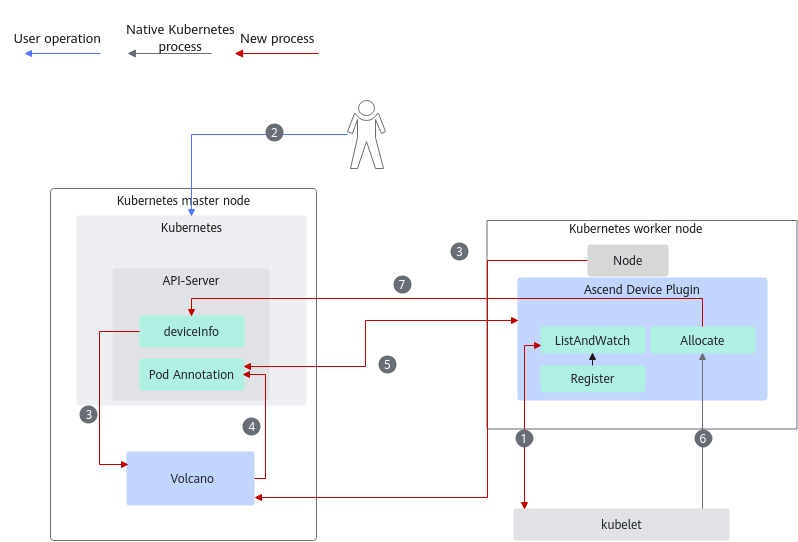
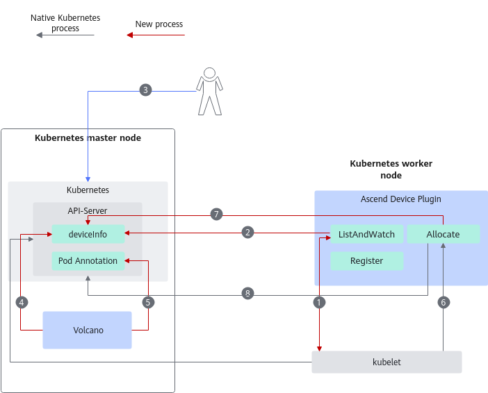
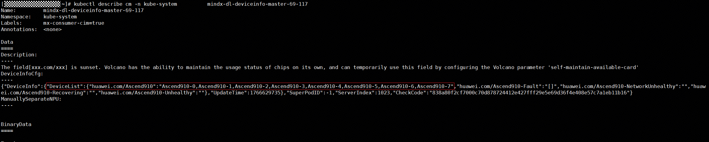
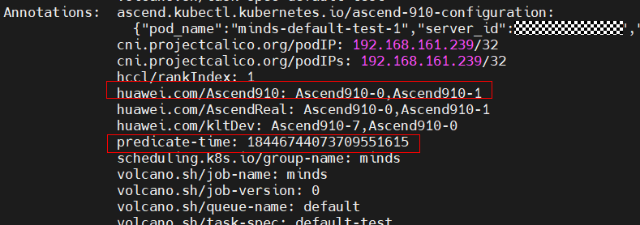

# Scheduling Process of Ascend AI Processors

The overall scheduling logic is shown in the figure below Ascend Device Plugin discovers and reports Ascend AI processor resources, and Volcano is a scheduler adapted and modified by Huawei based on the open-source Volcano framework.

## Scheduling Process

- **Scheduling process 1**

    **Figure 1**  Scheduling process 1
    

    By default, the value of the `self-maintain-available-card` parameter in the Volcano startup YAML is `true`. The scheduling process for Ascend AI processors is as follows:

    1. Ascend Device Plugin reports the health status of Ascend AI processors.
    2. The user calls kube-apiserver to create a service container that uses NPUs, such as a vcjob.
    3. Volcano calculates the currently available Ascend AI processors based on node information and ConfigMap information.
    4. Based on the affinity scheduling principle, Volcano writes the Ascend AI processor allocation into the Pod's annotations, along with the timestamp of the allocation. After writing the resource information Volcano submits a Pod binding request to Kubernetes.
    5. In each information reporting cycle, Ascend Device Plugin reads the chip mount information from the Pod's annotations. If corrections are needed, it updates the Pod's annotations through kube-apiserver. The corrected annotations include: `huawei.com/Resource name`, `huawei.com/AscendReal`, and `ascend.kubectl.kubernetes.io/ascend-910-configuration`.
    6. kubelet detects that a Pod has been scheduled to its node and calls the `Allocate` function of Ascend Device Plugin to mount NPU devices. Mounting NPU devices using Ascend Docker Runtime is also supported.
    7. Ascend Device Plugin queries the list of Pods in `Pending` state on the current node, obtains the Pod with the smallest timestamp after affinity scheduling, retrieves the mounted device ID, and feeds it back to kubelet for device mounting.

- **Scheduling process 2**

    **Figure 2**  Scheduling process 2
    

If the value of the self-maintain-available-card parameter in the Volcano startup YAML is set to false, the scheduling process for Ascend AI processors is as follows:

1. Ascend Device Plugin reports the health status of Ascend AI processors.
2. Ascend Device Plugin writes the information of currently idle Ascend AI processors (healthy Ascend AI processors - used Ascend AI processors) to the `DeviceInfo` field of the ConfigMap `mindx-dl-deviceinfo-{_nodeName_}` through kube-apiserver.
3. The user calls kube-apiserver to create a service container that uses NPUs, such as vcjob.
4. Volcano obtains the currently available Ascend AI processors through `DeviceInfo`.
5. Based on the affinity scheduling principle, Volcano writes the allocation status of Ascend AI processors into the Pod's annotations, along with the timestamp of the allocation. After writing the resource information, Volcano submits a Pod binding request to Kubernetes.
6. kubelet detects that a Pod has been scheduled to its node and calls the `Allocate` function of Ascend Device Plugin to mount NPU devices. Mounting NPU devices using Ascend Docker Runtime is also supported.
7. Ascend Device Plugin queries the list of Pods in `Pending` state on the current node, identifies the Pod with the earliest timestamp after affinity scheduling, obtains the device ID to be mounted, and feeds it back to kubelet for device mounting.
8. Ascend Device Plugin updates the allocatable Ascend AI processors in the `DeviceInfo` field.

## Specific Interaction Field Description

1. Ascend Device Plugin (open-source code version) reports node resources in the form of a ConfigMap, with the resource format being "huawei.com/resource name: resource name + physical ID". The format is shown in [Figure 3](#fig83207421331). The highlighted part in the figure indicates the list of available Ascend AI processors, which is all healthy Ascend AI processors minus those allocated by Volcano. The information of all healthy Ascend AI processors is obtained by calling the NPU driver interface, while the chips allocated by Volcano are identified by traversing all Pods on the current node that meet the conditions—that is, Pods whose status is not `Failed` or `Succeeded`, and whose `Annotations` field contains the Ascend AI processor information allocated by Volcano.

    >[!NOTE]
    >- You can log in to the backend environment and run the `kubectl describe cm mindx-dl-deviceinfo-{nodeName} -n kube-system` command to obtain the reported resource information.
    >- The field `huawei.com/resource name`  is currently being phased out and will not be present in subsequent versions. By default, the available chips on a node are maintained by Volcano, and this field does not take effect. If you need it to take effect, you can modify Volcano's configuration parameter `self-maintain-available-card` to `false`.

    **Figure 3**  Node NPU resource information
    

2. Volcano calculates the currently available Ascend AI processors based on node information and ConfigMap information. (If the Volcano configuration switch `self-maintain-available-card` is disabled, Volcano uses `huawei.com/Resource name` as the key and the `DeviceInfo` as the basis for available Ascend AI processors.) After determining the Ascend AI processors that meet the affinity rules required by the job (i.e., the Ascend AI processors allocated to the job) according to the affinity scheduling policy, Volcano writes the allocated chip information into the `Annotations` of the job Pod, as shown in the first highlighted part of [Figure 4](#fig29119551778); the second field to be written is `predicate-time`, which indicates the current time when resources are allocated to the job. It does not need to be converted to a human-readable time format, only needs to be comparable in size. kubelet detects that a Pod has been scheduled to its node and calls the `Allocate` function of the Device-plugin to mount the NPU device.

    **Figure 4**  NPU information allocated to a Pod
    

3. When Ascend Device Plugin receives an `Allocate` request (taking a 2-processor job as an example), the input parameters for `Allocate` are randomly assigned by kubelet, as shown in the `huawei.com/kltDev` field in [Figure 4](#fig29119551778). These may be Ascend AI processor IDs that do not comply with affinity rules, such as `Ascend910-7` and `Ascend910-0`.

    At this point, Ascend Device Plugin will find all Pods on the current node that meet the conditions (Pods whose status is not `Failed` or `Succeeded`), and the `Annotations` of the Pod contains the allocated Ascend AI processor IDs written by Volcano. The number of Ascend AI processors must be consistent with the number of Ascend AI processors allocated by kubelet.

    From the Pods that meet the conditions, select the Pod with the smallest `predicate-time`, and change the `predicate-time` of this Pod to the maximum Uint value (to avoid selecting it again next time). Parse the `Annotations` field of the Pod to obtain the Ascend AI processor information allocated by Volcano, such as `Ascend910-0` and `Ascend910-1`, return their corresponding mount path information, and write the actually allocated Ascend AI processor information into the `huawei.com/AscendReal` field in the Pod's `Annotations`.
